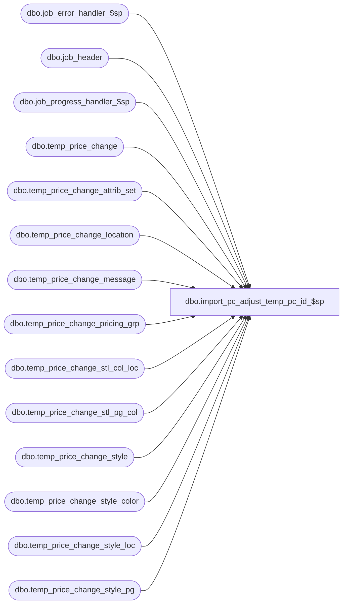

# dbo.import_pc_adjust_temp_pc_id_$sp

**Database:** me_01  
**Server:** bedrockdb02  

## Architecture Diagram



## Table Dependencies

| Referenced Table |
|---|
| dbo.job_error_handler_$sp |
| dbo.job_header |
| dbo.job_progress_handler_$sp |
| dbo.temp_price_change |
| dbo.temp_price_change_attrib_set |
| dbo.temp_price_change_location |
| dbo.temp_price_change_message |
| dbo.temp_price_change_pricing_grp |
| dbo.temp_price_change_stl_col_loc |
| dbo.temp_price_change_stl_pg_col |
| dbo.temp_price_change_style |
| dbo.temp_price_change_style_color |
| dbo.temp_price_change_style_loc |
| dbo.temp_price_change_style_pg |

## Stored Procedure Code

```sql
Create PROCEDURE [dbo].[import_pc_adjust_temp_pc_id_$sp]
	(@job_id INT)

AS

/*
	Description	: This procedure is part of the PC import and it's called by import_asn_batch_$sp. It doesn the adjustment of 
				  IDs in the detail temp tables related to a specific job_id.		  
	2/22/2014   Ivan D. 			Add support for importing price change attributes
*/

BEGIN

	DECLARE @line_id SMALLINT, @proc_name NVARCHAR(30), @sql_err_num DECIMAL(38,0), @table_name NVARCHAR(30), 
			@operation_name	NVARCHAR(30), @error_msg NVARCHAR(2000), @job_type TINYINT, @c_true BIT, @c_false BIT,
			@debug_flag BIT, @job_debug_flag BIT, @temp_price_change_id DECIMAL(13,0), @style_id DECIMAL(12,0),
			@color_id SMALLINT, @location_id SMALLINT, @last_generated_id DECIMAL(13,0), @pricing_group_id SMALLINT,
			@pc_flag BIT, @pc_detail_flag BIT, @parent_id DECIMAL(12,0), @parent_type SMALLINT, @message_type_id DECIMAL(12,0), @message NVARCHAR(255)


	SELECT   @job_type		= 30
			, @proc_name	= N'import_pc_adjust_temp_asn_id_$sp'
			, @c_false		= 0
			, @c_true		= 1
			, @line_id		= 10
			, @last_generated_id = 1
			, @pc_flag = 0
			, @pc_detail_flag = 0
	

	BEGIN TRY
		-- Get parameters associates to the current job
		SELECT @job_debug_flag = debug_flag
		FROM job_header
		WHERE job_id = @job_id
		AND job_type = @job_type

		-- Log progress if job_params.debug_flag is true 
		EXEC job_progress_handler_$sp @job_type, @job_id, @proc_name, @line_id, @job_debug_flag

		SET @line_id = 20
		DECLARE crs_pc CURSOR FOR 
		SELECT temp_price_change_id
		FROM temp_price_change
		WHERE job_id = @job_id
		ORDER BY temp_price_change_id
		     		
		OPEN crs_pc
		SET @pc_flag = 1

		-- Log progress if job_params.debug_flag is true 
		EXEC job_progress_handler_$sp @job_type, @job_id, @proc_name, @line_id, @job_debug_flag

		SET @line_id = 30

		FETCH NEXT FROM crs_pc 
			INTO @temp_price_change_id
	
		WHILE @@Fetch_Status = 0
		BEGIN
---------------
			--Update temp_price_change_style
			--SET @last_generated_id = @temp_price_change_id * 1000000 
			
			SET @line_id = 40
			UPDATE t 
			SET temp_price_change_style_id = t.temp_price_change_id * 1000000 + seq
			FROM temp_price_change_style t, (SELECT t2.*,ROW_NUMBER() over (order by style_id) seq
												FROM temp_price_change_style t2	
												WHERE t2.job_id = @job_id
												AND t2.temp_price_change_id = @temp_price_change_id							 
												) t_seq
			WHERE t.temp_price_change_id = t_seq.temp_price_change_id
			AND t_seq.style_id = t.style_id
			AND t.job_id = t_seq.job_id
			AND t.job_id = @job_id
			AND t.temp_price_change_id = @temp_price_change_id
			
			SET @last_generated_id = @@ROWCOUNT

			

-------------
			--Update temp_price_change_style_color
			SET @line_id = 50
			UPDATE t 
			SET temp_price_change_style_color_id = t.temp_price_change_id * 1000000 + @last_generated_id + seq
			FROM temp_price_change_style_color t (tablockx), (SELECT t2.*,ROW_NUMBER() over (order by temp_price_change_style_id, color_id) seq
												FROM temp_price_change_style_color t2	
												WHERE t2.job_id = @job_id
												AND t2.temp_price_change_id = @temp_price_change_id							 
												) t_seq
			WHERE t.temp_price_change_id = t_seq.temp_price_change_id
			AND t.temp_price_change_style_id = t_seq.temp_price_change_style_id
			AND t_seq.color_id = t.color_id
			AND t.job_id = t_seq.job_id
			AND t.job_id = @job_id
			AND t.temp_price_change_id = @temp_price_change_id
			
			SET @last_generated_id = @last_generated_id + @@ROWCOUNT

-------------
			--Update temp_price_change_style_loc
			SET @line_id = 60
			UPDATE t 
			SET temp_price_change_style_loc_id = t.temp_price_change_id * 1000000 + @last_generated_id + seq
			FROM temp_price_change_style_loc t (tablockx), (SELECT t2.*,ROW_NUMBER() over (order by temp_price_change_style_id, location_id ) seq
												FROM temp_price_change_style_loc t2	
												WHERE t2.job_id = @job_id
												AND t2.temp_price_change_id = @temp_price_change_id							 
												) t_seq
			WHERE t.temp_price_change_id = t_seq.temp_price_change_id
			AND t.temp_price_change_style_id = t_seq.temp_price_change_style_id
			AND t_seq.location_id = t.location_id
			AND t.job_id = t_seq.job_id
			AND t.job_id = @job_id
			AND t.temp_price_change_id = @temp_price_change_id
			
			SET @last_generated_id = @last_generated_id + @@ROWCOUNT

-------------
			--Update temp_price_change_style_pg
			SET @line_id = 70
			UPDATE t 
			SET temp_price_change_style_pg_id = t.temp_price_change_id * 1000000 + @last_generated_id + seq
			FROM temp_price_change_style_pg t (tablockx), (SELECT t2.*,ROW_NUMBER() over (order by temp_price_change_style_id, pricing_group_id ) seq
												FROM temp_price_change_style_pg t2	
												WHERE t2.job_id = @job_id
												AND t2.temp_price_change_id = @temp_price_change_id							 
												) t_seq
			WHERE t.temp_price_change_id = t_seq.temp_price_change_id
			AND t.temp_price_change_style_id = t_seq.temp_price_change_style_id
			AND t_seq.pricing_group_id = t.pricing_group_id
			AND t.job_id = t_seq.job_id
			AND t.job_id = @job_id
			AND t.temp_price_change_id = @temp_price_change_id
			
			SET @last_generated_id = @last_generated_id + @@ROWCOUNT
			

-------------
			--Update temp_price_change_stl_pg_col
			SET @line_id = 80
			UPDATE t 
			SET temp_price_change_stl_pg_col_id = t.temp_price_change_id * 1000000 + @last_generated_id + seq
			FROM temp_price_change_stl_pg_col t (tablockx), (SELECT t2.*,ROW_NUMBER() over (order by temp_price_change_style_id,pricing_group_id, color_id ) seq
												FROM temp_price_change_stl_pg_col t2	
												WHERE t2.job_id = @job_id
												AND t2.temp_price_change_id = @temp_price_change_id							 
												) t_seq
			WHERE t.temp_price_change_id = t_seq.temp_price_change_id
			AND t.temp_price_change_style_id = t_seq.temp_price_change_style_id
			AND t_seq.pricing_group_id = t.pricing_group_id
			AND t.color_id = t_seq.color_id
			AND t.job_id = t_seq.job_id
			AND t.job_id = @job_id
			AND t.temp_price_change_id = @temp_price_change_id
			
			SET @last_generated_id = @last_generated_id + @@ROWCOUNT
			

-------------
			--Update temp_price_change_stl_col_loc
			SET @line_id = 90
			UPDATE t 
			SET temp_price_change_stl_col_loc_id = t.temp_price_change_id * 1000000 + @last_generated_id + seq
			FROM temp_price_change_stl_col_loc t (tablockx), (SELECT t2.*,ROW_NUMBER() over (order by temp_price_change_style_id, location_id, color_id) seq
												FROM temp_price_change_stl_col_loc t2	
												WHERE t2.job_id = @job_id
												AND t2.temp_price_change_id = @temp_price_change_id							 
												) t_seq
			WHERE t.temp_price_change_id = t_seq.temp_price_change_id
			AND t.temp_price_change_style_id = t_seq.temp_price_change_style_id
			AND t_seq.location_id = t.location_id
			AND t.color_id = t_seq.color_id
			AND t.job_id = t_seq.job_id
			AND t.job_id = @job_id
			AND t.temp_price_change_id = @temp_price_change_id
			
			SET @last_generated_id = @last_generated_id + @@ROWCOUNT


-------------
			--Update temp_price_change_pricing_grp
			SET @line_id = 100
			UPDATE t 
			SET temp_price_change_pricing_grp_id = t.temp_price_change_id * 1000000 + @last_generated_id + seq
			FROM temp_price_change_pricing_grp t (tablockx), (SELECT t2.*,ROW_NUMBER() over (order by pricing_group_id) seq
												FROM temp_price_change_pricing_grp t2	
												WHERE t2.job_id = @job_id
												AND t2.temp_price_change_id = @temp_price_change_id							 
												) t_seq
			WHERE t.temp_price_change_id = t_seq.temp_price_change_id
			AND t.pricing_group_id = t_seq.pricing_group_id
			AND t.job_id = t_seq.job_id
			AND t.job_id = @job_id
			AND t.temp_price_change_id = @temp_price_change_id
			
			SET @last_generated_id = @last_generated_id + @@ROWCOUNT


-------------
			SET @line_id = 110
			--Update temp_price_change_location
			UPDATE t 
			SET temp_price_change_location_id = t.temp_price_change_id * 1000000 + @last_generated_id + seq
			FROM temp_price_change_location t (tablockx), (SELECT t2.*,ROW_NUMBER() over (order by location_id) seq
												FROM temp_price_change_location t2	
												WHERE t2.job_id = @job_id
												AND t2.temp_price_change_id = @temp_price_change_id							 
												) t_seq
			WHERE t.temp_price_change_id = t_seq.temp_price_change_id
			AND t.location_id = t_seq.location_id
			AND t.job_id = t_seq.job_id
			AND t.job_id = @job_id
			AND t.temp_price_change_id = @temp_price_change_id
			
			SET @last_generated_id = @last_generated_id + @@ROWCOUNT


-------------
			SET @line_id = 120
			--Update temp_price_change_message
			
			UPDATE t 
			SET temp_price_change_message_id = t.temp_price_change_id * 1000000 + @last_generated_id + seq
			FROM temp_price_change_message t (tablockx), (SELECT t2.*,ROW_NUMBER() over (order by parent_id, message) seq
												FROM temp_price_change_message t2	
												WHERE t2.job_id = @job_id
												AND t2.temp_price_change_id = @temp_price_change_id							 
												) t_seq
			WHERE t.temp_price_change_id = t_seq.temp_price_change_id
			AND t.message = t_seq.message
			AND t.message_type_id = t_seq.message_type_id
			AND t.parent_id = t_seq.parent_id
			AND t.job_id = t_seq.job_id
			AND t.job_id = @job_id
			AND t.temp_price_change_id = @temp_price_change_id
			
			SET @last_generated_id = @last_generated_id + @@ROWCOUNT
			
-------------
			SET @line_id = 125
			--Update temp_price_change_attrib_set
			
			UPDATE t 
			SET temp_price_change_attrib_set_id = t.temp_price_change_id * 1000000 + @last_generated_id + seq
			FROM temp_price_change_attrib_set t (tablockx), (SELECT t2.*,ROW_NUMBER() over (order by attribute_id, attribute_set_id) seq
												FROM temp_price_change_attrib_set t2	
												WHERE t2.job_id = @job_id
												AND t2.temp_price_change_id = @temp_price_change_id							 
												) t_seq
			WHERE t.temp_price_change_id = t_seq.temp_price_change_id
			AND t.attribute_set_id = t_seq.attribute_set_id
			AND t.attribute_id = t_seq.attribute_id	
			AND t.job_id = t_seq.job_id
			AND t.job_id = @job_id
			AND t.temp_price_change_id = @temp_price_change_id
			
			SET @last_generated_id = @last_generated_id + @@ROWCOUNT
			

-------------
			SET @line_id = 130
			-- Update last_item_id
			UPDATE temp_price_change
			SET last_item_id = @last_generated_id 
			WHERE temp_price_change_id = @temp_price_change_id

			FETCH NEXT FROM crs_pc 
				INTO @temp_price_change_id
		END 
		
		CLOSE crs_pc
		DEALLOCATE crs_pc
		SET @pc_flag = 0

--------------
		-- Update temp_price_change_style_id for exception tables, currently it has the style_id
		SET @line_id = 140	
		
		UPDATE t
		SET temp_price_change_style_id = ts.temp_price_change_style_id
		FROM temp_price_change_style_loc t, temp_price_change_style ts
		WHERE t.job_id = @job_id
		AND ts.job_id = @job_id
		AND t.temp_price_change_id = ts.temp_price_change_id
		AND t.temp_price_change_style_id = ts.style_id
		
		UPDATE t
		SET temp_price_change_style_id = ts.temp_price_change_style_id
		FROM temp_price_change_style_color t, temp_price_change_style ts
		WHERE t.job_id = @job_id
		AND ts.job_id = @job_id
		AND t.temp_price_change_id = ts.temp_price_change_id
		AND t.temp_price_change_style_id = ts.style_id
		
		UPDATE t
		SET temp_price_change_style_id = ts.temp_price_change_style_id
		FROM temp_price_change_style_pg t, temp_price_change_style ts
		WHERE t.job_id = @job_id
		AND ts.job_id = @job_id
		AND t.temp_price_change_id = ts.temp_price_change_id
		AND t.temp_price_change_style_id = ts.style_id
		
		UPDATE t
		SET temp_price_change_style_id = ts.temp_price_change_style_id
		FROM temp_price_change_stl_col_loc t, temp_price_change_style ts
		WHERE t.job_id = @job_id
		AND ts.job_id = @job_id
		AND t.temp_price_change_id = ts.temp_price_change_id
		AND t.temp_price_change_style_id = ts.style_id
		
		UPDATE t
		SET temp_price_change_style_id = ts.temp_price_change_style_id
		FROM temp_price_change_stl_pg_col t, temp_price_change_style ts
		WHERE t.job_id = @job_id
		AND ts.job_id = @job_id
		AND t.temp_price_change_id = ts.temp_price_change_id
		AND t.temp_price_change_style_id = ts.style_id

		-- Update temp_price_change_style_id for detail messages, currently it has the style_id
		UPDATE t
		SET parent_id = ts.temp_price_change_style_id
		FROM temp_price_change_message t, temp_price_change_style ts
		WHERE t.job_id = @job_id
		AND ts.job_id = @job_id
		AND t.parent_type=2 -- detail
		AND t.temp_price_change_id = ts.temp_price_change_id
		AND t.parent_id = ts.style_id
		
	END TRY
	BEGIN CATCH

		SELECT @error_msg		= ERROR_MESSAGE()
			 , @sql_err_num		= ERROR_NUMBER()

		IF @pc_flag = 1
		BEGIN
			CLOSE crs_pc
			DEALLOCATE crs_pc
		END
		IF @pc_detail_flag = 1
		BEGIN
			CLOSE crs_pc_detail
			DEALLOCATE crs_pc_detail
		END

		IF @line_id = 10
			SELECT @table_name		= N'job_header',
				 @operation_name	= N'SELECT'
		ELSE IF (@line_id = 20 OR @line_id = 30)
			SELECT @table_name		= N'temp_price_change',
				 @operation_name	= N'OPEN CURSOR'
		ELSE IF @line_id = 40
			SELECT @table_name		= N'temp_price_change_style',
				 @operation_name	= N'UPDATE'
		ELSE IF @line_id = 50
			SELECT @table_name		= N'temp_price_change_style_color',
				 @operation_name	= N'UPDATE'
		ELSE IF @line_id = 60
			SELECT @table_name		= N'temp_price_change_style_loc',
				 @operation_name	= N'UPDATE'
		ELSE IF @line_id = 70
			SELECT @table_name		= N'temp_price_change_style_pg',
				 @operation_name	= N'UPDATE'
		ELSE IF @line_id = 80
			SELECT @table_name		= N'temp_price_change_stl_pg_col',
				 @operation_name	= N'UPDATE'
		ELSE IF @line_id = 90
			SELECT @table_name		= N'temp_price_change_stl_col_loc',
				 @operation_name	= N'UPDATE'
		ELSE IF @line_id = 100
			SELECT @table_name		= N'temp_price_change_pricing_grp',
				 @operation_name	= N'UPDATE'
		ELSE IF @line_id = 110
			SELECT @table_name		= N'temp_price_change_location',
				 @operation_name	= N'UPDATE'
		ELSE IF @line_id = 120
			SELECT @table_name		= N'temp_price_change_message',
				 @operation_name	= N'UPDATE'
		ELSE IF @line_id = 130
			SELECT @table_name		= N'temp_price_change',
				 @operation_name	= N'UPDATE'
		ELSE IF @line_id = 140
			SELECT @table_name		= N'temp_price_change_exceptions_tables',
				 @operation_name	= N'UPDATE'

		
	
				 
		EXEC job_error_handler_$sp
					  @job_type 
					, @job_id 
					, @proc_name 
					, @line_id 
					, @sql_err_num 
					, @table_name 
					, @operation_name 
					, @error_msg 
					, @c_true
	END CATCH
END
```

