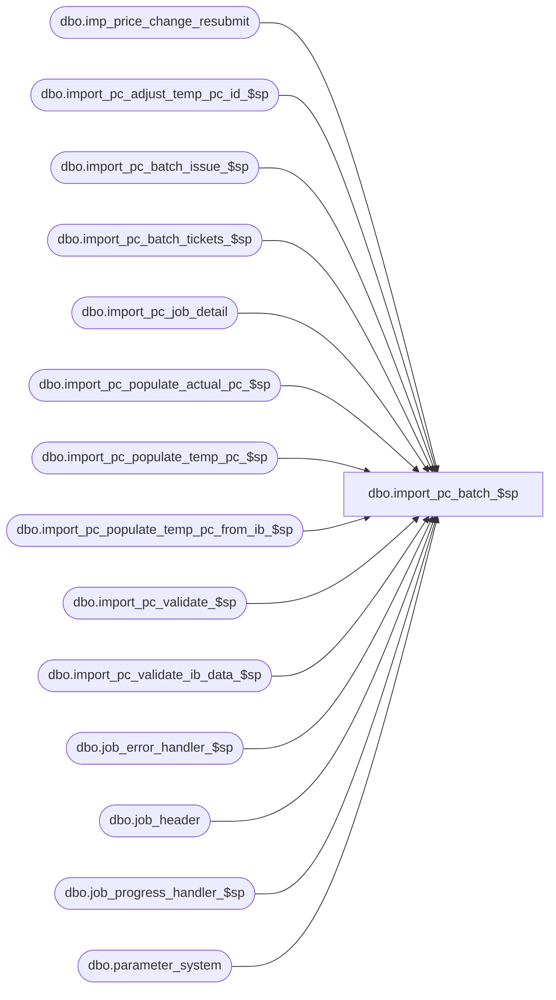

# dbo.import_pc_batch_$sp

**Database:** me_01  
**Server:** bedrockdb02  

## Architecture Diagram



## Table Dependencies

| Referenced Table |
|---|
| dbo.imp_price_change_resubmit |
| dbo.import_pc_adjust_temp_pc_id_$sp |
| dbo.import_pc_batch_issue_$sp |
| dbo.import_pc_batch_tickets_$sp |
| dbo.import_pc_job_detail |
| dbo.import_pc_populate_actual_pc_$sp |
| dbo.import_pc_populate_temp_pc_$sp |
| dbo.import_pc_populate_temp_pc_from_ib_$sp |
| dbo.import_pc_validate_$sp |
| dbo.import_pc_validate_ib_data_$sp |
| dbo.job_error_handler_$sp |
| dbo.job_header |
| dbo.job_progress_handler_$sp |
| dbo.parameter_system |

## Stored Procedure Code

```sql
CREATE PROCEDURE [dbo].[import_pc_batch_$sp]
	(@job_id INT, @issue_and_effect BIT=0)

AS

/*
	Version		: 1.00
	Created		: Oct 2010
	Created by	: Ivan Dimitrov
	Description	: This procedure is part of the import Price Change process, it executes the import of PC for each job that are incomplete in the job_header table.	
			  It's launched by a .NET application that manages the execution of many instances in parallel.	
        History         : version 1.01 Modified	on Mar. 7, 2012 Defect 133665 - system allows a md pc import successfully even those the new price > current retail.

*/

BEGIN
	DECLARE @line_id SMALLINT, @count INT, @job_type TINYINT, @proc_name NVARCHAR(30), @sql_err_num DECIMAL(38,0),
			@table_name NVARCHAR(30), @operation_name NVARCHAR(30), @error_msg NVARCHAR(2000), @return_flag BIT,
			@debug_flag BIT, @c_true BIT, @c_false BIT, @n_retry tinyint, @delay NCHAR(8)

	SELECT @job_type		= 30
		, @proc_name		= N'import_pc_batch_$sp'
		, @c_false		= 0
		, @c_true		= 1
		, @n_retry		= 0
		, @delay	= N'00:00:05';
 
	BEGIN TRY

		-- Get job parameters
		SET @line_id = 10;

		SELECT @debug_flag	= debug_flag
		FROM job_header
		WHERE job_id = @job_id
		AND job_type = @job_type;

		IF @@ROWCOUNT = 0 
			RAISERROR (N'Error: job #%i is missing in the job_header table.', -- Message text.
               16, -- Severity.
               1, -- State.
               @job_id);

		-- Log progress if job_params.debug_flag is true OR job_header.debug_flag is true
		EXEC job_progress_handler_$sp @job_type, @job_id, @proc_name, @line_id, @debug_flag;

		SET @line_id = 20;
		-- Set start_time for the current job
		BEGIN TRANSACTION;
		
		UPDATE job_header
		SET start_time = GETDATE()
		WHERE job_id = @job_id 
		AND job_type = @job_type;

		IF @@ROWCOUNT = 0 
			RAISERROR (N'Error: unable to set the start_time for job #%i.', -- Message text.
					16, -- Severity.
					1, -- State.
					@job_id);
		
		COMMIT TRANSACTION;

		-- Log progress if job_params.debug_flag is true OR job_header.debug_flag is true
		EXEC job_progress_handler_$sp @job_type, @job_id, @proc_name, @line_id, @debug_flag;

		SELECT @count = COUNT(*) FROM import_pc_job_detail WHERE job_id = @job_id;	
		-- validations have to take place only this first time a job processed
		-- once one of the transactions is completed it means it's re-processing and the validations could be skipped.
		IF (@count = 0) 
		BEGIN
			SET @line_id = 30;
				
			EXEC import_pc_validate_$sp @job_id; 

			-- Log progress if job_params.debug_flag is true OR job_header.debug_flag is true
			EXEC job_progress_handler_$sp @job_type, @job_id, @proc_name, @line_id, @debug_flag;
		END;
		
		SET @line_id = 40;
		
		EXEC dbo.import_pc_populate_temp_pc_$sp @job_id; 
		
		-- Log progress if job_params.debug_flag is true OR job_header.debug_flag is true
		EXEC job_progress_handler_$sp @job_type, @job_id, @proc_name, @line_id, @debug_flag;

		
		SET @line_id = 45;
		
		--UPDATE STATISTICS temp_price_change;
		--UPDATE STATISTICS temp_price_change_location;
		--UPDATE STATISTICS temp_price_change_style;
		--UPDATE STATISTICS temp_price_change_style_color;
		--UPDATE STATISTICS temp_price_change_style_loc;
		--UPDATE STATISTICS temp_price_change_style_pg;
		--UPDATE STATISTICS temp_price_change_stl_pg_col;
		--UPDATE STATISTICS temp_price_change_stl_col_loc;
		
		-- Log progress if job_params.debug_flag is true OR job_header.debug_flag is true
		EXEC job_progress_handler_$sp @job_type, @job_id, @proc_name, @line_id, @debug_flag;

		
		
		SET @line_id = 50;
		
		EXEC dbo.import_pc_populate_temp_pc_from_ib_$sp @job_id; 
		
		-- Log progress if job_params.debug_flag is true OR job_header.debug_flag is true
		EXEC job_progress_handler_$sp @job_type, @job_id, @proc_name, @line_id, @debug_flag;

		SET @line_id = 52;
		
		EXEC dbo.import_pc_validate_ib_data_$sp @job_id; 
		
		-- Log progress if job_params.debug_flag is true OR job_header.debug_flag is true
		EXEC job_progress_handler_$sp @job_type, @job_id, @proc_name, @line_id, @debug_flag;

		SET @line_id = 60;
		
		EXEC dbo.import_pc_adjust_temp_pc_id_$sp @job_id; 
		
		-- Log progress if job_params.debug_flag is true OR job_header.debug_flag is true
		EXEC job_progress_handler_$sp @job_type, @job_id, @proc_name, @line_id, @debug_flag;
			
		
		-- Do only the steps that wasn't done previously (re-startability)
		SELECT @count = COUNT(*) FROM import_pc_job_detail WHERE job_id = @job_id;

		IF @count = 0 
		BEGIN
			SELECT @line_id	= 80, @n_retry	= 0;
			
			-- First step: Populate actual tables

			step_1:
			BEGIN TRY
				BEGIN TRAN	 
				SET @line_id = 70;
				EXEC import_pc_populate_actual_pc_$sp @job_id;
				
				-- Log progress if job_params.debug_flag is true OR job_header.debug_flag is true
				EXEC job_progress_handler_$sp @job_type, @job_id, @proc_name, @line_id, @debug_flag;
				
				
		
				-- this combination of RTP parameters implies that RTP is turned off:  
				--  RTP GEN ON PRICE CHANGE APPROVED = false and ALLOW OVERRIDE=false
				IF ((SELECT COUNT(*) FROM parameter_system WHERE parameter_system_id=1 AND 
					rtp_gen_upon_pc_appr_flag = 0 AND rtp_allow_override_flag = 0) = 0)
				BEGIN
	   				SET @line_id = 80;
	   				
      				-- insert into ticket printing tables
	         		EXEC dbo.import_pc_batch_tickets_$sp @job_id, @debug_flag;
		
         			-- Log progress if job_params.debug_flag is true OR job_header.debug_flag is true
					EXEC job_progress_handler_$sp @job_type, @job_id, @proc_name, @line_id, @debug_flag;
				END
			   
				COMMIT TRANSACTION;
			
				-- update job header
				UPDATE job_header
				SET completed_flag = 1,
					end_time = GETDATE()
				WHERE job_id = @job_id
				
				-- remove this job from the resubmit table
				DELETE FROM imp_price_change_resubmit 
				WHERE job_id = @job_id;
				
			END TRY
			BEGIN CATCH
				SELECT @error_msg = N'Error ' + CAST(ERROR_NUMBER() AS NVARCHAR(20)) + N' : in the first step of job #%i after 3 retry because of ' + ERROR_MESSAGE();
					
				IF (XACT_STATE()) = -1
					ROLLBACK TRANSACTION;
			
				SET @n_retry = @n_retry + 1;

				IF @n_retry <= 3 
				BEGIN	
					WAITFOR DELAY @delay
					GOTO step_1
				END
				ELSE
				RAISERROR (@error_msg, 
							16, -- Severity.
							1, -- State.
							@job_id);

			END CATCH
			
		
			IF (@issue_and_effect = 1)
			BEGIN
				SET @line_id = 90;

			    /* Issue these price changes. This proc does its own transactions...
					Historically, the old pipeline segment would do the import, issue, and, effect as three different steps, so if
					one part failed, it would not roll back the rest of it.
			     */
         		EXEC dbo.import_pc_batch_issue_$sp @job_id, @debug_flag;

     			-- Log progress if job_params.debug_flag is true OR job_header.debug_flag is true
				EXEC job_progress_handler_$sp @job_type, @job_id, @proc_name, @line_id, @debug_flag;
			END
			
			
		END 
			 
	
			
	END TRY
	BEGIN CATCH
		SELECT @error_msg		= ERROR_MESSAGE()
			 , @sql_err_num		= ERROR_NUMBER()

		-- Test if the transaction is uncommittable.
		IF (XACT_STATE()) = -1
			ROLLBACK TRANSACTION

		-- Test if the transaction is active and valid.
		IF (XACT_STATE()) = 1
			COMMIT TRANSACTION

		IF @line_id = 10	
			SELECT  @table_name			= N'job_header'
					, @operation_name	= N'SELECT'
		ELSE IF @line_id = 20
			SELECT  @table_name			= N'job_header'
					, @operation_name	= N'UPDATE'
		ELSE IF @line_id = 30
			SELECT  @table_name			= N'import_pc_validate_$sp'
					, @operation_name	= N'EXECUTE'	
		ELSE IF @line_id = 40
			SELECT  @table_name			= N'import_pc_populate_temp_pc_$sp'
					, @operation_name	= N'EXECUTE'
		ELSE IF @line_id = 50
			SELECT  @table_name			= N'import_pc_populate_temp_pc_from_ib_$sp'
					, @operation_name	= N'EXECUTE'
		ELSE IF @line_id = 52  
			SELECT  @table_name			= N'import_pc_validate_ib_data_$sp'
					, @operation_name	= N'EXECUTE'
		ELSE IF @line_id = 60
			SELECT  @table_name			= N'import_pc_adjust_temp_pc_id_$sp'
					, @operation_name	= N'EXECUTE'
		ELSE IF @line_id = 70
			SELECT  @table_name			= N'import_pc_populate_actual_pc_$sp'
					, @operation_name	= N'EXECUTE'
		ELSE IF @line_id = 80
			SELECT  @table_name			= N'import_pc_batch_tickets_$sp'
					, @operation_name	= N'EXECUTE'
		ELSE IF @line_id = 90
			SELECT  @table_name			= N'import_pc_batch_issue_$sp'
					, @operation_name	= N'EXECUTE'


		EXEC job_error_handler_$sp 
					@job_type 
					, @job_id 
					, @proc_name 
					, @line_id 
					, @sql_err_num 
					, @table_name 
					, @operation_name 
					, @error_msg 
					, @c_false;

	END CATCH
END
```

