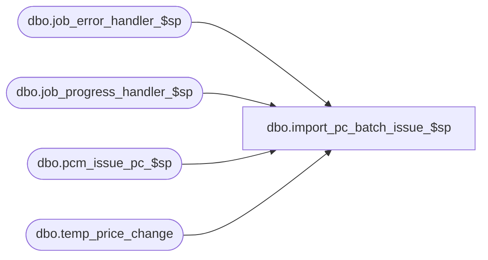

# dbo.import_pc_batch_issue_$sp

**Database:** me_01  
**Server:** bedrockdb02  

## Architecture Diagram



## Table Dependencies

| Referenced Table |
|---|
| dbo.job_error_handler_$sp |
| dbo.job_progress_handler_$sp |
| dbo.pcm_issue_pc_$sp |
| dbo.temp_price_change |

## Stored Procedure Code

```sql
CREATE PROCEDURE [dbo].[import_pc_batch_issue_$sp]
	(@job_id INT, @debug_flag BIT)

AS
/*
	Description	: This procedure is part of the import PC process, 
				  This procedure represents the ability to issue the newly imported price changes.

				  Only occurs if the parameter is passed in the the import_pc_batch_$sp.
*/

BEGIN
	DECLARE @line_id SMALLINT, @job_type TINYINT, @proc_name NVARCHAR(30), @sql_err_num DECIMAL(38,0),
			@table_name NVARCHAR(30), @operation_name NVARCHAR(30), @error_msg NVARCHAR(2000), @return_flag BIT,
			@c_true BIT, @c_false BIT, @price_change_id decimal(12,0), @cursor_is_open BIT;

	SELECT @job_type	= 30
		, @proc_name	= N'import_pc_batch_issue_$sp'
		, @line_id		= 10
		, @c_false		= 0
		, @c_true		= 1
		, @price_change_id	= 0
		, @cursor_is_open = 0;


		
	BEGIN TRY

		-- Log progress if job_params.debug_flag is true OR job_header.debug_flag is true
        EXEC job_progress_handler_$sp @job_type, @job_id, @proc_name, @line_id, @debug_flag;
			
		BEGIN TRY
			declare db_cursor cursor for 
				SELECT t.temp_price_change_id 
				FROM temp_price_change t 
				WHERE t.job_id = @job_id
				    AND t.price_change_status = 2
				    AND (t.price_change_duration = 0 OR t.price_change_duration = 1)
					AND t.issue_date <= GETDATE()
				
			OPEN db_cursor
			set @cursor_is_open = 1;
			FETCH NEXT FROM db_cursor INTO @price_change_id
			SET NOCOUNT ON;
			
			WHILE @@FETCH_STATUS = 0   
			BEGIN   
				
				select @line_id=@price_change_id
				-- Log progress if job_params.debug_flag is true OR job_header.debug_flag is true
				EXEC job_progress_handler_$sp @job_type, @job_id, @proc_name, @line_id, @debug_flag;


				-- this pcm_issue_pc_$sp proc creates its own transactions
				EXEC dbo.pcm_issue_pc_$sp @price_change_id;

				FETCH NEXT FROM db_cursor INTO @price_change_id

			END   

			CLOSE db_cursor   
			DEALLOCATE db_cursor
			set @cursor_is_open = 0;

			select @line_id=10

			-- Log progress if job_params.debug_flag is true OR job_header.debug_flag is true
			EXEC job_progress_handler_$sp @job_type, @job_id, @proc_name, @line_id, @debug_flag;

		END TRY
			
		BEGIN CATCH
			SELECT @error_msg = N'Error ' + CAST(ERROR_NUMBER() AS NVARCHAR(20)) + N' : in the import_pc_batch_tickets step of job #%i because of ' + ERROR_MESSAGE();
		
			IF @cursor_is_open = 1
			BEGIN
				CLOSE db_cursor   
				DEALLOCATE db_cursor
			END

			RAISERROR (@error_msg,
					16, -- Severity.
					1, -- State.
					@job_id)
		END CATCH
	END TRY

	BEGIN CATCH
		SELECT @error_msg		= ERROR_MESSAGE()
			 , @sql_err_num		= ERROR_NUMBER()
			 
		IF @@TRANCOUNT <> 0
			ROLLBACK TRANSACTION

		IF @line_id = 10
			SELECT  @table_name			= N'pcm_issue_pc_$sp'
					, @operation_name	= N'exec'
					
		EXEC job_error_handler_$sp 
					@job_type 
					, @job_id 
					, @proc_name 
					, @line_id 
					, @sql_err_num 
					, @table_name 
					, @operation_name 
					, @error_msg 
					, @c_true

	END CATCH
END
```

