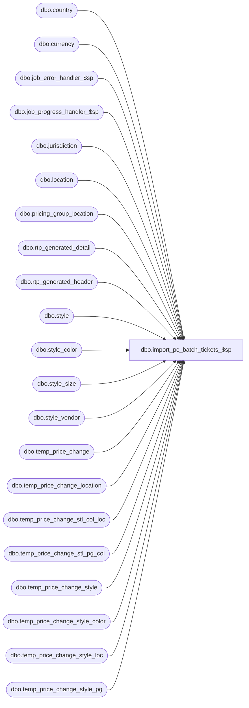

# dbo.import_pc_batch_tickets_$sp

**Database:** me_01  
**Server:** bedrockdb02  

## Architecture Diagram



## Table Dependencies

| Referenced Table |
|---|
| dbo.country |
| dbo.currency |
| dbo.job_error_handler_$sp |
| dbo.job_progress_handler_$sp |
| dbo.jurisdiction |
| dbo.location |
| dbo.pricing_group_location |
| dbo.rtp_generated_detail |
| dbo.rtp_generated_header |
| dbo.style |
| dbo.style_color |
| dbo.style_size |
| dbo.style_vendor |
| dbo.temp_price_change |
| dbo.temp_price_change_location |
| dbo.temp_price_change_stl_col_loc |
| dbo.temp_price_change_stl_pg_col |
| dbo.temp_price_change_style |
| dbo.temp_price_change_style_color |
| dbo.temp_price_change_style_loc |
| dbo.temp_price_change_style_pg |

## Stored Procedure Code

```sql
CREATE PROCEDURE [dbo].[import_pc_batch_tickets_$sp]
	(@job_id INT, @debug_flag BIT)

AS
/*
	Description	: This procedure is part of the import PC process, 
				  This procedure represents Ticket Printing integration for the newly created PC documents.
				  
				  Note: Ticket Printing doesn't support packs.
	10/31/2011	Ivan Dimitrov	130840 - import price change segment 34000 fails with duplicate key error for pg price changes
	03/09/2012	Sameer Patel	133713 - segment 34000 - timeout error
	05/03/2012      Qing Yang       134917 - segment 34000/1034000 problems w/multiple color exceptions w/different prices
*/

BEGIN
	DECLARE @line_id SMALLINT, @job_type TINYINT, @proc_name NVARCHAR(30), @sql_err_num DECIMAL(38,0),
			@table_name NVARCHAR(30), @operation_name NVARCHAR(30), @error_msg NVARCHAR(2000), @return_flag BIT,
			@c_true BIT, @c_false BIT,  @delay NCHAR(8)

	SELECT @job_type	= 30
		, @proc_name	= N'import_pc_batch_tickets_$sp'
		, @line_id		= 0
		, @c_false		= 0
		, @c_true		= 1
		, @delay		= N'00:00:05';


	-- temp table used for ticket printing header information
	IF NOT object_id(N'tempdb..#rtp_price_change') IS NULL
	   DROP TABLE #rtp_price_change;	

	CREATE TABLE #rtp_price_change (
		job_id int,
		temp_price_change_id decimal(12,0) NOT NULL,  
		vendor_id decimal(12,0) NOT NULL,
		location_id smallint NOT NULL
		);
		
    INSERT INTO #rtp_price_change (job_id, temp_price_change_id, vendor_id, location_id)
    SELECT DISTINCT h.job_id, h.temp_price_change_id, sv.vendor_id, pcl.location_id
    FROM temp_price_change h WITH (NOLOCK)
		INNER JOIN temp_price_change_style pcs WITH (NOLOCK) ON h.temp_price_change_id=pcs.temp_price_change_id AND h.job_id=pcs.job_id
		INNER JOIN temp_price_change_location pcl WITH (NOLOCK) ON h.temp_price_change_id=pcl.temp_price_change_id AND h.job_id=pcl.job_id
		INNER JOIN style_vendor sv WITH (NOLOCK) ON pcs.style_id = sv.style_id
    WHERE h.job_id = @job_id
      AND h.generate_tickets = 0 -- tickets required
      AND sv.primary_vendor_flag=1;


	--temp table to make getting currency info by location easier
	IF NOT object_id(N'tempdb..#rtp_location_currency') IS NULL
	   DROP TABLE #rtp_location_currency;	

	CREATE TABLE #rtp_location_currency(
		location_id smallint NOT NULL,
		currency_code nvarchar(3) NOT NULL,
		currency_symbol nvarchar(3) NOT NULL
		);

	do_tickets:
		
	BEGIN TRY

		-- Log progress if job_params.debug_flag is true OR job_header.debug_flag is true
        EXEC job_progress_handler_$sp @job_type, @job_id, @proc_name, @line_id, @debug_flag;
			
		BEGIN TRY
			BEGIN TRAN	 


			IF ( (SELECT COUNT(*) FROM #rtp_price_change ) > 0)
			BEGIN


				INSERT INTO #rtp_location_currency (location_id, currency_code, currency_symbol)
				SELECT DISTINCT h.location_id, c.currency_code, c.currency_symbol
   				FROM #rtp_price_change h 
   					INNER JOIN location l on h.location_id = l.location_id
   					INNER JOIN jurisdiction j ON l.jurisdiction_id = j.jurisdiction_id
   					INNER JOIN country co ON j.country_id = co.country_id
   					INNER JOIN currency c ON co.currency_id = c.currency_id
			
				SET @line_id = 10;
					
				-- Populate rtp_generated_header and rtp_generated_detail when required
				-- even if it's a replace logic there is no need to delete first because it's only new documents here
				-- Price Change document
				INSERT INTO rtp_generated_header
					(document_id, document_type, location_id, vendor_id, print_status, deleted_flag, date_updated) 
				SELECT r.temp_price_change_id, 5, r.location_id, r.vendor_id,  2, 0, GETDATE()
         		FROM #rtp_price_change r

   				-- Log progress if job_params.debug_flag is true OR job_header.debug_flag is true
		        EXEC job_progress_handler_$sp @job_type, @job_id, @proc_name, @line_id, @debug_flag;

   				SET @line_id = 20;
				
			

	/* Insert into the rtp_generated_detail table in order of most detailed to most generic price change.
	   We do it this way to avoid duplicating ticket requests, and to avoid doing an ugly 'union all' like we have in the C++ code
	 */

				-- Price Change Style Location Color 
				  INSERT INTO rtp_generated_detail 
						(document_id, document_type, location_id, vendor_id, style_id, style_color_id, style_size_id, 
						tkt_unit, unit_price, rtp_format_id, print_flag, deleted_flag, date_updated, currency_code, currency_symbol) 
				  SELECT DISTINCT h.temp_price_change_id, 5, pcscl.location_id, h.vendor_id, pcs.style_id, sc.style_color_id, ss.style_size_id, 
						0, pcscl.new_price, s.ticket_format_id, 0, 0, GETDATE(), lc.currency_code, lc.currency_symbol 
				  FROM #rtp_price_change h 
					INNER JOIN temp_price_change_style pcs on h.temp_price_change_id = pcs.temp_price_change_id AND h.job_id = pcs.job_id
					INNER JOIN temp_price_change_stl_col_loc pcscl on pcs.temp_price_change_id = pcscl.temp_price_change_id and pcs.temp_price_change_style_id = pcscl.temp_price_change_style_id AND pcs.job_id = pcscl.job_id
					INNER JOIN style s WITH (NOLOCK) on pcs.style_id = s.style_id 
					INNER JOIN style_color sc WITH (NOLOCK) on pcscl.color_id=sc.color_id
					INNER JOIN style_size ss WITH (NOLOCK) on ss.style_id = s.style_id
					INNER JOIN #rtp_location_currency lc on pcscl.location_id=lc.location_id

 				    --the following join removes any rows already added by a higher level exception
 				    LEFT OUTER JOIN rtp_generated_detail b on (
 						   h.temp_price_change_id = b.document_id  AND
						   b.document_type = 5 AND
						   pcscl.location_id = b.location_id  AND
						   h.vendor_id = b.vendor_id AND
   						   pcs.style_id = b.style_id AND
 						   sc.style_color_id = b.style_color_id AND
						   ss.style_size_id = b.style_size_id) 
				  WHERE b.document_id IS NULL				 
				
		          ORDER BY h.temp_price_change_id, pcscl.location_id, sc.style_color_id, ss.style_size_id;


   				-- Log progress if job_params.debug_flag is true OR job_header.debug_flag is true
		        EXEC job_progress_handler_$sp @job_type, @job_id, @proc_name, @line_id, @debug_flag;
   				SET @line_id = 30;

				-- Price Change Style Location 
				  INSERT INTO rtp_generated_detail 
						(document_id, document_type, location_id, vendor_id, style_id, style_color_id, style_size_id, tkt_unit, 
						unit_price, rtp_format_id, print_flag, deleted_flag, date_updated, currency_code, currency_symbol) 
				  SELECT DISTINCT pcs.temp_price_change_id, 5, pcsl.location_id, h.vendor_id, pcs.style_id, sc.style_color_id, ss.style_size_id, 0, 
				        pcsl.new_price, s.ticket_format_id, 0, 0, GETDATE(), lc.currency_code, lc.currency_symbol 
				  FROM #rtp_price_change h
						INNER JOIN temp_price_change_style pcs ON h.temp_price_change_id=pcs.temp_price_change_id AND h.job_id = pcs.job_id
						INNER JOIN temp_price_change_style_loc pcsl ON pcs.temp_price_change_id=pcsl.temp_price_change_id and pcs.temp_price_change_style_id = pcsl.temp_price_change_style_id AND pcs.job_id = pcsl.job_id
						INNER JOIN style s with (NOLOCK) ON pcs.style_id=s.style_id
						INNER JOIN style_color sc with (NOLOCK) ON pcs.style_id = sc.style_id
						INNER JOIN style_size ss with (NOLOCK) ON pcs.style_id = ss.style_id
						INNER JOIN #rtp_location_currency lc on pcsl.location_id=lc.location_id

 				    --the following join removes any rows already added by a higher level exception
						LEFT OUTER JOIN rtp_generated_detail b ON ( 
								h.temp_price_change_id = b.document_id AND
								b.document_type = 5 AND
								pcsl.location_id = b.location_id AND
								h.vendor_id = b.vendor_id AND
								pcs.style_id = b.style_id AND
								sc.style_color_id = b.style_color_id AND
								ss.style_size_id = b.style_size_id)
				  WHERE b.document_id IS NULL
				  
		          ORDER BY pcs.temp_price_change_id, pcsl.location_id, sc.style_color_id, ss.style_size_id;

   				-- Log progress if job_params.debug_flag is true OR job_header.debug_flag is true
		        EXEC job_progress_handler_$sp @job_type, @job_id, @proc_name, @line_id, @debug_flag;
   				SET @line_id = 40;


				-- Price Change Style Pricing Group Color 
  				  INSERT INTO rtp_generated_detail 
						(document_id, document_type, location_id, vendor_id, style_id, style_color_id, style_size_id, tkt_unit, unit_price, 
						rtp_format_id, print_flag, deleted_flag, date_updated, currency_code, currency_symbol) 
				  
				  SELECT DISTINCT pcs.temp_price_change_id, 5, pgl.location_id, h.vendor_id, pcs.style_id, sc.style_color_id, ss.style_size_id, 0, 
				       pcspgc.new_price, s.ticket_format_id, 0, 0, GETDATE(), lc.currency_code, lc.currency_symbol 
				  
				  FROM #rtp_price_change h
						INNER JOIN temp_price_change_style pcs ON h.temp_price_change_id=pcs.temp_price_change_id AND h.job_id = pcs.job_id
						INNER JOIN temp_price_change_stl_pg_col pcspgc ON pcs.temp_price_change_id=pcspgc.temp_price_change_id and pcs.temp_price_change_style_id = pcspgc.temp_price_change_style_id AND pcs.job_id = pcspgc.job_id
						INNER JOIN pricing_group_location pgl ON pgl.pricing_group_id=pcspgc.pricing_group_id
						INNER JOIN style s WITH (NOLOCK) ON s.style_id=pcs.style_id
						INNER JOIN style_color sc WITH (NOLOCK) ON s.style_id=sc.style_id
						INNER JOIN style_size ss WITH (NOLOCK) ON s.style_id=ss.style_id
						INNER JOIN #rtp_location_currency lc on pgl.location_id=lc.location_id

 						--the following join removes any rows already added by a higher level exception
						LEFT OUTER JOIN rtp_generated_detail b ON (
								   pcs.temp_price_change_id = b.document_id AND 
								   b.document_type = 5 AND 
								   pgl.location_id = b.location_id AND 
								   h.vendor_id = b.vendor_id AND 
   								   pcs.style_id = b.style_id AND 
 								   sc.style_color_id = b.style_color_id AND 
								   ss.style_size_id = b.style_size_id)
				  WHERE b.document_id IS NULL
				  
				  ORDER BY pcs.temp_price_change_id, pgl.location_id, sc.style_color_id, ss.style_size_id;
   				
   				-- Log progress if job_params.debug_flag is true OR job_header.debug_flag is true
		        EXEC job_progress_handler_$sp @job_type, @job_id, @proc_name, @line_id, @debug_flag;
   				SET @line_id = 50;

	           
				-- Price Change Style Pricing Group 
  				  INSERT INTO rtp_generated_detail 
						(document_id, document_type, location_id, vendor_id, style_id, style_color_id, style_size_id, tkt_unit, 
						unit_price, rtp_format_id, print_flag, deleted_flag, date_updated, currency_code, currency_symbol) 
				  
				  SELECT DISTINCT pcs.temp_price_change_id, 5, pgl.location_id, h.vendor_id, pcs.style_id, sc.style_color_id, ss.style_size_id, 0, 
				         pcspg.new_price, s.ticket_format_id, 0, 0, GETDATE(), lc.currency_code, lc.currency_symbol 
				  
				  FROM #rtp_price_change h
						INNER JOIN temp_price_change_style pcs ON h.temp_price_change_id=pcs.temp_price_change_id AND h.job_id = pcs.job_id
						INNER JOIN temp_price_change_style_pg pcspg ON pcs.temp_price_change_id=pcspg.temp_price_change_id and pcs.temp_price_change_style_id = pcspg.temp_price_change_style_id AND pcs.job_id = pcspg.job_id
						INNER JOIN pricing_group_location pgl on pcspg.pricing_group_id=pgl.pricing_group_id
						INNER JOIN style s WITH (NOLOCK) ON s.style_id=pcs.style_id
						INNER JOIN style_color sc WITH (NOLOCK) ON s.style_id=sc.style_id
						INNER JOIN style_size ss WITH (NOLOCK) ON s.style_id=ss.style_id
						INNER JOIN #rtp_location_currency lc on pgl.location_id=lc.location_id

 						--the following join removes any rows already added by a higher level exception
						LEFT OUTER JOIN rtp_generated_detail b ON (
								pcs.temp_price_change_id = b.document_id AND 
								b.document_type = 5 AND 
								pgl.location_id = b.location_id AND 
								h.vendor_id = b.vendor_id AND 
   								pcs.style_id = b.style_id AND 
 								sc.style_color_id = b.style_color_id AND 
								ss.style_size_id = b.style_size_id)
				  WHERE b.document_id IS NULL
				  
		          ORDER BY pcs.temp_price_change_id, pgl.location_id, sc.style_color_id, ss.style_size_id;


   				-- Log progress if job_params.debug_flag is true OR job_header.debug_flag is true
		        EXEC job_progress_handler_$sp @job_type, @job_id, @proc_name, @line_id, @debug_flag;
   				SET @line_id = 60;


				-- Price Change Style Color 
  				  INSERT INTO rtp_generated_detail 
						(document_id, document_type, location_id, vendor_id, style_id, style_color_id, style_size_id, tkt_unit, unit_price, 
						rtp_format_id, print_flag, deleted_flag, date_updated, currency_code, currency_symbol) 
		         
				  SELECT DISTINCT pcs.temp_price_change_id, 5, pcl.location_id, h.vendor_id, pcs.style_id, sc.style_color_id, ss.style_size_id, 0, 
				         pcsc.new_price, s.ticket_format_id, 0, 0, GETDATE(), lc.currency_code, lc.currency_symbol 
				  FROM #rtp_price_change h 
						INNER JOIN temp_price_change_location pcl ON h.temp_price_change_id=pcl.temp_price_change_id AND h.job_id = pcl.job_id AND h.location_id = pcl.location_id
						INNER JOIN style_vendor sv on h.vendor_id = sv.vendor_id
						INNER JOIN temp_price_change_style pcs ON h.temp_price_change_id=pcs.temp_price_change_id AND h.job_id = pcs.job_id and sv.style_id = pcs.style_id
						INNER JOIN style_color sc WITH (NOLOCK) on pcs.style_id=sc.style_id
						INNER JOIN temp_price_change_style_color pcsc ON pcs.temp_price_change_id=pcsc.temp_price_change_id AND pcs.temp_price_change_style_id = pcsc.temp_price_change_style_id AND pcs.job_id = pcsc.job_id AND sc.style_color_id=pcsc.style_color_id
						INNER JOIN style s WITH (NOLOCK) ON s.style_id=pcs.style_id
						INNER JOIN style_size ss WITH (NOLOCK) ON s.style_id=ss.style_id
						INNER JOIN #rtp_location_currency lc on pcl.location_id=lc.location_id

 						--the following join removes any rows already added by a higher level exception
						LEFT OUTER JOIN rtp_generated_detail b ON (
								   pcs.temp_price_change_id = b.document_id AND
								   b.document_type = 5 AND
								   pcl.location_id = b.location_id AND
								   h.vendor_id = b.vendor_id AND
   							       pcs.style_id = b.style_id AND
 								   sc.style_color_id = b.style_color_id AND
								   ss.style_size_id = b.style_size_id)
				  WHERE b.document_id IS NULL
				  
		          ORDER BY pcs.temp_price_change_id, pcl.location_id, sc.style_color_id, ss.style_size_id;

   				-- Log progress if job_params.debug_flag is true OR job_header.debug_flag is true
		        EXEC job_progress_handler_$sp @job_type, @job_id, @proc_name, @line_id, @debug_flag;
   				SET @line_id = 70;

				
				-- Price Change Style
  				  INSERT INTO rtp_generated_detail 
						(document_id, document_type, location_id, vendor_id, style_id, style_color_id, style_size_id, tkt_unit, 
						unit_price, rtp_format_id, print_flag, deleted_flag, date_updated, currency_code, currency_symbol) 
				  
				  SELECT DISTINCT pcs.temp_price_change_id, 5, pcl.location_id, h.vendor_id, pcs.style_id, sc.style_color_id, ss.style_size_id, 0, 
				      pcs.new_price, s.ticket_format_id, 0, 0, GETDATE(), lc.currency_code, lc.currency_symbol 
				  
				  FROM #rtp_price_change h
						INNER JOIN temp_price_change_location pcl ON h.temp_price_change_id=pcl.temp_price_change_id AND h.job_id = pcl.job_id
						INNER JOIN temp_price_change_style pcs ON h.temp_price_change_id=pcs.temp_price_change_id AND h.job_id = pcs.job_id
						INNER JOIN style s WITH (NOLOCK) ON s.style_id=pcs.style_id
						INNER JOIN style_color sc WITH (NOLOCK) ON s.style_id=sc.style_id
						INNER JOIN style_size ss WITH (NOLOCK) ON s.style_id=ss.style_id
						INNER JOIN #rtp_location_currency lc on pcl.location_id=lc.location_id

 						--the following join removes any rows already added by a higher level exception
						LEFT OUTER JOIN rtp_generated_detail b ON (
								   pcs.temp_price_change_id = b.document_id AND
								   b.document_type = 5 AND
								   pcl.location_id = b.location_id  AND
								   h.vendor_id = b.vendor_id AND
   							       pcs.style_id = b.style_id  AND
 								   sc.style_color_id = b.style_color_id  AND
								   ss.style_size_id = b.style_size_id)
				  WHERE b.document_id IS NULL
				  
		          ORDER BY pcs.temp_price_change_id, pcl.location_id, sc.style_color_id, ss.style_size_id;

   				-- Log progress if job_params.debug_flag is true OR job_header.debug_flag is true
		        EXEC job_progress_handler_$sp @job_type, @job_id, @proc_name, @line_id, @debug_flag;
   				SET @line_id = 80;

			END; --( (SELECT COUNT(*) FROM #rtp_price_change ) > 0)

			COMMIT TRAN
			
	      -- Log progress if job_params.debug_flag is true OR job_header.debug_flag is true
         EXEC job_progress_handler_$sp @job_type, @job_id, @proc_name, @line_id, @debug_flag;

		END TRY
			
		BEGIN CATCH
			SELECT @error_msg = N'Error ' + CAST(ERROR_NUMBER() AS NVARCHAR(20)) + N' : in the import_pc_batch_tickets step of job #%i because of ' + ERROR_MESSAGE();
			
			IF @@TRANCOUNT <> 0
				ROLLBACK TRANSACTION;
		
			RAISERROR (@error_msg,
					16, -- Severity.
					1, -- State.
					@job_id)
		END CATCH
	END TRY

	BEGIN CATCH
		SELECT @error_msg		= ERROR_MESSAGE()
			 , @sql_err_num		= ERROR_NUMBER()
			 
		IF @@TRANCOUNT <> 0
			ROLLBACK TRANSACTION

		IF @line_id = 10
			SELECT  @table_name			= N'rtp_generated_header'
					, @operation_name	= N'INSERT'
		ELSE 
			SELECT  @table_name			= N'rtp_generated_detail'
					, @operation_name	= N'INSERT'
					
		EXEC job_error_handler_$sp 
					@job_type 
					, @job_id 
					, @proc_name 
					, @line_id 
					, @sql_err_num 
					, @table_name 
					, @operation_name 
					, @error_msg 
					, @c_true

	END CATCH
END
```

