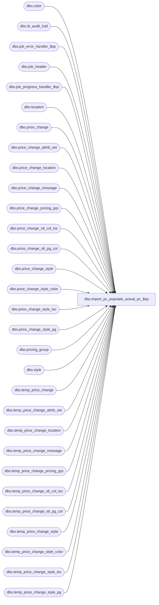

# dbo.import_pc_populate_actual_pc_$sp

**Database:** me_01  
**Server:** bedrockdb02  

## Architecture Diagram



## Table Dependencies

| Referenced Table |
|---|
| dbo.color |
| dbo.ib_audit_trail |
| dbo.job_error_handler_$sp |
| dbo.job_header |
| dbo.job_progress_handler_$sp |
| dbo.location |
| dbo.price_change |
| dbo.price_change_attrib_set |
| dbo.price_change_location |
| dbo.price_change_message |
| dbo.price_change_pricing_grp |
| dbo.price_change_stl_col_loc |
| dbo.price_change_stl_pg_col |
| dbo.price_change_style |
| dbo.price_change_style_color |
| dbo.price_change_style_loc |
| dbo.price_change_style_pg |
| dbo.pricing_group |
| dbo.style |
| dbo.temp_price_change |
| dbo.temp_price_change_attrib_set |
| dbo.temp_price_change_location |
| dbo.temp_price_change_message |
| dbo.temp_price_change_pricing_grp |
| dbo.temp_price_change_stl_col_loc |
| dbo.temp_price_change_stl_pg_col |
| dbo.temp_price_change_style |
| dbo.temp_price_change_style_color |
| dbo.temp_price_change_style_loc |
| dbo.temp_price_change_style_pg |

## Stored Procedure Code

```sql
Create PROCEDURE [dbo].[import_pc_populate_actual_pc_$sp]
	(@job_id INT)

AS

/*
	Version		: 1.00
	Created		: Oct 2010
	Created by	: Ivan Dimitrov
	Description	: This procedure populates the actual PCM tables from the temp tables and Audit trail for a job_id
				  It's called by import_pc_batch_$sp.			  	
		2/22/2014   Ivan D. 			Add support for importing price change attributes
				  
*/

BEGIN
	-- c_sale_type, c_return_type, c_layaway_pickup_type
	DECLARE @line_id SMALLINT, @proc_name NVARCHAR(30), @sql_err_num DECIMAL(38,0), @table_name NVARCHAR(30), 
			@operation_name	NVARCHAR(30), @error_msg NVARCHAR(2000), @job_type TINYINT, @c_true BIT, @c_false BIT,
			@range_start DECIMAL(24,0), @range_end DECIMAL(24,0), @debug_flag BIT, @temp_pc_count INT, 
			@count INT, @job_debug_flag BIT, @from_new_id DECIMAL(12,0), @to_new_id DECIMAL(12,0), @document_no NVARCHAR(20),
			@msg NVARCHAR(500), @language_id SMALLINT, @seq_count int

	SELECT   @job_type		= 30
			, @proc_name	= N'import_pc_populate_actual_pc_$sp'
			, @c_false		= 0
			, @c_true		= 1
			, @line_id		= 10
			, @language_id	= 1033;
				
	BEGIN TRY
		-- Get parameters associates to the current job
		SELECT @range_start = range_start, @range_end = range_end, 
			   @job_debug_flag = debug_flag
		FROM job_header
		WHERE job_id = @job_id
		AND job_type = @job_type

		-- Log progress if job_params.debug_flag is true 
		EXEC job_progress_handler_$sp @job_type, @job_id, @proc_name, @line_id, @job_debug_flag

----------------
		SET @line_id = 20
		-- Populate price_change
		
		INSERT INTO price_change
					(price_change_id,category_id,pricing_rule_id,price_change_no,price_change_status,price_change_description,price_change_duration,price_change_document_type,effective_from_date,effective_to_date,terminate_on_date,issue_date,price_change_type,price_status_override,location_grouping,calculation_method,calculation_value,base_calculation_on,override_price_exceptions,disable_print_by_location_flag,approval_status,create_date,status_date,last_copy_date,calculation_date,position_id,total_cost,price_status_id,state_no,total_units,updatestamp,last_item_id,generate_tickets,jurisdiction_id,total_valuation_cost,promotional_event_flag,submitted_by_id,total_affected_units)
		SELECT temp_price_change_id,category_id,pricing_rule_id,price_change_no,price_change_status,price_change_description,price_change_duration,price_change_document_type,effective_from_date,effective_to_date,terminate_on_date,issue_date,price_change_type,price_status_override,location_grouping,calculation_method,calculation_value,base_calculation_on,override_price_exceptions,disable_print_by_location_flag,approval_status,create_date,status_date,last_copy_date,calculation_date,position_id,total_cost,price_status_id,state_no,total_units,updatestamp,last_item_id,generate_tickets,jurisdiction_id,total_valuation_cost,promotional_event_flag,submitted_by_id,total_affected_units
		FROM temp_price_change
		WHERE job_id = @job_id
			

		-- Log progress if job_params.debug_flag is true 
		EXEC job_progress_handler_$sp @job_type, @job_id, @proc_name, @line_id,@job_debug_flag

--------------
		SET @line_id = 30
		-- Populate price_change_style
		
		INSERT INTO price_change_style
			(price_change_style_id,price_change_id,price_change_type,calculation_method,calculation_value,base_calculation_on,base_value,old_price,new_price,style_id,price_status_id,color_exception_flag,location_exception_flag,loc_col_exception_flag,average_cost,total_cost,total_units,original_selling_retail,current_selling_retail,list_retail,last_po_cost,total_valuation_cost,new_valuation_price,current_valuation_retail,original_valuation_retail,pricing_grp_exception_flag,pricing_grp_col_exception_flag,total_affected_units)
		SELECT temp_price_change_style_id,temp_price_change_id,price_change_type,calculation_method,calculation_value,base_calculation_on,base_value,old_price,new_price,style_id,price_status_id,color_exception_flag,location_exception_flag,loc_col_exception_flag,average_cost,total_cost,total_units,original_selling_retail,current_selling_retail,list_retail,last_po_cost,total_valuation_cost,new_valuation_price,current_valuation_retail,original_valuation_retail,pricing_grp_exception_flag,pricing_grp_col_exception_flag,total_affected_units
		FROM temp_price_change_style
		WHERE job_id = @job_id

		-- Log progress if job_params.debug_flag is true 
		EXEC job_progress_handler_$sp @job_type, @job_id, @proc_name, @line_id, @job_debug_flag


-------------
		SET @line_id = 40
		-- Populate price_change_style_color
		
		INSERT INTO price_change_style_color
			(price_change_style_color_id,price_change_id,price_change_style_id,price_change_type,calculation_method,calculation_value,base_calculation_on,base_value,old_price,new_price,color_id,price_status_id,redundant_flag,total_cost,total_units,original_selling_retail,current_selling_retail,list_retail,last_po_cost,total_valuation_cost,new_valuation_price,current_valuation_retail,original_valuation_retail,total_affected_units)
		SELECT temp_price_change_style_color_id,temp_price_change_id,temp_price_change_style_id,price_change_type,calculation_method,calculation_value,base_calculation_on,base_value,old_price,new_price,color_id,price_status_id,redundant_flag,total_cost,total_units,original_selling_retail,current_selling_retail,list_retail,last_po_cost,total_valuation_cost,new_valuation_price,current_valuation_retail,original_valuation_retail,total_affected_units
		FROM temp_price_change_style_color
		WHERE job_id = @job_id
		
		-- Log progress if job_params.debug_flag is true 
		EXEC job_progress_handler_$sp @job_type, @job_id, @proc_name, @line_id, @job_debug_flag
-------------
		SET @line_id = 50
		-- Populate price_change_style_loc
		
		INSERT INTO price_change_style_loc
			(price_change_style_loc_id,price_change_style_id,price_change_id,price_change_type,calculation_method,calculation_value,base_calculation_on,base_value,old_price,new_price,location_id,price_status_id,average_cost,total_cost,total_units,original_selling_retail,current_selling_retail,list_retail,last_po_cost,redundant_flag,total_valuation_cost,new_valuation_price,current_valuation_retail,original_valuation_retail,pricing_group_id,total_affected_units)
		SELECT temp_price_change_style_loc_id,temp_price_change_style_id,temp_price_change_id,price_change_type,calculation_method,calculation_value,base_calculation_on,base_value,old_price,new_price,location_id,price_status_id,average_cost,total_cost,total_units,original_selling_retail,current_selling_retail,list_retail,last_po_cost,redundant_flag,total_valuation_cost,new_valuation_price,current_valuation_retail,original_valuation_retail,pricing_group_id,total_affected_units
		FROM temp_price_change_style_loc
		WHERE job_id = @job_id
			

		-- Log progress if job_params.debug_flag is true 
		EXEC job_progress_handler_$sp @job_type, @job_id, @proc_name, @line_id, @job_debug_flag

--------------
		SET @line_id = 60
		-- Populate price_change_style_pg

		INSERT INTO price_change_style_pg
			(price_change_style_pg_id,price_change_style_id,price_change_id,price_change_type,calculation_method,calculation_value,base_calculation_on,base_value,old_price,new_price,pricing_group_id,price_status_id,total_cost,total_units,original_selling_retail,current_selling_retail,list_retail,last_po_cost,redundant_flag,total_valuation_cost,new_valuation_price,current_valuation_retail,original_valuation_retail,total_affected_units)
		SELECT temp_price_change_style_pg_id,temp_price_change_style_id,temp_price_change_id,price_change_type,calculation_method,calculation_value,base_calculation_on,base_value,old_price,new_price,pricing_group_id,price_status_id,total_cost,total_units,original_selling_retail,current_selling_retail,list_retail,last_po_cost,redundant_flag,total_valuation_cost,new_valuation_price,current_valuation_retail,original_valuation_retail,total_affected_units
		FROM temp_price_change_style_pg
		WHERE job_id = @job_id
		

		-- Log progress if job_params.debug_flag is true 
		EXEC job_progress_handler_$sp @job_type, @job_id, @proc_name, @line_id, @job_debug_flag

--------------
		SET @line_id = 70
		-- Populate price_change_style_pg_col

		INSERT INTO price_change_stl_pg_col
			(price_change_stl_pg_col_id,price_change_style_id,price_change_id,color_id,price_change_type,calculation_method,calculation_value,base_calculation_on,base_value,old_price,new_price,pricing_group_id,total_cost,total_units,price_status_id,original_selling_retail,current_selling_retail,list_retail,last_po_cost,redundant_flag,total_valuation_cost,new_valuation_price,current_valuation_retail,original_valuation_retail,total_affected_units)
		SELECT temp_price_change_stl_pg_col_id,temp_price_change_style_id,temp_price_change_id,color_id,price_change_type,calculation_method,calculation_value,base_calculation_on,base_value,old_price,new_price,pricing_group_id,total_cost,total_units,price_status_id,original_selling_retail,current_selling_retail,list_retail,last_po_cost,redundant_flag,total_valuation_cost,new_valuation_price,current_valuation_retail,original_valuation_retail,total_affected_units
		FROM temp_price_change_stl_pg_col
		WHERE job_id = @job_id	

		-- Log progress if job_params.debug_flag is true 
		EXEC job_progress_handler_$sp @job_type, @job_id, @proc_name, @line_id, @job_debug_flag

--------------
		SET @line_id = 80
		-- Populate temp_price_change_style_col_loc
		
		INSERT INTO price_change_stl_col_loc
			(price_change_stl_col_loc_id,price_change_style_id,price_change_id,color_id,price_change_type,calculation_method,calculation_value,base_calculation_on,base_value,old_price,new_price,location_id,total_cost,total_units,price_status_id,original_selling_retail,current_selling_retail,list_retail,last_po_cost,redundant_flag,total_valuation_cost,new_valuation_price,current_valuation_retail,original_valuation_retail,pricing_group_id,total_affected_units)
		SELECT temp_price_change_stl_col_loc_id,temp_price_change_style_id,temp_price_change_id,color_id,price_change_type,calculation_method,calculation_value,base_calculation_on,base_value,old_price,new_price,location_id,total_cost,total_units,price_status_id,original_selling_retail,current_selling_retail,list_retail,last_po_cost,redundant_flag,total_valuation_cost,new_valuation_price,current_valuation_retail,original_valuation_retail,pricing_group_id,total_affected_units
		FROM temp_price_change_stl_col_loc
		WHERE job_id = @job_id

		-- Log progress if job_params.debug_flag is true 
		EXEC job_progress_handler_$sp @job_type, @job_id, @proc_name, @line_id, @job_debug_flag


--------------
		SET @line_id = 90
		-- Populate price_change_pricing_grp
		
		INSERT INTO price_change_pricing_grp
			(price_change_pricing_grp_id,price_change_id,pricing_group_id)
		SELECT temp_price_change_pricing_grp_id,temp_price_change_id,pricing_group_id
		FROM temp_price_change_pricing_grp
		WHERE job_id = @job_id

		-- Log progress if job_params.debug_flag is true 
		EXEC job_progress_handler_$sp @job_type, @job_id, @proc_name, @line_id, @job_debug_flag


---------------
		SET @line_id = 100
		-- Populate temp_price_change_location
		INSERT INTO price_change_location
			(price_change_location_id,price_change_id,printed_status,location_id,pricing_group_id)
		SELECT temp_price_change_location_id,temp_price_change_id,printed_status,location_id,pricing_group_id
		FROM temp_price_change_location
		WHERE job_id = @job_id


		-- Log progress if job_params.debug_flag is true 
		EXEC job_progress_handler_$sp @job_type, @job_id, @proc_name, @line_id, @job_debug_flag


--------------
		SET @line_id = 110
		-- Populate price_change_message

		INSERT INTO price_change_message
			(price_change_message_id,price_change_id,parent_id,parent_type,message_type_id,message)
		SELECT temp_price_change_message_id,temp_price_change_id,parent_id,parent_type,message_type_id,message
		FROM temp_price_change_message
		WHERE job_id = @job_id
			

		-- Log progress if job_params.debug_flag is true 
		EXEC job_progress_handler_$sp @job_type, @job_id, @proc_name, @line_id, @job_debug_flag
		
--------------
		SET @line_id = 115
		-- Populate price_change_attrib_set

		INSERT INTO price_change_attrib_set
			(price_change_attrib_set_id,price_change_id,attribute_set_id,attribute_id)
		SELECT temp_price_change_attrib_set_id,temp_price_change_id,attribute_set_id,attribute_id
		FROM temp_price_change_attrib_set
		WHERE job_id = @job_id
			

		-- Log progress if job_params.debug_flag is true 
		EXEC job_progress_handler_$sp @job_type, @job_id, @proc_name, @line_id, @job_debug_flag


---------------------
		SET @line_id = 120
		-- populate Audit Trail
				
				
		INSERT INTO ib_audit_trail
		(entry_date,application,activity,application_type_id,application_type,application_identifier,application_level,application_key,action,field_affected,old_value,new_value,status,employee_last_name,employee_first_name)
		--price change
		SELECT getdate() as entry_date
				,N'PCM' as application
				,NULL as activity
				,temp_price_change_id as application_type_id
				,N'PC' as application_type
				,price_change_no as application_identifier
				,NULL as application_level
				,NULL as application_key
				,N'Add' as action
				,NULL as field_affected
				,NULL as old_value
				,NULL as new_value
				,NULL as status
				,N'Admin' as employee_last_name
				,N'Admin' as employee_first_name
		FROM temp_price_change
		WHERE job_id = @job_id

		INSERT INTO ib_audit_trail
		(entry_date,application,activity,application_type_id,application_type,application_identifier,application_level,application_key,action,field_affected,old_value,new_value,status,employee_last_name,employee_first_name)
		--price_change_style 
		SELECT getdate() as entry_date
				,N'PCM' as application
				,NULL as activity
				,NULL as application_type_id
				,N'PC' as application_type
				,price_change_no as application_identifier
				,N'PCStyle' as application_level
				,style_code as application_key
				,N'Add' as action
				,NULL as field_affected
				,NULL as old_value
				,NULL as new_value
				,NULL as status
				,N'Admin' as employee_last_name
				,N'Admin' as employee_first_name
		FROM temp_price_change tpc, temp_price_change_style ts, style s
		WHERE tpc.temp_price_change_id = ts.temp_price_change_id
		AND ts.style_id = s.style_id
		AND tpc.job_id = @job_id
		AND ts.job_id = @job_id

		INSERT INTO ib_audit_trail
		(entry_date,application,activity,application_type_id,application_type,application_identifier,application_level,application_key,action,field_affected,old_value,new_value,status,employee_last_name,employee_first_name)
		--price_change_style_color
		SELECT getdate() as entry_date
				,N'PCM' as application
				,NULL as activity
				,NULL as application_type_id
				,N'PC' as application_type
				,price_change_no as application_identifier
				,N'PCStyleColor' as application_level
				,style_code + N' - ' + c.color_code as application_key
				,N'Add' as action
				,NULL as field_affected
				,NULL as old_value
				,NULL as new_value
				,NULL as status
				,N'Admin' as employee_last_name
				,N'Admin' as employee_first_name
		FROM temp_price_change tpc, temp_price_change_style ts,temp_price_change_style_color tsc,  style s, color c
		WHERE tpc.temp_price_change_id = ts.temp_price_change_id
		AND tsc.temp_price_change_id = tpc.temp_price_change_id
		AND tsc.temp_price_change_style_id = ts.temp_price_change_style_id
		AND ts.style_id = s.style_id
		AND tsc.color_id = c.color_id
		AND tpc.job_id = @job_id
		AND ts.job_id = @job_id
		

		INSERT INTO ib_audit_trail
		(entry_date,application,activity,application_type_id,application_type,application_identifier,application_level,application_key,action,field_affected,old_value,new_value,status,employee_last_name,employee_first_name)
		--price_change_style_PG
		SELECT getdate() as entry_date
				,N'PCM' as application
				,NULL as activity
				,NULL as application_type_id
				,N'PC' as application_type
				,price_change_no as application_identifier
				,N'PCStylePricingGroup' as application_level
				,style_code + N' - ' + pg.pricing_group_code as application_key
				,N'Add' as action
				,NULL as field_affected
				,NULL as old_value
				,NULL as new_value
				,NULL as status
				,N'Admin' as employee_last_name
				,N'Admin' as employee_first_name
		FROM temp_price_change tpc, temp_price_change_style ts,temp_price_change_style_pg tsd,  style s, pricing_group pg
		WHERE tpc.temp_price_change_id = ts.temp_price_change_id
		AND tsd.temp_price_change_id = tpc.temp_price_change_id
		AND tsd.temp_price_change_style_id = ts.temp_price_change_style_id
		AND ts.style_id = s.style_id
		AND tsd.pricing_group_id = pg.pricing_group_id
		AND tpc.job_id = @job_id
		AND ts.job_id = @job_id
		AND tsd.job_id = @job_id


		INSERT INTO ib_audit_trail
		(entry_date,application,activity,application_type_id,application_type,application_identifier,application_level,application_key,action,field_affected,old_value,new_value,status,employee_last_name,employee_first_name)
		--price_change_style_PG_color
		SELECT getdate() as entry_date
				,N'PCM' as application
				,NULL as activity
				,NULL as application_type_id
				,N'PC' as application_type
				,price_change_no as application_identifier
				,N'PCStylePricingGroupColor' as application_level
				,style_code + N' - ' + c.color_code + N' - ' + pg.pricing_group_code as application_key
				,N'Add' as action
				,NULL as field_affected
				,NULL as old_value
				,NULL as new_value
				,NULL as status
				,N'Admin' as employee_last_name
				,N'Admin' as employee_first_name
		FROM temp_price_change tpc, temp_price_change_style ts,temp_price_change_stl_pg_col tsd,  style s, pricing_group pg, color c
		WHERE tpc.temp_price_change_id = ts.temp_price_change_id
		AND tsd.temp_price_change_id = tpc.temp_price_change_id
		AND tsd.temp_price_change_style_id = ts.temp_price_change_style_id
		AND ts.style_id = s.style_id
		AND tsd.pricing_group_id = pg.pricing_group_id
		AND tsd.color_id = c.color_id
		AND tpc.job_id = @job_id
		AND ts.job_id = @job_id
		AND tsd.job_id = @job_id

		INSERT INTO ib_audit_trail
		(entry_date,application,activity,application_type_id,application_type,application_identifier,application_level,application_key,action,field_affected,old_value,new_value,status,employee_last_name,employee_first_name)
		--price_change_style_loc
		SELECT getdate() as entry_date
				,N'PCM' as application
				,NULL as activity
				,NULL as application_type_id
				,N'PC' as application_type
				,price_change_no as application_identifier
				,N'PCStyleLocation' as application_level
				,style_code + N' - ' + l.location_code as application_key
				,N'Add' as action
				,NULL as field_affected
				,NULL as old_value
				,NULL as new_value
				,NULL as status
				,N'Admin' as employee_last_name
				,N'Admin' as employee_first_name
		FROM temp_price_change tpc, temp_price_change_style ts,temp_price_change_style_loc tsd,  style s, location l
		WHERE tpc.temp_price_change_id = ts.temp_price_change_id
		AND tsd.temp_price_change_id = tpc.temp_price_change_id
		AND tsd.temp_price_change_style_id = ts.temp_price_change_style_id
		AND ts.style_id = s.style_id
		AND tsd.location_id = l.location_id
		AND tpc.job_id = @job_id
		AND ts.job_id = @job_id
		AND tsd.job_id = @job_id

		INSERT INTO ib_audit_trail
		(entry_date,application,activity,application_type_id,application_type,application_identifier,application_level,application_key,action,field_affected,old_value,new_value,status,employee_last_name,employee_first_name)
		--price_change_style_location_color
		SELECT getdate() as entry_date
				,N'PCM' as application
				,NULL as activity
				,NULL as application_type_id
				,N'PC' as application_type
				,price_change_no as application_identifier
				,N'PCStyleColorLoc' as application_level
				,style_code + N' - ' + c.color_code + N' - ' + l.location_code as application_key
				,N'Add' as action
				,NULL as field_affected
				,NULL as old_value
				,NULL as new_value
				,NULL as status
				,N'Admin' as employee_last_name
				,N'Admin' as employee_first_name
		FROM temp_price_change tpc, temp_price_change_style ts,temp_price_change_stl_col_loc tsd,  style s, location l, color c
		WHERE tpc.temp_price_change_id = ts.temp_price_change_id
		AND tsd.temp_price_change_id = tpc.temp_price_change_id
		AND tsd.temp_price_change_style_id = ts.temp_price_change_style_id
		AND ts.style_id = s.style_id
		AND tsd.location_id = l.location_id
		AND tsd.color_id = c.color_id
		AND tpc.job_id = @job_id
		AND ts.job_id = @job_id
		AND tsd.job_id = @job_id

		-- Log progress if job_params.debug_flag is true 
		EXEC job_progress_handler_$sp @job_type, @job_id, @proc_name, @line_id, @job_debug_flag

	END TRY
	BEGIN CATCH

		SELECT @error_msg		= ERROR_MESSAGE()
			 , @sql_err_num		= ERROR_NUMBER()


		-- Test if the transaction is active and valid.
		IF (XACT_STATE()) = 1
			COMMIT TRANSACTION

		IF @line_id between 20 AND 110
			SELECT @table_name		= N'price_change_tables',
				 @operation_name	= N'INSERT'
		ELSE IF @line_id >= 120
			SELECT @table_name		= N'ib_audit_trail',
				 @operation_name	= N'INSERT'
		

		EXEC job_error_handler_$sp
					  @job_type 
					, @job_id 
					, @proc_name 
					, @line_id 
					, @sql_err_num 
					, @table_name 
					, @operation_name 
					, @error_msg 
					, @c_true
	END CATCH
END
```

