# dbo.import_pc_populate_temp_pc_$sp

**Database:** me_01  
**Server:** bedrockdb02  

## Architecture Diagram

```mermaid
flowchart LR
    SP["dbo.import_pc_populate_temp_pc_$sp"]
    dbo_attribute(["dbo.attribute"]) --> SP
    dbo_attribute_set(["dbo.attribute_set"]) --> SP
    dbo_category(["dbo.category"]) --> SP
    dbo_color(["dbo.color"]) --> SP
    dbo_imp_price_change(["dbo.imp_price_change"]) --> SP
    dbo_imp_price_change_attrib(["dbo.imp_price_change_attrib"]) --> SP
    dbo_imp_price_change_detail(["dbo.imp_price_change_detail"]) --> SP
    dbo_imp_price_change_loc(["dbo.imp_price_change_loc"]) --> SP
    dbo_imp_price_change_message(["dbo.imp_price_change_message"]) --> SP
    dbo_imp_price_change_prc_grp(["dbo.imp_price_change_prc_grp"]) --> SP
    dbo_job_error_handler__sp(["dbo.job_error_handler_$sp"]) --> SP
    dbo_job_header(["dbo.job_header"]) --> SP
    dbo_job_message(["dbo.job_message"]) --> SP
    dbo_job_progress_handler__sp(["dbo.job_progress_handler_$sp"]) --> SP
    dbo_jurisdiction(["dbo.jurisdiction"]) --> SP
    dbo_location(["dbo.location"]) --> SP
    dbo_message_type(["dbo.message_type"]) --> SP
    dbo_parameter_pcm(["dbo.parameter_pcm"]) --> SP
    dbo_position(["dbo.position"]) --> SP
    dbo_price_change__seq(["dbo.price_change_$seq"]) --> SP
    dbo_price_status(["dbo.price_status"]) --> SP
    dbo_pricing_group(["dbo.pricing_group"]) --> SP
    dbo_pricing_group_location(["dbo.pricing_group_location"]) --> SP
    dbo_pricing_rule(["dbo.pricing_rule"]) --> SP
    dbo_style(["dbo.style"]) --> SP
    dbo_style_color(["dbo.style_color"]) --> SP
    dbo_t(["dbo.t"]) --> SP
    dbo_temp_price_change(["dbo.temp_price_change"]) --> SP
    dbo_temp_price_change_attrib_set(["dbo.temp_price_change_attrib_set"]) --> SP
    dbo_temp_price_change_location(["dbo.temp_price_change_location"]) --> SP
    dbo_temp_price_change_message(["dbo.temp_price_change_message"]) --> SP
    dbo_temp_price_change_pricing_grp(["dbo.temp_price_change_pricing_grp"]) --> SP
    dbo_temp_price_change_stl_col_loc(["dbo.temp_price_change_stl_col_loc"]) --> SP
    dbo_temp_price_change_stl_pg_col(["dbo.temp_price_change_stl_pg_col"]) --> SP
    dbo_temp_price_change_style(["dbo.temp_price_change_style"]) --> SP
    dbo_temp_price_change_style_color(["dbo.temp_price_change_style_color"]) --> SP
    dbo_temp_price_change_style_loc(["dbo.temp_price_change_style_loc"]) --> SP
    dbo_temp_price_change_style_pg(["dbo.temp_price_change_style_pg"]) --> SP
```



## Table Dependencies

| Referenced Table |
|---|
| dbo.attribute |
| dbo.attribute_set |
| dbo.category |
| dbo.color |
| dbo.imp_price_change |
| dbo.imp_price_change_attrib |
| dbo.imp_price_change_detail |
| dbo.imp_price_change_loc |
| dbo.imp_price_change_message |
| dbo.imp_price_change_prc_grp |
| dbo.job_error_handler_$sp |
| dbo.job_header |
| dbo.job_message |
| dbo.job_progress_handler_$sp |
| dbo.jurisdiction |
| dbo.location |
| dbo.message_type |
| dbo.parameter_pcm |
| dbo.position |
| dbo.price_change_$seq |
| dbo.price_status |
| dbo.pricing_group |
| dbo.pricing_group_location |
| dbo.pricing_rule |
| dbo.style |
| dbo.style_color |
| dbo.t |
| dbo.temp_price_change |
| dbo.temp_price_change_attrib_set |
| dbo.temp_price_change_location |
| dbo.temp_price_change_message |
| dbo.temp_price_change_pricing_grp |
| dbo.temp_price_change_stl_col_loc |
| dbo.temp_price_change_stl_pg_col |
| dbo.temp_price_change_style |
| dbo.temp_price_change_style_color |
| dbo.temp_price_change_style_loc |
| dbo.temp_price_change_style_pg |

## Stored Procedure Code

```sql
CREATE PROCEDURE [dbo].[import_pc_populate_temp_pc_$sp]
	(@job_id INT)

AS

/*
	Version		: 1.01
	Created		: Oct 2010
	Created by	: Ivan Dimitrov
	Description	: This procedure populates a work table in PCM for a range of imp_price_change_id determined by job_id.
				  It's called by the .Net object.

	7/28/2011	Ivan Dimitrov		128753 - added support for price status override through result_price_status field
	10/31/2011	Ivan Dimitrov		130840 - import price change segment 34000 fails with duplicate key error for pg price changes
	05/03/2012	Qing Yang		134917 - segment 34000/1034000 problems w/multiple color exceptions w/different prices
  	09/18/2012	Qing Yang		138382 - price change import does not bring in employee position, defaults to admin
  	18/10/2012	Pierrette L.		139103 - segment 16060/34000 is creating permanent price changes with effective to date
	14/02/2013	Qing Yang		141789 - error for segment 34000 for invalid location code
	09/13/2013	Yan Ding		51407, fix error that occurs when temp_price_change_style.calculation_value is NULL
	2/22/2014   Ivan D. 			Add support for importing price change attributes
	4/4/2016	Ivan D.			DMER-414 When a doc is submitted it has to be either Pending Approval of self-approved and then Approved
*/

BEGIN
	-- c_sale_type, c_return_type, c_layaway_pickup_type
	DECLARE @line_id SMALLINT, @proc_name NVARCHAR(30), @sql_err_num DECIMAL(38,0), @table_name NVARCHAR(30),
			@operation_name	NVARCHAR(30), @error_msg NVARCHAR(2000), @job_type TINYINT, @c_true BIT, @c_false BIT,
			@range_start DECIMAL(24,0), @range_end DECIMAL(24,0), @debug_flag BIT, @temp_pc_count INT,
			@count INT, @job_debug_flag BIT, @from_new_id DECIMAL(12,0), @to_new_id DECIMAL(12,0), @document_no NVARCHAR(20),
			@msg NVARCHAR(500), @language_id SMALLINT, @seq_count int

	SELECT   @job_type		= 30
			, @proc_name	= N'import_pc_populate_temp_pc_$sp'
			, @c_false		= 0
			, @c_true		= 1
			, @line_id		= 10
			, @language_id	= 1033;

	-- Need to adjust what will be become id and document_no in the real table
	IF NOT object_id(N'tempdb..#temp_pcm_dummy') IS NULL
		DROP TABLE #temp_pcm_dummy;

	CREATE TABLE #temp_pcm_dummy
		( id INT IDENTITY(0,1) NOT NULL
		, imp_price_change_id DECIMAL(12,0) NOT NULL );


	BEGIN TRY
		-- Get parameters associates to the current job
		SELECT @range_start = range_start, @range_end = range_end,
			   @job_debug_flag = debug_flag
		FROM job_header
		WHERE job_id = @job_id
		AND job_type = @job_type

		-- Log progress if job_params.debug_flag is true
		EXEC job_progress_handler_$sp @job_type, @job_id, @proc_name, @line_id, @job_debug_flag

		SET @line_id = 20
		-- We want to make sure multiple jobs won't use the same document_no
		BEGIN TRAN

		SELECT @document_no = ISNULL(last_generated_pc_no, first_pc_no) FROM  parameter_pcm WITH (XLOCK)-- we want to make sure multiple jobs won't use the same document_no
		WHERE parameter_pcm_id = 1

----------------
		-- Populate temp_price_change

		INSERT INTO temp_price_change
					(job_id
					,imp_price_change_id
					,temp_price_change_id
					,category_id
					,pricing_rule_id
					,price_change_no
					,price_change_status
					,price_change_description
					,price_change_duration
					,price_change_document_type
					,effective_from_date
					,effective_to_date
					,terminate_on_date
					,issue_date
					,price_change_type
					,price_status_override
					,location_grouping
					,calculation_method
					,calculation_value
					,base_calculation_on
					,override_price_exceptions
					,disable_print_by_location_flag
					,approval_status
					,create_date
					,status_date
					,last_copy_date
					,calculation_date
					,position_id
					,total_cost
					,price_status_id
					,state_no
					,total_units
					,updatestamp
					,last_item_id
					,generate_tickets
					,jurisdiction_id
					,total_valuation_cost
					,promotional_event_flag
					,submitted_by_id
					,total_affected_units)
		SELECT DISTINCT
					@job_id
					,imp_price_change_id
					,0 as temp_price_change_id
					,category_id
					,pr.pricing_rule_id
					,@document_no as price_change_no
					,2 as price_change_status --submitted
					,price_change_description
					,price_change_duration
					,0 as price_change_document_type --standard
					,effective_from_date
					, CASE WHEN price_change_duration = 1 THEN effective_to_date
							ELSE NULL
					  END effective_to_date
					,null as terminate_on_date
					,issue_date
					,price_change_type
					,cat.override_price_status_flag as price_status_override
					,location_grouping
					,calculation_method
					,calculation_value
					,base_calculation_on
					,cat.override_flag as override_price_exceptions
					,(~cast(i.print_by_location as bit)) as disable_print_by_location_flag
					,CASE WHEN pc_approval_required_flag = 0
						THEN 0
						ELSE --approval required
						(
							CASE
								WHEN price_change_type = 0 AND auto_approve_md_pc_flag = 1
									THEN 0
								WHEN price_change_type = 1 AND auto_approve_mdc_pc_flag = 1
									THEN 0
								WHEN price_change_type = 2 AND auto_approve_mu_pc_flag = 1
									THEN 0
								WHEN price_change_type = 2 AND auto_approve_mu_pc_flag = 1
									THEN 0
								ELSE -- not auto approved,
									CASE WHEN p.position_id = p.approved_by_position_id
										THEN 2 -- approved when position is approved by itself
										ELSE 1 -- approval required
									END
							END
						)
					   END as approval_status
					,cast(floor(cast(GETDATE() as float)) as datetime) as create_date
					,cast(floor(cast(GETDATE() as float)) as datetime) as status_date
					,cast(floor(cast(GETDATE() as float)) as datetime) as last_copy_date
					,cast(floor(cast(GETDATE() as float)) as datetime) as calculation_date
					,position_id
					,0 as total_cost
					,cat.price_status_id
					,5 as state_no --accepted
					,0 as total_units
					,0 as updatestamp
					,0 as last_item_id
					,i.generate_tickets
					,j.jurisdiction_id
					,0 as total_valuation_cost
					,i.promotional_event as promotional_event_flag
					,1 as submitted_by_id
					,0 as total_affected_units

		FROM imp_price_change i
		INNER JOIN category cat
			ON i.category_code = cat.category_code
		INNER JOIN pricing_rule pr
			ON i.pricing_rule_code = pr.pricing_rule_code
		INNER JOIN jurisdiction j
			ON i.jurisdiction_code = j.jurisdiction_code
		INNER JOIN position p
			ON i.position_code = p.position_code
		INNER JOIN parameter_pcm
			ON parameter_pcm_id = 1
		WHERE imp_price_change_id BETWEEN @range_start AND @range_end


		SET @temp_pc_count = @@ROWCOUNT


		UPDATE parameter_pcm
		SET last_generated_pc_no= right(replicate(N'0',LEN(pc_no_mask)) + CAST( (CAST(@document_no AS INT) + @temp_pc_count) AS NVARCHAR(20) ),LEN(pc_no_mask))
		WHERE parameter_pcm_id = 1

		COMMIT TRAN

		UPDATE temp_price_change
		SET state_no = 2 -- pending approval
		WHERE approval_status = 1 -- pending approval
		AND job_id = @job_id

		-- Log progress if job_params.debug_flag is true
		EXEC job_progress_handler_$sp @job_type, @job_id, @proc_name, @line_id, @job_debug_flag

		SET @line_id = 30
		-- Need to reserve a range of price_change_id in price_change_$seq
		BEGIN TRAN
				select @seq_count = COUNT(*) from price_change_$seq with (TABLOCKX) WHERE dummycol = 0;

				IF @seq_count > 0
					DELETE FROM price_change_$seq WHERE dummycol = 0;

				INSERT INTO price_change_$seq (dummycol) VALUES (0);

				SELECT @from_new_id = COALESCE(price_change_seq_id, 1) FROM price_change_$seq WHERE dummycol = 0;

				DELETE FROM price_change_$seq WHERE dummycol = 0;

				SET IDENTITY_INSERT price_change_$seq ON
				  INSERT INTO price_change_$seq (price_change_seq_id, dummycol)
				  SELECT @from_new_id - 1 + @temp_pc_count, 0;
				SET IDENTITY_INSERT price_change_$seq OFF

				SELECT @to_new_id = price_change_seq_id FROM price_change_$seq WHERE dummycol = 0;

				DELETE FROM price_change_$seq WHERE dummycol = 0;

		COMMIT TRAN


		-- Log progress if job_params.debug_flag is true
		EXEC job_progress_handler_$sp @job_type, @job_id, @proc_name, @line_id, @job_debug_flag

		SET @line_id = 40

		INSERT INTO #temp_pcm_dummy
			(imp_price_change_id)
		SELECT imp_price_change_id
		FROM temp_price_change
		WHERE job_id = @job_id
		ORDER BY imp_price_change_id

		-- Log progress if job_params.debug_flag is true
		EXEC job_progress_handler_$sp @job_type, @job_id, @proc_name, @line_id, @job_debug_flag

		SET @line_id = 50

		UPDATE t
		SET t.temp_price_change_id = @from_new_id + d.id,
			price_change_no = right(replicate(N'0',LEN(pc_no_mask)) + CAST( (CAST(price_change_no AS INT) + d.id + 1) AS NVARCHAR(20) ),LEN(pc_no_mask))
		FROM temp_price_change t, #temp_pcm_dummy d, parameter_pcm p
		WHERE t.job_id = @job_id
		AND p.parameter_pcm_id = 1
		AND t.imp_price_change_id = d.imp_price_change_id

		-- Log progress if job_params.debug_flag is true
		EXEC job_progress_handler_$sp @job_type, @job_id, @proc_name, @line_id, @job_debug_flag

		SET @line_id = 60
		-- Verify that all the document_no are in the valid range
		SELECT price_change_no
		FROM temp_price_change t, parameter_pcm p
		WHERE t.job_id = @job_id
		AND (price_change_no < p.first_pc_no
			OR price_change_no >= p.last_pc_no)

		IF @@ROWCOUNT > 0
		BEGIN
			SELECT @msg = resource_description FROM job_message
			WHERE job_type = @job_type AND resource_id = 1 AND language_id = @language_id

			RAISERROR (@msg,
               16, -- Severity.
               1, -- State.
               @job_id)
		END

		-- Log progress if job_params.debug_flag is true
		EXEC job_progress_handler_$sp @job_type, @job_id, @proc_name, @line_id, @job_debug_flag


--------------
		SET @line_id = 70
		-- Populate temp_price_pricing_groups
		INSERT INTO temp_price_change_pricing_grp
			(job_id
			,imp_price_change_id
			,temp_price_change_pricing_grp_id
			,temp_price_change_id
			,pricing_group_id)
		SELECT DISTINCT
			@job_id
			,ipg.imp_price_change_id
			,temp_price_change_id as temp_price_change_pricing_grp_id
			,temp_price_change_id
			,pricing_group_id
		FROM temp_price_change pc
		INNER JOIN imp_price_change_prc_grp ipg
			ON pc.imp_price_change_id = ipg.imp_price_change_id
		INNER JOIN pricing_group pg
			ON ipg.pricing_group_code = pg.pricing_group_code
		WHERE ipg.imp_price_change_id BETWEEN @range_start and @range_end
		AND pc.job_id = @job_id


		-- Log progress if job_params.debug_flag is true
		EXEC job_progress_handler_$sp @job_type, @job_id, @proc_name, @line_id, @job_debug_flag


---------------
		SET @line_id = 80
		-- Populate temp_price_change_location
		INSERT INTO temp_price_change_location
			(job_id
			,imp_price_change_id
			,temp_price_change_location_id
			,temp_price_change_id
			,printed_status
			,location_id
			,pricing_group_id)
		SELECT DISTINCT --get jurisdiction level locations
			@job_id
			,imp_price_change_id
			,temp_price_change_id as temp_price_change_location_id
			,temp_price_change_id
			,0 as printed_status
			,location_id
			,null as pricing_group_id
		FROM temp_price_change pc
		INNER JOIN location l
			ON (pc.jurisdiction_id = l.jurisdiction_id
			AND l.active_flag <> 0)
		WHERE pc.location_grouping = 0 -- chain
		AND pc.job_id = @job_id
		AND pc.imp_price_change_id between @range_start AND @range_end
		UNION ALL
		SELECT DISTINCT --get pricing group list level locations
			@job_id
			,pc.imp_price_change_id
			,pc.temp_price_change_id as temp_price_change_location_id
			,pc.temp_price_change_id
			,0 as printed_status
			,pgl.location_id
			,tpg.pricing_group_id
		FROM temp_price_change pc
		INNER JOIN temp_price_change_pricing_grp tpg
			ON pc.imp_price_change_id = tpg.imp_price_change_id
		INNER JOIN pricing_group_location pgl
			ON tpg.pricing_group_id = pgl.pricing_group_id
		INNER JOIN location l
			ON pgl.location_id = l.location_id
		WHERE pc.location_grouping = 2 -- pricing group_list
		AND l.active_flag = 1
		AND pc.job_id = @job_id
		AND pc.imp_price_change_id between @range_start AND @range_end
		UNION ALL
		SELECT DISTINCT --get location list level locations
			@job_id
			,pc.imp_price_change_id
			,temp_price_change_id as temp_price_change_location_id
			,temp_price_change_id
			,0 as printed_status
			,location_id
			,null as pricing_group_id
		FROM temp_price_change pc
		INNER JOIN imp_price_change_loc il
			ON pc.imp_price_change_id = il.imp_price_change_id
		INNER JOIN location l
			ON il.location_code = l.location_code
		WHERE pc.location_grouping = 1 -- location list
		AND pc.job_id = @job_id
		AND pc.imp_price_change_id between @range_start AND @range_end


		-- Log progress if job_params.debug_flag is true
		EXEC job_progress_handler_$sp @job_type, @job_id, @proc_name, @line_id, @job_debug_flag


		SET @line_id = 90
		-- Populate temp_price_change_style
		INSERT INTO temp_price_change_style
			(job_id
			,imp_price_change_id
			,temp_price_change_style_id
			,temp_price_change_id
			,price_change_type
			,calculation_method
			,calculation_value
			,base_calculation_on
			,base_value
			,old_price
			,new_price
			,style_id
			,price_status_id
			,color_exception_flag
			,location_exception_flag
			,loc_col_exception_flag
			,average_cost
			,pricing_grp_exception_flag
			,pricing_grp_col_exception_flag
			,total_cost
			,total_units
			,total_valuation_cost
			)
		SELECT DISTINCT
			@job_id
			,i.imp_price_change_id
			,temp_price_change_id as temp_price_change_style_id
			,temp_price_change_id
			,pc.price_change_type
			,i.calculation_method
			,COALESCE(i.calculation_value, i.new_price, 0)
			,i.base_calculation_on
			,0 as base_value
			,0 as old_price
			,new_price
			,style_id
			,COALESCE(ps.price_status_id, pc.price_status_id) as price_status_id
			,0 as color_exception_flag
			,0 as location_exception_flag
			,0 as loc_col_exception_flag
			,0 as average_cost
			,0 as pricing_grp_exception_flag
			,0 as pricing_grp_col_exception_flag
			,0 as total_cost
			,0 as total_units
			,0 as total_valuation_cost
		FROM temp_price_change pc
		INNER JOIN imp_price_change_detail i
			ON pc.imp_price_change_id = i.imp_price_change_id
		INNER JOIN style s
			ON i.style_code = s.style_code
		INNER JOIN category c
			ON pc.category_id = c.category_id
		LEFT OUTER JOIN price_status ps
			ON (i.result_price_status = ps.price_status_code
			AND c.override_price_status_flag = 1)
		WHERE i.imp_price_change_id BETWEEN @range_start and @range_end
		AND pc.job_id = @job_id
		AND i.color_code IS NULL
		AND i.pricing_group_code IS NULL
		AND i.location_code IS NULL


		-- Log progress if job_params.debug_flag is true
		EXEC job_progress_handler_$sp @job_type, @job_id, @proc_name, @line_id, @job_debug_flag


		SET @line_id = 100
		-- Populate temp_price_change_style_color
		INSERT INTO temp_price_change_style_color
			(job_id
			,imp_price_change_id
			,temp_price_change_style_color_id
			,temp_price_change_id
			,temp_price_change_style_id
			,price_change_type
			,calculation_method
			,calculation_value
			,base_calculation_on
			,base_value
			,old_price
			,new_price
			,color_id
			,price_status_id
			,total_cost
			,total_units
			,total_valuation_cost
			,redundant_flag
			,style_color_id)
		SELECT DISTINCT
			@job_id
			,i.imp_price_change_id
			,temp_price_change_id as temp_price_change_style_color_id
			,temp_price_change_id
			,s.style_id as temp_price_change_style_id
			,pc.price_change_type
			,i.calculation_method
			,ISNULL(i.calculation_value,new_price)
			,i.base_calculation_on
			,0 as base_value
			,0 as old_price
			,new_price
			,c.color_id
			,COALESCE(ps.price_status_id, pc.price_status_id) as price_status_id
			,0 as total_cost
			,0 as total_units
			,0 as total_valuation_cost
			,0 as redundant_flag
			,style_color_id
		FROM temp_price_change pc
		INNER JOIN imp_price_change_detail i
			ON pc.imp_price_change_id = i.imp_price_change_id
		INNER JOIN style s
			ON i.style_code = s.style_code
		INNER JOIN color c
			ON i.color_code = c.color_code
                INNER JOIN style_color sc
           	        ON s.style_id = sc.style_id and sc.color_id = c.color_id
		INNER JOIN category ct
			ON pc.category_id = ct.category_id
		LEFT OUTER JOIN price_status ps
			ON (i.result_price_status = ps.price_status_code
			AND ct.override_price_status_flag = 1)
		WHERE i.imp_price_change_id BETWEEN @range_start and @range_end
		AND pc.job_id = @job_id
		AND i.color_code IS NOT NULL
		AND i.pricing_group_code IS NULL
		AND i.location_code IS NULL


		-- Log progress if job_params.debug_flag is true
		EXEC job_progress_handler_$sp @job_type, @job_id, @proc_name, @line_id, @job_debug_flag

		SET @line_id = 110
		-- Populate temp_price_change_style_loc
		INSERT INTO temp_price_change_style_loc
			(job_id
			,imp_price_change_id
			,temp_price_change_style_loc_id
			,temp_price_change_id
			,temp_price_change_style_id
			,price_change_type
			,calculation_method
			,calculation_value
			,base_calculation_on
			,base_value
			,old_price
			,new_price
			,location_id
			,price_status_id
			,total_cost
			,total_units
			,total_valuation_cost
			,redundant_flag
			,average_cost)
		SELECT DISTINCT
			@job_id
			,i.imp_price_change_id
			,temp_price_change_id as temp_price_change_style_loc_id
			,temp_price_change_id
			,style_id as temp_price_change_style_id
			,pc.price_change_type
			,i.calculation_method
			,ISNULL(i.calculation_value,new_price)
			,i.base_calculation_on
			,0 as base_value
			,0 as old_price
			,new_price
			,location_id
			,COALESCE(ps.price_status_id, pc.price_status_id) as price_status_id
			,0 as total_cost
			,0 as total_units
			,0 as total_valuation_cost
			,0 as redundant_flag
			,0 as average_cost
		FROM temp_price_change pc
		INNER JOIN imp_price_change_detail i
			ON pc.imp_price_change_id = i.imp_price_change_id
		INNER JOIN style s
			ON i.style_code = s.style_code
		INNER JOIN location l
			ON i.location_code = l.location_code
		INNER JOIN category ct
			ON pc.category_id = ct.category_id
		LEFT OUTER JOIN price_status ps
			ON (i.result_price_status = ps.price_status_code
			AND ct.override_price_status_flag = 1)
		WHERE i.imp_price_change_id BETWEEN @range_start and @range_end
		AND pc.job_id = @job_id
		AND i.location_code IS NOT NULL
		AND i.color_code IS NULL
		AND i.pricing_group_code IS NULL


--------------
		SET @line_id = 120
		-- Populate temp_price_change_style_pg
		INSERT INTO temp_price_change_style_pg
			(job_id
			,imp_price_change_id
			,temp_price_change_style_pg_id
			,temp_price_change_id
			,temp_price_change_style_id
			,price_change_type
			,calculation_method
			,calculation_value
			,base_calculation_on
			,base_value
			,old_price
			,new_price
			,pricing_group_id
			,price_status_id
			,total_cost
			,total_units
			,total_valuation_cost
			,redundant_flag)
		SELECT DISTINCT
			@job_id
			,i.imp_price_change_id
			,temp_price_change_id as temp_price_change_style_pg_id
			,temp_price_change_id
			,style_id as temp_price_change_style_id
			,pc.price_change_type
			,i.calculation_method
			,ISNULL(i.calculation_value,new_price)
			,i.base_calculation_on
			,0 as base_value
			,0 as old_price
			,new_price
			,pricing_group_id
			,COALESCE(ps.price_status_id, pc.price_status_id) as price_status_id
			,0 as total_cost
			,0 as total_units
			,0 as total_valuation_cost
			,0 as redundant_flag
		FROM temp_price_change pc
		INNER JOIN imp_price_change_detail i
			ON pc.imp_price_change_id = i.imp_price_change_id
		INNER JOIN style s
			ON i.style_code = s.style_code
		INNER JOIN pricing_group pg
			ON i.pricing_group_code = pg.pricing_group_code
		INNER JOIN category ct
			ON pc.category_id = ct.category_id
		LEFT OUTER JOIN price_status ps
			ON (i.result_price_status = ps.price_status_code
			AND ct.override_price_status_flag = 1)
		WHERE i.imp_price_change_id BETWEEN @range_start and @range_end
		AND pc.job_id = @job_id
		AND i.pricing_group_code IS NOT NULL
		AND i.color_code IS NULL


--------------
		SET @line_id = 130
		-- Populate temp_price_change_style_pg_col
		INSERT INTO temp_price_change_stl_pg_col
			(job_id
			,imp_price_change_id
			,temp_price_change_stl_pg_col_id
			,temp_price_change_id
			,temp_price_change_style_id
			,price_change_type
			,calculation_method
			,calculation_value
			,base_calculation_on
			,base_value
			,old_price
			,new_price
			,pricing_group_id
			,color_id
			,price_status_id
			,total_cost
			,total_units
			,total_valuation_cost
			,redundant_flag)
		SELECT DISTINCT
			@job_id
			,i.imp_price_change_id
			,temp_price_change_id as temp_price_change_stl_pg_col_id
			,temp_price_change_id
			,style_id as temp_price_change_style_id
			,pc.price_change_type
			,i.calculation_method
			,ISNULL(i.calculation_value,new_price)
			,i.base_calculation_on
			,0 as base_value
			,0 as old_price
			,new_price
			,pricing_group_id
			,color_id
			,COALESCE(ps.price_status_id, pc.price_status_id) as price_status_id
			,0 as total_cost
			,0 as total_units
			,0 as total_valuation_cost
			,0 as redundant_flag
		FROM temp_price_change pc
		INNER JOIN imp_price_change_detail i
			ON pc.imp_price_change_id = i.imp_price_change_id
		INNER JOIN style s
			ON i.style_code = s.style_code
		INNER JOIN pricing_group pg
			ON i.pricing_group_code = pg.pricing_group_code
		INNER JOIN color c
			ON i.color_code = c.color_code
		INNER JOIN category ct
			ON pc.category_id = ct.category_id
		LEFT OUTER JOIN price_status ps
			ON (i.result_price_status = ps.price_status_code
			AND ct.override_price_status_flag = 1)
		WHERE i.imp_price_change_id BETWEEN @range_start and @range_end
		AND pc.job_id = @job_id
		AND i.pricing_group_code IS NOT NULL
		AND i.color_code IS NOT NULL


		-- Log progress if job_params.debug_flag is true
		EXEC job_progress_handler_$sp @job_type, @job_id, @proc_name, @line_id, @job_debug_flag


--------------
		SET @line_id = 140
		-- Populate temp_price_change_style_col_loc
		INSERT INTO temp_price_change_stl_col_loc
			(job_id
			,imp_price_change_id
			,temp_price_change_stl_col_loc_id
			,temp_price_change_id
			,temp_price_change_style_id
			,price_change_type
			,calculation_method
			,calculation_value
			,base_calculation_on
			,base_value
			,old_price
			,new_price
			,location_id
			,color_id
			,price_status_id
			,total_cost
			,total_units
			,total_valuation_cost
			,redundant_flag)
		SELECT DISTINCT
			@job_id
			,i.imp_price_change_id
			,temp_price_change_id as temp_price_change_stl_pg_col_id
			,temp_price_change_id
			,style_id as temp_price_change_style_id
			,pc.price_change_type
			,i.calculation_method
			,ISNULL(i.calculation_value,new_price)
			,i.base_calculation_on
			,0 as base_value
			,0 as old_price
			,new_price
			,location_id
			,color_id
			,COALESCE(ps.price_status_id, pc.price_status_id) as price_status_id
			,0 as total_cost
			,0 as total_units
			,0 as total_valuation_cost
			,0 as redundant_flag
		FROM temp_price_change pc
		INNER JOIN imp_price_change_detail i
			ON pc.imp_price_change_id = i.imp_price_change_id
		INNER JOIN style s
			ON i.style_code = s.style_code
		INNER JOIN location l
			ON i.location_code = l.location_code
		INNER JOIN color c
			ON i.color_code = c.color_code
		INNER JOIN category ct
			ON pc.category_id = ct.category_id
		LEFT OUTER JOIN price_status ps
			ON (i.result_price_status = ps.price_status_code
			AND ct.override_price_status_flag = 1)
		WHERE i.imp_price_change_id BETWEEN @range_start and @range_end
		AND pc.job_id = @job_id
		AND i.location_code IS NOT NULL
		AND i.color_code IS NOT NULL


		-- Log progress if job_params.debug_flag is true
		EXEC job_progress_handler_$sp @job_type, @job_id, @proc_name, @line_id, @job_debug_flag


--------------
		SET @line_id = 150
		-- Populate temp_price_change_message
		INSERT INTO temp_price_change_message
			(job_id
			,imp_price_change_id
			,temp_price_change_message_id
			,temp_price_change_id
			,parent_id
			,parent_type
			,message_type_id
			,message)
		SELECT DISTINCT -- get header level messages
			@job_id
			,pc.imp_price_change_id
			,temp_price_change_id as temp_price_change_message_id
			,temp_price_change_id
			,temp_price_change_id as parent_id
			,1 parent_type -- header messages
			,message_type_id
			,message
		FROM temp_price_change pc
		INNER JOIN imp_price_change_message im
			ON pc.imp_price_change_id = im.imp_price_change_id
		INNER JOIN message_type mt
			ON im.message_type_description = mt.message_type_description
		WHERE pc.imp_price_change_id BETWEEN @range_start and @range_end
		AND pc.job_id = @job_id
		AND im.style_code IS NULL
		UNION ALL
		SELECT DISTINCT -- get detail level messages
			@job_id
			,pc.imp_price_change_id
			,temp_price_change_id as temp_price_change_message_id
			,temp_price_change_id
			,style_id as parent_id
			,2 as parent_type -- detail messages
			,message_type_id
			,message
		FROM temp_price_change pc
		INNER JOIN imp_price_change_message im
			ON pc.imp_price_change_id = im.imp_price_change_id
		INNER JOIN message_type mt
			ON im.message_type_description = mt.message_type_description
		INNER JOIN style s
			ON im.style_code = s.style_code
		WHERE pc.imp_price_change_id BETWEEN @range_start and @range_end
		AND pc.job_id = @job_id
		AND im.style_code IS NOT NULL


		-- Log progress if job_params.debug_flag is true
		EXEC job_progress_handler_$sp @job_type, @job_id, @proc_name, @line_id, @job_debug_flag


		SET @line_id = 170
		-- Populate temp_price_change_attrib_set
		INSERT INTO temp_price_change_attrib_set
			(job_id
			,imp_price_change_id
			,temp_price_change_attrib_set_id
			,temp_price_change_id
			,attribute_set_id
			,attribute_id
			)
		SELECT DISTINCT
			@job_id
			,pc.imp_price_change_id
			,temp_price_change_id as temp_price_change_attrib_set_id
			,temp_price_change_id
			,attribute_set_id
			,ast.attribute_id
		FROM temp_price_change pc
		INNER JOIN imp_price_change_attrib ia
			ON pc.imp_price_change_id = ia.imp_price_change_id
		INNER JOIN attribute a
			ON (ia.attribute_code = a.attribute_code
				AND a.parent_type = 200)
		INNER JOIN attribute_set ast
			ON (a.attribute_id = ast.attribute_id
			AND ia.attribute_set_code = ast.attribute_set_code)
		WHERE pc.imp_price_change_id BETWEEN @range_start and @range_end
		AND pc.job_id = @job_id

		-- Log progress if job_params.debug_flag is true
		EXEC job_progress_handler_$sp @job_type, @job_id, @proc_name, @line_id, @job_debug_flag


	END TRY
	BEGIN CATCH

		SELECT @error_msg		= ERROR_MESSAGE()
			 , @sql_err_num		= ERROR_NUMBER()

		-- Test if the transaction is uncommittable
		IF (XACT_STATE()) = -1
			ROLLBACK TRANSACTION

		-- Test if the transaction is active and valid.
		IF (XACT_STATE()) = 1
			COMMIT TRANSACTION

		IF @line_id < 20
			SELECT @table_name		= N'job_header',
				 @operation_name	= N'SELECT'
		ELSE IF @line_id = 20
			SELECT @table_name		= N'parameter_pcm',
				 @operation_name	= N'SELECT'
		ELSE IF @line_id = 30
			SELECT @table_name		= N'price_change_$seq',
				 @operation_name	= N'INSERT'
		ELSE IF @line_id = 40
			SELECT @table_name		= N'#temp_pcm_dummy',
				 @operation_name	= N'INSERT'
		ELSE IF @line_id = 50
			SELECT @table_name		= N'temp_price_change',
				 @operation_name	= N'UPDATE'
		ELSE IF @line_id = 60
			SELECT @table_name		= N'temp_price_change',
				 @operation_name	= N'SELECT'
		ELSE IF @line_id = 70
			SELECT @table_name		= N'temp_price_pricing_groups',
				 @operation_name	= N'INSERT'
		ELSE IF @line_id = 80
			SELECT @table_name		= N'temp_price_change_location',
				 @operation_name	= N'INSERT'
		ELSE IF @line_id = 90
			SELECT @table_name		= N'temp_price_change_style',
				 @operation_name	= N'INSERT'
		ELSE IF @line_id = 100
			SELECT @table_name		= N'temp_price_change_style_color',
				 @operation_name	= N'INSERT'
		ELSE IF @line_id = 110
			SELECT @table_name		= N'temp_price_change_style_loc',
				 @operation_name	= N'INSERT'
		ELSE IF @line_id = 120
			SELECT @table_name		= N'temp_price_change_style_pg',
				 @operation_name	= N'INSERT'
		ELSE IF @line_id = 130
			SELECT @table_name		= N'temp_price_change_style_pg_col',
				 @operation_name	= N'INSERT'
		ELSE IF @line_id = 140
			SELECT @table_name		= N'temp_price_change_stl_col_loc',
				 @operation_name	= N'INSERT'
		ELSE IF @line_id = 150
			SELECT @table_name		= N'temp_price_change_message',
				 @operation_name	= N'INSERT'

		EXEC job_error_handler_$sp
					  @job_type
					, @job_id
					, @proc_name
					, @line_id
					, @sql_err_num
					, @table_name
					, @operation_name
					, @error_msg
					, @c_true
	END CATCH
END
```

