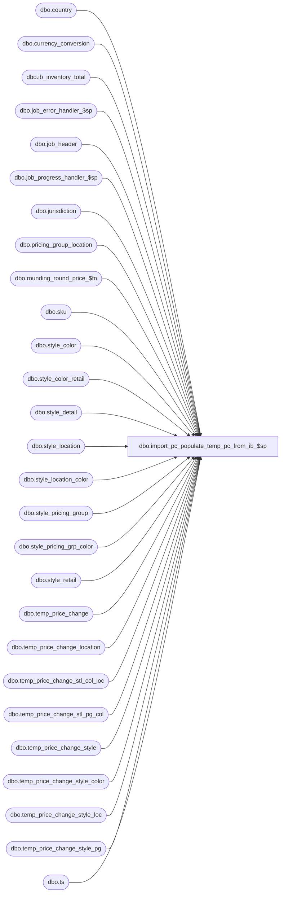

# dbo.import_pc_populate_temp_pc_from_ib_$sp

**Database:** me_01  
**Server:** bedrockdb02  

## Architecture Diagram



## Table Dependencies

| Referenced Table |
|---|
| dbo.country |
| dbo.currency_conversion |
| dbo.ib_inventory_total |
| dbo.job_error_handler_$sp |
| dbo.job_header |
| dbo.job_progress_handler_$sp |
| dbo.jurisdiction |
| dbo.pricing_group_location |
| dbo.rounding_round_price_$fn |
| dbo.sku |
| dbo.style_color |
| dbo.style_color_retail |
| dbo.style_detail |
| dbo.style_location |
| dbo.style_location_color |
| dbo.style_pricing_group |
| dbo.style_pricing_grp_color |
| dbo.style_retail |
| dbo.temp_price_change |
| dbo.temp_price_change_location |
| dbo.temp_price_change_stl_col_loc |
| dbo.temp_price_change_stl_pg_col |
| dbo.temp_price_change_style |
| dbo.temp_price_change_style_color |
| dbo.temp_price_change_style_loc |
| dbo.temp_price_change_style_pg |
| dbo.ts |

## Stored Procedure Code

```sql
Create PROCEDURE [dbo].[import_pc_populate_temp_pc_from_ib_$sp]
	(@job_id INT)

AS

/*
	Version		: 1.00
	Created		: Oct 2010
	Created by	: Ivan Dimitrov
	Description	: This procedure populates a work table in PCM for a range of imp_price_change_id determined by job_id.
				  It's called by import_asn_batch_$sp.
	08/03/2012      Qing Yang    137420 - error in job_error after running segment 34000 to import price changes
	9/4/2015 	Ivan Dimitrov	131230 - Segment 34000 - calculation_value column does not allow NULL
	2/17/2016	Ivan Dimitrov	144285 - Pipeline segmetn 34000 PM Import to PM - Mark down for style with color exception higher than chain not importing
*/

BEGIN
	-- c_sale_type, c_return_type, c_layaway_pickup_type
	DECLARE @line_id SMALLINT, @proc_name NVARCHAR(30), @sql_err_num DECIMAL(38,0), @table_name NVARCHAR(30),
			@operation_name	NVARCHAR(30), @error_msg NVARCHAR(2000), @job_type TINYINT, @c_true BIT, @c_false BIT,
			@range_start DECIMAL(24,0), @range_end DECIMAL(24,0), @debug_flag BIT, @temp_pc_count INT,
			@count INT, @job_debug_flag BIT, @from_new_id DECIMAL(12,0), @to_new_id DECIMAL(12,0), @document_no NVARCHAR(20),
			@msg NVARCHAR(500), @language_id SMALLINT, @seq_count int

	SELECT   @job_type		= 30
			, @proc_name	= N'import_pc_populate_temp_pc_from_ib_$sp'
			, @c_false		= 0
			, @c_true		= 1
			, @line_id		= 10
			, @language_id	= 1033

---------------
	BEGIN TRY

		-- Get parameters associates to the current job
		SELECT @range_start = range_start, @range_end = range_end,
			   @job_debug_flag = debug_flag
		FROM job_header
		WHERE job_id = @job_id
		AND job_type = @job_type

		-- Log progress if job_params.debug_flag is true
		EXEC job_progress_handler_$sp @job_type, @job_id, @proc_name, @line_id, @job_debug_flag


		SET @line_id = 20
		-- UPDATE temp_price_change_style from ib_inv, style_retail, style_detail
		UPDATE ts
		SET
		average_cost = sd.last_net_final_po_cost
		,total_cost = ISNULL(ib.total_cost,0)
		,total_units = ISNULL(ib.total_units,0)
		,original_selling_retail = sr.original_selling_retail
		,current_selling_retail = sr.current_selling_retail
		,old_price = sr.current_selling_retail
		,list_retail = sr.compare_at_retail
		,last_po_cost = sd.last_net_final_po_cost
		,total_valuation_cost = ISNULL(ib.total_cost,0)
		,current_valuation_retail = sr.current_valuation_retail
		,original_valuation_retail = sr.original_valuation_retail

		FROM temp_price_change_style ts
		INNER JOIN temp_price_change tpc
			ON ts.temp_price_change_id = tpc.temp_price_change_id
			AND tpc.job_id = @job_id
		INNER JOIN style_retail sr
			ON (ts.style_id = sr.style_id
			AND tpc.jurisdiction_id = sr.jurisdiction_id)
		INNER JOIN style_detail sd
			ON ts.style_id = sd.style_id
		LEFT OUTER JOIN (SELECT k.style_id, SUM(i.total_on_hand_cost) as total_cost,
									SUM(i.total_on_hand_selling_retail) as total_sel_retail,
									SUM(i.total_on_hand_units) as total_units,
									SUM(i.total_on_hand_valuation_retail) as total_val_retail
					FROM ib_inventory_total i, sku k, temp_price_change_location tl, temp_price_change_style ts2
					WHERE i.sku_id = k.sku_id
					AND i.location_id = tl.location_id
					AND k.style_id = ts2.style_id
					AND ts2.imp_price_change_id BETWEEN @range_start and @range_end
					AND ts2.job_id = @job_id
					GROUP BY k.style_id
					) ib
			ON ib.style_id = ts.style_id
		WHERE ts.imp_price_change_id BETWEEN @range_start and @range_end
		AND ts.job_id = @job_id

		-- Log progress if job_params.debug_flag is true
		EXEC job_progress_handler_$sp @job_type, @job_id, @proc_name, @line_id, @job_debug_flag


		SET @line_id = 22
		-- UPDATE temp_price_change_style avg cost where units on hand <> 0
		UPDATE temp_price_change_style
		SET average_cost = round(total_cost / total_units,2)
		WHERE imp_price_change_id BETWEEN @range_start and @range_end
		AND job_id = @job_id
		AND total_units <> 0


		-- Log progress if job_params.debug_flag is true
		EXEC job_progress_handler_$sp @job_type, @job_id, @proc_name, @line_id, @job_debug_flag


		SET @line_id = 24
		-- UPDATE temp_price_change_style method dependent values
		UPDATE temp_price_change_style
		SET base_value =  CASE base_calculation_on
							WHEN 0 THEN original_selling_retail
							WHEN 1 THEN current_selling_retail
							WHEN 2 THEN list_retail
							WHEN 3 THEN last_po_cost
						END
		WHERE imp_price_change_id BETWEEN @range_start and @range_end
		AND job_id = @job_id
		AND calculation_method in (0,1)  -- percent change, amount change

		UPDATE t
		SET new_price =  CASE t.calculation_method
							WHEN 0 THEN dbo.rounding_round_price_$fn(base_value - base_value * t.calculation_value / 100, tpc.pricing_rule_id) -- % change
							WHEN 1 THEN dbo.rounding_round_price_$fn(base_value - t.calculation_value, tpc.pricing_rule_id)
						END
		FROM temp_price_change_style t, temp_price_change tpc
		WHERE t.imp_price_change_id BETWEEN @range_start and @range_end
		AND t.temp_price_change_id = tpc.temp_price_change_id
		AND tpc.job_id = @job_id
		AND t.job_id = @job_id
		AND t.calculation_method in (0,1)  -- percent change, amount change
		AND t.price_change_type in (0,3) -- MD, MUC


				UPDATE t
		SET new_price =  CASE t.calculation_method
							WHEN 0 THEN dbo.rounding_round_price_$fn(base_value + base_value * t.calculation_value / 100, tpc.pricing_rule_id) -- % change
							WHEN 1 THEN dbo.rounding_round_price_$fn(base_value + t.calculation_value, tpc.pricing_rule_id)
						END
		FROM temp_price_change_style t, temp_price_change tpc
		WHERE t.imp_price_change_id BETWEEN @range_start and @range_end
		AND t.temp_price_change_id = tpc.temp_price_change_id
		AND tpc.job_id = @job_id
		AND t.job_id = @job_id
		AND t.calculation_method in (0,1)  -- percent change, amount change
		AND t.price_change_type in (1,2) -- MU, MDC

		-- update valuation prices
		UPDATE t
		SET new_valuation_price =  new_price * (select exchange_rate
												from currency_conversion cc, country ch, country c2, jurisdiction jh, jurisdiction j2
												where cc.to_currency_id = c2.currency_id
												AND cc.from_currency_id = ch.currency_id
												AND ch.country_id = jh.country_id
												AND jh.home_jurisdiction_flag = 1
												AND c2.country_id = j2.country_id
												AND currency_conversion_type = 2 -- pricing
												AND cc.effective_to_date IS NULL -- current
												AND j2.jurisdiction_id = tpc.jurisdiction_id)
			,total_valuation_cost = t.total_cost * (select exchange_rate
												from currency_conversion cc, country ch, country c2, jurisdiction jh, jurisdiction j2
												where cc.to_currency_id = c2.currency_id
												AND cc.from_currency_id = ch.currency_id
												AND ch.country_id = jh.country_id
												AND jh.home_jurisdiction_flag = 1
												AND c2.country_id = j2.country_id
												AND currency_conversion_type = 2 -- pricing
												AND cc.effective_to_date IS NULL -- current
												AND j2.jurisdiction_id = tpc.jurisdiction_id)
		FROM temp_price_change_style t, temp_price_change tpc
		WHERE t.temp_price_change_id = tpc.temp_price_change_id
		AND t.imp_price_change_id BETWEEN @range_start and @range_end
		AND t.job_id = @job_id


		-- Log progress if job_params.debug_flag is true
		EXEC job_progress_handler_$sp @job_type, @job_id, @proc_name, @line_id, @job_debug_flag

---------------
		-- UPDATE temp_price_change_style_color

		SET @line_id = 30

		-- Add color exceptions for when not overwriting exceptions OR for lower(for MD), higher(MU) priced style/colors
		INSERT INTO temp_price_change_style_color
			(job_id
			,imp_price_change_id
			,temp_price_change_style_color_id
			,temp_price_change_id
			,temp_price_change_style_id
			,price_change_type
			,calculation_method
			,calculation_value
			,base_calculation_on
			,base_value
			,old_price
			,new_price
			,color_id
			,price_status_id
			,total_cost
			,total_units
			,total_valuation_cost
			,redundant_flag
			,style_color_id)
		SELECT DISTINCT
			@job_id
			,t.imp_price_change_id
			,t.temp_price_change_id as temp_price_change_style_color_id
			,t.temp_price_change_id
			,ts.style_id as temp_price_change_style_id
			,ts.price_change_type
			,2 as calculation_method -- always use new price
			,scr.current_selling_retail as calculation_value
			,null as base_calculation_on
			,null as base_value
			,scr.current_selling_retail as old_price
			,scr.current_selling_retail as new_price
			,sc.color_id
			,scr.current_price_status_id
			,0 as total_cost
			,0 as total_units
			,0 as total_valuation_cost
			,0 as redundant_flag
                        ,sc.style_color_id
		from temp_price_change t
		INNER JOIN temp_price_change_style ts
			ON t.temp_price_change_id = ts.temp_price_change_id
			AND t.job_id = ts.job_id
		INNER JOIN style_color_retail scr
			ON ts.style_id = scr.style_id
			AND t.jurisdiction_id = scr.jurisdiction_id
			AND scr.current_selling_retail IS NOT NULL
		INNER JOIN style_color sc
			ON ts.style_id = sc.style_id
			AND scr.style_id = sc.style_id
			AND scr.style_color_id = sc.style_color_id
		WHERE t.imp_price_change_id BETWEEN @range_start AND @range_end
		AND t.job_id = @job_id
		AND ts.job_id = @job_id
		AND t.location_grouping = 0 -- chain/jurisdiction
		AND NOT EXISTS (SELECT 1  -- make sure the excption does not exist in the temp table already
						FROM temp_price_change_style_color tsc
						WHERE ts.style_id = tsc.temp_price_change_style_id
						AND sc.color_id = tsc.color_id)
		AND (	t.override_price_exceptions = 0 -- do not override exceptions
				OR
				(
				t.override_price_exceptions = 1 -- override exceptions
				AND (
						(scr.current_selling_retail < ts.new_price AND t.price_change_type in (0,3)) -- MD, MUC
						OR
						(scr.current_selling_retail > ts.new_price AND t.price_change_type in (1,2)) -- MU, MDC
					)
				)
			)

		-- Log progress if job_params.debug_flag is true
		EXEC job_progress_handler_$sp @job_type, @job_id, @proc_name, @line_id, @job_debug_flag

		SET @line_id = 40
		-- UPDATE temp_price_change_style_color from ib_inv, style_retail, style_detail
		UPDATE ts
		SET
		total_cost = ISNULL(ib.total_cost,0)
		,total_units = ISNULL(ib.total_units,0)
		,original_selling_retail = ISNULL(scr.original_selling_retail, sr.original_selling_retail)
		,current_selling_retail = ISNULL(scr.current_selling_retail,sr.current_selling_retail)
		,old_price = ISNULL(scr.current_selling_retail,sr.current_selling_retail)
		,list_retail = sr.compare_at_retail
		,last_po_cost = sd.last_net_final_po_cost
		,total_valuation_cost = ISNULL(ib.total_cost,0)
		,current_valuation_retail = ISNULL(scr.current_valuation_retail,sr.current_valuation_retail)
		,original_valuation_retail = ISNULL(scr.original_valuation_retail, sr.original_valuation_retail)
		FROM temp_price_change_style_color ts
		INNER JOIN temp_price_change tpc
			ON ts.temp_price_change_id = tpc.temp_price_change_id
			AND tpc.job_id = @job_id
		INNER JOIN style_color sc
			ON ts.temp_price_change_style_id = sc.style_id
			AND ts.color_id = sc.color_id
		INNER JOIN style_retail sr
			ON ts.temp_price_change_style_id = sr.style_id
			AND tpc.jurisdiction_id = sr.jurisdiction_id
		INNER JOIN style_detail sd
			ON ts.temp_price_change_style_id = sd.style_id
		LEFT OUTER JOIN style_color_retail scr
			ON (ts.temp_price_change_style_id = scr.style_id
			AND sc.style_color_id = scr.style_color_id
			AND tpc.jurisdiction_id = scr.jurisdiction_id)
		LEFT OUTER JOIN (SELECT k.style_id, sc.color_id, SUM(i.total_on_hand_cost) as total_cost,
									SUM(i.total_on_hand_selling_retail) as total_sel_retail,
									SUM(i.total_on_hand_units) as total_units,
									SUM(i.total_on_hand_valuation_retail) as total_val_retail
					FROM ib_inventory_total i, sku k, style_color sc, temp_price_change_location tl, temp_price_change_style_color ts2
					WHERE i.sku_id = k.sku_id
					AND k.style_color_id = sc.style_color_id
					AND i.location_id = tl.location_id
					AND k.style_id = ts2.temp_price_change_style_id
					AND ts2.imp_price_change_id BETWEEN @range_start and @range_end
					AND ts2.job_id = @job_id
					GROUP BY k.style_id, sc.color_id
					) ib
			ON ib.style_id = ts.temp_price_change_style_id
			AND ib.color_id = ts.color_id
		WHERE ts.imp_price_change_id BETWEEN @range_start and @range_end
		AND ts.job_id = @job_id


		-- Log progress if job_params.debug_flag is true
		EXEC job_progress_handler_$sp @job_type, @job_id, @proc_name, @line_id, @job_debug_flag


		SET @line_id = 42
		-- UPDATE temp_price_change_style method dependent values
		UPDATE temp_price_change_style_color
		SET base_value =  CASE base_calculation_on
							WHEN 0 THEN original_selling_retail
							WHEN 1 THEN current_selling_retail
							WHEN 2 THEN list_retail
							WHEN 3 THEN last_po_cost
						END
		WHERE imp_price_change_id BETWEEN @range_start and @range_end
		AND job_id = @job_id
		AND calculation_method in (0,1)  -- percent change, amount change

		UPDATE t
		SET new_price =  CASE t.calculation_method
							WHEN 0 THEN dbo.rounding_round_price_$fn(base_value - base_value * t.calculation_value / 100, tpc.pricing_rule_id) -- % change
							WHEN 1 THEN dbo.rounding_round_price_$fn(base_value - t.calculation_value, tpc.pricing_rule_id)
						END
		FROM temp_price_change_style_color t, temp_price_change tpc
		WHERE t.imp_price_change_id BETWEEN @range_start and @range_end
		AND t.temp_price_change_id = tpc.temp_price_change_id
		AND tpc.job_id = @job_id
		AND t.job_id = @job_id
		AND t.calculation_method in (0,1)  -- percent change, amount change
		AND t.price_change_type in (0,3) -- MD, MUC


		UPDATE t
		SET new_price =  CASE t.calculation_method
							WHEN 0 THEN dbo.rounding_round_price_$fn(base_value + base_value * t.calculation_value / 100, tpc.pricing_rule_id) -- % change
							WHEN 1 THEN dbo.rounding_round_price_$fn(base_value + t.calculation_value, tpc.pricing_rule_id)
						END
		FROM temp_price_change_style_color t, temp_price_change tpc
		WHERE t.imp_price_change_id BETWEEN @range_start and @range_end
		AND t.temp_price_change_id = tpc.temp_price_change_id
		AND tpc.job_id = @job_id
		AND t.job_id = @job_id
		AND t.calculation_method in (0,1)  -- percent change, amount change
		AND t.price_change_type in (1,2) -- MU, MDC


		-- Log progress if job_params.debug_flag is true
		EXEC job_progress_handler_$sp @job_type, @job_id, @proc_name, @line_id, @job_debug_flag

		SET @line_id = 44
		-- update valuation prices
		UPDATE t
		SET new_valuation_price =  new_price * (select exchange_rate
												from currency_conversion cc, country ch, country c2, jurisdiction jh, jurisdiction j2
												where cc.to_currency_id = c2.currency_id
												AND cc.from_currency_id = ch.currency_id
												AND ch.country_id = jh.country_id
												AND jh.home_jurisdiction_flag = 1
												AND c2.country_id = j2.country_id
												AND currency_conversion_type = 2 -- pricing
												AND cc.effective_to_date IS NULL -- current
												AND j2.jurisdiction_id = tpc.jurisdiction_id)
			,total_valuation_cost = t.total_cost * (select exchange_rate
												from currency_conversion cc, country ch, country c2, jurisdiction jh, jurisdiction j2
												where cc.to_currency_id = c2.currency_id
												AND cc.from_currency_id = ch.currency_id
												AND ch.country_id = jh.country_id
												AND jh.home_jurisdiction_flag = 1
												AND c2.country_id = j2.country_id
												AND currency_conversion_type = 2 -- pricing
												AND cc.effective_to_date IS NULL -- current
												AND j2.jurisdiction_id = tpc.jurisdiction_id)
		FROM temp_price_change_style_color t, temp_price_change tpc
		WHERE t.temp_price_change_id = tpc.temp_price_change_id
		AND t.imp_price_change_id BETWEEN @range_start and @range_end
		AND t.job_id = @job_id

		-- Log progress if job_params.debug_flag is true
		EXEC job_progress_handler_$sp @job_type, @job_id, @proc_name, @line_id, @job_debug_flag
--------------
		-- UPDATE temp_price_change_style_pg


		SET @line_id = 50
		-- Create extra PG exceptions
		INSERT INTO temp_price_change_style_pg
			(job_id
			,imp_price_change_id
			,temp_price_change_style_pg_id
			,temp_price_change_id
			,temp_price_change_style_id
			,price_change_type
			,calculation_method
			,calculation_value
			,base_calculation_on
			,base_value
			,old_price
			,new_price
			,pricing_group_id
			,price_status_id
			,total_cost
			,total_units
			,total_valuation_cost
			,redundant_flag)
		SELECT DISTINCT
			@job_id
			,t.imp_price_change_id
			,t.temp_price_change_id as temp_price_change_style_color_id
			,t.temp_price_change_id
			,ts.style_id as temp_price_change_style_id
			,ts.price_change_type
			,2 as calculation_method -- always use new price
			,spg.current_selling_retail as calculation_value
			,null as base_calculation_on
			,null as base_value
			,spg.current_selling_retail as old_price
			,spg.current_selling_retail as new_price
			,spg.pricing_group_id
			,spg.current_price_status_id
			,0 as total_cost
			,0 as total_units
			,0 as total_valuation_cost
			,0 as redundant_flag
		from temp_price_change t
		INNER JOIN temp_price_change_style ts
			ON t.temp_price_change_id = ts.temp_price_change_id
			AND t.job_id = ts.job_id
		INNER JOIN style_pricing_group spg
			ON ts.style_id = spg.style_id
			AND t.jurisdiction_id = spg.jurisdiction_id
			AND spg.current_selling_retail IS NOT NULL
		WHERE t.imp_price_change_id BETWEEN @range_start AND @range_end
		AND t.job_id = @job_id
		AND ts.job_id = @job_id
		AND t.location_grouping = 0 -- chain/jurisdiction
		AND NOT EXISTS (SELECT 1  -- make sure the excption does not exist in the temp table already
						FROM temp_price_change_style_pg tspg
						WHERE ts.style_id = tspg.temp_price_change_style_id
						AND tspg.pricing_group_id = spg.pricing_group_id)
		AND (	t.override_price_exceptions = 0 -- do not override exceptions
				OR
				(
				t.override_price_exceptions = 1 -- override exceptions
				AND (
						(spg.current_selling_retail < ts.new_price AND t.price_change_type in (0,3)) -- MD, MUC
						OR
						(spg.current_selling_retail > ts.new_price AND t.price_change_type in (1,2)) -- MU, MDC
					)
				)
			)

		-- Log progress if job_params.debug_flag is true
		EXEC job_progress_handler_$sp @job_type, @job_id, @proc_name, @line_id, @job_debug_flag

		SET @line_id = 60
		-- UPDATE temp_price_change_style_pg from ib_inv, style_retail, style_detail
		UPDATE ts
		SET
		total_cost = ISNULL(ib.total_cost,0)
		,total_units = ISNULL(ib.total_units,0)
		,original_selling_retail = ISNULL(spg.original_selling_retail, sr.original_selling_retail)
		,current_selling_retail = ISNULL(spg.current_selling_retail, sr.current_selling_retail)
		,old_price = ISNULL(spg.current_selling_retail, sr.current_selling_retail)
		,list_retail = sr.compare_at_retail
		,last_po_cost = sd.last_net_final_po_cost
		,total_valuation_cost = ISNULL(ib.total_cost,0)
		,current_valuation_retail = ISNULL(spg.current_valuation_retail, sr.current_valuation_retail)
		,original_valuation_retail = ISNULL(spg.original_valuation_retail, sr.original_valuation_retail)
		FROM temp_price_change_style_pg ts
		INNER JOIN temp_price_change tpc
			ON ts.temp_price_change_id = tpc.temp_price_change_id
			AND tpc.job_id = @job_id
		INNER JOIN style_retail sr
			ON ts.temp_price_change_style_id = sr.style_id
			AND tpc.jurisdiction_id = sr.jurisdiction_id
		INNER JOIN style_detail sd
			ON ts.temp_price_change_style_id = sd.style_id
		LEFT OUTER JOIN style_pricing_group spg
			ON (ts.temp_price_change_style_id = spg.style_id
			AND ts.pricing_group_id = spg.pricing_group_id
			AND tpc.jurisdiction_id = spg.jurisdiction_id)
		LEFT OUTER JOIN (SELECT k.style_id, ts2.pricing_group_id, SUM(i.total_on_hand_cost) as total_cost,
									SUM(i.total_on_hand_selling_retail) as total_sel_retail,
									SUM(i.total_on_hand_units) as total_units,
									SUM(i.total_on_hand_valuation_retail) as total_val_retail
					FROM ib_inventory_total i, sku k, pricing_group_location pgl, temp_price_change_style_pg ts2
					WHERE i.sku_id = k.sku_id
					AND i.location_id = pgl.location_id
					AND pgl.pricing_group_id = ts2.pricing_group_id
					AND k.style_id = ts2.temp_price_change_style_id
					AND ts2.imp_price_change_id BETWEEN @range_start and @range_end
					AND ts2.job_id = @job_id
					GROUP BY k.style_id, ts2.pricing_group_id
					) ib
			ON ib.style_id = ts.temp_price_change_style_id
			AND ib.pricing_group_id = ts.pricing_group_id
		WHERE ts.imp_price_change_id BETWEEN @range_start and @range_end
		AND ts.job_id = @job_id


		-- Log progress if job_params.debug_flag is true
		EXEC job_progress_handler_$sp @job_type, @job_id, @proc_name, @line_id, @job_debug_flag

		SET @line_id = 62
		-- UPDATE temp_price_change_style method dependent values
		UPDATE temp_price_change_style_pg
		SET base_value =  CASE base_calculation_on
							WHEN 0 THEN original_selling_retail
							WHEN 1 THEN current_selling_retail
							WHEN 2 THEN list_retail
							WHEN 3 THEN last_po_cost
						END
		WHERE imp_price_change_id BETWEEN @range_start and @range_end
		AND job_id = @job_id
		AND calculation_method in (0,1)  -- percent change, amount change

		UPDATE t
		SET new_price =  CASE t.calculation_method
							WHEN 0 THEN dbo.rounding_round_price_$fn(base_value - base_value * t.calculation_value / 100, tpc.pricing_rule_id) -- % change
							WHEN 1 THEN dbo.rounding_round_price_$fn(base_value - t.calculation_value, tpc.pricing_rule_id)
						END
		FROM temp_price_change_style_pg t, temp_price_change tpc
		WHERE t.imp_price_change_id BETWEEN @range_start and @range_end
		AND t.temp_price_change_id = tpc.temp_price_change_id
		AND tpc.job_id = @job_id
		AND t.job_id = @job_id
		AND t.calculation_method in (0,1)  -- percent change, amount change
		AND t.price_change_type in (0,3) -- MD, MUC

		SET @line_id = 66
		UPDATE t
		SET new_price =  CASE t.calculation_method
							WHEN 0 THEN dbo.rounding_round_price_$fn(base_value + base_value * t.calculation_value / 100, tpc.pricing_rule_id) -- % change
							WHEN 1 THEN dbo.rounding_round_price_$fn(base_value + t.calculation_value, tpc.pricing_rule_id)
						END
		FROM temp_price_change_style_pg t, temp_price_change tpc
		WHERE t.imp_price_change_id BETWEEN @range_start and @range_end
		AND t.temp_price_change_id = tpc.temp_price_change_id
		AND tpc.job_id = @job_id
		AND t.job_id = @job_id
		AND t.calculation_method in (0,1)  -- percent change, amount change
		AND t.price_change_type in (1,2) -- MU, MDC


		-- Log progress if job_params.debug_flag is true
		EXEC job_progress_handler_$sp @job_type, @job_id, @proc_name, @line_id, @job_debug_flag


		SET @line_id = 68
		-- update valuation prices
		UPDATE t
		SET new_valuation_price =  new_price * (select exchange_rate
												from currency_conversion cc, country ch, country c2, jurisdiction jh, jurisdiction j2
												where cc.to_currency_id = c2.currency_id
												AND cc.from_currency_id = ch.currency_id
												AND ch.country_id = jh.country_id
												AND jh.home_jurisdiction_flag = 1
												AND c2.country_id = j2.country_id
												AND currency_conversion_type = 2 -- pricing
												AND cc.effective_to_date IS NULL -- current
												AND j2.jurisdiction_id = tpc.jurisdiction_id)
			,total_valuation_cost = t.total_cost * (select exchange_rate
												from currency_conversion cc, country ch, country c2, jurisdiction jh, jurisdiction j2
												where cc.to_currency_id = c2.currency_id
												AND cc.from_currency_id = ch.currency_id
												AND ch.country_id = jh.country_id
												AND jh.home_jurisdiction_flag = 1
												AND c2.country_id = j2.country_id
												AND currency_conversion_type = 2 -- pricing
												AND cc.effective_to_date IS NULL -- current
												AND j2.jurisdiction_id = tpc.jurisdiction_id)
		FROM temp_price_change_style_pg t, temp_price_change tpc
		WHERE t.temp_price_change_id = tpc.temp_price_change_id
		AND t.imp_price_change_id BETWEEN @range_start and @range_end
		AND t.job_id = @job_id

		-- Log progress if job_params.debug_flag is true
		EXEC job_progress_handler_$sp @job_type, @job_id, @proc_name, @line_id, @job_debug_flag


-------------
		SET @line_id = 70
		-- UPDATE temp_price_change_style_loc from ib_inv, style_retail, style_detail

		-- Create extra Loc exceptions
		INSERT INTO temp_price_change_style_loc
			(job_id
			,imp_price_change_id
			,temp_price_change_style_loc_id
			,temp_price_change_id
			,temp_price_change_style_id
			,price_change_type
			,calculation_method
			,calculation_value
			,base_calculation_on
			,base_value
			,old_price
			,new_price
			,location_id
			,price_status_id
			,total_cost
			,total_units
			,total_valuation_cost
			,redundant_flag
			,average_cost)
		SELECT DISTINCT
			@job_id
			,t.imp_price_change_id
			,t.temp_price_change_id as temp_price_change_style_loc_id
			,t.temp_price_change_id
			,ts.style_id as temp_price_change_style_id
			,ts.price_change_type
			,2 as calculation_method -- always use new price
			,sl.current_selling_retail as calculation_value
			,null as base_calculation_on
			,null as base_value
			,sl.current_selling_retail as old_price
			,sl.current_selling_retail as new_price
			,sl.location_id
			,sl.current_price_status_id
			,0 as total_cost
			,0 as total_units
			,0 as total_valuation_cost
			,0 as redundant_flag
			,0 as average_cost
		from temp_price_change t
		INNER JOIN temp_price_change_style ts
			ON t.temp_price_change_id = ts.temp_price_change_id
			AND t.job_id = ts.job_id
		INNER JOIN style_location sl
			ON ts.style_id = sl.style_id
			AND t.jurisdiction_id = sl.jurisdiction_id
			AND sl.current_selling_retail IS NOT NULL
		WHERE t.imp_price_change_id BETWEEN @range_start AND @range_end
		AND t.job_id = @job_id
		AND ts.job_id = @job_id
		AND t.location_grouping = 0 -- chain/jurisdiction
		AND NOT EXISTS (SELECT 1  -- make sure the excption does not exist in the temp table already
						FROM temp_price_change_style_loc tsl
						WHERE ts.style_id = tsl.temp_price_change_style_id
						AND tsl.location_id = sl.location_id)
		AND (	t.override_price_exceptions = 0 -- do not override exceptions
				OR
				(
				t.override_price_exceptions = 1 -- override exceptions
				AND (
						(sl.current_selling_retail < ts.new_price AND t.price_change_type in (0,3)) -- MD, MUC
						OR
						(sl.current_selling_retail > ts.new_price AND t.price_change_type in (1,2)) -- MU, MDC
					)
				)
			)

		-- Log progress if job_params.debug_flag is true
		EXEC job_progress_handler_$sp @job_type, @job_id, @proc_name, @line_id, @job_debug_flag

		SET @line_id = 80
		-- UPDATE temp_price_change_style_loc from ib_inv, style_retail, style_detail

		-- create temp table
		SELECT @job_id as job_id, k.style_id, tl.location_id, SUM(i.total_on_hand_cost) as total_cost,
											SUM(i.total_on_hand_selling_retail) as total_sel_retail,
											SUM(i.total_on_hand_units) as total_units,
											SUM(i.total_on_hand_valuation_retail) as total_val_retail
		INTO #ib_style_loc
		FROM ib_inventory_total i, sku k, temp_price_change_location tl, temp_price_change_style_loc ts2
		WHERE i.sku_id = k.sku_id
		AND i.location_id = tl.location_id
		AND tl.location_id = ts2.location_id
		AND k.style_id = ts2.temp_price_change_style_id
		AND ts2.imp_price_change_id BETWEEN @range_start AND @range_end
		AND ts2.job_id = @job_id
		GROUP BY k.style_id, tl.location_id

		-- add index on it
		ALTER TABLE #ib_style_loc ADD UNIQUE NONCLUSTERED
		(
			job_id ASC,
			style_id ASC,
			location_id ASC
		)WITH (PAD_INDEX  = OFF, STATISTICS_NORECOMPUTE  = OFF, SORT_IN_TEMPDB = OFF, IGNORE_DUP_KEY = OFF, ONLINE = OFF, ALLOW_ROW_LOCKS  = ON, ALLOW_PAGE_LOCKS  = ON)


		UPDATE ts
		SET
		total_cost = ISNULL(ib.total_cost,0)
		,total_units = ISNULL(ib.total_units,0)
		,original_selling_retail = ISNULL(sl.original_selling_retail, sr.original_selling_retail)
		,current_selling_retail = ISNULL(sl.current_selling_retail, sr.current_selling_retail)
		,old_price = ISNULL(sl.current_selling_retail, sr.current_selling_retail)
		,list_retail = sr.compare_at_retail
		,last_po_cost = sd.last_net_final_po_cost
		,total_valuation_cost = ISNULL(ib.total_cost,0)
		,current_valuation_retail = ISNULL(sl.current_valuation_retail, sr.current_valuation_retail)
		,original_valuation_retail = ISNULL(sl.original_valuation_retail, sr.original_valuation_retail)
		FROM temp_price_change_style_loc ts (tablockx)
		INNER JOIN temp_price_change tpc
			ON ts.temp_price_change_id = tpc.temp_price_change_id
			AND tpc.job_id = @job_id
		INNER JOIN style_retail sr
			ON ts.temp_price_change_style_id = sr.style_id
			AND tpc.jurisdiction_id = sr.jurisdiction_id
		INNER JOIN style_detail sd
			ON ts.temp_price_change_style_id = sd.style_id
		LEFT OUTER JOIN style_location sl
			ON (ts.temp_price_change_style_id = sl.style_id
			AND ts.location_id = sl.location_id
			AND tpc.jurisdiction_id = sl.jurisdiction_id)
		LEFT OUTER JOIN #ib_style_loc ib
			ON ib.style_id = ts.temp_price_change_style_id
			AND ib.location_id = ts.location_id
			AND ib.job_id = ts.job_id
		WHERE ts.imp_price_change_id BETWEEN @range_start and @range_end
		AND ts.job_id = @job_id


		DROP table #ib_style_loc


		SET @line_id = 84
		-- UPDATE temp_price_change_style method dependent values
		UPDATE temp_price_change_style_loc
		SET base_value =  CASE base_calculation_on
							WHEN 0 THEN original_selling_retail
							WHEN 1 THEN current_selling_retail
							WHEN 2 THEN list_retail
							WHEN 3 THEN last_po_cost
						END
		WHERE imp_price_change_id BETWEEN @range_start and @range_end
		AND job_id = @job_id
		AND calculation_method in (0,1)  -- percent change, amount change

		UPDATE t
		SET new_price =  CASE t.calculation_method
							WHEN 0 THEN dbo.rounding_round_price_$fn(base_value - base_value * t.calculation_value / 100, tpc.pricing_rule_id) -- % change
							WHEN 1 THEN dbo.rounding_round_price_$fn(base_value - t.calculation_value, tpc.pricing_rule_id)
						END
		FROM temp_price_change_style_loc t (tablockx), temp_price_change tpc
		WHERE t.imp_price_change_id BETWEEN @range_start and @range_end
		AND t.temp_price_change_id = tpc.temp_price_change_id
		AND tpc.job_id = @job_id
		AND t.job_id = @job_id
		AND t.calculation_method in (0,1)  -- percent change, amount change
		AND t.price_change_type in (0,3) -- MD, MUC


		UPDATE t
		SET new_price =  CASE t.calculation_method
							WHEN 0 THEN dbo.rounding_round_price_$fn(base_value + base_value * t.calculation_value / 100, tpc.pricing_rule_id) -- % change
							WHEN 1 THEN dbo.rounding_round_price_$fn(base_value + t.calculation_value, tpc.pricing_rule_id)
						END
		FROM temp_price_change_style_loc t (tablockx), temp_price_change tpc
		WHERE t.imp_price_change_id BETWEEN @range_start and @range_end
		AND t.job_id = @job_id
		AND tpc.job_id = @job_id
		AND t.temp_price_change_id = tpc.temp_price_change_id
		AND t.calculation_method in (0,1)  -- percent change, amount change
		AND t.price_change_type in (1,2) -- MU, MDC


		-- Log progress if job_params.debug_flag is true
		EXEC job_progress_handler_$sp @job_type, @job_id, @proc_name, @line_id, @job_debug_flag

		SET @line_id = 86
		-- update valuation prices
		UPDATE t
		SET new_valuation_price =  new_price * (select exchange_rate
												from currency_conversion cc, country ch, country c2, jurisdiction jh, jurisdiction j2
												where cc.to_currency_id = c2.currency_id
												AND cc.from_currency_id = ch.currency_id
												AND ch.country_id = jh.country_id
												AND jh.home_jurisdiction_flag = 1
												AND c2.country_id = j2.country_id
												AND currency_conversion_type = 2 -- pricing
												AND cc.effective_to_date IS NULL -- current
												AND j2.jurisdiction_id = tpc.jurisdiction_id)
			,total_valuation_cost = t.total_cost * (select exchange_rate
												from currency_conversion cc, country ch, country c2, jurisdiction jh, jurisdiction j2
												where cc.to_currency_id = c2.currency_id
												AND cc.from_currency_id = ch.currency_id
												AND ch.country_id = jh.country_id
												AND jh.home_jurisdiction_flag = 1
												AND c2.country_id = j2.country_id
												AND currency_conversion_type = 2 -- pricing
												AND cc.effective_to_date IS NULL -- current
												AND j2.jurisdiction_id = tpc.jurisdiction_id)
		FROM temp_price_change_style_loc t (tablockx), temp_price_change tpc
		WHERE t.temp_price_change_id = tpc.temp_price_change_id
		AND t.imp_price_change_id BETWEEN @range_start and @range_end
		AND t.job_id = @job_id

		-- Log progress if job_params.debug_flag is true
		EXEC job_progress_handler_$sp @job_type, @job_id, @proc_name, @line_id, @job_debug_flag

--------------
		SET @line_id = 90
		-- Populate temp_price_change_style_pg_col

		-- Create extra PG Color exceptions for jurisdiction level PC
		INSERT INTO temp_price_change_stl_pg_col
			(job_id
			,imp_price_change_id
			,temp_price_change_stl_pg_col_id
			,temp_price_change_id
			,temp_price_change_style_id
			,price_change_type
			,calculation_method
			,calculation_value
			,base_calculation_on
			,base_value
			,old_price
			,new_price
			,color_id
			,pricing_group_id
			,price_status_id
			,total_cost
			,total_units
			,total_valuation_cost
			,redundant_flag)
		SELECT DISTINCT
			@job_id
			,t.imp_price_change_id
			,t.temp_price_change_id as temp_price_change_stl_pg_col_id
			,t.temp_price_change_id
			,ts.style_id as temp_price_change_style_id
			,ts.price_change_type
			,2 as calculation_method -- always use new price
			,spgc.current_selling_retail as calculation_value
			,null as base_calculation_on
			,null as base_value
			,spgc.current_selling_retail as old_price
			,spgc.current_selling_retail as new_price
			,sc.color_id
			,spgc.pricing_group_id
			,spgc.current_price_status_id
			,0 as total_cost
			,0 as total_units
			,0 as total_valuation_cost
			,0 as redundant_flag
		from temp_price_change t
		INNER JOIN temp_price_change_style ts
			ON t.temp_price_change_id = ts.temp_price_change_id
			AND t.job_id = ts.job_id
		INNER JOIN style_pricing_grp_color spgc
			ON ts.style_id = spgc.style_id
			AND t.jurisdiction_id = spgc.jurisdiction_id
			AND spgc.current_selling_retail IS NOT NULL
		INNER JOIN style_color sc
			ON ts.style_id = sc.style_id
			AND spgc.style_id = sc.style_id
			AND spgc.style_color_id = sc.style_color_id
		WHERE t.imp_price_change_id BETWEEN @range_start AND @range_end
		AND t.job_id = @job_id
		AND ts.job_id = @job_id
		AND t.location_grouping = 0 --chain/jurisdiction
		AND NOT EXISTS (SELECT 1  -- make sure the excption does not exist in the temp table already
						FROM temp_price_change_stl_pg_col tspgc
						WHERE ts.style_id = tspgc.temp_price_change_style_id
						AND sc.color_id = tspgc.color_id
						AND spgc.pricing_group_id = tspgc.pricing_group_id)
		AND (	t.override_price_exceptions = 0 -- do not override exceptions
				OR
				(
				t.override_price_exceptions = 1 -- override exceptions
				AND (
						(spgc.current_selling_retail < ts.new_price AND t.price_change_type in (0,3)) -- MD, MUC
						OR
						(spgc.current_selling_retail > ts.new_price AND t.price_change_type in (1,2)) -- MU, MDC
					)
				)
			)
		-- Log progress if job_params.debug_flag is true
		EXEC job_progress_handler_$sp @job_type, @job_id, @proc_name, @line_id, @job_debug_flag

		SET @line_id = 92
		-- Create extra PG Color exceptions for pricing group level PC
		INSERT INTO temp_price_change_stl_pg_col
			(job_id
			,imp_price_change_id
			,temp_price_change_stl_pg_col_id
			,temp_price_change_id
			,temp_price_change_style_id
			,price_change_type
			,calculation_method
			,calculation_value
			,base_calculation_on
			,base_value
			,old_price
			,new_price
			,color_id
			,pricing_group_id
			,price_status_id
			,total_cost
			,total_units
			,total_valuation_cost
			,redundant_flag)
		SELECT DISTINCT
			@job_id
			,t.imp_price_change_id
			,t.temp_price_change_id as temp_price_change_stl_pg_col_id
			,t.temp_price_change_id
			,ts.temp_price_change_style_id as temp_price_change_style_id
			,ts.price_change_type
			,2 as calculation_method -- always use new price
			,spgc.current_selling_retail as calculation_value
			,null as base_calculation_on
			,null as base_value
			,spgc.current_selling_retail as old_price
			,spgc.current_selling_retail as new_price
			,sc.color_id
			,spgc.pricing_group_id
			,spgc.current_price_status_id
			,0 as total_cost
			,0 as total_units
			,0 as total_valuation_cost
			,0 as redundant_flag
		from temp_price_change t
		INNER JOIN temp_price_change_style_pg ts
			ON t.temp_price_change_id = ts.temp_price_change_id
			AND t.job_id = ts.job_id
		INNER JOIN style_pricing_grp_color spgc
			ON ts.temp_price_change_style_id = spgc.style_id
			AND t.jurisdiction_id = spgc.jurisdiction_id
			AND ts.pricing_group_id = spgc.pricing_group_id
			AND spgc.current_selling_retail IS NOT NULL
		INNER JOIN style_color sc
			ON ts.temp_price_change_style_id = sc.style_id
			AND spgc.style_id = sc.style_id
			AND spgc.style_color_id = sc.style_color_id
		WHERE t.imp_price_change_id BETWEEN @range_start AND @range_end
		AND t.job_id = @job_id
		AND ts.job_id = @job_id
		AND t.location_grouping = 2 --pricing group list
		AND NOT EXISTS (SELECT 1  -- make sure the excption does not exist in the temp table already
						FROM temp_price_change_stl_pg_col tspgc
						WHERE ts.temp_price_change_style_id = tspgc.temp_price_change_style_id
						AND sc.color_id = tspgc.color_id
						AND spgc.pricing_group_id = tspgc.pricing_group_id)
		AND (	t.override_price_exceptions = 0 -- do not override exceptions
				OR
				(
				t.override_price_exceptions = 1 -- override exceptions
				AND (
						(spgc.current_selling_retail < ts.new_price AND t.price_change_type in (0,3)) -- MD, MUC
						OR
						(spgc.current_selling_retail > ts.new_price AND t.price_change_type in (1,2)) -- MU, MDC
					)
				)
			)
		-- Log progress if job_params.debug_flag is true
		EXEC job_progress_handler_$sp @job_type, @job_id, @proc_name, @line_id, @job_debug_flag

		SET @line_id = 100
		-- UPDATE temp_price_change_style_PG_color from ib_inv, style_retail, style_detail
		UPDATE ts
		SET
		total_cost = ISNULL(ib.total_cost,0)
		,total_units = ISNULL(ib.total_units,0)
		,original_selling_retail = ISNULL(spgc.original_selling_retail, sr.original_selling_retail)
		,current_selling_retail = ISNULL(spgc.current_selling_retail, sr.current_selling_retail)
		,old_price = ISNULL(spgc.current_selling_retail, sr.current_selling_retail)
		,list_retail = sr.compare_at_retail
		,last_po_cost = sd.last_net_final_po_cost
		,total_valuation_cost = ISNULL(ib.total_cost,0)
		,current_valuation_retail = ISNULL(spgc.current_valuation_retail, sr.current_valuation_retail)
		,original_valuation_retail = ISNULL(spgc.original_valuation_retail, sr.original_valuation_retail)
		FROM temp_price_change_stl_pg_col ts
		INNER JOIN temp_price_change tpc
			ON ts.temp_price_change_id = tpc.temp_price_change_id
			AND tpc.job_id = @job_id
		INNER JOIN style_color sc
			ON ts.temp_price_change_style_id = sc.style_id
			AND ts.color_id = sc.color_id
		INNER JOIN style_retail sr
			ON ts.temp_price_change_style_id = sr.style_id
			AND tpc.jurisdiction_id = sr.jurisdiction_id
		INNER JOIN style_detail sd
			ON ts.temp_price_change_style_id = sd.style_id
		LEFT OUTER JOIN style_pricing_grp_color spgc
			ON (ts.temp_price_change_style_id = spgc.style_id
			AND sc.style_color_id = spgc.style_color_id
			AND tpc.jurisdiction_id = spgc.jurisdiction_id
			AND ts.pricing_group_id = spgc.pricing_group_id)
		LEFT OUTER JOIN (SELECT k.style_id, sc.color_id, ts2.pricing_group_id, SUM(i.total_on_hand_cost) as total_cost,
									SUM(i.total_on_hand_selling_retail) as total_sel_retail,
									SUM(i.total_on_hand_units) as total_units,
									SUM(i.total_on_hand_valuation_retail) as total_val_retail
					FROM ib_inventory_total i, sku k, style_color sc, pricing_group_location pgl, temp_price_change_stl_pg_col ts2
					WHERE i.sku_id = k.sku_id
					AND k.style_color_id = sc.style_color_id
					AND i.location_id = pgl.location_id
					AND pgl.pricing_group_id = ts2.pricing_group_id
					AND k.style_id = ts2.temp_price_change_style_id
					AND ts2.imp_price_change_id BETWEEN @range_start and @range_end
					AND ts2.job_id = @job_id
					GROUP BY k.style_id, sc.color_id, ts2.pricing_group_id
					) ib
			ON ib.style_id = ts.temp_price_change_style_id
			AND ib.color_id = ts.color_id
			AND ib.pricing_group_id = ts.pricing_group_id
		WHERE ts.imp_price_change_id BETWEEN @range_start and @range_end
		AND ts.job_id = @job_id


		-- Log progress if job_params.debug_flag is true
		EXEC job_progress_handler_$sp @job_type, @job_id, @proc_name, @line_id, @job_debug_flag

		SET @line_id = 102
		-- UPDATE temp_price_change_style_pg_col method dependent values
		UPDATE temp_price_change_stl_pg_col
		SET base_value =  CASE base_calculation_on
							WHEN 0 THEN original_selling_retail
							WHEN 1 THEN current_selling_retail
							WHEN 2 THEN list_retail
							WHEN 3 THEN last_po_cost
						END
		WHERE imp_price_change_id BETWEEN @range_start and @range_end
		AND job_id = @job_id
		AND calculation_method in (0,1)  -- percent change, amount change

		UPDATE t
		SET new_price =  CASE t.calculation_method
							WHEN 0 THEN dbo.rounding_round_price_$fn(base_value - base_value * t.calculation_value / 100, tpc.pricing_rule_id) -- % change
							WHEN 1 THEN dbo.rounding_round_price_$fn(base_value - t.calculation_value, tpc.pricing_rule_id)
						END
		FROM temp_price_change_stl_pg_col t, temp_price_change tpc
		WHERE t.imp_price_change_id BETWEEN @range_start and @range_end
		AND t.temp_price_change_id = tpc.temp_price_change_id
		AND tpc.job_id = @job_id
		AND t.job_id = @job_id
		AND t.calculation_method in (0,1)  -- percent change, amount change
		AND t.price_change_type in (0,3) -- MD, MUC


		UPDATE t
		SET new_price =  CASE t.calculation_method
							WHEN 0 THEN dbo.rounding_round_price_$fn(base_value + base_value * t.calculation_value / 100, tpc.pricing_rule_id) -- % change
							WHEN 1 THEN dbo.rounding_round_price_$fn(base_value + t.calculation_value, tpc.pricing_rule_id)
						END
		FROM temp_price_change_stl_pg_col t, temp_price_change tpc
		WHERE t.imp_price_change_id BETWEEN @range_start and @range_end
		AND t.temp_price_change_id = tpc.temp_price_change_id
		AND tpc.job_id = @job_id
		AND t.job_id = @job_id
		AND t.calculation_method in (0,1)  -- percent change, amount change
		AND t.price_change_type in (1,2) -- MU, MDC

		SET @line_id = 104
		-- update valuation prices
		UPDATE t
		SET new_valuation_price =  new_price * (select exchange_rate
												from currency_conversion cc, country ch, country c2, jurisdiction jh, jurisdiction j2
												where cc.to_currency_id = c2.currency_id
												AND cc.from_currency_id = ch.currency_id
												AND ch.country_id = jh.country_id
												AND jh.home_jurisdiction_flag = 1
												AND c2.country_id = j2.country_id
												AND currency_conversion_type = 2 -- pricing
												AND cc.effective_to_date IS NULL -- current
												AND j2.jurisdiction_id = tpc.jurisdiction_id)
			,total_valuation_cost = t.total_cost * (select exchange_rate
												from currency_conversion cc, country ch, country c2, jurisdiction jh, jurisdiction j2
												where cc.to_currency_id = c2.currency_id
												AND cc.from_currency_id = ch.currency_id
												AND ch.country_id = jh.country_id
												AND jh.home_jurisdiction_flag = 1
												AND c2.country_id = j2.country_id
												AND currency_conversion_type = 2 -- pricing
												AND cc.effective_to_date IS NULL -- current
												AND j2.jurisdiction_id = tpc.jurisdiction_id)
		FROM temp_price_change_stl_pg_col t, temp_price_change tpc
		WHERE t.temp_price_change_id = tpc.temp_price_change_id
		AND t.imp_price_change_id BETWEEN @range_start and @range_end
		AND t.job_id = @job_id


		-- Log progress if job_params.debug_flag is true
		EXEC job_progress_handler_$sp @job_type, @job_id, @proc_name, @line_id, @job_debug_flag

--------------
		SET @line_id = 110
		-- Populate temp_price_change_style_col_loc

		-- Create extra Location Color exceptions for jurisdiction level PC
		INSERT INTO temp_price_change_stl_col_loc
			(job_id
			,imp_price_change_id
			,temp_price_change_stl_col_loc_id
			,temp_price_change_id
			,temp_price_change_style_id
			,price_change_type
			,calculation_method
			,calculation_value
			,base_calculation_on
			,base_value
			,old_price
			,new_price
			,color_id
			,location_id
			,price_status_id
			,total_cost
			,total_units
			,total_valuation_cost
			,redundant_flag)
		SELECT DISTINCT
			@job_id
			,t.imp_price_change_id
			,t.temp_price_change_id as temp_price_change_stl_pg_col_id
			,t.temp_price_change_id
			,ts.style_id as temp_price_change_style_id
			,ts.price_change_type
			,2 as calculation_method -- always use new price
			,slc.current_selling_retail as calculation_value
			,null as base_calculation_on
			,null as base_value
			,slc.current_selling_retail as old_price
			,slc.current_selling_retail as new_price
			,sc.color_id
			,slc.location_id
			,slc.current_price_status_id
			,0 as total_cost
			,0 as total_units
			,0 as total_valuation_cost
			,0 as redundant_flag
		from temp_price_change t
		INNER JOIN temp_price_change_style ts
			ON t.temp_price_change_id = ts.temp_price_change_id
			AND t.job_id = ts.job_id
		INNER JOIN style_location_color slc
			ON ts.style_id = slc.style_id
			AND t.jurisdiction_id = slc.jurisdiction_id
			AND slc.current_selling_retail IS NOT NULL
		INNER JOIN style_color sc
			ON ts.style_id = sc.style_id
			AND slc.style_id = sc.style_id
			AND slc.style_color_id = sc.style_color_id
		WHERE t.imp_price_change_id BETWEEN @range_start AND @range_end
		AND t.job_id = @job_id
		AND ts.job_id = @job_id
		AND t.location_grouping = 0 -- chain/jurisdiction
		AND NOT EXISTS (SELECT 1  -- make sure the excption does not exist in the temp table already
						FROM temp_price_change_stl_col_loc tslc
						WHERE ts.style_id = tslc.temp_price_change_style_id
						AND sc.color_id = tslc.color_id
						AND slc.location_id = tslc.location_id)
		AND (	t.override_price_exceptions = 0 -- do not override exceptions
				OR
				(
				t.override_price_exceptions = 1 -- override exceptions
				AND (
						(slc.current_selling_retail < ts.new_price AND t.price_change_type in (0,3)) -- MD, MUC
						OR
						(slc.current_selling_retail > ts.new_price AND t.price_change_type in (1,2)) -- MU, MDC
					)
				)
			)
		-- Log progress if job_params.debug_flag is true
		EXEC job_progress_handler_$sp @job_type, @job_id, @proc_name, @line_id, @job_debug_flag

		SET @line_id = 112
		-- Create extra Location Color exceptions for location list level PC
		INSERT INTO temp_price_change_stl_col_loc
			(job_id
			,imp_price_change_id
			,temp_price_change_stl_col_loc_id
			,temp_price_change_id
			,temp_price_change_style_id
			,price_change_type
			,calculation_method
			,calculation_value
			,base_calculation_on
			,base_value
			,old_price
			,new_price
			,color_id
			,location_id
			,price_status_id
			,total_cost
			,total_units
			,total_valuation_cost
			,redundant_flag)
		SELECT DISTINCT
			@job_id
			,t.imp_price_change_id
			,t.temp_price_change_id as temp_price_change_stl_pg_col_id
			,t.temp_price_change_id
			,ts.temp_price_change_style_id as temp_price_change_style_id
			,ts.price_change_type
			,2 as calculation_method -- always use new price
			,slc.current_selling_retail as calculation_value
			,null as base_calculation_on
			,null as base_value
			,slc.current_selling_retail as old_price
			,slc.current_selling_retail as new_price
			,sc.color_id
			,slc.location_id
			,slc.current_price_status_id
			,0 as total_cost
			,0 as total_units
			,0 as total_valuation_cost
			,0 as redundant_flag
		from temp_price_change t
		INNER JOIN temp_price_change_style_loc ts
			ON t.temp_price_change_id = ts.temp_price_change_id
			AND t.job_id = ts.job_id
		INNER JOIN style_location_color slc
			ON ts.temp_price_change_style_id = slc.style_id
			AND t.jurisdiction_id = slc.jurisdiction_id
			AND ts.location_id = slc.location_id
			AND slc.current_selling_retail IS NOT NULL
		INNER JOIN style_color sc
			ON ts.temp_price_change_style_id = sc.style_id
			AND slc.style_id = sc.style_id
			AND slc.style_color_id = sc.style_color_id
		WHERE t.imp_price_change_id BETWEEN @range_start AND @range_end
		AND t.job_id = @job_id
		AND ts.job_id = @job_id
		AND t.location_grouping = 1 -- location list
		AND NOT EXISTS (SELECT 1  -- make sure the excption does not exist in the temp table already
						FROM temp_price_change_stl_col_loc tslc
						WHERE ts.temp_price_change_style_id = tslc.temp_price_change_style_id
						AND sc.color_id = tslc.color_id
						AND slc.location_id = tslc.location_id)
		AND (	t.override_price_exceptions = 0 -- do not override exceptions
				OR
				(
				t.override_price_exceptions = 1 -- override exceptions
				AND (
						(slc.current_selling_retail < ts.new_price AND t.price_change_type in (0,3)) -- MD, MUC
						OR
						(slc.current_selling_retail > ts.new_price AND t.price_change_type in (1,2)) -- MU, MDC
					)
				)
			)
		-- Log progress if job_params.debug_flag is true
		EXEC job_progress_handler_$sp @job_type, @job_id, @proc_name, @line_id, @job_debug_flag


		SET @line_id = 120
		-- UPDATE temp_price_change_style_loc_color from ib_inv, style_retail, style_detail
		UPDATE ts
		SET
		total_cost = ISNULL(ib.total_cost,0)
		,total_units = ISNULL(ib.total_units,0)
		,original_selling_retail = COALESCE(slc.original_selling_retail,scr.original_selling_retail, sl.original_selling_retail, sr.original_selling_retail)
		,current_selling_retail = COALESCE(slc.current_selling_retail, scr.current_selling_retail, sl.current_selling_retail, sr.current_selling_retail)
		,old_price = COALESCE(slc.current_selling_retail, scr.current_selling_retail, sl.current_selling_retail, sr.current_selling_retail)
		,list_retail = sr.compare_at_retail
		,last_po_cost = sd.last_net_final_po_cost
		,total_valuation_cost = ISNULL(ib.total_cost,0)
		,current_valuation_retail = COALESCE(slc.current_valuation_retail, scr.current_valuation_retail, sl.current_valuation_retail, sr.current_valuation_retail)
		,original_valuation_retail = COALESCE(slc.original_valuation_retail, scr.original_valuation_retail, sl.original_valuation_retail, sr.original_valuation_retail)
		FROM temp_price_change_stl_col_loc ts
		INNER JOIN temp_price_change tpc
			ON ts.temp_price_change_id = tpc.temp_price_change_id
			AND tpc.job_id = @job_id
		INNER JOIN style_color sc
			ON ts.temp_price_change_style_id = sc.style_id
			AND ts.color_id = sc.color_id
		INNER JOIN style_retail sr
			ON ts.temp_price_change_style_id = sr.style_id
			AND tpc.jurisdiction_id = sr.jurisdiction_id
		INNER JOIN style_detail sd
			ON ts.temp_price_change_style_id = sd.style_id
		LEFT OUTER JOIN style_location_color slc
			ON (ts.temp_price_change_style_id = slc.style_id
			AND sc.style_color_id = slc.style_color_id
			AND tpc.jurisdiction_id = slc.jurisdiction_id
			AND ts.location_id = slc.location_id)
		LEFT OUTER JOIN style_color_retail scr    -- get color exceptions
			ON (ts.temp_price_change_style_id = scr.style_id
			AND sc.style_color_id = scr.style_color_id
			AND tpc.jurisdiction_id = scr.jurisdiction_id)
		LEFT OUTER JOIN style_location sl
			ON (ts.temp_price_change_style_id = sl.style_id -- get location exception
			AND tpc.jurisdiction_id = sl.jurisdiction_id
			AND ts.location_id = sl.location_id)
		LEFT OUTER JOIN (SELECT k.style_id, sc.color_id, tl.location_id, SUM(i.total_on_hand_cost) as total_cost,
									SUM(i.total_on_hand_selling_retail) as total_sel_retail,
									SUM(i.total_on_hand_units) as total_units,
									SUM(i.total_on_hand_valuation_retail) as total_val_retail
					FROM ib_inventory_total i, sku k, style_color sc, temp_price_change_location tl, temp_price_change_stl_col_loc ts2
					WHERE i.sku_id = k.sku_id
					AND k.style_color_id = sc.style_color_id
					AND i.location_id = tl.location_id
					AND tl.location_id = ts2.location_id
					AND k.style_id = ts2.temp_price_change_style_id
					AND ts2.imp_price_change_id BETWEEN @range_start and @range_end
					AND ts2.job_id = @job_id
					GROUP BY k.style_id, sc.color_id, tl.location_id
					) ib
			ON ib.style_id = ts.temp_price_change_style_id
			AND ib.color_id = ts.color_id
			AND ib.location_id = ts.location_id
		WHERE ts.imp_price_change_id BETWEEN @range_start and @range_end
		AND ts.job_id = @job_id


		-- Log progress if job_params.debug_flag is true
		EXEC job_progress_handler_$sp @job_type, @job_id, @proc_name, @line_id, @job_debug_flag

		SET @line_id = 122
		-- UPDATE temp_price_change_stl_col_loc method dependent values
		UPDATE temp_price_change_stl_col_loc
		SET base_value =  CASE base_calculation_on
							WHEN 0 THEN original_selling_retail
							WHEN 1 THEN current_selling_retail
							WHEN 2 THEN list_retail
							WHEN 3 THEN last_po_cost
						END
		WHERE imp_price_change_id BETWEEN @range_start and @range_end
		AND job_id = @job_id
		AND calculation_method in (0,1)  -- percent change, amount change

		UPDATE t
		SET new_price =  CASE t.calculation_method
							WHEN 0 THEN dbo.rounding_round_price_$fn(base_value - base_value * t.calculation_value / 100, tpc.pricing_rule_id) -- % change
							WHEN 1 THEN dbo.rounding_round_price_$fn(base_value - t.calculation_value, tpc.pricing_rule_id)
						END
		FROM temp_price_change_stl_col_loc t, temp_price_change tpc
		WHERE t.imp_price_change_id BETWEEN @range_start and @range_end
		AND t.temp_price_change_id = tpc.temp_price_change_id
		AND tpc.job_id = @job_id
		AND t.job_id = @job_id
		AND t.calculation_method in (0,1)  -- percent change, amount change
		AND t.price_change_type in (0,3) -- MD, MUC


		UPDATE t
		SET new_price =  CASE t.calculation_method
							WHEN 0 THEN dbo.rounding_round_price_$fn(base_value + base_value * t.calculation_value / 100, tpc.pricing_rule_id) -- % change
							WHEN 1 THEN dbo.rounding_round_price_$fn(base_value + t.calculation_value, tpc.pricing_rule_id)
						END
		FROM temp_price_change_stl_col_loc t, temp_price_change tpc
		WHERE t.imp_price_change_id BETWEEN @range_start and @range_end
		AND t.temp_price_change_id = tpc.temp_price_change_id
		AND tpc.job_id = @job_id
		AND t.job_id = @job_id
		AND t.calculation_method in (0,1)  -- percent change, amount change
		AND t.price_change_type in (1,2) -- MU, MDC

		SET @line_id = 124
		-- update valuation prices
		UPDATE t
		SET new_valuation_price =  new_price * (select exchange_rate
												from currency_conversion cc, country ch, country c2, jurisdiction jh, jurisdiction j2
												where cc.to_currency_id = c2.currency_id
												AND cc.from_currency_id = ch.currency_id
												AND ch.country_id = jh.country_id
												AND jh.home_jurisdiction_flag = 1
												AND c2.country_id = j2.country_id
												AND currency_conversion_type = 2 -- pricing
												AND cc.effective_to_date IS NULL -- current
												AND j2.jurisdiction_id = tpc.jurisdiction_id)
			,total_valuation_cost = t.total_cost * (select exchange_rate
												from currency_conversion cc, country ch, country c2, jurisdiction jh, jurisdiction j2
												where cc.to_currency_id = c2.currency_id
												AND cc.from_currency_id = ch.currency_id
												AND ch.country_id = jh.country_id
												AND jh.home_jurisdiction_flag = 1
												AND c2.country_id = j2.country_id
												AND currency_conversion_type = 2 -- pricing
												AND cc.effective_to_date IS NULL -- current
												AND j2.jurisdiction_id = tpc.jurisdiction_id)
		FROM temp_price_change_stl_col_loc t, temp_price_change tpc
		WHERE t.temp_price_change_id = tpc.temp_price_change_id
		AND t.imp_price_change_id BETWEEN @range_start and @range_end
		AND t.job_id = @job_id


		-- Log progress if job_params.debug_flag is true
		EXEC job_progress_handler_$sp @job_type, @job_id, @proc_name, @line_id, @job_debug_flag


		SET @line_id = 130
		-- UPDATE exceptions flags in temp_price_change_Style

		UPDATE temp_price_change_style
		SET color_exception_flag = 1
		FROM temp_price_change_style pcs
		WHERE job_id = @job_id
		AND EXISTS (SELECT 1 from temp_price_change_style_color pcsd
						WHERE pcs.temp_price_change_id = pcsd.temp_price_change_id
						AND pcs.style_id = pcsd.temp_price_change_style_id)

		UPDATE temp_price_change_style
		SET location_exception_flag = 1
		FROM temp_price_change_style pcs
		WHERE job_id = @job_id
		AND EXISTS (SELECT 1 from temp_price_change_style_loc pcsd
						WHERE pcs.temp_price_change_id = pcsd.temp_price_change_id
						AND pcs.style_id = pcsd.temp_price_change_style_id)

		UPDATE temp_price_change_style
		SET pricing_grp_exception_flag = 1
		FROM temp_price_change_style pcs
		WHERE job_id = @job_id
		AND EXISTS (SELECT 1 from temp_price_change_style_pg pcsd
						WHERE pcs.temp_price_change_id = pcsd.temp_price_change_id
						AND pcs.style_id = pcsd.temp_price_change_style_id)

		UPDATE temp_price_change_style
		SET pricing_grp_col_exception_flag = 1
		FROM temp_price_change_style pcs
		WHERE job_id = @job_id
		AND EXISTS (SELECT 1 from temp_price_change_stl_pg_col pcsd
						WHERE pcs.temp_price_change_id = pcsd.temp_price_change_id
						AND pcs.style_id = pcsd.temp_price_change_style_id)

		UPDATE temp_price_change_style
		SET loc_col_exception_flag = 1
		FROM temp_price_change_style pcs
		WHERE job_id = @job_id
		AND EXISTS (SELECT 1 from temp_price_change_stl_col_loc pcsd
						WHERE pcs.temp_price_change_id = pcsd.temp_price_change_id
						AND pcs.style_id = pcsd.temp_price_change_style_id)


		-- Log progress if job_params.debug_flag is true
		EXEC job_progress_handler_$sp @job_type, @job_id, @proc_name, @line_id, @job_debug_flag

		SET @line_id = 140
		-- update affected units from details

		-- style loc affected units
		UPDATE tsl
		SET total_affected_units = total_units - ISNULL(
			(SELECT SUM(total_units) FROM temp_price_change_stl_col_loc tslc (tablockx)
						WHERE tsl.location_id = tslc.location_id
						AND tsl.temp_price_change_style_id = tslc.temp_price_change_style_id
						AND old_price = new_price
						AND job_id = @job_id
						AND imp_price_change_id BETWEEN @range_start AND @range_end)
						,0)
		FROM temp_price_change_style_loc tsl (tablockx)
		WHERE old_price <> new_price
		AND tsl.job_id = @job_id

		SET @line_id = 142
		-- style PG affected units
		UPDATE tspg
		SET total_affected_units = total_units
				- ISNULL((select SUM(total_units) -- units where price does not change for color PG exceptions
						FROM temp_price_change_stl_pg_col tspgc (tablockx)
						WHERE tspg.pricing_group_id = tspgc.pricing_group_id
						AND job_id = @job_id
						AND imp_price_change_id BETWEEN @range_start AND @range_end
						AND tspg.temp_price_change_style_id = tspgc.temp_price_change_style_id
						AND old_price = new_price),0)
				- ISNULL((select SUM(total_units - ISNULL(total_affected_units,0))  -- not affected units on locaiton exceptions
						FROM temp_price_change_style_loc tsl (tablockx), pricing_group_location pgl (tablockx)
						WHERE tspg.temp_price_change_style_id = tsl.temp_price_change_style_id
						AND job_id = @job_id
						AND imp_price_change_id BETWEEN @range_start AND @range_end
						AND tspg.pricing_group_id = pgl.pricing_group_id
						AND pgl.location_id = tsl.location_id
					),0)
		from temp_price_change_style_pg tspg (tablockx)
		where old_price <> new_price
		AND tspg.job_id = @job_id
		AND imp_price_change_id BETWEEN @range_start AND @range_end

		SET @line_id = 144
		-- style affected units
		UPDATE ts
		SET total_affected_units = total_units
				- ISNULL((select SUM(total_units) -- not affected units on style color exceptions
						FROM temp_price_change_style_color tsc (tablockx)
						WHERE ts.style_id = tsc.temp_price_change_style_id
						AND job_id = @job_id
						AND imp_price_change_id BETWEEN @range_start AND @range_end
						AND old_price = new_price),0)
				- ISNULL((select SUM(total_units - ISNULL(total_affected_units,0)) -- not affected units on locaiton exceptions
						FROM temp_price_change_style_loc tsl (tablockx)
						WHERE ts.style_id = tsl.temp_price_change_style_id
						AND job_id = @job_id
						AND imp_price_change_id BETWEEN @range_start AND @range_end
						AND NOT EXISTS (select 1 from temp_price_change_style_pg tspg2 (tablockx), pricing_group_location pgl2 (tablockx) -- locations in one of the pricing groups are accounted for
														WHERE tspg2.pricing_group_id = pgl2.pricing_group_id
														AND tsl.temp_price_change_style_id =tspg2.temp_price_change_style_id
														AND tsl.location_id = pgl2.location_id
														AND job_id = @job_id
														AND imp_price_change_id BETWEEN @range_start AND @range_end
										)
					),0)
				- ISNULL((select SUM(total_units - ISNULL(total_affected_units,0)) -- not affected units on PG exceptions
					FROM temp_price_change_style_pg tspg (tablockx)
					WHERE ts.style_id = tspg.temp_price_change_style_id
					AND job_id = @job_id
					AND imp_price_change_id BETWEEN @range_start AND @range_end
					),0)
			from temp_price_change_style ts (tablockx)
		WHERE old_price <> new_price
		AND ts.job_id = @job_id
		AND job_id = @job_id

		-- Log progress if job_params.debug_flag is true
		EXEC job_progress_handler_$sp @job_type, @job_id, @proc_name, @line_id, @job_debug_flag

		SET @line_id = 150
		-- UPDATE price_change_totals from details

		UPDATE t
		SET total_units = td.total_units
			,total_cost = td.total_cost
			,total_valuation_cost = td.total_val_cost
			,total_affected_units = td.total_aff_units
		FROM temp_price_change t, (SELECT temp_price_change_id, SUM(ts.total_units) as total_units,
																SUM(ts.total_cost) as total_cost,
																SUM(ts.total_valuation_cost) as total_val_cost,
																SUM(ts.total_affected_units) as total_aff_units
									FROM temp_price_change_style ts
									WHERE ts.job_id = @job_id
									GROUP BY temp_price_change_id) td
		WHERE job_id = @job_id
		AND t.temp_price_change_id = td.temp_price_change_id

		-- set price change style new price to null if location grouping is pricing groups
		UPDATE  ts
		SET new_price = null
			,new_valuation_price = null
		from temp_price_change_style ts, temp_price_change t
		where ts.job_id = @job_id
		AND ts.temp_price_change_id = t.temp_price_change_id
		AND t.job_id = @job_id
		AND t.location_grouping <> 0 -- only keep for chain price

		-- Log progress if job_params.debug_flag is true
		EXEC job_progress_handler_$sp @job_type, @job_id, @proc_name, @line_id, @job_debug_flag


	END TRY
	BEGIN CATCH

		SELECT @error_msg		= ERROR_MESSAGE()
			 , @sql_err_num		= ERROR_NUMBER()

		-- Test if the transaction is uncommittable
		IF (XACT_STATE()) = -1
			ROLLBACK TRANSACTION

		-- Test if the transaction is active and valid.
		IF (XACT_STATE()) = 1
			COMMIT TRANSACTION

		IF @line_id < 20
			SELECT @table_name		= N'job_header',
				 @operation_name	= N'SELECT'
		ELSE IF @line_id between 20 AND 29
			SELECT @table_name		= N'temp_price_change_style',
				 @operation_name	= N'UPDATE'
		ELSE IF @line_id = 30
			SELECT @table_name		= N'temp_price_change_style_color',
				 @operation_name	= N'INSERT'
		ELSE IF @line_id between 40 and 49
			SELECT @table_name		= N'temp_price_change_style_color',
				 @operation_name	= N'UPDATE'
		ELSE IF @line_id = 50
			SELECT @table_name		= N'temp_price_change_style_pg',
				 @operation_name	= N'INSERT'
		ELSE IF @line_id between 60 and 69
			SELECT @table_name		= N'temp_price_change_style_pg',
				 @operation_name	= N'UPDATE'
		ELSE IF @line_id = 70
			SELECT @table_name		= N'temp_price_change_style_loc',
				 @operation_name	= N'INSERT'
		ELSE IF @line_id between 80 and 89
			SELECT @table_name		= N'temp_price_change_style_loc',
				 @operation_name	= N'UPDATE'
		ELSE IF @line_id = 90
			SELECT @table_name		= N'temp_price_change_stl_pg_col',
				 @operation_name	= N'INSERT'
		ELSE IF @line_id between 100 and 109
			SELECT @table_name		= N'temp_price_change_stl_pg_col',
				 @operation_name	= N'UPDATE'
		ELSE IF @line_id = 110
			SELECT @table_name		= N'temp_price_change_stl_col_loc',
				 @operation_name	= N'INSERT'
		ELSE IF @line_id between 120 and 129
			SELECT @table_name		= N'temp_price_change_stl_col_loc',
				 @operation_name	= N'UPDATE'
		ELSE IF @line_id = 130
			SELECT @table_name		= N'temp_price_change_style',
				 @operation_name	= N'UPDATE'
		ELSE IF @line_id = 140
			SELECT @table_name		= N'temp_price_change_details',
				 @operation_name	= N'UPDATE'
		ELSE IF @line_id = 150
			SELECT @table_name		= N'temp_price_change',
				 @operation_name	= N'UPDATE'

		EXEC job_error_handler_$sp
					  @job_type
					, @job_id
					, @proc_name
					, @line_id
					, @sql_err_num
					, @table_name
					, @operation_name
					, @error_msg
					, @c_true
	END CATCH
END
```

