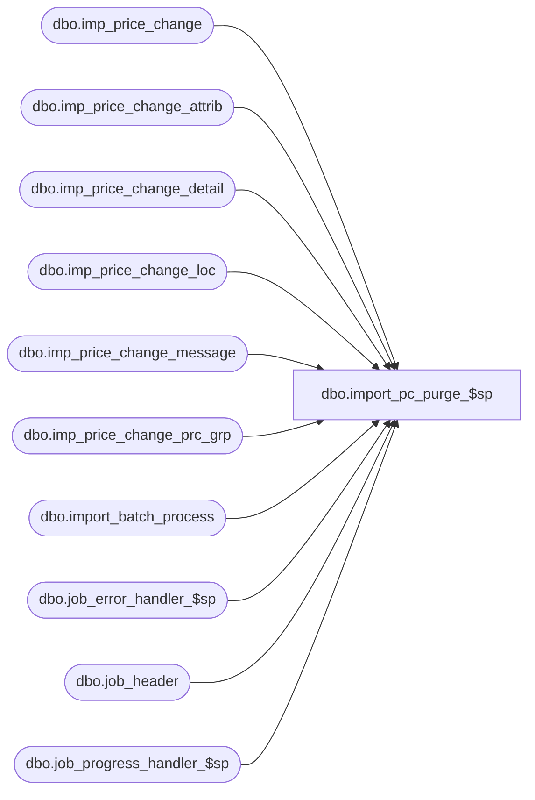

# dbo.import_pc_purge_$sp

**Database:** me_01  
**Server:** bedrockdb02  

## Architecture Diagram



## Table Dependencies

| Referenced Table |
|---|
| dbo.imp_price_change |
| dbo.imp_price_change_attrib |
| dbo.imp_price_change_detail |
| dbo.imp_price_change_loc |
| dbo.imp_price_change_message |
| dbo.imp_price_change_prc_grp |
| dbo.import_batch_process |
| dbo.job_error_handler_$sp |
| dbo.job_header |
| dbo.job_progress_handler_$sp |

## Stored Procedure Code

```sql
CREATE PROCEDURE [dbo].[import_pc_purge_$sp]

AS

/*
	Description	: This procedure is part of the Import Price Change process. 
				  It's called when no job part of the import_pc is currently running.  
				  It truncates the import tables if there is no incomplete job or 
				  delete the rows in those tables that have been posted successfully.
*/

BEGIN
	DECLARE @line_id SMALLINT, @job_type TINYINT, @job_id SMALLINT, @c_true BIT, @c_false BIT,  @job_count SMALLINT
			, @proc_name NVARCHAR(30), @table_name NVARCHAR(30)
			, @operation_name NVARCHAR(30), @sql_err_num DECIMAL(38,0), @error_msg NVARCHAR(4000)
			, @range_start DECIMAL(24,0), @current_job_id INT, @range_end DECIMAL(24,0),@crs_job_flag BIT

	SELECT   @line_id		= 10
			, @job_type		= 30
			, @job_id		= -1
			, @proc_name	= N'import_pc_purge_$sp'
			, @c_false		= 0
			, @c_true		= 1
			, @job_count	= 0
 
	BEGIN TRY		

		DECLARE crs_jobs CURSOR FOR
		SELECT h.job_id, h.range_start, h.range_end
		FROM import_batch_process p, job_header h
		WHERE p.job_type = 30
		AND p.job_id = h.job_id
		AND p.job_type = h.job_type
		AND h.completed_flag = 1;
		
		-- Log progress if job_params.debug_flag is true 
		EXEC job_progress_handler_$sp @job_type, @job_id, @proc_name, @line_id, @c_false;
		
		OPEN crs_jobs
		SET @crs_job_flag = 1

		FETCH NEXT FROM crs_jobs INTO @current_job_id, @range_start, @range_end

		WHILE @@FETCH_STATUS = 0
		BEGIN
			SET @line_id = 20;
			
			BEGIN TRAN
			
			DELETE imp_price_change WHERE imp_price_change_id BETWEEN @range_start AND @range_end;		
			DELETE imp_price_change_detail WHERE imp_price_change_id BETWEEN @range_start AND @range_end;
			DELETE imp_price_change_attrib WHERE imp_price_change_id BETWEEN @range_start AND @range_end;
			DELETE imp_price_change_loc WHERE imp_price_change_id BETWEEN @range_start AND @range_end;
			DELETE imp_price_change_message WHERE imp_price_change_id BETWEEN @range_start AND @range_end;
			DELETE imp_price_change_prc_grp WHERE imp_price_change_id BETWEEN @range_start AND @range_end;

			COMMIT TRAN
			
			FETCH NEXT FROM crs_jobs INTO @current_job_id, @range_start, @range_end;
		END
      
		CLOSE crs_jobs;
		DEALLOCATE crs_jobs;
		SET @crs_job_flag = 0;
		
		-- Log progress if job_params.debug_flag is true
		EXEC job_progress_handler_$sp @job_type, @job_id, @proc_name, @line_id, @c_false;

	END TRY

	BEGIN CATCH

		-- Test if the transaction is uncommittable.
		IF (XACT_STATE()) = -1
			ROLLBACK TRANSACTION

		-- Test if the transaction is active and valid.
		IF (XACT_STATE()) = 1
			COMMIT TRANSACTION

		IF (@crs_job_flag = 1)
		BEGIN
			CLOSE crs_jobs;
			DEALLOCATE crs_jobs;
		END

		IF @line_id = 10	
			SELECT  @table_name			= N'job_header'
					, @operation_name	= N'SELECT'
					, @error_msg		= ERROR_MESSAGE()
					, @sql_err_num		= ERROR_NUMBER()
		ELSE IF @line_id = 20
			SELECT  @table_name			= N'imp_price_change'
					, @operation_name	= N'DELETE'
					, @sql_err_num		= ERROR_NUMBER()
					, @error_msg		= ERROR_MESSAGE()

		EXEC job_error_handler_$sp 
			@job_type 
			, @job_id 
			, @proc_name 
			, @line_id 
			, @sql_err_num 
			, @table_name 
			, @operation_name 
			, @error_msg 
			, @c_true
	END CATCH
END
```

