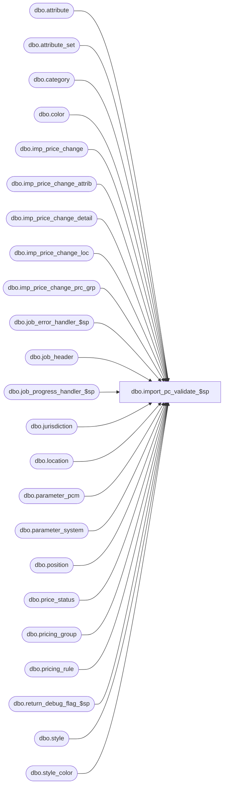

# dbo.import_pc_validate_$sp

**Database:** me_01  
**Server:** bedrockdb02  

## Architecture Diagram



## Table Dependencies

| Referenced Table |
|---|
| dbo.attribute |
| dbo.attribute_set |
| dbo.category |
| dbo.color |
| dbo.imp_price_change |
| dbo.imp_price_change_attrib |
| dbo.imp_price_change_detail |
| dbo.imp_price_change_loc |
| dbo.imp_price_change_prc_grp |
| dbo.job_error_handler_$sp |
| dbo.job_header |
| dbo.job_progress_handler_$sp |
| dbo.jurisdiction |
| dbo.location |
| dbo.parameter_pcm |
| dbo.parameter_system |
| dbo.position |
| dbo.price_status |
| dbo.pricing_group |
| dbo.pricing_rule |
| dbo.return_debug_flag_$sp |
| dbo.style |
| dbo.style_color |

## Stored Procedure Code

```sql
CREATE PROCEDURE [dbo].[import_pc_validate_$sp]
	(@job_id INT)

AS

/*
	Description	: This procedure validates the import_price_change and import_price_change_detail tables foreign keys and updates with default values

	10/31/2011	Ivan Dimitrov		130684 - import price change segment 34000 not getting pricing rule code from jurisdiction
	11/12/2012  Pierrette L.		133894 segment 34000 accepts price change import with missing mandatory detail exception records and other validations.
	11/20/2012  Pierrette L.	    139806 Seg. 34000 does not provide the style causing the price change not import, add details to the following the error message:
						"Invalid data found in imp_price_change_detail table. Either the Style, Color, Location, or Pricing Group code might be wrong."
	01/08/2013  Pierrette L.		defect #140941 Add validation for employee position code (line_id 45). (Jan 8th 2013)
	06/28/2013	Ivand D.    		Bug 45333 - Pipeline segment 34000 - error in manager log regarding 'NULL' value in column 'calculation_value'
	09/13/2013	Yan Ding			Bug 51407, undo previous change made for bug 45333 since it's causing bug 51407
	2/22/2014   Ivan D. 			Add support for importing price change attributes
	6/1/2016	Ivan D.				DMER-829 - pc import allows documents to be imported with effective from date in the past
*/

BEGIN
	DECLARE @line_id SMALLINT, @job_type TINYINT, @proc_name NVARCHAR(30), @sql_err_num DECIMAL(38,0), @range_start DECIMAL(24,0), @debug_flag BIT,
			@range_end DECIMAL(24,0), @table_name	NVARCHAR(30), @operation_name NVARCHAR(30), @error_msg NVARCHAR(2000), @job_debug_flag BIT,
			@c_true BIT, @c_false BIT, @msg NVARCHAR(500), @job_detail_count INT, @count INT, @mod136 BIT, @size_delimiter NVARCHAR(1), @validation_step TINYINT,
			@error_crs_flag BIT, @error_key NVARCHAR(100), @SQLString NVARCHAR(2000), @position_code NVARCHAR(20), @crs_position_flag BIT;

	SELECT @c_true	= 1,
		   @c_false = 0,
		   @line_id = 10,
		   @job_type = 30,
		   @crs_position_flag = 0,
		   @error_crs_flag = 0,
		   @validation_step = 0,
		   @proc_name = N'import_pc_validate_$sp'
	FROM parameter_system

	BEGIN TRY
		-- Get parameters associated to the current job
		SELECT @range_start = range_start, @range_end = range_end, @job_debug_flag = debug_flag
		FROM job_header
		WHERE job_id = @job_id
		AND job_type = @job_type

		IF @@ROWCOUNT = 0
		BEGIN
			SET @msg = N'Error: job is missing in the job_header table.'

			RAISERROR (@msg, -- Error: job #%i is missing in the job_header table. ( Message text)
               16, -- Severity.
               1, -- State.
               @job_id)
		END

		-- Log progress if job_params.debug_flag is true
		EXEC job_progress_handler_$sp @job_type, @job_id, @proc_name, @line_id, @job_debug_flag
--------
		SET @line_id = 10
		-- Check  effective from date >= current date

		select @count = count(*)
		from imp_price_change
		WHERE imp_price_change_id BETWEEN @range_start AND @range_end
		AND effective_from_date < cast(floor(cast(GETDATE() as float)) as datetime)

		IF @count > 0
		BEGIN
			--SELECT @msg = resource_description FROM job_message
			--WHERE job_type = @job_type AND resource_id = 2 AND language_id = @language_id
			SET @msg = N'The Effective From Date must be the same as or later than the current date.'
			RAISERROR (@msg, -- Message text.
			   16, -- Severity.
			   1, -- State.
			   @job_id)
		END

		-- Log progress if job_params.debug_flag is true
		EXEC job_progress_handler_$sp @job_type, @job_id, @proc_name, @line_id, @job_debug_flag

--------
		SET @line_id = 15
		-- Check  effective to date >= effective from date

		select @count = count(*)
		from imp_price_change
		WHERE imp_price_change_id BETWEEN @range_start AND @range_end
		AND effective_to_date < effective_from_date

		IF @count > 0
		BEGIN
			--SELECT @msg = resource_description FROM job_message
			--WHERE job_type = @job_type AND resource_id = 2 AND language_id = @language_id
			SET @msg = N'The Effective to date must be the same as or later than the Effective from date.'
			RAISERROR (@msg, -- Message text.
			   16, -- Severity.
			   1, -- State.
			   @job_id)
		END

		-- Log progress if job_params.debug_flag is true
		EXEC job_progress_handler_$sp @job_type, @job_id, @proc_name, @line_id, @job_debug_flag
-----------
		SET @line_id = 20
		-- if issue date is not provided get from parameter and update based on effective date

		IF ( SELECT count(*) FROM imp_price_change WHERE imp_price_change_id BETWEEN @range_start AND @range_end
			 AND issue_date IS NULL ) > 0
		BEGIN

			UPDATE imp_price_change
			SET issue_date = effective_from_date - (SELECT assign_def_to_be_issued_date FROM parameter_pcm)
			WHERE imp_price_change_id BETWEEN @range_start AND @range_end
			AND issue_date IS NULL
		END

		-- Log progress if job_params.debug_flag is true
		EXEC job_progress_handler_$sp @job_type, @job_id, @proc_name, @line_id, @job_debug_flag

-----------
		SET @line_id = 30
		-- If JurCode is null asign to HOME jurisdiction

		IF ( SELECT count(*) FROM imp_price_change WHERE imp_price_change_id BETWEEN @range_start AND @range_end AND jurisdiction_code IS NULL ) > 0
		BEGIN

			UPDATE imp_price_change
			SET jurisdiction_code = (select jurisdiction_code from jurisdiction WHERE home_jurisdiction_flag = 1)
			WHERE imp_price_change_id BETWEEN @range_start AND @range_end
			AND jurisdiction_code IS NULL
		END

		-- Log progress if job_params.debug_flag is true
		EXEC job_progress_handler_$sp @job_type, @job_id, @proc_name, @line_id, @job_debug_flag

-------
		SET @line_id = 35
		-- Check for valid jurisdiction code

		select @count = count(*)
		from imp_price_change
		WHERE imp_price_change_id BETWEEN @range_start AND @range_end
		AND jurisdiction_code not in (select jurisdiction_code from jurisdiction)

		IF @count > 0
		BEGIN
			--SELECT @msg = resource_description FROM job_message
			--WHERE job_type = @job_type AND resource_id = 2 AND language_id = @language_id
			SET @msg = N'Invalid jurisdiction_code found in imp_price_change table.'
			RAISERROR (@msg, -- Message text.
			   16, -- Severity.
			   1, -- State.
			   @job_id)
		END

		-- Log progress if job_params.debug_flag is true
		EXEC job_progress_handler_$sp @job_type, @job_id, @proc_name, @line_id, @job_debug_flag

-------
		SET @line_id = 40
		-- Check for valid category code

		select @count = count(*)
		from imp_price_change
		WHERE imp_price_change_id BETWEEN @range_start AND @range_end
		AND category_code not in (select category_code from category)

		IF @count > 0
		BEGIN
			--SELECT @msg = resource_description FROM job_message
			--WHERE job_type = @job_type AND resource_id = 2 AND language_id = @language_id
			SET @msg = N'Invalid category_code found in imp_price_change table.'
			RAISERROR (@msg, -- Message text.
			   16, -- Severity.
			   1, -- State.
			   @job_id)
		END

		-- Log progress if job_params.debug_flag is true
		EXEC job_progress_handler_$sp @job_type, @job_id, @proc_name, @line_id, @job_debug_flag

-----------
		SET @line_id = 45;
		-- Defect #140941 employee position code field needs to get validated

		SELECT @count = COUNT(*)
		FROM imp_price_change i
		LEFT OUTER JOIN position p ON (i.position_code = p.position_code)
		WHERE i.imp_price_change_id BETWEEN @range_start AND @range_end
		AND p.position_code IS NULL;

		IF @count > 0
		BEGIN
			SET @msg = N'Invalid employee position_code found in imp_price_change table, the invalid position_code is/are: ';

			DECLARE crs_position CURSOR FOR
			SELECT DISTINCT i.position_code
			FROM imp_price_change i
			LEFT OUTER JOIN position p ON (i.position_code = p.position_code)
			WHERE imp_price_change_id BETWEEN @range_start AND @range_end
			AND p.position_code IS NULL;

			OPEN crs_position;
			SET @crs_position_flag = 1;

			FETCH NEXT FROM crs_position INTO @position_code;
			WHILE @@FETCH_STATUS = 0
			BEGIN
				SELECT @msg = @msg + @position_code + N', ';
				FETCH NEXT FROM crs_position INTO @position_code;
			END;

			CLOSE crs_position;
			DEALLOCATE crs_position;
			SET @crs_position_flag = 0;

			-- remove the last comma
			SET @msg = SUBSTRING(@msg, 1, len(@msg) - 1) + N'.';

			RAISERROR (@msg, -- Message text.
			   16, -- Severity.
			   1, -- State.
			   @job_id);
		END

---------

		SET @line_id = 50
		-- If CalcValue is null Then CalcValue = 0

		IF ( SELECT count(*) FROM imp_price_change WHERE imp_price_change_id BETWEEN @range_start AND @range_end AND calculation_value IS NULL ) > 0
		BEGIN

			UPDATE imp_price_change
			SET calculation_value = 0
			WHERE imp_price_change_id BETWEEN @range_start AND @range_end
			AND calculation_value IS NULL
		END

		-- Log progress if job_params.debug_flag is true
		EXEC job_progress_handler_$sp @job_type, @job_id, @proc_name, @line_id, @job_debug_flag


-----------
		SET @line_id = 60
		-- If PricingRuleCode is null get the pricing rule for the jurisdictions

		IF ( SELECT count(*) FROM imp_price_change WHERE imp_price_change_id BETWEEN @range_start AND @range_end AND pricing_rule_code IS NULL ) > 0
		BEGIN

			UPDATE imp_price_change
			SET pricing_rule_code = pr.pricing_rule_code
			FROM imp_price_change i, jurisdiction j, pricing_rule pr
			WHERE i.jurisdiction_code = j.jurisdiction_code
			AND j.pricing_rule_id = pr.pricing_rule_id
			AND imp_price_change_id BETWEEN @range_start AND @range_end
			AND i.pricing_rule_code IS NULL


		END

		-- Log progress if job_params.debug_flag is true
		EXEC job_progress_handler_$sp @job_type, @job_id, @proc_name, @line_id, @job_debug_flag


-------
		SET @line_id = 70
		-- Check for valid prcing_rule code

		select @count = count(*)
		from imp_price_change
		WHERE imp_price_change_id BETWEEN @range_start AND @range_end
		AND (pricing_rule_code NOT IN (select pricing_rule_code from pricing_rule)
			OR pricing_rule_code IS NULL)

		IF @count > 0
		BEGIN
			--SELECT @msg = resource_description FROM job_message
			--WHERE job_type = @job_type AND resource_id = 3 AND language_id = @language_id
			SET @msg =N'Invalid pricing_rule_code found in imp_price_change table.'
			RAISERROR (@msg, -- Message text.
			   16, -- Severity.
			   1, -- State.
			   @job_id)
		END

		-- Log progress if job_params.debug_flag is true
		EXEC job_progress_handler_$sp @job_type, @job_id, @proc_name, @line_id, @job_debug_flag


-----------
		SET @line_id = 80
		--  If PrintByLoc is null AND PROMO -> check gbolPrintPromoPCDocFlag
		--						  AND Permanent -> set to Y

		IF ( SELECT count(*) FROM imp_price_change WHERE imp_price_change_id BETWEEN @range_start AND @range_end
													AND print_by_location IS NULL ) > 0
		BEGIN

			UPDATE imp_price_change
			SET print_by_location = N'Y'
			WHERE imp_price_change_id BETWEEN @range_start AND @range_end
			AND print_by_location IS NULL
			AND price_change_duration = 0

			UPDATE imp_price_change
			SET print_by_location = (select print_promo_pc_doc_flag from parameter_pcm )
			WHERE imp_price_change_id BETWEEN @range_start AND @range_end
			AND print_by_location IS NULL
			AND price_change_duration = 1

		END

		-- update Y, N to 1,0

		UPDATE imp_price_change
		SET print_by_location = 1
		WHERE imp_price_change_id BETWEEN @range_start AND @range_end
		AND print_by_location = N'Y'

		UPDATE imp_price_change
		SET print_by_location = 0
		WHERE imp_price_change_id BETWEEN @range_start AND @range_end
		AND print_by_location = N'N'

		-- Log progress if job_params.debug_flag is true
		EXEC return_debug_flag_$sp @job_type, @debug_flag OUT
		IF (@debug_flag = @c_true OR @job_debug_flag = @c_true)
			EXEC job_progress_handler_$sp @job_type, @job_id, @proc_name, @line_id


-----------
		SET @line_id = 85
--		7. If Duration = Permanent -> PromoEvent = 0
--				Else If  PROMO ->  If Category is MU -> PromoEvent = 0
--											   is MUC -> PromoEvent = 1


		IF ( SELECT count(*) FROM imp_price_change WHERE imp_price_change_id BETWEEN @range_start AND @range_end AND promotional_event IS NULL ) > 0
		BEGIN

			UPDATE imp_price_change
			SET promotional_event = 0
			WHERE imp_price_change_id BETWEEN @range_start AND @range_end
			AND promotional_event IS NULL
			AND price_change_duration = 0

			UPDATE imp_price_change
			SET promotional_event = 0
			FROM imp_price_change i, category c
			WHERE i.category_code = c.category_code
			AND imp_price_change_id BETWEEN @range_start AND @range_end
			AND promotional_event IS NULL
			AND price_change_duration = 1
			AND price_change_type in (1,2) -- MDC, MU

			UPDATE imp_price_change
			SET promotional_event = 1
			FROM imp_price_change i, category c
			WHERE i.category_code = c.category_code
			AND imp_price_change_id BETWEEN @range_start AND @range_end
			AND promotional_event IS NULL
			AND price_change_duration = 1
			AND price_change_type in (0,3) -- MD, MUC
		END

		-- change Y,N to 1,0
		UPDATE imp_price_change
		SET promotional_event = 1
		WHERE promotional_event = N'Y'

		UPDATE imp_price_change
		SET promotional_event = 0
		WHERE promotional_event = N'N'


		-- Log progress if job_params.debug_flag is true
		EXEC job_progress_handler_$sp @job_type, @job_id, @proc_name, @line_id, @job_debug_flag

-------
		SET @line_id = 90
		-- Pricing group(s) may not be provided if the location grouping of the price change is not 'pricing group list'

		select @count = count(*)
		from imp_price_change i
		WHERE imp_price_change_id BETWEEN @range_start AND @range_end
		AND location_grouping <> 2 -- not pricing groups
		AND EXISTS (select 1 from imp_price_change_prc_grp ipg where i.imp_price_change_id = ipg.imp_price_change_id)

		IF @count > 0
		BEGIN
			--SELECT @msg = resource_description FROM job_message
			--WHERE job_type = @job_type AND resource_id = 4 AND language_id = @language_id
			SET @msg =N'Invalid location_grouping found in imp_price_change_prc_grp table.'
			RAISERROR (@msg, -- Message text.
			   16, -- Severity.
			   1, -- State.
			   @job_id)
		END

		-- Log progress if job_params.debug_flag is true
		EXEC job_progress_handler_$sp @job_type, @job_id, @proc_name, @line_id, @job_debug_flag


	-- Set detail fields to null where = N'' or N' '
		SET @line_id = 95

		UPDATE imp_price_change_detail
		SET color_code = null
		WHERE imp_price_change_id BETWEEN @range_start AND @range_end
		AND (color_code = N'' OR color_code = N' ')

		UPDATE imp_price_change_detail
		SET location_code = null
		WHERE imp_price_change_id BETWEEN @range_start AND @range_end
		AND (location_code = N'' OR location_code = N' ')

		UPDATE imp_price_change_detail
		SET pricing_group_code = null
		WHERE imp_price_change_id BETWEEN @range_start AND @range_end
		AND (pricing_group_code = N'' OR pricing_group_code = N' ')


	-- set detail fields where if not specified, they take the value form the header
		-- Calculation Method
		UPDATE imp_price_change_detail
		SET calculation_method = h.calculation_method
		FROM imp_price_change h, imp_price_change_detail d
		WHERE h.imp_price_change_id = d.imp_price_change_id
		AND h.imp_price_change_id BETWEEN @range_start AND @range_end
		AND (d.calculation_method IS NULL)

		-- Base Calculation On
		UPDATE imp_price_change_detail
		SET base_calculation_on = h.base_calculation_on
		FROM imp_price_change h, imp_price_change_detail d
		WHERE h.imp_price_change_id = d.imp_price_change_id
		AND h.imp_price_change_id BETWEEN @range_start AND @range_end
		AND ((d.base_calculation_on IS NULL) AND (d.calculation_method <> 2)) -- not aplicable for NEW PRICE method

		-- Calculation Value
		UPDATE imp_price_change_detail
		SET calculation_value = h.calculation_value
		FROM imp_price_change h, imp_price_change_detail d
		WHERE h.imp_price_change_id = d.imp_price_change_id
		AND h.imp_price_change_id BETWEEN @range_start AND @range_end
		AND ((d.calculation_value IS NULL) AND (d.calculation_method <> 2)) -- not aplicable for NEW PRICE method

		-- Result Price Status
		UPDATE imp_price_change_detail
		SET result_price_status = p.price_status_code
		FROM imp_price_change_detail d
			inner join imp_price_change h on d.imp_price_change_id=h.imp_price_change_id
			inner join category c on h.category_code = c.category_code
			inner join price_status p on c.price_status_id=p.price_status_id
		WHERE h.imp_price_change_id BETWEEN @range_start AND @range_end
		AND ((d.result_price_status IS NULL) AND (c.override_price_status_flag=1))


		-- this combination of RTP parameters implies that RTP is turned ON and cannot be overridden:
		--  RTP GEN ON PRICE CHANGE APPROVED = true and ALLOW OVERRIDE=false
		IF ((SELECT COUNT(*) FROM parameter_system WHERE parameter_system_id=1 AND
			rtp_gen_upon_pc_appr_flag = 1 AND rtp_allow_override_flag = 0) = 1)
		BEGIN
			-- Tickets required
			UPDATE imp_price_change
			SET generate_tickets = 0 --tickets required
			FROM imp_price_change h
			WHERE h.imp_price_change_id BETWEEN @range_start AND @range_end
			AND generate_tickets <> 0
		END

		-- this combination of RTP parameters implies that RTP is turned OFF and cannot be overridden:
		--  RTP GEN ON PRICE CHANGE APPROVED = false and ALLOW OVERRIDE=false
		IF ((SELECT COUNT(*) FROM parameter_system WHERE parameter_system_id=1 AND
			rtp_gen_upon_pc_appr_flag = 0 AND rtp_allow_override_flag = 0) = 1)
		BEGIN
			-- Tickets required
			UPDATE imp_price_change
			SET generate_tickets = 2 --tickets NOT required
			FROM imp_price_change h
			WHERE h.imp_price_change_id BETWEEN @range_start AND @range_end
			AND generate_tickets <> 2
		END
		-- Log progress if job_params.debug_flag is true
		EXEC job_progress_handler_$sp @job_type, @job_id, @proc_name, @line_id, @job_debug_flag

-------
		SET @line_id = 100
		-- Check style_code, style_color, locations, pricing groups are valid.

		-- Defect #139806 starts
		/*
		select @count = count(*)
		from imp_price_change_detail id
		WHERE imp_price_change_id BETWEEN @range_start AND @range_end
		AND (NOT EXISTS (select 1 from style s where s.style_code = id.style_code)
			OR (color_code is not null AND NOT EXISTS
				(select 1 from style_color sc inner join color c on sc.color_id=c.color_id inner join
				 style s on sc.style_id = s.style_id where c.color_code = id.color_code and s.style_code=id.style_code))
			OR (location_code is not null AND NOT EXISTS (select 1 from location l where l.location_code = id.location_code))
			OR (pricing_group_code is not null AND NOT EXISTS (select 1 from pricing_group pg where pg.pricing_group_code = id.pricing_group_code))
			)
		*/
		SELECT @validation_step = 1
		FROM imp_price_change_detail id
		WHERE imp_price_change_id BETWEEN @range_start AND @range_end
		AND NOT EXISTS (select 1 from style s where s.style_code = id.style_code);

		IF (@@ROWCOUNT > 0)
			SET @msg = N'Invalid data found in imp_price_change_detail table, the following styles don''t exists in the merchandising style master table: ';

		IF (@validation_step = 0)
		BEGIN
			SELECT @validation_step = 2
			FROM imp_price_change_detail id
			WHERE imp_price_change_id BETWEEN @range_start AND @range_end
			AND color_code is not null
			AND NOT EXISTS (select 1 from style s, style_color sc, color c
							WHERE s.style_code = id.style_code AND s.style_id = sc.style_id AND sc.color_id = c.color_id and c.color_code = id.color_code);

			IF (@@ROWCOUNT > 0)
				SET @msg = N'Invalid data found in imp_price_change_detail table, the following style/color don''t exists in the merchandising style color master table: ';
		END

		IF (@validation_step = 0)
		BEGIN
			SELECT @validation_step = 3
			FROM imp_price_change_detail id
			WHERE imp_price_change_id BETWEEN @range_start AND @range_end
			AND location_code is not null
			AND NOT EXISTS (select 1 from location l where l.location_code = id.location_code);

			IF (@@ROWCOUNT > 0)
				SET @msg = N'Invalid data found in imp_price_change_detail table, the following locations don''t exists in the merchandising location master table: ';
		END

		IF (@validation_step = 0)
		BEGIN
			SELECT @validation_step = 4
			FROM imp_price_change_detail id
			WHERE imp_price_change_id BETWEEN @range_start AND @range_end
			AND pricing_group_code is not null
			AND NOT EXISTS (select 1 from pricing_group pg where pg.pricing_group_code = id.pricing_group_code);

			IF (@@ROWCOUNT > 0)
				SET @msg = N'Invalid data found in imp_price_change_detail table, the following pricing_groups don''t exists in the merchandising pricing group master table: ';
		END

		IF (@validation_step <> 0)
		BEGIN
			SET @SQLString =
				CASE @validation_step
					 WHEN 1 THEN N'DECLARE error_key_crs CURSOR FOR SELECT DISTINCT (h.price_change_description + N'' - '' + d.style_code) style_error
								FROM imp_price_change h, imp_price_change_detail d
								WHERE h.imp_price_change_id BETWEEN ' + CAST(@range_start AS NVARCHAR(24)) + N' AND ' + CAST(@range_end AS NVARCHAR(24)) + N' AND h.imp_price_change_id = d.imp_price_change_id
								AND NOT EXISTS (select 1 from style s where s.style_code = d.style_code) ORDER BY style_error;'
					WHEN 2 THEN N'DECLARE error_key_crs CURSOR FOR SELECT DISTINCT (h.price_change_description + N'' - '' + d.style_code + N''/'' + d.color_code) style_color_error
								FROM imp_price_change h, imp_price_change_detail d
								WHERE h.imp_price_change_id BETWEEN ' + CAST(@range_start AS NVARCHAR(24)) + N' AND ' + CAST(@range_end AS NVARCHAR(24)) + N' AND h.imp_price_change_id = d.imp_price_change_id AND d.color_code is not null
								AND NOT EXISTS (select 1 from style s, style_color sc, color c WHERE s.style_code = d.style_code AND s.style_id = sc.style_id AND sc.color_id = c.color_id and c.color_code = d.color_code)
								ORDER BY style_color_error;'
					WHEN 3 THEN N'DECLARE error_key_crs CURSOR FOR SELECT DISTINCT (h.price_change_description + N'' - '' + d.location_code) location_error
								FROM imp_price_change h, imp_price_change_detail d
								WHERE h.imp_price_change_id BETWEEN ' + CAST(@range_start AS NVARCHAR(24)) + N' AND ' + CAST(@range_end AS NVARCHAR(24)) + N' AND h.imp_price_change_id = d.imp_price_change_id AND d.location_code is not null
								AND NOT EXISTS (select 1 from location l where l.location_code = d.location_code) ORDER BY location_error;'
					WHEN 4 THEN N'DECLARE error_key_crs CURSOR FOR SELECT DISTINCT (h.price_change_description + N'' - '' + d.pricing_group_code) pricing_group_error
								FROM imp_price_change h, imp_price_change_detail d
								WHERE h.imp_price_change_id BETWEEN ' + CAST(@range_start AS NVARCHAR(24)) + N' AND ' + CAST(@range_end AS NVARCHAR(24)) + N' AND h.imp_price_change_id = d.imp_price_change_id
								AND d.pricing_group_code is not null AND NOT EXISTS (select 1 from pricing_group pg where pg.pricing_group_code = d.pricing_group_code) ORDER BY pricing_group_error;'
				END;

			EXECUTE sp_executesql @SQLString

			OPEN error_key_crs;
			SET @error_crs_flag = 1;

			FETCH NEXT FROM error_key_crs INTO @error_key;
			WHILE @@FETCH_STATUS = 0
			BEGIN
				SELECT @msg = @msg + @error_key + N', ';
				FETCH NEXT FROM error_key_crs INTO @error_key;
			END;

			CLOSE error_key_crs;
			DEALLOCATE error_key_crs;
			SET @error_crs_flag = 0;

			-- remove the last comma
			SET @msg = SUBSTRING(@msg, 1, len(@msg) - 1);

			RAISERROR (@msg, -- Message text.
			   16, -- Severity.
			   1, -- State.
			   @job_id);
		END
		-- Defect #139806 ends


		-- Log progress if job_params.debug_flag is true
		EXEC job_progress_handler_$sp @job_type, @job_id, @proc_name, @line_id, @job_debug_flag


-------
		SET @line_id = 110
		-- New price must be >= 0

		select @count = count(*)
		from imp_price_change_detail id
		WHERE imp_price_change_id BETWEEN @range_start AND @range_end
		AND new_price < 0


		IF @count > 0
		BEGIN
			--SELECT @msg = resource_description FROM job_message
			--WHERE job_type = @job_type AND resource_id = 6 AND language_id = @language_id
			SET @msg =N'Invalid new_price value found in imp_price_change_detail table. Cannot be less than zero.'

			RAISERROR (@msg, -- Message text.
			   16, -- Severity.
			   1, -- State.
			   @job_id)
		END

		-- Log progress if job_params.debug_flag is true
		EXEC job_progress_handler_$sp @job_type, @job_id, @proc_name, @line_id, @job_debug_flag


-------
		SET @line_id = 120
		-- 12. Switch Method
		--		Case CPercentChange:
		--			 CAmountChange:
		--				Base value is mandatory.
		--				Calculation value is mandatory.
		--				Calculation value must be greater than or equal to 0
		--				If % Change -> Calculation value must be less than or equal to 99.99
		--				Calculation value must be less than or equal to 999.99
		--				"Base calculation on" is mandatory
		--	CPercentChange = 0,
		--	CAmountChange = 1,
		--	CNewPrice = 2


		select @count = count(*)
		from imp_price_change_detail id
		WHERE imp_price_change_id BETWEEN @range_start AND @range_end
		AND calculation_method in (0,1)
		AND (calculation_value IS NULL
			OR calculation_value < 0
			OR (calculation_method = 0 AND calculation_value > 100) -- % change cannot be more than 100%
			OR calculation_value > 999.99
			OR base_calculation_on IS NULL
			)

		IF @count > 0
		BEGIN
			--SELECT @msg = resource_description FROM job_message
			--WHERE job_type = @job_type AND resource_id = 7 AND language_id = @language_id
			SET @msg =N'Invalid calculation_method or calculation_value or base_calculation_on found in imp_price_change_detail table.'

			RAISERROR (@msg, -- Message text.
			   16, -- Severity.
			   1, -- State.
			   @job_id)
		END

		-- Log progress if job_params.debug_flag is true
		EXEC job_progress_handler_$sp @job_type, @job_id, @proc_name, @line_id, @job_debug_flag


-------
		SET @line_id = 130
		-- If multi jurisdiction flag is true then base on value cannot be set to last net po cost (STSPCMGlobals::CLastPOCost)
		-- CLastPOCost = 3
		select @count = count(*)
		from imp_price_change_detail id
		WHERE imp_price_change_id BETWEEN @range_start AND @range_end
		AND base_calculation_on = 3
		AND 1 = (select multi_sales_jurisdiction_flag from parameter_system)

		IF @count > 0
		BEGIN
			--SELECT @msg = resource_description FROM job_message
			--WHERE job_type = @job_type AND resource_id = 8 AND language_id = @language_id
			SET @msg =N'Invalid base_calculation_on found in imp_price_change_detail table for current multi_sales_jurisdiction_flag setting.'

			RAISERROR (@msg, -- Message text.
			   16, -- Severity.
			   1, -- State.
			   @job_id)
		END

		-- Log progress if job_params.debug_flag is true
		EXEC job_progress_handler_$sp @job_type, @job_id, @proc_name, @line_id, @job_debug_flag

-------
		SET @line_id = 140
		-- A PC Cannot be saved if there is not at least one style detail attached

		select @count = count(*)
		from imp_price_change i
		WHERE imp_price_change_id BETWEEN @range_start AND @range_end
		AND NOT EXISTS (select 1 from imp_price_change_detail id where i.imp_price_change_id = id.imp_price_change_id)

		IF @count > 0
		BEGIN
--			SELECT @msg = resource_description FROM job_message
--			WHERE job_type = @job_type AND resource_id = 3 AND language_id = @language_id
			SET @msg = N'Header must be followed by at least one Style Detail.'

			RAISERROR (@msg, -- Message text.
			   16, -- Severity.
			   1, -- State.
			   @job_id)
		END

		-- Log progress if job_params.debug_flag is true
		EXEC job_progress_handler_$sp @job_type, @job_id, @proc_name, @line_id, @job_debug_flag


-------
		SET @line_id = 150
		-- A PC Cannot be created for NEW styles

		SELECT @count = count(*)
		FROM imp_price_change_detail i INNER JOIN style s ON i.style_code=s.style_code
		WHERE imp_price_change_id BETWEEN @range_start AND @range_end
		AND s.style_status=1


		IF @count > 0
		BEGIN
			SET @msg = N'Invalid style used in the imp_price_change_detail table. Style with status of "New" found.'

			RAISERROR (@msg, -- Message text.
			   16, -- Severity.
			   1, -- State.
			   @job_id)
		END

		-- Log progress if job_params.debug_flag is true
		EXEC job_progress_handler_$sp @job_type, @job_id, @proc_name, @line_id, @job_debug_flag


-------
		SET @line_id = 160
		-- Resulting Price Status can only be specified if Allow Price Status Override' flag is on
		-- for the price category code of the header

		-- Result Price Status

		SELECT @count = count(*)
		FROM imp_price_change_detail d
			inner join imp_price_change h on d.imp_price_change_id=h.imp_price_change_id
			inner join category c on h.category_code = c.category_code
			inner join price_status p on c.price_status_id=p.price_status_id
		WHERE h.imp_price_change_id BETWEEN @range_start AND @range_end
		AND ((d.result_price_status IS NOT NULL) AND (c.override_price_status_flag=0))


		IF @count > 0
		BEGIN
			SET @msg = N'Invalid data in the imp_price_change_detail table. Resulting Price Status can only be specified if "Allow Price Status Override" flag is on for the price category code of the header.'

			RAISERROR (@msg, -- Message text.
			   16, -- Severity.
			   1, -- State.
			   @job_id)
		END

		-- Log progress if job_params.debug_flag is true
		EXEC job_progress_handler_$sp @job_type, @job_id, @proc_name, @line_id, @job_debug_flag

		-------
		SET @line_id = 170;

		-- Defect #139558
		SELECT @count = COUNT(*)
		FROM imp_price_change i
		LEFT OUTER JOIN imp_price_change_loc l ON (i.imp_price_change_id = l.imp_price_change_id)
		WHERE i.imp_price_change_id BETWEEN @range_start AND @range_end
		AND i.location_grouping = 1
		AND l.imp_price_change_id IS NULL;

		IF @count > 0
		BEGIN
			SET @msg = N'Business rule violation: Location list is mandatory when location grouping in the header record is set to 1 (Location List).'

			RAISERROR (@msg, -- Message text.
			   16, -- Severity.
			   1, -- State.
			   @job_id)
		END

		SELECT i.imp_price_change_id, location_code, COUNT(*)
		FROM imp_price_change i
		JOIN imp_price_change_loc l ON (i.imp_price_change_id = l.imp_price_change_id)
		WHERE i.imp_price_change_id BETWEEN @range_start AND @range_end
		AND i.location_grouping = 1
		GROUP BY i.imp_price_change_id, l.location_code
		HAVING COUNT(*) > 1;

		IF @@ROWCOUNT > 0
		BEGIN
			SET @msg = N'Business rule violation: Location Code should be unique in the location list associated to a price change document imported.'

			RAISERROR (@msg, -- Message text.
			   16, -- Severity.
			   1, -- State.
			   @job_id)
		END

		-- Log progress if job_params.debug_flag is true
		EXEC job_progress_handler_$sp @job_type, @job_id, @proc_name, @line_id, @job_debug_flag

		SET @line_id = 180;
		-- If location grouping is set to pricing group list then there should rows in imp_price_change_prc_grp and each row should point to a different pricing group

		SELECT @count = COUNT(*)
		FROM imp_price_change i
		LEFT OUTER JOIN imp_price_change_prc_grp g ON (i.imp_price_change_id = g.imp_price_change_id)
		WHERE i.imp_price_change_id BETWEEN @range_start AND @range_end
		AND i.location_grouping = 2
		AND g.imp_price_change_id IS NULL;


		IF @count > 0
		BEGIN
			SET @msg = N'Business rule violation: Pricing Group list is mandatory when location grouping in the header record is set to 2 (Pricing Group List).'

			RAISERROR (@msg, -- Message text.
			   16, -- Severity.
			   1, -- State.
			   @job_id)
		END

		SELECT i.imp_price_change_id, g.pricing_group_code, COUNT(*)
		FROM imp_price_change i
		JOIN imp_price_change_prc_grp g ON (i.imp_price_change_id = g.imp_price_change_id)
		WHERE i.imp_price_change_id BETWEEN @range_start AND @range_end
		AND i.location_grouping = 2
		GROUP BY i.imp_price_change_id, g.pricing_group_code
		HAVING COUNT(*) > 1;

		IF @@ROWCOUNT > 0
		BEGIN
			SET @msg = N'Business rule violation: Price Group Code should be unique in the Pricing group list associated to a price change document imported.'

			RAISERROR (@msg, -- Message text.
			   16, -- Severity.
			   1, -- State.
			   @job_id)
		END

		SET @line_id = 190;

		SELECT @count = COUNT(*)
		FROM imp_price_change i
		JOIN imp_price_change_loc l ON (i.imp_price_change_id = l.imp_price_change_id)
		LEFT OUTER JOIN imp_price_change_detail d ON (l.imp_price_change_id = d.imp_price_change_id AND l.location_code = d.location_code)
		WHERE i.imp_price_change_id BETWEEN @range_start AND @range_end
		AND i.location_grouping = 1
		AND d.imp_price_change_detail_id IS NULL;

		IF @count > 0
		BEGIN
			SET @msg = N'Business rule violation: Each location part of a price change with location list must have a detail line associated in the import file.'

			RAISERROR (@msg, -- Message text.
			   16, -- Severity.
			   1, -- State.
			   @job_id)
		END

		SET @line_id = 200;

		SELECT @count = COUNT(*)
		FROM imp_price_change i
		JOIN imp_price_change_prc_grp g ON (i.imp_price_change_id = g.imp_price_change_id)
		LEFT OUTER JOIN imp_price_change_detail d ON (g.imp_price_change_id = d.imp_price_change_id AND g.pricing_group_code = d.pricing_group_code)
		WHERE i.imp_price_change_id BETWEEN @range_start AND @range_end
		AND i.location_grouping = 2
		AND d.imp_price_change_detail_id IS NULL;

		IF @count > 0
		BEGIN
			SET @msg = N'Business rule violation: Each pricing group code part of a price change with pricing group list must have a detail line associated in the import file.'

			RAISERROR (@msg, -- Message text.
			   16, -- Severity.
			   1, -- State.
			   @job_id)
		END
		-- Defect #139558 ends

		-- Log progress if job_params.debug_flag is true
		EXEC job_progress_handler_$sp @job_type, @job_id, @proc_name, @line_id, @job_debug_flag


		SET @line_id = 220;

		--Validate attributes
		SELECT @count = COUNT(*)
		FROM imp_price_change_attrib ia
		WHERE imp_price_change_id BETWEEN @range_start AND @range_end
		AND NOT EXISTS (select 1 from attribute a, attribute_set ast
							where a.attribute_id = ast.attribute_id
							and a.attribute_code = ia.attribute_code
							and ast.attribute_set_code = ia.attribute_set_code
							and a.parent_type = 200);

		IF @count > 0
		BEGIN
			SET @msg = N'Business rule violation: Invalid attribute_code / attribute_set_code combination.'

			RAISERROR (@msg, -- Message text.
			   16, -- Severity.
			   1, -- State.
			   @job_id)
		END

		-- Log progress if job_params.debug_flag is true
		EXEC job_progress_handler_$sp @job_type, @job_id, @proc_name, @line_id, @job_debug_flag

	END TRY

	BEGIN CATCH
		SELECT @error_msg		= ERROR_MESSAGE()
			 , @sql_err_num		= ERROR_NUMBER()

		IF (@crs_position_flag = 1)
		BEGIN
			CLOSE crs_position;
			DEALLOCATE crs_position;
		END

		IF (@error_crs_flag = 1)
		BEGIN
			CLOSE error_key_crs;
			DEALLOCATE error_key_crs;
		END

		IF @line_id = 10
			SELECT  @table_name			= N'job_header'
					, @operation_name	= N'SELECT'
		ELSE IF @line_id between 20 AND 99
			SELECT  @table_name			= N'imp_price_change'
					, @operation_name	= N'UPDATE'
		ELSE IF @line_id BETWEEN 100 AND 160
			SELECT  @table_name			= N'imp_price_change_detail'
					, @operation_name	= N'SELECT'
		ELSE IF @line_id = 170
			SELECT  @table_name			= N'imp_price_change_loc'
					, @operation_name	= N'SELECT'
		ELSE IF @line_id = 180
			SELECT  @table_name			= N'imp_price_change_prc_grp'
					, @operation_name	= N'SELECT'
		ELSE IF @line_id >= 190
			SELECT  @table_name			= N'imp_price_change_detail'
					, @operation_name	= N'SELECT';

		EXEC job_error_handler_$sp
					@job_type
					, @job_id
					, @proc_name
					, @line_id
					, @sql_err_num
					, @table_name
					, @operation_name
					, @error_msg
					, @c_true

	END CATCH
END
```

