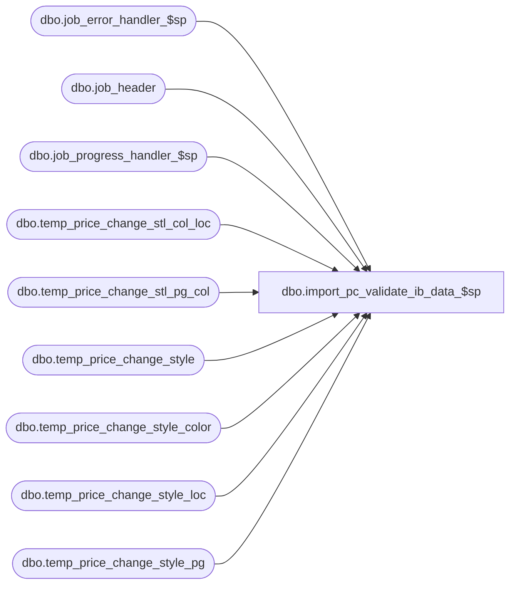

# dbo.import_pc_validate_ib_data_$sp

**Database:** me_01  
**Server:** bedrockdb02  

## Architecture Diagram



## Table Dependencies

| Referenced Table |
|---|
| dbo.job_error_handler_$sp |
| dbo.job_header |
| dbo.job_progress_handler_$sp |
| dbo.temp_price_change_stl_col_loc |
| dbo.temp_price_change_stl_pg_col |
| dbo.temp_price_change_style |
| dbo.temp_price_change_style_color |
| dbo.temp_price_change_style_loc |
| dbo.temp_price_change_style_pg |

## Stored Procedure Code

```sql
CREATE PROCEDURE [dbo].[import_pc_validate_ib_data_$sp]
	(@job_id INT)

AS

/*
	Version		: 1.00
	Created		: Mar. 7, 2012
	Created by	: Qing Yang
	Description	: This procedure valdate the values retrieved from ib. 
				  It's called by import_pc_batch_$sp.

HISTORY:
Date       		Name         		Def#			Desc
Mar07,2012		Qing Yang		132432			Initial release
Nov 15, 2012	Pierrette L.	1-49UASP Seg. 34000 does not provide the style causing the price change not import, add details to the following the error message: 
						"Invalid data found in imp_price_change_detail table. Either the Style, Color, Location, or Pricing Group code might be wrong."

*/

BEGIN
	DECLARE @line_id SMALLINT, @count INT, @job_type TINYINT, @proc_name NVARCHAR(30), @sql_err_num DECIMAL(38,0),
			@table_name NVARCHAR(30), @operation_name NVARCHAR(30), @error_msg NVARCHAR(2000), @job_debug_flag BIT,
            @range_start DECIMAL(24,0), @range_end DECIMAL(24,0), @msg NVARCHAR(2000), @c_true BIT, @c_false BIT,
			@error_flag BIT, @error_crs_flag BIT, @style_error NVARCHAR(100), @SQLString NVARCHAR(2000);
	
	SELECT   @job_type		= 30
			, @proc_name	= N'import_pc_validate_ib_data_$sp'
			, @c_false		= 0
			, @c_true		= 1
			, @line_id		= 10
			, @error_flag	= 0
			, @error_crs_flag = 0;
 
	BEGIN TRY
        -- Get parameters associates to the current job
		SELECT @range_start = range_start, @range_end = range_end, 
			   @job_debug_flag = debug_flag
		FROM job_header
		WHERE job_id = @job_id
		AND job_type = @job_type;

		-- Log progress if job_params.debug_flag is true 
		EXEC job_progress_handler_$sp @job_type, @job_id, @proc_name, @line_id, @job_debug_flag;

		SET @line_id = 20;
       
        -- validate MD, MUC for style level
		SELECT @count = count(*) FROM temp_price_change_style
		WHERE old_price < new_price
		AND price_change_type in (0,3)
		AND imp_price_change_id BETWEEN @range_start AND @range_end
		AND job_id = @job_id;

		IF @count > 0 
		BEGIN
			SELECT @error_flag = 1, @msg = N'New Price must be less than or equal to Current Retail for the following styles: ';				
			GOTO error;
		END

		-- Log progress if job_params.debug_flag is true 
		EXEC job_progress_handler_$sp @job_type, @job_id, @proc_name, @line_id, @job_debug_flag
	
		SET @line_id = 22;
       
        -- validate MU, MDC for style level		
		SELECT @count = count(*) FROM temp_price_change_style 
		WHERE old_price > new_price
		AND price_change_type in (1,2)
		AND imp_price_change_id BETWEEN @range_start AND @range_end
		AND job_id = @job_id

		IF @count > 0 
		BEGIN
			SELECT @error_flag = 1, @msg = N'New Price must be more than or equal to Current Retail for the following styles: ';		
			GOTO error;
		END

        -- Log progress if job_params.debug_flag is true 
		EXEC job_progress_handler_$sp @job_type, @job_id, @proc_name, @line_id, @job_debug_flag

        SET @line_id = 30;
       
        -- validate MD, MUC for style color level
		SELECT @count = count(*) FROM temp_price_change_style_color
		WHERE old_price < new_price
		AND price_change_type in (0,3)
		AND imp_price_change_id BETWEEN @range_start AND @range_end
		AND job_id = @job_id

		IF @count > 0 
		BEGIN
			SELECT @error_flag = 1, @msg = N'New Price must be less than or equal to Current Retail for the following style/color: ';	
			GOTO error;
		END

		-- Log progress if job_params.debug_flag is true 
		EXEC job_progress_handler_$sp @job_type, @job_id, @proc_name, @line_id, @job_debug_flag;

		SET @line_id = 32;
       
        -- validate MU, MDC for style color level		
		SELECT @count = count(*) FROM temp_price_change_style_color 
		WHERE old_price > new_price
		AND price_change_type in (1,2)
		AND imp_price_change_id BETWEEN @range_start AND @range_end
		AND job_id = @job_id;

		IF @count > 0 
		BEGIN
			SELECT @error_flag = 1, @msg = N'New Price must be more than or equal to Current Retail for the following style/color: ';		
			GOTO error;
		END

        -- Log progress if job_params.debug_flag is true 
		EXEC job_progress_handler_$sp @job_type, @job_id, @proc_name, @line_id, @job_debug_flag;

	    SET @line_id = 40;
       
        -- validate MD, MUC for style pricing group level
		SELECT @count = count(*) FROM temp_price_change_style_pg
		WHERE old_price < new_price
		AND price_change_type in (0,3)
		AND imp_price_change_id BETWEEN @range_start AND @range_end
		AND job_id = @job_id;

		IF @count > 0 
		BEGIN
			SELECT @error_flag = 1, @msg = N'New Price must be less than or equal to Current Retail for the following pricing group style: ';
			GOTO error;
		END

		-- Log progress if job_params.debug_flag is true 
		EXEC job_progress_handler_$sp @job_type, @job_id, @proc_name, @line_id, @job_debug_flag
		
		SET @line_id = 42;
       
        -- validate MU, MDC for style pricing group level		
		SELECT @count = count(*) FROM temp_price_change_style_pg 
		WHERE old_price > new_price
		AND price_change_type in (1,2)
		AND imp_price_change_id BETWEEN @range_start AND @range_end
		AND job_id = @job_id

		IF @count > 0 
		BEGIN
			SELECT @error_flag = 1, @msg = N'New Price must be more than or equal to Current Retail for the following pricing group style: ';
			GOTO error;
		END

        -- Log progress if job_params.debug_flag is true 
		EXEC job_progress_handler_$sp @job_type, @job_id, @proc_name, @line_id, @job_debug_flag;

		SET @line_id = 50;
       
        -- validate MD, MUC for style location level
		SELECT @count = count(*) FROM temp_price_change_style_loc
		WHERE old_price < new_price
		AND price_change_type in (0,3)
		AND imp_price_change_id BETWEEN @range_start AND @range_end
		AND job_id = @job_id;

		IF @count > 0 
		BEGIN
			SELECT @error_flag = 1, @msg = N'New Price must be less than or equal to Current Retail for the following location style: ';
			GOTO error;
		END

		-- Log progress if job_params.debug_flag is true 
		EXEC job_progress_handler_$sp @job_type, @job_id, @proc_name, @line_id, @job_debug_flag;
		
		SET @line_id = 52;
       
        -- validate MU, MDC for style location level		
		SELECT @count = count(*) FROM temp_price_change_style_loc 
		WHERE old_price > new_price
		AND price_change_type in (1,2)
		AND imp_price_change_id BETWEEN @range_start AND @range_end
		AND job_id = @job_id;

		IF @count > 0 
		BEGIN
			SELECT @error_flag = 1, @msg = N'New Price must be more than or equal to Current Retail for the following location style: ';
			GOTO error;
		END

        -- Log progress if job_params.debug_flag is true 
		EXEC job_progress_handler_$sp @job_type, @job_id, @proc_name, @line_id, @job_debug_flag;

	    SET @line_id = 60;
       
        -- validate MD, MUC for style pricing group location level
		SELECT @count = count(*) FROM temp_price_change_stl_pg_col
		WHERE old_price < new_price
		AND price_change_type in (0,3)
		AND imp_price_change_id BETWEEN @range_start AND @range_end
		AND job_id = @job_id;

		IF @count > 0 
		BEGIN
			SELECT @error_flag = 1, @msg = N'New Price must be less than or equal to Current Retail for the following pricing group style/color: ';
			GOTO error;
		END

		-- Log progress if job_params.debug_flag is true 
		EXEC job_progress_handler_$sp @job_type, @job_id, @proc_name, @line_id, @job_debug_flag
		
		SET @line_id = 62;
       
        -- validate MU, MDC for style pricing group location level		
		SELECT @count = count(*) FROM temp_price_change_stl_pg_col 
		WHERE old_price > new_price
		AND price_change_type in (1,2)
		AND imp_price_change_id BETWEEN @range_start AND @range_end
		AND job_id = @job_id;

		IF @count > 0 
		BEGIN
			SELECT @error_flag = 1, @msg = N'New Price must be more than or equal to Current Retail for the following pricing group style/color: ';
			GOTO error;
		END

        -- Log progress if job_params.debug_flag is true 
		EXEC job_progress_handler_$sp @job_type, @job_id, @proc_name, @line_id, @job_debug_flag;
		 
		SET @line_id = 70;
       
        -- validate MD, MUC for style location color level
		SELECT @count = count(*) FROM temp_price_change_stl_col_loc
		WHERE old_price < new_price
		AND price_change_type in (0,3)
		AND imp_price_change_id BETWEEN @range_start AND @range_end
		AND job_id = @job_id;

		IF @count > 0 
		BEGIN
			SELECT @error_flag = 1, @msg = N'New Price must be less than or equal to Current Retail for the following location style/color: ';
			GOTO error;
		END

		-- Log progress if job_params.debug_flag is true 
		EXEC job_progress_handler_$sp @job_type, @job_id, @proc_name, @line_id, @job_debug_flag;
	
		SET @line_id = 72;
       
        -- validate MU, MDC for style location color level		
		SELECT @count = count(*) FROM temp_price_change_stl_col_loc 
		WHERE old_price > new_price
		AND price_change_type in (1,2)
		AND imp_price_change_id BETWEEN @range_start AND @range_end
		AND job_id = @job_id;

		IF @count > 0 
		BEGIN
			SELECT @error_flag = 1, @msg = N'New Price must be more than or equal to Current Retail for the following location style/color: ';
			GOTO error;
		END

        -- Log progress if job_params.debug_flag is true 
		EXEC job_progress_handler_$sp @job_type, @job_id, @proc_name, @line_id, @job_debug_flag;
		
		error:
			 -- Log progress if job_params.debug_flag is true 
			EXEC job_progress_handler_$sp @job_type, @job_id, @proc_name, @line_id, @job_debug_flag;
		
			SET @SQLString = CASE @line_id 
				 WHEN 20 THEN N' DECLARE error_key_crs CURSOR FOR SELECT DISTINCT (price_change_description + '' '' + style_code) AS style_error FROM temp_price_change h, temp_price_change_style t, style s 
								WHERE h.job_id = ' + CAST(@job_id AS NVARCHAR(10)) + N' AND h.imp_price_change_id BETWEEN ' + CAST(@range_start AS NVARCHAR(24)) + N' AND ' + CAST(@range_end AS NVARCHAR(24)) + 
							  N' AND h.imp_price_change_id = t.imp_price_change_id AND t.price_change_type IN (0,3) AND t.style_id = s.style_id AND t.old_price < t.new_price ORDER BY style_error;'
				 WHEN 22 THEN N' DECLARE error_key_crs CURSOR FOR SELECT DISTINCT (price_change_description + '' '' + style_code) AS style_error FROM temp_price_change h, temp_price_change_style t, style s 
								WHERE h.job_id = ' + CAST(@job_id AS NVARCHAR(10)) + N' AND h.imp_price_change_id BETWEEN ' + CAST(@range_start AS NVARCHAR(24)) + N' AND ' + CAST(@range_end AS NVARCHAR(24)) +
							  N' AND h.imp_price_change_id = t.imp_price_change_id AND t.price_change_type IN (1, 2) AND t.style_id = s.style_id AND t.old_price > t.new_price ORDER BY style_error;'
				 WHEN 30 THEN N' DECLARE error_key_crs CURSOR FOR SELECT DISTINCT (h.price_change_description + '' '' + s.style_code + ''/'' + c.color_code) AS error_style_color 
								FROM temp_price_change h, temp_price_change_style_color t, style s, color c 
								WHERE h.job_id = ' + CAST(@job_id AS NVARCHAR(10)) + N' AND h.imp_price_change_id BETWEEN ' + CAST(@range_start AS NVARCHAR(24)) + N' AND ' + CAST(@range_end AS NVARCHAR(24)) +
							  N' AND h.imp_price_change_id = t.imp_price_change_id AND t.price_change_type IN (0, 3) AND t.old_price < t.new_price 
								AND t.temp_price_change_style_id = s.style_id AND t.color_id = c.color_id ORDER BY error_style_color;'
				 WHEN 32 THEN N' DECLARE error_key_crs CURSOR FOR SELECT DISTINCT (h.price_change_description + '' '' + s.style_code + ''/'' + c.color_code) AS error_style_color 
								FROM temp_price_change h, temp_price_change_style_color t, style s, color c 
								WHERE h.job_id = ' + CAST(@job_id AS NVARCHAR(10)) + N' AND h.imp_price_change_id BETWEEN ' + CAST(@range_start AS NVARCHAR(24)) + N' AND ' + CAST(@range_end AS NVARCHAR(24)) + 
							  N' AND h.imp_price_change_id = t.imp_price_change_id AND t.price_change_type IN (1, 2) AND t.old_price > t.new_price
								AND t.temp_price_change_style_id = s.style_id AND t.color_id = c.color_id ORDER BY error_style_color;'			 
				 WHEN 40 THEN N' DECLARE error_key_crs CURSOR FOR SELECT DISTINCT (h.price_change_description + '' '' + pg.pricing_group_code + '' '' + s.style_code) AS error_pd_style 
								FROM temp_price_change h, temp_price_change_style_pg tpg, pricing_group pg, style s
								WHERE h.job_id = ' + CAST(@job_id AS NVARCHAR(10)) + N' AND h.imp_price_change_id BETWEEN ' + CAST(@range_start AS NVARCHAR(24)) + N' AND ' + CAST(@range_end AS NVARCHAR(24)) +
							  N' AND h.job_id = tpg.job_id AND h.imp_price_change_id = tpg.imp_price_change_id AND tpg.price_change_type IN (0, 3) AND tpg.old_price < tpg.new_price 
							    AND tpg.pricing_group_id = pg.pricing_group_id AND tpg.temp_price_change_style_id = s.style_id ORDER BY error_pd_style;'
				 WHEN 42 THEN N' DECLARE error_key_crs CURSOR FOR SELECT DISTINCT (h.price_change_description + '' '' + pg.pricing_group_code + '' '' + s.style_code) AS error_pd_style 
								FROM temp_price_change h, temp_price_change_style_pg tpg, pricing_group pg, style s
								WHERE h.job_id = ' + CAST(@job_id AS NVARCHAR(10)) + N' AND h.imp_price_change_id BETWEEN ' + CAST(@range_start AS NVARCHAR(24)) + N' AND ' + CAST(@range_end AS NVARCHAR(24)) + 
							  N' AND h.job_id = tpg.job_id AND h.imp_price_change_id = tpg.imp_price_change_id AND tpg.price_change_type IN (1, 2) AND tpg.old_price > tpg.new_price 
							    AND tpg.pricing_group_id = pg.pricing_group_id AND tpg.temp_price_change_style_id = s.style_id ORDER BY error_pd_style;'	 
				 WHEN 50 THEN N' DECLARE error_key_crs CURSOR FOR SELECT DISTINCT (h.price_change_description + '' '' + l.location_code + '' '' + s.style_code) AS error_loc_style 
								FROM temp_price_change h, temp_price_change_style_loc tl, location l, style s
								WHERE h.job_id = ' + CAST(@job_id AS NVARCHAR(10)) + N' AND h.imp_price_change_id BETWEEN ' + CAST(@range_start AS NVARCHAR(24)) + N' AND ' + CAST(@range_end AS NVARCHAR(24)) + 
							  N' AND h.job_id = tl.job_id AND h.imp_price_change_id = tl.imp_price_change_id AND tl.price_change_type IN (0, 3) AND tl.old_price < tl.new_price 
							    AND tl.location_id = l.location_id AND tl.temp_price_change_style_id = s.style_id ORDER BY error_loc_style;'									
				 WHEN 52 THEN N' DECLARE error_key_crs CURSOR FOR SELECT DISTINCT (h.price_change_description + '' '' + l.location_code + '' '' + s.style_code) AS error_loc_style 
								FROM temp_price_change h, temp_price_change_style_loc tl, location l, style s
								WHERE h.job_id = ' + CAST(@job_id AS NVARCHAR(10)) + N' AND h.imp_price_change_id BETWEEN ' + CAST(@range_start AS NVARCHAR(24)) + N' AND ' + CAST(@range_end AS NVARCHAR(24)) + 
							  N' AND h.job_id = tl.job_id AND h.imp_price_change_id = tl.imp_price_change_id AND tl.price_change_type IN (1, 2) AND tl.old_price > tl.new_price 
							    AND tl.location_id = l.location_id AND tl.temp_price_change_style_id = s.style_id ORDER BY error_loc_style;'		
				 WHEN 60 THEN N' DECLARE error_key_crs CURSOR FOR SELECT DISTINCT (h.price_change_description + '' '' + pg.pricing_group_code + '' '' + s.style_code + ''/'' + c.color_code) AS error_pd_styleclr
								FROM temp_price_change h, temp_price_change_stl_pg_col tpgc, pricing_group pg, style s, color c
								WHERE h.job_id = ' + CAST(@job_id AS NVARCHAR(10)) + N' AND h.imp_price_change_id BETWEEN ' + CAST(@range_start AS NVARCHAR(24)) + N' AND ' + CAST(@range_end AS NVARCHAR(24)) + 
							  N' AND h.job_id = tpgc.job_id AND h.imp_price_change_id = tpgc.imp_price_change_id AND tpgc.price_change_type IN (0, 3) AND tpgc.old_price < tpgc.new_price 
							    AND tpgc.pricing_group_id = pg.pricing_group_id AND tpgc.temp_price_change_style_id = s.style_id AND tpgc.color_id = c.color_id ORDER BY error_pd_styleclr;'									
				 WHEN 62 THEN N' DECLARE error_key_crs CURSOR FOR SELECT DISTINCT (h.price_change_description + '' '' + pg.pricing_group_code + '' '' + s.style_code + ''/'' + c.color_code) AS error_pd_styleclr
								FROM temp_price_change h, temp_price_change_stl_pg_col tpgc, pricing_group pg, style s, color c
								WHERE h.job_id = ' + CAST(@job_id AS NVARCHAR(10)) + N' AND h.imp_price_change_id BETWEEN ' + CAST(@range_start AS NVARCHAR(24)) + N' AND ' + CAST(@range_end AS NVARCHAR(24)) + 
							  N' AND h.job_id = tpgc.job_id AND h.imp_price_change_id = tpgc.imp_price_change_id AND tpgc.price_change_type IN (1, 2) AND tpgc.old_price > tpgc.new_price 
							    AND tpgc.pricing_group_id = pg.pricing_group_id AND tpgc.temp_price_change_style_id = s.style_id AND tpgc.color_id = c.color_id ORDER BY error_pd_styleclr;'
				 WHEN 70 THEN N' DECLARE error_key_crs CURSOR FOR SELECT DISTINCT (h.price_change_description + '' '' + l.location_code + '' '' + s.style_code + ''/'' + c.color_code) AS error_loc_styleclr 
								FROM temp_price_change h, temp_price_change_stl_col_loc tscl, location l, style s, color c
								WHERE h.job_id = ' + CAST(@job_id AS NVARCHAR(10)) + N' AND h.imp_price_change_id BETWEEN ' + CAST(@range_start AS NVARCHAR(24)) + N' AND ' + CAST(@range_end AS NVARCHAR(24)) + 
							  N' AND h.job_id = tscl.job_id AND h.imp_price_change_id = tscl.imp_price_change_id AND tscl.price_change_type IN (0, 3) AND tscl.old_price < tscl.new_price 
							    AND tscl.location_id = l.location_id AND tscl.temp_price_change_style_id = s.style_id AND tscl.color_id = c.color_id ORDER BY error_loc_styleclr;'									
				 WHEN 72 THEN N' DECLARE error_key_crs CURSOR FOR SELECT DISTINCT (h.price_change_description + '' '' + l.location_code + '' '' + s.style_code + ''/'' + c.color_code) AS error_loc_styleclr 
								FROM temp_price_change h, temp_price_change_stl_col_loc tscl, location l, style s, color c
								WHERE h.job_id = ' + CAST(@job_id AS NVARCHAR(10)) + N' AND h.imp_price_change_id BETWEEN ' + CAST(@range_start AS NVARCHAR(24)) + N' AND ' + CAST(@range_end AS NVARCHAR(24)) + 
							  N' AND h.job_id = tscl.job_id AND h.imp_price_change_id = tscl.imp_price_change_id AND tscl.price_change_type IN (1, 2) AND tscl.old_price > tscl.new_price 
							    AND tscl.location_id = l.location_id AND tscl.temp_price_change_style_id = s.style_id AND tscl.color_id = c.color_id ORDER BY error_loc_styleclr;'						
				END;
				
			SET @line_id = 80;
			
			IF (@error_flag = 1)
			BEGIN 
				EXECUTE sp_executesql @SQLString

				OPEN error_key_crs;
				SET @error_crs_flag = 1;

				FETCH NEXT FROM error_key_crs INTO @style_error;
				WHILE @@FETCH_STATUS = 0
				BEGIN
					SELECT @msg = @msg + @style_error + N', ';
					FETCH NEXT FROM error_key_crs INTO @style_error;
				END;

				CLOSE error_key_crs;
				DEALLOCATE error_key_crs;
				SET @error_crs_flag = 0;
			
				-- remove the last comma
				SET @msg = SUBSTRING(@msg, 1, len(@msg) - 1);
										
				-- Log progress if job_params.debug_flag is true 
				EXEC job_progress_handler_$sp @job_type, @job_id, @proc_name, @line_id, @job_debug_flag;

				RAISERROR (N'Message: %s   Job#: %d', 
					16, -- Severity.
					1, -- State.
					@msg, 
					@job_id)				   
			END
			
	END TRY
	BEGIN CATCH
		SELECT @error_msg		= ERROR_MESSAGE()
			 , @sql_err_num		= ERROR_NUMBER();
			 
		 IF (@error_crs_flag = 1)
		BEGIN
			CLOSE error_key_crs;
			DEALLOCATE error_key_crs;
		END

		IF @line_id < 20
			SELECT @table_name		= N'job_header',
				 @operation_name	= N'SELECT'
		ELSE IF @line_id between 20 AND 29
			SELECT @table_name		= N'temp_price_change_style',
				 @operation_name	= N'SELECT'
		ELSE IF @line_id between 30 AND 39
			SELECT @table_name		= N'temp_price_change_style_color',
				 @operation_name	= N'SELECT'
		ELSE IF @line_id between 40 and 49
			SELECT @table_name		= N'temp_price_change_style_pg',
				 @operation_name	= N'SELECT'
		ELSE IF @line_id between 50 AND 59
			SELECT @table_name		= N'temp_price_change_style_loc',
				 @operation_name	= N'SELECT'
		ELSE IF @line_id between 60 and 69
			SELECT @table_name		= N'temp_price_change_stl_pg_col',
				 @operation_name	= N'SELECT'
		ELSE IF @line_id between 70 and 79
			SELECT @table_name		= N'temp_price_change_stl_col_loc',
				 @operation_name	= N'SELECT'
		ELSE IF @line_id = 80
			SELECT @table_name		= N'temp_price_change_* tables',
				 @operation_name	= N'Retrieving error'

		EXEC job_error_handler_$sp 
					@job_type 
					, @job_id 
					, @proc_name 
					, @line_id 
					, @sql_err_num 
					, @table_name 
					, @operation_name 
					, @error_msg 
					, @c_true;

	END CATCH
END
```

