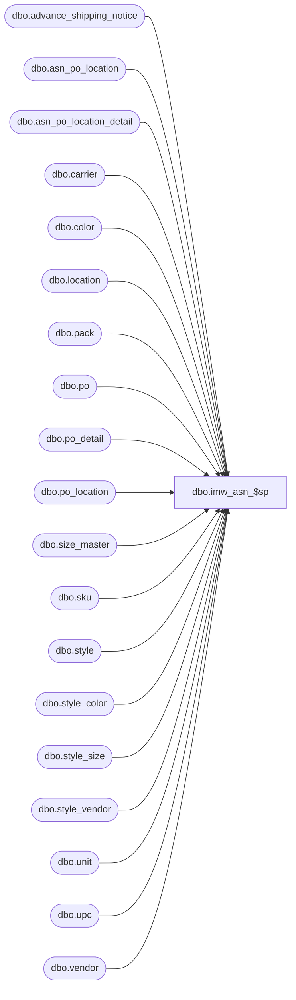

# dbo.imw_asn_$sp

**Database:** me_01  
**Server:** bedrockdb02  

## Architecture Diagram



## Table Dependencies

| Referenced Table |
|---|
| dbo.advance_shipping_notice |
| dbo.asn_po_location |
| dbo.asn_po_location_detail |
| dbo.carrier |
| dbo.color |
| dbo.location |
| dbo.pack |
| dbo.po |
| dbo.po_detail |
| dbo.po_location |
| dbo.size_master |
| dbo.sku |
| dbo.style |
| dbo.style_color |
| dbo.style_size |
| dbo.style_vendor |
| dbo.unit |
| dbo.upc |
| dbo.vendor |

## Stored Procedure Code

```sql
create proc [dbo].[imw_asn_$sp]
	( @asn_id AS DECIMAL(12), @location_id SMALLINT
	, @data_set_type TINYINT )
	
AS

/*
Proc name: imw_asn_$sp

Description: 

IM WEB Report: ASN Summary/ASN Reports

If @data_set_type = 0, return summary/header data set
If @data_set_type = 1, return summary/detail data set
If @data_set_type = 2, return detail data set (with size/upc information)

HISTORY:
Date       		Name         		Def#			Desc
Feb06,2009		Sameer Patel		106803			Initial release
*/

DECLARE @asn TABLE
	( asnNo NVARCHAR(20), vendorASNNo NVARCHAR(30)
	, billOfLading NVARCHAR(20), totalWeight DECIMAL(15,3), dateShipped SMALLDATETIME, expectedReceiptDate SMALLDATETIME
	, carrierName NVARCHAR(50)
	, vendorCode NVARCHAR(20), vendorName NVARCHAR(50)
	, unitWeightCode NVARCHAR(10)
	, po_id DECIMAL(12), poNo NVARCHAR(20)
	, location_id SMALLINT, locationCode NVARCHAR(20), locationName NVARCHAR(60)
	, cartonNo NVARCHAR(20) 
	, styleCode NVARCHAR(20), styleLongDesc NVARCHAR(120), vendorStyle NVARCHAR(40)
	, colorCode NVARCHAR(3), styleColorLongDesc NVARCHAR(20)
	, pack_id DECIMAL(13), packCode NVARCHAR(20), packDescription NVARCHAR(50), vendorPackCode NVARCHAR(20)
	, sku_id DECIMAL(13), secSeqNo SMALLINT, primSeqNo SMALLINT, sizeCode NVARCHAR(17)
	, sellingLocationCode NVARCHAR(20), sellingLocationName NVARCHAR(60)
	, max_last_activity_date SMALLDATETIME, max_upc_id DECIMAL(15), upcNumbers NVARCHAR(14)
	, shippedUnits INT, orderedUnits INT )
	
INSERT INTO @asn 
	( asnNo, vendorASNNo
	, billOfLading, totalWeight, dateShipped, expectedReceiptDate
	, carrierName
	, vendorCode, vendorName
	, unitWeightCode
	, po_id, poNo
	, location_id, locationCode, locationName 
	, cartonNo
	, styleCode, styleLongDesc, vendorStyle
	, colorCode, styleColorLongDesc
	, pack_id, packCode, packDescription, vendorPackCode
	, sku_id, secSeqNo, primSeqNo, sizeCode
	, sellingLocationCode, sellingLocationName 
	, shippedUnits )
SELECT 
	h.document_no asnNo, h.shipment_ref_no vendorASNNo
	, h.pro_bill_no billOfLading, h.weight totalWeight, h.ship_date dateShipped, h.expected_receipt_date expectedReceiptDate
	, cr.carrier_name carrierName
	, v.vendor_code vendorCode, v.vendor_name vendorName
	, u.unit_code unitWeightCode
	, al.po_id, po.po_no poNo
	, al.location_id, l.location_code locationCode, l.location_name locationName
	, ad.carton_no cartonNo
	, s.style_code styleCode, s.long_desc styleLongDesc, sv.vendor_style vendorStyle
	, c.color_code colorCode, sc.long_desc styleColorLongDesc
	, ad.pack_id, p.pack_code packCode, p.pack_description packDescription, p.vendor_pack_code vendorPackCode
	, ad.sku_id, sm.sec_seq_no secSeqNo, sm.prim_seq_no primSeqNo, sm.size_code sizeCode
	, sl.location_code sellinglocationCode, sl.location_name sellinglocationName
	, ad.units_sent shippedUnits
FROM
	advance_shipping_notice h
INNER JOIN asn_po_location al ON h.advance_shipping_notice_id = al.advance_shipping_notice_id
INNER JOIN ( asn_po_location_detail ad 
				LEFT OUTER JOIN location sl ON ad.location_id = sl.location_id ) ON ad.asn_po_location_id = al.asn_po_location_id AND ad.advance_shipping_notice_id = al.advance_shipping_notice_id
INNER JOIN po ON al.po_id = po.po_id
INNER JOIN vendor v ON h.vendor_id = v.vendor_id
LEFT OUTER JOIN carrier cr ON h.carrier_id = cr.carrier_id
LEFT OUTER JOIN unit u ON h.unit_weight_id = u.unit_id
INNER JOIN location l ON al.location_id = l.location_id
LEFT OUTER JOIN ( style s 
					INNER JOIN style_vendor sv ON s.style_id = sv.style_id ) ON ad.style_id = s.style_id AND h.vendor_id = sv.vendor_id
LEFT OUTER JOIN ( style_color sc
					INNER JOIN color c ON sc.color_id = c.color_id ) ON ad.style_color_id = sc.style_color_id
LEFT OUTER JOIN ( sku k
					INNER JOIN style_size sz ON k.style_size_id = sz.style_size_id
					INNER JOIN size_master sm ON sz.size_master_id = sm.size_master_id ) ON ad.sku_id = k.sku_id
LEFT OUTER JOIN pack p ON ad.pack_id = p.pack_id
WHERE
	h.advance_shipping_notice_id = @asn_id AND al.location_id = @location_id
	
UPDATE a
SET
	a.orderedUnits = COALESCE(pd.ordered_units, 0)
FROM
	@asn a
INNER JOIN po_location pl ON a.location_id = pl.location_id AND a.po_id = pl.po_id
INNER JOIN po_detail pd ON pl.po_location_id = pd.po_location_id AND pl.po_id = pd.po_id
								AND a.sku_id = pd.sku_id
									
UPDATE a
SET
	a.orderedUnits = COALESCE(pd.ordered_units, 0)
FROM
	@asn a
INNER JOIN po_location pl ON a.location_id = pl.location_id AND a.po_id = pl.po_id
INNER JOIN po_detail pd ON pl.po_location_id = pd.po_location_id AND pl.po_id = pd.po_id
								AND a.pack_id = pd.pack_id		

IF @data_set_type = 0

	BEGIN

		SELECT
			asnNo, vendorASNNo
			, billOfLading, totalWeight, dateShipped, expectedReceiptDate
			, carrierName
			, vendorCode, vendorName
			, unitWeightCode
			, SUM(CASE WHEN cartonNo IS NULL THEN 0 ELSE 1 END) noOfCartons
				, SUM(shippedUnits) totalShippedUnits
					, SUM(orderedUnits) totalOrderedUnits
		FROM
			@asn
		GROUP BY
			asnNo, vendorASNNo
			, billOfLading, totalWeight, dateShipped, expectedReceiptDate
			, carrierName
			, vendorCode, vendorName
			, unitWeightCode
	
	END

ELSE IF @data_set_type = 1

	BEGIN
	
		SELECT 
			poNo
			, cartonNo
			, styleCode, styleLongDesc, vendorStyle
			, colorCode, styleColorLongDesc
			, packCode, packDescription, vendorPackCode
			, SUM(shippedUnits) shippedUnits
				, SUM(orderedUnits) orderedUnits
		FROM
			@asn
		GROUP BY 
			poNo
			, cartonNo
			, styleCode, styleLongDesc, vendorStyle
			, colorCode, styleColorLongDesc
			, packCode, packDescription, vendorPackCode
		ORDER BY 
			1, 2, 3, 6
	
	END
	
ELSE IF @data_set_type = 2

	BEGIN
	
		UPDATE a
		SET
			a.max_last_activity_date = T.max_last_activity_date
		FROM
			@asn a
		INNER JOIN ( SELECT
						a.sku_id, MAX(u.last_activity_date) max_last_activity_date
					 FROM
					 	@asn a
					 INNER JOIN upc u ON a.sku_id = u.sku_id
					 GROUP BY
					 	a.sku_id ) T ON a.sku_id = T.sku_id
			
		UPDATE a
		SET
			a.max_upc_id = T.max_upc_id
		FROM
			@asn a
		INNER JOIN ( SELECT
						a.sku_id, MAX(u.upc_id) max_upc_id
					 FROM
					 	@asn a
					 INNER JOIN upc u ON a.sku_id = u.sku_id 
					 						AND a.max_last_activity_date = u.last_activity_date
					 GROUP BY
					 	a.sku_id ) T ON a.sku_id = T.sku_id
			
		UPDATE a
		SET
			a.max_last_activity_date = T.max_last_activity_date
		FROM
			@asn a
		INNER JOIN ( SELECT
						a.pack_id, MAX(u.last_activity_date) max_last_activity_date
					 FROM
					 	@asn a
					 INNER JOIN upc u ON a.pack_id = u.pack_id
					 GROUP BY
					 	a.pack_id ) T ON a.pack_id = T.pack_id
			
		UPDATE a
		SET
			a.max_upc_id = T.max_upc_id
		FROM
			@asn a
		INNER JOIN ( SELECT
						a.pack_id, MAX(u.upc_id) max_upc_id
					 FROM
					 	@asn a
					 INNER JOIN upc u ON a.pack_id = u.pack_id 
					 						AND a.max_last_activity_date = u.last_activity_date
					 GROUP BY
					 	a.pack_id ) T ON a.pack_id = T.pack_id
					 	
		UPDATE a
		SET
			a.upcNumbers = u.upc_number
		FROM
			@asn a
		INNER JOIN upc u ON a.max_upc_id = u.upc_id
		
		SELECT
			poNo
			, locationCode, locationName 
			, cartonNo
			, styleCode, styleLongDesc, vendorStyle
			, colorCode, styleColorLongDesc
			, packCode, packDescription, vendorPackCode
			, secSeqNo, primSeqNo, sizeCode
			, sellingLocationCode, sellingLocationName 
			, upcNumbers
			, SUM(shippedUnits) shippedUnits, SUM(orderedUnits) orderedUnits
		FROM
			@asn
		GROUP BY
			poNo
			, locationCode, locationName 
			, cartonNo
			, styleCode, styleLongDesc, vendorStyle
			, colorCode, styleColorLongDesc
			, packCode, packDescription, vendorPackCode
			, secSeqNo, primSeqNo, sizeCode
			, sellingLocationCode, sellingLocationName 
			, upcNumbers
	
	END
	
	
RETURN
```

