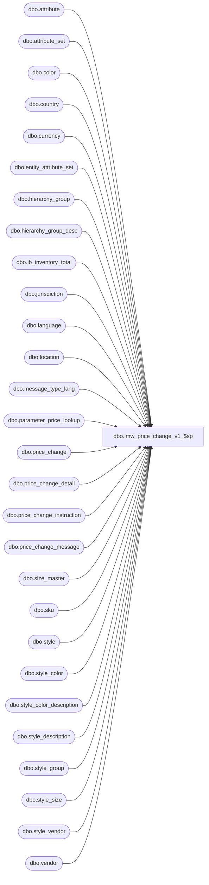

# dbo.imw_price_change_v1_$sp

**Database:** me_01  
**Server:** bedrockdb02  

## Architecture Diagram



## Table Dependencies

| Referenced Table |
|---|
| dbo.attribute |
| dbo.attribute_set |
| dbo.color |
| dbo.country |
| dbo.currency |
| dbo.entity_attribute_set |
| dbo.hierarchy_group |
| dbo.hierarchy_group_desc |
| dbo.ib_inventory_total |
| dbo.jurisdiction |
| dbo.language |
| dbo.location |
| dbo.message_type_lang |
| dbo.parameter_price_lookup |
| dbo.price_change |
| dbo.price_change_detail |
| dbo.price_change_instruction |
| dbo.price_change_message |
| dbo.size_master |
| dbo.sku |
| dbo.style |
| dbo.style_color |
| dbo.style_color_description |
| dbo.style_description |
| dbo.style_group |
| dbo.style_size |
| dbo.style_vendor |
| dbo.vendor |

## Stored Procedure Code

```sql
-----------------------------------------------------------------------------------------------------------------------------
--	Main Query: Create Procedure
-----------------------------------------------------------------------------------------------------------------------------

---This proc retrieves price change with schema_version=1 for web im.
-- Pass @detailResultOnly=1 when used from reporting services to get only the detail resultset
CREATE PROCEDURE [dbo].[imw_price_change_v1_$sp]
	@locationId smallint,
	@docNo nvarchar(40),
	@locale int = 1033,
	@excludeZeroOnHand bit = 0,
	@excludeStylesNotCarried bit = 0,
	@detailResultsOnly bit = 0

AS
BEGIN
	-- SET NOCOUNT ON added to prevent extra result sets from
	-- interfering with SELECT statements.
	SET NOCOUNT ON;

IF OBJECT_ID (N'tempdb.dbo.#tmp_styles_carried',  N'U') IS NOT NULL
BEGIN
	DROP TABLE dbo.#tmp_styles_carried
END
CREATE TABLE dbo.#tmp_styles_carried
	(
		style_id DECIMAL (12, 0) NOT NULL
	)

IF (@excludeStylesNotCarried = 1)
BEGIN
DECLARE @SharedAttribute NVARCHAR(40)

SELECT @SharedAttribute = attribute_code
	FROM attribute
	WHERE attribute_id = (SELECT shared_attribute_id FROM parameter_price_lookup);

  -- we populate a temp table with the list of style ids which are not carried by the location.  we use this later to do an outer join to remove these styles from the details.
  INSERT INTO #tmp_styles_carried
  SELECT DISTINCT style_attset.parent_id style_id
  FROM entity_attribute_set style_attset
    INNER JOIN attribute_set s_set ON s_set.attribute_set_id=style_attset.attribute_set_id and style_attset.parent_type=1  -- style
	INNER JOIN attribute s_a ON s_a.attribute_id=s_set.attribute_id AND s_a.attribute_code=@SharedAttribute

	AND s_set.attribute_set_code NOT IN
	(
		SELECT l_set.attribute_set_code
			FROM entity_attribute_set loc_attset
			LEFT OUTER JOIN attribute_set l_set ON l_set.attribute_set_id=loc_attset.attribute_set_id
			LEFT OUTER JOIN attribute l_a ON l_a.attribute_id=l_set.attribute_id
			WHERE loc_attset.parent_type=2
				AND loc_attset.parent_id = @locationId
				AND l_a.attribute_code=@SharedAttribute
	)
END

IF (@detailResultsOnly = 0)
BEGIN
	-- header result set
	SELECT TOP(1) location_code, location_name, pc.price_change_id, price_change_no, price_change_description, price_change_status, price_change_duration, effective_from_date, effective_to_date, currency_code, schema_version
	FROM price_change pc INNER JOIN price_change_instruction pci ON pci.price_change_id=pc.price_change_id, location l, jurisdiction j, country c, currency cy
	WHERE l.location_id = @locationId
	 AND ((price_change_status IN (3,4) AND price_change_duration = 1) OR (price_change_status IN (3,6))) /*3= issued, 4 = effective, 6 = completed*/
	 AND price_change_no = @docNo
	 AND (pci.location_instruction_type=0 OR (pci.location_instruction_type=1 AND pci.jurisdiction_id=(SELECT jurisdiction_id from location where location_id=@locationId)) OR (pci.location_instruction_type=2 and pci.location_id=@locationId))
	 AND j.jurisdiction_id = pc.jurisdiction_id
	 AND j.country_id = c.country_id
	 AND c.currency_id = cy.currency_id;
END

-- Price change detail result set
SELECT s.style_code,
       COALESCE(sd.long_desc, s.long_desc) StyleDesc,
	   v.vendor_code,
	   v.vendor_name,
	   sv.vendor_style,
	   hg.hierarchy_group_code,
	   COALESCE(hd.hierarchy_group_label, hg.hierarchy_group_label) hierarchy_group_label,
	   (CASE
				WHEN pci.merch_instruction_type = 3 THEN color.color_code
				WHEN a.final_exception_level IN (10, 20, 40, 50) THEN color.color_code
				END) AS color_code
	   ,
	   (CASE
				WHEN pci.merch_instruction_type = 3 THEN COALESCE(scd.long_desc, sc.long_desc)
				WHEN a.final_exception_level IN (10, 20, 40, 50) THEN COALESCE(scd.long_desc, sc.long_desc)
				END) AS StyleColorDesc
	   ,
	   (CASE
				WHEN pci.merch_instruction_type = 3 THEN COALESCE(scd.short_desc, sc.short_desc)
				WHEN a.final_exception_level IN (10, 20, 40, 50) THEN COALESCE(scd.short_desc, sc.short_desc)
				END) AS StyleColorShortDesc
	   ,
	   (CASE
				WHEN pci.merch_instruction_type = 4 THEN sm.size_code
				WHEN a.final_exception_level IN (10, 40) THEN sm.size_code
				END) AS size_code,
	   a.current_retail_price old_price,
	   a.selling_retail_price new_price,
	   SUM(COALESCE(IBIT.total_on_hand_units, 0)) StyleColorOnHandUnits
FROM price_change pc
INNER JOIN price_change_instruction pci on pc.price_change_id=pci.price_change_id
INNER JOIN  price_change_detail a on pc.price_change_id=a.price_change_id and a.price_change_instruction_id=pci.price_change_instruction_id

LEFT OUTER JOIN  ib_inventory_total IBIT on ibit.sku_id=a.sku_id and ibit.location_id=a.location_id

 --this join removes styles not carried by the location.  the table could be empty if this feature is off.
LEFT OUTER JOIN #tmp_styles_carried snc on snc.style_id=a.style_id

INNER JOIN sku on sku.sku_id = a.sku_id
INNER JOIN style_size ss on sku.style_size_id=ss.style_size_id
INNER JOIN size_master sm on ss.size_master_id=sm.size_master_id
INNER  JOIN style_color sc  on sku.style_color_id = sc.style_color_id
INNER JOIN color ON sc.color_id = color.color_id
LEFT OUTER JOIN
   (
		SELECT scd.style_color_id, scd.short_desc, scd.long_desc
			FROM style_color_description AS scd left JOIN  dbo.[language] AS lang ON scd.language_id = lang.language_id
			WHERE lang.locale_identifier=@locale and lang.active_flag=1
   ) scd ON scd.style_color_id = sc.style_color_id

INNER JOIN style s ON sku.style_id = s.style_id
LEFT OUTER JOIN
   (
		SELECT sd.style_id, sd.long_desc
			FROM style_description AS sd left JOIN  dbo.[language] AS lang ON sd.language_id = lang.language_id
			WHERE lang.locale_identifier=@locale and lang.active_flag=1
   ) sd ON sd.style_id= s.style_id

INNER  JOIN style_vendor sv ON sv.style_id = s.style_id and sv.primary_vendor_flag=1
INNER  JOIN vendor v on sv.vendor_id = v.vendor_id
INNER JOIN style_group sg on sg.style_id=a.style_id
INNER JOIN hierarchy_group hg on sg.hierarchy_group_id = hg.hierarchy_group_id AND hg.hierarchy_id = 1
LEFT OUTER JOIN
   (
		SELECT hd.hierarchy_group_id, hd.hierarchy_group_label
			FROM hierarchy_group_desc AS hd left JOIN  dbo.[language] AS lang ON hd.language_id = lang.language_id
			WHERE lang.locale_identifier=@locale and lang.active_flag=1
   ) hd ON hd.hierarchy_group_id = hg.hierarchy_group_id

WHERE
	pc.price_change_no=@docNo
	AND a.location_id = @locationId
    AND current_retail_price != selling_retail_price

	-- exclude zero on hand flag
    AND (@excludeZeroOnHand = 0 OR IBIT.total_on_hand_units > 0 )

	-- exclude styles not carried
	AND snc.style_id IS NULL


GROUP BY
			s.style_code
			,COALESCE(sd.long_desc, s.long_desc)
			,v.vendor_code,
	   v.vendor_name,
	   sv.vendor_style,
	   hg.hierarchy_group_code,
	   COALESCE(hd.hierarchy_group_label, hg.hierarchy_group_label) ,
	   (CASE
				WHEN pci.merch_instruction_type = 3 THEN color.color_code
				WHEN a.final_exception_level IN (10, 20, 40, 50) THEN color.color_code
				END),
	   (CASE
				WHEN pci.merch_instruction_type = 3 THEN COALESCE(scd.long_desc, sc.long_desc)
				WHEN a.final_exception_level IN (10, 20, 40, 50) THEN COALESCE(scd.long_desc, sc.long_desc)
				END)
	   ,
	   (CASE
				WHEN pci.merch_instruction_type = 3 THEN COALESCE(scd.short_desc, sc.short_desc)
				WHEN a.final_exception_level IN (10, 20, 40, 50) THEN COALESCE(scd.short_desc, sc.short_desc)
				END)
	   ,
	   (CASE
				WHEN pci.merch_instruction_type = 4 THEN sm.size_code
				WHEN a.final_exception_level IN (10, 40) THEN sm.size_code
				END),
	   a.current_retail_price ,
	   a.selling_retail_price

ORDER BY s.style_code, color_code , size_code;

IF (@detailResultsOnly = 0)
BEGIN

	-- SQL for Price change message Info
	SELECT pc.price_change_id, price_change_message_id, m.message_type_description, pcm.message
	FROM message_type_lang m, price_change_message pcm, price_change pc
	WHERE m.message_type_id = pcm.message_type_id
	 AND pc.price_change_id = pcm.price_change_id
	 AND price_change_no = @docNo
	 AND (m.locale_identifier=@locale or m.locale_identifier is null)
END


END
```

