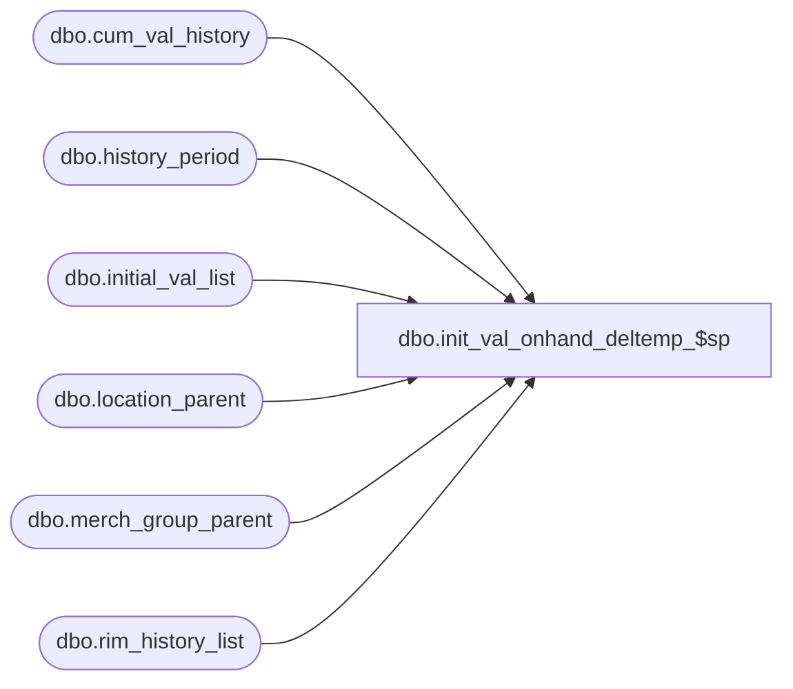

# dbo.init_val_onhand_deltemp_$sp

**Database:** me_01  
**Server:** bedrockdb02  

## Architecture Diagram



## Table Dependencies

| Referenced Table |
|---|
| dbo.cum_val_history |
| dbo.history_period |
| dbo.initial_val_list |
| dbo.location_parent |
| dbo.merch_group_parent |
| dbo.rim_history_list |

## Stored Procedure Code

```sql
CREATE proc [dbo].[init_val_onhand_deltemp_$sp] 
(@MerchGroupId int, 
@CalPerId decimal(12,0), 
@LocId int, 
@LocLevelId int, 
@JurisdictionId smallint,
@Cost decimal(14,2), 
@CostLocal decimal(14,2), 
@Retail decimal(14,2),
@RetailLocal decimal(14,2),
@StartDate DATETIME, 
@EndDate DATETIME)
AS BEGIN

delete from cum_val_history where 
calendar_period_id = @CalPerId and merch_hierarchy_group_id = @MerchGroupId
and location_hierarchy_group_id = @LocId and initial_val_flag = 1
and jurisdiction_id=@JurisdictionId;

insert into cum_val_history 
(merch_hierarchy_group_id, calendar_period_id, 
location_hierarchy_group_id, cum_val_cost, cum_val_retail, initial_val_flag,
cum_val_cost_local, cum_val_retail_local, jurisdiction_id) 
values (@MerchGroupId, @CalPerId, @LocId, @Cost, @Retail, 1,
@CostLocal, @RetailLocal, @JurisdictionId);

/*LowestMerchLevel ?*/
IF EXISTS (SELECT distinct hierarchy_group_id  FROM merch_group_parent WHERE hierarchy_group_id=@MerchGroupId
 AND  hierarchy_group_id  NOT IN(SELECT distinct parent_hierarchy_group_id FROM merch_group_parent))
BEGIN
/*yes*/
delete from initial_val_list 
where merch_hierarchy_group_id = @MerchGroupId and 
calendar_period_id in (select 
calendar_period_id from history_period
where start_date >= @StartDate and start_date <= @EndDate);
										
insert into rim_history_list (merch_hierarchy_group_id, location_id, history_period_id)
select distinct @MerchGroupId, b.location_id, min(c.history_period_id) 
from location_parent b, history_period c
where b.hierarchy_level_id = @LocLevelId
and c.calendar_period_id = @CalPerId
group by b.location_id;
END
ELSE
BEGIN
/*No*/
delete from initial_val_list 
where merch_hierarchy_group_id in (select 
hierarchy_group_id from 
merch_group_parent where 
parent_hierarchy_group_id = @MerchGroupId) and 
calendar_period_id in (select 
calendar_period_id from history_period
where start_date >= @StartDate and start_date <= @EndDate);
										
insert into rim_history_list (merch_hierarchy_group_id, location_id, history_period_id)
select distinct a.hierarchy_group_id, b.location_id, min(c.history_period_id) 
from merch_group_parent a, location_parent b, history_period c
where a.parent_hierarchy_group_id = @MerchGroupId
and b.hierarchy_level_id = @LocLevelId
and c.calendar_period_id = @CalPerId
group by a.hierarchy_group_id, b.location_id;
END

END;
```

