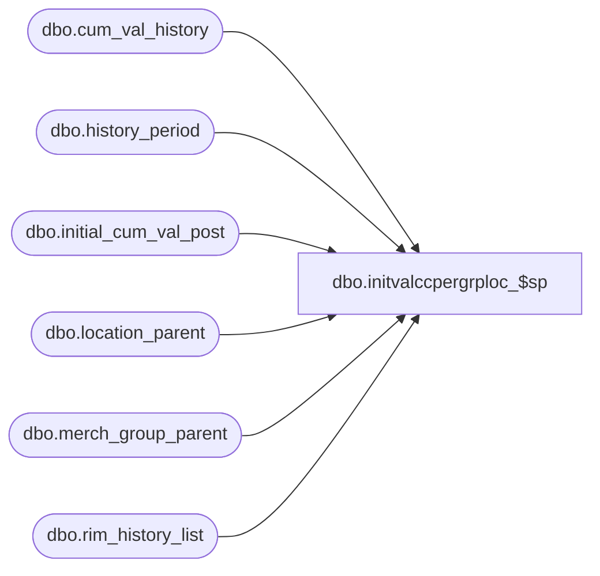

# dbo.initvalccpergrploc_$sp

**Database:** me_01  
**Server:** bedrockdb02  

## Architecture Diagram



## Table Dependencies

| Referenced Table |
|---|
| dbo.cum_val_history |
| dbo.history_period |
| dbo.initial_cum_val_post |
| dbo.location_parent |
| dbo.merch_group_parent |
| dbo.rim_history_list |

## Stored Procedure Code

```sql
CREATE proc [dbo].[initvalccpergrploc_$sp] 
(@MerchGroupId decimal(12,0), 
@StartPerId decimal(12,0), 
@MerchLevelId decimal(12,0), 
@PrevMerchGroupLevel decimal(12,0), 
@PrevLocLevel decimal(12,0),
@StartPrevDate DATETIME,
@StartDate DATETIME)
AS BEGIN

insert into initial_cum_val_post
(merch_hierarchy_group_id,location_id,cost,retail,
cost_local,retail_local,jurisdiction_id) 
select mgp.hierarchy_group_id, lp.location_id, 
sum(cvh.cum_val_cost), sum(cvh.cum_val_retail),
sum(cvh.cum_val_cost_local), sum(cvh.cum_val_retail_local), cvh.jurisdiction_id
from merch_group_parent mgp, location_parent lp, cum_val_history cvh
where (( mgp.parent_hierarchy_group_id = @MerchGroupId/*curent_group*/ and mgp.hierarchy_level_id=@MerchLevelId/*cur merch level*/)
or(mgp.hierarchy_group_id = @MerchGroupId/*curent_group*/ ))
and calendar_period_id in(select calendar_period_id from 
history_period where start_date >= @StartPrevDate and end_date < @StartDate)
and (cvh.merch_hierarchy_group_id=mgp.hierarchy_group_id or(cvh.merch_hierarchy_group_id in (select mgp2.parent_hierarchy_group_id
from merch_group_parent mgp2 where mgp2.hierarchy_group_id in (select mgp3.hierarchy_group_id from merch_group_parent mgp3
where mgp3.parent_hierarchy_group_id=@MerchGroupId /*curent_group*/))
)or(cvh.merch_hierarchy_group_id = mgp.parent_hierarchy_group_id) or cvh.merch_hierarchy_group_id in 
(select mgp2.hierarchy_group_id from merch_group_parent mgp2 where mgp2.parent_hierarchy_group_id=@MerchGroupId/*curent_group*/) )
and lp.hierarchy_level_id =@PrevLocLevel /*prev loc level*/
and cvh.location_hierarchy_group_id in(select distinct lp2.parent_hierarchy_group_id 
			from location_parent lp2 where lp2.hierarchy_level_id=@PrevLocLevel/*prev loc level*/
			and lp2.location_id in(select distinct lp3.location_id 
			from location_parent lp3 where lp3.parent_hierarchy_group_id =lp.parent_hierarchy_group_id))
group by mgp.hierarchy_group_id, lp.location_id, cvh.jurisdiction_id;


delete from cum_val_history with (rowlock)
where merch_hierarchy_group_id = @MerchGroupId 
and calendar_period_id = @StartPerId 
and initial_val_flag = 1;

insert into cum_val_history 
(merch_hierarchy_group_id, calendar_period_id, 
location_hierarchy_group_id, cum_val_cost, 
cum_val_retail, initial_val_flag,
cum_val_cost_local, cum_val_retail_local, jurisdiction_id) 
select @MerchGroupId, @StartPerId, a.location_id, 
(sum(cost))/(sum(retail)), 1, 1, 
sum(cost_local)/sum(retail_local), 1, a.jurisdiction_id
from initial_cum_val_post a, merch_group_parent b 
where a.merch_hierarchy_group_id = b.hierarchy_group_id and 
b.hierarchy_level_id = @MerchLevelId and (b.parent_hierarchy_group_id = @MerchGroupId or b.hierarchy_group_id =@MerchGroupId)
group by b.parent_hierarchy_group_id, a.location_id, a.jurisdiction_id;
										
delete initial_cum_val_post with (rowlock) where merch_hierarchy_group_id 
in (select hierarchy_group_id from merch_group_parent 
where parent_hierarchy_group_id = @MerchGroupId )
or merch_hierarchy_group_id=@MerchGroupId;

insert into rim_history_list with (rowlock)(merch_hierarchy_group_id, location_id, history_period_id)
select distinct a.hierarchy_group_id, b.location_hierarchy_group_id, min(c.history_period_id) 
from merch_group_parent a, cum_val_history b, history_period c
where (a.parent_hierarchy_group_id = @MerchGroupId or a.hierarchy_group_id=@MerchGroupId)
and b.merch_hierarchy_group_id = @MerchGroupId
and b.calendar_period_id = @StartPerId
and initial_val_flag = 1 
and c.calendar_period_id = @StartPerId
group by a.hierarchy_group_id, b.location_hierarchy_group_id;
END;
```

