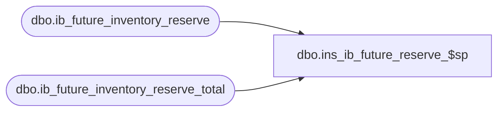

# dbo.ins_ib_future_reserve_$sp

**Database:** me_01  
**Server:** bedrockdb02  

## Architecture Diagram



## Table Dependencies

| Referenced Table |
|---|
| dbo.ib_future_inventory_reserve |
| dbo.ib_future_inventory_reserve_total |

## Stored Procedure Code

```sql
-----------------------------------------------------------------------------------------------------------------------------
--	Main Query: Create Procedure
-----------------------------------------------------------------------------------------------------------------------------

CREATE PROCEDURE dbo.ins_ib_future_reserve_$sp
AS

SET TRANSACTION ISOLATION LEVEL READ UNCOMMITTED
SET NOCOUNT ON

-----------------------------------------------------------------------------------------------------------------------------
--	Error Trapping: Check If Temp Table(s) Already Exist(s) And Drop If Applicable
-----------------------------------------------------------------------------------------------------------------------------

IF OBJECT_ID (N'tempdb.dbo.#temp_ib_future_inventory_reserve_total_update_values', N'U') IS NOT NULL
BEGIN

	DROP TABLE dbo.#temp_ib_future_inventory_reserve_total_update_values

END

-----------------------------------------------------------------------------------------------------------------------------
--	Table Create: Shell Table for "ib_inventory_total" Update
-----------------------------------------------------------------------------------------------------------------------------
CREATE TABLE dbo.#temp_ib_future_inventory_reserve_total_update_values
	(
		 sku_id DECIMAL (13, 0) NULL
		,location_id SMALLINT NULL
		,reserved_quantity INT
	)

-----------------------------------------------------------------------------------------------------------------------------
--	Populate ib_future_inventory_reserve using reserved_future_quantity in dbo.#temp_ib_future_inventory_reserve
-----------------------------------------------------------------------------------------------------------------------------

INSERT INTO dbo.#temp_ib_future_inventory_reserve_total_update_values
	(
		sku_id
		,location_id
		,reserved_quantity
	)
SELECT
	sqINS.sku_id
	,sqINS.location_id
	,sqINS.reserved_quantity
FROM
	(
		INSERT INTO dbo.ib_future_inventory_reserve
			(
				sku_id
				,location_id
				,reserved_quantity
				,date_reserved
				,batch_no
			)

		OUTPUT
			 inserted.sku_id
			,inserted.location_id
			,inserted.reserved_quantity

		SELECT
			sku_id
			,location_id
			,reserved_quantity
			,date_reserved
			,batch_no
		FROM
			dbo.#temp_ib_future_inventory_reserve
	) sqINS

-----------------------------------------------------------------------------------------------------------------------------
--	Update ib_future_inventory_reserve_total using data inserted into ib_future_inventory_reserve
-----------------------------------------------------------------------------------------------------------------------------

IF EXISTS (SELECT * FROM dbo.#temp_ib_future_inventory_reserve_total_update_values)
BEGIN

	MERGE
		dbo.ib_future_inventory_reserve_total I

	USING
		dbo.#temp_ib_future_inventory_reserve_total_update_values X ON
			X.location_id = I.location_id
			AND X.sku_id = I.sku_id

	WHEN MATCHED THEN

		UPDATE
		SET
			I.reserved_quantity = I.reserved_quantity + X.reserved_quantity

	WHEN NOT MATCHED BY TARGET THEN

		INSERT
			(
				sku_id
				,location_id
				,reserved_quantity
			)
		VALUES
			(
				X.sku_id
				,X.location_id
				,X.reserved_quantity
			);

END
```

