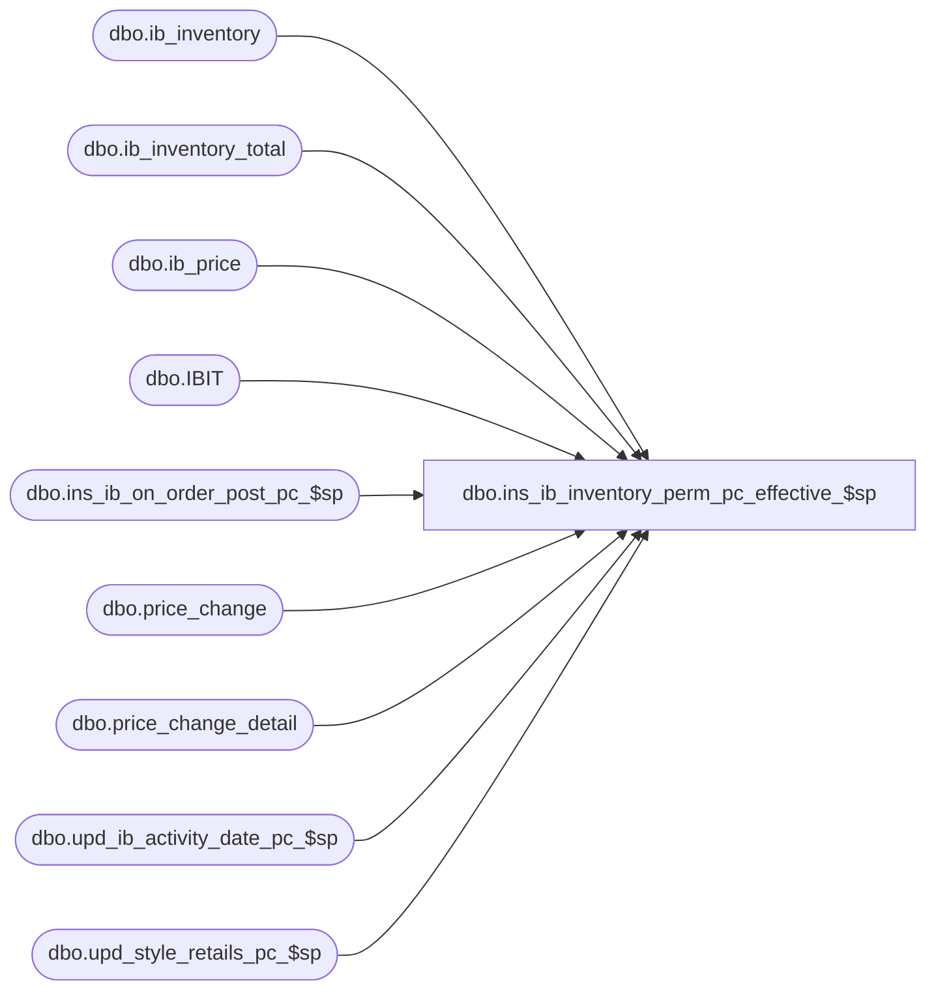

# dbo.ins_ib_inventory_perm_pc_effective_$sp

**Database:** me_01  
**Server:** bedrockdb02  

## Architecture Diagram



## Table Dependencies

| Referenced Table |
|---|
| dbo.ib_inventory |
| dbo.ib_inventory_total |
| dbo.ib_price |
| dbo.IBIT |
| dbo.ins_ib_on_order_post_pc_$sp |
| dbo.price_change |
| dbo.price_change_detail |
| dbo.upd_ib_activity_date_pc_$sp |
| dbo.upd_style_retails_pc_$sp |

## Stored Procedure Code

```sql
-----------------------------------------------------------------------------------------------------------------------------
--	Main Query: Create Procedure
-----------------------------------------------------------------------------------------------------------------------------

CREATE PROCEDURE dbo.ins_ib_inventory_perm_pc_effective_$sp

	@Price_Change_ID AS DECIMAL (12, 0)

AS

--	Object GUID: 8BA16786-0A22-487A-8386-784F6FEA7875
--	Pricing GUID (General): EFB5A343-8978-4ACF-952C-37862704CBC8

SET TRANSACTION ISOLATION LEVEL READ UNCOMMITTED
SET NOCOUNT ON


-----------------------------------------------------------------------------------------------------------------------------
--	Declarations / Sets: Declare And Set Variables
-----------------------------------------------------------------------------------------------------------------------------

DECLARE
	 @Effective_From_Date AS SMALLDATETIME
	,@Price_Change_No AS NVARCHAR (20)
	,@Price_Change_Type AS SMALLINT


DECLARE @Expand_And_Multiply AS TABLE

	(
		 expansion_level INT NULL
		,multiplier INT NULL
	)


SELECT
	 @Effective_From_Date = PC.effective_from_date
	,@Price_Change_No = PC.price_change_no
	,@Price_Change_Type = PC.price_change_type
FROM
	dbo.price_change PC
WHERE
	PC.price_change_id = @Price_Change_ID


INSERT INTO @Expand_And_Multiply

	(
		 expansion_level
		,multiplier
	)

VALUES
	 (10, NULL)
	,(20, -1)
	,(30, 1)


-----------------------------------------------------------------------------------------------------------------------------
--	Error Trapping: Check If Temp Table(s) Already Exist(s) And Drop If Applicable
-----------------------------------------------------------------------------------------------------------------------------

IF OBJECT_ID (N'tempdb.dbo.#temp_ib_inventory_total_update_values', N'U') IS NOT NULL
BEGIN

	DROP TABLE dbo.#temp_ib_inventory_total_update_values

END


-----------------------------------------------------------------------------------------------------------------------------
--	Table Create: Shell Table For "ib_on_order_total" Update
-----------------------------------------------------------------------------------------------------------------------------

CREATE TABLE dbo.#temp_ib_inventory_total_update_values

	(
		 sku_id DECIMAL (13, 0) NULL
		,location_id SMALLINT NULL
		,inventory_status_id SMALLINT NULL
		,transaction_valuation_retail DECIMAL (14, 2)  NULL
		,transaction_selling_retail DECIMAL (14, 2)  NULL
		,price_status_id SMALLINT NULL
	)


-----------------------------------------------------------------------------------------------------------------------------
--	Table Update: Insert Values Into "ib_inventory" And Capture Certain Output To Use To Later Update "ib_inventory_total"
-----------------------------------------------------------------------------------------------------------------------------

INSERT INTO dbo.#temp_ib_inventory_total_update_values

	(
		 sku_id
		,location_id
		,inventory_status_id
		,transaction_valuation_retail
		,transaction_selling_retail
		,price_status_id
	)

SELECT
	 sqINS.sku_id
	,sqINS.location_id
	,sqINS.inventory_status_id
	,sqINS.transaction_valuation_retail
	,sqINS.transaction_selling_retail
	,sqINS.price_status_id	
FROM

	(
		INSERT INTO dbo.ib_inventory -- Note: Insert Order Is Not Guaranteed, Even If You Use An ORDER BY

			(
				 sku_id
				,location_id
				,price_status_id
				,transaction_date
				,transaction_type_code
				,inventory_status_id
				,other_location_id
				,transaction_reason_id
				,document_number
				,transaction_units
				,transaction_cost
				,transaction_valuation_retail
				,transaction_selling_retail
				,price_change_type
				,units_affected
				,transaction_cost_local
				,transaction_no
				,batch_no
				,register_no
			)

		OUTPUT
			 inserted.sku_id
			,inserted.location_id
			,inserted.inventory_status_id
			,inserted.transaction_units
			,inserted.transaction_valuation_retail
			,inserted.transaction_selling_retail
			,inserted.price_status_id

		SELECT
			 IBIT.sku_id
			,IBIT.location_id
			,(CASE
				WHEN EM.expansion_level = 20 THEN IBIT.price_status_id -- Old Status
				WHEN EM.expansion_level IN (10, 30) THEN PCD.price_status_id -- New / Current Status
				END) AS price_status_id
			,CONVERT (SMALLDATETIME, CONVERT (VARCHAR (8), GETDATE (), 112)) AS transaction_date
			,(CASE
				WHEN EM.expansion_level = 10 THEN 700 -- Effective Price Change / Lookup Values Found By Querying: SELECT * FROM dbo.transaction_type
				WHEN EM.expansion_level IN (20, 30) THEN 710 -- Price Status Change / Lookup Values Found By Querying: SELECT * FROM dbo.transaction_type
				END) AS transaction_type_code
			,IBIT.inventory_status_id
			,NULL AS other_location_id
			,NULL AS transaction_reason_id
			,@Price_Change_No AS document_number
			,(CASE
				WHEN EM.expansion_level = 10 THEN 0
				WHEN EM.expansion_level IN (20, 30) THEN IBIT.total_on_hand_units * EM.multiplier
				END) AS transaction_units
			,(CASE
				WHEN EM.expansion_level = 10 THEN 0
				WHEN EM.expansion_level IN (20, 30) THEN IBIT.total_on_hand_cost * EM.multiplier
				END) AS transaction_cost
			,(CASE
				WHEN EM.expansion_level = 10 THEN (PCD.valuation_retail_price * IBIT.total_on_hand_units) - IBIT.total_on_hand_valuation_retail
				WHEN EM.expansion_level IN (20, 30) THEN IBIT.total_on_hand_valuation_retail * EM.multiplier
				END) AS transaction_valuation_retail
			,(CASE
				WHEN EM.expansion_level = 10 THEN (PCD.selling_retail_price * IBIT.total_on_hand_units) - IBIT.total_on_hand_selling_retail
				WHEN EM.expansion_level IN (20, 30) THEN IBIT.total_on_hand_selling_retail * EM.multiplier
				END) AS transaction_selling_retail
			,(CASE
				WHEN EM.expansion_level = 10 THEN @Price_Change_Type
				WHEN EM.expansion_level IN (20, 30) THEN NULL
				END) AS price_change_type
			,(CASE
				WHEN PCD.is_pseudo_instruction = 1 THEN 0
				WHEN EM.expansion_level = 10 THEN IBIT.total_on_hand_units
				WHEN EM.expansion_level IN (20, 30) THEN IBIT.total_on_hand_units * EM.multiplier
				END) AS units_affected
			,(CASE
				WHEN EM.expansion_level = 10 THEN 0
				WHEN EM.expansion_level IN (20, 30) THEN IBIT.total_on_hand_cost_local * EM.multiplier
				END) AS transaction_cost_local
			,NULL AS transaction_no
			,NULL AS batch_no
			,NULL AS register_no
		FROM
			dbo.price_change_detail PCD
			INNER JOIN dbo.ib_inventory_total IBIT ON IBIT.sku_id = PCD.sku_id
				AND IBIT.location_id = PCD.location_id
				AND IBIT.total_on_hand_units <> 0
			CROSS JOIN @Expand_And_Multiply EM
		WHERE
			PCD.price_change_id = @Price_Change_ID
			AND PCD.is_pseudo_instruction = 0
			AND
			(
				EM.expansion_level = 10
				OR PCD.price_status_id <> IBIT.price_status_id -- If Condition Is True Then Price Status Was Modified (Need To Add Two Additonal Entries Into "ib_inventory")
			)
	) sqINS

WHERE
	sqINS.transaction_units = 0

-----------------------------------------------------------------------------------------------------------------------------
--	Table Update: Update "ib_inventory_total" With Captured Output Values
-----------------------------------------------------------------------------------------------------------------------------

IF EXISTS (SELECT * FROM dbo.#temp_ib_inventory_total_update_values ttIBITUV)
BEGIN

	UPDATE
		IBIT
	SET
		 IBIT.price_status_id = X.price_status_id
		,IBIT.total_on_hand_selling_retail = IBIT.total_on_hand_selling_retail + X.transaction_selling_retail
		,IBIT.total_on_hand_valuation_retail = IBIT.total_on_hand_valuation_retail + X.transaction_valuation_retail
	FROM
		dbo.ib_inventory_total IBIT
		INNER JOIN dbo.#temp_ib_inventory_total_update_values X ON X.location_id = IBIT.location_id
			AND X.sku_id = IBIT.sku_id
			AND X.inventory_status_id = IBIT.inventory_status_id

END


IF OBJECT_ID (N'tempdb.dbo.#temp_ib_inventory_total_update_values', N'U') IS NOT NULL
BEGIN

	DROP TABLE dbo.#temp_ib_inventory_total_update_values

END


-----------------------------------------------------------------------------------------------------------------------------
--	Call Procedure: Execute "upd_ib_activity_date_pc_$sp" To Update "ib_activity_date" Table's "Markdown" Date(s)
-----------------------------------------------------------------------------------------------------------------------------

IF @Price_Change_Type = 0
BEGIN

	EXECUTE dbo.upd_ib_activity_date_pc_$sp

		 @Effective_From_Date = @Effective_From_Date
		,@Price_Change_ID = @Price_Change_ID

END


-----------------------------------------------------------------------------------------------------------------------------
--	Call Procedure: Execute "upd_style_retails_pc_$sp" To Adjust Applicable "Style Retail" Tables' Values
-----------------------------------------------------------------------------------------------------------------------------

EXECUTE dbo.upd_style_retails_pc_$sp

	@Price_Change_ID = @Price_Change_ID


-----------------------------------------------------------------------------------------------------------------------------
--	Table Update: Set "effective_date" On "ib_price" Table
-----------------------------------------------------------------------------------------------------------------------------

UPDATE
	IBP
SET
	IBP.effective_date = @Effective_From_Date
FROM
	dbo.ib_price IBP
WHERE
	IBP.document_number = @Price_Change_No


-----------------------------------------------------------------------------------------------------------------------------
--	Call Procedure: Execute "ins_ib_on_order_post_pc_$sp" Since The Price Change Is A Permanent One
-----------------------------------------------------------------------------------------------------------------------------

EXECUTE dbo.ins_ib_on_order_post_pc_$sp

	 @Effective_From_Date = @Effective_From_Date
	,@Price_Change_ID = @Price_Change_ID
	,@Price_Change_Status = 4 -- Effective
```

