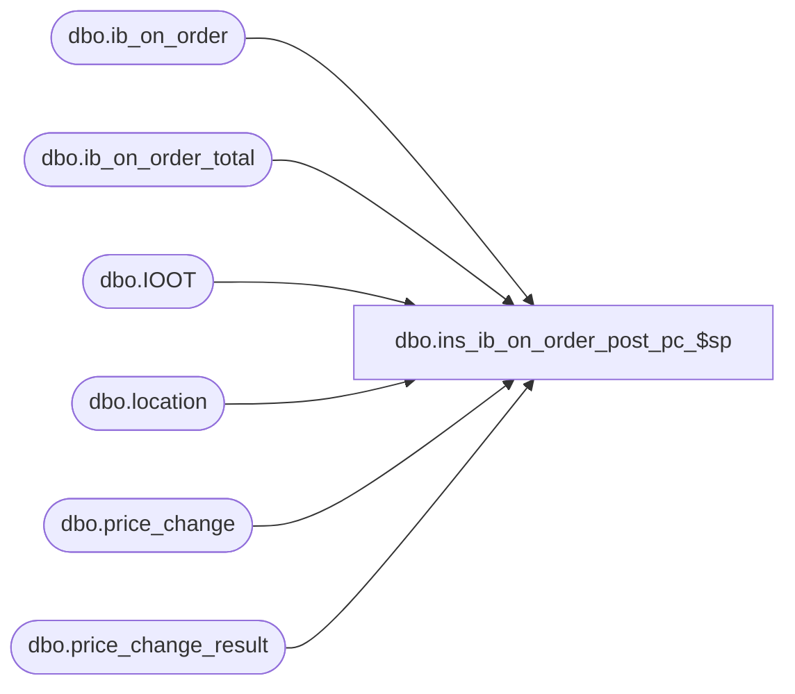

# dbo.ins_ib_on_order_post_pc_$sp

**Database:** me_01  
**Server:** bedrockdb02  

## Architecture Diagram



## Table Dependencies

| Referenced Table |
|---|
| dbo.ib_on_order |
| dbo.ib_on_order_total |
| dbo.IOOT |
| dbo.location |
| dbo.price_change |
| dbo.price_change_result |

## Stored Procedure Code

```sql
-----------------------------------------------------------------------------------------------------------------------------
--	Main Query: Create Procedure
-----------------------------------------------------------------------------------------------------------------------------
CREATE PROCEDURE [dbo].[ins_ib_on_order_post_pc_$sp]

	 @Effective_From_Date AS SMALLDATETIME
	,@Price_Change_ID AS DECIMAL (12, 0)
	,@Price_Change_Status AS SMALLINT -- Lookup Values Found By Querying: SELECT * FROM dbo.enum_price_chg_doc_status

AS

--	Object GUID: FF0CD9D8-4468-4E14-8CF6-05D5AAE56DE3
--	Pricing GUID (General): EFB5A343-8978-4ACF-952C-37862704CBC8

SET TRANSACTION ISOLATION LEVEL READ UNCOMMITTED
SET NOCOUNT ON


-----------------------------------------------------------------------------------------------------------------------------
--	Declarations / Sets: Declare And Set Variables
-----------------------------------------------------------------------------------------------------------------------------

DECLARE @Expand_And_Multiply AS TABLE

	(
		 expansion_level INT NULL
		,multiplier INT NULL
	)


INSERT INTO @Expand_And_Multiply

	(
		 expansion_level
		,multiplier
	)

VALUES
	 (10, NULL)
	,(20, -1)
	,(30, 1)

DECLARE @Result_ID AS DECIMAL(12,0) = (SELECT result_id FROM dbo.price_change WHERE price_change_id = @Price_Change_ID);

-----------------------------------------------------------------------------------------------------------------------------
--	Error Trapping: Check If Temp Table(s) Already Exist(s) And Drop If Applicable
-----------------------------------------------------------------------------------------------------------------------------

IF OBJECT_ID (N'tempdb.dbo.#temp_ib_on_order_total_update_values', N'U') IS NOT NULL
BEGIN

	DROP TABLE dbo.#temp_ib_on_order_total_update_values

END

IF OBJECT_ID (N'tempdb.dbo.#temp_price_change_detail', N'U') IS NOT NULL
BEGIN

	DROP TABLE dbo.#temp_price_change_detail

END


-----------------------------------------------------------------------------------------------------------------------------
--	Table Create: Shell Table For "ib_on_order_total" Update
-----------------------------------------------------------------------------------------------------------------------------

CREATE TABLE dbo.#temp_ib_on_order_total_update_values

	(
		 document_number NVARCHAR (20)
		,sku_id DECIMAL (13, 0)
		,location_id SMALLINT
		,receipt_date SMALLDATETIME
		,pack_id DECIMAL(12, 0)
		,on_order_selling_retail DECIMAL (14, 2)
		,on_order_valuation_retail DECIMAL (14, 2)
		,price_status_id SMALLINT
	)

-----------------------------------------------------------------------------------------------------------------------------
--	Table Insert: Prepare table with sku/location details from price change
-----------------------------------------------------------------------------------------------------------------------------

CREATE TABLE dbo.#temp_price_change_detail

	(
		 sku_id DECIMAL (13, 0)
		,location_id SMALLINT
		,jurisdiction_id SMALLINT
		,price_status_id SMALLINT
		,valuation_retail_price DECIMAL(14, 2)
		,selling_retail_price DECIMAL(14, 2)
	)

INSERT INTO dbo.#temp_price_change_detail
	(
		sku_id
		,location_id
		,jurisdiction_id
		,price_status_id
		,valuation_retail_price
		,selling_retail_price
	)
SELECT
	PCR.sku_id
	,PCR.location_id
	,PCR.jurisdiction_id
	,PCR.price_status_id
	,PCR.valuation_retail_price
	,PCR.selling_retail_price
FROM
	dbo.price_change_result PCR
WHERE
	PCR.result_id = @Result_ID
	AND PCR.location_id IS NOT NULL
	AND PCR.is_pseudo_instruction = 0
	AND EXISTS
		(
			SELECT 1
			FROM
				dbo.ib_on_order_total IOOT
			WHERE
				IOOT.sku_id = PCR.sku_id
				AND IOOT.location_id = PCR.location_id
		)

INSERT INTO dbo.#temp_price_change_detail
	(
		sku_id
		,location_id
		,jurisdiction_id
		,price_status_id
		,valuation_retail_price
		,selling_retail_price
	)
SELECT
	PCR.sku_id
	,L.location_id
	,PCR.jurisdiction_id
	,PCR.price_status_id
	,PCR.valuation_retail_price
	,PCR.selling_retail_price
FROM
	dbo.price_change_result PCR
	INNER JOIN dbo.location L ON PCR.jurisdiction_id = L.jurisdiction_id
WHERE
	PCR.result_id = @Result_ID
	AND PCR.location_id IS NULL
	AND PCR.is_pseudo_instruction = 0
	AND EXISTS
		(
			SELECT 1
			FROM
				dbo.ib_on_order_total IOOT
			WHERE
				IOOT.sku_id = PCR.sku_id
				AND IOOT.location_id = L.location_id
		)
	AND NOT EXISTS
		(
			SELECT 1
			FROM
				dbo.#temp_price_change_detail T
			WHERE
				T.sku_id = PCR.sku_id
				AND T.location_id = L.location_id
		)

-----------------------------------------------------------------------------------------------------------------------------
--	Table Update: Insert Values Into "ib_on_order" And Capture Certain Output To Use To Later Update "ib_on_order_total"
-----------------------------------------------------------------------------------------------------------------------------

INSERT INTO dbo.#temp_ib_on_order_total_update_values

	(
		 document_number
		,sku_id
		,location_id
		,receipt_date
		,pack_id
		,on_order_selling_retail
		,on_order_valuation_retail
		,price_status_id
	)

SELECT
	 sqINS.document_number
	,sqINS.sku_id
	,sqINS.location_id
	,sqINS.receipt_date
	,sqINS.pack_id
	,sqINS.on_order_selling_retail
	,sqINS.on_order_valuation_retail
	,sqINS.price_status_id
FROM

	(
		INSERT INTO dbo.ib_on_order -- Note: Insert Order Is Not Guaranteed, Even If You Use An ORDER BY

			(
				 sku_id
				,location_id
				,receipt_date
				,transaction_type_code
				,price_status_id
				,on_order_units
				,on_order_cost
				,on_order_valuation_retail
				,on_order_selling_retail
				,document_number
				,pack_id
				,po_receipt_id
				,actual_receipt_date
				,received_quantity
				,on_order_cost_local
			)

		OUTPUT
			 inserted.document_number
			,inserted.sku_id
			,inserted.location_id
			,inserted.receipt_date
			,inserted.pack_id
			,inserted.on_order_selling_retail
			,inserted.on_order_valuation_retail
			,inserted.on_order_units
			,inserted.price_status_id

		SELECT
			 IBOOT.sku_id
			,IBOOT.location_id
			,IBOOT.receipt_date
			,150 AS transaction_type_code -- Order (Retail Adjustment) / Lookup Values Found By Querying: SELECT * FROM dbo.transaction_type
			,(CASE
				WHEN EM.expansion_level = 20 THEN IBOOT.price_status_id -- Old Status
				WHEN EM.expansion_level IN (10, 30) THEN PCD.price_status_id -- New / Current Status
				END) AS price_status_id
			,(CASE
				WHEN EM.expansion_level = 10 THEN 0
				WHEN EM.expansion_level IN (20, 30) THEN IBOOT.total_on_order_units * EM.multiplier
				END) AS on_order_units
			,(CASE
				WHEN EM.expansion_level = 10 THEN 0
				WHEN EM.expansion_level IN (20, 30) THEN IBOOT.total_on_order_cost * EM.multiplier
				END) AS on_order_cost
			,(CASE
				WHEN EM.expansion_level = 10 THEN (PCD.valuation_retail_price * IBOOT.total_on_order_units) - IBOOT.total_on_order_val_retail
				WHEN EM.expansion_level IN (20, 30) THEN IBOOT.total_on_order_val_retail * EM.multiplier
				END) AS on_order_valuation_retail
			,(CASE
				WHEN EM.expansion_level = 10 THEN (PCD.selling_retail_price * IBOOT.total_on_order_units) - IBOOT.total_on_order_selling_retail
				WHEN EM.expansion_level IN (20, 30) THEN IBOOT.total_on_order_selling_retail * EM.multiplier
				END) AS on_order_selling_retail
			,IBOOT.document_number
			,IBOOT.pack_id
			,NULL AS po_receipt_id
			,NULL AS actual_receipt_date
			,NULL AS received_quantity
			,(CASE
				WHEN EM.expansion_level = 10 THEN 0
				WHEN EM.expansion_level IN (20, 30) THEN IBOOT.total_on_order_cost_local * EM.multiplier
				END) AS on_order_cost_local
		FROM
			dbo.#temp_price_change_detail PCD
			INNER JOIN dbo.ib_on_order_total IBOOT ON IBOOT.sku_id = PCD.sku_id
				AND IBOOT.location_id = PCD.location_id
				AND IBOOT.total_on_order_units <> 0
				AND
				(
					(
						@Effective_From_Date <= IBOOT.receipt_date
						AND @Price_Change_Status = 3 -- Issued
					)
					OR
					(
						@Effective_From_Date >= IBOOT.receipt_date
						AND @Price_Change_Status = 4 -- Effective
					)
				)
			CROSS JOIN @Expand_And_Multiply EM
		WHERE
			(
				EM.expansion_level = 10
				OR PCD.price_status_id <> IBOOT.price_status_id -- If Condition Is True Then Price Status Was Modified (Need To Add Two Additonal Entries Into "ib_on_order")
			)

			AND NOT EXISTS

				(
					SELECT
						*
					FROM
						dbo.price_change_result XPCD
						INNER JOIN dbo.price_change PC ON PC.result_id = XPCD.result_id
							AND PC.effective_from_date > @Effective_From_Date
							AND
							(
								(
									PC.effective_from_date <= IBOOT.receipt_date
									AND @Price_Change_Status = 3 -- Issued
								)
								OR
								(
									PC.effective_from_date >= IBOOT.receipt_date
									AND @Price_Change_Status = 4 -- Effective
								)
							)
					WHERE
						PC.price_change_duration = 0
						AND XPCD.is_pseudo_instruction = 0
						AND ((XPCD.location_id = PCD.location_id) OR (XPCD.jurisdiction_id = PCD.jurisdiction_id AND XPCD.jurisdiction_id IS NULL))
						AND XPCD.sku_id = PCD.sku_id
				)

	) sqINS

WHERE
	sqINS.on_order_units = 0


-----------------------------------------------------------------------------------------------------------------------------
--	Table Update: Update "ib_on_order_total" With Captured Output Values
-----------------------------------------------------------------------------------------------------------------------------

IF EXISTS (SELECT * FROM dbo.#temp_ib_on_order_total_update_values)
BEGIN

	UPDATE
		IOOT
	SET
		 IOOT.price_status_id = X.price_status_id
		,IOOT.total_on_order_selling_retail = IOOT.total_on_order_selling_retail + X.on_order_selling_retail
		,IOOT.total_on_order_val_retail = IOOT.total_on_order_val_retail + X.on_order_valuation_retail
	FROM
		dbo.ib_on_order_total IOOT
		INNER JOIN dbo.#temp_ib_on_order_total_update_values X ON X.location_id = IOOT.location_id
			AND X.sku_id = IOOT.sku_id
			AND X.document_number = IOOT.document_number
			AND X.receipt_date = IOOT.receipt_date
			AND COALESCE(X.pack_id, -1) = COALESCE(IOOT.pack_id, -1)

END


-----------------------------------------------------------------------------------------------------------------------------
--	Cleanup: Drop Any Remaining Temp Tables
-----------------------------------------------------------------------------------------------------------------------------

IF OBJECT_ID (N'tempdb.dbo.#temp_ib_on_order_total_update_values', N'U') IS NOT NULL
BEGIN

	DROP TABLE dbo.#temp_ib_on_order_total_update_values

END
;
```

