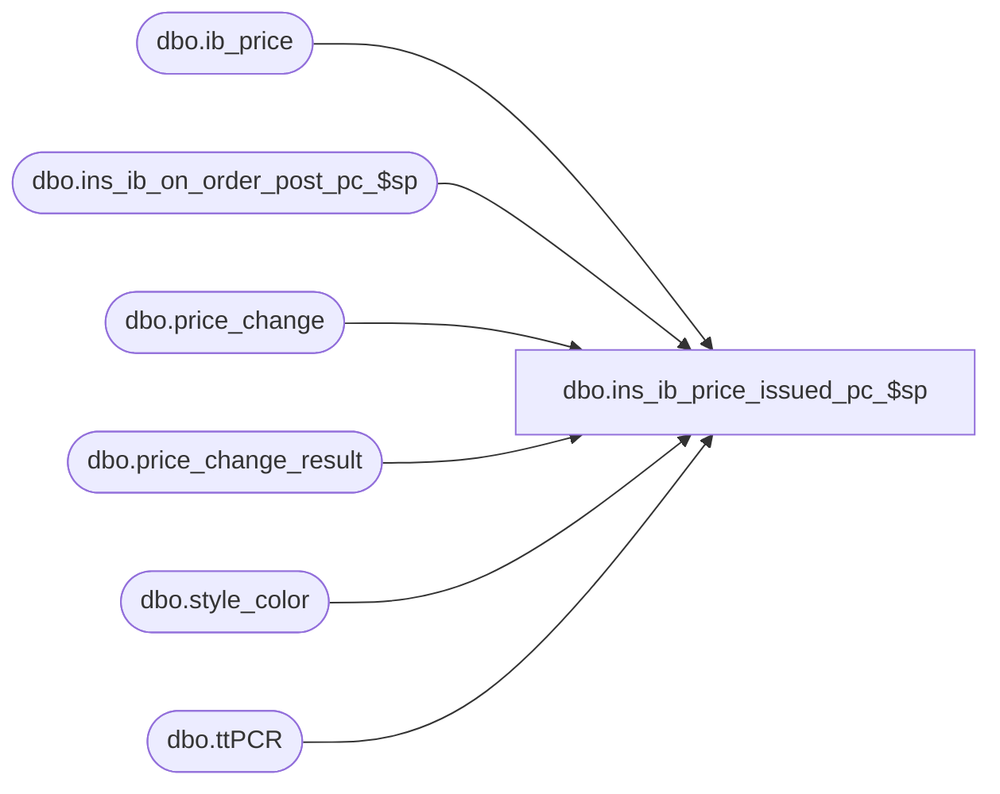

# dbo.ins_ib_price_issued_pc_$sp

**Database:** me_01  
**Server:** bedrockdb02  

## Architecture Diagram



## Table Dependencies

| Referenced Table |
|---|
| dbo.ib_price |
| dbo.ins_ib_on_order_post_pc_$sp |
| dbo.price_change |
| dbo.price_change_result |
| dbo.style_color |
| dbo.ttPCR |

## Stored Procedure Code

```sql
-----------------------------------------------------------------------------------------------------------------------------
--	Main Query: Create Procedure
-----------------------------------------------------------------------------------------------------------------------------

CREATE PROCEDURE dbo.ins_ib_price_issued_pc_$sp

	@Price_Change_ID AS DECIMAL (12, 0)

AS

--	Object GUID: 21585407-4AF9-4D99-AC52-5BCEA83EE0DF
--	Pricing GUID (General): EFB5A343-8978-4ACF-952C-37862704CBC8

SET TRANSACTION ISOLATION LEVEL READ UNCOMMITTED
SET NOCOUNT ON

-----------------------------------------------------------------------------------------------------------------------------
--	Declarations / Sets: Declare And Set Variables
-----------------------------------------------------------------------------------------------------------------------------

DECLARE
	 @Effective_From_Date AS SMALLDATETIME
	,@Effective_To_Date AS SMALLDATETIME
	,@Exception_Level AS TINYINT
	,@Price_Change_Duration AS SMALLINT
	,@Price_Change_No AS NVARCHAR (20)
	,@Price_Change_Type AS SMALLINT
	,@Result_ID AS DECIMAL(12,0)


SELECT
	 @Effective_From_Date = PC.effective_from_date
	,@Effective_To_Date = PC.effective_to_date
	,@Price_Change_Duration = PC.price_change_duration
	,@Price_Change_No = PC.price_change_no
	,@Price_Change_Type = PC.price_change_type
	,@Result_ID = PC.result_id
FROM
	dbo.price_change PC
WHERE
	PC.price_change_id = @Price_Change_ID


-----------------------------------------------------------------------------------------------------------------------------
--	Error Trapping: Check If Temp Table(s) Already Exist(s) And Drop If Applicable
-----------------------------------------------------------------------------------------------------------------------------

IF OBJECT_ID (N'tempdb.dbo.#temp_price_change_rollup', N'U') IS NOT NULL
BEGIN

	DROP TABLE dbo.#temp_price_change_rollup

END


-----------------------------------------------------------------------------------------------------------------------------
--	Temp Table: Roll-up Price Change Data To Appropriate Exception Level
-----------------------------------------------------------------------------------------------------------------------------

SELECT DISTINCT
	 PCD.style_id -- ORDER BY 2/6
	,(CASE
		WHEN PCD.final_exception_level IN (10, 20, 40, 50) THEN PCD.color_id
		ELSE NULL
		END) AS color_id -- ORDER BY 5/6
	,CONVERT (DECIMAL (13, 0), NULL) AS style_color_id
	,(CASE
		WHEN PCD.final_exception_level IN (10, 20, 30) THEN PCD.location_id
		ELSE NULL
		END) AS location_id -- ORDER BY 4/6
	,PCD.jurisdiction_id -- ORDER BY 1/6
	,PCD.valuation_retail_price
	,PCD.selling_retail_price
	,PCD.price_status_id
	,(CASE
		WHEN PCD.final_exception_level IN (10, 40) THEN PCD.sku_id
		ELSE NULL
		END) AS sku_id -- ORDER BY 6/6
	,PCD.final_exception_level -- ORDER BY 3/6
INTO
	dbo.#temp_price_change_rollup
FROM
	dbo.price_change_result PCD
WHERE
	PCD.result_id = @Result_ID


-----------------------------------------------------------------------------------------------------------------------------
--	Table Update: Add "style_color_id" To Applicable Rows
-----------------------------------------------------------------------------------------------------------------------------

UPDATE
	ttPCR
SET
	ttPCR.style_color_id = SC.style_color_id
FROM
	dbo.#temp_price_change_rollup ttPCR
	INNER JOIN dbo.style_color SC ON SC.style_id = ttPCR.style_id
		AND SC.color_id = ttPCR.color_id


-----------------------------------------------------------------------------------------------------------------------------
--	Data Population: Insert Roll-up Data Into "ib_price"
-----------------------------------------------------------------------------------------------------------------------------

SET @Exception_Level = (SELECT TOP (1) ttPCR.final_exception_level FROM dbo.#temp_price_change_rollup ttPCR ORDER BY ttPCR.final_exception_level DESC)


WHILE @Exception_Level IS NOT NULL
BEGIN

	INSERT INTO dbo.ib_price

		(
			 style_id
			,color_id
			,location_id
			,jurisdiction_id
			,pricing_group_id
			,temp_price_flag
			,[start_date]
			,end_date
			,valuation_retail_price
			,selling_retail_price
			,price_status_id
			,document_number
			,cancel_promo_flag
			,effective_date
			,price_change_type
			,insert_guid
			,style_color_id
			,sku_id
		)

	SELECT
		 ttPCR.style_id
		,ttPCR.color_id
		,ttPCR.location_id
		,ttPCR.jurisdiction_id
		,NULL AS pricing_group_id
		,@Price_Change_Duration AS temp_price_flag
		,@Effective_From_Date AS [start_date]
		,@Effective_To_Date AS end_date
		,ttPCR.valuation_retail_price
		,ttPCR.selling_retail_price
		,ttPCR.price_status_id
		,@Price_Change_No AS document_number
		,0 AS cancel_promo_flag
		,NULL AS effective_date
		,@Price_Change_Type AS price_change_type
		,NULL AS insert_guid
		,ttPCR.style_color_id
		,ttPCR.sku_id
	FROM
		dbo.#temp_price_change_rollup ttPCR
		LEFT JOIN

			( -- Attempt Roll-up (AKA: Remove Lower Level Redundancies) Into: 60 -- Style / Jurisdiction (No Pricing Exception)
				SELECT
					 ttPCR.style_id
					,ttPCR.jurisdiction_id
					,ttPCR.valuation_retail_price
					,ttPCR.selling_retail_price
					,ttPCR.price_status_id
				FROM
					dbo.#temp_price_change_rollup ttPCR
				WHERE
					ttPCR.final_exception_level = 60
			) sq60 ON sq60.style_id = ttPCR.style_id
					  AND sq60.jurisdiction_id = ttPCR.jurisdiction_id
					  AND sq60.valuation_retail_price = ttPCR.valuation_retail_price
					  AND sq60.selling_retail_price = ttPCR.selling_retail_price
					  AND sq60.price_status_id = ttPCR.price_status_id
					  AND ttPCR.final_exception_level < 60

		LEFT JOIN

			( -- Attempt Roll-up (AKA: Remove Lower Level Redundancies) Into: 50 -- Style / Color / Jurisdiction Exception
				SELECT
					 ttPCR.style_id
					,ttPCR.color_id
					,ttPCR.jurisdiction_id
					,ttPCR.valuation_retail_price
					,ttPCR.selling_retail_price
					,ttPCR.price_status_id
				FROM
					dbo.#temp_price_change_rollup ttPCR
				WHERE
					ttPCR.final_exception_level = 50
			) sq50 ON sq50.style_id = ttPCR.style_id
					  AND sq50.jurisdiction_id = ttPCR.jurisdiction_id
					  AND sq50.valuation_retail_price = ttPCR.valuation_retail_price
					  AND sq50.selling_retail_price = ttPCR.selling_retail_price
					  AND sq50.price_status_id = ttPCR.price_status_id
					  AND sq50.color_id = ttPCR.color_id
					  AND ttPCR.final_exception_level IN (10, 20, 40)

		LEFT JOIN

			( -- Attempt Roll-up (AKA: Remove Lower Level Redundancies) Into: 50 -- Style / Color / Jurisdiction Exception
				SELECT
					 PCD.style_id
					,PCD.location_id
				FROM
					dbo.price_change_result PCD -- 30 -- Style / Location Exception
					LEFT JOIN #temp_price_change_rollup ttPCR ON ttPCR.style_id = PCD.style_id -- 50 -- Style / Color / Jurisdiction Exception
						AND ttPCR.jurisdiction_id = PCD.jurisdiction_id
						AND ttPCR.valuation_retail_price = PCD.valuation_retail_price
						AND ttPCR.selling_retail_price = PCD.selling_retail_price
						AND ttPCR.price_status_id = PCD.price_status_id
						AND ttPCR.color_id = PCD.color_id
						AND ttPCR.final_exception_level = 50
				WHERE
					PCD.final_exception_level = 30
					AND PCD.result_id = @Result_ID
				GROUP BY
					 PCD.style_id
					,PCD.location_id
				HAVING
					COUNT (*) = COUNT (ttPCR.jurisdiction_id)
			) sq50A ON sq50A.style_id = ttPCR.style_id
					   AND sq50A.location_id = ttPCR.location_id
					   AND ttPCR.final_exception_level = 30

		LEFT JOIN

			( -- Attempt Roll-up (AKA: Remove Lower Level Redundancies) Into: 40 -- Style / Color / SKU / Jurisdiction Exception
				SELECT
					 ttPCR.jurisdiction_id
					,ttPCR.valuation_retail_price
					,ttPCR.selling_retail_price
					,ttPCR.price_status_id
					,ttPCR.sku_id
				FROM
					dbo.#temp_price_change_rollup ttPCR
				WHERE
					ttPCR.final_exception_level = 40
			) sq40 ON sq40.jurisdiction_id = ttPCR.jurisdiction_id
					  AND sq40.valuation_retail_price = ttPCR.valuation_retail_price
					  AND sq40.selling_retail_price = ttPCR.selling_retail_price
					  AND sq40.price_status_id = ttPCR.price_status_id
					  AND sq40.sku_id = ttPCR.sku_id
					  AND ttPCR.final_exception_level = 10

		LEFT JOIN

			( -- Attempt Roll-up (AKA: Remove Lower Level Redundancies) Into: 40 -- Style / Color / SKU / Jurisdiction Exception
				SELECT
					 PCD.style_id
					,PCD.location_id
				FROM
					dbo.price_change_result PCD -- 30 -- Style / Location Exception
					LEFT JOIN #temp_price_change_rollup ttPCR ON ttPCR.jurisdiction_id = PCD.jurisdiction_id -- 40 -- Style / Color / SKU / Jurisdiction Exception
						AND ttPCR.valuation_retail_price = PCD.valuation_retail_price
						AND ttPCR.selling_retail_price = PCD.selling_retail_price
						AND ttPCR.price_status_id = PCD.price_status_id
						AND ttPCR.sku_id = PCD.sku_id
						AND ttPCR.final_exception_level = 40
				WHERE
					PCD.final_exception_level = 30
					AND PCD.result_id = @Result_ID
				GROUP BY
					 PCD.style_id
					,PCD.location_id
				HAVING
					COUNT (*) = COUNT (ttPCR.jurisdiction_id)
			) sq40A ON sq40A.style_id = ttPCR.style_id
					   AND sq40A.location_id = ttPCR.location_id
					   AND ttPCR.final_exception_level = 30

		LEFT JOIN

			( -- Attempt Roll-up (AKA: Remove Lower Level Redundancies) Into: 40 -- Style / Color / SKU / Jurisdiction Exception
				SELECT
					 PCD.style_id
					,PCD.color_id
					,PCD.location_id
				FROM
					dbo.price_change_result PCD -- 20 -- Style / Color / Location Exception
					LEFT JOIN #temp_price_change_rollup ttPCR ON ttPCR.jurisdiction_id = PCD.jurisdiction_id -- 40 -- Style / Color / SKU / Jurisdiction Exception
						AND ttPCR.valuation_retail_price = PCD.valuation_retail_price
						AND ttPCR.selling_retail_price = PCD.selling_retail_price
						AND ttPCR.price_status_id = PCD.price_status_id
						AND ttPCR.sku_id = PCD.sku_id
						AND ttPCR.final_exception_level = 40
				WHERE
					PCD.final_exception_level = 20
					AND PCD.result_id = @Result_ID
				GROUP BY
					 PCD.style_id
					,PCD.color_id
					,PCD.location_id
				HAVING
					COUNT (*) = COUNT (ttPCR.jurisdiction_id)
			) sq40B ON sq40B.style_id = ttPCR.style_id
					   AND sq40B.color_id = ttPCR.color_id
					   AND sq40B.location_id = ttPCR.location_id
					   AND ttPCR.final_exception_level = 20

		LEFT JOIN

			( -- Attempt Roll-up (AKA: Remove Lower Level Redundancies) Into: 30 -- Style / Location Exception
				SELECT
					 ttPCR.style_id
					,ttPCR.location_id
					,ttPCR.valuation_retail_price
					,ttPCR.selling_retail_price
					,ttPCR.price_status_id
				FROM
					dbo.#temp_price_change_rollup ttPCR
				WHERE
					ttPCR.final_exception_level = 30
			) sq30 ON sq30.style_id = ttPCR.style_id
					  AND sq30.valuation_retail_price = ttPCR.valuation_retail_price
					  AND sq30.selling_retail_price = ttPCR.selling_retail_price
					  AND sq30.price_status_id = ttPCR.price_status_id
					  AND sq30.location_id = ttPCR.location_id
					  AND ttPCR.final_exception_level < 30

		LEFT JOIN

			( -- Attempt Roll-up (AKA: Remove Lower Level Redundancies) Into: 20 -- Style / Color / Location Exception
				SELECT
					 ttPCR.style_id
					,ttPCR.color_id
					,ttPCR.location_id
					,ttPCR.valuation_retail_price
					,ttPCR.selling_retail_price
					,ttPCR.price_status_id
				FROM
					dbo.#temp_price_change_rollup ttPCR
				WHERE
					ttPCR.final_exception_level = 20
			) sq20 ON sq20.style_id = ttPCR.style_id
					  AND sq20.valuation_retail_price = ttPCR.valuation_retail_price
					  AND sq20.selling_retail_price = ttPCR.selling_retail_price
					  AND sq20.price_status_id = ttPCR.price_status_id
					  AND sq20.color_id = ttPCR.color_id
					  AND sq20.location_id = ttPCR.location_id
					  AND ttPCR.final_exception_level = 10

	WHERE
		ttPCR.final_exception_level = @Exception_Level
		AND sq60.price_status_id IS NULL
		AND sq50.price_status_id IS NULL
		AND sq50A.style_id IS NULL
		AND sq40.price_status_id IS NULL
		AND sq40A.style_id IS NULL
		AND sq40B.style_id IS NULL
		AND sq30.price_status_id IS NULL
		AND sq20.price_status_id IS NULL


	SET @Exception_Level = (SELECT TOP (1) ttPCR.final_exception_level FROM dbo.#temp_price_change_rollup ttPCR WHERE ttPCR.final_exception_level < @Exception_Level ORDER BY ttPCR.final_exception_level DESC)

END


IF OBJECT_ID (N'tempdb.dbo.#temp_price_change_rollup', N'U') IS NOT NULL
BEGIN

	DROP TABLE dbo.#temp_price_change_rollup

END


-----------------------------------------------------------------------------------------------------------------------------
--	Call Procedure: Execute "ins_ib_on_order_post_pc_$sp" If The Price Change Is A Permanent One
-----------------------------------------------------------------------------------------------------------------------------

IF @Price_Change_Duration = 0 -- Permanent
BEGIN

	EXECUTE dbo.ins_ib_on_order_post_pc_$sp

		 @Effective_From_Date = @Effective_From_Date
		,@Price_Change_ID = @Price_Change_ID
		,@Price_Change_Status = 3 -- Issued

END
```

