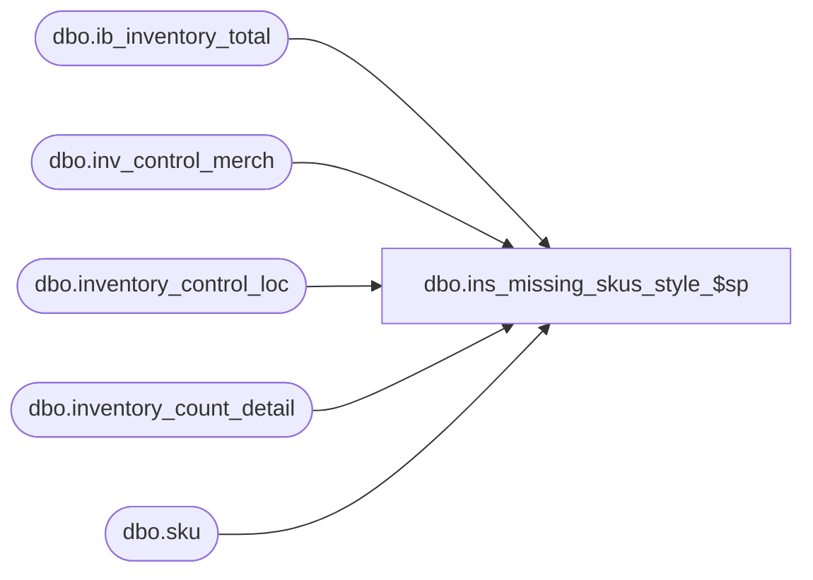

# dbo.ins_missing_skus_style_$sp

**Database:** me_01  
**Server:** bedrockdb02  

## Architecture Diagram



## Table Dependencies

| Referenced Table |
|---|
| dbo.ib_inventory_total |
| dbo.inv_control_merch |
| dbo.inventory_control_loc |
| dbo.inventory_count_detail |
| dbo.sku |

## Stored Procedure Code

```sql
create proc dbo.ins_missing_skus_style_$sp 
(@IcId AS DECIMAL(12,0))
AS

BEGIN

DECLARE sku_loc_cursor CURSOR FOR
	SELECT 
		A.sku_id,
		A.inventory_control_loc_id
	FROM
		( 
			SELECT 
				DISTINCT sku_id, 
				inventory_control_loc_id
			FROM 
				ib_inventory_total,
				inventory_control_loc
			WHERE 
				ib_inventory_total.location_id = inventory_control_loc.location_id
				AND inventory_control_loc.inventory_control_id = @IcId
				AND inventory_control_loc.state_no = 1
		) A, 
		( 
			SELECT
				sku.sku_id
			FROM
				inv_control_merch,
				sku
			WHERE
				inv_control_merch.style_id = sku.style_id
				AND inv_control_merch.inventory_control_id = @IcId
		) B
	WHERE 
		A.sku_id = B.sku_id
		AND NOT EXISTS
			(
				SELECT *
				FROM 
					inventory_count_detail
				WHERE 
					inventory_count_detail.inventory_control_id = @IcId
					AND inventory_count_detail.inventory_control_loc_id = A.inventory_control_loc_id
					AND inventory_count_detail.sku_id = A.sku_id
			)
	ORDER BY 
		A.inventory_control_loc_id, 
		A.sku_id
		
OPEN sku_loc_cursor

DECLARE @SkuId AS DECIMAL(13,0)
DECLARE @IclId AS DECIMAL(13,0)

FETCH NEXT FROM sku_loc_cursor INTO @SkuId, @IclId

DECLARE @PrevIclId AS DECIMAL(13,0)
DECLARE @MaxIcdId AS DECIMAL(13,0)

SELECT @PrevIclId = 0
SELECT @MaxIcdId = 0

WHILE @@FETCH_STATUS = 0
	BEGIN

		IF @PrevIclId <> @IclId
			BEGIN
				UPDATE
					inventory_control_loc
				SET
					last_item_id = @MaxIcdId - (@PrevIclId * 1000000)
				WHERE
					inventory_control_loc_id = @PrevIclId
					
				SELECT 
					@MaxIcdId = ISNULL(MAX(inventory_count_detail_id), @IclId * 1000000)
				FROM
					inventory_count_detail
				WHERE
					inventory_control_loc_id = @IclId
					AND inventory_control_id = @IcId
			END
		
		SELECT @MaxIcdId = @MaxIcdId + 1
		
		INSERT INTO
			inventory_count_detail (inventory_count_detail_id, inventory_control_loc_id, inventory_control_id, sku_id, units_counted)
		VALUES
			(@MaxIcdId, @IclId, @IcId, @SkuId, 0)
			
		SELECT @PrevIclId = @IclId
		
		FETCH NEXT FROM sku_loc_cursor INTO @SkuId, @IclId
			
	END

CLOSE sku_loc_cursor
DEALLOCATE sku_loc_cursor

END
```

