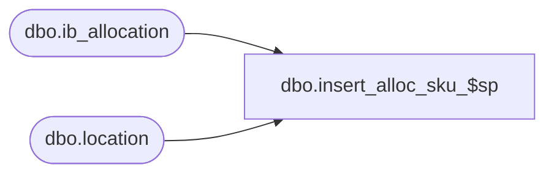

# dbo.insert_alloc_sku_$sp

**Database:** me_01  
**Server:** bedrockdb02  

## Architecture Diagram



## Table Dependencies

| Referenced Table |
|---|
| dbo.ib_allocation |
| dbo.location |

## Stored Procedure Code

```sql
create proc [dbo].[insert_alloc_sku_$sp] (@skuId decimal(12,0),
@locationId decimal(12,0),
@transactionDate DATETIME,
@expectedReceiptDate DATETIME,
@transactionTypeCode decimal(12,0),
@allocatedUnits decimal(12,0),
@purchaseOrderNumber nvarchar(20),
@allocationNumber nvarchar(20))
AS

IF RTRIM(LTRIM(@allocationNumber)) = N''
BEGIN
   SELECT @allocationNumber = NULL
END

IF (@allocationNumber IS NOT NULL)
BEGIN

	insert into ib_allocation (sku_id, location_id, transaction_date, expected_receipt_date, transaction_type_code, allocated_units, purchase_order_number, allocation_number) values (@skuId,@locationId,@transactionDate,@expectedReceiptDate,@transactionTypeCode,@allocatedUnits,@purchaseOrderNumber,@allocationNumber)
	RETURN

END


IF EXISTS (SELECT 1 FROM location WHERE location_id = @locationId AND location_type NOT IN (3, 4))
BEGIN

	insert into ib_allocation (sku_id, location_id, transaction_date, expected_receipt_date, transaction_type_code, allocated_units, purchase_order_number, allocation_number) values (@skuId,@locationId,@transactionDate,@expectedReceiptDate,@transactionTypeCode,@allocatedUnits,@purchaseOrderNumber,@allocationNumber)

END
```

