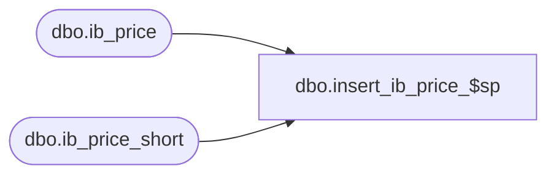

# dbo.insert_ib_price_$sp

**Database:** me_01  
**Server:** bedrockdb02  

## Architecture Diagram



## Table Dependencies

| Referenced Table |
|---|
| dbo.ib_price |
| dbo.ib_price_short |

## Stored Procedure Code

```sql
CREATE PROCEDURE [dbo].[insert_ib_price_$sp]
AS
/*
	Version		: 1.00
	Created		: July 2012
	Created by	: Sameer Patel
	Description	: Procedure called by IB and pcm_issue_pc_$sp
					  Inserts records into ib_price and ib_price_short ensureing that that ids in both tables match
				  
	Call from C++ code:
		-- File: STSIBRetailPrice.cpp
		-- Class: CSTSIBRetailPrice
		-- Function: DoUpdatePrice, DoCancelPromotion
		
	Call from stored procedure:
		-- Procedure: pcm_issue_pc_$sp
		-- Process: Segment 34000: PM Import to PM
			-- One of the following segment parameters have to be true:
				-- Issue Imported PCs
				-- Issue and Make Effective
*/
BEGIN
	
	IF object_id(N'tempdb..#ib_price_short') IS NULL
	CREATE TABLE #ib_price_short
		( ib_price_id DECIMAL(12) NOT NULL
		, style_id DECIMAL(12) NOT NULL, color_id SMALLINT
		, location_id SMALLINT, jurisdiction_id SMALLINT NOT NULL, pricing_group_id SMALLINT
		, temp_price_flag BIT NOT NULL
		, start_date SMALLDATETIME NOT NULL, end_date SMALLDATETIME
		, valuation_retail_price DECIMAL(14,2) NOT NULL, selling_retail_price DECIMAL(14,2) NOT NULL, price_status_id SMALLINT NOT NULL
		, document_number NVARCHAR(20)
		, cancel_promo_flag BIT NOT NULL DEFAULT(0)
		, effective_date SMALLDATETIME, price_change_type SMALLINT
		, PRIMARY KEY (ib_price_id) )
	
	DECLARE @error_msg NVARCHAR(2000), @batch_size INT
		
	SET @batch_size = 20000
		
	BEGIN TRY
	
		DECLARE @min_batch_id INT, @max_batch_id INT, @max_id INT
		SET @min_batch_id = 0
		SET @max_batch_id = 0
		SELECT @max_id = COALESCE(MAX(id), 0) FROM #ib_price
		
		-- INSERT BATCHES OF 20000
		WHILE (@max_batch_id <> @max_id)
		BEGIN
		
			IF (@min_batch_id + @batch_size >= @max_id)
				SET @max_batch_id = @max_id
			ELSE
				SET @max_batch_id = @min_batch_id + @batch_size
				
			DECLARE @v_insert_guid UNIQUEIDENTIFIER
			SET @v_insert_guid = NEWID()
				
			INSERT INTO ib_price
				( style_id, color_id, location_id, jurisdiction_id, pricing_group_id, sku_id, style_color_id
				, temp_price_flag
				, start_date, end_date
				, valuation_retail_price, selling_retail_price, price_status_id
				, document_number, cancel_promo_flag, effective_date, price_change_type
				, insert_guid )
			SELECT
				style_id, color_id, location_id, jurisdiction_id, pricing_group_id, sku_id, style_color_id
				, temp_price_flag
				, start_date, end_date
				, valuation_retail_price, selling_retail_price, price_status_id
				, document_number, cancel_promo_flag, effective_date, price_change_type
				, @v_insert_guid
			FROM 
				#ib_price
			WHERE 
				id > @min_batch_id AND id <= @max_batch_id

			INSERT INTO #ib_price_short
				( ib_price_id
				, style_id, color_id, location_id, jurisdiction_id, pricing_group_id
				, temp_price_flag
				, start_date, end_date
				, valuation_retail_price, selling_retail_price, price_status_id
				, document_number, cancel_promo_flag, effective_date, price_change_type )
			SELECT
				ib_price_id
				, Source.style_id, Source.color_id, Source.location_id, Source.jurisdiction_id, Source.pricing_group_id
				, Source.temp_price_flag
				, Source.start_date, Source.end_date
				, Source.valuation_retail_price, Source.selling_retail_price, Source.price_status_id
				, Source.document_number, Source.cancel_promo_flag, Source.effective_date, Source.price_change_type
			FROM 
				ib_price Dest WITH (NOLOCK)
			INNER JOIN #ib_price Source	ON Dest.style_id = Source.style_id AND COALESCE(Dest.color_id, -1) = COALESCE(Source.color_id, -1)
												AND COALESCE(Dest.pricing_group_id, -1) = COALESCE(Source.pricing_group_id, -1)
												AND COALESCE(Dest.location_id, -1) = COALESCE(Source.location_id, -1)
												AND Dest.start_date = Source.start_date
			WHERE 
				insert_guid = @v_insert_guid AND Dest.sku_id IS NULL
				
			SET IDENTITY_INSERT ib_price_short ON
				
			INSERT INTO ib_price_short
				( ib_price_id
				, style_id, color_id, location_id, jurisdiction_id, pricing_group_id
				, temp_price_flag
				, start_date, end_date
				, valuation_retail_price, selling_retail_price, price_status_id
				, document_number, cancel_promo_flag, effective_date, price_change_type )
			SELECT
				ib_price_id
				, style_id, color_id, location_id, jurisdiction_id, pricing_group_id
				, temp_price_flag
				, start_date, end_date
				, valuation_retail_price, selling_retail_price, price_status_id
				, document_number, cancel_promo_flag, effective_date, price_change_type
			FROM 
				#ib_price_short
			WHERE 
				NOT (location_id IS NOT NULL AND pricing_group_id IS NOT NULL)
		
			SET @min_batch_id = @max_batch_id
			
			SET IDENTITY_INSERT ib_price_short OFF
			
			TRUNCATE TABLE #ib_price_short
		
		END
		
		TRUNCATE TABLE #ib_price
	
	END TRY
	
	BEGIN CATCH
	
		SET @error_msg = N'Error in procedure insert_ib_price_$sp: ' 
									+ CAST(ERROR_NUMBER() AS NVARCHAR) + N' ' + ERROR_MESSAGE()
									
		RAISERROR (@error_msg, 16, 1)
	
	END CATCH

END
```

