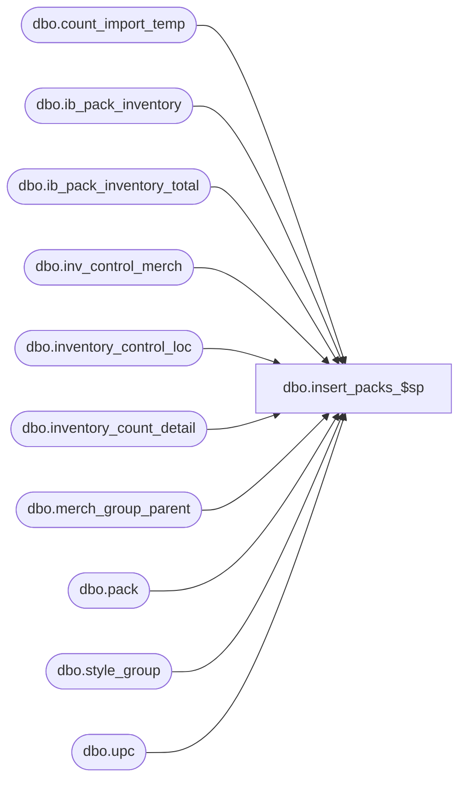

# dbo.insert_packs_$sp

**Database:** me_01  
**Server:** bedrockdb02  

## Architecture Diagram



## Table Dependencies

| Referenced Table |
|---|
| dbo.count_import_temp |
| dbo.ib_pack_inventory |
| dbo.ib_pack_inventory_total |
| dbo.inv_control_merch |
| dbo.inventory_control_loc |
| dbo.inventory_count_detail |
| dbo.merch_group_parent |
| dbo.pack |
| dbo.style_group |
| dbo.upc |

## Stored Procedure Code

```sql
CREATE proc [dbo].[insert_packs_$sp] 
(
	@DocId AS DECIMAL(12,0), 
	@IclId AS DECIMAL(13,0), 
	@LocId AS SMALLINT, 
	@DocDate AS SMALLDATETIME, 
	@LastItemId AS DECIMAL, 
	@HierarchyLevelId AS DECIMAL, 
	@ParentLevelId AS DECIMAL,
	@ReplaceOrInc AS SMALLINT
)

/* 
Proc name: insert_packs_$sp 
Description: Procedure called by pi_process_loc_$sp for a physical inventory document of type actual shrink and for packs
	Steps:
		1.  	Retrieve packs that have been counted as well as skus that have not been counted but exist in ib_inventory.
			Also retrieve there corresponding units counted and on hand book units
		2.  	Determine skus that satisfy criteria on the document and insert them into the inventory_count_detail table if 
		    	they do not already exist in the table.  Insert these details with counts of zero for now.
		3.	Update the units_counted column

HISTORY: 
Date       	Name         	Def#	Desc
Sept01,04   	Sameer Patel   	21616	Part of performance improvements for physical inventory
*/

AS

BEGIN

/*--------------------------------------------------------------------------------------------------------------*/
/*--------------------------------------------------------------------------------------------------------------*/
-- Declartions of various temporary tables

	CREATE TABLE [#pack_loc] (
		[pack_id] decimal(13, 0) NOT NULL ,
		[pack_loc_id] decimal (13,0) identity)

	
	CREATE TABLE [#PI_PACK_OH_TEMP] (
		[pack_id] decimal(13, 0) NOT NULL ,
		[oh_units] decimal (10,0) NOT NULL ,
		[units_counted] decimal (10,0) NOT NULL)

	CREATE  NONCLUSTERED  INDEX [#PI_PACK_OH_TEMP_$ndx1] ON [dbo].[#PI_PACK_OH_TEMP]([pack_id])

/*--------------------------------------------------------------------------------------------------------------*/
/*--------------------------------------------------------------------------------------------------------------*/
-- Insert skus that satisfy criteria from the inv_control_merch table into the inventory_count_detail table
-- that have inventory in ib_pack_inventory

	IF @ReplaceOrInc = 0 

		BEGIN

			INSERT INTO 
				#PI_PACK_OH_TEMP
			SELECT
				pack_id,
				SUM(oh_units) oh_units,
				SUM(units_counted) units_counted
			FROM
				(
					SELECT
						pack_id,
						SUM(total_on_hand_units) oh_units,
						0 units_counted
					FROM
						ib_pack_inventory_total
					WHERE
						location_id = @LocId
					GROUP BY
						pack_id
					UNION ALL
					SELECT
						pack_id,
						-SUM(transaction_units) oh_units,
						0 units_counted
					FROM
						ib_pack_inventory
					WHERE
						location_id = @LocId
						AND transaction_date > CONVERT (DATETIME, @DocDate, 101)
					GROUP BY
						pack_id
					UNION ALL
					SELECT
						pack_id,
						0 oh_units,
						inventory_count_detail.units_counted
					FROM
						inventory_count_detail
					WHERE
						inventory_control_loc_id = @IclId
						AND inventory_control_id = @DocId
						AND pack_id IS NOT NULL
				) Z
			GROUP BY
				pack_id

		END

	ELSE
		
		BEGIN

			INSERT INTO 
				#PI_PACK_OH_TEMP
			SELECT
				pack_id,
				SUM(oh_units) oh_units,
				SUM(units_counted) units_counted
			FROM
				(
					SELECT
						pack_id,
						SUM(total_on_hand_units) oh_units,
						0 units_counted
					FROM
						ib_pack_inventory_total
					WHERE
						location_id = @LocId
					GROUP BY
						pack_id
					UNION ALL
					SELECT
						pack_id,
						-SUM(transaction_units) oh_units,
						0 units_counted
					FROM
						ib_pack_inventory
					WHERE
						location_id = @LocId
						AND transaction_date > CONVERT (DATETIME, @DocDate, 101)
					GROUP BY
						pack_id
					UNION ALL
					SELECT
						pack.pack_id,
						0 oh_units,
						count_import_temp.units_counted
					FROM
						count_import_temp,
						upc,
						pack
					WHERE
						count_import_temp.upc_number = upc.upc_number
						AND count_import_temp.location_id = @LocId
						AND upc.pack_id IS NOT NULL
						AND upc.pack_id = pack.pack_id
				) Z
			GROUP BY
				pack_id

		END			
	
	If (ISNULL(@HierarchyLevelId, 0) <> 0 AND ISNULL(@ParentLevelId, 0) = 0) -- Chain-level count
		
		BEGIN

			INSERT INTO 
				#pack_loc
			SELECT 
				pack.pack_id
			FROM
				#PI_PACK_OH_TEMP,
				pack
			WHERE
				#PI_PACK_OH_TEMP.pack_id = pack.pack_id
				AND NOT EXISTS
			 		(
						SELECT 1
						FROM
							inventory_count_detail WITH (NOLOCK)
						WHERE
							inventory_count_detail.inventory_control_id = @DocId
							AND inventory_count_detail.inventory_control_loc_id = @IclId
							AND inventory_count_detail.pack_id = #PI_PACK_OH_TEMP.pack_id
					)
		
		END

	ELSE IF (ISNULL(@HierarchyLevelId, 0) <> 0 AND ISNULL(@ParentLevelId, 0) <> 0) -- Non chain-level count
		
		BEGIN

			INSERT INTO 
				#pack_loc
			SELECT
				pack.pack_id
			FROM
				#PI_PACK_OH_TEMP,
				inv_control_merch,
				merch_group_parent,
				style_group,
				pack
			WHERE
				#PI_PACK_OH_TEMP.pack_id = pack.pack_id
				AND inv_control_merch.hierarchy_group_id = merch_group_parent.parent_hierarchy_group_id	
				AND inv_control_merch.inventory_control_id = @DocId
				AND merch_group_parent.hierarchy_group_id = style_group.hierarchy_group_id
				AND style_group.style_id = pack.style_id
				AND NOT EXISTS
			 		(
						SELECT 1
						FROM
							inventory_count_detail WITH (NOLOCK)
						WHERE
							inventory_count_detail.inventory_control_id = @DocId
							AND inventory_count_detail.inventory_control_loc_id = @IclId
							AND inventory_count_detail.pack_id = #PI_PACK_OH_TEMP.pack_id
					)

		END

	ELSE IF (ISNULL(@HierarchyLevelId, 0) = 0 AND ISNULL(@ParentLevelId, 0) = 0) -- Non chain-level count
		
		BEGIN

			INSERT INTO 
				#pack_loc
			SELECT
				pack.pack_id
			FROM
				#PI_PACK_OH_TEMP,
				inv_control_merch,
				pack
			WHERE
				#PI_PACK_OH_TEMP.pack_id = pack.pack_id
				AND inv_control_merch.style_id = pack.style_id
				AND inv_control_merch.inventory_control_id = @DocId
				AND NOT EXISTS
			 		(
						SELECT 1
						FROM
							inventory_count_detail WITH (NOLOCK)
						WHERE
							inventory_count_detail.inventory_control_id = @DocId
							AND inventory_count_detail.inventory_control_loc_id = @IclId
							AND inventory_count_detail.pack_id = #PI_PACK_OH_TEMP.pack_id
					)

		END

	INSERT INTO
		inventory_count_detail (inventory_count_detail_id, inventory_control_loc_id, inventory_control_id, pack_id, units_counted)
	SELECT
		(@IclId * 1000000) + @LastItemId + pack_loc_id,
		@IclId,
		@DocId,
		pack_id,
		0 units_counted
	FROM
		#pack_loc

	-- Update last_item_id in inventory_control_loc_table

	UPDATE
		inventory_control_loc
	SET
		last_item_id = (SELECT ISNULL(@LastItemId + MAX(#pack_loc.pack_loc_id), @LastItemId) FROM #pack_loc)
	WHERE
		inventory_control_loc_id = @IclId
		AND inventory_control_id = @DocId

/*--------------------------------------------------------------------------------------------------------------*/
/*--------------------------------------------------------------------------------------------------------------*/
-- Retrieve on hand book values for packs

	IF @ReplaceOrInc = 0

		BEGIN

			UPDATE
				inventory_count_detail
			SET 
				inventory_count_detail.book_pack_units = #PI_PACK_OH_TEMP.oh_units
			FROM
				inventory_count_detail WITH (NOLOCK),
				#PI_PACK_OH_TEMP
			WHERE 
				inventory_count_detail.pack_id = #PI_PACK_OH_TEMP.pack_id
				AND inventory_count_detail.inventory_control_loc_id = @IclId
				AND inventory_count_detail.inventory_control_id = @DocId	

		END

	ELSE IF @ReplaceOrInc = 1 -- replace count

		BEGIN

			UPDATE
				inventory_count_detail
			SET 
				inventory_count_detail.book_pack_units = #PI_PACK_OH_TEMP.oh_units,
				inventory_count_detail.units_counted = #PI_PACK_OH_TEMP.units_counted
			FROM
				inventory_count_detail WITH (NOLOCK),
				#PI_PACK_OH_TEMP
			WHERE 
				inventory_count_detail.pack_id = #PI_PACK_OH_TEMP.pack_id
				AND inventory_count_detail.inventory_control_loc_id = @IclId
				AND inventory_count_detail.inventory_control_id = @DocId	

		END

	ELSE IF @ReplaceOrInc = 2 -- replace count

		BEGIN

			UPDATE
				inventory_count_detail
			SET 
				inventory_count_detail.book_pack_units = #PI_PACK_OH_TEMP.oh_units,
				inventory_count_detail.units_counted = inventory_count_detail.units_counted + #PI_PACK_OH_TEMP.units_counted
			FROM
				inventory_count_detail WITH (NOLOCK),
				#PI_PACK_OH_TEMP
			WHERE 
				inventory_count_detail.pack_id = #PI_PACK_OH_TEMP.pack_id
				AND inventory_count_detail.inventory_control_loc_id = @IclId
				AND inventory_count_detail.inventory_control_id = @DocId	

		END

/*--------------------------------------------------------------------------------------------------------------*/
/*--------------------------------------------------------------------------------------------------------------*/

	DROP TABLE #PI_PACK_OH_TEMP
	DROP TABLE #pack_loc

/*--------------------------------------------------------------------------------------------------------------*/
/*--------------------------------------------------------------------------------------------------------------*/

END
```

