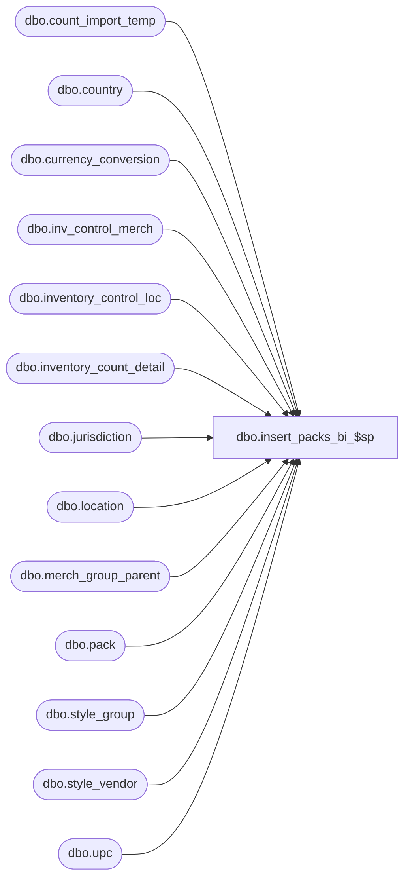

# dbo.insert_packs_bi_$sp

**Database:** me_01  
**Server:** bedrockdb02  

## Architecture Diagram



## Table Dependencies

| Referenced Table |
|---|
| dbo.count_import_temp |
| dbo.country |
| dbo.currency_conversion |
| dbo.inv_control_merch |
| dbo.inventory_control_loc |
| dbo.inventory_count_detail |
| dbo.jurisdiction |
| dbo.location |
| dbo.merch_group_parent |
| dbo.pack |
| dbo.style_group |
| dbo.style_vendor |
| dbo.upc |

## Stored Procedure Code

```sql
CREATE proc [dbo].[insert_packs_bi_$sp] 
(
	@DocId AS DECIMAL(12,0), 
	@IclId AS DECIMAL(13,0), 
	@LocId AS SMALLINT, 
	@DocDate AS SMALLDATETIME, 
	@LastItemId AS DECIMAL, 
	@HierarchyLevelId AS DECIMAL, 
	@ParentLevelId AS DECIMAL,
	@ReplaceOrInc AS SMALLINT
)

/* 
Proc name: insert_packs_bi_$sp 
Description: Procedure called by pi_process_loc_$sp for a physical inventory document of type actual shrink anf for packs
	Steps:
		1.  	Retrieve packs that have been counted as well as skus that have not been counted but exist in ib_inventory.
		2.  	Determine skus that satisfy criteria on the document and insert them into the inventory_count_detail table if 
		    	they do not already exist in the table.  Insert these details with counts of zero for now.
		3.	Update the units_counted column
Feb. 2, 2010		Feng			Multi-currency mod. 	add/set cost_local, total_cost_local

*/

AS

BEGIN

/*--------------------------------------------------------------------------------------------------------------*/
/*--------------------------------------------------------------------------------------------------------------*/
-- Declartions of various temporary tables
CREATE TABLE [#pack_loc] (
		[pack_id] decimal(13, 0) NOT NULL ,
		[pack_loc_id] decimal (13,0) identity)

/*--------------------------------------------------------------------------------------------------------------*/
/*--------------------------------------------------------------------------------------------------------------*/
-- Get packs that were imported through a file
-- If counted from the GUI, packs have already been inserted into the inventory_count_detail table

	SELECT
		pack.pack_id,
		count_import_temp.units_counted,
		count_import_temp.cost,
		count_import_temp.cost_local
	INTO #PI_PACK_OH_TEMP
	FROM
		count_import_temp,
		upc,
		pack
	WHERE
		count_import_temp.upc_number = upc.upc_number
		AND count_import_temp.location_id = @LocId
		AND upc.pack_id IS NOT NULL
		AND upc.pack_id = pack.pack_id
	
	If (@HierarchyLevelId <> 0 AND @ParentLevelId = 0) -- Chain-level count
		
		BEGIN

			INSERT INTO 
				#pack_loc
			SELECT 
				pack.pack_id
			FROM
				#PI_PACK_OH_TEMP,
				pack
			WHERE
				#PI_PACK_OH_TEMP.pack_id = pack.pack_id
				AND NOT EXISTS
			 		(
						SELECT 1
						FROM
							inventory_count_detail WITH (NOLOCK)
						WHERE
							inventory_count_detail.inventory_control_id = @DocId
							AND inventory_count_detail.inventory_control_loc_id = @IclId
							AND inventory_count_detail.pack_id = #PI_PACK_OH_TEMP.pack_id
					)
		
		END

	ELSE IF (@HierarchyLevelId <> 0 AND @ParentLevelId <> 0) -- Non chain-level count
		
		BEGIN

			INSERT INTO 
				#pack_loc
			SELECT
				pack.pack_id
			FROM
				#PI_PACK_OH_TEMP,
				inv_control_merch,
				merch_group_parent,
				style_group,
				pack
			WHERE
				#PI_PACK_OH_TEMP.pack_id = pack.pack_id
				AND inv_control_merch.hierarchy_group_id = merch_group_parent.parent_hierarchy_group_id	
				AND inv_control_merch.inventory_control_id = @DocId
				AND merch_group_parent.hierarchy_group_id = style_group.hierarchy_group_id
				AND style_group.style_id = pack.style_id
				AND NOT EXISTS
			 		(
						SELECT 1
						FROM
							inventory_count_detail WITH (NOLOCK)
						WHERE
							inventory_count_detail.inventory_control_id = @DocId
							AND inventory_count_detail.inventory_control_loc_id = @IclId
							AND inventory_count_detail.pack_id = #PI_PACK_OH_TEMP.pack_id
					)

		END

	ELSE IF (@HierarchyLevelId = 0 AND @ParentLevelId = 0) -- Non chain-level count
		
		BEGIN

			INSERT INTO 
				#pack_loc
			SELECT
				pack.pack_id
			FROM
				#PI_PACK_OH_TEMP,
				inv_control_merch,
				pack
			WHERE
				#PI_PACK_OH_TEMP.pack_id = pack.pack_id
				AND inv_control_merch.style_id = pack.style_id
				AND inv_control_merch.inventory_control_id = @DocId
				AND NOT EXISTS
			 		(
						SELECT 1
						FROM
							inventory_count_detail WITH (NOLOCK)
						WHERE
							inventory_count_detail.inventory_control_id = @DocId
							AND inventory_count_detail.inventory_control_loc_id = @IclId
							AND inventory_count_detail.pack_id = #PI_PACK_OH_TEMP.pack_id
					)

		END

	INSERT INTO
		inventory_count_detail (inventory_count_detail_id, inventory_control_loc_id, inventory_control_id, pack_id, units_counted)
	SELECT
		(@IclId * 1000000) + @LastItemId + pack_loc_id,
		@IclId,
		@DocId,
		pack_id,
		0 units_counted
	FROM
		#pack_loc

	-- Update last_item_id in inventory_control_loc_table

	UPDATE
		inventory_control_loc
	SET
		last_item_id = (SELECT ISNULL(@LastItemId + MAX(#pack_loc.pack_loc_id), @LastItemId) FROM #pack_loc)
	WHERE
		inventory_control_loc_id = @IclId
		AND inventory_control_id = @DocId

/*--------------------------------------------------------------------------------------------------------------*/
/*--------------------------------------------------------------------------------------------------------------*/
-- Retrieve on hand book values for packs

	IF @ReplaceOrInc = 1 -- replace count

		BEGIN

			UPDATE
				inventory_count_detail
			SET 
				inventory_count_detail.units_counted = #PI_PACK_OH_TEMP.units_counted,
				inventory_count_detail.cost = #PI_PACK_OH_TEMP.cost,
				inventory_count_detail.cost_local = #PI_PACK_OH_TEMP.cost_local
			FROM
				inventory_count_detail WITH (NOLOCK),
				#PI_PACK_OH_TEMP
			WHERE 
				inventory_count_detail.pack_id = #PI_PACK_OH_TEMP.pack_id
				AND inventory_count_detail.inventory_control_loc_id = @IclId
				AND inventory_count_detail.inventory_control_id = @DocId	

		END

	ELSE IF @ReplaceOrInc = 2 -- replace count

		BEGIN

			UPDATE
				inventory_count_detail
			SET 
				inventory_count_detail.units_counted = inventory_count_detail.units_counted + #PI_PACK_OH_TEMP.units_counted,
				inventory_count_detail.cost = #PI_PACK_OH_TEMP.cost,
				inventory_count_detail.cost_local = #PI_PACK_OH_TEMP.cost_local
			FROM
				inventory_count_detail WITH (NOLOCK),
				#PI_PACK_OH_TEMP
			WHERE 
				inventory_count_detail.pack_id = #PI_PACK_OH_TEMP.pack_id
				AND inventory_count_detail.inventory_control_loc_id = @IclId
				AND inventory_count_detail.inventory_control_id = @DocId	

		END

/*--------------------------------------------------------------------------------------------------------------*/
/*--------------------------------------------------------------------------------------------------------------*/
-- For those styles that don't have a cost, use the current_cost of the primary vendor from the style_vendor table
-- Update the cost field, so that we can use it later when inserting skus for the pack
		
	UPDATE
		inventory_count_detail
	SET
		inventory_count_detail.cost = style_vendor.current_cost * exchange_rate
	FROM
		inventory_count_detail WITH (NOLOCK),
		style_vendor WITH (NOLOCK),
		pack WITH (NOLOCK),
		currency_conversion WITH (NOLOCK)
	WHERE
		inventory_count_detail.pack_id = pack.pack_id
		AND pack.style_id = style_vendor.style_id
		AND style_vendor.primary_vendor_flag = 1
		AND inventory_count_detail.inventory_control_loc_id = @IclId
		AND inventory_count_detail.inventory_control_id = @DocId	
		AND inventory_count_detail.cost IS NULL
		AND effective_from_date <= @DocDate
		AND (effective_to_date >= @DocDate OR effective_to_date IS NULL)
		AND currency_conversion_type = 1
		AND to_currency_id = style_vendor.currency_id
		AND from_currency_id = (
				SELECT 	currency_id to_currency_id 
				FROM 	country, jurisdiction 
				WHERE 	country.country_id= jurisdiction.country_id 
				AND 	jurisdiction.home_jurisdiction_flag = 1
					)

/*-------Multi Currency mod ------------------------------------------------------------------------------------*/
-- Determine exchange rate
	DECLARE @ExchangeRate1 AS FLOAT
	
	SELECT
		@ExchangeRate1 = exchange_rate
	FROM
		currency_conversion
	WHERE
		to_currency_id = 
			(
				SELECT
					currency_id from_currency_id
				FROM
					country,
					jurisdiction,
					location
				WHERE
					location.jurisdiction_id = jurisdiction.jurisdiction_id
					AND country.country_id= jurisdiction.country_id
					AND location.location_id = @LocId
			)
		AND from_currency_id = 
			(
				SELECT
					currency_id to_currency_id
				FROM
					country,
					jurisdiction
				WHERE
					country.country_id= jurisdiction.country_id
					AND jurisdiction.home_jurisdiction_flag = 1
			)
		AND effective_from_date <= @DocDate
		AND (effective_to_date >= @DocDate OR effective_to_date IS NULL)
		AND currency_conversion_type = 1

-- For those styles that don't have a cost, use the current_cost of the primary vendor from the style_vendor table
-- Update the cost field, so that we can use it later when inserting skus for the pack
		
	UPDATE
		inventory_count_detail
	SET
		inventory_count_detail.cost_local = style_vendor.current_cost * exchange_rate / @ExchangeRate1
	FROM
		inventory_count_detail WITH (NOLOCK),
		style_vendor WITH (NOLOCK),
		pack WITH (NOLOCK),
		currency_conversion WITH (NOLOCK)
	WHERE
		inventory_count_detail.pack_id = pack.pack_id
		AND pack.style_id = style_vendor.style_id
		AND style_vendor.primary_vendor_flag = 1
		AND inventory_count_detail.inventory_control_loc_id = @IclId
		AND inventory_count_detail.inventory_control_id = @DocId	
		AND inventory_count_detail.cost_local IS NULL
		AND effective_from_date <= @DocDate
		AND (effective_to_date >= @DocDate OR effective_to_date IS NULL)
		AND currency_conversion_type = 1
		AND to_currency_id = style_vendor.currency_id
		AND from_currency_id = (
				SELECT 	currency_id to_currency_id 
				FROM 	country, jurisdiction 
				WHERE 	country.country_id= jurisdiction.country_id 
				AND 	jurisdiction.home_jurisdiction_flag = 1
					)

/*--------------------------------------------------------------------------------------------------------------*/
/*--------------------------------------------------------------------------------------------------------------*/
	DROP TABLE #PI_PACK_OH_TEMP
	DROP TABLE #pack_loc

/*--------------------------------------------------------------------------------------------------------------*/
/*--------------------------------------------------------------------------------------------------------------*/

END
```

