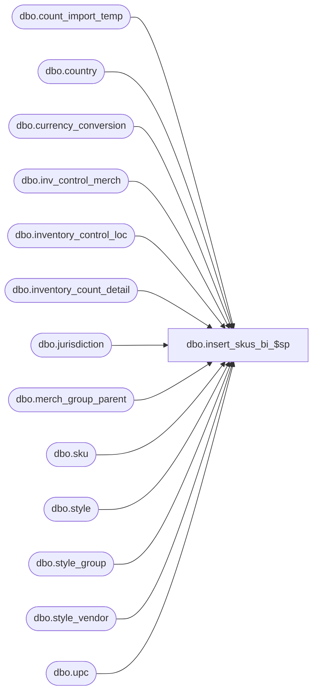

# dbo.insert_skus_bi_$sp

**Database:** me_01  
**Server:** bedrockdb02  

## Architecture Diagram



## Table Dependencies

| Referenced Table |
|---|
| dbo.count_import_temp |
| dbo.country |
| dbo.currency_conversion |
| dbo.inv_control_merch |
| dbo.inventory_control_loc |
| dbo.inventory_count_detail |
| dbo.jurisdiction |
| dbo.merch_group_parent |
| dbo.sku |
| dbo.style |
| dbo.style_group |
| dbo.style_vendor |
| dbo.upc |

## Stored Procedure Code

```sql
create proc [dbo].[insert_skus_bi_$sp] 
(
	@DocId AS DECIMAL(12,0), 
	@IclId AS DECIMAL(13,0), 
	@LocId AS SMALLINT, 
	@DocDate AS SMALLDATETIME, 
	@LastItemId AS DECIMAL, 
	@HierarchyLevelId AS DECIMAL, 
	@ParentLevelId AS DECIMAL,
	@ReplaceOrInc AS SMALLINT
)
AS

/*
Proc name: insert_skus_bi_$sp 
Description: Procedure called by pi_process_loc_$sp for a physical inventory document of type beginning inventory
	Steps:
		1.  	Retrieve skus that have been counted.
		2.  	Determine skus that satisfy criteria on the document and insert them into the inventory_count_detail table if 
		    	they do not already exist in the table.  Insert these details with counts of zero for now.
		3.	Update the units_counted, extended_units_counted and cost column
		4.	Provide a valid average cost based on the cost that was provided by the user or 
			by determining the current cost of the primary vendor for the style if the cost was not provided.

HISTORY:
Date       		Name         		Def#			Desc
Feb. 2, 2010		Feng			Multi-currency mod. 	add cost_local, average_cost_local fields, 

*/

BEGIN
	/*--------------------------------------------------------------------------------------------------------------
	 Multi Currency mod, get exchange rate based on the location id
	*/
	DECLARE @ExchangeRate AS FLOAT
	-- Determine exchange rate
	EXEC sp_executesql
		N'SELECT
			@ParamExchangeRate = exchange_rate
		  FROM
			currency_conversion
		  WHERE
			to_currency_id =
				( SELECT
					currency_id from_currency_id
				  FROM
					country
					, jurisdiction
					, location
				  WHERE
					location.jurisdiction_id = jurisdiction.jurisdiction_id
					AND country.country_id= jurisdiction.country_id
					AND location.location_id = @ParamLocId )
			AND from_currency_id =
				( SELECT
					currency_id to_currency_id
				  FROM
					country
					, jurisdiction
				  WHERE
					country.country_id= jurisdiction.country_id
					AND jurisdiction.home_jurisdiction_flag = 1 )
			AND effective_from_date <= @ParamCountDate
			AND (effective_to_date >= @ParamCountDate OR effective_to_date IS NULL)
			AND currency_conversion_type = 1'
		, N'@ParamExchangeRate AS FLOAT OUTPUT
		  , @ParamLocId AS SMALLINT
		  , @ParamCountDate AS DATETIME'
		, @ParamExchangeRate = @ExchangeRate OUTPUT
		, @ParamLocId = @LocId
		, @ParamCountDate = @DocDate

/*--------------------------------------------------------------------------------------------------------------*/
/*--------------------------------------------------------------------------------------------------------------*/
-- Declartions of various temporary tables
CREATE TABLE [#sku_loc] (
		[sku_id] decimal(13, 0) NOT NULL ,
		[sku_loc_id] decimal (13,0) identity)

/*--------------------------------------------------------------------------------------------------------------*/
/*--------------------------------------------------------------------------------------------------------------*/
-- Get skus that were imported through a file
-- If counted from the GUI, skus have already been inserted into the inventory_count_detail table

	SELECT
		sku.sku_id,
		count_import_temp.cost cost,
		count_import_temp.cost cost_local,
		SUM(count_import_temp.units_counted) units_counted,
		SUM(count_import_temp.units_counted) extended_units_counted
	INTO #PI_SKU_OH_TEMP
	FROM
		count_import_temp,
		upc,
		sku
	WHERE
		count_import_temp.location_id = @LocId
		AND count_import_temp.upc_number = upc.upc_number
		AND upc.sku_id = sku.sku_id
	GROUP BY
		sku.sku_id,
		count_import_temp.cost,
		count_import_temp.cost_local
	
	If (ISNULL(@HierarchyLevelId, 0) <> 0 AND ISNULL(@ParentLevelId, 0) = 0) -- Chain-level count
		
		BEGIN

			INSERT INTO 
				#sku_loc
			SELECT 
				sku.sku_id
			FROM
				#PI_SKU_OH_TEMP,
				sku,
				style
			WHERE
				sku.sku_id = #PI_SKU_OH_TEMP.sku_id
				AND style.style_id = sku.style_id
				AND style.style_type = 1
				AND NOT EXISTS
			 		(
						SELECT 1
						FROM
							inventory_count_detail WITH (NOLOCK)
						WHERE
							inventory_count_detail.sku_id = #PI_SKU_OH_TEMP.sku_id
							AND inventory_count_detail.inventory_control_id = @DocId
							AND inventory_count_detail.inventory_control_loc_id = @IclId
					)

		END

	ELSE IF (ISNULL(@HierarchyLevelId, 0) <> 0 AND ISNULL(@ParentLevelId, 0) <> 0) -- Non chain-level count
		
		BEGIN

			INSERT INTO 
				#sku_loc
			SELECT
				sku.sku_id
			FROM
				#PI_SKU_OH_TEMP,
				inv_control_merch,
				merch_group_parent,
				style_group,
				sku,
				style
			WHERE
				#PI_SKU_OH_TEMP.sku_id = sku.sku_id
				AND inv_control_merch.hierarchy_group_id = merch_group_parent.parent_hierarchy_group_id	
				AND inv_control_merch.inventory_control_id = @DocId
				AND merch_group_parent.hierarchy_group_id = style_group.hierarchy_group_id
				AND style_group.style_id = sku.style_id
				AND style.style_id = sku.style_id
				AND style.style_id = style_group.style_id
				AND style.style_type = 1
				AND NOT EXISTS
			 		(
						SELECT 1
						FROM
							inventory_count_detail WITH (NOLOCK)
						WHERE
							inventory_count_detail.sku_id = #PI_SKU_OH_TEMP.sku_id
							AND inventory_count_detail.inventory_control_id = @DocId
							AND inventory_count_detail.inventory_control_loc_id = @IclId
					)

		END

	ELSE IF (ISNULL(@HierarchyLevelId, 0) = 0 AND ISNULL(@ParentLevelId, 0) = 0) -- Non chain-level count
		
		BEGIN

			INSERT INTO 
				#sku_loc
			SELECT
				sku.sku_id
			FROM
				#PI_SKU_OH_TEMP,
				inv_control_merch,
				sku,
				style
			WHERE
				#PI_SKU_OH_TEMP.sku_id = sku.sku_id
				AND inv_control_merch.style_id = sku.style_id
				AND style.style_id = sku.style_id
				AND style.style_type = 1
				AND inv_control_merch.inventory_control_id = @DocId
				AND NOT EXISTS
			 		(
						SELECT 1
						FROM
							inventory_count_detail WITH (NOLOCK)
						WHERE
							inventory_count_detail.sku_id = #PI_SKU_OH_TEMP.sku_id
							AND inventory_count_detail.inventory_control_id = @DocId
							AND inventory_count_detail.inventory_control_loc_id = @IclId
					)

		END

	INSERT INTO
		inventory_count_detail (inventory_count_detail_id, inventory_control_loc_id, inventory_control_id, sku_id, units_counted, extended_units_counted)
	SELECT
		(@IclId * 1000000) + @LastItemId + sku_loc_id,
		@IclId,
		@DocId,
		sku_id,
		0 units_counted,
		0 extended_units_counted
	FROM
		#sku_loc
	-- Update last_item_id in inventory_control_loc_table

	UPDATE
		inventory_control_loc
	SET
		last_item_id = (SELECT ISNULL(@LastItemId + MAX(#sku_loc.sku_loc_id), @LastItemId) FROM #sku_loc)
	WHERE
		inventory_control_loc_id = @IclId
		AND inventory_control_id = @DocId

/*--------------------------------------------------------------------------------------------------------------*/
/*--------------------------------------------------------------------------------------------------------------*/
-- Retrieve the units counted and cost values for regular skus

	IF @ReplaceOrInc = 0

		BEGIN

			UPDATE
				inventory_count_detail
			SET 
				inventory_count_detail.average_cost = inventory_count_detail.cost,
				inventory_count_detail.average_cost_local = inventory_count_detail.cost_local,
				inventory_count_detail.extended_units_counted = inventory_count_detail.units_counted
			FROM
				inventory_count_detail WITH (NOLOCK)
			WHERE
				inventory_count_detail.inventory_control_id = @DocId
				AND inventory_count_detail.inventory_control_loc_id = @IclId
				AND inventory_count_detail.pack_id IS NULL

		END

	ELSE IF @ReplaceOrInc = 1 -- replace count
	
		BEGIN

			UPDATE
				inventory_count_detail
			SET 
				inventory_count_detail.units_counted = #PI_SKU_OH_TEMP.units_counted,
				inventory_count_detail.extended_units_counted = #PI_SKU_OH_TEMP.extended_units_counted,
				inventory_count_detail.cost = #PI_SKU_OH_TEMP.cost,
				inventory_count_detail.cost_local = #PI_SKU_OH_TEMP.cost_local,
				inventory_count_detail.average_cost = #PI_SKU_OH_TEMP.cost,
				inventory_count_detail.average_cost_local = #PI_SKU_OH_TEMP.cost_local
			FROM
				inventory_count_detail WITH (NOLOCK),
				#PI_SKU_OH_TEMP
			WHERE
				inventory_count_detail.sku_id = #PI_SKU_OH_TEMP.sku_id		
				AND inventory_count_detail.inventory_control_id = @DocId
				AND inventory_count_detail.inventory_control_loc_id = @IclId
				AND inventory_count_detail.pack_id IS NULL

		END

	ELSE IF @ReplaceOrInc = 2 -- increment count
	
		BEGIN

			UPDATE
				inventory_count_detail
			SET 
				inventory_count_detail.units_counted = inventory_count_detail.units_counted + #PI_SKU_OH_TEMP.units_counted,
				inventory_count_detail.extended_units_counted = inventory_count_detail.extended_units_counted + #PI_SKU_OH_TEMP.extended_units_counted,
				inventory_count_detail.cost = #PI_SKU_OH_TEMP.cost,
				inventory_count_detail.cost_local = #PI_SKU_OH_TEMP.cost_local,
				inventory_count_detail.average_cost = #PI_SKU_OH_TEMP.cost,
				inventory_count_detail.average_cost_local = #PI_SKU_OH_TEMP.cost_local
			FROM
				inventory_count_detail WITH (NOLOCK),
				#PI_SKU_OH_TEMP
			WHERE
				inventory_count_detail.sku_id = #PI_SKU_OH_TEMP.sku_id		
				AND inventory_count_detail.inventory_control_id = @DocId
				AND inventory_count_detail.inventory_control_loc_id = @IclId
				AND inventory_count_detail.pack_id IS NULL

		END

/*--------------------------------------------------------------------------------------------------------------*/
/*--------------------------------------------------------------------------------------------------------------*/
-- For those styles that don't have a cost, use the current_cost of the primary vendor from the style_vendor table

	UPDATE
		inventory_count_detail
	SET
		inventory_count_detail.average_cost = style_vendor.current_cost * exchange_rate
	FROM
		inventory_count_detail WITH (NOLOCK),
		style_vendor WITH (NOLOCK),
		sku WITH (NOLOCK),
		currency_conversion WITH (NOLOCK)
	WHERE
		inventory_count_detail.sku_id = sku.sku_id
		AND sku.style_id = style_vendor.style_id
		AND style_vendor.primary_vendor_flag = 1
		AND inventory_count_detail.inventory_control_loc_id = @IclId
		AND inventory_count_detail.inventory_control_id = @DocId	
		AND inventory_count_detail.average_cost IS NULL
		AND effective_from_date <= @DocDate
		AND (effective_to_date >= @DocDate OR effective_to_date IS NULL)
		AND currency_conversion_type = 1
		AND to_currency_id = style_vendor.currency_id
		AND from_currency_id = (
				SELECT 	currency_id to_currency_id 
				FROM 	country, jurisdiction 
				WHERE 	country.country_id= jurisdiction.country_id 
				AND 	jurisdiction.home_jurisdiction_flag = 1
					)

/*Multi Currency Mod -----------------------------------------------------------------------------------------
--------------------------------------------------------------------------------------------------------------
-- For those styles that don't have a cost, use the current_cost of the primary vendor from the style_vendor table
IM00686.1.4.2	Local unit cost =  style's current cost / domestic equivalent rate for the location's currency  
IM00686.1.4.3	If the currency of the style's primary vendor's current cost is NOT the same as the home currency then, 
Current cost =  style's primary vendor's current cost *  domestic equivalent rate for the vendor's currency

*/
	UPDATE
		inventory_count_detail
	SET
		inventory_count_detail.average_cost_local = style_vendor.current_cost * exchange_rate / @ExchangeRate
	FROM
		inventory_count_detail WITH (NOLOCK),
		style_vendor WITH (NOLOCK),
		sku WITH (NOLOCK),
		currency_conversion WITH (NOLOCK)
	WHERE
		inventory_count_detail.sku_id = sku.sku_id
		AND sku.style_id = style_vendor.style_id
		AND style_vendor.primary_vendor_flag = 1
		AND inventory_count_detail.inventory_control_loc_id = @IclId
		AND inventory_count_detail.inventory_control_id = @DocId	
		AND inventory_count_detail.average_cost_local IS NULL
		AND effective_from_date <= @DocDate
		AND (effective_to_date >= @DocDate OR effective_to_date IS NULL)
		AND currency_conversion_type = 1
		AND to_currency_id = style_vendor.currency_id
		AND from_currency_id = (
				SELECT 	currency_id to_currency_id 
				FROM 	country, jurisdiction 
				WHERE 	country.country_id= jurisdiction.country_id 
				AND 	jurisdiction.home_jurisdiction_flag = 1
					)


/*--------------------------------------------------------------------------------------------------------------*/
/*--------------------------------------------------------------------------------------------------------------*/

	DROP TABLE #sku_loc
	DROP TABLE #PI_SKU_OH_TEMP
		
/*--------------------------------------------------------------------------------------------------------------*/

END
```

