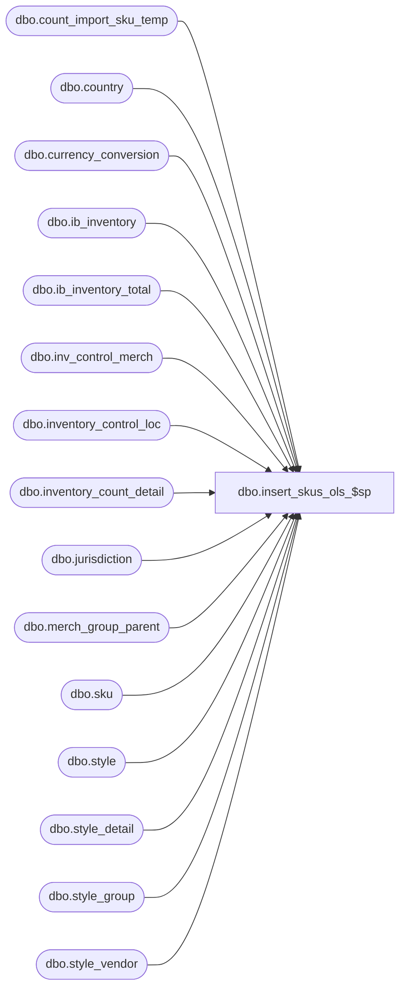

# dbo.insert_skus_ols_$sp

**Database:** me_01  
**Server:** bedrockdb02  

## Architecture Diagram



## Table Dependencies

| Referenced Table |
|---|
| dbo.count_import_sku_temp |
| dbo.country |
| dbo.currency_conversion |
| dbo.ib_inventory |
| dbo.ib_inventory_total |
| dbo.inv_control_merch |
| dbo.inventory_control_loc |
| dbo.inventory_count_detail |
| dbo.jurisdiction |
| dbo.merch_group_parent |
| dbo.sku |
| dbo.style |
| dbo.style_detail |
| dbo.style_group |
| dbo.style_vendor |

## Stored Procedure Code

```sql
CREATE proc [dbo].[insert_skus_ols_$sp] 
(
	@DocId AS DECIMAL(12,0), 
	@IclId AS DECIMAL(13,0), 
	@LocId AS SMALLINT, 
	@DocDate AS SMALLDATETIME, 
	@LastItemId AS DECIMAL, 
	@HierarchyLevelId AS DECIMAL, 
	@ParentLevelId AS DECIMAL,
	@ReplaceOrInc AS SMALLINT
)
AS

/* 
Proc name: insert_skus_ols_$sp 
Description: Procedure called by pi_process_loc_$sp for a physical inventory document of type actual shrink
	Steps:
		1.  	Retrieve skus that have been counted as well as skus that have not been counted but exist in ib_inventory.
			Also retrieve there corresponding units counted and on hand book and in transit units, costs and retails
		2.  	Determine skus that satisfy criteria on the document and insert them into the inventory_count_detail table if 
		    	they do not already exist in the table.  Insert these details with counts of zero for now.
		3.	Update the units_counted, extended_units_counted, and the columns that store the on-hand book and in-transit values
		4.	Based on the on-hand and in-transit values, determine a valid average cost for each detail

Feb. 2, 2010		Feng			Multi-currency mod. 	add cost_local, average_cost_local fields, the calculation on avg cost does not consider the system parameter here due to this proc may be called in SA module and not much info available about this module yet
															Will revisit and re-write the proc with system parameter consideration!!!!
April 26, 2010		Feng		Increase precision from 2 to 6 for cost fields
*/

BEGIN

/*--------------------------------------------------------------------------------------------------------------*/
/*--------------------------------------------------------------------------------------------------------------*/
-- Declartions of various temporary tables
	CREATE TABLE [#sku_loc] (
		[sku_id] decimal(13, 0) NOT NULL ,
		[sku_loc_id] decimal (13,0) identity)

	CREATE TABLE [#PI_SKU_OH_TEMP] (
		[sku_id] decimal(13, 0) NOT NULL ,
		[units_counted] decimal (10,0) NOT NULL ,
		[extended_units_counted] decimal (10,0) NOT NULL ,
		[total_oh_book_units] decimal (10, 0) NOT NULL ,
		[total_oh_book_cost] decimal (18,6) NOT NULL ,
		[total_oh_book_cost_local] decimal (18,6) NOT NULL ,
		[total_oh_book_val_retail] decimal (14,2) NOT NULL ,
		[total_oh_book_sell_retail] decimal (14,2) NOT NULL ,
		[total_oh_in_transit_units] decimal (10, 0) NOT NULL ,
		[total_oh_in_transit_cost] decimal (18,6) NOT NULL ,
		[total_oh_in_transit_cost_local] decimal (18,6) NOT NULL ,
		[total_oh_in_tran_val_retail] decimal (14,2) NOT NULL ,
		[total_oh_in_tran_sell_retail] decimal (14,2) NOT NULL)

	CREATE  NONCLUSTERED  INDEX [#PI_SKU_OH_TEMP_$ndx1] ON [dbo].[#PI_SKU_OH_TEMP]([sku_id])

/*--------------------------------------------------------------------------------------------------------------*/
/*--------------------------------------------------------------------------------------------------------------*/
-- Insert skus that satisfy criteria from the inv_control_merch table into the inventory_count_detail table
-- that have inventory in ib_inventory

	IF @ReplaceOrInc = 0 -- do not include query into count_import_sku_temp

		BEGIN

			-- Get disticints skus that exist in ib_inventory
			INSERT INTO
				#PI_SKU_OH_TEMP
			SELECT
				IB_TOTAL.sku_id,
				ISNULL(SUM(units_counted), 0) units_counted,
				ISNULL(SUM(extended_units_counted), 0) extended_units_counted,
				ISNULL(SUM(IB_TOTAL.total_oh_book_units), 0) - ISNULL(SUM(IB.post_oh_book_units), 0) total_oh_book_units,
				ISNULL(SUM(IB_TOTAL.total_oh_book_cost), 0) - ISNULL(SUM(IB.post_oh_book_cost), 0) total_oh_book_cost,
				ISNULL(SUM(IB_TOTAL.total_oh_book_cost_local), 0) - ISNULL(SUM(IB.post_oh_book_cost_local), 0) total_oh_book_cost_local,
				ISNULL(SUM(IB_TOTAL.total_oh_book_val_retail), 0) - ISNULL(SUM(IB.post_oh_book_val_retail), 0) total_oh_book_val_retail,
				ISNULL(SUM(IB_TOTAL.total_oh_book_sell_retail), 0) - ISNULL(SUM(IB.post_oh_book_sell_retail), 0) total_oh_book_sell_retail,
				ISNULL(SUM(IB_TOTAL.total_oh_in_transit_units), 0) - ISNULL(SUM(IB.post_oh_in_transit_units), 0) total_oh_in_transit_units,
				ISNULL(SUM(IB_TOTAL.total_oh_in_transit_cost), 0) - ISNULL(SUM(IB.post_oh_in_transit_cost), 0) total_oh_in_transit_cost,
				ISNULL(SUM(IB_TOTAL.total_oh_in_transit_cost_local), 0) - ISNULL(SUM(IB.post_oh_in_transit_cost_local), 0) total_oh_in_transit_cost_local,
				ISNULL(SUM(IB_TOTAL.total_oh_in_tran_val_retail), 0) - ISNULL(SUM(IB.post_oh_in_tran_val_retail), 0) total_oh_in_tran_val_retail,
				ISNULL(SUM(IB_TOTAL.total_oh_in_tran_sell_retail), 0) - ISNULL(SUM(IB.post_oh_in_tran_sell_retail), 0) total_oh_in_tran_sell_retail
			FROM
				(
					SELECT
						sku_id,
						0 units_counted,
						0 extended_units_counted,
						SUM(total_on_hand_units) total_oh_book_units,
						SUM(total_on_hand_cost) total_oh_book_cost,
						SUM(total_on_hand_cost_local) total_oh_book_cost_local,
						SUM(total_on_hand_valuation_retail) total_oh_book_val_retail,
						SUM(total_on_hand_selling_retail) total_oh_book_sell_retail,
						0 total_oh_in_transit_units,
						0 total_oh_in_transit_cost,
						0 total_oh_in_transit_cost_local,
						0 total_oh_in_tran_val_retail,
						0 total_oh_in_tran_sell_retail
					FROM
						ib_inventory_total
					WHERE
						location_id = @LocId
						AND inventory_status_id <> 2
					GROUP BY 
						sku_id
					UNION ALL
					SELECT
						sku_id,
						0 units_counted,
						0 extended_units_counted,
						0 total_oh_book_units,
						0 total_oh_book_cost,
						0 total_oh_book_cost_local,
						0 total_oh_book_val_retail,
						0 total_oh_book_sell_retail,
						SUM(total_on_hand_units) total_oh_in_transit_units,
						SUM(total_on_hand_cost) total_oh_in_transit_cost,
						SUM(total_on_hand_cost_local) total_oh_in_transit_cost_local,
						SUM(total_on_hand_valuation_retail) total_oh_in_tran_val_retail,
						SUM(total_on_hand_selling_retail) total_oh_in_tran_sell_retail
					FROM
						ib_inventory_total
					WHERE
						location_id = @LocId
						AND inventory_status_id = 2
					GROUP BY 
						sku_id
					UNION ALL
					SELECT
						sku_id,
						inventory_count_detail.units_counted,
						inventory_count_detail.units_counted extended_units_counted,
						0 total_oh_book_units,
						0 total_oh_book_cost,
						0 total_oh_book_cost_local,
						0 total_oh_book_val_retail,
						0 total_oh_book_sell_retail,
						0 total_oh_in_transit_units,
						0 total_oh_in_transit_cost,
						0 total_oh_in_transit_cost_local,
						0 total_oh_in_tran_val_retail,
						0 total_oh_in_tran_sell_retail
					FROM
						inventory_count_detail
					WHERE
						inventory_control_loc_id = @IclId
						AND inventory_control_id = @DocId
						AND total_retail IS NULL
						AND pack_id IS NULL
				) IB_TOTAL
			LEFT OUTER JOIN
				(
					SELECT
						sku_id,
						SUM(transaction_units) post_oh_book_units,
						SUM(transaction_cost) post_oh_book_cost,
						SUM(transaction_cost_local) post_oh_book_cost_local,
						SUM(transaction_valuation_retail) post_oh_book_val_retail,
						SUM(transaction_selling_retail) post_oh_book_sell_retail,
						0 post_oh_in_transit_units,
						0 post_oh_in_transit_cost,
						0 post_oh_in_transit_cost_local,
						0 post_oh_in_tran_val_retail,
						0 post_oh_in_tran_sell_retail
					FROM
						ib_inventory
					WHERE
						location_id = @LocId
						AND inventory_status_id <> 2
						AND transaction_date > CONVERT (DATETIME, @DocDate, 101)
					GROUP BY 
						sku_id
					UNION ALL
					SELECT
						sku_id,
						0 post_oh_book_units,
						0 post_oh_book_cost,
						0 post_oh_book_cost_local,
						0 post_oh_book_val_retail,
						0 post_oh_book_sell_retail,
						SUM(transaction_units) post_oh_in_transit_units,
						SUM(transaction_cost) post_oh_in_transit_cost,
						SUM(transaction_cost_local) post_oh_in_transit_cost_local,
						SUM(transaction_valuation_retail) post_oh_in_tran_val_retail,
						SUM(transaction_selling_retail) post_oh_in_tran_sell_retail
					FROM
						ib_inventory
					WHERE
						location_id = @LocId
						AND inventory_status_id = 2
						AND transaction_date > CONVERT (DATETIME, @DocDate, 101)
					GROUP BY 
						sku_id
				) IB
			ON
				IB_TOTAL.sku_id = IB.sku_id
			GROUP BY
				IB_TOTAL.sku_id

		END

	ELSE -- include query into count_import_sku_temp
		
		BEGIN

			-- Get disticints skus that exist in ib_inventory
			INSERT INTO
				#PI_SKU_OH_TEMP
			SELECT
				IB_TOTAL.sku_id,
				ISNULL(SUM(units_counted), 0) units_counted,
				ISNULL(SUM(extended_units_counted), 0) extended_units_counted,
				ISNULL(SUM(IB_TOTAL.total_oh_book_units), 0) - ISNULL(SUM(IB.post_oh_book_units), 0) total_oh_book_units,
				ISNULL(SUM(IB_TOTAL.total_oh_book_cost), 0) - ISNULL(SUM(IB.post_oh_book_cost), 0) total_oh_book_cost,
				ISNULL(SUM(IB_TOTAL.total_oh_book_cost_local), 0) - ISNULL(SUM(IB.post_oh_book_cost_local), 0) total_oh_book_cost_local,
				ISNULL(SUM(IB_TOTAL.total_oh_book_val_retail), 0) - ISNULL(SUM(IB.post_oh_book_val_retail), 0) total_oh_book_val_retail,
				ISNULL(SUM(IB_TOTAL.total_oh_book_sell_retail), 0) - ISNULL(SUM(IB.post_oh_book_sell_retail), 0) total_oh_book_sell_retail,
				ISNULL(SUM(IB_TOTAL.total_oh_in_transit_units), 0) - ISNULL(SUM(IB.post_oh_in_transit_units), 0) total_oh_in_transit_units,
				ISNULL(SUM(IB_TOTAL.total_oh_in_transit_cost), 0) - ISNULL(SUM(IB.post_oh_in_transit_cost), 0) total_oh_in_transit_cost,
				ISNULL(SUM(IB_TOTAL.total_oh_in_transit_cost_local), 0) - ISNULL(SUM(IB.post_oh_in_transit_cost_local), 0) total_oh_in_transit_cost_local,
				ISNULL(SUM(IB_TOTAL.total_oh_in_tran_val_retail), 0) - ISNULL(SUM(IB.post_oh_in_tran_val_retail), 0) total_oh_in_tran_val_retail,
				ISNULL(SUM(IB_TOTAL.total_oh_in_tran_sell_retail), 0) - ISNULL(SUM(IB.post_oh_in_tran_sell_retail), 0) total_oh_in_tran_sell_retail
			FROM
				(
					SELECT
						sku_id,
						0 units_counted,
						0 extended_units_counted,
						SUM(total_on_hand_units) total_oh_book_units,
						SUM(total_on_hand_cost) total_oh_book_cost,
						SUM(total_on_hand_cost_local) total_oh_book_cost_local,
						SUM(total_on_hand_valuation_retail) total_oh_book_val_retail,
						SUM(total_on_hand_selling_retail) total_oh_book_sell_retail,
						0 total_oh_in_transit_units,
						0 total_oh_in_transit_cost,
						0 total_oh_in_transit_cost_local,
						0 total_oh_in_tran_val_retail,
						0 total_oh_in_tran_sell_retail
					FROM
						ib_inventory_total
					WHERE
						location_id = @LocId
						AND inventory_status_id <> 2
					GROUP BY 
						sku_id
					UNION ALL
					SELECT
						sku_id,
						0 units_counted,
						0 extended_units_counted,
						0 total_oh_book_units,
						0 total_oh_book_cost,
						0 total_oh_book_cost_local,
						0 total_oh_book_val_retail,
						0 total_oh_book_sell_retail,
						SUM(total_on_hand_units) total_oh_in_transit_units,
						SUM(total_on_hand_cost) total_oh_in_transit_cost,
						SUM(total_on_hand_cost_local) total_oh_in_transit_cost_local,
						SUM(total_on_hand_valuation_retail) total_oh_in_tran_val_retail,
						SUM(total_on_hand_selling_retail) total_oh_in_tran_sell_retail
					FROM
						ib_inventory_total
					WHERE
						location_id = @LocId
						AND inventory_status_id = 2
					GROUP BY 
						sku_id
					UNION ALL
					SELECT
						sku.sku_id,
						count_import_sku_temp.units_counted units_counted,
						count_import_sku_temp.units_counted extended_units_counted,
						0 total_oh_book_units,
						0 total_oh_book_cost,
						0 total_oh_book_cost_local,
						0 total_oh_book_val_retail,
						0 total_oh_book_sell_retail,
						0 total_oh_in_transit_units,
						0 total_oh_in_transit_cost,
						0 total_oh_in_transit_cost_local,
						0 total_oh_in_tran_val_retail,
						0 total_oh_in_tran_sell_retail
					FROM
						count_import_sku_temp,
						sku
					WHERE
						count_import_sku_temp.location_id = @LocId
						AND count_import_sku_temp.sku_id = sku.sku_id
				) IB_TOTAL
			LEFT OUTER JOIN
				(
					SELECT
						sku_id,
						SUM(transaction_units) post_oh_book_units,
						SUM(transaction_cost) post_oh_book_cost,
						SUM(transaction_cost_local) post_oh_book_cost_local,
						SUM(transaction_valuation_retail) post_oh_book_val_retail,
						SUM(transaction_selling_retail) post_oh_book_sell_retail,
						0 post_oh_in_transit_units,
						0 post_oh_in_transit_cost,
						0 post_oh_in_transit_cost_local,
						0 post_oh_in_tran_val_retail,
						0 post_oh_in_tran_sell_retail
					FROM
						ib_inventory
					WHERE
						location_id = @LocId
						AND inventory_status_id <> 2
						AND transaction_date > CONVERT (DATETIME, @DocDate, 101)
					GROUP BY 
						sku_id
					UNION ALL
					SELECT
						sku_id,
						0 post_oh_book_units,
						0 post_oh_book_cost,
						0 post_oh_book_cost_local,
						0 post_oh_book_val_retail,
						0 post_oh_book_sell_retail,
						SUM(transaction_units) post_oh_in_transit_units,
						SUM(transaction_cost) post_oh_in_transit_cost,
						SUM(transaction_cost_local) post_oh_in_transit_cost_local,
						SUM(transaction_valuation_retail) post_oh_in_tran_val_retail,
						SUM(transaction_selling_retail) post_oh_in_tran_sell_retail
					FROM
						ib_inventory
					WHERE
						location_id = @LocId
						AND inventory_status_id = 2
						AND transaction_date > CONVERT (DATETIME, @DocDate, 101)
					GROUP BY 
						sku_id
				) IB
			ON
				IB_TOTAL.sku_id = IB.sku_id
			GROUP BY
				IB_TOTAL.sku_id

		END
	
	If (ISNULL(@HierarchyLevelId, 0) <> 0 AND ISNULL(@ParentLevelId, 0) = 0) -- Chain-level count
		
		BEGIN

			INSERT INTO 
				#sku_loc
			SELECT 
				sku.sku_id
			FROM
				#PI_SKU_OH_TEMP,
				sku,
				style
			WHERE
				sku.sku_id = #PI_SKU_OH_TEMP.sku_id
				AND style.style_id = sku.style_id
				AND style.style_type = 1
				AND NOT EXISTS
			 		(
						SELECT 1
						FROM
							inventory_count_detail WITH (NOLOCK)
						WHERE
							inventory_count_detail.sku_id = #PI_SKU_OH_TEMP.sku_id
							AND inventory_count_detail.inventory_control_id = @DocId
							AND inventory_count_detail.inventory_control_loc_id = @IclId
					)

		END

	ELSE IF (ISNULL(@HierarchyLevelId, 0) <> 0 AND ISNULL(@ParentLevelId, 0) <> 0) -- Non chain-level count
		
		BEGIN

			INSERT INTO 
				#sku_loc
			SELECT
				sku.sku_id
			FROM
				#PI_SKU_OH_TEMP,
				inv_control_merch,
				merch_group_parent,
				style_group,
				sku,
				style
			WHERE
				#PI_SKU_OH_TEMP.sku_id = sku.sku_id
				AND inv_control_merch.hierarchy_group_id = merch_group_parent.parent_hierarchy_group_id	
				AND inv_control_merch.inventory_control_id = @DocId
				AND merch_group_parent.hierarchy_group_id = style_group.hierarchy_group_id
				AND style_group.style_id = sku.style_id
				AND style.style_id = sku.style_id
				AND style.style_id = style_group.style_id
				AND style.style_type = 1
				AND NOT EXISTS
			 		(
						SELECT 1
						FROM
							inventory_count_detail WITH (NOLOCK)
						WHERE
							inventory_count_detail.sku_id = #PI_SKU_OH_TEMP.sku_id
							AND inventory_count_detail.inventory_control_id = @DocId
							AND inventory_count_detail.inventory_control_loc_id = @IclId
					)

		END

	ELSE IF (ISNULL(@HierarchyLevelId, 0) = 0 AND ISNULL(@ParentLevelId, 0) = 0) -- Non chain-level count
		
		BEGIN

			INSERT INTO 
				#sku_loc
			SELECT
				sku.sku_id
			FROM
				#PI_SKU_OH_TEMP,
				inv_control_merch,
				sku,
				style
			WHERE
				#PI_SKU_OH_TEMP.sku_id = sku.sku_id
				AND inv_control_merch.style_id = sku.style_id
				AND style.style_id = sku.style_id
				AND style.style_type = 1
				AND inv_control_merch.inventory_control_id = @DocId
				AND NOT EXISTS
			 		(
						SELECT 1
						FROM
							inventory_count_detail WITH (NOLOCK)
						WHERE
							inventory_count_detail.sku_id = #PI_SKU_OH_TEMP.sku_id
							AND inventory_count_detail.inventory_control_id = @DocId
							AND inventory_count_detail.inventory_control_loc_id = @IclId
					)

		END

	INSERT INTO
		inventory_count_detail (inventory_count_detail_id, inventory_control_loc_id, inventory_control_id, sku_id, units_counted, extended_units_counted)
	SELECT
		(@IclId * 1000000) + @LastItemId + sku_loc_id,
		@IclId,
		@DocId,
		sku_id,
		0 units_counted,
		0 extended_units_counted
	FROM
		#sku_loc
	-- Update last_item_id in inventory_control_loc_table

	UPDATE
		inventory_control_loc
	SET
		last_item_id = (SELECT ISNULL(@LastItemId + MAX(#sku_loc.sku_loc_id), @LastItemId) FROM #sku_loc)
	WHERE
		inventory_control_loc_id = @IclId
		AND inventory_control_id = @DocId

/*--------------------------------------------------------------------------------------------------------------*/
/*--------------------------------------------------------------------------------------------------------------*/
-- Retrieve the total on hand book and in-transit values for regular skus

	IF @ReplaceOrInc = 0

		BEGIN

			UPDATE
				inventory_count_detail
			SET 
				inventory_count_detail.extended_units_counted = inventory_count_detail.units_counted,
				inventory_count_detail.total_oh_book_units = #PI_SKU_OH_TEMP.total_oh_book_units,
				inventory_count_detail.total_oh_book_cost = #PI_SKU_OH_TEMP.total_oh_book_cost,
				inventory_count_detail.total_oh_book_cost_local = #PI_SKU_OH_TEMP.total_oh_book_cost_local,
				inventory_count_detail.total_oh_in_transit_units = #PI_SKU_OH_TEMP.total_oh_in_transit_units,
				inventory_count_detail.total_oh_in_transit_cost = #PI_SKU_OH_TEMP.total_oh_in_transit_cost,
				inventory_count_detail.total_oh_in_transit_cost_local = #PI_SKU_OH_TEMP.total_oh_in_transit_cost_local
			FROM
				inventory_count_detail WITH (NOLOCK),
				#PI_SKU_OH_TEMP
			WHERE
				inventory_count_detail.sku_id = #PI_SKU_OH_TEMP.sku_id		
				AND inventory_count_detail.inventory_control_id = @DocId
				AND inventory_count_detail.inventory_control_loc_id = @IclId
				AND inventory_count_detail.pack_id IS NULL
				AND inventory_count_detail.total_retail IS NULL

		END

	ELSE IF @ReplaceOrInc = 1 -- replace count
	
		BEGIN

			UPDATE
				inventory_count_detail
			SET 
				inventory_count_detail.units_counted = #PI_SKU_OH_TEMP.units_counted,
				inventory_count_detail.extended_units_counted = #PI_SKU_OH_TEMP.extended_units_counted,
				inventory_count_detail.total_oh_book_units = #PI_SKU_OH_TEMP.total_oh_book_units,
				inventory_count_detail.total_oh_book_cost = #PI_SKU_OH_TEMP.total_oh_book_cost,
				inventory_count_detail.total_oh_book_cost_local = #PI_SKU_OH_TEMP.total_oh_book_cost_local,
				inventory_count_detail.total_oh_in_transit_units = #PI_SKU_OH_TEMP.total_oh_in_transit_units,
				inventory_count_detail.total_oh_in_transit_cost = #PI_SKU_OH_TEMP.total_oh_in_transit_cost,
				inventory_count_detail.total_oh_in_transit_cost_local = #PI_SKU_OH_TEMP.total_oh_in_transit_cost_local
			FROM
				inventory_count_detail WITH (NOLOCK),
				#PI_SKU_OH_TEMP
			WHERE
				inventory_count_detail.sku_id = #PI_SKU_OH_TEMP.sku_id		
				AND inventory_count_detail.inventory_control_id = @DocId
				AND inventory_count_detail.inventory_control_loc_id = @IclId
				AND inventory_count_detail.pack_id IS NULL
				AND inventory_count_detail.total_retail IS NULL

		END

	ELSE IF @ReplaceOrInc = 2 -- increment count
	
		BEGIN

			UPDATE
				inventory_count_detail
			SET 
				inventory_count_detail.units_counted = inventory_count_detail.units_counted + #PI_SKU_OH_TEMP.units_counted,
				inventory_count_detail.extended_units_counted = inventory_count_detail.extended_units_counted + #PI_SKU_OH_TEMP.extended_units_counted,
				inventory_count_detail.total_oh_book_units = #PI_SKU_OH_TEMP.total_oh_book_units,
				inventory_count_detail.total_oh_book_cost = #PI_SKU_OH_TEMP.total_oh_book_cost,
				inventory_count_detail.total_oh_book_cost_local = #PI_SKU_OH_TEMP.total_oh_book_cost_local,
				inventory_count_detail.total_oh_in_transit_units = #PI_SKU_OH_TEMP.total_oh_in_transit_units,
				inventory_count_detail.total_oh_in_transit_cost = #PI_SKU_OH_TEMP.total_oh_in_transit_cost,
				inventory_count_detail.total_oh_in_transit_cost_local = #PI_SKU_OH_TEMP.total_oh_in_transit_cost_local
			FROM
				inventory_count_detail WITH (NOLOCK),
				#PI_SKU_OH_TEMP
			WHERE
				inventory_count_detail.sku_id = #PI_SKU_OH_TEMP.sku_id		
				AND inventory_count_detail.inventory_control_id = @DocId
				AND inventory_count_detail.inventory_control_loc_id = @IclId
				AND inventory_count_detail.pack_id IS NULL
				AND inventory_count_detail.total_retail IS NULL

		END

/*--------------------------------------------------------------------------------------------------------------*/
/*--------------------------------------------------------------------------------------------------------------*/
-- Calculate the average costs 

	/*--------------------------------------------------------------------------------------------------------------*/
	-- First, calculate average cost for those styles that have a valid average
		-- Average cost must be greater than or equal to zero
		-- Total on hand units (sum of total_oh_book_units and total_oh_hand_in_transit_units) must be greater than zero

	UPDATE
		inventory_count_detail
	SET
		inventory_count_detail.average_cost = A.average_cost
	FROM
		inventory_count_detail,
		sku,
		(
			SELECT
				sku.style_id,
				SUM(inventory_count_detail.total_oh_book_units + inventory_count_detail.total_oh_in_transit_units) total_units,
				SUM(inventory_count_detail.total_oh_book_cost + inventory_count_detail.total_oh_in_transit_cost) total_cost,
				SUM(inventory_count_detail.total_oh_book_cost + inventory_count_detail.total_oh_in_transit_cost)/SUM(inventory_count_detail.total_oh_book_units + inventory_count_detail.total_oh_in_transit_units) average_cost
			FROM
				sku WITH (NOLOCK),
				inventory_count_detail WITH (NOLOCK)
			WHERE
				inventory_count_detail.sku_id = sku.sku_id
				AND inventory_count_detail.inventory_control_loc_id = @IclId
				AND inventory_count_detail.inventory_control_id = @DocId
				AND inventory_count_detail.pack_id IS NULL
				AND inventory_count_detail.total_retail IS NULL
			GROUP BY
				sku.style_id
			HAVING
				SUM(inventory_count_detail.total_oh_book_units + inventory_count_detail.total_oh_in_transit_units) > 0
				AND SUM(inventory_count_detail.total_oh_book_cost + inventory_count_detail.total_oh_in_transit_cost) >= 0	
		) A
	WHERE
		inventory_count_detail.sku_id = sku.sku_id
		AND sku.style_id = A.style_id
		AND inventory_count_detail.inventory_control_loc_id = @IclId
		AND inventory_count_detail.inventory_control_id = @DocId
		AND inventory_count_detail.total_retail IS NULL

	/*--------------------------------------------------------------------------------------------------------------*/
	-- For those styles that don't have a valid average cost, use the last_net_final_po_cost from the style_detail table
		
	UPDATE
		inventory_count_detail
	SET
		inventory_count_detail.average_cost = style_detail.last_net_final_po_cost
	FROM
		inventory_count_detail WITH (NOLOCK),
		style_detail WITH (NOLOCK),
		sku WITH (NOLOCK)
	WHERE
		inventory_count_detail.sku_id = sku.sku_id
		AND sku.style_id = style_detail.style_id
		AND inventory_count_detail.inventory_control_loc_id = @IclId
		AND inventory_count_detail.inventory_control_id = @DocId	
		AND inventory_count_detail.average_cost IS NULL
		AND inventory_count_detail.total_retail IS NULL

	/*--------------------------------------------------------------------------------------------------------------*/
	-- For those styles that don't have a cost, use the current_cost of the primary vendor from the style_vendor table

	UPDATE
		inventory_count_detail
	SET
		inventory_count_detail.average_cost = style_vendor.current_cost * exchange_rate
	FROM
		inventory_count_detail WITH (NOLOCK),
		style_vendor WITH (NOLOCK),
		sku WITH (NOLOCK),
		currency_conversion WITH (NOLOCK)
	WHERE
		inventory_count_detail.sku_id = sku.sku_id
		AND sku.style_id = style_vendor.style_id
		AND style_vendor.primary_vendor_flag = 1
		AND inventory_count_detail.inventory_control_loc_id = @IclId
		AND inventory_count_detail.inventory_control_id = @DocId	
		AND inventory_count_detail.average_cost IS NULL
		AND effective_from_date <= @DocDate
		AND (effective_to_date >= @DocDate OR effective_to_date IS NULL)
		AND currency_conversion_type = 1
		AND to_currency_id = style_vendor.currency_id
		AND from_currency_id = (
				SELECT 	currency_id to_currency_id 
				FROM 	country, jurisdiction 
				WHERE 	country.country_id= jurisdiction.country_id 
				AND 	jurisdiction.home_jurisdiction_flag = 1
					)

/*----Multi currency mod -----------------------------------------------------------------------------------------------*/
DECLARE @ExchangeRate AS FLOAT
	-- Determine exchange rate
	EXEC sp_executesql
		N'SELECT
			@ParamExchangeRate = exchange_rate
		  FROM
			currency_conversion
		  WHERE
			to_currency_id =
				( SELECT
					currency_id from_currency_id
				  FROM
					country
					, jurisdiction
					, location
				  WHERE
					location.jurisdiction_id = jurisdiction.jurisdiction_id
					AND country.country_id= jurisdiction.country_id
					AND location.location_id = @ParamLocId )
			AND from_currency_id =
				( SELECT
					currency_id to_currency_id
				  FROM
					country
					, jurisdiction
				  WHERE
					country.country_id= jurisdiction.country_id
					AND jurisdiction.home_jurisdiction_flag = 1 )
			AND effective_from_date <= @ParamCountDate
			AND (effective_to_date >= @ParamCountDate OR effective_to_date IS NULL)
			AND currency_conversion_type = 1'
		, N'@ParamExchangeRate AS FLOAT OUTPUT
		  , @ParamLocId AS SMALLINT
		  , @ParamCountDate AS DATETIME'
		, @ParamExchangeRate = @ExchangeRate OUTPUT
		, @ParamLocId = @LocId
		, @ParamCountDate = @DocDate


-- update average_cost_local
	UPDATE
		inventory_count_detail
	SET
		inventory_count_detail.average_cost_local = A.average_cost_local
	FROM
		inventory_count_detail,
		sku,
		(
			SELECT
				sku.style_id,
				SUM(inventory_count_detail.total_oh_book_units + inventory_count_detail.total_oh_in_transit_units) total_units,
				SUM(inventory_count_detail.total_oh_book_cost_local + inventory_count_detail.total_oh_in_transit_cost_local) total_cost_local,
				SUM(inventory_count_detail.total_oh_book_cost_local + inventory_count_detail.total_oh_in_transit_cost_local)/SUM(inventory_count_detail.total_oh_book_units + inventory_count_detail.total_oh_in_transit_units) average_cost_local
			FROM
				sku WITH (NOLOCK),
				inventory_count_detail WITH (NOLOCK)
			WHERE
				inventory_count_detail.sku_id = sku.sku_id
				AND inventory_count_detail.inventory_control_loc_id = @IclId
				AND inventory_count_detail.inventory_control_id = @DocId
				AND inventory_count_detail.pack_id IS NULL
				AND inventory_count_detail.total_retail IS NULL
			GROUP BY
				sku.style_id
			HAVING
				SUM(inventory_count_detail.total_oh_book_units + inventory_count_detail.total_oh_in_transit_units) > 0
 			AND SUM(inventory_count_detail.total_oh_book_cost_local + inventory_count_detail.total_oh_in_transit_cost_local) >= 0	
		) A
	WHERE
		inventory_count_detail.sku_id = sku.sku_id
		AND sku.style_id = A.style_id
		AND inventory_count_detail.inventory_control_loc_id = @IclId
		AND inventory_count_detail.inventory_control_id = @DocId
		AND inventory_count_detail.total_retail IS NULL

	/*--------------------------------------------------------------------------------------------------------------*/
	-- For those styles that don't have a valid average cost, use the last_net_final_po_cost from the style_detail table
		
	UPDATE
		inventory_count_detail
	SET
		inventory_count_detail.average_cost_local = style_detail.last_net_final_po_cost / @ExchangeRate
	FROM
		inventory_count_detail WITH (NOLOCK),
		style_detail WITH (NOLOCK),
		sku WITH (NOLOCK)
	WHERE
		inventory_count_detail.sku_id = sku.sku_id
		AND sku.style_id = style_detail.style_id
		AND inventory_count_detail.inventory_control_loc_id = @IclId
		AND inventory_count_detail.inventory_control_id = @DocId	
		AND inventory_count_detail.average_cost_local IS NULL
		AND inventory_count_detail.total_retail IS NULL

	/*--------------------------------------------------------------------------------------------------------------*/
	-- For those styles that don't have a cost, use the current_cost of the primary vendor from the style_vendor table

	UPDATE
		inventory_count_detail
	SET
		inventory_count_detail.average_cost_local = style_vendor.current_cost * exchange_rate / @ExchangeRate
	FROM
		inventory_count_detail WITH (NOLOCK),
		style_vendor WITH (NOLOCK),
		sku WITH (NOLOCK),
		currency_conversion WITH (NOLOCK)
	WHERE
		inventory_count_detail.sku_id = sku.sku_id
		AND sku.style_id = style_vendor.style_id
		AND style_vendor.primary_vendor_flag = 1
		AND inventory_count_detail.inventory_control_loc_id = @IclId
		AND inventory_count_detail.inventory_control_id = @DocId	
		AND inventory_count_detail.average_cost_local IS NULL
		AND effective_from_date <= @DocDate
		AND (effective_to_date >= @DocDate OR effective_to_date IS NULL)
		AND currency_conversion_type = 1
		AND to_currency_id = style_vendor.currency_id
		AND from_currency_id = (
				SELECT 	currency_id to_currency_id 
				FROM 	country, jurisdiction 
				WHERE 	country.country_id= jurisdiction.country_id 
				AND 	jurisdiction.home_jurisdiction_flag = 1
					)
/*--------------------------------------------------------------------------------------------------------------*/
/*--------------------------------------------------------------------------------------------------------------*/

	DROP TABLE #sku_loc
	DROP TABLE #PI_SKU_OH_TEMP
		
/*--------------------------------------------------------------------------------------------------------------*/

END
```

