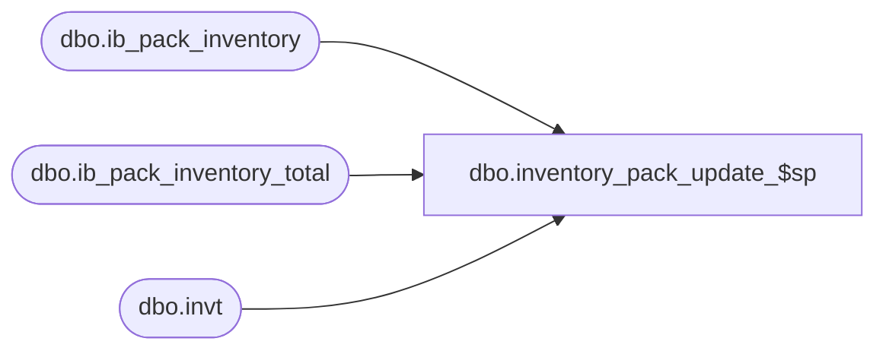

# dbo.inventory_pack_update_$sp

**Database:** me_01  
**Server:** bedrockdb02  

## Architecture Diagram



## Table Dependencies

| Referenced Table |
|---|
| dbo.ib_pack_inventory |
| dbo.ib_pack_inventory_total |
| dbo.invt |

## Stored Procedure Code

```sql
CREATE PROCEDURE [dbo].[inventory_pack_update_$sp] 
	(@source_statement AS NVARCHAR(4000))
AS

-- =============================================
-- Author:		Yan
-- Create date: 2011
-- Description:	This is part of the ib_pack_inventory trigger removal. It populates ib_pack_inventory_total
-- =============================================

BEGIN

DECLARE 
	@UseTran	BIT,
	@DelTmpTbl	BIT,
	@ErrorVar	INT,
	@ErrorMsg	NVARCHAR(1000);

	-- SET NOCOUNT ON added to prevent extra result sets from
	-- interfering with SELECT statements.
	SET NOCOUNT ON;

	-- Set local transaction control flag
	SET @UseTran = 0;
	-- Set delete temporary table flag
	SET @DelTmpTbl = 0;

	-- Only call BEGIN TRAN if we are not in a transaction
	-- Note: There is no "Rollback" to a nested transaction. Rollback needs to go
	--       back to the outer most "Begin Tran". Also, "Save Transaction" does not
	--       work within a distribution transaction so no luck there either. 
	IF @@TRANCOUNT = 0
	BEGIN
		BEGIN TRAN;
		SET @UseTran = 1;
	END;

	-- Create temporary table
	CREATE TABLE #inv_upd(
		inv_upd_id            decimal(12, 0) IDENTITY(1,1) NOT NULL,
		pack_id               decimal(12, 0) NOT NULL,
		location_id           smallint NOT NULL,
		transaction_date      smalldatetime NOT NULL,
		transaction_type_code smallint NOT NULL,
		other_location_id     smallint NULL,
		document_number       nvarchar(20) NULL,
		transaction_units     int NOT NULL DEFAULT ((0)),
		distribution_id       bigint NULL,

		PRIMARY KEY CLUSTERED (inv_upd_id ASC)
		);

	SET @ErrorVar = @@ERROR;
	IF @ErrorVar <> 0
	BEGIN
		SET @ErrorMsg = N'inventory_pack_update_$sp: Failed to create #inv_upd. Err' + CAST(@ErrorVar AS NVARCHAR(20));
		GOTO ERROR_HANDLER;
	END;

	-- Create temporary table
	CREATE TABLE #inv_upd_total(
	pack_id             decimal(12, 0) NOT NULL,
	location_id         smallint NOT NULL,
	total_on_hand_units int NOT NULL DEFAULT ((0)),
	PRIMARY KEY CLUSTERED (pack_id ASC, location_id ASC)
	);

	SET @ErrorVar = @@ERROR;
	IF @ErrorVar <> 0
	BEGIN
		SET @ErrorMsg = N'inventory_pack_update_$sp: Failed to create #inv_upd_total. Err' + CAST(@ErrorVar AS NVARCHAR(20));
		GOTO ERROR_HANDLER;
	END;

	-- Temp table created
	SET @DelTmpTbl = 1;

	-- Execute the passed in query and insert into #inv_upd
	SET @source_statement = N'INSERT INTO #inv_upd 
			(pack_id, location_id, transaction_date, document_number, 
			transaction_type_code, other_location_id, transaction_units, distribution_id) ' + @source_statement;

	EXEC sp_executesql @source_statement;

	SET @ErrorVar = @@ERROR;
	IF @ErrorVar <> 0
	BEGIN
		SET @ErrorMsg = N'inventory_pack_update_$sp: Failed to populate #inv_upd (' + @source_statement + N'). Err' + CAST(@ErrorVar AS NVARCHAR(20));
		GOTO ERROR_HANDLER;
	END;

	-- INSERT into ib_pack_inventory
	INSERT INTO ib_pack_inventory 
		(pack_id, location_id, transaction_date, document_number, 
		transaction_type_code, other_location_id, transaction_units, distribution_id)
	SELECT 
		pack_id, location_id, transaction_date, document_number, 
		transaction_type_code, other_location_id, transaction_units, distribution_id
	FROM #inv_upd;

	SET @ErrorVar = @@ERROR;
	IF @ErrorVar <> 0
	BEGIN
		SET @ErrorMsg = N'inventory_pack_update_$sp: Failed INSERT INTO ib_pack_inventory from #inv_upd. Err' + CAST(@ErrorVar AS NVARCHAR(20));
		GOTO ERROR_HANDLER;
	END;

	-- INSERT into #inv_upd_total for all affected sku/location/inventory status rows
	INSERT #inv_upd_total
		(pack_id, location_id, total_on_hand_units)
	SELECT 
		pack_id, location_id, SUM(transaction_units)
	FROM 
		#inv_upd upd
	GROUP BY
		pack_id, location_id;

	SET @ErrorVar = @@ERROR;
	IF @ErrorVar <> 0
	BEGIN
		SET @ErrorMsg = N'inventory_pack_update_$sp: Failed INSERT INTO #inv_upd_total from #inv_upd. Err' + CAST(@ErrorVar AS NVARCHAR(20));
		GOTO ERROR_HANDLER;
	END;

	-- UPDATE ib_pack_inventory_total for existing pack/location rows
	UPDATE invt
	SET  total_on_hand_units = invt.total_on_hand_units + t.total_on_hand_units
	FROM  #inv_upd_total t
	INNER JOIN ib_pack_inventory_total invt
		ON  invt.pack_id = t.pack_id 
		AND invt.location_id = t.location_id;

	SET @ErrorVar = @@ERROR;
	IF @ErrorVar <> 0
	BEGIN
		SET @ErrorMsg = N'inventory_pack_update_$sp: Failed UPDATE ib_pack_inventory_total from #inv_upd_total. Err' + CAST(@ErrorVar AS NVARCHAR(20));
		GOTO ERROR_HANDLER;
	END;

	-- INSERT into ib_pack_inventory_total for new sku/location/inventory status rows
	INSERT ib_pack_inventory_total 
		(pack_id, location_id, total_on_hand_units)
	SELECT pack_id, location_id, total_on_hand_units
	FROM  #inv_upd_total upd
	WHERE NOT EXISTS (
			SELECT 1
			FROM ib_pack_inventory_total invt
			WHERE 
				invt.pack_id = upd.pack_id
				AND invt.location_id = upd.location_id
		)
	

	SET @ErrorVar = @@ERROR;
	IF @ErrorVar <> 0
	BEGIN
		SET @ErrorMsg = N'inventory_pack_update_$sp: Failed INSERT INTO ib_pack_inventory_total from #inv_upd_total. Err' + CAST(@ErrorVar AS NVARCHAR(20));
		GOTO ERROR_HANDLER;
	END;

	-- Drop temporary tables
	DROP TABLE #inv_upd;

	SET @ErrorVar = @@ERROR;
	IF @ErrorVar <> 0
	BEGIN
		SET @ErrorMsg = N'inventory_pack_update_$sp: Failed DELETE #inv_upd. Err' + CAST(@ErrorVar AS NVARCHAR(20));
		GOTO ERROR_HANDLER;
	END;

	DROP TABLE #inv_upd_total;

	SET @ErrorVar = @@ERROR;
	IF @ErrorVar <> 0
	BEGIN
		SET @ErrorMsg = N'inventory_pack_update_$sp: Failed DELETE #inv_upd_total. Err' + CAST(@ErrorVar AS NVARCHAR(20));
		GOTO ERROR_HANDLER;
	END;


	-- Commit transaction if in locally controlled transaction
	IF @UseTran = 1
	BEGIN
		COMMIT TRAN;
	END;

	-- Done!
	RETURN;

ERROR_HANDLER:
	-- Drop temp table if exists
	IF @DelTmpTbl = 1
	BEGIN
		DROP TABLE #inv_upd;
		DROP TABLE #inv_upd_total;
	END;
	-- Rollback transaction if in locally controlled transaction
	IF @UseTran = 1
	BEGIN
		ROLLBACK TRAN;
	END;
	-- Raise an error
	RAISERROR(@ErrorMsg, 16, 1);
	-- Exit
	RETURN;

END;
```

