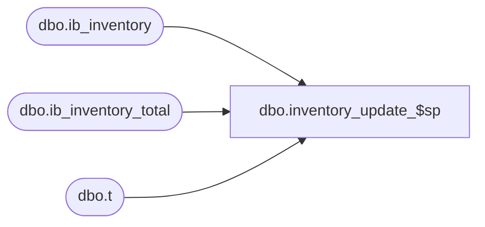

# dbo.inventory_update_$sp

**Database:** me_01  
**Server:** bedrockdb02  

## Architecture Diagram



## Table Dependencies

| Referenced Table |
|---|
| dbo.ib_inventory |
| dbo.ib_inventory_total |
| dbo.t |

## Stored Procedure Code

```sql
CREATE PROCEDURE [dbo].[inventory_update_$sp] 
      (@source_statement AS NVARCHAR(4000))
AS

-- =============================================
-- Author:        Ivan and Geoffrey
-- Create date: 2007
-- Description:   This is part of the ib_inventory trigger removal. It populates ib_inventory_total
-- =============================================

/*
HISTORY:
Date                    Name                    Def#              Desc
April 23, 2010          Sameer Patel                                    Performance fix
May 26, 2010            Michael Holland         118104                  Performance fix
*/

BEGIN

DECLARE 
      @UseTran    BIT,
      @DelTmpTblDetail  BIT,
      @DelTmpTblTotal         BIT,
      @ErrorVar   INT,
      @ErrorMsg   NVARCHAR(1000),
      @RowsInserted DECIMAL(10,0);

      -- SET NOCOUNT ON added to prevent extra result sets from
      -- interfering with SELECT statements.
      SET NOCOUNT ON;

      -- Set local transaction control flag
      SET @UseTran = 0;
      -- Set delete temporary table flag
      SET @DelTmpTblDetail = 0;
      SET @DelTmpTblTotal = 0;

      -- Only call BEGIN TRAN if we are not in a transaction
      -- Note: There is no "Rollback" to a nested transaction. Rollback needs to go
      --       back to the outer most "Begin Tran". Also, "Save Transaction" does not
      --       work within a distribution transaction so no luck there either. 
      IF @@TRANCOUNT = 0
      BEGIN
            BEGIN TRAN;
            SET @UseTran = 1;
      END;

      -- Create temporary table
      CREATE TABLE #inv_upd(
            inv_upd_id                                DECIMAL(13, 0) IDENTITY(1,1) NOT NULL,
            sku_id                                          DECIMAL(13, 0) NOT NULL,
            location_id                               SMALLINT NOT NULL,
            price_status_id                           SMALLINT NOT NULL,
            transaction_date                    SMALLDATETIME NOT NULL,
            transaction_type_code               SMALLINT NOT NULL,
            inventory_status_id                       SMALLINT NOT NULL,
            other_location_id                   SMALLINT NULL,
            transaction_reason_id               SMALLINT NULL,
            document_number                           NVARCHAR(20) NULL,
            transaction_units                   INT NOT NULL,
            transaction_cost                    DECIMAL(14, 2) NOT NULL,
            transaction_valuation_retail  DECIMAL(14, 2) NOT NULL,
            transaction_selling_retail          DECIMAL(14, 2) NOT NULL,
            price_change_type                   SMALLINT NULL,
            units_affected                            INT NULL,
            PRIMARY KEY CLUSTERED (inv_upd_id ASC)
            );

      SET @ErrorVar = @@ERROR;
      IF @ErrorVar <> 0
      BEGIN
            SET @ErrorMsg = N'inventory_update_$sp: Failed to create #inv_upd. Err' + CAST(@ErrorVar AS NVARCHAR(20));
            GOTO ERROR_HANDLER;
      END;

      -- Temp table created
      SET @DelTmpTblDetail = 1;

      -- Execute the passed in query and insert into #inv_upd
      SET @source_statement = N'INSERT INTO #inv_upd 
                  (sku_id, location_id, price_status_id, transaction_date, transaction_type_code, inventory_status_id, 
                   other_location_id, transaction_reason_id, document_number, transaction_units, transaction_cost, 
                   transaction_valuation_retail, transaction_selling_retail, price_change_type, units_affected) ' + @source_statement;

      EXEC sp_executesql @source_statement;

      SET @RowsInserted = @@ROWCOUNT;

      SET @ErrorVar = @@ERROR;
      IF @ErrorVar <> 0
      BEGIN
            SET @ErrorMsg = N'inventory_update_$sp: Failed to populate #inv_upd (' + @source_statement + N'). Err' + CAST(@ErrorVar AS NVARCHAR(20));
            GOTO ERROR_HANDLER;
     END;

      -- INSERT into ib_inventory
      INSERT INTO ib_inventory 
            (sku_id, location_id, price_status_id, transaction_date, transaction_type_code, inventory_status_id, 
             other_location_id, transaction_reason_id, document_number, transaction_units, transaction_cost, 
             transaction_valuation_retail, transaction_selling_retail, price_change_type, units_affected)
      SELECT 
            sku_id, location_id, price_status_id, transaction_date, transaction_type_code, inventory_status_id, 
            other_location_id, transaction_reason_id, document_number, transaction_units, transaction_cost, 
            transaction_valuation_retail, transaction_selling_retail, price_change_type, units_affected
            FROM #inv_upd;

      SET @ErrorVar = @@ERROR;
      IF @ErrorVar <> 0
      BEGIN
            SET @ErrorMsg = N'inventory_update_$sp: Failed INSERT INTO ib_inventory from #inv_upd. Err' + CAST(@ErrorVar AS NVARCHAR(20));
            GOTO ERROR_HANDLER;
      END;

      IF @RowsInserted = 1
      BEGIN -- Process Single-Row Case

            -- UPDATE ib_inventory_total for existing sku/location/inventory status rows
            UPDATE
                  ib_inventory_total
            SET
                  price_status_id = t.price_status_id
                  , total_on_hand_units = invt.total_on_hand_units + t.transaction_units
                  , total_on_hand_cost = invt.total_on_hand_cost + t.transaction_cost
                  , total_on_hand_valuation_retail = invt.total_on_hand_valuation_retail + t.transaction_valuation_retail
                  , total_on_hand_selling_retail = invt.total_on_hand_selling_retail + t.transaction_selling_retail
            FROM              
                  #inv_upd t
            JOIN ib_inventory_total invt ON invt.sku_id = t.sku_id 
                                                            AND invt.location_id = t.location_id
                                                            AND invt.inventory_status_id = t.inventory_status_id;

            SET @ErrorVar = @@ERROR;
            IF @ErrorVar <> 0
            BEGIN
                  SET @ErrorMsg = N'inventory_update_$sp: Failed UPDATE ib_inventory_total from #inv_upd. Err' + CAST(@ErrorVar AS NVARCHAR(20));
                  GOTO ERROR_HANDLER;
            END;
            
            -- DELETE #inv_upd for existing sku/location/inventory status rows
            DELETE t
            FROM              
                  #inv_upd t
            JOIN ib_inventory_total invt ON invt.sku_id = t.sku_id 
                                                            AND invt.location_id = t.location_id
                                                            AND invt.inventory_status_id = t.inventory_status_id;
                                                            
            SET @ErrorVar = @@ERROR;
            IF @ErrorVar <> 0
            BEGIN
                  SET @ErrorMsg = N'inventory_update_$sp: Failed DELETE #inv_upd. Err' + CAST(@ErrorVar AS NVARCHAR(20));
                  GOTO ERROR_HANDLER;
            END;

            -- INSERT into ib_inventory_total for new sku/location/inventory status rows
            INSERT ib_inventory_total 
                  ( sku_id, location_id, inventory_status_id, price_status_id
                  , total_on_hand_units, total_on_hand_cost
                  , total_on_hand_valuation_retail, total_on_hand_selling_retail
                  )
            SELECT 
                  upd.sku_id, upd.location_id, upd.inventory_status_id, upd.price_status_id
                  , upd.transaction_units, upd.transaction_cost
                  , upd.transaction_valuation_retail, upd.transaction_selling_retail
            FROM 
                  #inv_upd upd      

            SET @ErrorVar = @@ERROR;
            IF @ErrorVar <> 0
            BEGIN
                  SET @ErrorMsg = N'inventory_update_$sp: Failed INSERT INTO ib_inventory_total from #inv_upd_total. Err' + CAST(@ErrorVar AS NVARCHAR(20));
                  GOTO ERROR_HANDLER;
            END; 
                                                 
	  END;
      ELSE -- Process Multi-Row Case
	  BEGIN

            -- Create temporary table
            CREATE TABLE #inv_upd_total(
            sku_id                                                DECIMAL(13, 0) NOT NULL,
            location_id                                     SMALLINT NOT NULL,
            inventory_status_id                             SMALLINT NOT NULL,
            price_status_id                                 SMALLINT NOT NULL,
            total_on_hand_units                             INT NOT NULL,
            total_on_hand_cost                              DECIMAL(14, 2) NOT NULL,
            total_on_hand_valuation_retail            DECIMAL(14, 2) NOT NULL,
            total_on_hand_selling_retail        DECIMAL(14, 2) NOT NULL,
            PRIMARY KEY CLUSTERED (sku_id ASC, location_id ASC, inventory_status_id ASC)
            );

            SET @ErrorVar = @@ERROR;
            IF @ErrorVar <> 0
            BEGIN
                  SET @ErrorMsg = N'inventory_update_$sp: Failed to create #inv_upd_total. Err' + CAST(@ErrorVar AS NVARCHAR(20));
                  GOTO ERROR_HANDLER;
            END;

            -- Temp table created
            SET @DelTmpTblTotal = 1;

            -- INSERT into #inv_upd_total for all affected sku/location/inventory status rows
            INSERT #inv_upd_total
                  ( sku_id, location_id, inventory_status_id, price_status_id
                  , total_on_hand_units, total_on_hand_cost
                  , total_on_hand_valuation_retail, total_on_hand_selling_retail)
            SELECT 
                  sku_id, location_id, inventory_status_id, -1 price_status_id
                  , SUM(transaction_units), SUM(transaction_cost)
                  , SUM(transaction_valuation_retail), SUM(transaction_selling_retail)
            FROM 
                  #inv_upd upd
            GROUP BY
                  sku_id, location_id, inventory_status_id;

            SET @ErrorVar = @@ERROR;
            IF @ErrorVar <> 0
            BEGIN
                  SET @ErrorMsg = N'inventory_update_$sp: Failed INSERT INTO #inv_upd_total from #inv_upd. Err' + CAST(@ErrorVar AS NVARCHAR(20));
                  GOTO ERROR_HANDLER;
            END;

            -- UPDATE #inv_upd_total with new price status
            UPDATE  
                  #inv_upd_total
            SET  
                  price_status_id = u.price_status_id 
            FROM (
                  SELECT upd.sku_id, upd.location_id, upd.inventory_status_id, upd.price_status_id
                  FROM (
                        SELECT sku_id, location_id, inventory_status_id, MAX(inv_upd_id) inv_upd_id
                        FROM #inv_upd
                        GROUP BY sku_id, location_id, inventory_status_id ) t
                  JOIN #inv_upd upd ON upd.inv_upd_id = t.inv_upd_id
                  ) u
            JOIN #inv_upd_total invt ON invt.sku_id = u.sku_id
                                                            AND invt.location_id = u.location_id
                                                            AND invt.inventory_status_id = u.inventory_status_id;

            SET @ErrorVar = @@ERROR;
            IF @ErrorVar <> 0
            BEGIN
                  SET @ErrorMsg = N'inventory_update_$sp: Failed UPDATE #inv_upd_total.price_status_id from #inv_upd. Err' + CAST(@ErrorVar AS NVARCHAR(20));
                  GOTO ERROR_HANDLER;
            END;

            -- UPDATE ib_inventory_total for existing sku/location/inventory status rows
            UPDATE
                  ib_inventory_total
            SET
                  price_status_id = t.price_status_id
                  , total_on_hand_units = invt.total_on_hand_units + t.total_on_hand_units
                  , total_on_hand_cost = invt.total_on_hand_cost + t.total_on_hand_cost
                  , total_on_hand_valuation_retail = invt.total_on_hand_valuation_retail + t.total_on_hand_valuation_retail
                  , total_on_hand_selling_retail = invt.total_on_hand_selling_retail + t.total_on_hand_selling_retail
            FROM              
                  #inv_upd_total t
            JOIN ib_inventory_total invt ON invt.sku_id = t.sku_id 
                                                            AND invt.location_id = t.location_id
                                                            AND invt.inventory_status_id = t.inventory_status_id;

            SET @ErrorVar = @@ERROR;
            IF @ErrorVar <> 0
            BEGIN
                  SET @ErrorMsg = N'inventory_update_$sp: Failed UPDATE ib_inventory_total from #inv_upd_total. Err' + CAST(@ErrorVar AS NVARCHAR(20));
                  GOTO ERROR_HANDLER;
            END;
            
            -- DELETE #inv_upd_total for existing sku/location/inventory status rows
            DELETE t
            FROM              
                  #inv_upd_total t
            JOIN ib_inventory_total invt ON invt.sku_id = t.sku_id 
                                                            AND invt.location_id = t.location_id
                                                            AND invt.inventory_status_id = t.inventory_status_id;
                                                            
            SET @ErrorVar = @@ERROR;
            IF @ErrorVar <> 0
            BEGIN
                  SET @ErrorMsg = N'inventory_update_$sp: Failed DELETE #inv_upd_total. Err' + CAST(@ErrorVar AS NVARCHAR(20));
                  GOTO ERROR_HANDLER;
            END;

            -- INSERT into ib_inventory_total for new sku/location/inventory status rows
            INSERT ib_inventory_total 
                  ( sku_id, location_id, inventory_status_id, price_status_id
                  , total_on_hand_units, total_on_hand_cost
                  , total_on_hand_valuation_retail, total_on_hand_selling_retail
                  )
            SELECT 
                  upd.sku_id, upd.location_id, upd.inventory_status_id, upd.price_status_id
                  , upd.total_on_hand_units, upd.total_on_hand_cost
                  , upd.total_on_hand_valuation_retail, upd.total_on_hand_selling_retail
            FROM 
                  #inv_upd_total upd      

            SET @ErrorVar = @@ERROR;
            IF @ErrorVar <> 0
            BEGIN
                  SET @ErrorMsg = N'inventory_update_$sp: Failed INSERT INTO ib_inventory_total from #inv_upd_total. Err' + CAST(@ErrorVar AS NVARCHAR(20));
                  GOTO ERROR_HANDLER;
            END;                                                  

            -- Drop temporary table (Total)
            DROP TABLE #inv_upd_total;

            SET @ErrorVar = @@ERROR;
            IF @ErrorVar <> 0
            BEGIN
                  SET @ErrorMsg = N'inventory_update_$sp: Failed DELETE #inv_upd_total. Err' + CAST(@ErrorVar AS NVARCHAR(20));
                  GOTO ERROR_HANDLER;
            END;

      END; -- End of Multi-Row Case
                                                      
      -- Drop temporary table (Detail)
      DROP TABLE #inv_upd;

      SET @ErrorVar = @@ERROR;
      IF @ErrorVar <> 0
      BEGIN
            SET @ErrorMsg = N'inventory_update_$sp: Failed DELETE #inv_upd. Err' + CAST(@ErrorVar AS NVARCHAR(20));
            GOTO ERROR_HANDLER;
      END;

      -- Commit transaction if in locally controlled transaction
      IF @UseTran = 1
      BEGIN
            COMMIT TRAN;
      END;

      -- Done!
      RETURN;

ERROR_HANDLER:
      -- Drop temp table if exists
      IF @DelTmpTblDetail = 1
      BEGIN
            DROP TABLE #inv_upd;
      END;
      IF @DelTmpTblTotal = 1
      BEGIN
            DROP TABLE #inv_upd_total;
      END;
      -- Rollback transaction if in locally controlled transaction
      IF @UseTran = 1
      BEGIN
            ROLLBACK TRAN;
      END;
      -- Raise an error
      RAISERROR(@ErrorMsg, 16, 1);
      -- Exit
      RETURN;

END;
```

