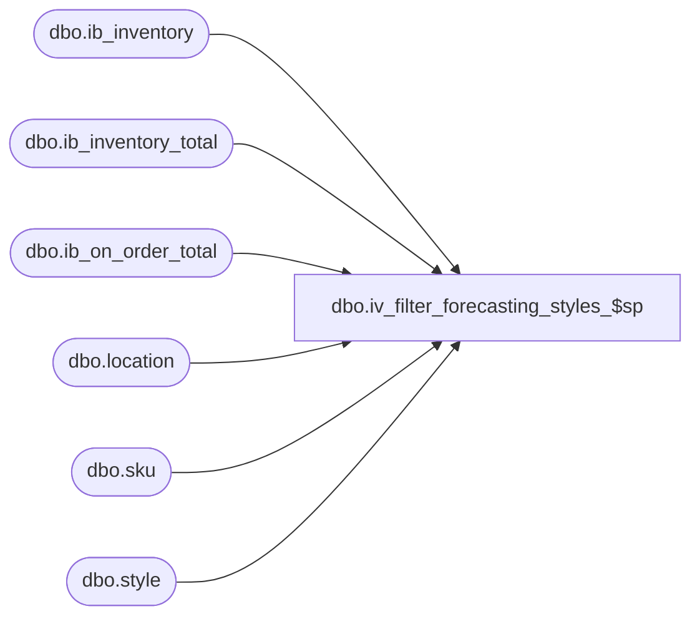

# dbo.iv_filter_forecasting_styles_$sp

**Database:** me_01  
**Server:** bedrockdb02  

## Architecture Diagram



## Table Dependencies

| Referenced Table |
|---|
| dbo.ib_inventory |
| dbo.ib_inventory_total |
| dbo.ib_on_order_total |
| dbo.location |
| dbo.sku |
| dbo.style |

## Stored Procedure Code

```sql
CREATE proc [dbo].[iv_filter_forecasting_styles_$sp] 

@warehouse_code int,
@minimum_warehouse_on_hand int,
@minimum_on_order int,
@rundate datetime,
@number_of_weeks_for_sales int

as

declare @sql nvarchar(2000),
		@warehouse_id int

select @warehouse_id = (select location_id from location
						where location_code = @warehouse_code)

select style_id 
into #z_styles
from style 

if @minimum_warehouse_on_hand >= 0
-- get style on hand
	select style_id, sum (total_on_hand_units) as on_hand
	into #style_oh_totals
	from ib_inventory_total it, sku k
	where it.sku_id = k.sku_id
	and inventory_status_id = 1
	and location_id = @warehouse_id
	group by style_id


if @minimum_on_order >= 0
-- get style on order
	select style_id, sum (total_on_order_units) as on_order
	into #style_oo_totals
	from ib_on_order_total it, sku k
	where it.sku_id = k.sku_id
	and location_id = @warehouse_id
	group by style_id


if @number_of_weeks_for_sales >= 0
begin 
-- get sales units in the last number of specified weeks
	select style_id, sum (transaction_units) as sales_units
	into #style_sales_totals
	from ib_inventory i (nolock), sku k (nolock)
	where i.sku_id = k.sku_id
	and transaction_type_code = 600
	and transaction_date between @rundate - 7*@number_of_weeks_for_sales and @rundate
	group by style_id
-- delete style with no sales in the last 10 days
	delete
	from #z_styles
	where style_id not in 
	(select style_id 
	from #style_sales_totals
	where sales_units < 0
	)
end


if (@minimum_warehouse_on_hand >= 0 AND @minimum_on_order >= 0)
-- delete style with no on hand and no on order
delete
from #z_styles
where (style_id not in 
(select style_id 
from #style_oh_totals
where on_hand >= @minimum_warehouse_on_hand
)
AND
style_id not in
	(
	select style_id 
	from #style_oo_totals
	where on_order >= @minimum_on_order
	)
)

if (@minimum_warehouse_on_hand >= 0 AND @minimum_on_order < 0)
-- delete style with no on hand 
delete
from #z_styles
where style_id not in 
( select style_id 
  from #style_oh_totals
  where on_hand >= @minimum_warehouse_on_hand
)

if (@minimum_warehouse_on_hand < 0 AND @minimum_on_order >= 0)
-- delete style with no on hand and no on order
delete
from #z_styles
where style_id not in
	(
	select style_id 
	from #style_oo_totals
	where on_order >= @minimum_on_order
	)


select style_id from #z_styles
drop table #z_styles
```

