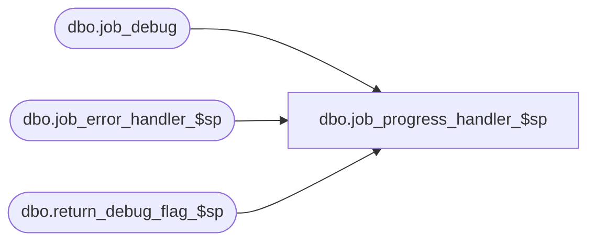

# dbo.job_progress_handler_$sp

**Database:** me_01  
**Server:** bedrockdb02  

## Architecture Diagram



## Table Dependencies

| Referenced Table |
|---|
| dbo.job_debug |
| dbo.job_error_handler_$sp |
| dbo.return_debug_flag_$sp |

## Stored Procedure Code

```sql
CREATE PROCEDURE [dbo].[job_progress_handler_$sp]
	( @job_type INT
	, @job_id INT
	, @proc_name NVARCHAR(80)
	, @debug_line_id SMALLINT
	, @debug_flag BIT = 1  -- specific job debug flag
	)

AS

/*
    Version	: 1.00 
    Date	: 2007/04/24	
    Created by	: Pierrette Lemay
    Description : Logs the progress of a job to the job_debug table if debugging has been turned on in job_params.debug_flag	
*/

BEGIN
    DECLARE @TranCounter INT, @line_id SMALLINT, @job_debug_flag BIT

    SELECT @TranCounter = @@TRANCOUNT,
			@line_id	= 10,
			@job_debug_flag=1

    -- if the specific job debug flag is off, check the debug flag for all jobs
	IF @debug_flag=0 
	BEGIN
	   -- Log progress if job_params.debug_flag is true
	   EXEC return_debug_flag_$sp @job_type, @job_debug_flag OUT;
	END
	
	-- if either of these flags is on, then we do the logging
	IF @debug_flag=1 OR @job_debug_flag=1
	BEGIN

		IF @TranCounter > 0
			-- Procedure called when there is an active transaction.
			-- Create a savepoint to be able to roll back only the work done in the procedure if there is an error.
			SAVE TRANSACTION ProcedureSave
		ELSE
			-- Procedure must start its own transaction.
			BEGIN TRANSACTION

		BEGIN TRY

			INSERT INTO job_debug 
					(job_id 
					, proc_name 
					, debug_line_id 
					, log_timestamp)
			VALUES ( @job_id	
				, @proc_name 
				, @debug_line_id 
				, GETDATE())

			IF @TranCounter = 0
				-- @TranCounter = 0 means no transaction was started before the procedure was called.
				-- The procedure must commit the transaction it started.
				COMMIT TRANSACTION

		END TRY
		BEGIN CATCH
			-- An error occurred; must determine which type of rollback will roll back only the work done in the procedure.
			IF @TranCounter = 0
				-- Transaction started in procedure then Roll back complete transaction.
				ROLLBACK TRANSACTION
			ELSE
				-- Transaction started before procedure called, do not roll back modifications made before the procedure was called.
				IF XACT_STATE() <> -1
					-- If the transaction is still valid, just roll back to the savepoint set at the start of the stored procedure.
					ROLLBACK TRANSACTION ProcedureSave;
					-- If the transaction is uncommitable, a rollback to the savepoint is not allowed
					-- because the savepoint rollback writes to the log. 
					-- Just return to the caller, which should roll back the outer transaction.

			DECLARE @error_msg NVARCHAR(2000), @sql_err_num	DECIMAL(38,0), @object_name NVARCHAR(30), 
					@operation_name NVARCHAR(30), @raise_flag BIT

			SELECT @proc_name		= N'job_progress_handler_$sp' 
				  , @object_name	= N'job_debug'
				  , @operation_name = N'INSERT'
				  , @error_msg		= ERROR_MESSAGE()
				  , @sql_err_num	= ERROR_NUMBER()
				  , @raise_flag		= 1

			EXEC job_error_handler_$sp 
						  @job_type
						, @job_id 
						, @proc_name 
						, @line_id
						, @sql_err_num 
						, @object_name 
						, @operation_name 
						, @error_msg 
						, @raise_flag
		END CATCH
	END
END
```

