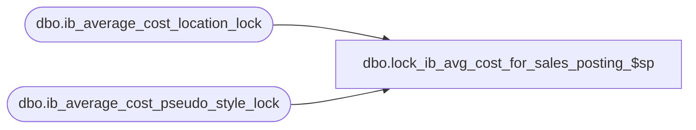

# dbo.lock_ib_avg_cost_for_sales_posting_$sp

**Database:** me_01  
**Server:** bedrockdb02  

## Architecture Diagram



## Table Dependencies

| Referenced Table |
|---|
| dbo.ib_average_cost_location_lock |
| dbo.ib_average_cost_pseudo_style_lock |

## Stored Procedure Code

```sql
CREATE PROCEDURE [dbo].[lock_ib_avg_cost_for_sales_posting_$sp]
	(@identifier NVARCHAR(5),
	@status SMALLINT OUTPUT)
AS

/*
	Version		: 1.00
	Created		: 2012/03/06
	Created by	: Pierrette Lemay
	Description	: This procedure is part of the Sales Posting process and request a lock in order to populate ib_fixed_average_cost_location.
			It's called from .Net component when parameter_system.ib_average_cost_type is set to 'F' and
			parameter_system.ib_average_cost_location_level is set to location (1).
			The lock is acquired before the work done by threads and this lock is kept until all the threads complete their work.
			It receives an in parameter an identifier of the caller : 'BI' or 'MERCH' and returns a status:
				0  : Initial state
				100: The procedure is currently locked by another user.
				110: The procedure errors out.
				120: The procedure completes successfully and got the requested lock.
	History:
*/
BEGIN
	DECLARE @sql_err_num DECIMAL(38,0), @error_msg NVARCHAR(4000), @delay NCHAR(8), @n_retry TINYINT, @ib_avg_cost_reg_style_lock BIT,
		@currently_locked_by NVARCHAR(5), @ib_avg_cost_pseudo_style_lock BIT, @both_tables_locked BIT, @lock_timestamp DATETIME;

	SELECT @both_tables_locked = 0
		, @ib_avg_cost_reg_style_lock = 0
		, @ib_avg_cost_pseudo_style_lock = 0
		, @delay = N'00:00:07'
		, @n_retry = 0
		, @status = 0;

	BEGIN TRY

	WHILE (@ib_avg_cost_reg_style_lock = 0)
	BEGIN
		-- Check if this process locked: to be done later
		SELECT @currently_locked_by = locking_application, @lock_timestamp = lock_timestamp FROM ib_average_cost_location_lock WITH (NOLOCK, NOWAIT);

		IF (@currently_locked_by IS NULL OR @lock_timestamp + 0.25 < GETDATE())
		BEGIN
			UPDATE ib_average_cost_location_lock WITH (TABLOCK) SET locking_application = @identifier, lock_timestamp = getdate();
			SET @ib_avg_cost_reg_style_lock = 1;
		END
		ELSE
		BEGIN
			-- Wait 5 sec and RETRY:  if after 5 retry the lock cannot be acquired then error out.
			WAITFOR DELAY @delay;
			SET @n_retry = @n_retry + 1

			IF @n_retry > 5
			BEGIN
				IF ((SELECT lock_timestamp FROM ib_average_cost_location_lock WITH (NOLOCK, NOWAIT)) IS NULL)
						UPDATE ib_average_cost_location_lock SET lock_timestamp = getdate();
				BREAK;
			END
		END
	END

	IF (@ib_avg_cost_reg_style_lock = 1)
	BEGIN
		WHILE (@ib_avg_cost_pseudo_style_lock = 0)
		BEGIN
			-- Check if this process locked: to be done later
			SELECT @currently_locked_by = locking_application,@lock_timestamp = lock_timestamp FROM ib_average_cost_pseudo_style_lock WITH (NOLOCK, NOWAIT);

			IF (@currently_locked_by IS NULL OR @lock_timestamp + 0.25 < GETDATE())
			BEGIN
				UPDATE ib_average_cost_pseudo_style_lock WITH (TABLOCK) SET locking_application = @identifier,  lock_timestamp = getdate();
				SET @ib_avg_cost_pseudo_style_lock = 1;
			END
			ELSE
			BEGIN
				-- Wait 5 sec and RETRY:  if after 5 retry the lock cannot be acquired then error out.
				WAITFOR DELAY @delay;
				SET @n_retry = @n_retry + 1

				IF @n_retry > 5
				BEGIN
					-- we already have a lock on the fixed cost location table, need to release it
					UPDATE ib_average_cost_location_lock WITH (TABLOCK) SET locking_application = NULL, lock_timestamp = NULL;

					--if we failed to obtain a lock for which there is no timstamp, add the current date time
					IF ((SELECT lock_timestamp FROM ib_average_cost_pseudo_style_lock WITH (NOLOCK, NOWAIT)) IS NULL)
						UPDATE ib_average_cost_pseudo_style_lock SET lock_timestamp = getdate();

					BREAK;
				END
			END
		END
	END

	IF (@ib_avg_cost_reg_style_lock = 1 AND @ib_avg_cost_pseudo_style_lock = 1)
		SET @status = 120;
	ELSE
		SET @status = 100;

	END TRY

	BEGIN CATCH

		SELECT @status = 110, @error_msg = N'Error in procedure lock_ib_avg_cost_for_sales_posting_$sp: ' + CAST(ERROR_NUMBER() AS NVARCHAR) + N' ' + ERROR_MESSAGE();
		RAISERROR (@error_msg, 16, 1);
	END CATCH
END
```

