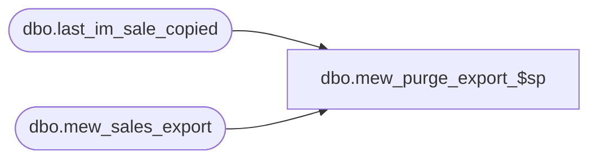

# dbo.mew_purge_export_$sp

**Database:** me_01  
**Server:** bedrockdb02  

## Architecture Diagram



## Table Dependencies

| Referenced Table |
|---|
| dbo.last_im_sale_copied |
| dbo.mew_sales_export |

## Stored Procedure Code

```sql
-----------------------------------------------------------------------------------------------------------------------------
--	Main Query: Create Procedure
-----------------------------------------------------------------------------------------------------------------------------

CREATE PROCEDURE dbo.mew_purge_export_$sp

	 @nb_days_keep_trans AS INT

AS

SET NOCOUNT ON

-----------------------------------------------------------------------------------------------------------------------------
--	Declarations / Sets: Declare And Set Variables
-----------------------------------------------------------------------------------------------------------------------------

DECLARE
	 @Error_Line AS INT
	,@Error_Message AS NVARCHAR (4000)
	,@Error_Number AS INT
	,@Error_Procedure AS NVARCHAR (128)
	,@Error_Severity AS INT
	,@Error_State AS INT
	,@Batch_Size AS INT = 50000
	,@Row_Count AS INT
	,@Floor_Date AS DATETIME
	,@Last_Im_Sale_Number AS DECIMAL(24,0) = (SELECT im_sale_number FROM last_im_sale_copied)

SET @Row_Count = @Batch_Size

BEGIN TRY

	-- Find the floor date that will be used as the minimum date to keep in the table
	SELECT @Floor_Date = DATEADD(day, -@nb_days_keep_trans, GETDATE()) ;

	WHILE (@Row_Count = @Batch_Size)
	BEGIN

		DELETE TOP (@Batch_Size)
		FROM mew_sales_export
		WHERE 
			transaction_date < @Floor_Date
			AND identity_no < @Last_Im_Sale_Number

		SET @Row_Count = @@ROWCOUNT

	END

END TRY
BEGIN CATCH

	IF @@TRANCOUNT > 0
	BEGIN

		ROLLBACK TRANSACTION

	END

	SET @Error_Line = ERROR_LINE ()
	SET @Error_Message = N'Msg %d, Level %d, State %d, Procedure %s, Line %d' + NCHAR (13) + NCHAR (10) + ERROR_MESSAGE ()
	SET @Error_Number = ERROR_NUMBER ()
	SET @Error_Procedure = ERROR_PROCEDURE ()
	SET @Error_Severity = ERROR_SEVERITY ()
	SET @Error_State = ERROR_STATE ()


	RAISERROR

		(
			 @Error_Message
			,@Error_Severity
			,@Error_State
			,@Error_Number -- Original Error Number
			,@Error_Severity -- Original Error Severity
			,@Error_State -- Original Error State
			,@Error_Procedure -- Original Error Procedure Name
			,@Error_Line -- Original Error Line Number
		)

END CATCH
```

