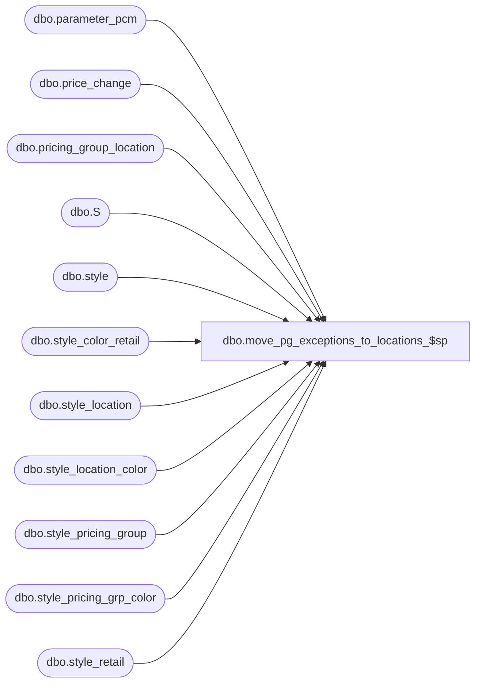

# dbo.move_pg_exceptions_to_locations_$sp

**Database:** me_01  
**Server:** bedrockdb02  

## Architecture Diagram



## Table Dependencies

| Referenced Table |
|---|
| dbo.parameter_pcm |
| dbo.price_change |
| dbo.pricing_group_location |
| dbo.S |
| dbo.style |
| dbo.style_color_retail |
| dbo.style_location |
| dbo.style_location_color |
| dbo.style_pricing_group |
| dbo.style_pricing_grp_color |
| dbo.style_retail |

## Stored Procedure Code

```sql
-----------------------------------------------------------------------------------------------------------------------------
--	Main Query: Create Procedure
-----------------------------------------------------------------------------------------------------------------------------

CREATE PROCEDURE dbo.move_pg_exceptions_to_locations_$sp

	 @Error_Code AS SMALLINT = 0 OUTPUT

AS

--	Object GUID: 0DCB2CD3-6910-4F42-8788-E324A6D98FF8

SET TRANSACTION ISOLATION LEVEL READ UNCOMMITTED
SET NOCOUNT ON


-----------------------------------------------------------------------------------------------------------------------------
--	Declarations / Sets: Declare And Set Variables
-----------------------------------------------------------------------------------------------------------------------------

DECLARE
	 @Error_Line AS INT
	,@Error_Message AS NVARCHAR (4000)
	,@Error_Number AS INT
	,@Error_Procedure AS NVARCHAR (128)
	,@Error_Severity AS INT
	,@Error_State AS INT
	,@Row_Count AS INT

-- Enumeriation for procedure specific error codes
-- 0: No error
-- 1: Pricing by instruction is already enabled
-- 2: All permanent and promotional price change documents must either be completed, cancelled or deleted before pricing by instruction can be turned on.

-- Pricing by instruction must not already be enabled
IF EXISTS (SELECT 1 FROM dbo.parameter_pcm WHERE price_by_instruction_flag = 1)
BEGIN

	SET @Error_Code = 1
	RETURN

END

IF EXISTS (SELECT 1 FROM dbo.price_change WHERE price_change_status NOT IN (5,6))
BEGIN

	SET @Error_Code = 2
	RETURN

END

IF OBJECT_ID (N'tempdb.dbo.#style_location', N'U') IS NOT NULL
BEGIN

	DROP TABLE dbo.#style_location

END

IF OBJECT_ID (N'tempdb.dbo.#style_location_color', N'U') IS NOT NULL
BEGIN

	DROP TABLE dbo.#style_location_color

END

CREATE TABLE dbo.#style_location

	(
		 style_location_id DECIMAL (13, 0)
		,style_id DECIMAL (12, 0)
	)

CREATE TABLE dbo.#style_location_color

	(
		 style_location_color_id DECIMAL (13, 0)
		,style_id DECIMAL (12, 0)
		,style_color_id DECIMAL (13, 0)
	)

BEGIN TRY

	BEGIN TRANSACTION

		INSERT INTO dbo.#style_location

			(
				 style_location_id
				,style_id
			)

		SELECT
			 sqINS.style_location_id
			,sqINS.style_id
		FROM

			(
				INSERT INTO dbo.style_location

					(
						 style_location_id
						,style_id
						,location_id
						,jurisdiction_id
						,original_selling_retail
						,original_valuation_retail
						,original_price_status_id
						,current_selling_retail
						,current_valuation_retail
						,current_price_status_id
					)

				OUTPUT
					 inserted.style_location_id
					,inserted.style_id

				SELECT
					 ROW_NUMBER () OVER
										(
											PARTITION BY
												S.style_id
											ORDER BY
												(SELECT NULL)
										) + ((100000 * S.style_id) + S.last_item_id) AS style_location_id
					,SPG.style_id
					,PGL.location_id
					,SPG.jurisdiction_id
					,SPG.original_selling_retail
					,SPG.original_valuation_retail
					,SPG.original_price_status_id
					,SPG.current_selling_retail
					,SPG.current_valuation_retail
					,SPG.current_price_status_id
				FROM
					dbo.style_pricing_group SPG
				INNER JOIN dbo.style S ON S.style_id = SPG.style_id
				INNER JOIN dbo.pricing_group_location PGL ON PGL.pricing_group_id = SPG.pricing_group_id
				WHERE
					NOT EXISTS
						(
							SELECT 1
							FROM
								dbo.style_location SL
							WHERE
								SL.style_id = SPG.style_id
								AND SL.location_id = PGL.location_id
								AND SL.jurisdiction_id = SPG.jurisdiction_id
						)
					AND NOT EXISTS
						(
							SELECT 1
							FROM
								style_retail SR
							WHERE
								SR.style_id = SPG.style_id
								AND SR.jurisdiction_id = SPG.jurisdiction_id
								AND SR.current_selling_retail = SPG.current_selling_retail
								AND SR.current_valuation_retail = SPG.current_valuation_retail
								AND SR.current_price_status_id = SPG.current_price_status_id
						)
			) sqINS


		SET @Row_Count = @@ROWCOUNT

		IF @Row_Count > 0
		BEGIN

			UPDATE
				S
			SET
				S.last_item_id = S.last_item_id + sqTO.occurrences
			FROM
				dbo.style S
				INNER JOIN

					(
						SELECT
							 ttSL.style_id
							,COUNT (*) AS occurrences
						FROM
							dbo.#style_location ttSL
						GROUP BY
							ttSL.style_id
					) sqTO ON sqTO.style_id = S.style_id

			IF OBJECT_ID (N'tempdb.dbo.#style_location', N'U') IS NOT NULL
			BEGIN

				DROP TABLE dbo.#style_location

			END

			SET @Row_Count = 0

		END

		INSERT INTO dbo.#style_location_color

			(
				style_location_color_id
				,style_id
				,style_color_id
			)

		SELECT
			sqINS.style_location_color_id
			,sqINS.style_id
			,sqINS.style_color_id
		FROM

			(
				INSERT INTO dbo.style_location_color

					(
						style_location_color_id
						,style_id
						,location_id
						,style_color_id
						,jurisdiction_id
						,original_selling_retail
						,original_valuation_retail
						,original_price_status_id
						,current_selling_retail
						,current_valuation_retail
						,current_price_status_id
					)

				OUTPUT
					inserted.style_location_color_id
					,inserted.style_id
					,inserted.style_color_id

				SELECT
						ROW_NUMBER () OVER
										(
											PARTITION BY
												S.style_id
											ORDER BY
												(SELECT NULL)
										) + ((100000 * S.style_id) + S.last_item_id) AS style_location_color_id
					,SPGC.style_id
					,PGL.location_id
					,SPGC.style_color_id
					,SPGC.jurisdiction_id
					,SPGC.original_selling_retail
					,SPGC.original_valuation_retail
					,SPGC.original_price_status_id
					,SPGC.current_selling_retail
					,SPGC.current_valuation_retail
					,SPGC.current_price_status_id
				FROM
					dbo.style_pricing_grp_color SPGC
				INNER JOIN dbo.style S ON S.style_id = SPGC.style_id
				INNER JOIN dbo.pricing_group_location PGL ON PGL.pricing_group_id = SPGC.pricing_group_id
				WHERE
					NOT EXISTS
						(
							SELECT 1
							FROM
								dbo.style_location_color SLC
							WHERE
								SLC.style_id = SPGC.style_id
								AND SLC.location_id = PGL.location_id
								AND SLC.jurisdiction_id = SPGC.jurisdiction_id
						)
					AND NOT EXISTS
						(
							SELECT 1
							FROM
								dbo.style_location SL
							WHERE
								SL.style_id = SPGC.style_id
								AND SL.location_id = PGL.location_id
								AND SL.jurisdiction_id = SPGC.jurisdiction_id
								AND SL.current_selling_retail = SPGC.current_selling_retail
								AND SL.current_valuation_retail = SPGC.current_valuation_retail
								AND SL.current_price_status_id = SPGC.current_price_status_id
						)
					AND NOT EXISTS
						(
							SELECT 1
							FROM
								style_color_retail SCR
							WHERE
								SCR.style_id = SPGC.style_id
								AND SCR.style_color_id = SPGC.style_color_id
								AND SCR.jurisdiction_id = SPGC.jurisdiction_id
								AND SCR.current_selling_retail = SPGC.current_selling_retail
								AND SCR.current_valuation_retail = SPGC.current_valuation_retail
								AND SCR.current_price_status_id = SPGC.current_price_status_id
						)
					AND NOT EXISTS
						(
							SELECT 1
							FROM
								style_retail SR
							WHERE
								SR.style_id = SPGC.style_id
								AND SR.jurisdiction_id = SPGC.jurisdiction_id
								AND SR.current_selling_retail = SPGC.current_selling_retail
								AND SR.current_valuation_retail = SPGC.current_valuation_retail
								AND SR.current_price_status_id = SPGC.current_price_status_id
						)
			) sqINS


		SET @Row_Count = @@ROWCOUNT

		IF @Row_Count > 0
		BEGIN

			UPDATE
				S
			SET
				S.last_item_id = S.last_item_id + sqTO.occurrences
			FROM
				dbo.style S
				INNER JOIN

					(
						SELECT
							 ttSLC.style_id
							,COUNT (*) AS occurrences
						FROM
							dbo.#style_location_color ttSLC
						GROUP BY
							ttSLC.style_id
					) sqTO ON sqTO.style_id = S.style_id

			IF OBJECT_ID (N'tempdb.dbo.#style_location', N'U') IS NOT NULL
			BEGIN

				DROP TABLE dbo.#style_location

			END

			SET @Row_Count = 0

		END

	COMMIT TRANSACTION

	TRUNCATE TABLE dbo.style_pricing_group
	TRUNCATE TABLE dbo.style_pricing_grp_color

	RETURN

END TRY
BEGIN CATCH

	IF @@TRANCOUNT > 0
	BEGIN

		ROLLBACK TRANSACTION

	END

	SET @Error_Code = 6

	SET @Error_Line = ERROR_LINE ()
	SET @Error_Message = N'Msg %d, Level %d, State %d, Procedure %s, Line %d' + NCHAR (13) + NCHAR (10) + ERROR_MESSAGE ()
	SET @Error_Number = ERROR_NUMBER ()
	SET @Error_Procedure = ERROR_PROCEDURE ()
	SET @Error_Severity = ERROR_SEVERITY ()
	SET @Error_State = ERROR_STATE ()


	RAISERROR

		(
			 @Error_Message
			,@Error_Severity
			,@Error_State
			,@Error_Number -- Original Error Number
			,@Error_Severity -- Original Error Severity
			,@Error_State -- Original Error State
			,@Error_Procedure -- Original Error Procedure Name
			,@Error_Line -- Original Error Line Number
		)

END CATCH
```

