# dbo.no_wms_create_ss_$sp

**Database:** me_01  
**Server:** bedrockdb02  

## Architecture Diagram

```mermaid
flowchart LR
    SP["dbo.no_wms_create_ss_$sp"]
    dbo_country(["dbo.country"]) --> SP
    dbo_currency_conversion(["dbo.currency_conversion"]) --> SP
    dbo_d(["dbo.d"]) --> SP
    dbo_dist_detail(["dbo.dist_detail"]) --> SP
    dbo_dist_detail_pack(["dbo.dist_detail_pack"]) --> SP
    dbo_dist_line(["dbo.dist_line"]) --> SP
    dbo_dist_location(["dbo.dist_location"]) --> SP
    dbo_dist_source_sku_qty(["dbo.dist_source_sku_qty"]) --> SP
    dbo_FNDTN_VIEW_SCRTY_USER(["dbo.FNDTN_VIEW_SCRTY_USER"]) --> SP
    dbo_get_avg_cost__sp(["dbo.get_avg_cost_$sp"]) --> SP
    dbo_get_cost_rate__sp(["dbo.get_cost_rate_$sp"]) --> SP
    dbo_get_pricing__sp(["dbo.get_pricing_$sp"]) --> SP
    dbo_ib_allocation(["dbo.ib_allocation"]) --> SP
    dbo_ib_audit_trail(["dbo.ib_audit_trail"]) --> SP
    dbo_ib_intrastat(["dbo.ib_intrastat"]) --> SP
    dbo_ib_replication_queue(["dbo.ib_replication_queue"]) --> SP
    dbo_im_replication_queue(["dbo.im_replication_queue"]) --> SP
    dbo_inventory_pack_update__sp(["dbo.inventory_pack_update_$sp"]) --> SP
    dbo_inventory_update2__sp(["dbo.inventory_update2_$sp"]) --> SP
    dbo_jurisdiction(["dbo.jurisdiction"]) --> SP
    dbo_location(["dbo.location"]) --> SP
    dbo_lock_no_wms_proc(["dbo.lock_no_wms_proc"]) --> SP
    dbo_pack(["dbo.pack"]) --> SP
    dbo_pack_sku(["dbo.pack_sku"]) --> SP
    dbo_parameter_im(["dbo.parameter_im"]) --> SP
    dbo_parameter_system(["dbo.parameter_system"]) --> SP
    dbo_s(["dbo.s"]) --> SP
    dbo_sd(["dbo.sd"]) --> SP
    dbo_sku(["dbo.sku"]) --> SP
    dbo_store_shipment(["dbo.store_shipment"]) --> SP
    dbo_store_shipment__seq(["dbo.store_shipment_$seq"]) --> SP
    dbo_store_shipment_detail(["dbo.store_shipment_detail"]) --> SP
    dbo_style(["dbo.style"]) --> SP
    dbo_style_color(["dbo.style_color"]) --> SP
    dbo_style_detail(["dbo.style_detail"]) --> SP
    dbo_transaction_reason(["dbo.transaction_reason"]) --> SP
    dbo_ttSSD(["dbo.ttSSD"]) --> SP
    dbo_ttUD(["dbo.ttUD"]) --> SP
    dbo_u(["dbo.u"]) --> SP
    dbo_ud(["dbo.ud"]) --> SP
    dbo_user_def_adj_detail(["dbo.user_def_adj_detail"]) --> SP
    dbo_user_defined_adjustment(["dbo.user_defined_adjustment"]) --> SP
    dbo_user_defined_adjustment__seq(["dbo.user_defined_adjustment_$seq"]) --> SP
```



## Table Dependencies

| Referenced Table |
|---|
| dbo.country |
| dbo.currency_conversion |
| dbo.d |
| dbo.dist_detail |
| dbo.dist_detail_pack |
| dbo.dist_line |
| dbo.dist_location |
| dbo.dist_source_sku_qty |
| dbo.FNDTN_VIEW_SCRTY_USER |
| dbo.get_avg_cost_$sp |
| dbo.get_cost_rate_$sp |
| dbo.get_pricing_$sp |
| dbo.ib_allocation |
| dbo.ib_audit_trail |
| dbo.ib_intrastat |
| dbo.ib_replication_queue |
| dbo.im_replication_queue |
| dbo.inventory_pack_update_$sp |
| dbo.inventory_update2_$sp |
| dbo.jurisdiction |
| dbo.location |
| dbo.lock_no_wms_proc |
| dbo.pack |
| dbo.pack_sku |
| dbo.parameter_im |
| dbo.parameter_system |
| dbo.s |
| dbo.sd |
| dbo.sku |
| dbo.store_shipment |
| dbo.store_shipment_$seq |
| dbo.store_shipment_detail |
| dbo.style |
| dbo.style_color |
| dbo.style_detail |
| dbo.transaction_reason |
| dbo.ttSSD |
| dbo.ttUD |
| dbo.u |
| dbo.ud |
| dbo.user_def_adj_detail |
| dbo.user_defined_adjustment |
| dbo.user_defined_adjustment_$seq |

## Stored Procedure Code

```sql
CREATE PROCEDURE dbo.no_wms_create_ss_$sp

	(
		@security_user_id AS INT
	)

AS

--Description: Creates store shipments from AR when client does not have our WMS system (MERCH 4.3)


-- The table #_distro_numbers is created in .NET AR Code (DistributionWithoutWMSPersistence.cs)
-- This table has the distributions for which we have to create store shipments and possibly UDAs
-- It has the following columns all of which can be found in the distribution table:
	-- distribution_id
	-- distribution_number
	-- from_location_id
	-- reserve_location_id
	-- po_no
	-- expected_receipt_date
	-- prop_use_pack_details


-- STORE SHIPMENTS WILL BE CREATED FOR EVERY DISTINCT COMBINATION OF THE FOLLOWING:
	-- TO_LOCATION_ID: RECEIVING LOCATION
	-- FROM_LOCATION_ID: SENDING LOCATION
	-- EXPECTED_RECEIPT_DATE: EXPECTED RECEIPT DATE OF SHIPMENT / LOCATION FROM DIST_LOCATION


-- UDAS WILL BE CREATED FOR EVERY DISTRIBUTION FOR THE FOLLOWING CONDITIONS:
	-- SENDING AND RESERVE LOCATIONS ARE NOT THE SAME
	-- RESERVE QUANTITY IS NOT ZERO

SET NOCOUNT ON


-----------------------------------------------------------------------------------------------------------------------------
--	Declarations / Sets: Declare And Set Variables
-----------------------------------------------------------------------------------------------------------------------------

DECLARE
	 @audit_trail_activity AS NVARCHAR (20)
	,@audit_trail_application AS NVARCHAR (10)
	,@audit_trail_application_type AS NVARCHAR (40)
	,@count_ss_detail AS INT
	,@count_uda_detail AS INT
	,@current_date AS SMALLDATETIME
	,@current_date_time AS DATETIME
	,@dr_entity_code AS SMALLINT
	,@dummy_lock AS BIT
	,@dummy_val AS SMALLINT
	,@employee_first_name AS NVARCHAR (30)
	,@employee_last_name AS NVARCHAR (30)
	,@errmsg AS NVARCHAR (255)
	,@errno AS INT
	,@first_store_ship_no AS NVARCHAR (20)
	,@first_user_def_adj_no AS NVARCHAR (20)
	,@ib_price_discrep_decr_location AS SMALLINT
	,@ib_price_discrep_decr_pc_type AS SMALLINT
	,@ib_price_discrep_inc_location AS SMALLINT
	,@ib_price_discrep_inc_pc_type AS SMALLINT
	,@inventory_status_id AS SMALLINT
	,@i_replication_action AS NVARCHAR (2)
	,@ir_replication_action AS NVARCHAR (2)
	,@last_generated_store_ship_no AS NVARCHAR (20)
	,@last_generated_user_def_adj_no AS NVARCHAR (20)
	,@last_store_ship_no AS NVARCHAR (20)
	,@last_user_def_adj_no AS NVARCHAR (20)
	,@max_store_shipment_id AS DECIMAL (12, 0)
	,@max_user_defined_adjustment_id AS DECIMAL (12, 0)
	,@not_applicable AS NVARCHAR (3)
	,@received_im_doc AS SMALLINT
	,@received_state AS SMALLINT
	,@sd_entity_code AS SMALLINT
	,@sent_im_doc AS SMALLINT
	,@sent_state AS SMALLINT
	,@store_ship_no_mask AS NVARCHAR (20)
	,@store_ship_no_rec_flag AS BIT
	,@transaction_reason_id AS SMALLINT
	,@transaction_type_code AS INT
	,@u_replication_action AS NVARCHAR (2)
	,@user_def_adj_no_mask AS NVARCHAR (20)
	,@user_def_adj_no_rec_flag AS BIT


DECLARE @From_Location_Exchange_Rate AS TABLE

	(
		 from_location_id SMALLINT NOT NULL
		,exchange_rate DECIMAL (18, 6) NULL
		,PRIMARY KEY (from_location_id)
	)


DECLARE @To_Location_Exchange_Rate AS TABLE

	(
		 to_location_id SMALLINT NOT NULL
		,exchange_rate DECIMAL (18, 6) NULL
		,PRIMARY KEY (to_location_id)
	)


SET @count_ss_detail = 0


SET @count_uda_detail = 0


SET @current_date_time = GETDATE ()


SET @current_date = CONVERT (SMALLDATETIME, CONVERT (CHAR (8), @current_date_time, 112))


SET @received_im_doc = 4


SET @received_state = 2


SET @sent_im_doc = 3


SET @sent_state = 1


-----------------------------------------------------------------------------------------------------------------------------
--	Error Trapping: Check If Temp Table(s) Already Exist(s) And Drop If Applicable
-----------------------------------------------------------------------------------------------------------------------------

IF OBJECT_ID (N'tempdb..#ib_inventory', N'U') IS NOT NULL
BEGIN

	DROP TABLE #ib_inventory

END


IF OBJECT_ID (N'tempdb..#ib_pack_inventory', N'U') IS NOT NULL
BEGIN

	DROP TABLE #ib_pack_inventory

END


IF OBJECT_ID (N'tempdb..#pack_detail', N'U') IS NOT NULL
BEGIN

	DROP TABLE #pack_detail

END


IF OBJECT_ID (N'tempdb..#store_shipment', N'U') IS NOT NULL
BEGIN

	DROP TABLE #store_shipment

END


IF OBJECT_ID (N'tempdb..#store_shipment_detail', N'U') IS NOT NULL
BEGIN

	DROP TABLE #store_shipment_detail

END


IF OBJECT_ID (N'tempdb.dbo.#temp_avg_costs', N'U') IS NOT NULL
BEGIN

	DROP TABLE dbo.#temp_avg_costs

END


IF OBJECT_ID (N'tempdb.dbo.#temp_cost_rates',  N'U') IS NOT NULL
BEGIN

	DROP TABLE dbo.#temp_cost_rates

END


IF OBJECT_ID (N'tempdb.dbo.#temp_retro_prices', N'U') IS NOT NULL
BEGIN

	DROP TABLE dbo.#temp_retro_prices

END


IF OBJECT_ID (N'tempdb.dbo.#temp_wrk_avg_cost_lookup', N'U') IS NOT NULL
BEGIN

	DROP TABLE dbo.#temp_wrk_avg_cost_lookup

END


IF OBJECT_ID (N'tempdb.dbo.#temp_wrk_cost_rate_lookup',  N'U') IS NOT NULL
BEGIN

	DROP TABLE dbo.#temp_wrk_cost_rate_lookup

END


IF OBJECT_ID (N'tempdb.dbo.#temp_wrk_price_lookup', N'U') IS NOT NULL
BEGIN

	DROP TABLE dbo.#temp_wrk_price_lookup

END


IF OBJECT_ID (N'tempdb..#uda_detail', N'U') IS NOT NULL
BEGIN

	DROP TABLE #uda_detail

END


IF OBJECT_ID (N'tempdb..#user_def_adj_detail', N'U') IS NOT NULL
BEGIN

	DROP TABLE #user_def_adj_detail

END


IF OBJECT_ID (N'tempdb..#user_defined_adjustment', N'U') IS NOT NULL
BEGIN

	DROP TABLE #user_defined_adjustment

END


-----------------------------------------------------------------------------------------------------------------------------
--	Table Create: Create Table Shells
-----------------------------------------------------------------------------------------------------------------------------

CREATE TABLE #ib_inventory

	(
		 ib_inventory_id DECIMAL (12) IDENTITY (1, 1) NOT NULL
		,sku_id DECIMAL (13) NOT NULL
		,location_id SMALLINT NOT NULL
		,price_status_id SMALLINT NOT NULL
		,transaction_date SMALLDATETIME NOT NULL
		,transaction_type_code SMALLINT NOT NULL
		,inventory_status_id SMALLINT NOT NULL
		,other_location_id SMALLINT NULL
		,transaction_reason_id SMALLINT NULL
		,document_number NVARCHAR (20) NULL
		,transaction_units INT NOT NULL
		,transaction_cost DECIMAL (14, 2) NOT NULL
		,transaction_cost_loc DECIMAL (14, 2) NOT NULL
		,transaction_valuation_retail DECIMAL (14, 2) NOT NULL
		,transaction_selling_retail DECIMAL (14, 2) NOT NULL
		,price_change_type SMALLINT NULL
		,units_affected INT NULL
	)


CREATE TABLE #ib_pack_inventory

	(
		 ib_pack_inventory_id DECIMAL (12, 0) IDENTITY (1, 1) NOT NULL
		,pack_id DECIMAL (12, 0) NOT NULL
		,location_id SMALLINT NOT NULL
		,transaction_date SMALLDATETIME NOT NULL
		,transaction_type_code SMALLINT NOT NULL
		,other_location_id SMALLINT NULL
		,document_number NVARCHAR (20) NULL
		,transaction_units INT NOT NULL DEFAULT (0)
		,distribution_id BIGINT NULL
	)


CREATE TABLE #pack_detail

	(
		 id INT IDENTITY (1, 1) NOT NULL
		,distribution_id BIGINT NOT NULL -- id of distribution document
		,location_id SMALLINT NOT NULL -- sending location
		,from_loc_jurisdiction_id SMALLINT NULL
		,reserve_location_id SMALLINT NULL -- reserve location
		,reserve_loc_jurisdiction_id SMALLINT NULL
		,pack_id DECIMAL (13, 0) NOT NULL -- pack being shipped
		,style_id DECIMAL (13, 0) NOT NULL
		,quantity INT NOT NULL -- number of pack units being distributed
		,reserve_quantity INT NOT NULL -- number of pack units to be placed on reserve
		,PRIMARY KEY (id)
		,UNIQUE (distribution_id, location_id, reserve_location_id, pack_id)
	)


CREATE TABLE #store_shipment

	(
		 id INT IDENTITY (1, 1) NOT NULL
		,location_code NVARCHAR (20) NOT NULL -- receiving location code
		,location_id SMALLINT NOT NULL -- receiving location
		,from_location_id SMALLINT NOT NULL -- sending location
		,expected_receipt_date SMALLDATETIME NOT NULL -- expected receipt date of shipment / location
		,store_shipment_id DECIMAL (12, 0) NULL -- id of store shipment document being generated
		,document_no NVARCHAR (20) NULL -- document number of store shipment to be generated
		,state_no SMALLINT  DEFAULT (1) NOT NULL -- state of store shipment
		,document_status SMALLINT DEFAULT (3) NOT NULL -- status of store shipment
		,create_date SMALLDATETIME NOT NULL -- date the store shipment was created
		,print_flag BIT DEFAULT (0) NOT NULL
		,ship_date SMALLDATETIME NOT NULL -- date the store shipment was shipped
		,receive_date SMALLDATETIME NULL -- date the store shipment was received
		,last_activity_date SMALLDATETIME NOT NULL
		,updatestamp SMALLINT DEFAULT (0) NOT NULL
		,last_item_id DECIMAL (13, 0) NOT NULL -- in this case, this will be equal to the number of details on the store shipment
		,offset DECIMAL (13, 0) NULL -- value representing the total number of details for the store shipments "created" before this one (within the same run)
										-- example:
											-- store shipment 1 has 3 details -- last_item_id = 3, offset = 0
											-- store shipment 2 has 4 details -- last_item_id = 4, offset = 3
											-- store shipment 3 has 2 details -- last_item_id = 2, offset = 7
		,PRIMARY KEY (id)
		,UNIQUE (location_id, from_location_id, expected_receipt_date)
	)


CREATE TABLE #store_shipment_detail

	(
		 id INT IDENTITY (1, 1) NOT NULL
		,to_location_code NVARCHAR (20) NOT NULL
		,to_location_id SMALLINT NOT NULL -- receiving location
		,to_loc_jurisdiction_id SMALLINT NULL -- receiving location's jurisdiction
		,from_location_id SMALLINT NOT NULL -- sending location
		,from_loc_jurisdiction_id SMALLINT NULL -- sending location's jurisdiction
		,expected_receipt_date SMALLDATETIME NOT NULL -- expected receipt date of shipment / location from dist_location
		,auto_receive_shipments_flag BIT NOT NULL -- flag indicating whether or not shipments should be automatically received
		,sku_id DECIMAL (13, 0) NOT NULL -- item being shipped
		,distribution_no NVARCHAR (20) NOT NULL -- document number of the distribution
		,po_no NVARCHAR (20) NULL -- document number of po from which the distribution was created
		,style_color_id DECIMAL (13, 0) NOT NULL -- style_color_id of sku_id
		,style_id DECIMAL (12, 0) NOT NULL -- style_id of sku_id
		,color_id SMALLINT NOT NULL -- color_id of sku_id
		,units_sent INT NOT NULL -- number of units sent to receiving location
		,average_cost DECIMAL (18, 6) NULL -- average cost of item being shipped (in home currency)
		,average_cost_from_loc DECIMAL (18, 6) NULL -- average cost of item being shipped in the sending location's currency
		,average_cost_to_loc DECIMAL (18, 6) NULL -- average cost of item being shipped in the receiving location's currency
		,f_price_status_id SMALLINT NULL -- current price status of item at the sending location
		,f_valuation_retail_price DECIMAL (14, 2) NULL -- valuation price of item at the sending location
		,f_selling_retail_price DECIMAL (14, 2) NULL -- selling price of item at the sending location
		,f_price_change_type SMALLINT NULL -- price change type at sending location
		,t_price_status_id SMALLINT NULL -- current price status of item at the receiving location
		,t_valuation_retail_price DECIMAL (14, 2) NULL -- valuation price of item at the receiving location
		,t_selling_retail_price DECIMAL (14, 2) NULL -- selling price of item at the receiving location
		,t_price_change_type SMALLINT NULL -- price change type at receiving location
		,PRIMARY KEY (id)
		,UNIQUE (to_location_id, from_location_id, expected_receipt_date, sku_id, distribution_no)
	)


CREATE TABLE dbo.#temp_avg_costs

	(
		 location_id SMALLINT NULL
		,sku_id DECIMAL (13, 0) NULL
		,avg_cost DECIMAL (18, 12) NULL
		,avg_cost_local DECIMAL (18, 12) NULL
		,sum_units int NULL
		,sum_cost DECIMAL (18, 6) NULL
		,sum_cost_local DECIMAL (18, 6) NULL
	)


CREATE TABLE dbo.#temp_cost_rates

	(
		 jurisdiction_id SMALLINT NULL
		,transaction_date SMALLDATETIME NULL
		,cost_rate FLOAT NULL
	)


CREATE TABLE dbo.#temp_retro_prices

	(
		 location_id SMALLINT NULL
		,sku_id DECIMAL (13, 0) NULL
		,document_number NVARCHAR (20)
		,effective_date SMALLDATETIME
		,price_change_type SMALLINT
		,new_price_status_id SMALLINT NULL
		,new_val_unit_retail DECIMAL (14, 2) NULL
		,new_sell_unit_retail DECIMAL (14, 2) NULL
	)


CREATE TABLE dbo.#temp_wrk_avg_cost_lookup

	(
		 jurisdiction_id SMALLINT NULL
		,location_id SMALLINT NULL
		,style_id DECIMAL (12, 0) NULL
		,sku_id DECIMAL (13, 0) NULL
	)


CREATE TABLE dbo.#temp_wrk_cost_rate_lookup

	(
		 jurisdiction_id SMALLINT NULL
		,transaction_date SMALLDATETIME NULL
	)


CREATE TABLE dbo.#temp_wrk_price_lookup

	(
		 jurisdiction_id SMALLINT NULL
		,location_id SMALLINT NULL
		,style_id DECIMAL (12, 0) NULL
		,color_id SMALLINT NULL
		,style_color_id DECIMAL (13, 0) NULL
		,sku_id DECIMAL (13, 0) NULL
	)


CREATE TABLE #uda_detail

	(
		 id INT IDENTITY (1, 1) NOT NULL
		,distribution_id BIGINT NOT NULL -- id of distribution document
		,expected_receipt_date SMALLDATETIME NOT NULL -- expected receipt date of distribution document
		,location_id SMALLINT NOT NULL -- sending location
		,from_loc_jurisdiction_id SMALLINT NULL -- sending location's jurisdiction
		,reserve_location_id SMALLINT NULL -- reserve location
		,reserve_loc_jurisdiction_id SMALLINT NULL -- reserve location's jurisdiction
		,sku_id DECIMAL (13, 0) NOT NULL -- item being placed on reserve
		,pack_id DECIMAL (13, 0) NULL -- pack being placed on reserve
		,style_color_id DECIMAL (13, 0) NOT NULL -- style_color_id of sku_id
		,style_id DECIMAL (12, 0) NOT NULL -- style_id of sku_id
		,color_id SMALLINT NOT NULL -- color_id of sku_id
		,distribution_no NVARCHAR (20) NOT NULL -- document number of the distribution
		,po_no NVARCHAR (20) NULL -- document number of po from which the distribution was created
		,units_to_adjust INT NOT NULL -- number of units being removed from sending location and being added to reserve location
		,average_cost DECIMAL (18, 6) NULL -- average cost of item being shipped (in home currency)
		,average_cost_loc DECIMAL (18, 6) NULL -- average cost of item being shipped in sending location's currency
		,average_cost_res_loc DECIMAL (18, 6) NULL -- average cost of item being shipped in reserve location's currency
		,f_valuation_retail_price DECIMAL (14, 2) NULL -- current price status of item at the sending location
		,f_selling_retail_price DECIMAL (14, 2) NULL -- valuation price of item at the sending location
		,f_price_status_id SMALLINT NULL -- selling price of item at the sending location
		,t_valuation_retail_price DECIMAL (14, 2) NULL -- current price status of item at the receiving location
		,t_selling_retail_price DECIMAL (14, 2) NULL -- valuation price of item at the receiving location
		,t_price_status_id SMALLINT NULL -- selling price of item at the receiving location
		,PRIMARY KEY (id)
		,UNIQUE (distribution_id, location_id, reserve_location_id, sku_id)
	)


CREATE TABLE #user_def_adj_detail

	(
		 id INT IDENTITY (1, 1) NOT NULL
		,distribution_id BIGINT NOT NULL -- id of distribution document
		,location_id SMALLINT NOT NULL -- sending location or reserve location
		,sku_id DECIMAL (13, 0) NULL -- item being placed on reserve
		,pack_id DECIMAL (13, 0) NULL
		,style_color_id DECIMAL (13, 0) NULL -- style_color_id of sku_id
		,style_id DECIMAL (12, 0) NOT NULL -- style_id of sku_id
		,units_to_adjust INT NOT NULL -- number of units being removed from sending location or being added to reserve location
		,average_cost DECIMAL (18, 6) NULL -- average cost of item being shipped (in home currency)
		,average_cost_loc DECIMAL (18, 6) NULL -- average cost of item being shipped in location's currency
		,valuation_retail_price DECIMAL (14, 2) NULL -- valuation price of item at the sending location or reserve location
		,selling_retail_price DECIMAL (14, 2) NULL -- selling price of item at the sending location or reserve location
		,price_status_id SMALLINT NULL -- current price status of item at the sending location or reserve location
		,PRIMARY KEY (id)
		,UNIQUE (distribution_id, location_id, sku_id, pack_id)
	)


CREATE TABLE #user_defined_adjustment

	(
		 id INT IDENTITY (1, 1) NOT NULL
		,distribution_id BIGINT NOT NULL -- id of distribution document
		,user_defined_adjustment_id DECIMAL (12, 0) NULL -- id of UDA document being generated
		,document_no NVARCHAR (20) NULL -- document number of UDA being generated
		,document_status SMALLINT DEFAULT (10) NOT NULL -- status of UDA (by default, this will be set to 10 - submitted IM document)
		,two_sided_pseudo_style_adjust BIT DEFAULT (0) NOT NULL
		,document_source SMALLINT DEFAULT (1) NOT NULL
		,submit_date SMALLDATETIME NOT NULL -- date the UDA was submitted (by default, this will be set to @current_date)
		,transaction_reason_id SMALLINT NOT NULL -- transaction reason for submiting the UDA (by default, this will be set to 40 - non-sale UDA)
		,last_activity_date SMALLDATETIME NOT NULL -- by default, this will be set to @current_date
		,updatestamp SMALLINT DEFAULT (0) NOT NULL
		,state_no SMALLINT DEFAULT (2) NOT NULL -- state of UDA (by default, this will be set to 2 - submitted state)
		,create_date SMALLDATETIME NOT NULL -- date the store shipment was created (by default, this will be set to @current_date)
		,last_item_id DECIMAL (13, 0) NOT NULL -- in this case, it will be equal to the number of details on the UDA
		,offset DECIMAL (13, 0) NULL -- value representing the total number of details for the UDAs "created" before this one (within the same run)
										-- example:
											-- UDA 1 has 3 details -- last_item_id = 3, offset = 0
											-- UDA 2 has 4 details -- last_item_id = 4, offset = 3
											-- UDA 3 has 2 details -- last_item_id = 2, offset = 7
		,PRIMARY KEY (id)
		,UNIQUE (distribution_id)
	)


-----------------------------------------------------------------------------------------------------------------------------
--	Retrieve Detail Records From Distribution Tables: Isolate Pack Details
-----------------------------------------------------------------------------------------------------------------------------

INSERT INTO #pack_detail

	(
		 distribution_id
		,location_id
		,from_loc_jurisdiction_id
		,reserve_location_id
		,reserve_loc_jurisdiction_id
		,pack_id
		,style_id
		,quantity
		,reserve_quantity
	)

SELECT
	 wdn.distribution_id
	,wdn.from_location_id AS location_id
	,l2.jurisdiction_id AS from_loc_jurisdiction_id
	,wdn.reserve_location_id
	,l3.jurisdiction_id AS reserve_loc_jurisdiction_id
	,ddp.pack_id
	,p.style_id
	,SUM (ddp.quantity) AS quantity
	,dl.available_quantity - SUM (ddp.quantity) AS reserve_quantity
FROM
	dbo.dist_detail_pack ddp WITH (NOLOCK)
	INNER JOIN dbo.dist_line dl WITH (NOLOCK) ON dl.distribution_id = ddp.distribution_id
		AND dl.pack_id = ddp.pack_id
	INNER JOIN dbo.pack p WITH (NOLOCK) ON p.pack_id = ddp.pack_id
	INNER JOIN #_distro_numbers wdn ON wdn.distribution_id = ddp.distribution_id
	INNER JOIN dbo.location l2 ON l2.location_id = wdn.from_location_id
	INNER JOIN dbo.location l3 ON l3.location_id = wdn.reserve_location_id
GROUP BY
	 wdn.distribution_id
	,wdn.from_location_id
	,l2.jurisdiction_id
	,wdn.reserve_location_id
	,l3.jurisdiction_id
	,ddp.pack_id
	,p.style_id
	,dl.available_quantity
HAVING
	(
		SUM (ddp.quantity) <> 0
		OR dl.available_quantity - SUM (ddp.quantity) <> 0
	)


-----------------------------------------------------------------------------------------------------------------------------
--	Insert Records Into #store_shipment_detail
-----------------------------------------------------------------------------------------------------------------------------

INSERT INTO #store_shipment_detail

	(
		 to_location_code
		,to_location_id
		,to_loc_jurisdiction_id
		,from_location_id
		,from_loc_jurisdiction_id
		,expected_receipt_date
		,auto_receive_shipments_flag
		,sku_id
		,distribution_no
		,po_no
		,style_color_id
		,style_id
		,color_id
		,units_sent
	)

SELECT
	 T.to_location_code
	,T.to_location_id
	,T.to_loc_jurisdiction_id
	,T.from_location_id
	,T.from_loc_jurisdiction_id
	,T.expected_receipt_date
	,T.auto_receive_shipments_flag
	,T.sku_id
	,T.distribution_number
	,T.po_no
	,T.style_color_id
	,T.style_id
	,T.color_id
	,SUM (T.units_sent) AS units_sent
FROM

	(
		SELECT
			 l.location_code AS to_location_code
			,dl.location_id AS to_location_id
			,l.jurisdiction_id AS to_loc_jurisdiction_id
			,wdn.from_location_id
			,l2.jurisdiction_id AS from_loc_jurisdiction_id
			,lrd.expected_receipt_date
			,l.auto_receive_shipments_flag
			,dd.sku_id
			,wdn.distribution_number
			,wdn.po_no
			,k.style_color_id
			,k.style_id
			,sc.color_id
			,SUM (dd.quantity) AS units_sent
		FROM
			dbo.dist_detail dd WITH (NOLOCK)
			INNER JOIN dbo.dist_location dl WITH (NOLOCK) ON dd.distribution_id = dl.distribution_id
				AND dd.location_id = dl.location_id
			INNER JOIN #_distro_numbers wdn ON dd.distribution_id = wdn.distribution_id
				AND wdn.prop_use_pack_details = 0
			INNER JOIN dbo.location l2 ON l2.location_id = wdn.from_location_id
			INNER JOIN dbo.sku k WITH (NOLOCK) ON dd.sku_id = k.sku_id
			INNER JOIN dbo.style_color sc WITH (NOLOCK) ON k.style_color_id = sc.style_color_id
			INNER JOIN dbo.location l WITH (NOLOCK) ON dl.location_id = l.location_id
				AND l.location_status_id NOT IN (4, 5)
			INNER JOIN #_loc_receipt_date lrd WITH (NOLOCK) ON dl.location_id = lrd.location_id
		GROUP BY
			 l.location_code
			,dl.location_id
			,l.jurisdiction_id
			,wdn.from_location_id
			,l2.jurisdiction_id
			,lrd.expected_receipt_date
			,l.auto_receive_shipments_flag
			,dd.sku_id
			,wdn.distribution_number
			,wdn.po_no
			,k.style_color_id
			,k.style_id
			,sc.color_id
		HAVING
			SUM (dd.quantity) <> 0

		UNION ALL

		SELECT
			 l.location_code AS to_location_code
			,dl.location_id AS to_location_id
			,l.jurisdiction_id AS to_loc_jurisdiction_id
			,wdn.from_location_id
			,l2.jurisdiction_id AS from_loc_jurisdiction_id
			,lrd.expected_receipt_date
			,l.auto_receive_shipments_flag
			,dd.sku_id
			,wdn.distribution_number
			,wdn.po_no
			,k.style_color_id
			,k.style_id
			,sc.color_id
			,SUM (dd.quantity) AS units_sent
		FROM
			dbo.dist_detail_pack dd WITH (NOLOCK)
			INNER JOIN dbo.dist_location dl WITH (NOLOCK) ON dd.distribution_id = dl.distribution_id
				AND dd.location_id = dl.location_id
			INNER JOIN #_distro_numbers wdn ON dd.distribution_id = wdn.distribution_id
				AND wdn.prop_use_pack_details = 1
			INNER JOIN dbo.location l2 ON l2.location_id = wdn.from_location_id
			INNER JOIN dbo.sku k WITH (NOLOCK) ON dd.sku_id = k.sku_id
			INNER JOIN dbo.style_color sc WITH (NOLOCK) ON k.style_color_id = sc.style_color_id
			INNER JOIN dbo.location l WITH (NOLOCK) ON dl.location_id = l.location_id
				AND l.location_status_id NOT IN (4, 5)
			INNER JOIN #_loc_receipt_date lrd WITH (NOLOCK) ON dl.location_id = lrd.location_id
		GROUP BY
			 l.location_code
			,dl.location_id
			,l.jurisdiction_id
			,wdn.from_location_id
			,l2.jurisdiction_id
			,lrd.expected_receipt_date
			,l.auto_receive_shipments_flag
			,dd.sku_id
			,wdn.distribution_number
			,wdn.po_no
			,k.style_color_id
			,k.style_id
			,sc.color_id
		HAVING
			SUM (dd.quantity) <> 0

		UNION ALL

		SELECT
			 l.location_code AS to_location_code
			,dl.location_id AS to_location_id
			,l.jurisdiction_id AS to_loc_jurisdiction_id
			,wdn.from_location_id
			,l2.jurisdiction_id AS from_loc_jurisdiction_id
			,lrd.expected_receipt_date
			,l.auto_receive_shipments_flag
			,k.sku_id
			,wdn.distribution_number
			,wdn.po_no
			,k.style_color_id
			,k.style_id
			,sc.color_id
			,SUM (dd.quantity * ps.sku_quantity) AS units_sent
		FROM
			dbo.dist_detail_pack dd WITH (NOLOCK)
			INNER JOIN dbo.dist_location dl WITH (NOLOCK) ON dd.distribution_id = dl.distribution_id
				AND dd.location_id = dl.location_id
			INNER JOIN #_distro_numbers wdn ON dd.distribution_id = wdn.distribution_id
				AND wdn.prop_use_pack_details = 1
			INNER JOIN dbo.location l2 ON l2.location_id = wdn.from_location_id
			INNER JOIN dbo.pack p ON dd.pack_id = p.pack_id
			INNER JOIN dbo.pack_sku ps ON p.pack_id = ps.pack_id
			INNER JOIN dbo.sku k WITH (NOLOCK) ON ps.sku_id = k.sku_id
			INNER JOIN dbo.style_color sc WITH (NOLOCK) ON k.style_color_id = sc.style_color_id
			INNER JOIN dbo.location l WITH (NOLOCK) ON dl.location_id = l.location_id
				AND l.location_status_id NOT IN (4, 5)
			INNER JOIN #_loc_receipt_date lrd WITH (NOLOCK) ON dl.location_id = lrd.location_id
		GROUP BY
			 l.location_code
			,dl.location_id
			,l.jurisdiction_id
			,wdn.from_location_id
			,l2.jurisdiction_id
			,lrd.expected_receipt_date
			,l.auto_receive_shipments_flag
			,k.sku_id
			,wdn.distribution_number
			,wdn.po_no
			,k.style_color_id
			,k.style_id
			,sc.color_id
		HAVING
			SUM (dd.quantity * ps.sku_quantity) <> 0
	) T

GROUP BY
	 T.to_location_code
	,T.to_location_id
	,T.to_loc_jurisdiction_id
	,T.from_location_id
	,T.from_loc_jurisdiction_id
	,T.expected_receipt_date
	,T.auto_receive_shipments_flag
	,T.sku_id
	,T.distribution_number
	,T.po_no
	,T.style_color_id
	,T.style_id
	,T.color_id


SET @errno = @@ERROR


IF @errno <> 0
BEGIN

  	SET @errmsg = N'Failed to insert into #store_shipment_detail'


  	GOTO error

END


IF EXISTS (SELECT * FROM #store_shipment_detail)
BEGIN

	SET @count_ss_detail = 1

END


-----------------------------------------------------------------------------------------------------------------------------
--	Insert Records Into #uda_detail
-----------------------------------------------------------------------------------------------------------------------------

INSERT INTO #uda_detail

	(
		 distribution_id
		,expected_receipt_date
		,location_id
		,from_loc_jurisdiction_id
		,reserve_location_id
		,reserve_loc_jurisdiction_id
		,sku_id
		,style_color_id
		,style_id
		,color_id
		,distribution_no
		,po_no
		,units_to_adjust
	)

SELECT
	 wdn.distribution_id
	,wdn.expected_receipt_date
	,wdn.from_location_id AS location_id
	,l.jurisdiction_id AS from_loc_jurisdiction_id
	,wdn.reserve_location_id
	,l2.jurisdiction_id AS reserve_loc_jurisdiction_id
	,dq.sku_id
	,k.style_color_id
	,k.style_id
	,sc.color_id
	,wdn.distribution_number
	,wdn.po_no
	,SUM (dq.reserve_quantity) AS units_to_adjust
FROM
	dbo.dist_source_sku_qty dq WITH (NOLOCK)
	INNER JOIN #_distro_numbers wdn ON dq.distribution_id = wdn.distribution_id
		AND wdn.from_location_id <> COALESCE (wdn.reserve_location_id, 0)
	INNER JOIN dbo.location l ON l.location_id = wdn.from_location_id
	INNER JOIN dbo.location l2 ON l2.location_id = wdn.reserve_location_id
	INNER JOIN dbo.sku k WITH (NOLOCK) ON dq.sku_id = k.sku_id
	INNER JOIN dbo.style_color sc WITH (NOLOCK) ON k.style_color_id = sc.style_color_id
GROUP BY
	 wdn.distribution_id
	,wdn.expected_receipt_date
	,wdn.from_location_id
	,l.jurisdiction_id
	,wdn.reserve_location_id
	,l2.jurisdiction_id
	,dq.sku_id
	,k.style_color_id
	,k.style_id
	,sc.color_id
	,wdn.distribution_number
	,wdn.po_no
HAVING
	SUM (dq.reserve_quantity) <> 0


SET @errno = @@ERROR


IF @errno <> 0
BEGIN

  	SET @errmsg = N'Failed to insert into #uda_detail'


  	GOTO error

END


IF EXISTS (SELECT * FROM #uda_detail)
BEGIN

	SET @count_uda_detail = 1

END


-----------------------------------------------------------------------------------------------------------------------------
--	Update The pack_id Column In #uda_detail For Records Corresponding To Packs
-----------------------------------------------------------------------------------------------------------------------------

UPDATE
	ud
SET
	ud.pack_id = dl.pack_id
FROM
	#uda_detail ud
	INNER JOIN dbo.pack_sku ps WITH (NOLOCK) ON ud.sku_id = ps.sku_id
	INNER JOIN dbo.dist_line dl WITH (NOLOCK) ON ps.pack_id = dl.pack_id
		AND ud.distribution_id = dl.distribution_id


SET @errno = @@ERROR


IF @errno <> 0
BEGIN

  	SET @errmsg = N'Failed to update pack_id in #uda_detail'


  	GOTO error

END


-----------------------------------------------------------------------------------------------------------------------------
--	Table Update: Populate "#temp_wrk_cost_rate_lookup" Table
-----------------------------------------------------------------------------------------------------------------------------

IF (@count_ss_detail <> 0 OR @count_uda_detail <> 0)
BEGIN

	INSERT INTO dbo.#temp_wrk_cost_rate_lookup

		(
			 jurisdiction_id
			,transaction_date
		)

	SELECT
		 T.jurisdiction_id
		,@current_date AS transaction_date
	FROM

		(
			SELECT DISTINCT
				l.jurisdiction_id
			FROM
				#store_shipment_detail sd
				INNER JOIN dbo.location l ON sd.from_location_id = l.location_id

			UNION

			SELECT DISTINCT
				l.jurisdiction_id
			FROM
				#store_shipment_detail sd
				INNER JOIN dbo.location l ON sd.to_location_id = l.location_id

			UNION

			SELECT DISTINCT
				l.jurisdiction_id
			FROM
				#uda_detail ud
				INNER JOIN dbo.location l ON ud.location_id = l.location_id

			UNION

			SELECT DISTINCT
				l.jurisdiction_id
			FROM
				#uda_detail ud
				INNER JOIN dbo.location l ON ud.reserve_location_id = l.location_id
		) T


-----------------------------------------------------------------------------------------------------------------------------
--	Call Procedure: Call "get_cost_rate_$sp" Procedure
-----------------------------------------------------------------------------------------------------------------------------

	EXECUTE dbo.get_cost_rate_$sp


-----------------------------------------------------------------------------------------------------------------------------
--	Table Update: Populate "#temp_wrk_avg_cost_lookup" Table
-----------------------------------------------------------------------------------------------------------------------------

	INSERT INTO dbo.#temp_wrk_avg_cost_lookup

		(
			 location_id
			,jurisdiction_id
			,style_id
			,sku_id
		)

	SELECT
		 T.location_id
		,T.jurisdiction_id
		,T.style_id
		,T.sku_id
	FROM

		(
			SELECT DISTINCT
				 l.location_id
				,l.jurisdiction_id
				,sd.style_id
				,sd.sku_id
			FROM
				#store_shipment_detail sd
				INNER JOIN dbo.location l ON sd.from_location_id = l.location_id

			UNION

			SELECT DISTINCT
				 l.location_id
				,l.jurisdiction_id
				,sd.style_id
				,sd.sku_id
			FROM
				#store_shipment_detail sd
				INNER JOIN dbo.location l ON sd.to_location_id = l.location_id

			UNION

			SELECT DISTINCT
				 l.location_id
				,l.jurisdiction_id
				,ud.style_id
				,ud.sku_id
			FROM
				#uda_detail ud
				INNER JOIN dbo.location l ON ud.location_id = l.location_id

			UNION

			SELECT DISTINCT
				 l.location_id
				,l.jurisdiction_id
				,ud.style_id
				,ud.sku_id
			FROM
				#uda_detail ud
				INNER JOIN dbo.location l ON ud.reserve_location_id = l.location_id
		) T


-----------------------------------------------------------------------------------------------------------------------------
--	Call Procedure: Call "get_avg_cost_$sp" Procedure
-----------------------------------------------------------------------------------------------------------------------------

	EXECUTE dbo.get_avg_cost_$sp

		@Date = @current_date


-----------------------------------------------------------------------------------------------------------------------------
--	Table Update: Update Average Cost Values (#store_shipment_detail)
-----------------------------------------------------------------------------------------------------------------------------

INSERT INTO @To_Location_Exchange_Rate

	(
		 to_location_id
		,exchange_rate
	)

SELECT DISTINCT
	 s.to_location_id
	,cc.exchange_rate
FROM
	#store_shipment_detail s
	INNER JOIN dbo.jurisdiction j ON s.to_loc_jurisdiction_id = j.jurisdiction_id
	INNER JOIN dbo.country co ON j.country_id = co.country_id
	INNER JOIN dbo.currency_conversion cc ON co.currency_id = cc.to_currency_id
		AND cc.currency_conversion_type = 1
		AND cc.effective_from_date <= @current_date
		AND
		(
			cc.effective_to_date >= @current_date
			OR cc.effective_to_date IS NULL
		)


INSERT INTO @From_Location_Exchange_Rate

	(
		 from_location_id
		,exchange_rate
	)

SELECT DISTINCT
	 s.from_location_id
	,cc.exchange_rate
FROM
	#store_shipment_detail s
	INNER JOIN jurisdiction j ON s.from_loc_jurisdiction_id = j.jurisdiction_id
	INNER JOIN country co ON j.country_id = co.country_id
	INNER JOIN currency_conversion cc ON co.currency_id = cc.to_currency_id
		AND cc.currency_conversion_type = 1
		AND cc.effective_from_date <= @current_date
		AND
		(
			cc.effective_to_date >= @current_date
			OR cc.effective_to_date IS NULL
		)


	UPDATE
		ttSSD
	SET
		 ttSSD.average_cost = ttACf.avg_cost
		,ttSSD.average_cost_from_loc = ttACf.avg_cost_local
		,ttSSD.average_cost_to_loc = (CASE
										WHEN ttSSD.from_loc_jurisdiction_id = ttSSD.to_loc_jurisdiction_id THEN ttACf.avg_cost_local -- From Jurisdiction = To Jurisdiction
										WHEN ttSSD.from_loc_jurisdiction_id <> 1 AND ttSSD.to_loc_jurisdiction_id <> 1 THEN (ttACf.avg_cost_local * eF.exchange_rate) / eT.exchange_rate -- From Jurisdiction <> To Jurisdiction And Neither Are The Home Jurisdiction (Needs Two "exchange_rate" Passes)
										WHEN ttSSD.to_loc_jurisdiction_id = 1 THEN ttACf.avg_cost -- From Jurisdiction <> To Jurisdiction And To Jurisdiction = Home Jurisdiction
										WHEN ttSSD.from_loc_jurisdiction_id = 1 THEN (ttACf.avg_cost_local * eF.exchange_rate) / eT.exchange_rate -- From Jurisdiction <> To Jurisdiction And From Jurisdiction = Home Jurisdiction (Needs Two "exchange_rate" Passes)
										END)
	FROM
		#store_shipment_detail ttSSD
		INNER JOIN dbo.#temp_avg_costs ttACf ON ttACf.location_id = ttSSD.from_location_id
			AND ttACf.sku_id = ttSSD.sku_id
		INNER JOIN @From_Location_Exchange_Rate eF ON ttSSD.from_location_id = eF.from_location_id
		INNER JOIN @To_Location_Exchange_Rate eT ON ttSSD.to_location_id = eT.to_location_id


-----------------------------------------------------------------------------------------------------------------------------
--	Table Update: Update Average Cost Values (#uda_detail)
-----------------------------------------------------------------------------------------------------------------------------

	UPDATE
		ttUD
	SET
		 ttUD.average_cost = ttACf.avg_cost
		,ttUD.average_cost_loc = ttACf.avg_cost_local
		,ttUD.average_cost_res_loc = ttACt.avg_cost_local
	FROM
		#uda_detail ttUD
		INNER JOIN dbo.#temp_avg_costs ttACf ON ttACf.location_id = ttUD.location_id
			AND ttACf.sku_id = ttUD.sku_id
		INNER JOIN dbo.#temp_avg_costs ttACt ON ttACt.location_id = ttUD.reserve_location_id
			AND ttACt.sku_id = ttUD.sku_id


-----------------------------------------------------------------------------------------------------------------------------
--	Table Update: Populate "#temp_wrk_price_lookup" Table
-----------------------------------------------------------------------------------------------------------------------------

	INSERT INTO dbo.#temp_wrk_price_lookup

		(
			 jurisdiction_id
			,location_id
			,style_id
			,color_id
			,style_color_id
			,sku_id
		)

	SELECT
		 l.jurisdiction_id
		,T.location_id
		,T.style_id
		,T.color_id
		,T.style_color_id
		,SK.sku_id
	FROM

		(
			SELECT DISTINCT
				 d.style_color_id
				,d.style_id
				,d.color_id
				,d.from_location_id AS location_id
			FROM
				#store_shipment_detail d
				INNER JOIN style s WITH (NOLOCK) ON d.style_id = s.style_id
					AND s.style_type = 1

			UNION

			SELECT DISTINCT
				 d.style_color_id
				,d.style_id
				,d.color_id
				,d.to_location_id AS location_id
			FROM
				#store_shipment_detail d
				INNER JOIN style s WITH (NOLOCK) ON d.style_id = s.style_id
					AND s.style_type = 1

			UNION

			SELECT DISTINCT
				 d.style_color_id
				,d.style_id
				,d.color_id
				,d.location_id
			FROM
				#uda_detail d
				INNER JOIN style s WITH (NOLOCK) ON d.style_id = s.style_id
					AND s.style_type = 1

			UNION

			SELECT DISTINCT
				 d.style_color_id
				,d.style_id
				,d.color_id
				,d.reserve_location_id AS location_id
			FROM
				#uda_detail d
				INNER JOIN style s WITH (NOLOCK) ON d.style_id = s.style_id
					AND s.style_type = 1
		) T

		INNER JOIN dbo.location l WITH (NOLOCK) ON l.location_id = T.location_id
		INNER JOIN dbo.sku SK ON SK.style_color_id = T.style_color_id


-----------------------------------------------------------------------------------------------------------------------------
--	Call Procedure: Call "get_pricing_$sp" Procedure
-----------------------------------------------------------------------------------------------------------------------------

	EXECUTE dbo.get_pricing_$sp

		 @Date = @current_date
		,@Exclude_NULL_Results = 1
		,@Group_ID = NULL
		,@Include_Exception_Color = 1
		,@Include_Exception_Color_Location = 1
		,@Include_Exception_Color_SKU = 1
		,@Include_Exception_Color_SKU_Location = 1
		,@Include_Exception_Location = 1
		,@Include_Exception_None = 1
		,@Output_All_Exception_Values = 0 -- Not Longer Used, Needs To Be Removed From Procedure And Application Code
		,@Price_Change_ID = NULL
		,@Results_To_Table = 0
		,@Temp_Price_Flag = 0
		,@Use_PC_Instruction_Mode = 0
		,@Use_Start_Date = 0
		,@Sales_Posting_Mode = NULL
		,@Use_PI_Mode = 0
		,@Use_Post_Retro_Mode = 1 -- NOTE: Only Using This Mode As The Output Table Definition Is Exactly What Is Need For This Procedure


-----------------------------------------------------------------------------------------------------------------------------
--	Table Update: Update Retail Values (#store_shipment_detail - Receiving Location)
-----------------------------------------------------------------------------------------------------------------------------

	UPDATE
		d
	SET
		 d.f_valuation_retail_price = ttRP.new_val_unit_retail
		,d.f_selling_retail_price = ttRP.new_sell_unit_retail
		,d.f_price_status_id = ttRP.new_price_status_id
		,d.f_price_change_type = ttRP.price_change_type
	FROM
		#store_shipment_detail d
		INNER JOIN dbo.#temp_retro_prices ttRP ON ttRP.sku_id = d.sku_id
			AND ttRP.location_id = d.from_location_id


	SET @errno = @@ERROR


	IF @errno <> 0
	BEGIN

		SET @errmsg = N'Failed to update retail prices and price_status_id columns in #store_shipment_detail for sending locations'


		GOTO error

	END


-----------------------------------------------------------------------------------------------------------------------------
--	Table Update: Update Retail Values (#store_shipment_detail - Sending Location)
-----------------------------------------------------------------------------------------------------------------------------

	UPDATE
		d
	SET
		 d.t_valuation_retail_price = ttRP.new_val_unit_retail
		,d.t_selling_retail_price = ttRP.new_sell_unit_retail
		,d.t_price_status_id = ttRP.new_price_status_id
		,d.t_price_change_type = ttRP.price_change_type
	FROM
		#store_shipment_detail d
		INNER JOIN dbo.#temp_retro_prices ttRP ON ttRP.sku_id = d.sku_id
			AND ttRP.location_id = d.to_location_id


	SET @errno = @@ERROR


	IF @errno <> 0
	BEGIN

		SET @errmsg = N'Failed to update retail prices and price_status_id columns in #store_shipment_detail for receiving locations'


		GOTO error

	END


-----------------------------------------------------------------------------------------------------------------------------
--	Table Update: Update Retail Values (#uda_detail - Sending Location)
-----------------------------------------------------------------------------------------------------------------------------

	UPDATE
		d
	SET
		 d.f_valuation_retail_price = ttRP.new_val_unit_retail
		,d.f_selling_retail_price = ttRP.new_sell_unit_retail
		,d.f_price_status_id = ttRP.new_price_status_id
	FROM
		#uda_detail d
		INNER JOIN dbo.#temp_retro_prices ttRP ON ttRP.sku_id = d.sku_id
			AND ttRP.location_id = d.location_id


	SET @errno = @@ERROR


	IF @errno <> 0
	BEGIN

		SET @errmsg = N'Failed to update retail prices and price_status_id columns in #uda_detail'


		GOTO error

	END


-----------------------------------------------------------------------------------------------------------------------------
--	Table Update: Update Retail Values (#uda_detail - Reserve Location)
-----------------------------------------------------------------------------------------------------------------------------

	UPDATE
		d
	SET
		 d.t_valuation_retail_price = ttRP.new_val_unit_retail
		,d.t_selling_retail_price = ttRP.new_sell_unit_retail
		,d.t_price_status_id = ttRP.new_price_status_id
	FROM
		#uda_detail d
		INNER JOIN dbo.#temp_retro_prices ttRP ON ttRP.sku_id = d.sku_id
			AND ttRP.location_id = d.reserve_location_id


	SET @errno = @@ERROR


	IF @errno <> 0
	BEGIN

		SET @errmsg = N'Failed to update retail prices and price_status_id columns in #uda_detail'


		GOTO error

	END

END


-----------------------------------------------------------------------------------------------------------------------------

IF @count_ss_detail <> 0
BEGIN

	-- Lock procedure at this point so that another process can not pass this point at the same time
	SELECT
		@dummy_lock = LNWP.dummy_lock
	FROM
		dbo.lock_no_wms_proc LNWP WITH (TABLOCKX, HOLDLOCK)


	-- Get information from parameter_im in order to generate document numbers
	SELECT
		 @first_store_ship_no = first_store_ship_no
		,@last_generated_store_ship_no = (CASE
											WHEN CAST (COALESCE (last_generated_store_ship_no, N'0') AS BIGINT) > CAST (first_store_ship_no AS BIGINT) THEN last_generated_store_ship_no
											ELSE first_store_ship_no
											END)
		,@last_store_ship_no = last_store_ship_no
		,@store_ship_no_mask = store_ship_no_mask
		,@store_ship_no_rec_flag = store_ship_no_rec_flag
	FROM
		dbo.parameter_im WITH (NOLOCK)


	SET @errno = @@ERROR


	IF @errno <> 0
	BEGIN

		SET @errmsg = N'Failed to select from parameter_im'


		GOTO error

	END


	-- Insert records into #store_shipment using information from #store_shipment_detail
	INSERT INTO #store_shipment

		(
			 location_code
			,location_id
			,from_location_id
			,expected_receipt_date
			,state_no
			,document_status
			,create_date, ship_date
			,receive_date
			,last_activity_date
			,last_item_id
		)

	SELECT
		 to_location_code AS location_code
		,to_location_id AS location_id
		,from_location_id
		,expected_receipt_date
		,(CASE
			WHEN auto_receive_shipments_flag = 0 THEN @sent_state
			ELSE @received_state
			END) AS state_no
		,(CASE
			WHEN auto_receive_shipments_flag = 0 THEN @sent_im_doc
			ELSE @received_im_doc
			END) AS document_status
		,@current_date AS create_date
		,@current_date AS ship_date
		,(CASE
			WHEN auto_receive_shipments_flag = 1 THEN @current_date
			ELSE NULL
			END) AS receive_date
		,@current_date_time AS last_activity_date
		,COUNT (*) AS last_item_id
	FROM
		#store_shipment_detail
	GROUP BY
		 to_location_code
		,to_location_id
		,from_location_id
		,expected_receipt_date
		,auto_receive_shipments_flag


	-- Lock the store_shipment_$seq so other store shipments can't be created at the same time
	SELECT
		@dummy_val = 1
	FROM
		dbo.store_shipment_$seq WITH (TABLOCKX, HOLDLOCK)


	SET @errno = @@ERROR


	IF @errno <> 0
	BEGIN

		SET @errmsg = N'Failed to select lock store_shipment_$seq'


		GOTO error

	END


	-- Retrieve maximum store_shipment_id from store shipment
	SELECT
		@max_store_shipment_id = COALESCE (MAX (SS.store_shipment_id), 0)
	FROM
		dbo.store_shipment SS


	SET @errno = @@ERROR


	IF @errno <> 0
	BEGIN

		SET @errmsg = N'Failed to select maximum store_shipment_id from store_shipment'


		GOTO error

	END


	-- Update store_shipment_id column in #store_shipment using information from store_shipment_$seq
	UPDATE
		s
	SET
		s.store_shipment_id = @max_store_shipment_id + s.id
	FROM
		#store_shipment s


	SET @errno = @@ERROR


	IF @errno <> 0
	BEGIN

		SET @errmsg = N'Failed to update store_shipment_id column in #store_shipment'


		GOTO error

	END


	-- Update offset column in #store_shipment using the detail_column in store_shipment_$seq
	UPDATE
		s
	SET
		s.offset = COALESCE (T.offset, 0)
	FROM
		#store_shipment s
		LEFT JOIN

			(
				SELECT
					 s.store_shipment_id
					,SUM (COALESCE (s2.last_item_id, 0)) AS offset
				FROM
					#store_shipment s
					LEFT JOIN #store_shipment s2 ON s.store_shipment_id > s2.store_shipment_id
				GROUP BY
					s.store_shipment_id
			) T ON T.store_shipment_id = s.store_shipment_id


	SET @errno = @@ERROR


	IF @errno <> 0
	BEGIN

		SET @errmsg = N'Failed to update offset column in #store_shipment'


		GOTO error

	END


	-- Update document_no in #store_shipment using information retrieved from parameter_im
	UPDATE
		s
	SET
		document_no = RIGHT (REPLICATE (N'0', LEN (@store_ship_no_mask)) + CONVERT (NVARCHAR (20), CAST (@last_generated_store_ship_no AS BIGINT) + id), LEN (@store_ship_no_mask))
	FROM
		#store_shipment s


	SET @errno = @@ERROR


	IF @errno <> 0
	BEGIN

		SET @errmsg = N'Failed to update document_no column in #store_shipment'


		GOTO error

	END


	-- Retrieve new maximum store_shipment_id from #store_shipment
	SELECT
		@max_store_shipment_id = COALESCE (MAX (SS.store_shipment_id), 0)
	FROM
		#store_shipment SS


	SET @errno = @@ERROR


	IF @errno <> 0
	BEGIN

		SET @errmsg = N'Failed to select maximum store_shipment_id from #store_shipment'


		GOTO error

	END


	-- Now that we have prepared all the information for the store shipments, we can finally insert/update the actual tables
	-- Insert header information for store shipment from #store_shipment
	INSERT INTO dbo.store_shipment

		(
			 location_id
			,from_location_id
			,expected_receipt_date
			,store_shipment_id
			,document_no
			,state_no
			,document_status
			,create_date
			,print_flag
			,ship_date
			,receive_date
			,last_activity_date
			,updatestamp
			,last_item_id
		)

	SELECT
		 location_id
		,from_location_id
		,expected_receipt_date
		,store_shipment_id
		,document_no
		,state_no
		,document_status
		,create_date
		,print_flag
		,ship_date
		,receive_date
		,last_activity_date
		,updatestamp
		,last_item_id
	FROM
		#store_shipment


	SET @errno = @@ERROR


	IF @errno <> 0
	BEGIN

		SET @errmsg = N'Failed to insert into store_shipment'


		GOTO error

	END


	-- Reset the identity on the table store_shipment_$seq
	IF @max_store_shipment_id <> 0
	BEGIN

		DBCC CHECKIDENT (N'dbo.store_shipment_$seq', RESEED, @max_store_shipment_id)


		SET @errno = @@ERROR


		IF @errno <> 0
		BEGIN

			SET @errmsg = N'Failed to reset identity on store_shipment_$seq'


			GOTO error

		END

	END


	-- Update last document number in parameter_im
	UPDATE
		dbo.parameter_im
	SET
		last_generated_store_ship_no =

										(
											SELECT
												s.document_no
											FROM
												#store_shipment s
												INNER JOIN

													(
														SELECT
															MAX (store_shipment_id) AS store_shipment_id
														FROM
															#store_shipment
													) T ON T.store_shipment_id = s.store_shipment_id
											)


	SET @errno = @@ERROR


	IF @errno <> 0
	BEGIN

		SET @errmsg = N'Failed to update last_generated_store_ship_no column in parameter_im'


		GOTO error

	END


	-- Insert detail information for store shipment into store_shipment_detail
	INSERT INTO dbo.store_shipment_detail

		(
			 sku_id
			,units_sent
			,distribution_no
			,style_id
			,style_color_id
			,store_shipment_detail_id
			,store_shipment_id
			,units_received
		)

	SELECT
		 sku_id
		,units_sent
		,distribution_no
		,style_id
		,style_color_id
		,(s.store_shipment_id * 1000000) + (sd.id - s.offset) AS store_shipment_detail_id
		,s.store_shipment_id
		,(CASE
			WHEN auto_receive_shipments_flag = 1 THEN units_sent
			ELSE NULL
			END) AS units_received
	FROM
		#store_shipment_detail sd
		INNER JOIN #store_shipment s ON sd.to_location_id = s.location_id
			AND sd.from_location_id = s.from_location_id
			AND sd.expected_receipt_date = s.expected_receipt_date
	WHERE
		sd.units_sent <> 0


	SET @errno = @@ERROR


	IF @errno <> 0
	BEGIN

		SET @errmsg = N'Failed to insert into store_shipment_detail'


		GOTO error

	END


	-- Retrieve price discrepancy parameter from parameter_system
	SELECT
		 @ib_price_discrep_decr_location = ib_price_discrep_decr_location
		,@ib_price_discrep_inc_location = ib_price_discrep_inc_location
		,@ib_price_discrep_decr_pc_type = ib_price_discrep_decr_pc_type
		,@ib_price_discrep_inc_pc_type = ib_price_discrep_inc_pc_type
	FROM
		dbo.parameter_system


	SET @errno = @@ERROR


	IF @errno <> 0
	BEGIN

		SET @errmsg = N'Failed to select ib_unit_discrepancy column from parameter_system'


		GOTO error

	END


	-- Insert distribution records and corresponding price change records into #ib_inventory (300 and 302 records)
	-- For shipments that have to be auto-received, insert confirmation records as well (305 records)
	IF @ib_price_discrep_decr_location = 1 -- sending location takes hit for discrepancy
	BEGIN

		-- Record 1: Move shipped quantity out of available inventory of sending location
		SET @transaction_type_code = 300


		SET @inventory_status_id = 1 -- Available


		INSERT INTO #ib_inventory

			(
				 sku_id
				,location_id
				,inventory_status_id
				,price_status_id
				,other_location_id
				,transaction_type_code
				,transaction_date
				,document_number
				,transaction_units
				,transaction_cost
				,transaction_cost_loc
				,transaction_valuation_retail
				,transaction_selling_retail
			)

		SELECT
			 sd.sku_id
			,s.from_location_id
			,@inventory_status_id AS inventory_status_id
			,sd.f_price_status_id
			,s.location_id AS other_location_id
			,@transaction_type_code AS transaction_type_code
			,s.ship_date AS transaction_date
			,s.document_no
			,-1 * sd.units_sent AS transaction_units
			,-1 * sd.units_sent * sd.average_cost AS transaction_cost
			,-1 * sd.units_sent * sd.average_cost_from_loc AS transaction_cost_loc
			,-1 * sd.units_sent * sd.t_valuation_retail_price AS transaction_valuation_retail
			,-1 * sd.units_sent * (CASE SIGN (cf.currency_id - ct.currency_id)
										WHEN 0 THEN sd.t_selling_retail_price
										ELSE sd.f_selling_retail_price
										END) AS transaction_selling_retail
		FROM
			#store_shipment_detail sd
			INNER JOIN #store_shipment s ON sd.to_location_id = s.location_id
				AND sd.from_location_id = s.from_location_id
				AND sd.expected_receipt_date = s.expected_receipt_date
			INNER JOIN dbo.location lf WITH (NOLOCK) ON sd.from_location_id = lf.location_id
			INNER JOIN dbo.jurisdiction jf WITH (NOLOCK) ON lf.jurisdiction_id = jf.jurisdiction_id
			INNER JOIN dbo.country cf WITH (NOLOCK) ON jf.country_id = cf.country_id
			INNER JOIN dbo.location lt WITH (NOLOCK) ON sd.to_location_id = lt.location_id
			INNER JOIN dbo.jurisdiction jt WITH (NOLOCK) ON lt.jurisdiction_id = jt.jurisdiction_id
			INNER JOIN dbo.country ct WITH (NOLOCK) ON jt.country_id = ct.country_id
		WHERE
			sd.units_sent <> 0
			AND sd.f_valuation_retail_price >= sd.t_valuation_retail_price


		SET @errno = @@ERROR


		IF @errno <> 0
		BEGIN

			SET @errmsg = N'Failed to insert store shipment records into #ib_inventory (sending store)'


			GOTO error

		END


		-- Record 2: If retails at sending and receiving locations are not the same, then insert a record adjust the retail at the sending location
		SET @transaction_type_code = 302


		INSERT INTO #ib_inventory

			(
				 sku_id
				,location_id
				,inventory_status_id
				,price_status_id
				,other_location_id
				,transaction_type_code
				,transaction_date
				,document_number
				,transaction_units
				,transaction_cost
				,transaction_cost_loc
				,transaction_valuation_retail
				,transaction_selling_retail
				,price_change_type
			)

		SELECT
			 sd.sku_id
			,s.from_location_id
			,@inventory_status_id AS inventory_status_id
			,sd.f_price_status_id
			,s.location_id AS other_location_id
			,@transaction_type_code AS transaction_type_code
			,s.ship_date AS transaction_date
			,s.document_no
			,0 AS transaction_units
			,0 AS transaction_cost
			,0 AS transaction_cost_loc
			,sd.units_sent * (sd.t_valuation_retail_price - sd.f_valuation_retail_price) AS transaction_valuation_retail
			,sd.units_sent * (CASE SIGN (cf.currency_id - ct.currency_id)
								WHEN 0 THEN sd.t_selling_retail_price - sd.f_selling_retail_price
								ELSE 0
								END) AS transaction_selling_retail
			,@ib_price_discrep_decr_pc_type AS price_change_type
		FROM
			#store_shipment_detail sd
			INNER JOIN #store_shipment s ON sd.to_location_id = s.location_id
				AND sd.from_location_id = s.from_location_id
				AND sd.expected_receipt_date = s.expected_receipt_date
			INNER JOIN dbo.location lf WITH (NOLOCK) ON sd.from_location_id = lf.location_id
			INNER JOIN dbo.jurisdiction jf WITH (NOLOCK) ON lf.jurisdiction_id = jf.jurisdiction_id
			INNER JOIN dbo.country cf WITH (NOLOCK) ON jf.country_id = cf.country_id
			INNER JOIN dbo.location lt WITH (NOLOCK) ON sd.to_location_id = lt.location_id
			INNER JOIN dbo.jurisdiction jt WITH (NOLOCK) ON lt.jurisdiction_id = jt.jurisdiction_id
			INNER JOIN dbo.country ct WITH (NOLOCK) ON jt.country_id = ct.country_id
		WHERE
			sd.f_valuation_retail_price > sd.t_valuation_retail_price
			AND sd.units_sent <> 0


		SET @errno = @@ERROR


		IF @errno <> 0
		BEGIN

			SET @errmsg = N'Failed to insert price change records into #ib_inventory (sending store)'


			GOTO error

		END


		-- Record 3: Move shipped quantity into in-transit inventory of receiving location
		SET @transaction_type_code = 300


		SET @inventory_status_id = 2 -- In Transit


		INSERT INTO #ib_inventory

			(
				 sku_id
				,location_id
				,inventory_status_id
				,price_status_id
				,other_location_id
				,transaction_type_code
				,transaction_date
				,document_number
				,transaction_units
				,transaction_cost
				,transaction_cost_loc
				,transaction_valuation_retail
				,transaction_selling_retail
			)

		SELECT
			 sd.sku_id
			,s.location_id
			,@inventory_status_id AS inventory_status_id
			,sd.t_price_status_id
			,s.from_location_id AS other_location_id
			,@transaction_type_code AS transaction_type_code
			,s.ship_date AS transaction_date
			,s.document_no
			,sd.units_sent AS transaction_units
			,sd.units_sent * sd.average_cost AS transaction_cost
			,sd.units_sent * sd.average_cost_to_loc AS transaction_cost
			,sd.units_sent * sd.t_valuation_retail_price AS transaction_valuation_retail
			,sd.units_sent * sd.t_selling_retail_price AS transaction_selling_retail
		FROM
			#store_shipment_detail sd
			INNER JOIN #store_shipment s ON sd.to_location_id = s.location_id
				AND sd.from_location_id = s.from_location_id
				AND sd.expected_receipt_date = s.expected_receipt_date
		WHERE
			sd.units_sent <> 0
			AND sd.f_valuation_retail_price >= sd.t_valuation_retail_price


		SET @errno = @@ERROR


		IF @errno <> 0
		BEGIN

			SET @errmsg = N'Failed to insert store shipment records into #ib_inventory (receiving store)'


			GOTO error

		END


		-- Record 4: Move shipped quantity out of in-transit inventory of receiving location for shipments that should be auto-received
		SET @transaction_type_code = 305


		SET @inventory_status_id = 2 -- In Transit


		INSERT INTO #ib_inventory

			(
				 sku_id
				,location_id
				,inventory_status_id
				,price_status_id
				,other_location_id
				,transaction_type_code
				,transaction_date
				,document_number
				,transaction_units
				,transaction_cost
				,transaction_cost_loc
				,transaction_valuation_retail
				,transaction_selling_retail
			)

		SELECT
			 sd.sku_id
			,s.location_id
			,@inventory_status_id AS inventory_status_id
			,sd.t_price_status_id
			,s.from_location_id AS other_location_id
			,@transaction_type_code AS transaction_type_code
			,s.ship_date AS transaction_date
			,s.document_no
			,-1 * sd.units_sent AS transaction_units
			,-1 * sd.units_sent * sd.average_cost AS transaction_cost
			,-1 * sd.units_sent * sd.average_cost_to_loc AS transaction_cost_loc
			,-1 * sd.units_sent * sd.t_valuation_retail_price AS transaction_valuation_retail
			,-1 * sd.units_sent * sd.t_selling_retail_price AS transaction_selling_retail
		FROM
			#store_shipment_detail sd
			INNER JOIN #store_shipment s ON sd.to_location_id = s.location_id
				AND sd.from_location_id = s.from_location_id
				AND sd.expected_receipt_date = s.expected_receipt_date
		WHERE
			sd.units_sent <> 0
			AND sd.auto_receive_shipments_flag = 1
			AND sd.f_valuation_retail_price >= sd.t_valuation_retail_price


		SET @errno = @@ERROR


		IF @errno <> 0
		BEGIN

			SET @errmsg = N'Failed to insert store shipment confirmation records into #ib_inventory (out of in-transit)'


			GOTO error

		END


		-- Record 5: Move shipped quantity into available inventory of receiving location for shipments that should be auto-received
		SET @transaction_type_code = 305


		SET @inventory_status_id = 1 -- Available


		INSERT INTO #ib_inventory

			(
				 sku_id
				,location_id
				,inventory_status_id
				,price_status_id
				,other_location_id
				,transaction_type_code
				,transaction_date
				,document_number
				,transaction_units
				,transaction_cost
				,transaction_cost_loc
				,transaction_valuation_retail
				,transaction_selling_retail
			)

		SELECT
			 sd.sku_id
			,s.location_id
			,@inventory_status_id AS inventory_status_id
			,sd.t_price_status_id
			,s.from_location_id AS other_location_id
			,@transaction_type_code AS transaction_type_code
			,s.ship_date AS transaction_date
			,s.document_no
			,sd.units_sent AS transaction_units
			,sd.units_sent * sd.average_cost AS transaction_cost
			,sd.units_sent * sd.average_cost_to_loc AS transaction_cost_loc
			,sd.units_sent * sd.t_valuation_retail_price AS transaction_valuation_retail
			,sd.units_sent * sd.t_selling_retail_price AS transaction_selling_retail
		FROM
			#store_shipment_detail sd
			INNER JOIN #store_shipment s ON sd.to_location_id = s.location_id
				AND sd.from_location_id = s.from_location_id
				AND sd.expected_receipt_date = s.expected_receipt_date
		WHERE
			sd.units_sent <> 0
			AND sd.auto_receive_shipments_flag = 1
			AND sd.f_valuation_retail_price >= sd.t_valuation_retail_price


		SET @errno = @@ERROR


		IF @errno <> 0
		BEGIN

			SET @errmsg = N'Failed to insert store shipment confirmation records into #ib_inventory (into available)'


			GOTO error

		END

	END
	ELSE IF @ib_price_discrep_decr_location = 2 -- receiving location takes hit for discrepancy
	BEGIN

		-- Record 1: Move shipped quantity out of available inventory of sending location
		SET @transaction_type_code = 300


		SET @inventory_status_id = 1 -- Available


		INSERT INTO #ib_inventory

			(
				 sku_id
				,location_id
				,inventory_status_id
				,price_status_id
				,other_location_id
				,transaction_type_code
				,transaction_date
				,document_number
				,transaction_units
				,transaction_cost
				,transaction_cost_loc
				,transaction_valuation_retail
				,transaction_selling_retail
			)

		SELECT
			 sd.sku_id
			,s.from_location_id
			,@inventory_status_id AS inventory_status_id
			,sd.f_price_status_id
			,s.location_id AS other_location_id
			,@transaction_type_code AS transaction_type_code
			,s.ship_date AS transaction_date
			,s.document_no
			,-1 * sd.units_sent AS transaction_units
			,-1 * sd.units_sent * sd.average_cost AS transaction_cost
			,-1 * sd.units_sent * sd.average_cost_from_loc AS transaction_cost_loc
			,-1 * sd.units_sent * sd.f_valuation_retail_price AS transaction_valuation_retail
			,-1 * sd.units_sent * sd.f_selling_retail_price AS transaction_selling_retail
		FROM
			#store_shipment_detail sd
			INNER JOIN #store_shipment s ON sd.to_location_id = s.location_id
				AND sd.from_location_id = s.from_location_id
				AND sd.expected_receipt_date = s.expected_receipt_date
		WHERE
			sd.units_sent <> 0
			AND sd.f_valuation_retail_price >= sd.t_valuation_retail_price


		SET @errno = @@ERROR


		IF @errno <> 0
		BEGIN

			SET @errmsg = N'Failed to insert store shipment records into #ib_inventory (sending store)'


			GOTO error

		END


		-- Record 2: If retails at sending and receiving locations are not the same, then insert a record adjust the retail at the receiving location
		SET @transaction_type_code = 302


		SET @inventory_status_id = 2 -- In Transit


		INSERT INTO #ib_inventory

			(
				 sku_id
				,location_id
				,inventory_status_id
				,price_status_id
				,other_location_id
				,transaction_type_code
				,transaction_date
				,document_number
				,transaction_units
				,transaction_cost
				,transaction_cost_loc
				,transaction_valuation_retail
				,transaction_selling_retail
				,price_change_type
			)

		SELECT
			 sd.sku_id
			,s.location_id
			,@inventory_status_id AS inventory_status_id
			,sd.t_price_status_id
			,s.from_location_id AS other_location_id
			,@transaction_type_code AS transaction_type_code
			,s.ship_date AS transaction_date
			,s.document_no
			,0 AS transaction_units
			,0 AS transaction_cost
			,0 AS transaction_cost_loc
			,sd.units_sent * (sd.t_valuation_retail_price - sd.f_valuation_retail_price) AS transaction_valuation_retail
			,sd.units_sent * (CASE SIGN (cf.currency_id - ct.currency_id)
								WHEN 0 THEN sd.t_selling_retail_price - sd.f_selling_retail_price
								ELSE 0
								END) AS transaction_selling_retail
			,@ib_price_discrep_decr_pc_type AS price_change_type
		FROM
			#store_shipment_detail sd
			INNER JOIN #store_shipment s ON sd.to_location_id = s.location_id
				AND sd.from_location_id = s.from_location_id
				AND sd.expected_receipt_date = s.expected_receipt_date
			INNER JOIN dbo.location lf WITH (NOLOCK) ON sd.from_location_id = lf.location_id
			INNER JOIN dbo.jurisdiction jf WITH (NOLOCK) ON lf.jurisdiction_id = jf.jurisdiction_id
			INNER JOIN dbo.country cf WITH (NOLOCK) ON jf.country_id = cf.country_id
			INNER JOIN dbo.location lt WITH (NOLOCK) ON sd.to_location_id = lt.location_id
			INNER JOIN dbo.jurisdiction jt WITH (NOLOCK) ON lt.jurisdiction_id = jt.jurisdiction_id
			INNER JOIN dbo.country ct WITH (NOLOCK) ON jt.country_id = ct.country_id
		WHERE
			sd.f_valuation_retail_price > sd.t_valuation_retail_price
			AND sd.units_sent <> 0


		SET @errno = @@ERROR


		IF @errno <> 0
		BEGIN

			SET @errmsg = N'Failed to insert price change records into #ib_inventory (receiving store)'


			GOTO error

		END


		-- Record 3: Move shipped quantity into in-transit inventory of receiving location
		SET @transaction_type_code = 300


		SET @inventory_status_id = 2 -- In Transit


		INSERT INTO #ib_inventory

			(
				 sku_id
				,location_id
				,inventory_status_id
				,price_status_id
				,other_location_id
				,transaction_type_code
				,transaction_date
				,document_number
				,transaction_units
				,transaction_cost
				,transaction_cost_loc
				,transaction_valuation_retail
				,transaction_selling_retail
			)

		SELECT
			 sd.sku_id
			,s.location_id
			,@inventory_status_id AS inventory_status_id
			,sd.t_price_status_id
			,s.from_location_id AS other_location_id
			,@transaction_type_code AS transaction_type_code
			,s.ship_date AS transaction_date
			,s.document_no
			,sd.units_sent AS transaction_units
			,sd.units_sent * sd.average_cost AS transaction_cost
			,sd.units_sent * sd.average_cost_to_loc AS transaction_cost_loc
			,sd.units_sent * sd.f_valuation_retail_price AS transaction_valuation_retail
			,sd.units_sent * (CASE SIGN (cf.currency_id - ct.currency_id)
								WHEN 0 THEN sd.f_selling_retail_price
								ELSE sd.t_selling_retail_price
								END) AS transaction_selling_retail
		FROM
			#store_shipment_detail sd
			INNER JOIN #store_shipment s ON sd.to_location_id = s.location_id
				AND sd.from_location_id = s.from_location_id
				AND sd.expected_receipt_date = s.expected_receipt_date
			INNER JOIN dbo.location lf WITH (NOLOCK) ON sd.from_location_id = lf.location_id
			INNER JOIN dbo.jurisdiction jf WITH (NOLOCK) ON lf.jurisdiction_id = jf.jurisdiction_id
			INNER JOIN dbo.country cf WITH (NOLOCK) ON jf.country_id = cf.country_id
			INNER JOIN dbo.location lt WITH (NOLOCK) ON sd.to_location_id = lt.location_id
			INNER JOIN dbo.jurisdiction jt WITH (NOLOCK) ON lt.jurisdiction_id = jt.jurisdiction_id
			INNER JOIN dbo.country ct WITH (NOLOCK) ON jt.country_id = ct.country_id
		WHERE
			sd.units_sent <> 0
			AND sd.f_valuation_retail_price >= sd.t_valuation_retail_price


		SET @errno = @@ERROR


		IF @errno <> 0
		BEGIN

			SET @errmsg = N'Failed to insert store shipment records into #ib_inventory (receiving store)'


			GOTO error

		END


		-- Record 4: Move shipped quantity out of in-transit inventory of receiving location for shipments that should be auto-received
		SET @transaction_type_code = 305


		SET @inventory_status_id = 2 -- In Transit


		INSERT INTO #ib_inventory

			(
				 sku_id
				,location_id
				,inventory_status_id
				,price_status_id
				,other_location_id
				,transaction_type_code
				,transaction_date
				,document_number
				,transaction_units
				,transaction_cost
				,transaction_cost_loc
				,transaction_valuation_retail
				,transaction_selling_retail
			)

		SELECT
			 sd.sku_id
			,s.location_id
			,@inventory_status_id AS inventory_status_id
			,sd.t_price_status_id
			,s.from_location_id AS other_location_id
			,@transaction_type_code AS transaction_type_code
			,s.ship_date AS transaction_date
			,s.document_no
			,-1 * sd.units_sent AS transaction_units
			,-1 * sd.units_sent * sd.average_cost AS transaction_cost
			,-1 * sd.units_sent * sd.average_cost_to_loc AS transaction_cost_loc
			,-1 * sd.units_sent * sd.t_valuation_retail_price AS transaction_valuation_retail
			,-1 * sd.units_sent * sd.t_selling_retail_price AS transaction_selling_retail
		FROM
			#store_shipment_detail sd
			INNER JOIN #store_shipment s ON sd.to_location_id = s.location_id
				AND sd.from_location_id = s.from_location_id
				AND sd.expected_receipt_date = s.expected_receipt_date
		WHERE
			sd.units_sent <> 0
			AND sd.auto_receive_shipments_flag = 1
			AND sd.f_valuation_retail_price >= sd.t_valuation_retail_price


		SET @errno = @@ERROR


		IF @errno <> 0
		BEGIN

			SET @errmsg = N'Failed to insert store shipment confirmation records into #ib_inventory (out of in-transit)'


			GOTO error

		END


		-- Record 5: Move shipped quantity into available inventory of receiving location for shipments that should be auto-received
		SET @transaction_type_code = 305


		SET @inventory_status_id = 1 -- Available


		INSERT INTO #ib_inventory

			(
				 sku_id
				,location_id
				,inventory_status_id
				,price_status_id
				,other_location_id
				,transaction_type_code
				,transaction_date
				,document_number
				,transaction_units
				,transaction_cost
				,transaction_cost_loc
				,transaction_valuation_retail
				,transaction_selling_retail
			)

		SELECT
			 sd.sku_id
			,s.location_id
			,@inventory_status_id AS inventory_status_id
			,sd.t_price_status_id
			,s.from_location_id AS other_location_id
			,@transaction_type_code AS transaction_type_code
			,s.ship_date AS transaction_date
			,s.document_no
			,sd.units_sent AS transaction_units
			,sd.units_sent * sd.average_cost AS transaction_cost
			,sd.units_sent * sd.average_cost_to_loc AS transaction_cost_loc
			,sd.units_sent * sd.t_valuation_retail_price AS transaction_valuation_retail
			,sd.units_sent * sd.t_selling_retail_price AS transaction_selling_retail
		FROM
			#store_shipment_detail sd
			INNER JOIN #store_shipment s ON sd.to_location_id = s.location_id
				AND sd.from_location_id = s.from_location_id
				AND sd.expected_receipt_date = s.expected_receipt_date
		WHERE
			sd.units_sent <> 0
			AND sd.auto_receive_shipments_flag = 1
			AND sd.f_valuation_retail_price >= sd.t_valuation_retail_price


		SET @errno = @@ERROR


		IF @errno <> 0
		BEGIN

			SET @errmsg = N'Failed to insert store shipment confirmation records into #ib_inventory (into available)'


			GOTO error

		END

	END


	IF @ib_price_discrep_inc_location = 1 -- sending location takes hit for discrepancy
	BEGIN

		-- Record 1: Move shipped quantity out of available inventory of sending location
		SET @transaction_type_code = 300


		SET @inventory_status_id = 1 -- Available


		INSERT INTO #ib_inventory

			(
				 sku_id
				,location_id
				,inventory_status_id
				,price_status_id
				,other_location_id
				,transaction_type_code
				,transaction_date
				,document_number
				,transaction_units
				,transaction_cost
				,transaction_cost_loc
				,transaction_valuation_retail
				,transaction_selling_retail
			)

		SELECT
			 sd.sku_id
			,s.from_location_id
			,@inventory_status_id AS inventory_status_id
			,sd.f_price_status_id
			,s.location_id AS other_location_id
			,@transaction_type_code AS transaction_type_code
			,s.ship_date AS transaction_date
			,s.document_no
			,-1 * sd.units_sent AS transaction_units
			,-1 * sd.units_sent * sd.average_cost AS transaction_cost
			,-1 * sd.units_sent * sd.average_cost_from_loc AS transaction_cost_loc
			,-1 * sd.units_sent * sd.t_valuation_retail_price AS transaction_valuation_retail
			,-1 * sd.units_sent * (CASE SIGN (cf.currency_id - ct.currency_id)
										WHEN 0 THEN sd.t_selling_retail_price
										ELSE sd.f_selling_retail_price
										END) AS transaction_selling_retail
		FROM
			#store_shipment_detail sd
			INNER JOIN #store_shipment s ON sd.to_location_id = s.location_id
				AND sd.from_location_id = s.from_location_id
				AND sd.expected_receipt_date = s.expected_receipt_date
			INNER JOIN dbo.location lf WITH (NOLOCK) ON sd.from_location_id = lf.location_id
			INNER JOIN dbo.jurisdiction jf WITH (NOLOCK) ON lf.jurisdiction_id = jf.jurisdiction_id
			INNER JOIN dbo.country cf WITH (NOLOCK) ON jf.country_id = cf.country_id
			INNER JOIN dbo.location lt WITH (NOLOCK) ON sd.to_location_id = lt.location_id
			INNER JOIN dbo.jurisdiction jt WITH (NOLOCK) ON lt.jurisdiction_id = jt.jurisdiction_id
			INNER JOIN dbo.country ct WITH (NOLOCK) ON jt.country_id = ct.country_id
		WHERE
			sd.units_sent <> 0
			AND sd.f_valuation_retail_price < sd.t_valuation_retail_price


		SET @errno = @@ERROR


		IF @errno <> 0
		BEGIN

			SET @errmsg = N'Failed to insert store shipment records into #ib_inventory (sending store)'


			GOTO error

		END


		-- Record 2: If retails at sending and receiving locations are not the same, then insert a record adjust the retail at the sending location
		SET @transaction_type_code = 302


		INSERT INTO #ib_inventory

			(
				 sku_id
				,location_id
				,inventory_status_id
				,price_status_id
				,other_location_id
				,transaction_type_code
				,transaction_date
				,document_number
				,transaction_units
				,transaction_cost
				,transaction_cost_loc
				,transaction_valuation_retail
				,transaction_selling_retail
				,price_change_type
			)

		SELECT
			 sd.sku_id
			,s.from_location_id
			,@inventory_status_id AS inventory_status_id
			,sd.f_price_status_id
			,s.location_id AS other_location_id
			,@transaction_type_code AS transaction_type_code
			,s.ship_date AS transaction_date
			,s.document_no
			,0 AS transaction_units
			,0 AS transaction_cost
			,0 AS transaction_cost_loc
			,sd.units_sent * (sd.t_valuation_retail_price - sd.f_valuation_retail_price) AS transaction_valuation_retail
			,sd.units_sent * (CASE SIGN (cf.currency_id - ct.currency_id)
								WHEN 0 THEN sd.t_selling_retail_price - sd.f_selling_retail_price
								ELSE 0
								END) AS transaction_selling_retail
			,@ib_price_discrep_inc_pc_type AS price_change_type
		FROM
			#store_shipment_detail sd
			INNER JOIN #store_shipment s ON sd.to_location_id = s.location_id
				AND sd.from_location_id = s.from_location_id
				AND sd.expected_receipt_date = s.expected_receipt_date
			INNER JOIN dbo.location lf WITH (NOLOCK) ON sd.from_location_id = lf.location_id
			INNER JOIN dbo.jurisdiction jf WITH (NOLOCK) ON lf.jurisdiction_id = jf.jurisdiction_id
			INNER JOIN dbo.country cf WITH (NOLOCK) ON jf.country_id = cf.country_id
			INNER JOIN dbo.location lt WITH (NOLOCK) ON sd.to_location_id = lt.location_id
			INNER JOIN dbo.jurisdiction jt WITH (NOLOCK) ON lt.jurisdiction_id = jt.jurisdiction_id
			INNER JOIN dbo.country ct WITH (NOLOCK) ON jt.country_id = ct.country_id
		WHERE
			sd.f_valuation_retail_price < sd.t_valuation_retail_price
			AND sd.units_sent <> 0


		SET @errno = @@ERROR


		IF @errno <> 0
		BEGIN

			SET @errmsg = N'Failed to insert price change records into #ib_inventory (sending store)'


			GOTO error

		END

		-- Record 3: Move shipped quantity into in-transit inventory of receiving location
		SET @transaction_type_code = 300


		SET @inventory_status_id = 2 -- In Transit


		INSERT INTO #ib_inventory

			(
				 sku_id
				,location_id
				,inventory_status_id
				,price_status_id
				,other_location_id
				,transaction_type_code
				,transaction_date
				,document_number
				,transaction_units
				,transaction_cost
				,transaction_cost_loc
				,transaction_valuation_retail
				,transaction_selling_retail
			)

		SELECT
			 sd.sku_id
			,s.location_id
			,@inventory_status_id AS inventory_status_id
			,sd.t_price_status_id
			,s.from_location_id AS other_location_id
			,@transaction_type_code AS transaction_type_code
			,s.ship_date AS transaction_date
			,s.document_no
			,sd.units_sent AS transaction_units
			,sd.units_sent * sd.average_cost AS transaction_cost
			,sd.units_sent * sd.average_cost_to_loc AS transaction_cost
			,sd.units_sent * sd.t_valuation_retail_price AS transaction_valuation_retail
			,sd.units_sent * sd.t_selling_retail_price AS transaction_selling_retail
		FROM
			#store_shipment_detail sd
			INNER JOIN #store_shipment s ON sd.to_location_id = s.location_id
				AND sd.from_location_id = s.from_location_id
				AND sd.expected_receipt_date = s.expected_receipt_date
		WHERE
			sd.units_sent <> 0
			AND sd.f_valuation_retail_price < sd.t_valuation_retail_price


		SET @errno = @@ERROR


		IF @errno <> 0
		BEGIN

			SET @errmsg = N'Failed to insert store shipment records into #ib_inventory (receiving store)'


			GOTO error

		END


		-- Record 4: Move shipped quantity out of in-transit inventory of receiving location for shipments that should be auto-received
		SET @transaction_type_code = 305


		SET @inventory_status_id = 2 -- In Transit


		INSERT INTO #ib_inventory

			(
				 sku_id
				,location_id
				,inventory_status_id
				,price_status_id
				,other_location_id
				,transaction_type_code
				,transaction_date
				,document_number
				,transaction_units
				,transaction_cost
				,transaction_cost_loc
				,transaction_valuation_retail
				,transaction_selling_retail
			)

		SELECT
			 sd.sku_id
			,s.location_id
			,@inventory_status_id AS inventory_status_id
			,sd.t_price_status_id
			,s.from_location_id AS other_location_id
			,@transaction_type_code AS transaction_type_code
			,s.ship_date AS transaction_date
			,s.document_no
			,-1 * sd.units_sent AS transaction_units
			,-1 * sd.units_sent * sd.average_cost AS transaction_cost
			,-1 * sd.units_sent * sd.average_cost_to_loc AS transaction_cost_loc
			,-1 * sd.units_sent * sd.t_valuation_retail_price AS transaction_valuation_retail
			,-1 * sd.units_sent * sd.t_selling_retail_price AS transaction_selling_retail
		FROM
			#store_shipment_detail sd
			INNER JOIN #store_shipment s ON sd.to_location_id = s.location_id
				AND sd.from_location_id = s.from_location_id
				AND sd.expected_receipt_date = s.expected_receipt_date
		WHERE
			sd.units_sent <> 0
			AND sd.auto_receive_shipments_flag = 1
			AND sd.f_valuation_retail_price < sd.t_valuation_retail_price


		SET @errno = @@ERROR


		IF @errno <> 0
		BEGIN

			SET @errmsg = N'Failed to insert store shipment confirmation records into #ib_inventory (out of in-transit)'


			GOTO error

		END


		-- Record 5: Move shipped quantity into available inventory of receiving location for shipments that should be auto-received
		SET @transaction_type_code = 305


		SET @inventory_status_id = 1 -- Available


		INSERT INTO #ib_inventory

			(
				 sku_id
				,location_id
				,inventory_status_id
				,price_status_id
				,other_location_id
				,transaction_type_code
				,transaction_date
				,document_number
				,transaction_units
				,transaction_cost
				,transaction_cost_loc
				,transaction_valuation_retail
				,transaction_selling_retail
			)

		SELECT
			 sd.sku_id
			,s.location_id
			,@inventory_status_id AS inventory_status_id
			,sd.t_price_status_id
			,s.from_location_id AS other_location_id
			,@transaction_type_code AS transaction_type_code
			,s.ship_date AS transaction_date
			,s.document_no
			,sd.units_sent AS transaction_units
			,sd.units_sent * sd.average_cost AS transaction_cost
			,sd.units_sent * sd.average_cost_to_loc AS transaction_cost_loc
			,sd.units_sent * sd.t_valuation_retail_price AS transaction_valuation_retail
			,sd.units_sent * sd.t_selling_retail_price AS transaction_selling_retail
		FROM
			#store_shipment_detail sd
			INNER JOIN #store_shipment s ON sd.to_location_id = s.location_id
				AND sd.from_location_id = s.from_location_id
				AND sd.expected_receipt_date = s.expected_receipt_date
		WHERE
			sd.units_sent <> 0
			AND sd.auto_receive_shipments_flag = 1
			AND sd.f_valuation_retail_price < sd.t_valuation_retail_price


		SET @errno = @@ERROR


		IF @errno <> 0
		BEGIN

			SET @errmsg = N'Failed to insert store shipment confirmation records into #ib_inventory (into available)'


			GOTO error

		END

	END
	ELSE IF @ib_price_discrep_inc_location = 2 -- receiving location takes hit for discrepancy
	BEGIN

		-- Record 1: Move shipped quantity out of available inventory of sending location
		SET @transaction_type_code = 300


		SET @inventory_status_id = 1 -- Available


		INSERT INTO #ib_inventory

			(
				 sku_id
				,location_id
				,inventory_status_id
				,price_status_id
				,other_location_id
				,transaction_type_code
				,transaction_date
				,document_number
				,transaction_units
				,transaction_cost
				,transaction_cost_loc
				,transaction_valuation_retail
				,transaction_selling_retail
			)

		SELECT
			 sd.sku_id
			,s.from_location_id
			,@inventory_status_id AS inventory_status_id
			,sd.f_price_status_id
			,s.location_id AS other_location_id
			,@transaction_type_code AS transaction_type_code
			,s.ship_date AS transaction_date
			,s.document_no
			,-1 * sd.units_sent AS transaction_units
			,-1 * sd.units_sent * sd.average_cost AS transaction_cost
			,-1 * sd.units_sent * sd.average_cost_from_loc AS transaction_cost_loc
			,-1 * sd.units_sent * sd.f_valuation_retail_price AS transaction_valuation_retail
			,-1 * sd.units_sent * sd.f_selling_retail_price AS transaction_selling_retail
		FROM
			#store_shipment_detail sd
			INNER JOIN #store_shipment s ON sd.to_location_id = s.location_id
				AND sd.from_location_id = s.from_location_id
				AND sd.expected_receipt_date = s.expected_receipt_date
		WHERE
			sd.units_sent <> 0
			AND sd.f_valuation_retail_price < sd.t_valuation_retail_price


		SET @errno = @@ERROR


		IF @errno <> 0
		BEGIN

			SET @errmsg = N'Failed to insert store shipment records into #ib_inventory (sending store)'


			GOTO error

		END


		-- Record 2: If retails at sending and receiving locations are not the same, then insert a record adjust the retail at the receiving location
		SET @transaction_type_code = 302


		SET @inventory_status_id = 2 -- In Transit


		INSERT INTO #ib_inventory

			(
				 sku_id
				,location_id
				,inventory_status_id
				,price_status_id
				,other_location_id
				,transaction_type_code
				,transaction_date
				,document_number
				,transaction_units
				,transaction_cost
				,transaction_cost_loc
				,transaction_valuation_retail
				,transaction_selling_retail
				,price_change_type
			)

		SELECT
			 sd.sku_id
			,s.location_id
			,@inventory_status_id AS inventory_status_id
			,sd.t_price_status_id
			,s.from_location_id AS other_location_id
			,@transaction_type_code AS transaction_type_code
			,s.ship_date AS transaction_date
			,s.document_no
			,0 AS transaction_units
			,0 AS transaction_cost
			,0 AS transaction_cost_loc
			,sd.units_sent * (sd.t_valuation_retail_price - sd.f_valuation_retail_price) AS transaction_valuation_retail
			,sd.units_sent * (CASE SIGN (cf.currency_id - ct.currency_id)
								WHEN 0 THEN sd.t_selling_retail_price - sd.f_selling_retail_price
								ELSE 0
								END) AS transaction_selling_retail
			,@ib_price_discrep_inc_pc_type AS price_change_type
		FROM
			#store_shipment_detail sd
			INNER JOIN #store_shipment s ON sd.to_location_id = s.location_id
				AND sd.from_location_id = s.from_location_id
				AND sd.expected_receipt_date = s.expected_receipt_date
			INNER JOIN dbo.location lf WITH (NOLOCK) ON sd.from_location_id = lf.location_id
			INNER JOIN dbo.jurisdiction jf WITH (NOLOCK) ON lf.jurisdiction_id = jf.jurisdiction_id
			INNER JOIN dbo.country cf WITH (NOLOCK) ON jf.country_id = cf.country_id
			INNER JOIN dbo.location lt WITH (NOLOCK) ON sd.to_location_id = lt.location_id
			INNER JOIN dbo.jurisdiction jt WITH (NOLOCK) ON lt.jurisdiction_id = jt.jurisdiction_id
			INNER JOIN dbo.country ct WITH (NOLOCK) ON jt.country_id = ct.country_id
		WHERE
			sd.f_valuation_retail_price < sd.t_valuation_retail_price
			AND sd.units_sent <> 0


		SET @errno = @@ERROR


		IF @errno <> 0
		BEGIN

			SET @errmsg = N'Failed to insert price change records into #ib_inventory (receiving store)'


			GOTO error

		END

		-- Record 3: Move shipped quantity into in-transit inventory of receiving location
		SET @transaction_type_code = 300


		SET @inventory_status_id = 2 -- In Transit


		INSERT INTO #ib_inventory

			(
				 sku_id
				,location_id
				,inventory_status_id
				,price_status_id
				,other_location_id
				,transaction_type_code
				,transaction_date
				,document_number
				,transaction_units
				,transaction_cost
				,transaction_cost_loc
				,transaction_valuation_retail
				,transaction_selling_retail
			)

		SELECT
			 sd.sku_id
			,s.location_id
			,@inventory_status_id AS inventory_status_id
			,sd.t_price_status_id
			,s.from_location_id AS other_location_id
			,@transaction_type_code AS transaction_type_code
			,s.ship_date AS transaction_date
			,s.document_no
			,sd.units_sent AS transaction_units
			,sd.units_sent * sd.average_cost AS transaction_cost
			,sd.units_sent * sd.average_cost_to_loc AS transaction_cost_loc
			,sd.units_sent * sd.f_valuation_retail_price AS transaction_valuation_retail
			,sd.units_sent * (CASE SIGN (cf.currency_id - ct.currency_id)
								WHEN 0 THEN sd.f_selling_retail_price
								ELSE sd.t_selling_retail_price
								END) AS transaction_selling_retail
		FROM
			#store_shipment_detail sd
			INNER JOIN #store_shipment s ON sd.to_location_id = s.location_id
				AND sd.from_location_id = s.from_location_id
				AND sd.expected_receipt_date = s.expected_receipt_date
			INNER JOIN dbo.location lf WITH (NOLOCK) ON sd.from_location_id = lf.location_id
			INNER JOIN dbo.jurisdiction jf WITH (NOLOCK) ON lf.jurisdiction_id = jf.jurisdiction_id
			INNER JOIN dbo.country cf WITH (NOLOCK) ON jf.country_id = cf.country_id
			INNER JOIN dbo.location lt WITH (NOLOCK) ON sd.to_location_id = lt.location_id
			INNER JOIN dbo.jurisdiction jt WITH (NOLOCK) ON lt.jurisdiction_id = jt.jurisdiction_id
			INNER JOIN dbo.country ct WITH (NOLOCK) ON jt.country_id = ct.country_id
		WHERE
			sd.units_sent <> 0
			AND sd.f_valuation_retail_price < sd.t_valuation_retail_price


		SET @errno = @@ERROR


		IF @errno <> 0
		BEGIN

			SET @errmsg = N'Failed to insert store shipment records into #ib_inventory (receiving store)'


			GOTO error

		END


		-- Record 4: Move shipped quantity out of in-transit inventory of receiving location for shipments that should be auto-received
		SET @transaction_type_code = 305


		SET @inventory_status_id = 2 -- In Transit


		INSERT INTO #ib_inventory

			(
				 sku_id
				,location_id
				,inventory_status_id
				,price_status_id
				,other_location_id
				,transaction_type_code
				,transaction_date
				,document_number
				,transaction_units
				,transaction_cost
				,transaction_cost_loc
				,transaction_valuation_retail
				,transaction_selling_retail
			)

		SELECT
			 sd.sku_id
			,s.location_id
			,@inventory_status_id AS inventory_status_id
			,sd.t_price_status_id
			,s.from_location_id AS other_location_id
			,@transaction_type_code AS transaction_type_code
			,s.ship_date AS transaction_date
			,s.document_no
			,-1 * sd.units_sent AS transaction_units
			,-1 * sd.units_sent * sd.average_cost AS transaction_cost
			,-1 * sd.units_sent * sd.average_cost_to_loc AS transaction_cost_loc
			,-1 * sd.units_sent * sd.t_valuation_retail_price AS transaction_valuation_retail
			,-1 * sd.units_sent * sd.t_selling_retail_price AS transaction_selling_retail
		FROM
			#store_shipment_detail sd
			INNER JOIN #store_shipment s ON sd.to_location_id = s.location_id
				AND sd.from_location_id = s.from_location_id
				AND sd.expected_receipt_date = s.expected_receipt_date
		WHERE
			sd.units_sent <> 0
			AND sd.auto_receive_shipments_flag = 1
			AND sd.f_valuation_retail_price < sd.t_valuation_retail_price


		SET @errno = @@ERROR


		IF @errno <> 0
		BEGIN

			SET @errmsg = N'Failed to insert store shipment confirmation records into #ib_inventory (out of in-transit)'


			GOTO error

		END


		-- Record 5: Move shipped quantity into available inventory of receiving location for shipments that should be auto-received
		SET @transaction_type_code = 305


		SET @inventory_status_id = 1 -- Available


		INSERT INTO #ib_inventory

			(
				 sku_id
				,location_id
				,inventory_status_id
				,price_status_id
				,other_location_id
				,transaction_type_code
				,transaction_date
				,document_number
				,transaction_units
				,transaction_cost
				,transaction_cost_loc
				,transaction_valuation_retail
				,transaction_selling_retail
			)

		SELECT
			 sd.sku_id
			,s.location_id
			,@inventory_status_id AS inventory_status_id
			,sd.t_price_status_id
			,s.from_location_id AS other_location_id
			,@transaction_type_code AS transaction_type_code
			,s.ship_date AS transaction_date
			,s.document_no
			,sd.units_sent AS transaction_units
			,sd.units_sent * sd.average_cost AS transaction_cost
			,sd.units_sent * sd.average_cost_to_loc AS transaction_cost_loc
			,sd.units_sent * sd.t_valuation_retail_price AS transaction_valuation_retail
			,sd.units_sent * sd.t_selling_retail_price AS transaction_selling_retail
		FROM
			#store_shipment_detail sd
			INNER JOIN #store_shipment s ON sd.to_location_id = s.location_id
				AND sd.from_location_id = s.from_location_id
				AND sd.expected_receipt_date = s.expected_receipt_date
		WHERE
			sd.units_sent <> 0
			AND sd.auto_receive_shipments_flag = 1
			AND sd.f_valuation_retail_price < sd.t_valuation_retail_price


		SET @errno = @@ERROR


		IF @errno <> 0
		BEGIN

			SET @errmsg = N'Failed to insert store shipment confirmation records into #ib_inventory (into available)'


			GOTO error

		END

	END


	-- Insert records into ib_allocation to reduce allocated using quantities from #store_shipment_detail
	SET @transaction_type_code = 820


	INSERT INTO dbo.ib_allocation

		(
			 sku_id
			,location_id
			,transaction_date
			,expected_receipt_date
			,transaction_type_code
			,allocated_units
			,purchase_order_number
			,allocation_number
		)

	SELECT
		 sku_id
		,to_location_id
		,@current_date AS transaction_date
		,expected_receipt_date
		,@transaction_type_code AS transaction_type_code
		,-1 * units_sent AS allocated_units
		,po_no AS purchase_order_number
		,distribution_no AS allocation_number
	FROM
		#store_shipment_detail
	WHERE
		units_sent <> 0


	SET @errno = @@ERROR


	IF @errno <> 0
	BEGIN

		SET @errmsg = N'Failed to insert receiving location records into ib_allocation'


		GOTO error

	END


	-- Insert records into ib_intrastat accordding to IM00037.1
	SET @transaction_type_code = 300


	INSERT INTO dbo.ib_intrastat

		(
			 sku_id
			,cost
			,units
			,transaction_type_code
			,location_id
			,other_location_id
			,vendor_id
			,transaction_date
			,document_number
		)

	SELECT
		 sku_id
		,sd.units_sent * sd.average_cost AS cost
		,sd.units_sent AS units
		,@transaction_type_code AS transaction_type_code
		,sd.from_location_id AS location_id
		,sd.to_location_id AS other_location_id
		,NULL AS vendor_id
		,s.ship_date AS transaction_date
		,s.document_no AS document_number
	FROM
		#store_shipment_detail sd
		INNER JOIN #store_shipment s ON sd.to_location_id = s.location_id
			AND sd.from_location_id = s.from_location_id
			AND sd.expected_receipt_date = s.expected_receipt_date
			AND sd.units_sent <> 0
		INNER JOIN location fl ON sd.from_location_id = fl.location_id
		INNER JOIN jurisdiction fj ON fl.jurisdiction_id = fj.jurisdiction_id
		INNER JOIN country fc ON fj.country_id = fc.country_id
			AND fc.european_union_flag = 1
		INNER JOIN location tl ON sd.to_location_id = tl.location_id
		INNER JOIN jurisdiction tj ON tl.jurisdiction_id = tj.jurisdiction_id
		INNER JOIN country tc ON tj.country_id = tc.country_id
			AND tc.european_union_flag = 1
			AND fc.country_id <> tc.country_id


	SET @errno = @@ERROR


	IF @errno <> 0
	BEGIN

		SET @errmsg = N'Failed to insert shipped distribution records into ib_intrastat'


		GOTO error

	END


	-- Insert records into ib_pack_inventory to reduce the pack inventory for the sending location from #pack_detail (if it's warehouse_system_flag in the location table is turned on)
	SET @transaction_type_code = 1300


	INSERT INTO #ib_pack_inventory

		(
			 pack_id
			,location_id
			,transaction_date
			,transaction_type_code
			,transaction_units
		)

	SELECT
		 pd.pack_id
		,pd.location_id
		,@current_date AS transaction_date
		,@transaction_type_code AS transaction_type_code
		,-1 * pd.quantity AS transaction_units
	FROM
		#pack_detail pd
		INNER JOIN dbo.location l ON pd.location_id = l.location_id
			AND l.warehouse_system_flag = 1
	WHERE
		pd.quantity <> 0


	SET @errno = @@ERROR


	IF @errno <> 0
	BEGIN

		SET @errmsg = N'Failed to insert pack distribution shipped (1300) records into ib_pack_inventory'


		GOTO error

	END


	-- Insert records into im_replication_queue
	SET @dr_entity_code = 70


	SET @i_replication_action = N'I' -- 'I' if store shipment is sent


	SET @ir_replication_action = N'IR' -- 'IR' if store shipment is auto-received


	SET @not_applicable = N'N/A'


	INSERT INTO dbo.im_replication_queue

		(
			 entity_code
			,replication_action
			,[entity_id]
			,other_entity_id
			,other_entity_key
			,changed_units
			,replication_data
		)

	SELECT
		 @dr_entity_code AS entity_code
		,(CASE
			WHEN state_no = @sent_state THEN @i_replication_action
			ELSE @ir_replication_action
			END) AS replication_action
		,store_shipment_id AS [entity_id]
		,0 AS other_entity_id
		,@not_applicable AS other_entity_key
		,0 AS changed_units
		,@not_applicable AS replication_data
	FROM
		#store_shipment


	SET @errno = @@ERROR


	IF @errno <> 0
	BEGIN

		SET @errmsg = N'Failed to insert into im_replication_queue'


		GOTO error

	END


	-- Update last receipt date in style_detail table for styles on shipments that have been auto-received
	UPDATE
		sd
	SET
		 sd.last_receipt_date = @current_date
		,sd.updatestamp = sd.updatestamp + 1
	FROM
		dbo.style_detail sd
		INNER JOIN

			(
				SELECT DISTINCT
					style_id
				FROM
					#store_shipment_detail
				WHERE
					auto_receive_shipments_flag = 1
			) T ON sd.style_id = T.style_id

	WHERE
		(
			sd.last_receipt_date < @current_date
			OR sd.last_receipt_date IS NULL
		)


	SET @errno = @@ERROR


	IF @errno <> 0
	BEGIN

		SET @errmsg = N'Failed to update last_receipt_date in style_detail'


		GOTO error

	END


	-- Insert records into ib_replication_queue
	SET @sd_entity_code = 322


	SET @u_replication_action = N'U'


	INSERT INTO dbo.ib_replication_queue

		(
			 entity_code
			,replication_action
			,action_date
			,[entity_id]
			,other_entity_id
		)

	SELECT
		 @sd_entity_code AS entity_code
		,@u_replication_action AS replication_action
		,@current_date_time AS action_date
		,sd.style_detail_id AS [entity_id]
		,0 AS other_entity_id
	FROM
		dbo.style_detail sd
		INNER JOIN #store_shipment_detail d ON sd.style_id = d.style_id
	WHERE
		d.auto_receive_shipments_flag = 1
	GROUP BY
		sd.style_detail_id


	SET @errno = @@ERROR


	IF @errno <> 0
	BEGIN

		SET @errmsg = N'Failed to insert into ib_replication_queue'


		GOTO error

	END

END


-----------------------------------------------------------------------------------------------------------------------------
--	UDAs
-----------------------------------------------------------------------------------------------------------------------------

IF @count_uda_detail <> 0
BEGIN

	-- Insert records into #user_def_adj_detail
	-- For the sending location, units_to_adjust is negative; for the reserve location, units_to_adjust is positive
	-- Entries representing skus should only be inserted when the pack_id is NULL
	-- Entries for packs must also be inserted
	INSERT INTO #user_def_adj_detail

		(
			 distribution_id
			,location_id
			,sku_id
			,pack_id
			,style_color_id
			,style_id
			,units_to_adjust
			,average_cost
			,average_cost_loc
			,valuation_retail_price
			,selling_retail_price
			,price_status_id
		)

	SELECT
		 T.distribution_id
		,T.location_id
		,T.sku_id
		,T.pack_id
		,T.style_color_id
		,T.style_id
		,T.units_to_adjust
		,T.average_cost
		,T.average_cost_loc
		,T.valuation_retail_price
		,T.selling_retail_price
		,T.price_status_id
	FROM

		(
			SELECT
				 distribution_id
				,location_id
				,sku_id
				,pack_id
				,style_color_id
				,style_id
				,-1 * units_to_adjust AS units_to_adjust
				,average_cost
				,average_cost_loc
				,f_valuation_retail_price AS valuation_retail_price
				,f_selling_retail_price AS selling_retail_price
				,f_price_status_id AS price_status_id
			FROM
				#uda_detail
			WHERE
				pack_id IS NULL

			UNION ALL

			SELECT
				 distribution_id
				,reserve_location_id
				,sku_id
				,pack_id
				,style_color_id
				,style_id
				,units_to_adjust
				,average_cost
				,average_cost_res_loc AS average_cost_loc
				,t_valuation_retail_price AS valuation_retail_price
				,t_selling_retail_price AS selling_retail_price
				,t_price_status_id AS price_status_id
			FROM
				#uda_detail
			WHERE
				pack_id IS NULL

			UNION ALL

			SELECT
				 distribution_id
				,location_id
				,NULL AS sku_id
				,pack_id
				,NULL AS style_color_id
				,style_id
				,- 1 * reserve_quantity AS units_to_adjust
				,NULL AS average_cost
				,NULL AS average_cost_loc
				,NULL AS valuation_retail_price
				,NULL AS selling_retail_price
				,NULL AS price_status_id
			FROM
				#pack_detail
			WHERE
				reserve_quantity <> 0
				AND location_id <> reserve_location_id

			UNION ALL

			SELECT
				 distribution_id
				,reserve_location_id
				,NULL AS sku_id
				,pack_id
				,NULL AS style_color_id
				,style_id
				,reserve_quantity
				,NULL AS average_cost
				,NULL AS average_cost_loc
				,NULL AS valuation_retail_price
				,NULL AS selling_retail_price
				,NULL AS price_status_id
			FROM
				#pack_detail
			WHERE
				reserve_quantity <> 0
				AND location_id <> reserve_location_id
		) T


	SET @errno = @@ERROR


	IF @errno <> 0
	BEGIN

		SET @errmsg = N'Failed to insert into #user_def_adj_detail'


		GOTO error

	END


	-- Get information from parameter_im in order to generate document numbers
	SELECT
		 @first_user_def_adj_no = first_user_def_adj_no
		,@last_generated_user_def_adj_no = (CASE
												WHEN CAST (COALESCE (last_generated_user_def_adj_no, N'0') AS BIGINT) > CAST (first_user_def_adj_no AS BIGINT) THEN last_generated_user_def_adj_no
												ELSE first_user_def_adj_no
												END)
		,@last_user_def_adj_no = last_user_def_adj_no
		,@user_def_adj_no_mask = user_def_adj_no_mask
		,@user_def_adj_no_rec_flag  = user_def_adj_no_rec_flag

	FROM
		dbo.parameter_im WITH (NOLOCK)


	SET @errno = @@ERROR


	IF @errno <> 0
	BEGIN

		SET @errmsg = N'Failed to select UDA parameters from parameter_im'


		GOTO error

	END


	-- Insert recrods into #user_defined_adjustment using information from #user_def_adj_detail
	SELECT
		@transaction_reason_id = transaction_reason_id
	FROM
		dbo.transaction_reason
	WHERE
		transaction_reason_code = N'EXTUA'


	INSERT INTO #user_defined_adjustment

		(
			 distribution_id
			,submit_date
			,transaction_reason_id
			,last_activity_date
			,create_date
			,last_item_id
		)

	SELECT
		 distribution_id
		,@current_date AS submit_date
		,@transaction_reason_id AS transaction_reason_id
		,@current_date_time AS last_activity_date
		,@current_date AS create_date
		,COUNT (*) AS last_item_id
	FROM
		#user_def_adj_detail
	GROUP BY
		distribution_id


	SET @errno = @@ERROR


	IF @errno <> 0
	BEGIN

		SET @errmsg = N'Failed to insert into #user_defined_adjustment'


		GOTO error

	END


	-- Lock the user_defined_adjustment_$seq so other store shipments can't be created at the same time
	SELECT
		@dummy_val = 1
	FROM
		dbo.user_defined_adjustment_$seq WITH (TABLOCKX, HOLDLOCK)


	SET @errno = @@ERROR


	IF @errno <> 0
	BEGIN

		SET @errmsg = N'Failed to select lock user_defined_adjustment_$seq'


		GOTO error

	END


	-- Retrieve maximum user_defined_adjustment_id from store shipment
	SELECT
		@max_user_defined_adjustment_id = COALESCE (MAX (user_defined_adjustment_id), 0)
	FROM
		dbo.user_defined_adjustment


	SET @errno = @@ERROR


	IF @errno <> 0
	BEGIN

		SET @errmsg = N'Failed to select maximum user_defined_adjustment_id from user_defined_adjustment'


		GOTO error

	END


	-- Update user_defined_adjustment_id column in #user_defined_adjustment using information from user_defined_adjustment_$seq
	UPDATE
		u
	SET
		u.user_defined_adjustment_id = @max_user_defined_adjustment_id + u.id
	FROM
		#user_defined_adjustment u


	SET @errno = @@ERROR


	IF @errno <> 0
	BEGIN

		SET @errmsg = N'Failed to update user_defined_adjustment_id column in #user_defined_adjustment'


		GOTO error

	END


	-- Update offset column in #user_defined_adjustment using the detail_column in user_defined_adjustment_$seq
	UPDATE
		u
	SET
		u.offset = COALESCE (T.offset, 0)
	FROM
		#user_defined_adjustment u
		LEFT JOIN

			(
				SELECT
					 u.user_defined_adjustment_id
					,SUM (COALESCE (u2.last_item_id, 0)) AS offset
				FROM
					#user_defined_adjustment u
					LEFT JOIN #user_defined_adjustment u2 ON u.user_defined_adjustment_id > u2.user_defined_adjustment_id
				GROUP BY
					u.user_defined_adjustment_id
			) T ON u.user_defined_adjustment_id = T.user_defined_adjustment_id


	SET @errno = @@ERROR


	IF @errno <> 0
	BEGIN

		SET @errmsg = N'Failed to update offset column in #user_defined_adjustment'


		GOTO error

	END


	-- Update document_no in #user_defined_adjustment using information retrieved from parameter_im
	UPDATE
		u
	SET
		u.document_no = RIGHT (REPLICATE (N'0', LEN (@user_def_adj_no_mask)) + CONVERT (NVARCHAR (20), CAST (@last_generated_user_def_adj_no AS BIGINT) + id), LEN (@user_def_adj_no_mask))
	FROM
		#user_defined_adjustment u


	SET @errno = @@ERROR


	IF @errno <> 0
	BEGIN

		SET @errmsg = N'Failed to update document_no column in #user_defined_adjustment'


		GOTO error

	END


	-- Retrieve new maximum user_defined_adjustment_id from #user_defined_adjustment
	SELECT
		@max_user_defined_adjustment_id = COALESCE (MAX	(user_defined_adjustment_id), 0)
	FROM
		#user_defined_adjustment


	SET @errno = @@ERROR


	IF @errno <> 0
	BEGIN

		SET @errmsg = N'Failed to select maximum user_defined_adjustment_id from #user_defined_adjustment'


		GOTO error

	END


	-- Insert header information for UDA from #user_defined_adjustment
	INSERT INTO dbo.user_defined_adjustment

		(
			 user_defined_adjustment_id
			,document_no
			,document_status
			,two_sided_pseudo_style_adjust
			,document_source
			,submit_date
			,transaction_reason_id
			,last_activity_date
			,updatestamp
			,state_no
			,create_date
			,last_item_id
		)

	SELECT
		 user_defined_adjustment_id
		,document_no
		,document_status
		,two_sided_pseudo_style_adjust
		,document_source
		,submit_date
		,@transaction_reason_id AS transaction_reason_id
		,last_activity_date
		,updatestamp
		,state_no
		,create_date
		,last_item_id
	FROM
		#user_defined_adjustment


	SET @errno = @@ERROR


	IF @errno <> 0
	BEGIN

		SET @errmsg = N'Failed to insert into user_defined_adjustment'


		GOTO error

	END


	-- Reset the identity on the table user_defined_adjustment_$seq
	IF @max_user_defined_adjustment_id <> 0
	BEGIN

		DBCC CHECKIDENT(N'dbo.user_defined_adjustment_$seq', RESEED, @max_user_defined_adjustment_id)

	END


	SET @errno = @@ERROR


	IF @errno <> 0
	BEGIN

		SET @errmsg = N'Failed to reset identity on user_defined_adjustment_$seq'


		GOTO error

	END


	-- Update last document number in parameter_im
	UPDATE
		parameter_im
	SET
		last_generated_user_def_adj_no =

			(
				SELECT
					s.document_no
				FROM
					#user_defined_adjustment s
					INNER JOIN

						(
							SELECT
								MAX (user_defined_adjustment_id) AS user_defined_adjustment_id
							FROM
								#user_defined_adjustment
						) T ON s.user_defined_adjustment_id = T.user_defined_adjustment_id
			)


	SET @errno = @@ERROR


	IF @errno <> 0
	BEGIN

		SET @errmsg = N'Failed to update last_generated_user_def_adj_no column in parameter_im'


		GOTO error

	END


	-- Insert detail information for UDA into user_def_adj_detail
	INSERT INTO user_def_adj_detail

		(
			 sku_id
			,pack_id
			,units_to_adjust
			,location_id
			,style_color_id
			,style_id
			,user_def_adj_detail_id
			,user_defined_adjustment_id
		)

	SELECT
		 sku_id
		,pack_id
		,units_to_adjust
		,location_id
		,style_color_id
		,style_id
		,(u.user_defined_adjustment_id * 1000000) + (ud.id - u.offset) AS user_def_adj_detail_id
		,u.user_defined_adjustment_id
	FROM
		#user_def_adj_detail ud
		INNER JOIN #user_defined_adjustment u ON ud.distribution_id = u.distribution_id


	SET @errno = @@ERROR


	IF @errno <> 0
	BEGIN

		SET @errmsg = N'Failed to insert into user_def_adj_detail'


		GOTO error

	END


	-- Insert UDA records into #ib_inventory (910 records)
	-- At most two records get inserted into #ib_inventory per user_def_adj_detail that represent skus
	SET @transaction_type_code = 910


	SET @inventory_status_id = 1 -- Available


	INSERT INTO #ib_inventory

		(
			 sku_id
			,location_id
			,inventory_status_id
			,price_status_id
			,transaction_reason_id
			,transaction_type_code
			,transaction_date
			,document_number
			,transaction_units
			,transaction_cost
			,transaction_cost_loc
			,transaction_valuation_retail
			,transaction_selling_retail
		)

	SELECT
		 ud.sku_id
		,ud.location_id
		,@inventory_status_id AS inventory_status_id
		,ud.price_status_id
		,u.transaction_reason_id
		,@transaction_type_code AS transaction_type_code
		,u.submit_date AS transaction_date
		,u.document_no
		,units_to_adjust AS transaction_units
		,units_to_adjust * ud.average_cost AS transaction_cost
		,units_to_adjust * ud.average_cost_loc AS transaction_cost_loc
		,units_to_adjust * ud.valuation_retail_price AS transaction_valuation_retail
		,units_to_adjust * ud.selling_retail_price AS transaction_selling_retail
	FROM
		#user_def_adj_detail ud
		INNER JOIN #user_defined_adjustment u ON ud.distribution_id = u.distribution_id
	WHERE
		ud.pack_id IS NULL
		AND ud.units_to_adjust <> 0


	SET @errno = @@ERROR


	IF @errno <> 0
	BEGIN

		SET @errmsg = N'Failed to insert UDA records into #ib_inventory'


		GOTO error

	END


	-- There are records in the #uda_detail table that correspond to packs
	-- These records also have to be inserted into #ib_inventory to make sure that ib_pack_inventory and ib_inventory balance
	-- At most two records get inserted into #ib_inventory per user_def_adj_detail that represent skus from packs
	INSERT INTO #ib_inventory

		(
			 sku_id
			,location_id
			,inventory_status_id
			,price_status_id
			,transaction_reason_id
			,transaction_type_code
			,transaction_date
			,document_number
			,transaction_units
			,transaction_cost
			,transaction_cost_loc
			,transaction_valuation_retail
			,transaction_selling_retail
		)

	SELECT
		 ud.sku_id
		,ud.location_id
		,@inventory_status_id AS inventory_status_id
		,ud.f_price_status_id
		,u.transaction_reason_id
		,@transaction_type_code AS transaction_type_code
		,u.submit_date AS transaction_date
		,u.document_no
		,-1 * units_to_adjust AS transaction_units
		,-1 * units_to_adjust * ud.average_cost AS transaction_cost
		,-1 * units_to_adjust * ud.average_cost_loc AS transaction_cost_loc
		,-1 * units_to_adjust * ud.f_valuation_retail_price AS transaction_valuation_retail
		,-1 * units_to_adjust * ud.f_selling_retail_price AS transaction_selling_retail
	FROM
		#uda_detail ud
		INNER JOIN #user_defined_adjustment u ON ud.distribution_id = u.distribution_id
	WHERE
		ud.pack_id IS NOT NULL
		AND ud.units_to_adjust <> 0

	UNION ALL

	SELECT
		 ud.sku_id
		,ud.reserve_location_id
		,@inventory_status_id AS inventory_status_id
		,ud.t_price_status_id
		,u.transaction_reason_id
		,@transaction_type_code AS transaction_type_code
		,u.submit_date AS transaction_date
		,u.document_no
		,units_to_adjust AS transaction_units
		,units_to_adjust * ud.average_cost AS transaction_cost
		,units_to_adjust * ud.average_cost_res_loc AS transaction_cost_loc
		,units_to_adjust * ud.t_valuation_retail_price AS transaction_valuation_retail
		,units_to_adjust * ud.t_selling_retail_price AS transaction_selling_retail
	FROM
		#uda_detail ud
		INNER JOIN #user_defined_adjustment u ON ud.distribution_id = u.distribution_id
	WHERE
		ud.pack_id IS NOT NULL
		AND ud.units_to_adjust <> 0


	SET @errno = @@ERROR


	IF @errno <> 0
	BEGIN

		SET @errmsg = N'Failed to insert UDA records into #ib_inventory'


		GOTO error

	END


	-- Insert UDA records into ib_pack_inventory (1910 records) (if it's warehouse_system_flag in the location table is turned on)
	-- At most two records get inserted into ib_pack_inventory per user_def_adj_detail that represent packs
	SET @transaction_type_code = 1910


	INSERT INTO #ib_pack_inventory

		(
			 pack_id
			,location_id
			,transaction_date
			,transaction_type_code
			,document_number
			,transaction_units
		)

	SELECT
		 pack_id
		,ud.location_id
		,@current_date AS transaction_date
		,@transaction_type_code AS transaction_type_code
		,u.document_no AS document_number
		,units_to_adjust AS transaction_units
	FROM
		#user_def_adj_detail ud
		INNER JOIN #user_defined_adjustment u ON ud.distribution_id = u.distribution_id
		INNER JOIN dbo.location l ON ud.location_id = l.location_id AND l.warehouse_system_flag = 1
	WHERE
		ud.pack_id IS NOT NULL
		AND ud.units_to_adjust <> 0


	SET @errno = @@ERROR

	IF @errno <> 0
	BEGIN

		SET @errmsg = N'Failed to insert UDA records into ib_pack_inventory'


		GOTO error

	END

END


-----------------------------------------------------------------------------------------------------------------------------
--	ib_inventory Inserts
-----------------------------------------------------------------------------------------------------------------------------

EXECUTE dbo.inventory_update2_$sp

	@source_statement =

		N'
			SELECT
				 sku_id
				,location_id
				,price_status_id
				,transaction_date
				,transaction_type_code
				,inventory_status_id
				,other_location_id
				,transaction_reason_id
				,document_number
				,transaction_units
				,transaction_cost
				,transaction_cost_loc
				,transaction_valuation_retail
				,transaction_selling_retail
				,price_change_type
				,units_affected
			FROM
				#ib_inventory
			ORDER BY
				ib_inventory_id
		 '


SET @errno = @@ERROR


IF @errno <> 0
BEGIN

	SET @errmsg = N'Failed to insert into ib_inventory (inventory_update_$sp)'


	GOTO error

END


EXECUTE dbo.inventory_pack_update_$sp

	@source_statement =

		N'
			SELECT
				 pack_id
				,location_id
				,transaction_date
				,document_number
				,transaction_type_code
				,other_location_id
				,transaction_units
				,distribution_id
		FROM
			#ib_pack_inventory
		ORDER BY
			ib_pack_inventory_id
		 '


SET @errno = @@ERROR


IF @errno <> 0
BEGIN

	SET @errmsg = N'Failed to insert into ib_pack_inventory (inventory_pack_update_$sp)'


	GOTO error

END


-----------------------------------------------------------------------------------------------------------------------------
--	Audit Trail Inserts
-----------------------------------------------------------------------------------------------------------------------------

SELECT
	 @employee_last_name = RIGHT (USER_FULL_NAME, ISNULL (NULLIF (CHARINDEX (N' ', REVERSE (USER_FULL_NAME)) - 1, -1), LEN (USER_FULL_NAME)))
	,@employee_first_name = COALESCE (LEFT (USER_FULL_NAME, NULLIF (CHARINDEX (N' ', USER_FULL_NAME) - 1, -1)), N'')
FROM
	dbo.FNDTN_VIEW_SCRTY_USER
WHERE
	USER_ID = @security_user_id


SET @errno = @@ERROR


IF @errno <> 0
BEGIN

	SET @errmsg = N'Failed to select first and last name from employee'


	GOTO error

END


-- Insert records into ib_audit_trail
SET @audit_trail_activity = N'Create'


SET @audit_trail_application = N'IM'


SET @audit_trail_application_type = N'StoreShipment'


IF @count_ss_detail <> 0
BEGIN

	INSERT INTO dbo.ib_audit_trail

		(
			 entry_date
			,[application]
			,activity
			,application_type
			,application_identifier
			,employee_last_name
			,employee_first_name
		)

	SELECT
		 GETDATE () AS entry_date
		,@audit_trail_application AS [application]
		,@audit_trail_activity AS activity
		,@audit_trail_application_type AS application_type
		,document_no AS application_identifier
		,@employee_last_name AS employee_last_name
		,@employee_first_name AS employee_first_name
	FROM
		#store_shipment


	SET @errno = @@ERROR


	IF @errno <> 0
	BEGIN

		SET @errmsg = N'Failed to insert into ib_audit_trail (store shipment information)'


		GOTO error

	END

END


-- Insert UDA information into ib_audit_trail
SET @audit_trail_activity = N'Submit'


SET @audit_trail_application_type = N'UserDefinedAdjustment'


IF @count_uda_detail <> 0
BEGIN

	INSERT INTO dbo.ib_audit_trail

		(
			 entry_date
			,[application]
			,activity
			,application_type
			,application_identifier
			,employee_last_name
			,employee_first_name
		)

	SELECT
		 GETDATE () AS entry_date
		,@audit_trail_application AS [application]
		,@audit_trail_activity AS activity
		,@audit_trail_application_type AS application_type
		,document_no AS application_identifier
		,@employee_last_name AS employee_last_name
		,@employee_first_name AS employee_first_name
	FROM
		#user_defined_adjustment


	SET @errno = @@ERROR


	IF @errno <> 0
	BEGIN

		SET @errmsg = N'Failed to insert into ib_audit_trail (UDA information)'


		GOTO error

	END

END


RETURN


error:


SET @errno = ISNULL (@errno, 0)


RAISERROR

	(
		 N'Message: %s   errno: %d'
		,16
		,1
		,@errmsg
		,@errno
	)


RETURN
```

