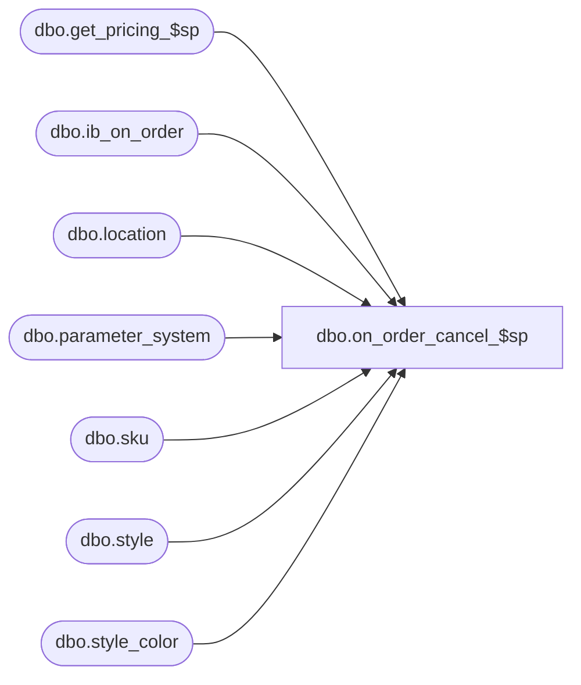

# dbo.on_order_cancel_$sp

**Database:** me_01  
**Server:** bedrockdb02  

## Architecture Diagram



## Table Dependencies

| Referenced Table |
|---|
| dbo.get_pricing_$sp |
| dbo.ib_on_order |
| dbo.location |
| dbo.parameter_system |
| dbo.sku |
| dbo.style |
| dbo.style_color |

## Stored Procedure Code

```sql
-----------------------------------------------------------------------------------------------------------------------------
--	Main Query: Create Procedure

-----------------------------------------------------------------------------------------------------------------------------

CREATE PROCEDURE dbo.on_order_cancel_$sp

	@PO_Number NVARCHAR(20)
	,@Backout_Flag BIT = 0
	,@Return_Affected BIT = 0

AS

-- Called by:
	-- Class: STSIBOnOrder
	-- Method:
	-- Assumption: the temp table #tt_ib_on_order has already been created

/*
CREATE TABLE #tt_ib_on_order
	( ib_on_order_id DECIMAL(12,0) IDENTITY (1,1) NOT NULL
	, sku_id DECIMAL(13,0) NOT NULL, location_id SMALLINT NOT NULL
   , receipt_date SMALLDATETIME
   , transaction_type_code SMALLINT NOT NULL, price_status_id SMALLINT NOT NULL
	, on_order_units INT NOT NULL
	, on_order_cost DECIMAL(14,2) NOT NULL
	, on_order_cost_local DECIMAL(14,2) NOT NULL
	, on_order_valuation_retail DECIMAL(14,2) NOT NULL, on_order_selling_retail DECIMAL(14,2) NOT NULL
	, document_number NVARCHAR(20) NOT NULL
   , pack_id DECIMAL(12,0) NULL, po_receipt_id DECIMAL(12,0) NULL
   , actual_receipt_date SMALLDATETIME NULL
   , received_quantity INT NULL
	, po_id DECIMAL(12,0) NULL, po_shipment_id SMALLINT NULL )
*/

SET TRANSACTION ISOLATION LEVEL READ UNCOMMITTED
SET NOCOUNT ON

-----------------------------------------------------------------------------------------------------------------------------
--	Error Trapping: Check If Temp Table(s) Already Exist(s) And Drop If Applicable
-----------------------------------------------------------------------------------------------------------------------------

IF OBJECT_ID (N'tempdb.dbo.#remaining_on_order', N'U') IS NOT NULL
BEGIN

	DROP TABLE dbo.#remaining_on_order

END

IF OBJECT_ID (N'tempdb.dbo.#distinct_receipt_dates', N'U') IS NOT NULL
BEGIN

	DROP TABLE dbo.#distinct_receipt_dates

END

IF OBJECT_ID (N'tempdb.dbo.#temp_wrk_price_lookup', N'U') IS NOT NULL
BEGIN

	DROP TABLE dbo.#temp_wrk_price_lookup

END

IF OBJECT_ID (N'tempdb.dbo.#temp_price_lookup', N'U') IS NOT NULL
BEGIN

	DROP TABLE dbo.#temp_price_lookup

END

DECLARE @Receipt_Date SMALLDATETIME

SELECT
	IOO.sku_id
	,S.style_id
	,SC.style_color_id
	,SC.color_id
	,S.style_type
	,IOO.location_id
	,L.jurisdiction_id
	,IOO.receipt_date
	,IOO.pack_id
	,IOO.po_id
	,IOO.po_shipment_id
	,SUM(IOO.on_order_units) AS on_order_units
	,SUM(IOO.on_order_cost) AS on_order_cost
	,SUM(IOO.on_order_cost_local) AS on_order_cost_local
	,SUM(CASE WHEN S.style_type = 2 THEN IOO.on_order_valuation_retail ELSE NULL END) AS on_order_valuation_retail
	,SUM(CASE WHEN S.style_type = 2 THEN IOO.on_order_selling_retail ELSE NULL END) AS on_order_selling_retail

INTO dbo.#remaining_on_order

FROM
	dbo.ib_on_order IOO
	INNER JOIN sku SK ON IOO.sku_id = SK.sku_id
	INNER JOIN style_color SC ON SK.style_color_id = SC.style_color_id
	INNER JOIN style S ON SC.style_id = S.style_id
	INNER JOIN dbo.location L ON IOO.location_id = L.location_id
WHERE
	IOO.document_number = @PO_Number
GROUP BY
	IOO.sku_id
	,S.style_id
	,SC.style_color_id
	,SC.color_id
	,S.style_type
	,IOO.location_id
	,L.jurisdiction_id
	,IOO.receipt_date
	,IOO.pack_id
	,IOO.po_id
	,IOO.po_shipment_id
HAVING
	SUM(IOO.on_order_units) <> 0

CREATE TABLE dbo.#temp_wrk_price_lookup

	(
		 jurisdiction_id SMALLINT NULL
		,location_id SMALLINT NULL
		,style_id DECIMAL (12, 0) NULL
		,color_id SMALLINT NULL
		,style_color_id DECIMAL (13, 0) NULL
		,sku_id DECIMAL (13, 0) NULL
	)

CREATE TABLE dbo.#temp_price_lookup

	(
		style_id DECIMAL (12, 0) NULL
		,jurisdiction_id SMALLINT NULL
		,color_id SMALLINT NULL
		,location_id SMALLINT NULL
		,style_color_id DECIMAL (13, 0) NULL
		,sku_id DECIMAL (13, 0) NULL
		,valuation_retail_price DECIMAL (14, 2) NULL
		,selling_retail_price DECIMAL (14, 2) NULL
		,price_status_id SMALLINT NULL
		,[start_date] SMALLDATETIME NULL
		,end_date SMALLDATETIME NULL
		,effective_date SMALLDATETIME NULL
		,exception_level TINYINT NULL
	)

SELECT
	DISTINCT
		CR.receipt_date

INTO dbo.#distinct_receipt_dates

FROM
	dbo.#remaining_on_order CR

DECLARE @Current_Date AS SMALLDATETIME = CONVERT(SMALLDATETIME, CONVERT(VARCHAR(8), GETDATE(), 112))
SET @Receipt_Date = (SELECT TOP (1) DRD.receipt_date FROM dbo.#distinct_receipt_dates DRD ORDER BY DRD.receipt_date)

WHILE @Receipt_Date IS NOT NULL
BEGIN

	DECLARE @Date AS SMALLDATETIME
	IF @Receipt_Date < @Current_Date
		SET @Date = @Current_Date
	ELSE
		SET @Date = @Receipt_Date

	INSERT INTO dbo.#temp_wrk_price_lookup

		(
			jurisdiction_id
			,location_id
			,style_id
			,color_id
			,style_color_id
			,sku_id
		)

	SELECT DISTINCT
		CR.jurisdiction_id
		,CR.location_id
		,CR.style_id
		,CR.color_id
		,CR.style_color_id
		,CR.sku_id
	FROM
		dbo.#remaining_on_order CR
	WHERE
		CR.receipt_date = @Receipt_Date AND CR.style_type = 1

	EXECUTE dbo.get_pricing_$sp

		 @Date = @Date
		,@Group_ID = NULL
		,@Results_To_Table = 1
		,@Use_Start_Date = 1

	INSERT INTO dbo.#tt_ib_on_order
		(
			sku_id
			,location_id
			,receipt_date
			,document_number
			,transaction_type_code
			,price_status_id
			,pack_id
			,po_id
			,po_shipment_id
			,on_order_units
			,on_order_cost
			,on_order_cost_local
			,on_order_valuation_retail
			,on_order_selling_retail
		)
	SELECT
		CR.sku_id
		,CR.location_id
		,CR.receipt_date
		,@PO_Number AS document_number
		,CASE WHEN @Backout_Flag = 0 THEN 120 ELSE 101 END AS transaction_type_code
		,CASE WHEN CR.style_type = 1 THEN TPL.price_status_id ELSE PS.pseudo_price_status_id END AS price_status_id
		,CR.pack_id
		,CR.po_id
		,CR.po_shipment_id
		,-1 * CR.on_order_units
		,-1 * CR.on_order_cost
		,-1 * CR.on_order_cost_local
		,CASE WHEN CR.style_type = 1 THEN -1 * CR.on_order_units * TPL.valuation_retail_price ELSE -1 * on_order_valuation_retail END AS on_order_valuation_retail
		,CASE WHEN CR.style_type = 1 THEN -1 * CR.on_order_units * TPL.selling_retail_price ELSE -1 * on_order_selling_retail END AS on_order_selling_retail
	FROM
		dbo.#remaining_on_order CR
		LEFT JOIN dbo.#temp_price_lookup TPL ON CR.sku_id = TPL.sku_id AND CR.location_id = TPL.location_id
		CROSS JOIN parameter_system PS
	WHERE
		CR.receipt_date = @Receipt_Date

	SET @Receipt_Date = (SELECT TOP (1) DRD.receipt_date FROM dbo.#distinct_receipt_dates DRD WHERE DRD.receipt_date > @Receipt_Date ORDER BY DRD.receipt_date)

	TRUNCATE TABLE dbo.#temp_wrk_price_lookup
	TRUNCATE TABLE dbo.#temp_price_lookup

END

IF @Return_Affected = 1
BEGIN

	-- return following result set to IB which will convert this to an array to send back to POM
	-- this should only be done for a release PO
	SELECT
		CR.style_id
		,CR.sku_id
		,CR.color_id
		,CR.jurisdiction_id
		,CR.location_id
		,CR.receipt_date
		,CR.on_order_units
		,CR.on_order_cost
		,CASE WHEN CR.style_type = 2 THEN 1 ELSE 0 END AS pseudo_style_flag
		,CR.on_order_valuation_retail
		,CR.on_order_selling_retail
		,CASE WHEN CR.pack_id IS NULL THEN -1 ELSE CR.pack_id END AS pack_id
		,CR.po_id
		,CR.po_shipment_id
	FROM
		dbo.#remaining_on_order CR
END
ELSE
BEGIN

	-- return following result set to IB which will convert this to an array to send back to POM
	-- this should only be done for a release PO
	SELECT
		CR.style_id
		,CR.sku_id
		,CR.color_id
		,CR.jurisdiction_id
		,CR.location_id
		,CR.receipt_date
		,CR.on_order_units
		,CR.on_order_cost
		,CASE WHEN CR.style_type = 2 THEN 1 ELSE 0 END AS pseudo_style_flag
		,CR.on_order_valuation_retail
		,CR.on_order_selling_retail
		,CR.pack_id
		,CR.po_id
		,CR.po_shipment_id
	FROM
		dbo.#remaining_on_order CR
	WHERE 1 = 2

END
```

