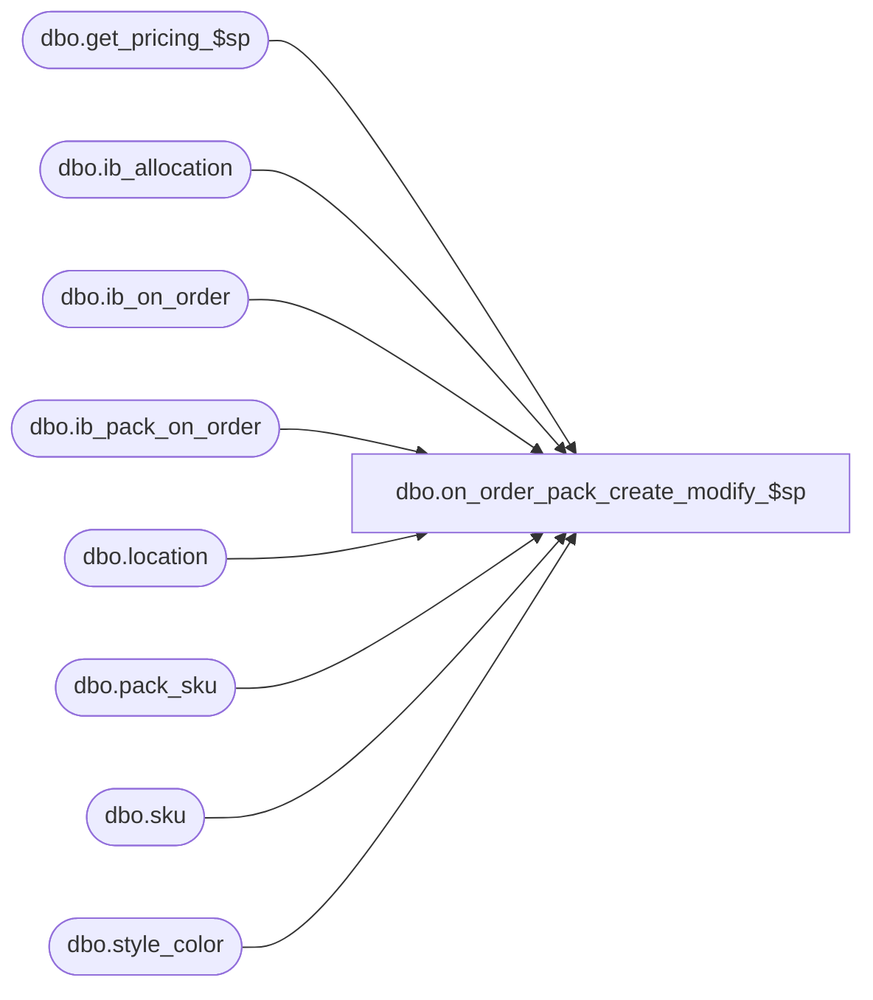

# dbo.on_order_pack_create_modify_$sp

**Database:** me_01  
**Server:** bedrockdb02  

## Architecture Diagram



## Table Dependencies

| Referenced Table |
|---|
| dbo.get_pricing_$sp |
| dbo.ib_allocation |
| dbo.ib_on_order |
| dbo.ib_pack_on_order |
| dbo.location |
| dbo.pack_sku |
| dbo.sku |
| dbo.style_color |

## Stored Procedure Code

```sql
-----------------------------------------------------------------------------------------------------------------------------
--	Main Query: Create Procedure
-----------------------------------------------------------------------------------------------------------------------------

CREATE PROCEDURE dbo.on_order_pack_create_modify_$sp

  @PO_Number VARCHAR(40)
  ,@Pack_Id DECIMAL(13, 0)
  ,@Location_id SMALLINT
  ,@Expected_Receipt_Date SMALLDATETIME
  ,@PO_Id DECIMAL(12, 0)
  ,@PO_Shipment_Id SMALLINT
  ,@PO_Predistribution_Type SMALLINT
  ,@Units INT
  ,@Sku_Unit_Cost DECIMAL (20,9)
  ,@Sku_Unit_Cost_Local DECIMAL (20,9)
  ,@Transaction_Type_Code SMALLINT

AS

SET TRANSACTION ISOLATION LEVEL READ UNCOMMITTED
SET NOCOUNT ON

-----------------------------------------------------------------------------------------------------------------------------
--	Error Trapping: Check If Temp Table(s) Already Exist(s) And Drop If Applicable
-----------------------------------------------------------------------------------------------------------------------------
IF OBJECT_ID (N'tempdb.dbo.#on_order_over_received', N'U') IS NOT NULL
BEGIN

  DROP TABLE dbo.#on_order_over_received

END

IF OBJECT_ID (N'tempdb.dbo.#on_order_adjustments', N'U') IS NOT NULL
BEGIN

  DROP TABLE dbo.#on_order_adjustments

END

IF OBJECT_ID (N'tempdb.dbo.#distinct_receipt_dates', N'U') IS NOT NULL
BEGIN

  DROP TABLE dbo.#distinct_receipt_dates

END

IF OBJECT_ID (N'tempdb.dbo.#temp_wrk_price_lookup', N'U') IS NOT NULL
BEGIN

  DROP TABLE dbo.#temp_wrk_price_lookup

END

IF OBJECT_ID (N'tempdb.dbo.#temp_price_lookup', N'U') IS NOT NULL
BEGIN

  DROP TABLE dbo.#temp_price_lookup

END

IF OBJECT_ID (N'tempdb.dbo.#temp_retro_prices', N'U') IS NOT NULL
BEGIN

  DROP TABLE dbo.#temp_retro_prices

END

DECLARE
   @Date AS SMALLDATETIME
  ,@Jurisdiction_Id AS SMALLINT
  ,@Post_Retail_Adjustments AS BIT
  ,@Has_Shipments BIT

DECLARE @Expand_And_Multiply AS TABLE

  (
     expansion_level INT NULL
    ,multiplier INT NULL
  )


SET @Date = CONVERT (SMALLDATETIME, CONVERT (NVARCHAR (8), GETDATE (), 112))


SET @Jurisdiction_Id = (SELECT L.jurisdiction_id FROM dbo.location L WHERE L.location_id = @Location_id)


INSERT INTO @Expand_And_Multiply

  (
     expansion_level
    ,multiplier
  )

VALUES
   (1, -1)
  ,(2, 1)
  ,(3, NULL)

DECLARE @Receipt_Date AS SMALLDATETIME

DECLARE @multiplier AS TABLE

  (
     multiplier INT
    ,transaction_type_code SMALLINT
  )

INSERT INTO @multiplier

  (
    multiplier
    ,transaction_type_code
  )

SELECT
  -1 AS multiplier
  ,1115 AS transaction_type_code

UNION ALL

SELECT
  1 AS multiplier
  ,@Transaction_Type_Code AS transaction_type_code

DECLARE @Post_Shipments BIT

IF NOT EXISTS
  (
    SELECT 1 FROM ib_on_order WHERE document_number = @PO_Number
  )
  OR EXISTS
  (
    SELECT 1 FROM ib_on_order WHERE document_number = @PO_Number AND po_shipment_id IS NOT NULL
  )
  SET @Post_Shipments = 1
ELSE
  SET @Post_Shipments = 0

SELECT
  IPOO.receipt_date
  ,SUM(IPOO.on_order_units) on_order_units

INTO dbo.#on_order_over_received

FROM
  dbo.ib_pack_on_order IPOO
WHERE
  IPOO.pack_id = @Pack_Id
  AND IPOO.location_id = @Location_id
  AND IPOO.document_number = @PO_Number
  AND IPOO.transaction_type_code = 1115
GROUP BY
  IPOO.receipt_date
HAVING
  SUM(IPOO.on_order_units) > 0

INSERT INTO #tt_ib_pack_on_order
  (
    pack_id
    ,document_number
    ,location_id
    ,receipt_date
    ,transaction_type_code
    ,on_order_units
  )
SELECT
  @Pack_Id AS pack_id
  ,@PO_Number AS document_number
  ,@Location_id AS location_id
  ,OOOR.receipt_date
  ,M.transaction_type_code
  ,M.multiplier * OOOR.on_order_units AS on_order_units
FROM
  dbo.#on_order_over_received OOOR
  CROSS JOIN @multiplier M

INSERT INTO #tt_ib_pack_on_order
  (
    pack_id
    ,document_number
    ,location_id
    ,receipt_date
    ,transaction_type_code
    ,on_order_units
  )
VALUES
  (
    @Pack_Id
    ,@PO_Number
    ,@Location_id
    ,@Expected_Receipt_Date
    ,@Transaction_Type_Code
    ,@Units
  )

SELECT
  PS.sku_id
  ,OOOR.receipt_date
  ,M.transaction_type_code - 1000 AS transaction_type_code
  ,PS.sku_quantity * M.multiplier * OOOR.on_order_units AS on_order_units

INTO dbo.#on_order_adjustments

FROM
  dbo.#on_order_over_received OOOR
  INNER JOIN pack_sku PS ON PS.pack_id = @Pack_Id
  CROSS JOIN @multiplier M

INSERT INTO dbo.#on_order_adjustments
  (
    sku_id
    ,receipt_date
    ,transaction_type_code
    ,on_order_units
  )
SELECT
  PS.sku_id
  ,@Expected_Receipt_Date AS receipt_date
  ,@Transaction_Type_Code - 1000 AS transaction_type_code
  ,@Units * PS.sku_quantity AS on_order_units
FROM
  pack_sku PS
WHERE
  PS.pack_id = @Pack_Id

IF (@PO_Predistribution_Type = 2)
BEGIN

  IF EXISTS (SELECT 1 FROM location WHERE location_id = @Location_id AND location_type NOT IN (3, 4))
  BEGIN

    INSERT INTO dbo.ib_allocation
      (
        sku_id
        ,location_id
        ,transaction_date
        ,expected_receipt_date
        ,transaction_type_code
        ,allocated_units
        ,purchase_order_number
      )
    SELECT
      PS.sku_id
      ,@Location_id
      ,@Date
      ,@Expected_Receipt_Date AS receipt_date
      ,800 AS transaction_type_code
      ,@Units * PS.sku_quantity AS on_order_units
      ,@PO_Number
    FROM
      pack_sku PS
    WHERE
      PS.pack_id = @Pack_Id

  END

END

CREATE TABLE dbo.#temp_wrk_price_lookup

  (
     jurisdiction_id SMALLINT NULL
    ,location_id SMALLINT NULL
    ,style_id DECIMAL (12, 0) NULL
    ,color_id SMALLINT NULL
    ,style_color_id DECIMAL (13, 0) NULL
    ,sku_id DECIMAL (13, 0) NULL
  )

CREATE TABLE dbo.#temp_price_lookup

  (
    style_id DECIMAL (12, 0) NULL
    ,jurisdiction_id SMALLINT NULL
    ,color_id SMALLINT NULL
    ,location_id SMALLINT NULL
    ,style_color_id DECIMAL (13, 0) NULL
    ,sku_id DECIMAL (13, 0) NULL
    ,valuation_retail_price DECIMAL (14, 2) NULL
    ,selling_retail_price DECIMAL (14, 2) NULL
    ,price_status_id SMALLINT NULL
    ,[start_date] SMALLDATETIME NULL
    ,end_date SMALLDATETIME NULL
    ,effective_date SMALLDATETIME NULL
    ,exception_level TINYINT NULL
  )

INSERT INTO dbo.#temp_wrk_price_lookup

  (
    jurisdiction_id
    ,location_id
    ,style_id
    ,color_id
    ,style_color_id
    ,sku_id
  )

SELECT DISTINCT
  @Jurisdiction_Id
  ,@Location_id
  ,SC.style_id
  ,SC.color_id
  ,SC.style_color_id
  ,OOA.sku_id
FROM
  dbo.#on_order_adjustments OOA
  INNER JOIN sku SK ON SK.sku_id = OOA.sku_id
  INNER JOIN style_color SC ON SC.style_color_id = SK.style_color_id

IF EXISTS (SELECT 1 FROM #on_order_adjustments OOA WHERE OOA.receipt_date < @Date)
BEGIN

  SET @Post_Retail_Adjustments = 1

  CREATE TABLE dbo.#temp_retro_prices

    (
       location_id SMALLINT NULL
      ,sku_id DECIMAL (13, 0) NULL
      ,document_number NVARCHAR (20)
      ,effective_date SMALLDATETIME
      ,price_change_type SMALLINT
      ,new_price_status_id SMALLINT NULL
      ,new_val_unit_retail DECIMAL (14, 2) NULL
      ,new_sell_unit_retail DECIMAL (14, 2) NULL
    )

  EXECUTE dbo.get_pricing_$sp

     @Date = @Date
    ,@Exclude_NULL_Results = 0
    ,@Group_ID = NULL
    ,@Include_Exception_Color = 1
    ,@Include_Exception_Color_Location = 1
    ,@Include_Exception_Color_SKU = 1
    ,@Include_Exception_Color_SKU_Location = 1
    ,@Include_Exception_Location = 1
    ,@Include_Exception_None = 1
    ,@Output_All_Exception_Values = 0 -- Not Longer Used, Needs To Be Removed From Procedure And Application Code
    ,@Price_Change_ID = NULL
    ,@Results_To_Table = 0
    ,@Temp_Price_Flag = 0
    ,@Use_PC_Instruction_Mode = 0
    ,@Use_Start_Date = 0
    ,@Sales_Posting_Mode = NULL
    ,@Use_PI_Mode = 0
    ,@Use_Post_Retro_Mode = 1

END

SELECT
  DISTINCT
    OOA.receipt_date

INTO dbo.#distinct_receipt_dates

FROM
  dbo.#on_order_adjustments OOA

SET @Receipt_Date = (SELECT TOP (1) DRD.receipt_date FROM dbo.#distinct_receipt_dates DRD ORDER BY DRD.receipt_date)

WHILE @Receipt_Date IS NOT NULL
BEGIN

  EXECUTE dbo.get_pricing_$sp

     @Date = @Receipt_Date
    ,@Group_ID = NULL
    ,@Results_To_Table = 1
    ,@Use_Start_Date = 1

  INSERT INTO dbo.#tt_ib_on_order
    (
      sku_id
      ,location_id
      ,receipt_date
      ,document_number
      ,transaction_type_code
      ,price_status_id
      ,pack_id
      ,po_id
      ,po_shipment_id
      ,on_order_units
      ,on_order_cost
      ,on_order_cost_local
      ,on_order_valuation_retail
      ,on_order_selling_retail
    )
  SELECT
    OOA.sku_id
    ,@Location_id AS location_id
    ,OOA.receipt_date
    ,@PO_Number AS document_number
    ,OOA.transaction_type_code
    ,TPL.price_status_id
    ,@Pack_Id AS pack_id
    ,(CASE
        WHEN @PO_Id = -1 OR @Post_Shipments = 0 THEN NULL
        ELSE @PO_Id END) AS po_id
    ,(CASE
        WHEN @PO_Shipment_Id = -1 OR @Post_Shipments = 0 THEN NULL
        ELSE @PO_Shipment_Id END) AS po_shipment_id
    ,OOA.on_order_units
    ,OOA.on_order_units * @Sku_Unit_Cost AS on_order_cost
    ,OOA.on_order_units * @Sku_Unit_Cost_Local AS on_order_cost_local
    ,OOA.on_order_units * TPL.valuation_retail_price AS on_order_valuation_retail
    ,OOA.on_order_units * TPL.selling_retail_price AS on_order_selling_retail
  FROM
    dbo.#on_order_adjustments OOA
    INNER JOIN dbo.#temp_price_lookup TPL ON OOA.sku_id = TPL.sku_id AND TPL.location_id = @Location_id
  WHERE
    OOA.receipt_date = @Receipt_Date

  SET @Receipt_Date = (SELECT TOP (1) DRD.receipt_date FROM dbo.#distinct_receipt_dates DRD WHERE DRD.receipt_date > @Receipt_Date ORDER BY DRD.receipt_date)

  IF (@Post_Retail_Adjustments = 1)
  BEGIN

    -- Logic for 150s
    -- TODO
    SET @Post_Retail_Adjustments = 1

    SELECT
      OOA.sku_id
      ,@Location_id AS location_id
      ,OOA.receipt_date
      ,@PO_Number AS document_number
      ,150 AS transaction_type_code
      ,(CASE
        WHEN tvEAM.expansion_level = 1 THEN TPL.price_status_id
        WHEN tvEAM.expansion_level IN (2, 3) THEN ttRP.new_price_status_id
        END) AS price_status_id
      ,@Pack_Id AS pack_id
      ,@PO_Id AS po_id
      ,@PO_Shipment_Id AS po_shipment_id
      ,(CASE
        WHEN tvEAM.expansion_level IN (1, 2) THEN tvEAM.multiplier * OOA.on_order_units
        WHEN tvEAM.expansion_level = 3 THEN 0
        END) AS on_order_units
      ,(CASE
        WHEN tvEAM.expansion_level IN (1, 2) THEN tvEAM.multiplier * (OOA.on_order_units * @Sku_Unit_Cost)
        WHEN tvEAM.expansion_level = 3 THEN 0
        END) AS on_order_cost
      ,(CASE
        WHEN tvEAM.expansion_level IN (1, 2) THEN tvEAM.multiplier * (OOA.on_order_units * @Sku_Unit_Cost_Local)
        WHEN tvEAM.expansion_level = 3 THEN 0
        END) AS on_order_cost_local
      ,(CASE
        WHEN tvEAM.expansion_level IN (1, 2) THEN tvEAM.multiplier * (OOA.on_order_units * TPL.valuation_retail_price)
        WHEN tvEAM.expansion_level = 3 THEN OOA.on_order_units * (ttRP.new_val_unit_retail - TPL.valuation_retail_price)
        END) AS on_order_valuation_retail
      ,(CASE
        WHEN tvEAM.expansion_level IN (1, 2) THEN tvEAM.multiplier * (OOA.on_order_units * TPL.selling_retail_price)
        WHEN tvEAM.expansion_level = 3 THEN OOA.on_order_units * (ttRP.new_sell_unit_retail - TPL.selling_retail_price)
        END) AS on_order_selling_retail
    FROM
      dbo.#on_order_adjustments OOA
      INNER JOIN dbo.#temp_price_lookup TPL ON TPL.sku_id = OOA.sku_id
      INNER JOIN dbo.#temp_retro_prices ttRP ON ttRP.sku_id = OOA.sku_id
      CROSS JOIN @Expand_And_Multiply tvEAM
  END

  TRUNCATE TABLE dbo.#temp_price_lookup

END
```

