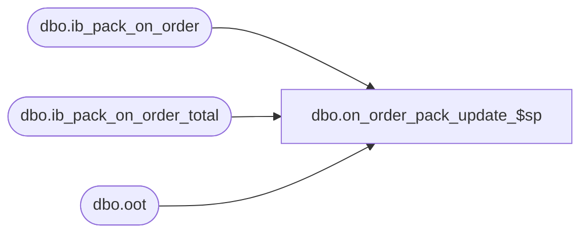

# dbo.on_order_pack_update_$sp

**Database:** me_01  
**Server:** bedrockdb02  

## Architecture Diagram



## Table Dependencies

| Referenced Table |
|---|
| dbo.ib_pack_on_order |
| dbo.ib_pack_on_order_total |
| dbo.oot |

## Stored Procedure Code

```sql
CREATE PROCEDURE [dbo].[on_order_pack_update_$sp] 
	(@source_statement AS NVARCHAR(4000))
AS

-- =============================================
-- Author:		Yan
-- Create date: 2010
-- Description:	This is part of the ib_pack_on_order trigger removal. It populates ib_pack_on_order and ib_pack_on_order_total
-- =============================================

BEGIN

DECLARE 
	@UseTran	BIT,
	@DelTmpTbl	BIT,
	@ErrorVar	INT,
	@ErrorMsg	NVARCHAR(1000);

	-- SET NOCOUNT ON added to prevent extra result sets from
	-- interfering with SELECT statements.
	SET NOCOUNT ON;

	-- Set local transaction control flag
	SET @UseTran = 0;
	-- Set delete temporary table flag
	SET @DelTmpTbl = 0;

	-- Only call BEGIN TRAN if we are not in a transaction
	-- Note: There is no "Rollback" to a nested transaction. Rollback needs to go
	--       back to the outer most "Begin Tran". Also, "Save Transaction" does not
	--       work within a distribution transaction so no luck there either. 
	IF @@TRANCOUNT = 0
	BEGIN
		BEGIN TRAN;
		SET @UseTran = 1;
	END;

	-- Create temporary table
	CREATE TABLE #oo_upd(
		oo_upd_id						DECIMAL(12, 0) IDENTITY(1,1) NOT NULL,
		document_number				NVARCHAR(20) NOT NULL,
		pack_id							DECIMAL(12, 0) NOT NULL,
		location_id						SMALLINT NOT NULL,
		receipt_date					SMALLDATETIME NOT NULL,
		transaction_type_code		SMALLINT NOT NULL,
		on_order_units					INT NOT NULL DEFAULT ((0)),
		PRIMARY KEY CLUSTERED (oo_upd_id ASC)
		);

	SET @ErrorVar = @@ERROR;
	IF @ErrorVar <> 0
	BEGIN
		SET @ErrorMsg = N'on_order_pack_update_$sp: Failed to create #oo_upd. Err' + CAST(@ErrorVar AS NVARCHAR(20));
		GOTO ERROR_HANDLER;
	END;

	-- Create temporary table
	CREATE TABLE #oo_upd_total(
		document_number		NVARCHAR(20) NOT NULL,
		pack_id					DECIMAL(12, 0) NOT NULL,
		location_id				SMALLINT NOT NULL,
		receipt_date			SMALLDATETIME NOT NULL,
		total_on_order_units	INT NOT NULL DEFAULT ((0)),
		UNIQUE CLUSTERED (document_number ASC, pack_id ASC, location_id ASC, receipt_date ASC)
		);

	SET @ErrorVar = @@ERROR;
	IF @ErrorVar <> 0
	BEGIN
		SET @ErrorMsg = N'on_order_pack_update_$sp: Failed to create #oo_upd_total. Err' + CAST(@ErrorVar AS NVARCHAR(20));
		GOTO ERROR_HANDLER;
	END;

	-- Temp table created
	SET @DelTmpTbl = 1;

	-- Execute the passed in query and insert into #oo_upd
	SET @source_statement = N'INSERT INTO #oo_upd 
			(pack_id, location_id, receipt_date, transaction_type_code, on_order_units,
			 document_number) ' + @source_statement;

	EXEC sp_executesql @source_statement;

	SET @ErrorVar = @@ERROR;
	IF @ErrorVar <> 0
	BEGIN
		SET @ErrorMsg = N'on_order_pack_update_$sp: Failed to populate #oo_upd (' + @source_statement + N'). Err' + CAST(@ErrorVar AS NVARCHAR(20));
		GOTO ERROR_HANDLER;
	END;

	-- INSERT into ib_on_order
	INSERT INTO ib_pack_on_order 
		(pack_id, location_id, receipt_date, transaction_type_code, 
		 on_order_units, document_number)
	SELECT 
		pack_id, location_id, receipt_date, transaction_type_code,
		 on_order_units, document_number
		FROM #oo_upd;

	SET @ErrorVar = @@ERROR;
	IF @ErrorVar <> 0
	BEGIN
		SET @ErrorMsg = N'on_order_pack_update_$sp: Failed INSERT INTO ib_on_order from #oo_upd. Err' + CAST(@ErrorVar AS NVARCHAR(20));
		GOTO ERROR_HANDLER;
	END;

	-- INSERT into #oo_upd_total (the last price id for each doc/sku/loc/rect_date/pack will be used)
	INSERT #oo_upd_total
		(document_number, pack_id, location_id, receipt_date, total_on_order_units)
	SELECT 
		upd.document_number, upd.pack_id, upd.location_id, upd.receipt_date,
		 SUM(upd.on_order_units)
	FROM #oo_upd upd
	GROUP  BY upd.document_number, upd.pack_id, upd.location_id, upd.receipt_date;

	SET @ErrorVar = @@ERROR;
	IF @ErrorVar <> 0
	BEGIN
		SET @ErrorMsg = N'on_order_pack_update_$sp: Failed INSERT INTO #oo_upd_total from #oo_upd. Err' + CAST(@ErrorVar AS NVARCHAR(20));
		GOTO ERROR_HANDLER;
	END;

	-- UPDATE ib_on_order_total for existing doc/sku/loc/rect_date/pack rows
	UPDATE
		oot
	SET
		total_on_order_units = oot.total_on_order_units + t.total_on_order_units
	FROM			
		#oo_upd_total t
	INNER JOIN ib_pack_on_order_total oot
		ON  oot.document_number = t.document_number
		AND oot.location_id = t.location_id
		AND oot.receipt_date = t.receipt_date
		AND oot.pack_id = t.pack_id;

	SET @ErrorVar = @@ERROR;
	IF @ErrorVar <> 0
	BEGIN
		SET @ErrorMsg = N'on_order_pack_update_$sp: Failed UPDATE ib_on_order_total from #oo_upd_total. Err' + CAST(@ErrorVar AS NVARCHAR(20));
		GOTO ERROR_HANDLER;
	END;

	-- INSERT into ib_on_order_total for new doc/sku/loc/rect_date/pack rows
	INSERT ib_pack_on_order_total 
		(document_number, pack_id, location_id, receipt_date, 
		 total_on_order_units)
	SELECT 
		 document_number, pack_id, location_id, receipt_date,
		 total_on_order_units
	FROM 
		#oo_upd_total upd
	WHERE 
		NOT EXISTS (
			SELECT 1
			FROM   ib_pack_on_order_total oot
			WHERE  oot.document_number = upd.document_number
				AND oot.location_id = upd.location_id
				AND oot.receipt_date = upd.receipt_date
				AND oot.pack_id = upd.pack_id )
	

	SET @ErrorVar = @@ERROR;
	IF @ErrorVar <> 0
	BEGIN
		SET @ErrorMsg = N'on_order_pack_update_$sp: Failed INSERT INTO ib_on_order_total from #oo_upd_total. Err' + CAST(@ErrorVar AS NVARCHAR(20));
		GOTO ERROR_HANDLER;
	END;

	-- Drop temporary tables
	DROP TABLE #oo_upd;

	SET @ErrorVar = @@ERROR;
	IF @ErrorVar <> 0
	BEGIN
		SET @ErrorMsg = N'on_order_pack_update_$sp: Failed DELETE #oo_upd. Err' + CAST(@ErrorVar AS NVARCHAR(20));
		GOTO ERROR_HANDLER;
	END;

	DROP TABLE #oo_upd_total;

	SET @ErrorVar = @@ERROR;
	IF @ErrorVar <> 0
	BEGIN
		SET @ErrorMsg = N'on_order_pack_update_$sp: Failed DELETE #oo_upd_total. Err' + CAST(@ErrorVar AS NVARCHAR(20));
		GOTO ERROR_HANDLER;
	END;


	-- Commit transaction if in locally controlled transaction
	IF @UseTran = 1
	BEGIN
		COMMIT TRAN;
	END;

	-- Done!
	RETURN;

ERROR_HANDLER:
	-- Drop temp table if exists
	IF @DelTmpTbl = 1
	BEGIN
		DROP TABLE #oo_upd;
		DROP TABLE #oo_upd_total;
	END;
	-- Rollback transaction if in locally controlled transaction
	IF @UseTran = 1
	BEGIN
		ROLLBACK TRAN;
	END;
	-- Raise an error
	RAISERROR(@ErrorMsg, 16, 1);
	-- Exit
	RETURN;

END;
```

