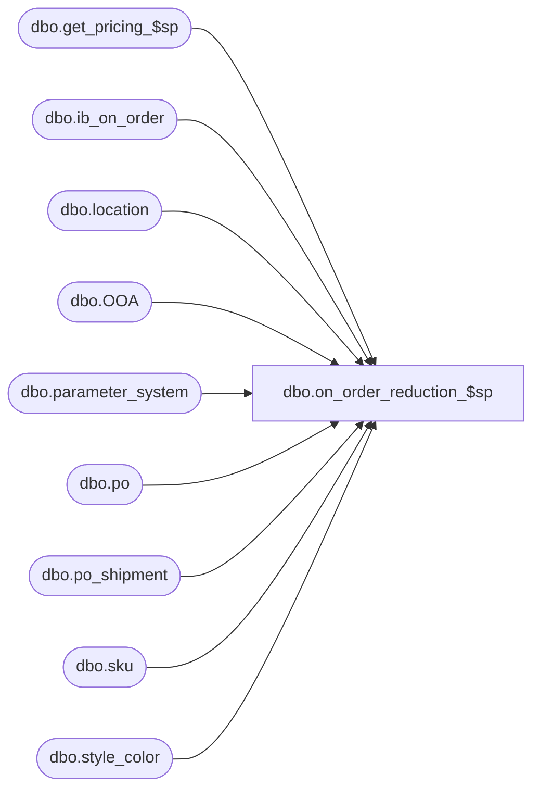

# dbo.on_order_reduction_$sp

**Database:** me_01  
**Server:** bedrockdb02  

## Architecture Diagram



## Table Dependencies

| Referenced Table |
|---|
| dbo.get_pricing_$sp |
| dbo.ib_on_order |
| dbo.location |
| dbo.OOA |
| dbo.parameter_system |
| dbo.po |
| dbo.po_shipment |
| dbo.sku |
| dbo.style_color |

## Stored Procedure Code

```sql
-----------------------------------------------------------------------------------------------------------------------------
--	Main Query: Create Procedure
-----------------------------------------------------------------------------------------------------------------------------

CREATE PROCEDURE [dbo].[on_order_reduction_$sp]

  @PO_Number VARCHAR(40)
  ,@Sku_Id DECIMAL(13, 0)
  ,@Location_id SMALLINT
  ,@Pack_Id DECIMAL(13, 0)
  ,@PO_Shipment_Id SMALLINT = NULL
  ,@PO_Receipt_Id DECIMAL(12, 0)
  ,@Actual_Receipt_Date SMALLDATETIME
  ,@Units_Reduced INT
  ,@Unit_Cost FLOAT
  ,@Unit_Cost_Local FLOAT
  ,@Blanket_Cancelled BIT

AS

SET TRANSACTION ISOLATION LEVEL READ UNCOMMITTED
SET NOCOUNT ON

-----------------------------------------------------------------------------------------------------------------------------
--	Error Trapping: Check If Temp Table(s) Already Exist(s) And Drop If Applicable
-----------------------------------------------------------------------------------------------------------------------------
IF OBJECT_ID (N'tempdb.dbo.#ib_on_order_total', N'U') IS NOT NULL
BEGIN

  DROP TABLE dbo.#ib_on_order_total

END

IF OBJECT_ID (N'tempdb.dbo.#running_total', N'U') IS NOT NULL
BEGIN

  DROP TABLE dbo.#running_total

END

IF OBJECT_ID (N'tempdb.dbo.#on_order_adjustments', N'U') IS NOT NULL
BEGIN

  DROP TABLE dbo.#on_order_adjustments

END

IF OBJECT_ID (N'tempdb.dbo.#distinct_receipt_dates', N'U') IS NOT NULL
BEGIN

  DROP TABLE dbo.#distinct_receipt_dates

END

IF OBJECT_ID (N'tempdb.dbo.#temp_wrk_price_lookup', N'U') IS NOT NULL
BEGIN

  DROP TABLE dbo.#temp_wrk_price_lookup

END

IF OBJECT_ID (N'tempdb.dbo.#temp_price_lookup', N'U') IS NOT NULL
BEGIN

  DROP TABLE dbo.#temp_price_lookup

END

DECLARE @PO_Id AS DECIMAL(12, 0)
SELECT @PO_Id = po_id FROM po WHERE po_no = @PO_Number

DECLARE @Over_Receipt_Multiplier AS TABLE

  (
     multiplier INT
    ,transaction_type_code SMALLINT
  )

INSERT INTO @Over_Receipt_Multiplier

  (
    multiplier
    ,transaction_type_code
  )

SELECT
  1 AS multiplier
  ,110 AS transaction_type_code

UNION ALL

SELECT
  CASE WHEN @Blanket_Cancelled = 1 THEN 0 ELSE -1 END AS multiplier
  ,115 AS transaction_type_code

UNION ALL

SELECT
  CASE WHEN @Blanket_Cancelled = 1 THEN -1 ELSE 0 END AS multiplier
  ,120 AS transaction_type_code

DECLARE @Expected_Receipt_Date SMALLDATETIME

CREATE TABLE dbo.#ib_on_order_total
  (
    id INT IDENTITY(1,1)
    ,receipt_date SMALLDATETIME
    ,po_id DECIMAL(12, 0)
    ,po_shipment_id SMALLINT
    ,total_on_order_units BIGINT
    ,total_on_order_cost FLOAT
    ,total_on_order_cost_local FLOAT
  )

CREATE TABLE dbo.#on_order_adjustments
  (
    receipt_date SMALLDATETIME
    ,po_id DECIMAL(12, 0)
    ,po_shipment_id SMALLINT
    ,transaction_type_code SMALLINT
    ,reduction_units BIGINT
    ,reduction_cost FLOAT
    ,reduction_cost_local FLOAT
  )

CREATE TABLE dbo.#running_total
  (
    id INT
    ,receipt_date SMALLDATETIME
    ,po_id DECIMAL(12, 0)
    ,po_shipment_id SMALLINT
    ,total_on_order_units BIGINT
    ,total_on_order_cost FLOAT
    ,total_on_order_cost_local FLOAT
    ,balance_on_order_units BIGINT
  )

INSERT INTO dbo.#on_order_adjustments
  (
    receipt_date
    ,po_id
    ,po_shipment_id
    ,transaction_type_code
    ,reduction_units
    ,reduction_cost
    ,reduction_cost_local
  )
SELECT
  receipt_date
  ,po_id
  ,po_shipment_id
  ,transaction_type_code
  ,-SUM(on_order_units) AS reduction_units
  ,-SUM(on_order_cost) AS reduction_cost
  ,-SUM(on_order_cost_local) AS reduction_cost_local
FROM
  dbo.ib_on_order IOO
WHERE
  IOO.document_number = @PO_Number
  AND IOO.sku_id = @Sku_Id AND IOO.location_id = @Location_id
  AND COALESCE(IOO.pack_id, -1) = @Pack_Id
  AND (@PO_Shipment_Id = -1 OR IOO.po_shipment_id = @PO_Shipment_Id)
  AND
    (
      (IOO.transaction_type_code IN (110,115) AND (@Blanket_Cancelled = 0 OR @PO_Receipt_Id > 0) )
      OR
      (IOO.transaction_type_code IN (110,120) AND @Blanket_Cancelled = 1 AND @PO_Receipt_Id <= 0)
    )
GROUP BY
  receipt_date
  ,po_id
  ,po_shipment_id
  ,transaction_type_code

UPDATE OOA
SET
  OOA.receipt_date = PS.expected_receipt_date
FROM
  dbo.#on_order_adjustments OOA
INNER JOIN dbo.po_shipment PS ON
  PS.po_id = OOA.po_id
  AND PS.po_shipment_id = OOA.po_shipment_id
  AND OOA.receipt_date <> PS.expected_receipt_date

DECLARE @Total_Units_Reduced INT
SET @Total_Units_Reduced = @Units_Reduced
SELECT
  @Total_Units_Reduced = SUM(reduction_units)
FROM
  dbo.#on_order_adjustments
WHERE
  transaction_type_code = 110

SET @Total_Units_Reduced = ISNULL(@Total_Units_Reduced, 0) + @Units_Reduced

INSERT INTO dbo.#ib_on_order_total
  (
    receipt_date
    ,po_id
    ,po_shipment_id
    ,total_on_order_units
    ,total_on_order_cost
    ,total_on_order_cost_local
  )
SELECT
  receipt_date
  ,po_id
  ,po_shipment_id
  ,SUM(total_on_order_units) AS total_on_order_units
  ,SUM(total_on_order_cost) AS total_on_order_cost
  ,SUM(total_on_order_cost_local) AS total_on_order_cost_local
FROM
  (
    SELECT
      receipt_date
      ,po_id
      ,po_shipment_id
      ,SUM(on_order_units) AS total_on_order_units
      ,SUM(on_order_cost) AS total_on_order_cost
      ,SUM(on_order_cost_local) AS total_on_order_cost_local
    FROM
      dbo.ib_on_order IOO
    WHERE
      IOO.document_number = @PO_Number
      AND IOO.sku_id = @Sku_Id AND IOO.location_id = @Location_id
      AND COALESCE(IOO.pack_id, -1) = @Pack_Id
      AND (@PO_Shipment_Id = -1 OR IOO.po_shipment_id = @PO_Shipment_Id)
    GROUP BY
      receipt_date
      ,po_id
      ,po_shipment_id
    UNION ALL
    SELECT
      receipt_date
      ,po_id
      ,po_shipment_id
      ,SUM(reduction_units) AS total_on_order_units
      ,SUM(reduction_cost) AS total_on_order_cost
      ,SUM(reduction_cost_local) AS total_on_order_cost_local
    FROM
      dbo.#on_order_adjustments
    GROUP BY
      receipt_date
      ,po_id
      ,po_shipment_id
  ) sqIOO
GROUP BY
  receipt_date
  ,po_id
  ,po_shipment_id

INSERT INTO dbo.#running_total
  (
    id
    ,receipt_date
    ,po_id
    ,po_shipment_id
    ,total_on_order_units
    ,total_on_order_cost
    ,total_on_order_cost_local
    ,balance_on_order_units
  )
SELECT
  IOOT.id
  ,IOOT.receipt_date
  ,IOOT.po_id
  ,IOOT.po_shipment_id
  ,IOOT.total_on_order_units
  ,IOOT.total_on_order_cost
  ,IOOT.total_on_order_cost_local
  ,(
    SELECT
      SUM (XIOOT.total_on_order_units)
    FROM
      dbo.#ib_on_order_total XIOOT
    WHERE
      (
        XIOOT.id <= IOOT.id AND @Total_Units_Reduced > 0
      )
      OR
      (
        XIOOT.id >= IOOT.id AND @Total_Units_Reduced < 0
      )

  ) - (@Total_Units_Reduced) AS balance_on_order_units

FROM
  dbo.#ib_on_order_total IOOT

INSERT INTO dbo.#on_order_adjustments
  (
    receipt_date
    ,po_id
    ,po_shipment_id
    ,transaction_type_code
    ,reduction_units
    ,reduction_cost
    ,reduction_cost_local
  )
SELECT
  receipt_date
  ,po_id
  ,po_shipment_id
  ,M.transaction_type_code
  ,-1 * M.multiplier * CASE WHEN RT.balance_on_order_units <= 0 THEN RT.total_on_order_units ELSE ABS (RT.balance_on_order_units - RT.total_on_order_units) END AS reduction_units
  ,-1 * M.multiplier * RT.total_on_order_cost / RT.total_on_order_units * (CASE WHEN RT.balance_on_order_units <= 0 THEN RT.total_on_order_units ELSE ABS (RT.balance_on_order_units - RT.total_on_order_units) END) AS reduction_cost
  ,-1 * M.multiplier * RT.total_on_order_cost_local / RT.total_on_order_units * (CASE WHEN RT.balance_on_order_units <= 0 THEN RT.total_on_order_units ELSE ABS (RT.balance_on_order_units - RT.total_on_order_units) END) AS reduction_cost_local
FROM
  dbo.#running_total RT
  CROSS JOIN @Over_Receipt_Multiplier M
WHERE
  RT.balance_on_order_units < RT.total_on_order_units
  AND
    (
      (M.transaction_type_code <> 115 AND @Blanket_Cancelled = 0)
      OR
      (M.transaction_type_code <> 120 AND @Blanket_Cancelled = 1)
    )
  AND RT.total_on_order_units <> 0

UNION ALL

SELECT
  receipt_date
  ,po_id
  ,po_shipment_id
  ,M.transaction_type_code
  ,M.multiplier * RT.balance_on_order_units AS reduction_units
  ,M.multiplier
    * CASE WHEN RT.total_on_order_units <> 0 THEN RT.total_on_order_cost / RT.total_on_order_units ELSE @Unit_Cost END
    * RT.balance_on_order_units AS reduction_cost
  ,M.multiplier
    * CASE WHEN RT.total_on_order_units <> 0 THEN RT.total_on_order_cost_local / RT.total_on_order_units ELSE @Unit_Cost END
    * RT.balance_on_order_units AS reduction_cost_local
FROM
  dbo.#running_total RT
  CROSS JOIN @Over_Receipt_Multiplier M
WHERE
  RT.id = (SELECT MAX(id) FROM dbo.#running_total)
  AND RT.balance_on_order_units < 0 AND RT.total_on_order_units <> 0
  AND @Total_Units_Reduced > 0

IF NOT EXISTS
  (
    SELECT 1
    FROM
      dbo.#ib_on_order_total
    WHERE
      (@PO_Shipment_Id = -1 OR po_shipment_id = @PO_Shipment_Id)
      AND
        (
          total_on_order_units <> 0
          OR total_on_order_cost <> 0
          OR total_on_order_cost_local <> 0
        )
  )
BEGIN

  DECLARE @Earliest_ERD AS SMALLDATETIME

  IF (@PO_Shipment_Id = -1)
  BEGIN

    SELECT
      @Earliest_ERD = MIN(PS.expected_receipt_date)
    FROM
      po_shipment PS
    WHERE
      PS.po_id = @PO_Id

    SELECT
      @PO_Shipment_Id = MIN(PS.po_shipment_id)
    FROM
      po_shipment PS
    WHERE
      expected_receipt_date = @Earliest_ERD

  END
  ELSE
  BEGIN

    SELECT
      @Earliest_ERD = PS.expected_receipt_date
    FROM
      po_shipment PS
    WHERE
      PS.po_id = @PO_Id AND PS.po_shipment_id = @PO_Shipment_Id

  END

  INSERT INTO dbo.#on_order_adjustments
    (
      receipt_date
      ,po_id
      ,po_shipment_id
      ,transaction_type_code
      ,reduction_units
      ,reduction_cost
      ,reduction_cost_local
    )
  SELECT
    @Earliest_ERD
    ,@PO_Id
    ,@PO_Shipment_Id
    ,M.transaction_type_code
    ,-1 * M.multiplier * @Units_Reduced
    ,-1 * M.multiplier * @Units_Reduced * @Unit_Cost
    ,-1 * M.multiplier * @Units_Reduced * @Unit_Cost_Local
  FROM
    @Over_Receipt_Multiplier M

END

CREATE TABLE dbo.#temp_wrk_price_lookup

  (
     jurisdiction_id SMALLINT NULL
    ,location_id SMALLINT NULL
    ,style_id DECIMAL (12, 0) NULL
    ,color_id SMALLINT NULL
    ,style_color_id DECIMAL (13, 0) NULL
    ,sku_id DECIMAL (13, 0) NULL
  )

CREATE TABLE dbo.#temp_price_lookup

  (
    style_id DECIMAL (12, 0) NULL
    ,jurisdiction_id SMALLINT NULL
    ,color_id SMALLINT NULL
    ,location_id SMALLINT NULL
    ,style_color_id DECIMAL (13, 0) NULL
    ,sku_id DECIMAL (13, 0) NULL
    ,valuation_retail_price DECIMAL (14, 2) NULL
    ,selling_retail_price DECIMAL (14, 2) NULL
    ,price_status_id SMALLINT NULL
    ,[start_date] SMALLDATETIME NULL
    ,end_date SMALLDATETIME NULL
    ,effective_date SMALLDATETIME NULL
    ,exception_level TINYINT NULL
  )

INSERT INTO dbo.#temp_wrk_price_lookup

  (
    jurisdiction_id
    ,location_id
    ,style_id
    ,color_id
    ,style_color_id
    ,sku_id
  )

SELECT
  L.jurisdiction_id
  ,@Location_id AS location_id
  ,SC.style_id
  ,SC.color_id
  ,SC.style_color_id
  ,@Sku_Id AS sku_id
FROM
  sku SK
INNER JOIN location L ON L.location_id = @Location_id
INNER JOIN style_color SC ON SC.style_color_id = SK.style_color_id
WHERE
  SK.sku_id = @Sku_Id

SELECT
  DISTINCT
    receipt_date

INTO dbo.#distinct_receipt_dates

FROM
  dbo.#on_order_adjustments

DECLARE @Current_Date AS SMALLDATETIME = CONVERT(SMALLDATETIME, CONVERT(VARCHAR(8), GETDATE(), 112))
SET @Expected_Receipt_Date = (SELECT TOP (1) DRR.receipt_date FROM dbo.#distinct_receipt_dates DRR ORDER BY DRR.receipt_date)

WHILE @Expected_Receipt_Date IS NOT NULL
BEGIN

  DECLARE @Date AS SMALLDATETIME
  IF @Expected_Receipt_Date < @Current_Date
    SET @Date = @Current_Date
  ELSE
    SET @Date = @Expected_Receipt_Date

  EXECUTE dbo.get_pricing_$sp

     @Date = @Date
    ,@Group_ID = NULL
    ,@Results_To_Table = 1
    ,@Use_Start_Date = 1

  INSERT INTO dbo.#tt_ib_on_order
    (
      sku_id
      ,location_id
      ,receipt_date
      ,document_number
      ,transaction_type_code
      ,price_status_id
      ,pack_id
      ,po_id
      ,po_shipment_id
      ,on_order_units
      ,on_order_cost
      ,on_order_cost_local
      ,on_order_valuation_retail
      ,on_order_selling_retail
      ,po_receipt_id
      ,actual_receipt_date
      ,received_quantity
    )
  SELECT
    @Sku_Id AS sku_id
    ,@Location_id AS location_id
    ,@Expected_Receipt_Date AS receipt_date
    ,@PO_Number AS document_number
    ,OOA.transaction_type_code
    ,TPL.price_status_id
    ,CASE WHEN @Pack_Id = -1 THEN NULL ELSE @Pack_Id END AS pack_id
    ,OOA.po_id
    ,OOA.po_shipment_id
    ,SUM(OOA.reduction_units) AS reduction_units
    ,SUM(OOA.reduction_cost) AS reduction_cost
    ,SUM(OOA.reduction_cost_local) AS reduction_cost_local
    ,SUM(OOA.reduction_units * TPL.valuation_retail_price) AS on_order_valuation_retail
    ,SUM(OOA.reduction_units * TPL.selling_retail_price) AS on_order_selling_retail
    ,CASE WHEN OOA.transaction_type_code = 110 AND @PO_Receipt_Id <> -1 THEN @PO_Receipt_Id ELSE NULL END AS po_receipt_id
    ,CASE WHEN OOA.transaction_type_code = 110 AND @PO_Receipt_Id <> -1 THEN @Actual_Receipt_Date ELSE NULL END AS actual_receipt_date
    ,CASE WHEN OOA.transaction_type_code = 110 AND @PO_Receipt_Id <> -1 THEN SUM(-1 * OOA.reduction_units) ELSE NULL END AS received_quantity
  FROM
    dbo.#on_order_adjustments OOA
    INNER JOIN dbo.#temp_price_lookup TPL ON TPL.sku_id = @Sku_Id AND TPL.location_id = @Location_id
    CROSS JOIN parameter_system PS
  WHERE
    OOA.receipt_date = @Expected_Receipt_Date
    --AND OOA.reduction_units <> 0
  GROUP BY
    OOA.transaction_type_code
    ,TPL.price_status_id
    ,OOA.po_id
    ,OOA.po_shipment_id
  HAVING
    SUM(OOA.reduction_units) <> 0

  SET @Expected_Receipt_Date = (SELECT TOP (1) DRR.receipt_date FROM dbo.#distinct_receipt_dates DRR WHERE DRR.receipt_date > @Expected_Receipt_Date ORDER BY DRR.receipt_date)

  TRUNCATE TABLE dbo.#temp_price_lookup

END

-- when posting for a po receipt and Blanket_Cancelled = 1 this means that the po for the receipt is cancelled
-- need to reverse all transactions that are posted for it
IF (@PO_Receipt_Id > 0 AND @Blanket_Cancelled = 1)
BEGIN
  INSERT INTO dbo.#tt_ib_on_order
    (
      sku_id
      ,location_id
      ,receipt_date
      ,document_number
      ,transaction_type_code
      ,price_status_id
      ,pack_id
      ,po_id
      ,po_shipment_id
      ,on_order_units
      ,on_order_cost
      ,on_order_cost_local
      ,on_order_valuation_retail
      ,on_order_selling_retail
      ,po_receipt_id
      ,actual_receipt_date
      ,received_quantity
    )
  SELECT
    sku_id
    ,location_id
    ,receipt_date
    ,document_number
    ,120 as transaction_type_code
    ,price_status_id
    ,pack_id
    ,po_id
    ,po_shipment_id
    ,-on_order_units
    ,-on_order_cost
    ,-on_order_cost_local
    ,-on_order_valuation_retail
    ,-on_order_selling_retail
    ,po_receipt_id
    ,actual_receipt_date
    ,-received_quantity
  FROM
    #tt_ib_on_order t
  WHERE
    t.transaction_type_code = 110
    AND t.po_receipt_id = @PO_Receipt_Id
    AND on_order_units > 0
    AND t.sku_id = @Sku_Id AND t.location_id = @Location_id
    AND COALESCE(t.pack_id, -1) = @Pack_Id
END
```

