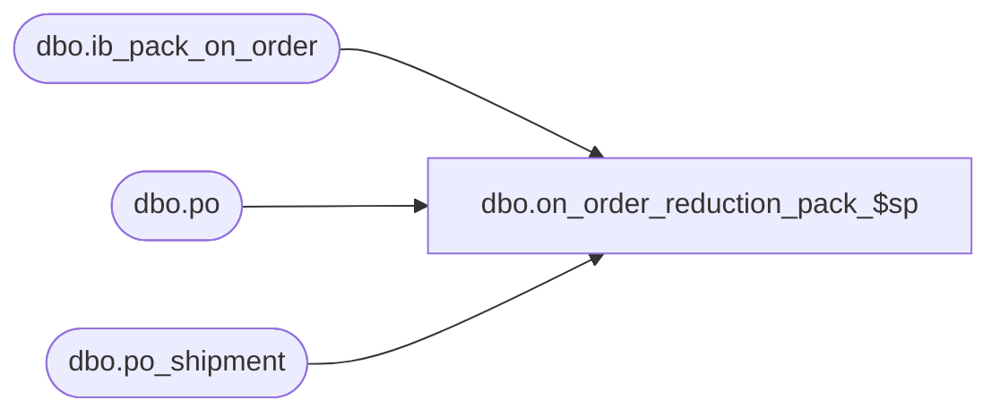

# dbo.on_order_reduction_pack_$sp

**Database:** me_01  
**Server:** bedrockdb02  

## Architecture Diagram



## Table Dependencies

| Referenced Table |
|---|
| dbo.ib_pack_on_order |
| dbo.po |
| dbo.po_shipment |

## Stored Procedure Code

```sql
-----------------------------------------------------------------------------------------------------------------------------
--	Main Query: Create Procedure
-----------------------------------------------------------------------------------------------------------------------------

CREATE PROCEDURE [dbo].[on_order_reduction_pack_$sp]

  @PO_Number VARCHAR(40)
  ,@Location_id SMALLINT
  ,@Pack_Id DECIMAL(13, 0)
  ,@Units_Reduced INT
  ,@Blanket_Cancelled BIT
  ,@PO_Shipment_Id SMALLINT = NULL
  ,@PO_Receipt_Id DECIMAL(12, 0)
AS

SET TRANSACTION ISOLATION LEVEL READ UNCOMMITTED
SET NOCOUNT ON

-----------------------------------------------------------------------------------------------------------------------------
--	Error Trapping: Check If Temp Table(s) Already Exist(s) And Drop If Applicable
-----------------------------------------------------------------------------------------------------------------------------
IF OBJECT_ID (N'tempdb.dbo.#ib_pack_on_order_total', N'U') IS NOT NULL
BEGIN

  DROP TABLE dbo.#ib_pack_on_order_total

END

IF OBJECT_ID (N'tempdb.dbo.#running_total', N'U') IS NOT NULL
BEGIN

  DROP TABLE dbo.#running_total

END

IF OBJECT_ID (N'tempdb.dbo.#pack_on_order_adjustments', N'U') IS NOT NULL
BEGIN

  DROP TABLE dbo.#pack_on_order_adjustments

END

DECLARE @Over_Receipt_Multiplier AS TABLE

  (
     multiplier INT
    ,transaction_type_code SMALLINT
  )

INSERT INTO @Over_Receipt_Multiplier

  (
    multiplier
    ,transaction_type_code
  )

SELECT
  1 AS multiplier
  ,1110 AS transaction_type_code

UNION ALL

SELECT
  CASE WHEN @Blanket_Cancelled = 1 THEN 0 ELSE -1 END AS multiplier
  ,1115 AS transaction_type_code

UNION ALL

SELECT
  CASE WHEN @Blanket_Cancelled = 1 THEN -1 ELSE 0 END AS multiplier
  ,1120 AS transaction_type_code

DECLARE @Expected_Receipt_Date SMALLDATETIME
IF (@PO_Shipment_Id <> -1)
BEGIN

  SELECT
    @Expected_Receipt_Date =
      (
        SELECT PS.expected_receipt_date
        FROM
          po_shipment PS
        INNER JOIN po PO ON PS.po_id = PO.po_id
        WHERE
          PS.po_shipment_id = @PO_Shipment_Id AND PO.po_no = @PO_Number
      )

END

CREATE TABLE dbo.#ib_pack_on_order_total
  (
    id INT IDENTITY(1,1)
    ,receipt_date SMALLDATETIME
    ,total_on_order_units BIGINT
  )

CREATE TABLE dbo.#pack_on_order_adjustments
  (
    receipt_date SMALLDATETIME
    ,transaction_type_code SMALLINT
    ,reduction_units BIGINT
  )

CREATE TABLE dbo.#running_total
  (
    id INT
    ,receipt_date SMALLDATETIME
    ,total_on_order_units BIGINT
    ,balance_on_order_units BIGINT
  )

INSERT INTO dbo.#pack_on_order_adjustments
  (
    receipt_date
    ,transaction_type_code
    ,reduction_units
  )
SELECT
  receipt_date
  ,transaction_type_code
  ,-SUM(on_order_units) reduction_units
FROM
  dbo.ib_pack_on_order IPOO
WHERE
  IPOO.document_number = @PO_Number
  AND IPOO.pack_id = @Pack_Id AND IPOO.location_id = @Location_id
  AND
    (
      @PO_Shipment_Id = -1
      OR
      (IPOO.receipt_date = @Expected_Receipt_Date AND @PO_Shipment_Id <> -1)
    )
  AND
    (
      (IPOO.transaction_type_code IN (1110,1115) AND (@Blanket_Cancelled = 0 OR @PO_Receipt_Id > 0))
      OR
      (IPOO.transaction_type_code IN (1110,1120) AND @Blanket_Cancelled = 1 AND @PO_Receipt_Id <= 0)
    )
GROUP BY
  receipt_date
  ,transaction_type_code

DECLARE @Total_Units_Reduced INT
SELECT @Total_Units_Reduced = SUM(reduction_units) FROM dbo.#pack_on_order_adjustments WHERE transaction_type_code = 1110
SET @Total_Units_Reduced = ISNULL(@Total_Units_Reduced, 0) + @Units_Reduced

INSERT INTO dbo.#ib_pack_on_order_total
  (
    receipt_date
    ,total_on_order_units
  )
SELECT
  receipt_date
  ,SUM(total_on_order_units) AS total_on_order_units
FROM
  (
    SELECT
      receipt_date
      ,SUM(on_order_units) AS total_on_order_units
    FROM
      dbo.ib_pack_on_order IPOO
    WHERE
      IPOO.document_number = @PO_Number
      AND IPOO.pack_id = @Pack_Id AND IPOO.location_id = @Location_id
      AND
        (
          @PO_Shipment_Id = -1
          OR
          (IPOO.receipt_date = @Expected_Receipt_Date AND @PO_Shipment_Id <> -1)
        )
    GROUP BY
      receipt_date
    UNION ALL
    SELECT
      receipt_date
      ,SUM(reduction_units) AS total_on_order_units
    FROM
      dbo.#pack_on_order_adjustments
    GROUP BY
      receipt_date
  ) sqIPOO
GROUP BY
  receipt_date

INSERT INTO dbo.#running_total
  (
    id
    ,receipt_date
    ,total_on_order_units
    ,balance_on_order_units
  )
SELECT
  IPOOT.id
  ,IPOOT.receipt_date
  ,IPOOT.total_on_order_units
  ,(
    SELECT
      SUM (XIPOOT.total_on_order_units)
    FROM
      dbo.#ib_pack_on_order_total XIPOOT
    WHERE
      (
        XIPOOT.id <= IPOOT.id AND @Total_Units_Reduced > 0 AND @Blanket_Cancelled = 0
      )
      OR
      (
        XIPOOT.id >= IPOOT.id AND @Total_Units_Reduced < 0 AND @Blanket_Cancelled = 0
      )
      OR
      (
        XIPOOT.id <= IPOOT.id AND @Total_Units_Reduced < 0 AND @Blanket_Cancelled = 1
      )

  ) - (@Total_Units_Reduced) AS balance_on_order_units

FROM
  dbo.#ib_pack_on_order_total IPOOT

INSERT INTO dbo.#pack_on_order_adjustments
  (
    receipt_date
    ,transaction_type_code
    ,reduction_units
  )
SELECT
  receipt_date
  ,M.transaction_type_code
  ,-1 * M.multiplier * CASE WHEN RT.balance_on_order_units <= 0 THEN RT.total_on_order_units ELSE ABS (RT.balance_on_order_units - RT.total_on_order_units) END AS reduction_units

FROM
  dbo.#running_total RT
  CROSS JOIN @Over_Receipt_Multiplier M
WHERE
  RT.balance_on_order_units < RT.total_on_order_units
  AND RT.total_on_order_units <> 0
  AND M.transaction_type_code <> 1115

UNION ALL

SELECT
  receipt_date
  ,M.transaction_type_code
  ,M.multiplier * RT.balance_on_order_units AS reduction_units
FROM
  dbo.#running_total RT
  CROSS JOIN @Over_Receipt_Multiplier M
WHERE
  RT.id = (SELECT MAX(id) FROM dbo.#running_total)
  AND RT.balance_on_order_units < 0 AND RT.total_on_order_units <> 0
  AND @Units_Reduced > 0

INSERT INTO dbo.#tt_ib_pack_on_order
  (
    pack_id
    ,location_id
    ,receipt_date
    ,document_number
    ,transaction_type_code
    ,on_order_units
  )
SELECT
  @Pack_Id AS pack_id
  ,@Location_id AS location_id
  ,POOA.receipt_date
  ,@PO_Number AS document_number
  ,POOA.transaction_type_code
  ,SUM(POOA.reduction_units) AS on_order_units
FROM
  dbo.#pack_on_order_adjustments POOA
GROUP BY
  POOA.receipt_date
  ,POOA.transaction_type_code
HAVING
  SUM(POOA.reduction_units) <> 0


-- when posting for a po receipt and Blanket_Cancelled = 1 this means that the po for the receipt is cancelled
-- need to reverse all transactions that are posted for it
IF (@PO_Receipt_Id > 0 AND @Blanket_Cancelled = 1)
BEGIN
  INSERT INTO dbo.#tt_ib_pack_on_order
  (
    pack_id
    ,location_id
    ,receipt_date
    ,document_number
    ,transaction_type_code
    ,on_order_units
  )
SELECT
  @Pack_Id AS pack_id
  ,@Location_id AS location_id
  ,t.receipt_date
  ,@PO_Number AS document_number
  ,1120 as transaction_type_code
  ,-t.on_order_units AS on_order_units
FROM
  #tt_ib_pack_on_order t
WHERE
     t.transaction_type_code = 1110
    AND on_order_units > 0
  AND t.location_id = @Location_id
    AND t.pack_id = @Pack_Id
END
```

