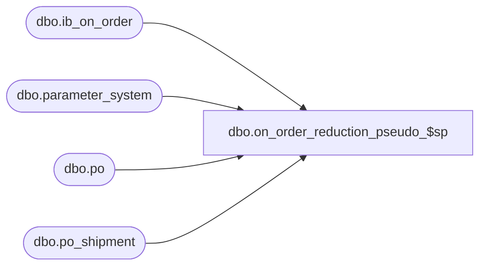

# dbo.on_order_reduction_pseudo_$sp

**Database:** me_01  
**Server:** bedrockdb02  

## Architecture Diagram



## Table Dependencies

| Referenced Table |
|---|
| dbo.ib_on_order |
| dbo.parameter_system |
| dbo.po |
| dbo.po_shipment |

## Stored Procedure Code

```sql
-----------------------------------------------------------------------------------------------------------------------------
--	Main Query: Create Procedure
-----------------------------------------------------------------------------------------------------------------------------

CREATE PROCEDURE dbo.on_order_reduction_pseudo_$sp

	@PO_Number VARCHAR(40)
	,@Sku_Id DECIMAL(13, 0)
	,@Location_id SMALLINT
	,@Pack_Id DECIMAL(13, 0)
	,@PO_Shipment_Id SMALLINT = NULL
	,@PO_Receipt_Id DECIMAL(12, 0)
	,@Actual_Receipt_Date SMALLDATETIME
	,@Units_Reduced INT
	,@Cost_Reduced FLOAT
	,@Cost_Local_Reduced FLOAT
	,@Valuation_Retail_Reduced FLOAT
	,@Selling_Retail_Reduced FLOAT
	,@Blanket_Cancelled BIT

AS

SET TRANSACTION ISOLATION LEVEL READ UNCOMMITTED
SET NOCOUNT ON

-----------------------------------------------------------------------------------------------------------------------------
--	Error Trapping: Check If Temp Table(s) Already Exist(s) And Drop If Applicable
-----------------------------------------------------------------------------------------------------------------------------
IF OBJECT_ID (N'tempdb.dbo.#ib_on_order_total', N'U') IS NOT NULL
BEGIN

	DROP TABLE dbo.#ib_on_order_total

END

IF OBJECT_ID (N'tempdb.dbo.#running_total', N'U') IS NOT NULL
BEGIN

	DROP TABLE dbo.#running_total

END

IF OBJECT_ID (N'tempdb.dbo.#on_order_adjustments', N'U') IS NOT NULL
BEGIN

	DROP TABLE dbo.#on_order_adjustments

END

IF OBJECT_ID (N'tempdb.dbo.#distinct_receipt_dates', N'U') IS NOT NULL
BEGIN

	DROP TABLE dbo.#distinct_receipt_dates

END

IF OBJECT_ID (N'tempdb.dbo.#temp_wrk_price_lookup', N'U') IS NOT NULL
BEGIN

	DROP TABLE dbo.#temp_wrk_price_lookup

END

IF OBJECT_ID (N'tempdb.dbo.#temp_price_lookup', N'U') IS NOT NULL
BEGIN

	DROP TABLE dbo.#temp_price_lookup

END

DECLARE @PO_Id AS DECIMAL(12, 0)
SELECT @PO_Id = po_id FROM po WHERE po_no = @PO_Number

DECLARE @Over_Receipt_Multiplier AS TABLE

	(
		 multiplier INT
		,transaction_type_code SMALLINT
	)

INSERT INTO @Over_Receipt_Multiplier

	(
		multiplier
		,transaction_type_code
	)

SELECT
	1 AS multiplier
	,110 AS transaction_type_code

UNION ALL

SELECT
	CASE WHEN @Blanket_Cancelled = 1 THEN 0 ELSE -1 END AS multiplier
	,115 AS transaction_type_code

UNION ALL

SELECT
	CASE WHEN @Blanket_Cancelled = 1 THEN 0 ELSE -1 END AS multiplier
	,116 AS transaction_type_code

UNION ALL

SELECT
	CASE WHEN @Blanket_Cancelled = 1 THEN 0 ELSE -1 END AS multiplier
	,117 AS transaction_type_code

UNION ALL

SELECT
	CASE WHEN @Blanket_Cancelled = 1 THEN -1 ELSE 0 END AS multiplier
	,120 AS transaction_type_code

DECLARE @Expected_Receipt_Date SMALLDATETIME

CREATE TABLE dbo.#ib_on_order_total
	(
		id INT IDENTITY(1,1)
		,receipt_date SMALLDATETIME
		,po_id DECIMAL(12, 0)
		,po_shipment_id SMALLINT
		,total_on_order_units BIGINT
		,total_on_order_cost FLOAT
		,total_on_order_cost_local FLOAT
		,total_on_order_val_retail FLOAT
		,total_on_order_selling_retail FLOAT
	)

CREATE TABLE dbo.#on_order_adjustments
	(
		receipt_date SMALLDATETIME
		,po_id DECIMAL(12, 0)
		,po_shipment_id SMALLINT
		,transaction_type_code SMALLINT
		,reduction_units BIGINT
		,reduction_cost FLOAT
		,reduction_cost_local FLOAT
		,reduction_val_retail FLOAT
		,reduction_selling_retail FLOAT
	)

CREATE TABLE dbo.#running_total
	(
		id INT
		,receipt_date SMALLDATETIME
		,po_id DECIMAL(12, 0)
		,po_shipment_id SMALLINT
		,total_on_order_units BIGINT
		,total_on_order_cost FLOAT
		,total_on_order_cost_local FLOAT
		,total_on_order_val_retail FLOAT
		,total_on_order_selling_retail FLOAT
		,balance_on_order_units BIGINT
		,balance_on_order_cost FLOAT
		,balance_on_order_cost_local FLOAT
		,balance_on_order_val_retail FLOAT
		,balance_on_order_selling_retail FLOAT
	)

INSERT INTO dbo.#on_order_adjustments
	(
		receipt_date
		,po_id
		,po_shipment_id
		,transaction_type_code
		,reduction_units
		,reduction_cost
		,reduction_cost_local
		,reduction_val_retail
		,reduction_selling_retail
	)
SELECT
	receipt_date
	,po_id
	,po_shipment_id
	,transaction_type_code
	,-SUM(on_order_units) AS reduction_units
	,-SUM(on_order_cost) AS reduction_cost
	,-SUM(on_order_cost_local) AS reduction_cost_local
	,-SUM(on_order_valuation_retail) AS reduction_val_retail
	,-SUM(on_order_selling_retail) AS reduction_selling_retail
FROM
	dbo.ib_on_order IOO
WHERE
	IOO.document_number = @PO_Number
	AND IOO.sku_id = @Sku_Id AND IOO.location_id = @Location_id
	AND COALESCE(IOO.pack_id, -1) = @Pack_Id
	AND (@PO_Shipment_Id = -1 OR IOO.po_shipment_id = @PO_Shipment_Id)
	AND
		(
			(IOO.transaction_type_code IN (110,115,116,117) AND @Blanket_Cancelled = 0)
			OR
			(IOO.transaction_type_code IN (110,120) AND @Blanket_Cancelled = 1)
		)
GROUP BY
	receipt_date
	,po_id
	,po_shipment_id
	,transaction_type_code

DECLARE
	@Total_Units_Reduced INT
	,@Total_Cost_Reduced FLOAT
	,@Total_Cost_Local_Reduced FLOAT
	,@Total_Valuation_Retail_Reduced FLOAT
	,@Total_Selling_Retail_Reduced FLOAT
SELECT
	@Total_Units_Reduced = @Units_Reduced
	,@Total_Cost_Reduced = @Cost_Reduced
	,@Total_Cost_Local_Reduced = @Cost_Local_Reduced
	,@Total_Valuation_Retail_Reduced = @Valuation_Retail_Reduced
	,@Total_Selling_Retail_Reduced = @Selling_Retail_Reduced

IF EXISTS ( SELECT 1 FROM dbo.#on_order_adjustments )
BEGIN

	SELECT
		@Total_Units_Reduced = SUM(reduction_units) + @Units_Reduced
		,@Total_Cost_Reduced = SUM(reduction_cost) + @Cost_Reduced
		,@Total_Cost_Local_Reduced = SUM(reduction_cost_local) + @Cost_Local_Reduced
		,@Total_Valuation_Retail_Reduced = SUM(reduction_val_retail) + @Valuation_Retail_Reduced
		,@Total_Selling_Retail_Reduced = SUM(reduction_selling_retail) + @Selling_Retail_Reduced
	FROM
		dbo.#on_order_adjustments
	WHERE
		transaction_type_code = 110

END

INSERT INTO dbo.#ib_on_order_total
	(
		receipt_date
		,po_id
		,po_shipment_id
		,total_on_order_units
		,total_on_order_cost
		,total_on_order_cost_local
		,total_on_order_val_retail
		,total_on_order_selling_retail
	)
SELECT
	receipt_date
	,po_id
	,po_shipment_id
	,SUM(total_on_order_units) AS total_on_order_units
	,SUM(total_on_order_cost) AS total_on_order_cost
	,SUM(total_on_order_cost_local) AS total_on_order_cost_local
	,SUM(total_on_order_val_retail) AS total_on_order_val_retail
	,SUM(total_on_order_selling_retail) AS total_on_order_selling_retail
FROM
	(
		SELECT
			receipt_date
			,po_id
			,po_shipment_id
			,SUM(on_order_units) AS total_on_order_units
			,SUM(on_order_cost) AS total_on_order_cost
			,SUM(on_order_cost_local) AS total_on_order_cost_local
			,SUM(on_order_valuation_retail) AS total_on_order_val_retail
			,SUM(on_order_selling_retail) AS total_on_order_selling_retail
		FROM
			dbo.ib_on_order IOO
		WHERE
			IOO.document_number = @PO_Number
			AND IOO.sku_id = @Sku_Id AND IOO.location_id = @Location_id
			AND COALESCE(IOO.pack_id, -1) = @Pack_Id
			AND (@PO_Shipment_Id = -1 OR IOO.po_shipment_id = @PO_Shipment_Id)
		GROUP BY
			receipt_date
			,po_id
			,po_shipment_id
		UNION ALL
		SELECT
			receipt_date
			,po_id
			,po_shipment_id
			,SUM(reduction_units) AS total_on_order_units
			,SUM(reduction_cost) AS total_on_order_cost
			,SUM(reduction_cost_local) AS total_on_order_cost_local
			,SUM(reduction_val_retail) AS total_on_order_val_retail
			,SUM(reduction_selling_retail) AS total_on_order_selling_retail
		FROM
			dbo.#on_order_adjustments
		GROUP BY
			receipt_date
			,po_id
			,po_shipment_id
	) sqIOO
GROUP BY
	receipt_date
	,po_id
	,po_shipment_id

INSERT INTO dbo.#running_total
	(
		id
		,receipt_date
		,po_id
		,po_shipment_id
		,total_on_order_units
		,total_on_order_cost
		,total_on_order_cost_local
		,total_on_order_val_retail
		,total_on_order_selling_retail
		,balance_on_order_units
		,balance_on_order_cost
		,balance_on_order_cost_local
		,balance_on_order_val_retail
		,balance_on_order_selling_retail
	)
SELECT
	IOOT.id
	,IOOT.receipt_date
	,IOOT.po_id
	,IOOT.po_shipment_id
	,IOOT.total_on_order_units
	,IOOT.total_on_order_cost
	,IOOT.total_on_order_cost_local
	,IOOT.total_on_order_val_retail
	,IOOT.total_on_order_selling_retail
	,(
		SELECT
			SUM (XIOOT.total_on_order_units)
		FROM
			dbo.#ib_on_order_total XIOOT
		WHERE
			(
				XIOOT.id <= IOOT.id AND @Total_Units_Reduced > 0 AND @Blanket_Cancelled = 0
			)
			OR
			(
				XIOOT.id >= IOOT.id AND @Total_Units_Reduced < 0 AND @Blanket_Cancelled = 0
			)
			OR
			(
				XIOOT.id <= IOOT.id AND @Total_Units_Reduced < 0 AND @Blanket_Cancelled = 1
			)

	) - (@Total_Units_Reduced) AS balance_on_order_units
	,(
		SELECT
			SUM (XIOOT.total_on_order_cost)
		FROM
			dbo.#ib_on_order_total XIOOT
		WHERE
			(
				XIOOT.id <= IOOT.id AND @Total_Cost_Reduced > 0 AND @Blanket_Cancelled = 0
			)
			OR
			(
				XIOOT.id >= IOOT.id AND @Total_Cost_Reduced < 0 AND @Blanket_Cancelled = 0
			)
			OR
			(
				XIOOT.id <= IOOT.id AND @Total_Cost_Reduced < 0 AND @Blanket_Cancelled = 1
			)

	) - (@Total_Cost_Reduced) AS balance_on_order_cost
	,(
		SELECT
			SUM (XIOOT.total_on_order_cost_local)
		FROM
			dbo.#ib_on_order_total XIOOT
		WHERE
			(
				XIOOT.id <= IOOT.id AND @Total_Cost_Local_Reduced > 0 AND @Blanket_Cancelled = 0
			)
			OR
			(
				XIOOT.id >= IOOT.id AND @Total_Cost_Local_Reduced < 0 AND @Blanket_Cancelled = 0
			)
			OR
			(
				XIOOT.id <= IOOT.id AND @Total_Cost_Local_Reduced < 0 AND @Blanket_Cancelled = 1
			)

	) - (@Total_Cost_Local_Reduced) AS balance_on_order_cost_local
	,(
		SELECT
			SUM (XIOOT.total_on_order_val_retail)
		FROM
			dbo.#ib_on_order_total XIOOT
		WHERE
			(
				XIOOT.id <= IOOT.id AND @Total_Valuation_Retail_Reduced > 0 AND @Blanket_Cancelled = 0
			)
			OR
			(
				XIOOT.id >= IOOT.id AND @Total_Valuation_Retail_Reduced < 0 AND @Blanket_Cancelled = 0
			)
			OR
			(
				XIOOT.id <= IOOT.id AND @Total_Valuation_Retail_Reduced < 0 AND @Blanket_Cancelled = 1
			)

	) - (@Total_Valuation_Retail_Reduced) AS balance_on_order_val_retail
	,(
		SELECT
			SUM (XIOOT.total_on_order_selling_retail)
		FROM
			dbo.#ib_on_order_total XIOOT
		WHERE
			(
				XIOOT.id <= IOOT.id AND @Total_Selling_Retail_Reduced > 0 AND @Blanket_Cancelled = 0
			)
			OR
			(
				XIOOT.id >= IOOT.id AND @Total_Selling_Retail_Reduced < 0 AND @Blanket_Cancelled = 0
			)
			OR
			(
				XIOOT.id <= IOOT.id AND @Total_Selling_Retail_Reduced < 0 AND @Blanket_Cancelled = 1
			)

	) - (@Total_Selling_Retail_Reduced) AS balance_on_order_selling_retail

FROM
	dbo.#ib_on_order_total IOOT

INSERT INTO dbo.#on_order_adjustments
	(
		receipt_date
		,po_id
		,po_shipment_id
		,transaction_type_code
		,reduction_units
		,reduction_cost
		,reduction_cost_local
		,reduction_val_retail
		,reduction_selling_retail
	)
SELECT
	receipt_date
	,po_id
	,po_shipment_id
	,M.transaction_type_code
	,-1 * M.multiplier * CASE WHEN RT.balance_on_order_units <= 0 THEN RT.total_on_order_units ELSE ABS (RT.balance_on_order_units - RT.total_on_order_units) END AS reduction_units
	,-1 * M.multiplier * CASE WHEN RT.balance_on_order_cost <= 0 THEN RT.total_on_order_cost ELSE ABS (RT.balance_on_order_cost - RT.total_on_order_cost) END AS reduction_cost
	,-1 * M.multiplier * CASE WHEN RT.balance_on_order_cost_local <= 0 THEN RT.total_on_order_cost_local ELSE ABS (RT.balance_on_order_cost_local - RT.total_on_order_cost_local) END AS reduction_cost_local
	,-1 * M.multiplier * CASE WHEN RT.balance_on_order_val_retail <= 0 THEN RT.total_on_order_val_retail ELSE ABS (RT.balance_on_order_val_retail - RT.total_on_order_val_retail) END AS reduction_val_retail
	,-1 * M.multiplier * CASE WHEN RT.balance_on_order_selling_retail <= 0 THEN RT.total_on_order_selling_retail ELSE ABS (RT.balance_on_order_selling_retail - RT.total_on_order_selling_retail) END AS reduction_selling_retail
FROM
	dbo.#running_total RT
	CROSS JOIN @Over_Receipt_Multiplier M
WHERE
	(RT.balance_on_order_units < RT.total_on_order_units
		OR RT.balance_on_order_cost < RT.total_on_order_cost
		OR RT.balance_on_order_cost_local < RT.total_on_order_cost_local)
	AND M.transaction_type_code NOT IN (115,116,117)
	AND (RT.total_on_order_units <> 0
			OR RT.total_on_order_cost <> 0
			OR RT.total_on_order_cost_local <> 0)

UNION ALL

SELECT
	receipt_date
	,po_id
	,po_shipment_id
	,M.transaction_type_code
	,M.multiplier * RT.balance_on_order_units AS reduction_units
	,0 AS reduction_cost
	,0 AS reduction_cost_local
	,0 AS reduction_val_retail
	,0 AS reduction_selling_retail
FROM
	dbo.#running_total RT
	CROSS JOIN @Over_Receipt_Multiplier M
WHERE
	RT.id = (SELECT MAX(id) FROM dbo.#running_total)
	AND (RT.balance_on_order_units < 0 AND RT.total_on_order_units <> 0)
	AND (@Total_Units_Reduced > 0)
	AND M.transaction_type_code IN (110,115)

UNION ALL

SELECT
	receipt_date
	,po_id
	,po_shipment_id
	,M.transaction_type_code
	,0 AS reduction_units
	,M.multiplier * RT.balance_on_order_cost AS reduction_cost
	,M.multiplier * RT.balance_on_order_cost_local AS reduction_cost_local
	,0 AS reduction_val_retail
	,0 AS reduction_selling_retail
FROM
	dbo.#running_total RT
	CROSS JOIN @Over_Receipt_Multiplier M
WHERE
	RT.id = (SELECT MAX(id) FROM dbo.#running_total)
	AND
		(
			(RT.balance_on_order_cost < 0 AND RT.total_on_order_cost <> 0)
			OR (RT.balance_on_order_cost_local < 0 AND RT.total_on_order_cost_local <> 0)
		)
	AND (@Total_Cost_Reduced > 0 OR @Total_Cost_Local_Reduced > 0)
	AND M.transaction_type_code IN (110,117)

UNION ALL

SELECT
	receipt_date
	,po_id
	,po_shipment_id
	,M.transaction_type_code
	,0 AS reduction_units
	,0 AS reduction_cost
	,0 AS reduction_cost_local
	,M.multiplier * RT.balance_on_order_val_retail AS reduction_val_retail
	,M.multiplier * RT.balance_on_order_selling_retail AS reduction_selling_retail
FROM
	dbo.#running_total RT
	CROSS JOIN @Over_Receipt_Multiplier M
WHERE
	RT.id = (SELECT MAX(id) FROM dbo.#running_total)
	AND
		(
			(RT.balance_on_order_val_retail < 0 AND RT.total_on_order_val_retail <> 0)
			OR (RT.balance_on_order_selling_retail < 0 AND RT.total_on_order_selling_retail <> 0)
		)
	AND (@Total_Valuation_Retail_Reduced > 0 OR @Total_Selling_Retail_Reduced > 0)
	AND M.transaction_type_code IN (110,116)

IF NOT EXISTS
	(
		SELECT 1
		FROM
			dbo.#ib_on_order_total
		WHERE
			(@PO_Shipment_Id = -1 OR po_shipment_id = @PO_Shipment_Id)
			AND
				(
					total_on_order_units <> 0
					OR total_on_order_cost <> 0
					OR total_on_order_cost_local <> 0
					OR total_on_order_val_retail <> 0
					OR total_on_order_selling_retail <> 0
				)
	)
BEGIN

	DECLARE @Earliest_ERD AS SMALLDATETIME

	IF (@PO_Shipment_Id = -1)
	BEGIN

		SELECT
			@Earliest_ERD = MIN(PS.expected_receipt_date)
		FROM
			po_shipment PS
		WHERE
			PS.po_id = @PO_Id

		SELECT
			@PO_Shipment_Id = MIN(PS.po_shipment_id)
		FROM
			po_shipment PS
		WHERE
			expected_receipt_date = @Earliest_ERD

	END
	ELSE
	BEGIN

		SELECT
			@Earliest_ERD = PS.expected_receipt_date
		FROM
			po_shipment PS
		WHERE
			PS.po_id = @PO_Id AND PS.po_shipment_id = @PO_Shipment_Id

	END

	INSERT INTO dbo.#on_order_adjustments
		(
			receipt_date
			,po_id
			,po_shipment_id
			,transaction_type_code
			,reduction_units
			,reduction_cost
			,reduction_cost_local
			,reduction_val_retail
			,reduction_selling_retail
		)
	SELECT
		@Earliest_ERD
		,@PO_Id
		,@PO_Shipment_Id
		,M.transaction_type_code
		,-1 * M.multiplier * @Units_Reduced AS reduction_units
		,0 AS reduction_cost
		,0 AS reduction_cost_local
		,0 AS reduction_val_retail
		,0 AS reduction_selling_retail
	FROM
		@Over_Receipt_Multiplier M
	WHERE
		M.transaction_type_code = 115

	INSERT INTO dbo.#on_order_adjustments
		(
			receipt_date
			,po_id
			,po_shipment_id
			,transaction_type_code
			,reduction_units
			,reduction_cost
			,reduction_cost_local
			,reduction_val_retail
			,reduction_selling_retail
		)
	SELECT
		@Earliest_ERD
		,@PO_Id
		,@PO_Shipment_Id
		,M.transaction_type_code
		,0 AS reduction_units
		,-1 * M.multiplier * @Cost_Reduced AS reduction_cost
		,-1 * M.multiplier * @Cost_Local_Reduced AS reduction_cost_local
		,0 AS reduction_val_retail
		,0 AS reduction_selling_retail
	FROM
		@Over_Receipt_Multiplier M
	WHERE
		M.transaction_type_code = 117

	INSERT INTO dbo.#on_order_adjustments
		(
			receipt_date
			,po_id
			,po_shipment_id
			,transaction_type_code
			,reduction_units
			,reduction_cost
			,reduction_cost_local
			,reduction_val_retail
			,reduction_selling_retail
		)
	SELECT
		@Earliest_ERD
		,@PO_Id
		,@PO_Shipment_Id
		,M.transaction_type_code
		,0 AS reduction_units
		,0 AS reduction_cost
		,0 AS reduction_cost_local
		,-1 * M.multiplier * @Valuation_Retail_Reduced AS reduction_val_retail
		,-1 * M.multiplier * @Selling_Retail_Reduced AS reduction_selling_retail
	FROM
		@Over_Receipt_Multiplier M
	WHERE
		M.transaction_type_code = 116

END

INSERT INTO dbo.#tt_ib_on_order
	(
		sku_id
		,location_id
		,receipt_date
		,document_number
		,transaction_type_code
		,price_status_id
		,pack_id
		,po_id
		,po_shipment_id
		,on_order_units
		,on_order_cost
		,on_order_cost_local
		,on_order_valuation_retail
		,on_order_selling_retail
		,po_receipt_id
		,actual_receipt_date
		,received_quantity
	)
SELECT
	@Sku_Id AS sku_id
	,@Location_id AS location_id
	,OOA.receipt_date
	,@PO_Number AS document_number
	,OOA.transaction_type_code
	,PS.pseudo_price_status_id AS price_status_id
	,CASE WHEN @Pack_Id = -1 THEN NULL ELSE @Pack_Id END AS pack_id
	,OOA.po_id
	,OOA.po_shipment_id
	,SUM(OOA.reduction_units) AS reduction_units
	,SUM(OOA.reduction_cost) AS reduction_cost
	,SUM(OOA.reduction_cost_local) AS reduction_cost_local
	,SUM(OOA.reduction_val_retail) AS on_order_valuation_retail
	,SUM(OOA.reduction_selling_retail) AS on_order_selling_retail
	,CASE WHEN OOA.transaction_type_code = 110 AND @PO_Receipt_Id <> -1 THEN @PO_Receipt_Id ELSE NULL END AS po_receipt_id
	,CASE WHEN OOA.transaction_type_code = 110 AND @PO_Receipt_Id <> -1 THEN @Actual_Receipt_Date ELSE NULL END AS actual_receipt_date
	,CASE WHEN OOA.transaction_type_code = 110 AND @PO_Receipt_Id <> -1 THEN SUM(-1 * OOA.reduction_units) ELSE NULL END AS received_quantity
FROM
	dbo.#on_order_adjustments OOA
	CROSS JOIN parameter_system PS
GROUP BY
	OOA.receipt_date
	,OOA.transaction_type_code
	,PS.pseudo_price_status_id
	,OOA.po_id
	,OOA.po_shipment_id
HAVING
	SUM(OOA.reduction_units) <> 0
	OR SUM(OOA.reduction_cost) <> 0 OR SUM(OOA.reduction_cost_local) <> 0
	OR SUM(OOA.reduction_val_retail) <> 0 OR SUM(OOA.reduction_selling_retail) <> 0
```

