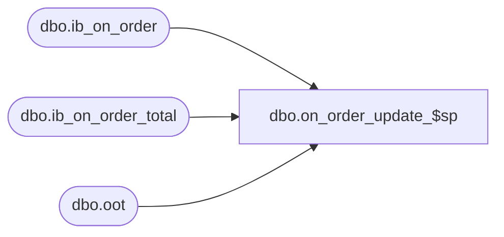

# dbo.on_order_update_$sp

**Database:** me_01  
**Server:** bedrockdb02  

## Architecture Diagram



## Table Dependencies

| Referenced Table |
|---|
| dbo.ib_on_order |
| dbo.ib_on_order_total |
| dbo.oot |

## Stored Procedure Code

```sql
CREATE PROCEDURE [dbo].[on_order_update_$sp] 
	(@source_statement AS NVARCHAR(4000))
AS

-- =============================================
-- Author:		Yan
-- Create date: 2010
-- Description:	This is part of the ib_order trigger removal. It populates ib_on_order and ib_on_order_total
-- Port Defect #142021 porting defect #1-4AE2RL on_order_update_$sp has constraint on table name ##oo_upd_total which causes locking in tempdb
-- =============================================

BEGIN

DECLARE 
	@UseTran	BIT,
	@DelTmpTbl	BIT,
	@ErrorVar	INT,
	@ErrorMsg	NVARCHAR(1000);

	-- SET NOCOUNT ON added to prevent extra result sets from
	-- interfering with SELECT statements.
	SET NOCOUNT ON;

	-- Set local transaction control flag
	SET @UseTran = 0;
	-- Set delete temporary table flag
	SET @DelTmpTbl = 0;

	-- Only call BEGIN TRAN if we are not in a transaction
	-- Note: There is no "Rollback" to a nested transaction. Rollback needs to go
	--       back to the outer most "Begin Tran". Also, "Save Transaction" does not
	--       work within a distribution transaction so no luck there either. 
	IF @@TRANCOUNT = 0
	BEGIN
		BEGIN TRAN;
		SET @UseTran = 1;
	END;

	-- Create temporary table
	CREATE TABLE #oo_upd(
		oo_upd_id						DECIMAL(12, 0) IDENTITY(1,1) NOT NULL,
		sku_id							DECIMAL(13, 0) NOT NULL,
		location_id						SMALLINT NOT NULL,
		receipt_date					SMALLDATETIME NOT NULL,
		transaction_type_code		SMALLINT NOT NULL,
		price_status_id				SMALLINT NOT NULL,
		on_order_units					INT NOT NULL DEFAULT ((0)),
		on_order_cost					DECIMAL(14, 2) NOT NULL DEFAULT ((0)),
		on_order_cost_local			DECIMAL(14, 2) NULL,
		on_order_valuation_retail	DECIMAL(14, 2) NOT NULL DEFAULT ((0)),
		on_order_selling_retail		DECIMAL(14, 2) NOT NULL DEFAULT ((0)),
		document_number				NVARCHAR(20) NOT NULL,
		pack_id							DECIMAL(12, 0) NULL,
		po_receipt_id					DECIMAL(12, 0) NULL,	
		actual_receipt_date				SMALLDATETIME NULL,
		received_quantity				INT NULL,
		po_id								DECIMAL(12, 0) NULL,
		po_shipment_id					SMALLINT NULL
		PRIMARY KEY CLUSTERED (oo_upd_id ASC)
		);

	SET @ErrorVar = @@ERROR;
	IF @ErrorVar <> 0
	BEGIN
		SET @ErrorMsg = N'onorder_update_$sp: Failed to create #oo_upd. Err' + CAST(@ErrorVar AS NVARCHAR(20));
		GOTO ERROR_HANDLER;
	END;

	-- Create temporary table
	CREATE TABLE #oo_upd_total(
		document_number					NVARCHAR(20) NOT NULL,
		sku_id								DECIMAL(13, 0) NOT NULL,
		location_id							SMALLINT NOT NULL,
		receipt_date						SMALLDATETIME NOT NULL,
		price_status_id					SMALLINT NOT NULL,
		total_on_order_units				INT NOT NULL DEFAULT ((0)),
		total_on_order_cost				DECIMAL(14, 2) NOT NULL DEFAULT ((0.00)),
		total_on_order_cost_local		DECIMAL(14, 2) NULL,
		total_on_order_selling_retail	DECIMAL(14, 2) NOT NULL DEFAULT ((0.00)),
		--total_on_order_val_retail		DECIMAL(14, 2) NOT NULL CONSTRAINT [DF_IB_ON_ORDER_TOTAL]  DEFAULT ((0.00)),
		total_on_order_val_retail		DECIMAL(14, 2) NOT NULL DEFAULT ((0.00)),
		pack_id								DECIMAL(12, 0) NULL,
		UNIQUE CLUSTERED (document_number ASC, sku_id ASC, location_id ASC, receipt_date ASC, pack_id ASC)
		);

	SET @ErrorVar = @@ERROR;
	IF @ErrorVar <> 0
	BEGIN
		SET @ErrorMsg = N'onorder_update_$sp: Failed to create #oo_upd_total. Err' + CAST(@ErrorVar AS NVARCHAR(20));
		GOTO ERROR_HANDLER;
	END;

	-- Temp table created
	SET @DelTmpTbl = 1;

	-- Execute the passed in query and insert into #oo_upd
	SET @source_statement = N'INSERT INTO #oo_upd 
			(sku_id, location_id, receipt_date, transaction_type_code, price_status_id,
			 on_order_units, on_order_cost, on_order_cost_local, on_order_valuation_retail,
			 on_order_selling_retail, document_number, pack_id, po_receipt_id, actual_receipt_date, received_quantity, po_id, po_shipment_id) ' + @source_statement;

	EXEC sp_executesql @source_statement;

	SET @ErrorVar = @@ERROR;
	IF @ErrorVar <> 0
	BEGIN
		SET @ErrorMsg = N'onorder_update_$sp: Failed to populate #oo_upd (' + @source_statement + N'). Err' + CAST(@ErrorVar AS NVARCHAR(20));
		GOTO ERROR_HANDLER;
	END;

	-- INSERT into ib_on_order
	INSERT INTO ib_on_order 
		(sku_id, location_id, receipt_date, transaction_type_code, price_status_id,
		 on_order_units, on_order_cost, on_order_cost_local, on_order_valuation_retail,
		 on_order_selling_retail, document_number, pack_id, po_receipt_id, actual_receipt_date, received_quantity, po_id, po_shipment_id)
	SELECT 
		sku_id, location_id, receipt_date, transaction_type_code, price_status_id,
		 on_order_units, on_order_cost, on_order_cost_local, on_order_valuation_retail,
		 on_order_selling_retail, document_number, pack_id, po_receipt_id, actual_receipt_date, received_quantity, po_id, po_shipment_id
		FROM #oo_upd;

	SET @ErrorVar = @@ERROR;
	IF @ErrorVar <> 0
	BEGIN
		SET @ErrorMsg = N'onorder_update_$sp: Failed INSERT INTO ib_on_order from #oo_upd. Err' + CAST(@ErrorVar AS NVARCHAR(20));
		GOTO ERROR_HANDLER;
	END;

	-- INSERT into #oo_upd_total (the last price id for each doc/sku/loc/rect_date/pack will be used)
	INSERT #oo_upd_total
		(document_number, sku_id, location_id, receipt_date, price_status_id,
		 total_on_order_units, total_on_order_cost, total_on_order_cost_local,
		 total_on_order_selling_retail, total_on_order_val_retail, pack_id)
	SELECT 
		upd.document_number, upd.sku_id, upd.location_id, upd.receipt_date, p.price_status_id,
		 SUM(upd.on_order_units), SUM(upd.on_order_cost), SUM(upd.on_order_cost_local),
		 SUM(upd.on_order_selling_retail), SUM(upd.on_order_valuation_retail), upd.pack_id
	FROM #oo_upd upd
	INNER JOIN 
	      (SELECT t.document_number, t.sku_id, t.location_id, t.receipt_date, t.pack_id, t.price_status_id
		    FROM   #oo_upd t
	       INNER  JOIN
	             (SELECT document_number, sku_id, location_id, receipt_date, pack_id, 
	                     MAX(oo_upd_id) oo_upd_id
	              FROM   #oo_upd
	              GROUP  BY document_number, sku_id, location_id, receipt_date, pack_id) m
	          ON  t.oo_upd_id = m.oo_upd_id) p
	   ON  upd.document_number = p.document_number
	   AND upd.sku_id = p.sku_id
	   AND upd.location_id = p.location_id
	   AND upd.receipt_date = p.receipt_date
	   AND (upd.pack_id = p.pack_id OR
	       (upd.pack_id IS NULL AND p.pack_id IS NULL))
	GROUP  BY upd.document_number, upd.sku_id, upd.location_id, upd.receipt_date, p.price_status_id, upd.pack_id;

	SET @ErrorVar = @@ERROR;
	IF @ErrorVar <> 0
	BEGIN
		SET @ErrorMsg = N'onorder_update_$sp: Failed INSERT INTO #oo_upd_total from #oo_upd. Err' + CAST(@ErrorVar AS NVARCHAR(20));
		GOTO ERROR_HANDLER;
	END;

	-- UPDATE ib_on_order_total for existing doc/sku/loc/rect_date/pack rows
	UPDATE
		oot
	SET
		document_number = t.document_number
		, sku_id = t.sku_id
		, location_id = t.location_id
		, receipt_date = t.receipt_date
		, price_status_id = t.price_status_id
		, total_on_order_units = oot.total_on_order_units + t.total_on_order_units
		, total_on_order_cost = oot.total_on_order_cost + t.total_on_order_cost
		, total_on_order_cost_local = COALESCE(oot.total_on_order_cost_local, 0) + t.total_on_order_cost_local
		, total_on_order_selling_retail = oot.total_on_order_selling_retail + t.total_on_order_selling_retail
		, total_on_order_val_retail = oot.total_on_order_val_retail + t.total_on_order_val_retail
		, pack_id = t.pack_id
	FROM			
		#oo_upd_total t
	INNER JOIN ib_on_order_total oot
		ON  oot.document_number = t.document_number
		AND oot.sku_id = t.sku_id
		AND oot.location_id = t.location_id
		AND oot.receipt_date = t.receipt_date
		AND (oot.pack_id = t.pack_id OR
			 (oot.pack_id IS NULL AND t.pack_id IS NULL));

	SET @ErrorVar = @@ERROR;
	IF @ErrorVar <> 0
	BEGIN
		SET @ErrorMsg = N'onorder_update_$sp: Failed UPDATE ib_on_order_total from #oo_upd_total. Err' + CAST(@ErrorVar AS NVARCHAR(20));
		GOTO ERROR_HANDLER;
	END;

	-- INSERT into ib_on_order_total for new doc/sku/loc/rect_date/pack rows
	INSERT ib_on_order_total 
		(document_number, sku_id, location_id, receipt_date, price_status_id,
		 total_on_order_units, total_on_order_cost, total_on_order_cost_local,
		 total_on_order_selling_retail, total_on_order_val_retail, pack_id)
	SELECT 
		 document_number, sku_id, location_id, receipt_date, price_status_id,
		 total_on_order_units, total_on_order_cost, total_on_order_cost_local,
		 total_on_order_selling_retail, total_on_order_val_retail, pack_id
	FROM 
		#oo_upd_total upd
	WHERE 
		NOT EXISTS (
			SELECT 1
			FROM   ib_on_order_total oot
			WHERE  oot.document_number = upd.document_number
				AND oot.sku_id = upd.sku_id
				AND oot.location_id = upd.location_id
				AND oot.receipt_date = upd.receipt_date
				AND (oot.pack_id = upd.pack_id OR
					 (oot.pack_id IS NULL AND upd.pack_id IS NULL))
		)
	

	SET @ErrorVar = @@ERROR;
	IF @ErrorVar <> 0
	BEGIN
		SET @ErrorMsg = N'onorder_update_$sp: Failed INSERT INTO ib_on_order_total from #oo_upd_total. Err' + CAST(@ErrorVar AS NVARCHAR(20));
		GOTO ERROR_HANDLER;
	END;

	-- Drop temporary tables
	DROP TABLE #oo_upd;

	SET @ErrorVar = @@ERROR;
	IF @ErrorVar <> 0
	BEGIN
		SET @ErrorMsg = N'onorder_update_$sp: Failed DELETE #oo_upd. Err' + CAST(@ErrorVar AS NVARCHAR(20));
		GOTO ERROR_HANDLER;
	END;

	DROP TABLE #oo_upd_total;

	SET @ErrorVar = @@ERROR;
	IF @ErrorVar <> 0
	BEGIN
		SET @ErrorMsg = N'onorder_update_$sp: Failed DELETE #oo_upd_total. Err' + CAST(@ErrorVar AS NVARCHAR(20));
		GOTO ERROR_HANDLER;
	END;


	-- Commit transaction if in locally controlled transaction
	IF @UseTran = 1
	BEGIN
		COMMIT TRAN;
	END;

	-- Done!
	RETURN;

ERROR_HANDLER:
	-- Drop temp table if exists
	IF @DelTmpTbl = 1
	BEGIN
		DROP TABLE #oo_upd;
		DROP TABLE #oo_upd_total;
	END;
	-- Rollback transaction if in locally controlled transaction
	IF @UseTran = 1
	BEGIN
		ROLLBACK TRAN;
	END;
	-- Raise an error
	RAISERROR(@ErrorMsg, 16, 1);
	-- Exit
	RETURN;

END;
```

