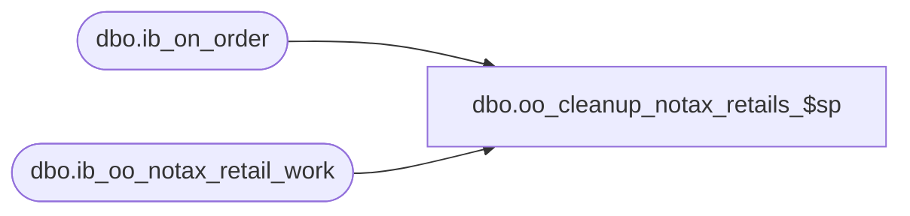

# dbo.oo_cleanup_notax_retails_$sp

**Database:** me_01  
**Server:** bedrockdb02  

## Architecture Diagram



## Table Dependencies

| Referenced Table |
|---|
| dbo.ib_on_order |
| dbo.ib_oo_notax_retail_work |

## Stored Procedure Code

```sql
CREATE PROC dbo.oo_cleanup_notax_retails_$sp

AS

/* 
Proc name: 	oo_cleanup_notax_retails_$sp
Description:	Cleans up rows in ib_oo_notax_retail_work that have no matching rows in ib_on_order.
		Usually run once when the ib_on_order_$trD trigger is installed.

HISTORY: 
Date       	Name         	Def#	Desc
Jan 28, 08   	Yves Rivest		Part of Merch 4.X - Tax-exclusive retails in MA
*/

BEGIN
 
	DELETE	dbo.ib_oo_notax_retail_work
	WHERE	NOT EXISTS (SELECT 1
				FROM dbo.ib_on_order oo
				WHERE oo.ib_on_order_id = ib_oo_notax_retail_work.ib_on_order_id)
END
```

