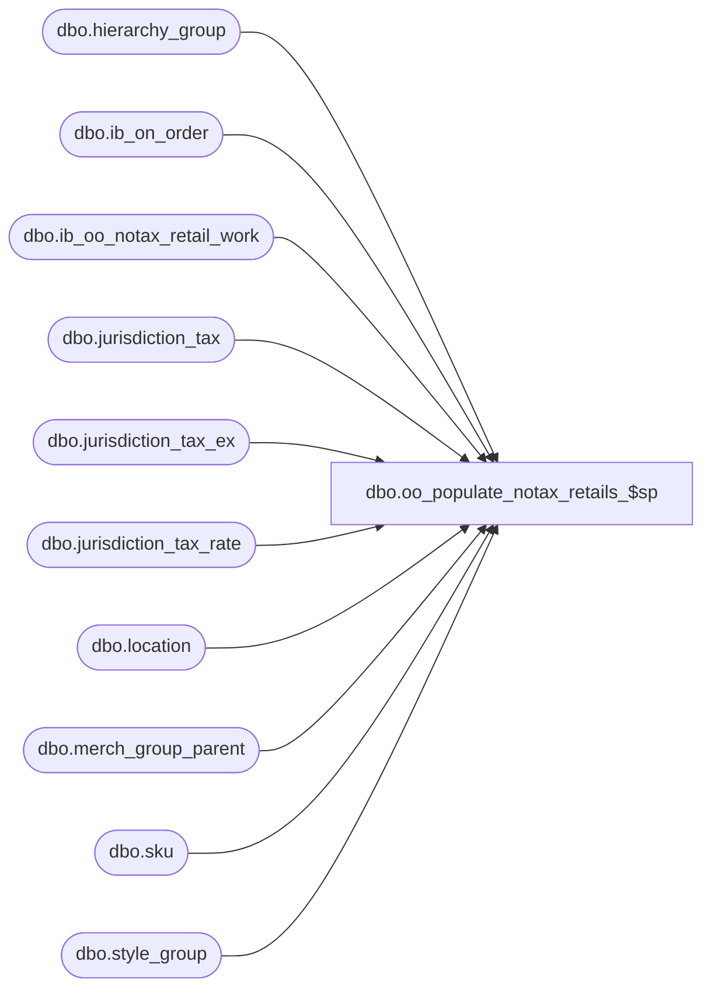

# dbo.oo_populate_notax_retails_$sp

**Database:** me_01  
**Server:** bedrockdb02  

## Architecture Diagram



## Table Dependencies

| Referenced Table |
|---|
| dbo.hierarchy_group |
| dbo.ib_on_order |
| dbo.ib_oo_notax_retail_work |
| dbo.jurisdiction_tax |
| dbo.jurisdiction_tax_ex |
| dbo.jurisdiction_tax_rate |
| dbo.location |
| dbo.merch_group_parent |
| dbo.sku |
| dbo.style_group |

## Stored Procedure Code

```sql
CREATE PROC [dbo].[oo_populate_notax_retails_$sp] 

AS

/* 
Proc name: 	oo_populate_notax_retails_$sp
Description:	Retrieves the tax-exclusive retail values for a range of ib_on_order rows and populates
		the ib_oo_notax_retail_work table

HISTORY: 
Date       	Name         	Def#	Desc
May 31, 07   	Yves Rivest		Part of Merch 4.X - Tax-exclusive retails in MA
Jan 28, 08   	Yves Rivest		Fixed issues caused by incorrect logic in start/end and row count
*/

DECLARE
@count_ib	INT,
@count_notax	INT,
@start_id	DECIMAL(12,0),
@end_id		DECIMAL(12,0),
@batch_start_id	DECIMAL(12,0),
@batch_end_id	DECIMAL(12,0),
@error 		INT

BEGIN

-- The starting id will be the maximum id from ib_notax_work_retail + 1
SELECT 	@start_id = COALESCE(MAX(ib_on_order_id) + 1, 0) FROM ib_oo_notax_retail_work

-- The ending id will be the maximum id from ib_on_order
SELECT 	@end_id = COALESCE(MAX(ib_on_order_id), 0) FROM ib_on_order

-- Get count of rows from ib_on_order
SELECT  @count_ib = COUNT(*) FROM ib_on_order WITH (NOLOCK) WHERE ib_on_order_id <= @end_id

-- Initialize ids for batches
SELECT 	@batch_start_id = @start_id, @batch_end_id = @start_id

-- To avoid repeated searches in ib_oo_notax_retail_work
-- get the meaningful data here in a temp table
IF NOT object_id(N'tempdb..#existing_ib_rows') IS NULL
DROP TABLE #existing_ib_rows

SELECT	ib_on_order_id
INTO	#existing_ib_rows
FROM	ib_oo_notax_retail_work
WHERE	ib_on_order_id BETWEEN @start_id AND @end_id

SELECT @error = @@error
IF @error <> 0
BEGIN
	RAISERROR (N'Failed to create #existing_ib_rows   error: %d', 16, 1, @error)
	RETURN
END		


ALTER TABLE 
	#existing_ib_rows
ADD PRIMARY KEY NONCLUSTERED
	( ib_on_order_id ) 

SELECT @error = @@error
IF @error <> 0
BEGIN
	RAISERROR (N'Failed to create index on #existing_ib_rows   error: %d', 16, 1, @error)
	RETURN
END	


/* Batch in chunks of 100000 rows */
WHILE @batch_start_id <= @end_id
BEGIN
	SET @batch_end_id = @batch_start_id + 100000
	IF @batch_end_id > @end_id
		SET @batch_end_id = @end_id	

	INSERT INTO ib_oo_notax_retail_work
	SELECT	jt.ib_on_order_id,
		CONVERT(NUMERIC(14, 2), ROUND(jt.on_order_valuation_retail / (1 + (SUM(COALESCE(ze.tax_rate, se.tax_rate, ge.tax_rate, jt.tax_rate, 0)) / 100)), 2)) AS valuation_retail_no_tax,
		CONVERT(NUMERIC(14, 2), ROUND(jt.on_order_selling_retail / (1 + (SUM(COALESCE(ze.tax_rate, se.tax_rate, ge.tax_rate, jt.tax_rate, 0)) / 100)), 2)) AS selling_retail_no_tax
	FROM
		(	SELECT 	ii.ib_on_order_id,
				ii.on_order_valuation_retail,
				ii.on_order_selling_retail,
				jt.tax_type_id, 
				jtr.tax_rate
			FROM	ib_on_order ii WITH (NOLOCK)
				INNER JOIN location l WITH (NOLOCK)
				ON (ii.location_id = l.location_id)    
				LEFT OUTER JOIN jurisdiction_tax jt    
				ON (jt.jurisdiction_id = l.jurisdiction_id
					AND jt.tax_inclusive_flag = 1
					AND jt.default_flag = 1)
				LEFT OUTER JOIN (jurisdiction_tax_rate jtr    
								INNER JOIN (SELECT jurisdiction_tax_id, MIN(effective_from_date) min_date    
											FROM jurisdiction_tax_rate    
											GROUP BY jurisdiction_tax_id) jtrm    
								ON (jtr.jurisdiction_tax_id = jtrm.jurisdiction_tax_id))    
				ON (jtr.jurisdiction_tax_id = jt.jurisdiction_tax_id    
					AND (CASE    
						WHEN ii.receipt_date < jtrm.min_date    
						THEN jtrm.min_date    
						ELSE ii.receipt_date
						END) >= jtr.effective_from_date    
					AND (ii.receipt_date <= jtr.effective_to_date OR jtr.effective_to_date IS NULL))
			WHERE	ii.ib_on_order_id BETWEEN @batch_start_id AND @batch_end_id
				AND NOT EXISTS (SELECT 1 FROM #existing_ib_rows er WHERE er.ib_on_order_id = ii.ib_on_order_id)
		)jt
		LEFT OUTER JOIN
		(	SELECT 	ii.ib_on_order_id,
				jt.tax_type_id, 
				jtr.tax_rate
			FROM	ib_on_order ii WITH (NOLOCK)
				INNER JOIN location l WITH (NOLOCK)    
				ON (ii.location_id = l.location_id)    
				INNER JOIN sku WITH (NOLOCK)
				ON ii.sku_id = sku.sku_id
				INNER JOIN jurisdiction_tax_ex jte
				ON (sku.style_id = jte.style_id
					AND jte.jurisdiction_id = l.jurisdiction_id)
				INNER JOIN jurisdiction_tax jt
				ON (jt.jurisdiction_tax_id = jte.jurisdiction_tax_id
					AND jt.tax_inclusive_flag = 1)
				INNER JOIN (jurisdiction_tax_rate jtr    
						INNER JOIN (	SELECT	jurisdiction_tax_id, 
									MIN(effective_from_date) min_date    
								FROM	jurisdiction_tax_rate    
								GROUP BY jurisdiction_tax_id) jtrm    
							ON (jtr.jurisdiction_tax_id = jtrm.jurisdiction_tax_id))    
				ON (jtr.jurisdiction_tax_id = jt.jurisdiction_tax_id    
					AND (CASE    
						WHEN ii.receipt_date < jtrm.min_date    
						THEN jtrm.min_date    
						ELSE ii.receipt_date
						END) >= jtr.effective_from_date    
					AND (ii.receipt_date <= jtr.effective_to_date OR jtr.effective_to_date IS NULL))
	
			WHERE	ii.ib_on_order_id BETWEEN @batch_start_id AND @batch_end_id
				AND NOT EXISTS (SELECT 1 FROM #existing_ib_rows er WHERE er.ib_on_order_id = ii.ib_on_order_id)
		) se
		ON (	jt.ib_on_order_id = se.ib_on_order_id
			AND jt.tax_type_id = se.tax_type_id)
		LEFT OUTER JOIN
		(
			SELECT 	ii.ib_on_order_id,
				jt.tax_type_id, 
				jtr.tax_rate
			FROM	ib_on_order ii WITH (NOLOCK)
				INNER JOIN location l WITH (NOLOCK)    
				ON (ii.location_id = l.location_id)    
				INNER JOIN sku WITH (NOLOCK)
				ON ii.sku_id = sku.sku_id
				INNER JOIN jurisdiction_tax_ex jte
				ON (sku.style_size_id = jte.style_size_id
					AND jte.jurisdiction_id = l.jurisdiction_id)
				INNER JOIN jurisdiction_tax jt
				ON (jt.jurisdiction_tax_id = jte.jurisdiction_tax_id
					AND jt.tax_inclusive_flag = 1)
				INNER JOIN (jurisdiction_tax_rate jtr    
							INNER JOIN (SELECT jurisdiction_tax_id, MIN(effective_from_date) min_date    
										FROM jurisdiction_tax_rate    
										GROUP BY jurisdiction_tax_id) jtrm    
							ON (jtr.jurisdiction_tax_id = jtrm.jurisdiction_tax_id))    
				ON (jtr.jurisdiction_tax_id = jt.jurisdiction_tax_id    
					AND (CASE    
						WHEN ii.receipt_date < jtrm.min_date    
						THEN jtrm.min_date    
						ELSE ii.receipt_date
						END) >= jtr.effective_from_date    
					AND (ii.receipt_date <= jtr.effective_to_date OR jtr.effective_to_date IS NULL))
	
			WHERE	ii.ib_on_order_id BETWEEN @batch_start_id AND @batch_end_id
				AND NOT EXISTS (SELECT 1 FROM #existing_ib_rows er WHERE er.ib_on_order_id = ii.ib_on_order_id)
		) ze
		ON (jt.ib_on_order_id = ze.ib_on_order_id
			AND jt.tax_type_id = ze.tax_type_id)
		LEFT OUTER JOIN
		(	SELECT 	ii.ib_on_order_id,
				jt.tax_type_id, 
				jtr.tax_rate
			FROM	ib_on_order ii WITH (NOLOCK)
				INNER JOIN location l WITH (NOLOCK)    
				ON (ii.location_id = l.location_id)    
				INNER JOIN sku WITH (NOLOCK)
				ON ii.sku_id = sku.sku_id
				INNER JOIN style_group sg WITH (NOLOCK)
				ON (sku.style_id = sg.style_id)
				INNER JOIN merch_group_parent mgp WITH (NOLOCK)
				ON (sg.hierarchy_group_id = mgp.hierarchy_group_id)
				INNER JOIN hierarchy_group hg
				ON (mgp.parent_hierarchy_group_id = hg.hierarchy_group_id)
				INNER JOIN jurisdiction_tax_ex jte
				ON (jte.hierarchy_group_id = mgp.parent_hierarchy_group_id
					AND jte.jurisdiction_id = l.jurisdiction_id)
				INNER JOIN jurisdiction_tax jt
				ON (jt.jurisdiction_tax_id = jte.jurisdiction_tax_id
					AND jt.tax_inclusive_flag = 1)
			
					INNER JOIN (	SELECT	ii.ib_on_order_id,
								jt.tax_type_id, 
								max(hg.hierarchy_level_id) as max_hierarchy_level_id
							FROM	ib_on_order ii WITH (NOLOCK)
								INNER JOIN location l WITH (NOLOCK)    
								ON (ii.location_id = l.location_id)    
								INNER JOIN sku WITH (NOLOCK)
								ON ii.sku_id = sku.sku_id
								INNER JOIN style_group sg WITH (NOLOCK)
								ON (sku.style_id = sg.style_id)
								INNER JOIN merch_group_parent mgp WITH (NOLOCK)
								ON (sg.hierarchy_group_id = mgp.hierarchy_group_id)
								INNER JOIN hierarchy_group hg
								ON (mgp.parent_hierarchy_group_id = hg.hierarchy_group_id)
								INNER JOIN jurisdiction_tax_ex jte
								ON (jte.hierarchy_group_id = mgp.parent_hierarchy_group_id
									AND jte.jurisdiction_id = l.jurisdiction_id)
								INNER JOIN jurisdiction_tax jt
								ON (jt.jurisdiction_tax_id = jte.jurisdiction_tax_id
									AND jt.tax_inclusive_flag = 1)
								INNER JOIN (jurisdiction_tax_rate jtr    
											INNER JOIN (	SELECT	jurisdiction_tax_id, 
														MIN(effective_from_date) min_date    
													FROM jurisdiction_tax_rate    
													GROUP BY jurisdiction_tax_id) jtrm    
											ON (jtr.jurisdiction_tax_id = jtrm.jurisdiction_tax_id))    
								ON (jtr.jurisdiction_tax_id = jt.jurisdiction_tax_id    
									AND (CASE    
										WHEN ii.receipt_date < jtrm.min_date    
										THEN jtrm.min_date    
										ELSE ii.receipt_date
										END) >= jtr.effective_from_date    
									AND (ii.receipt_date <= jtr.effective_to_date OR jtr.effective_to_date IS NULL))
							WHERE	ii.ib_on_order_id BETWEEN @batch_start_id AND @batch_end_id
								AND NOT EXISTS (SELECT 1 FROM #existing_ib_rows er WHERE er.ib_on_order_id = ii.ib_on_order_id)
							GROUP BY ii.ib_on_order_id,
								jt.tax_type_id) grmax
					ON (	ii.ib_on_order_id = grmax.ib_on_order_id
						AND jt.tax_type_id = grmax.tax_type_id
						AND hg.hierarchy_level_id = grmax.max_hierarchy_level_id)
				INNER JOIN (jurisdiction_tax_rate jtr    
							INNER JOIN (SELECT jurisdiction_tax_id, MIN(effective_from_date) min_date    
										FROM jurisdiction_tax_rate    
										GROUP BY jurisdiction_tax_id) jtrm    
							ON (jtr.jurisdiction_tax_id = jtrm.jurisdiction_tax_id))    
				ON (jtr.jurisdiction_tax_id = jt.jurisdiction_tax_id    
					AND (CASE    
						WHEN ii.receipt_date < jtrm.min_date    
						THEN jtrm.min_date    
						ELSE ii.receipt_date
						END) >= jtr.effective_from_date    
					AND (ii.receipt_date <= jtr.effective_to_date OR jtr.effective_to_date IS NULL))
			WHERE	ii.ib_on_order_id BETWEEN @batch_start_id AND @batch_end_id
				AND NOT EXISTS (SELECT 1 FROM #existing_ib_rows er WHERE er.ib_on_order_id = ii.ib_on_order_id)
		) ge
		ON (jt.ib_on_order_id = ge.ib_on_order_id
			AND jt.tax_type_id = ge.tax_type_id)
	GROUP BY jt.ib_on_order_id,
		jt.on_order_valuation_retail,
		jt.on_order_selling_retail

	SELECT @error = @@error
	IF @error <> 0
	BEGIN
		RAISERROR (N'Failed to insert into ib_oo_notax_retail_work   error: %d', 16, 1, @error)
		RETURN
	END			

SET @batch_start_id = @batch_end_id + 1

END

-- Get count of rows from ib_oo_notax_retail_work
SELECT 	@count_notax = COUNT(*) FROM ib_oo_notax_retail_work
	IF (@count_notax <> @count_ib)
	BEGIN
		SET @error = 50001
		RAISERROR (N'Record count of ib_oo_notax_retail_work is not equal to record count of ib_on_order   error: %d', 16, 1, @error)
		RETURN
	END
END
```

