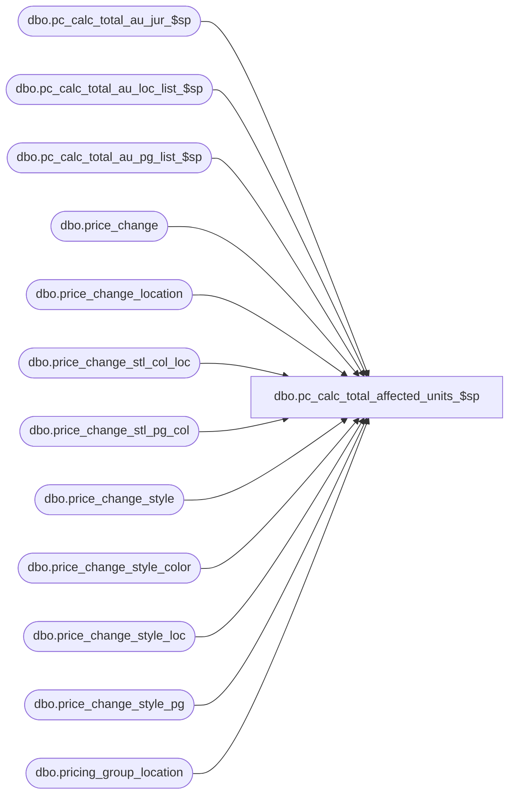

# dbo.pc_calc_total_affected_units_$sp

**Database:** me_01  
**Server:** bedrockdb02  

## Architecture Diagram



## Table Dependencies

| Referenced Table |
|---|
| dbo.pc_calc_total_au_jur_$sp |
| dbo.pc_calc_total_au_loc_list_$sp |
| dbo.pc_calc_total_au_pg_list_$sp |
| dbo.price_change |
| dbo.price_change_location |
| dbo.price_change_stl_col_loc |
| dbo.price_change_stl_pg_col |
| dbo.price_change_style |
| dbo.price_change_style_color |
| dbo.price_change_style_loc |
| dbo.price_change_style_pg |
| dbo.pricing_group_location |

## Stored Procedure Code

```sql
CREATE PROCEDURE [dbo].[pc_calc_total_affected_units_$sp]
( @ip_price_change_id DECIMAL(12) )
AS
			
DECLARE @line_id INT
		, @table_name NVARCHAR(30), @operation_name NVARCHAR(50)
		, @sql_err_num DECIMAL(38,0), @error_msg NVARCHAR(2000)
		, @error_severity SMALLINT, @error_state SMALLINT
		
/*
	Version		: 1.00
	Created		: Feb 2011
	Created by	: Sameer Patel
	Description	: Handles calculation of total_affected_units column in header and detail tables
				  
	Call from C++ code:
		-- File: STSPCProc.cpp
		-- Class: CSTSPCProc
		-- Function: DoPostSave
	
HISTORY:
Date       		Name         	Def#			Desc
Sept26,11		Sameer Patel	1-47DGUL		the total units in the pcm worklist doesn't match the total units in the pcm header.
Oct 07,11		Sameer Patel	130297			the total units in the pcm worklist doesn't match the total units in the pcm header.
Oct 07,11		Sameer Patel	130300			the total units in the pcm worklist doesn't match the total units in the pcm header.
*/	

BEGIN TRY

	SET NOCOUNT ON
	
	--------------------------------------------------------------------------------------------------------------------------------------------------
	--------------------------------------------------------------------------------------------------------------------------------------------------
	-- Store contents of price_change_location table in a temp table
	-- So we restrict queries and joins to this data only from this document
	SET @line_id = 1
	IF NOT object_id(N'tempdb..#price_change_location') IS NULL
	DROP TABLE #price_change_location

	CREATE TABLE #price_change_location
		( price_change_location_id DECIMAL(12)
		, location_id SMALLINT, pricing_group_id SMALLINT
		, PRIMARY KEY (price_change_location_id)
		, UNIQUE (location_id, pricing_group_id) )
		
	SET @line_id = 5
	
	INSERT INTO #price_change_location
		( price_change_location_id
		, location_id, pricing_group_id )
	SELECT		
		PCLocation.price_change_location_id
		, PCLocation.location_id, COALESCE(PCLocation.pricing_group_id, COALESCE(PGLocation.pricing_group_id, -1))
	FROM
		price_change_location PCLocation
	LEFT OUTER JOIN pricing_group_location PGLocation ON PCLocation.location_id = PGLocation.location_id
	WHERE
		price_change_id = @ip_price_change_id	

	--------------------------------------------------------------------------------------------------------------------------------------------------
	--------------------------------------------------------------------------------------------------------------------------------------------------
	-- Store contents of price_change_style table in a temp table
	-- So we restrict queries and joins to this data only from this document
	SET @line_id = 10
	
	IF NOT object_id(N'tempdb..#price_change_style') IS NULL
	DROP TABLE #price_change_style

	CREATE TABLE #price_change_style
		( price_change_style_id DECIMAL(13), style_id DECIMAL(12)
		, old_price DECIMAL(14,2), new_price DECIMAL(14,2)
		, total_units INT, total_affected_units INT
		, PRIMARY KEY (price_change_style_id)
		, UNIQUE (style_id) )	
		
	SET @line_id = 20
	
	INSERT INTO #price_change_style
		( price_change_style_id, style_id
		, old_price, new_price
		, total_units, total_affected_units )
	SELECT
		price_change_style_id, style_id
		, old_price, new_price
		, total_units, total_affected_units
	FROM
		price_change_style
	WHERE
		price_change_id = @ip_price_change_id

	--------------------------------------------------------------------------------------------------------------------------------------------------
	--------------------------------------------------------------------------------------------------------------------------------------------------
	-- Store contents of price_change_style_color table in a temp table
	-- So we restrict queries and joins to this data only from this document
	SET @line_id = 30
	
	IF NOT object_id(N'tempdb..#price_change_style_color') IS NULL
	DROP TABLE #price_change_style_color

	CREATE TABLE #price_change_style_color
		( price_change_style_color_id DECIMAL(13)
		, price_change_style_id DECIMAL(13), color_id SMALLINT
		, old_price DECIMAL(14,2), new_price DECIMAL(14,2)
		, total_units INT, total_affected_units INT
		, PRIMARY KEY (price_change_style_color_id)
		, UNIQUE (price_change_style_id, color_id) )	
		
	SET @line_id = 40
	
	INSERT INTO #price_change_style_color
		( price_change_style_color_id
		, price_change_style_id, color_id
		, old_price, new_price
		, total_units, total_affected_units )
	SELECT
		price_change_style_color_id
		, price_change_style_id, color_id
		, old_price, new_price
		, total_units, total_affected_units
	FROM
		price_change_style_color
	WHERE
		price_change_id = @ip_price_change_id

	--------------------------------------------------------------------------------------------------------------------------------------------------
	--------------------------------------------------------------------------------------------------------------------------------------------------
	-- Store contents of price_change_style_pg table in a temp table
	-- So we restrict queries and joins to this data only from this document
	SET @line_id = 50
	
	IF NOT object_id(N'tempdb..#price_change_style_pg') IS NULL
	DROP TABLE #price_change_style_pg

	CREATE TABLE #price_change_style_pg
		( price_change_style_pg_id DECIMAL(13)
		, price_change_style_id DECIMAL(13), pricing_group_id SMALLINT
		, old_price DECIMAL(14,2), new_price DECIMAL(14,2)
		, total_units INT, total_affected_units INT
		, PRIMARY KEY (price_change_style_pg_id)
		, UNIQUE (price_change_style_id, pricing_group_id) )	
		
	SET @line_id = 60
	
	INSERT INTO #price_change_style_pg
		( price_change_style_pg_id
		, price_change_style_id, pricing_group_id
		, old_price, new_price
		, total_units, total_affected_units )
	SELECT
		price_change_style_pg_id
		, price_change_style_id, pricing_group_id
		, old_price, new_price
		, total_units, total_affected_units
	FROM
		price_change_style_pg
	WHERE
		price_change_id = @ip_price_change_id

	--------------------------------------------------------------------------------------------------------------------------------------------------
	--------------------------------------------------------------------------------------------------------------------------------------------------
	-- Store contents of price_change_stl_pg_col table in a temp table
	-- So we restrict queries and joins to this data only from this document
	SET @line_id = 70
	
	IF NOT object_id(N'tempdb..#price_change_stl_pg_col') IS NULL
	DROP TABLE #price_change_stl_pg_col

	CREATE TABLE #price_change_stl_pg_col
		( price_change_stl_pg_col_id DECIMAL(13)
		, price_change_style_id DECIMAL(13), pricing_group_id SMALLINT, color_id SMALLINT
		, old_price DECIMAL(14,2), new_price DECIMAL(14,2)
		, total_units INT, total_affected_units INT
		, PRIMARY KEY (price_change_stl_pg_col_id)
		, UNIQUE (price_change_style_id, pricing_group_id, color_id) )	
		
	SET @line_id = 80
	
	INSERT INTO #price_change_stl_pg_col
		( price_change_stl_pg_col_id
		, price_change_style_id, pricing_group_id, color_id
		, old_price, new_price
		, total_units, total_affected_units )
	SELECT
		price_change_stl_pg_col_id
		, price_change_style_id, pricing_group_id, color_id
		, old_price, new_price
		, total_units, total_affected_units
	FROM
		price_change_stl_pg_col
	WHERE
		price_change_id = @ip_price_change_id

	--------------------------------------------------------------------------------------------------------------------------------------------------
	--------------------------------------------------------------------------------------------------------------------------------------------------
	-- Store contents of price_change_style_loc table in a temp table
	-- So we restrict queries and joins to this data only from this document
	SET @line_id = 90
	
	IF NOT object_id(N'tempdb..#price_change_style_loc') IS NULL
	DROP TABLE #price_change_style_loc

	CREATE TABLE #price_change_style_loc
		( price_change_style_loc_id DECIMAL(13)
		, price_change_style_id DECIMAL(13), location_id SMALLINT
		, old_price DECIMAL(14,2), new_price DECIMAL(14,2)
		, total_units INT, total_affected_units INT
		, PRIMARY KEY (price_change_style_loc_id)
		, UNIQUE (price_change_style_id, location_id) )	
		
	SET @line_id = 100
	
	INSERT INTO #price_change_style_loc
		( price_change_style_loc_id
		, price_change_style_id, location_id
		, old_price, new_price
		, total_units, total_affected_units )
	SELECT
		price_change_style_loc_id
		, price_change_style_id, location_id
		, old_price, new_price
		, total_units, total_affected_units
	FROM
		price_change_style_loc
	WHERE
		price_change_id = @ip_price_change_id	

	--------------------------------------------------------------------------------------------------------------------------------------------------
	--------------------------------------------------------------------------------------------------------------------------------------------------
	-- Store contents of price_change_stl_col_loc table in a temp table
	-- So we restrict queries and joins to this data only from this document
	SET @line_id = 110
	
	IF NOT object_id(N'tempdb..#price_change_stl_col_loc') IS NULL
	DROP TABLE #price_change_stl_col_loc

	CREATE TABLE #price_change_stl_col_loc
		( price_change_stl_col_loc_id DECIMAL(13)
		, price_change_style_id DECIMAL(13), location_id SMALLINT, color_id SMALLINT
		, old_price DECIMAL(14,2), new_price DECIMAL(14,2)
		, total_units INT, total_affected_units INT
		, PRIMARY KEY (price_change_stl_col_loc_id)
		, UNIQUE (price_change_style_id, location_id, color_id) )	
		
	SET @line_id = 120
	
	INSERT INTO #price_change_stl_col_loc
		( price_change_stl_col_loc_id
		, price_change_style_id, location_id, color_id
		, old_price, new_price
		, total_units, total_affected_units )
	SELECT
		price_change_stl_col_loc_id
		, price_change_style_id, location_id, color_id
		, old_price, new_price
		, total_units, total_affected_units
	FROM
		price_change_stl_col_loc
	WHERE
		price_change_id = @ip_price_change_id	
	
	--------------------------------------------------------------------------------------------------------------------------------------------------
	--------------------------------------------------------------------------------------------------------------------------------------------------
	-- Determine at what location group was PCM document created
		-- 0: jurisidiction
		-- 1: location list
		-- 2: pricing group list
		
	SET @line_id = 130
	
	DECLARE @lv_location_grouping SMALLINT
	SELECT @lv_location_grouping = location_grouping FROM price_change WHERE price_change_id = @ip_price_change_id
	
	--------------------------------------------------------------------------------------------------------------------------------------------------
	--------------------------------------------------------------------------------------------------------------------------------------------------
	-- Create table that will store summarized affected units by style	
	SET @line_id = 140	
	
	IF NOT object_id(N'tempdb..#au_by_style') IS NULL
	DROP TABLE #au_by_style
	
	CREATE TABLE #au_by_style
		( price_change_style_id DECIMAL(13)
		, total_affected_units INT
		, PRIMARY KEY (price_change_style_id) )
	
	--------------------------------------------------------------------------------------------------------------------------------------------------
	--------------------------------------------------------------------------------------------------------------------------------------------------
	-- CASE: @lv_location_grouping = 1: location list	
	IF (@lv_location_grouping = 1)
	BEGIN
	
		-- Create table that will store summarized affected units by style/location
		SET @line_id = 150
		
		EXEC pc_calc_total_au_loc_list_$sp
		
	END
	-- CASE: @lv_location_grouping = 1: pricing group list	
	ELSE IF (@lv_location_grouping = 2)
	BEGIN
	
		-- Create table that will store summarized affected units by style/location
		SET @line_id = 160
		
		EXEC pc_calc_total_au_pg_list_$sp
		
	END
	-- CASE: @lv_location_grouping = 0: pricing group list	
	ELSE IF (@lv_location_grouping = 0)
	BEGIN
	
		-- Create table that will store summarized affected units by style/location
		SET @line_id = 170
		
		EXEC pc_calc_total_au_jur_$sp
		
	END
	
	--------------------------------------------------------------------------------------------------------------------------------------------------
	--------------------------------------------------------------------------------------------------------------------------------------------------
	-- Local variable that will be eventual total_affected_units column in price_change table
	DECLARE @lv_total_affected_units INT
	
	-- Summarize total_affected_units column from #price_change_style
	SET @line_id = 1000
		
	SELECT
		@lv_total_affected_units = SUM(total_affected_units)
	FROM
		#price_change_style
	
	--------------------------------------------------------------------------------------------------------------------------------------------------
	--------------------------------------------------------------------------------------------------------------------------------------------------
	-- Update total_affected_units column in price_change table
	SET @line_id = 2000
	
	UPDATE price_change SET total_affected_units = @lv_total_affected_units WHERE price_change_id = @ip_price_change_id
	
	--------------------------------------------------------------------------------------------------------------------------------------------------
	--------------------------------------------------------------------------------------------------------------------------------------------------

END TRY

BEGIN CATCH

	SELECT 
		@error_severity	= 16
		, @error_state = 1

	IF @line_id = 1
		SELECT  
			@table_name			= N'#price_change_location'
			, @operation_name	= N'CREATE TABLE'
			, @sql_err_num		= ERROR_NUMBER()
			, @error_msg		= N'Line Id = ' + CAST(@line_id AS NVARCHAR(4)) + N' '
									+ N' Table Name = ' + @table_name + N' '
									+ N' Operation Name = ' + @operation_name + N' '
									+ N' SQL Error Number = ' + CAST(@sql_err_num AS NVARCHAR(38)) + N' '
									+ N' Error Message = ' + ERROR_MESSAGE()

	ELSE IF @line_id = 5
		SELECT  
			@table_name			= N'#price_change_location'
			, @operation_name	= N'INSERT'
			, @sql_err_num		= ERROR_NUMBER()
			, @error_msg		= N'Line Id = ' + CAST(@line_id AS NVARCHAR(4)) + N' '
									+ N' Table Name = ' + @table_name + N' '
									+ N' Operation Name = ' + @operation_name + N' '
									+ N' SQL Error Number = ' + CAST(@sql_err_num AS NVARCHAR(38)) + N' '
									+ N' Error Message = ' + ERROR_MESSAGE()
									
	ELSE IF @line_id = 10
		SELECT  
			@table_name			= N'#price_change_style'
			, @operation_name	= N'CREATE TABLE'
			, @sql_err_num		= ERROR_NUMBER()
			, @error_msg		= N'Line Id = ' + CAST(@line_id AS NVARCHAR(4)) + N' '
									+ N' Table Name = ' + @table_name + N' '
									+ N' Operation Name = ' + @operation_name + N' '
									+ N' SQL Error Number = ' + CAST(@sql_err_num AS NVARCHAR(38)) + N' '
									+ N' Error Message = ' + ERROR_MESSAGE()

	ELSE IF @line_id = 20
		SELECT  
			@table_name			= N'#price_change_style'
			, @operation_name	= N'INSERT'
			, @sql_err_num		= ERROR_NUMBER()
			, @error_msg		= N'Line Id = ' + CAST(@line_id AS NVARCHAR(4)) + N' '
									+ N' Table Name = ' + @table_name + N' '
									+ N' Operation Name = ' + @operation_name + N' '
									+ N' SQL Error Number = ' + CAST(@sql_err_num AS NVARCHAR(38)) + N' '
									+ N' Error Message = ' + ERROR_MESSAGE()

	ELSE IF @line_id = 30
		SELECT  
			@table_name			= N'#price_change_style_color'
			, @operation_name	= N'CREATE TABLE'
			, @sql_err_num		= ERROR_NUMBER()
			, @error_msg		= N'Line Id = ' + CAST(@line_id AS NVARCHAR(4)) + N' '
									+ N' Table Name = ' + @table_name + N' '
									+ N' Operation Name = ' + @operation_name + N' '
									+ N' SQL Error Number = ' + CAST(@sql_err_num AS NVARCHAR(38)) + N' '
									+ N' Error Message = ' + ERROR_MESSAGE()

	ELSE IF @line_id = 40
		SELECT  
			@table_name			= N'#price_change_style_color'
			, @operation_name	= N'INSERT'
			, @sql_err_num		= ERROR_NUMBER()
			, @error_msg		= N'Line Id = ' + CAST(@line_id AS NVARCHAR(4)) + N' '
									+ N' Table Name = ' + @table_name + N' '
									+ N' Operation Name = ' + @operation_name + N' '
									+ N' SQL Error Number = ' + CAST(@sql_err_num AS NVARCHAR(38)) + N' '
									+ N' Error Message = ' + ERROR_MESSAGE()

	ELSE IF @line_id = 50
		SELECT  
			@table_name			= N'#price_change_style_pg'
			, @operation_name	= N'CREATE TABLE'
			, @sql_err_num		= ERROR_NUMBER()
			, @error_msg		= N'Line Id = ' + CAST(@line_id AS NVARCHAR(4)) + N' '
									+ N' Table Name = ' + @table_name + N' '
									+ N' Operation Name = ' + @operation_name + N' '
									+ N' SQL Error Number = ' + CAST(@sql_err_num AS NVARCHAR(38)) + N' '
									+ N' Error Message = ' + ERROR_MESSAGE()

	ELSE IF @line_id = 60
		SELECT  
			@table_name			= N'#price_change_style_pg'
			, @operation_name	= N'INSERT'
			, @sql_err_num		= ERROR_NUMBER()
			, @error_msg		= N'Line Id = ' + CAST(@line_id AS NVARCHAR(4)) + N' '
									+ N' Table Name = ' + @table_name + N' '
									+ N' Operation Name = ' + @operation_name + N' '
									+ N' SQL Error Number = ' + CAST(@sql_err_num AS NVARCHAR(38)) + N' '
									+ N' Error Message = ' + ERROR_MESSAGE()

	ELSE IF @line_id = 70
		SELECT  
			@table_name			= N'#price_change_stl_pg_col'
			, @operation_name	= N'CREATE TABLE'
			, @sql_err_num		= ERROR_NUMBER()
			, @error_msg		= N'Line Id = ' + CAST(@line_id AS NVARCHAR(4)) + N' '
									+ N' Table Name = ' + @table_name + N' '
									+ N' Operation Name = ' + @operation_name + N' '
									+ N' SQL Error Number = ' + CAST(@sql_err_num AS NVARCHAR(38)) + N' '
									+ N' Error Message = ' + ERROR_MESSAGE()

	ELSE IF @line_id = 80
		SELECT  
			@table_name			= N'#price_change_stl_pg_col'
			, @operation_name	= N'INSERT'
			, @sql_err_num		= ERROR_NUMBER()
			, @error_msg		= N'Line Id = ' + CAST(@line_id AS NVARCHAR(4)) + N' '
									+ N' Table Name = ' + @table_name + N' '
									+ N' Operation Name = ' + @operation_name + N' '
									+ N' SQL Error Number = ' + CAST(@sql_err_num AS NVARCHAR(38)) + N' '
									+ N' Error Message = ' + ERROR_MESSAGE()

	ELSE IF @line_id = 90
		SELECT  
			@table_name			= N'#price_change_style_loc'
			, @operation_name	= N'CREATE TABLE'
			, @sql_err_num		= ERROR_NUMBER()
			, @error_msg		= N'Line Id = ' + CAST(@line_id AS NVARCHAR(4)) + N' '
									+ N' Table Name = ' + @table_name + N' '
									+ N' Operation Name = ' + @operation_name + N' '
									+ N' SQL Error Number = ' + CAST(@sql_err_num AS NVARCHAR(38)) + N' '
									+ N' Error Message = ' + ERROR_MESSAGE()

	ELSE IF @line_id = 100
		SELECT  
			@table_name			= N'#price_change_style_loc'
			, @operation_name	= N'INSERT'
			, @sql_err_num		= ERROR_NUMBER()
			, @error_msg		= N'Line Id = ' + CAST(@line_id AS NVARCHAR(4)) + N' '
									+ N' Table Name = ' + @table_name + N' '
									+ N' Operation Name = ' + @operation_name + N' '
									+ N' SQL Error Number = ' + CAST(@sql_err_num AS NVARCHAR(38)) + N' '
									+ N' Error Message = ' + ERROR_MESSAGE()

	ELSE IF @line_id = 110
		SELECT  
			@table_name			= N'#price_change_stl_col_loc'
			, @operation_name	= N'CREATE TABLE'
			, @sql_err_num		= ERROR_NUMBER()
			, @error_msg		= N'Line Id = ' + CAST(@line_id AS NVARCHAR(4)) + N' '
									+ N' Table Name = ' + @table_name + N' '
									+ N' Operation Name = ' + @operation_name + N' '
									+ N' SQL Error Number = ' + CAST(@sql_err_num AS NVARCHAR(38)) + N' '
									+ N' Error Message = ' + ERROR_MESSAGE()

	ELSE IF @line_id = 120
		SELECT  
			@table_name			= N'#price_change_stl_col_loc'
			, @operation_name	= N'INSERT'
			, @sql_err_num		= ERROR_NUMBER()
			, @error_msg		= N'Line Id = ' + CAST(@line_id AS NVARCHAR(4)) + N' '
									+ N' Table Name = ' + @table_name + N' '
									+ N' Operation Name = ' + @operation_name + N' '
									+ N' SQL Error Number = ' + CAST(@sql_err_num AS NVARCHAR(38)) + N' '
									+ N' Error Message = ' + ERROR_MESSAGE()
									
	ELSE IF @line_id = 130
		SELECT  
			@table_name			= N'price_change'
			, @operation_name	= N'SELECT - location_grouping'
			, @sql_err_num		= ERROR_NUMBER()
			, @error_msg		= N'Line Id = ' + CAST(@line_id AS NVARCHAR(4)) + N' '
									+ N' Table Name = ' + @table_name + N' '
									+ N' Operation Name = ' + @operation_name + N' '
									+ N' SQL Error Number = ' + CAST(@sql_err_num AS NVARCHAR(38)) + N' '
									+ N' Error Message = ' + ERROR_MESSAGE()	
									
	ELSE IF @line_id = 140
		SELECT  
			@table_name			= N'#au_by_style'
			, @operation_name	= N'CREATE TABLE'
			, @sql_err_num		= ERROR_NUMBER()
			, @error_msg		= N'Line Id = ' + CAST(@line_id AS NVARCHAR(4)) + N' '
									+ N' Table Name = ' + @table_name + N' '
									+ N' Operation Name = ' + @operation_name + N' '
									+ N' SQL Error Number = ' + CAST(@sql_err_num AS NVARCHAR(38)) + N' '
									+ N' Error Message = ' + ERROR_MESSAGE()		
									
	ELSE IF @line_id = 150
		SELECT  
			@table_name			= N'pc_calc_total_au_loc_list_$sp'
			, @operation_name	= N'EXEC'
			, @sql_err_num		= ERROR_NUMBER()
			, @error_msg		= N'Line Id = ' + CAST(@line_id AS NVARCHAR(4)) + N' '
									+ N' Table Name = ' + @table_name + N' '
									+ N' Operation Name = ' + @operation_name + N' '
									+ N' SQL Error Number = ' + CAST(@sql_err_num AS NVARCHAR(38)) + N' '
									+ N' Error Message = ' + ERROR_MESSAGE()			
									
	ELSE IF @line_id = 160
		SELECT  
			@table_name			= N'pc_calc_total_au_pg_list_$sp'
			, @operation_name	= N'EXEC'
			, @sql_err_num		= ERROR_NUMBER()
			, @error_msg		= N'Line Id = ' + CAST(@line_id AS NVARCHAR(4)) + N' '
									+ N' Table Name = ' + @table_name + N' '
									+ N' Operation Name = ' + @operation_name + N' '
									+ N' SQL Error Number = ' + CAST(@sql_err_num AS NVARCHAR(38)) + N' '
									+ N' Error Message = ' + ERROR_MESSAGE()			
									
	ELSE IF @line_id = 170
		SELECT  
			@table_name			= N'pc_calc_total_au_jur_$sp'
			, @operation_name	= N'EXEC'
			, @sql_err_num		= ERROR_NUMBER()
			, @error_msg		= N'Line Id = ' + CAST(@line_id AS NVARCHAR(4)) + N' '
									+ N' Table Name = ' + @table_name + N' '
									+ N' Operation Name = ' + @operation_name + N' '
									+ N' SQL Error Number = ' + CAST(@sql_err_num AS NVARCHAR(38)) + N' '
									+ N' Error Message = ' + ERROR_MESSAGE()				
									
	ELSE IF @line_id = 1000
		SELECT  
			@table_name			= N'#price_change_style'
			, @operation_name	= N'SELECT - SUM(total_affected_units)'
			, @sql_err_num		= ERROR_NUMBER()
			, @error_msg		= N'Line Id = ' + CAST(@line_id AS NVARCHAR(4)) + N' '
									+ N' Table Name = ' + @table_name + N' '
									+ N' Operation Name = ' + @operation_name + N' '
									+ N' SQL Error Number = ' + CAST(@sql_err_num AS NVARCHAR(38)) + N' '
									+ N' Error Message = ' + ERROR_MESSAGE()				
									
	ELSE IF @line_id = 2000
		SELECT  
			@table_name			= N'price_change'
			, @operation_name	= N'UPDATE'
			, @sql_err_num		= ERROR_NUMBER()
			, @error_msg		= N'Line Id = ' + CAST(@line_id AS NVARCHAR(4)) + N' '
									+ N' Table Name = ' + @table_name + N' '
									+ N' Operation Name = ' + @operation_name + N' '
									+ N' SQL Error Number = ' + CAST(@sql_err_num AS NVARCHAR(38)) + N' '
									+ N' Error Message = ' + ERROR_MESSAGE()				
			
	RAISERROR (@error_msg, @error_severity, @error_state)			

END CATCH
```

