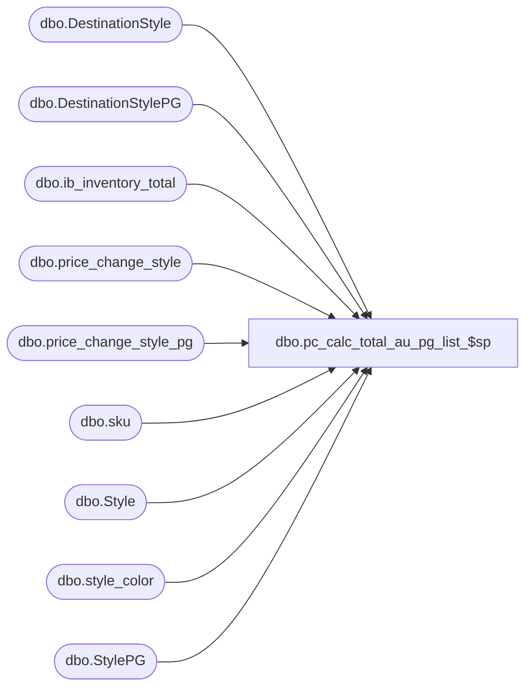

# dbo.pc_calc_total_au_pg_list_$sp

**Database:** me_01  
**Server:** bedrockdb02  

## Architecture Diagram



## Table Dependencies

| Referenced Table |
|---|
| dbo.DestinationStyle |
| dbo.DestinationStylePG |
| dbo.ib_inventory_total |
| dbo.price_change_style |
| dbo.price_change_style_pg |
| dbo.sku |
| dbo.Style |
| dbo.style_color |
| dbo.StylePG |

## Stored Procedure Code

```sql
CREATE PROCEDURE [dbo].[pc_calc_total_au_pg_list_$sp]
AS
			
DECLARE @line_id INT
		, @table_name NVARCHAR(30), @operation_name NVARCHAR(50)
		, @sql_err_num DECIMAL(38,0), @error_msg NVARCHAR(2000)
		, @error_severity SMALLINT, @error_state SMALLINT
		
/*
	Version		: 1.00
	Created		: Feb 2011
	Created by	: Sameer Patel
	Description	: Handles calculation of total_affected_units column in price_change_style_pg and price_change_style
					  for a price change document that was created for a pricing group list
				  
	Called by stored procedure pc_calc_total_affected_units_$sp
		-- NOTE: Temp tables not explcitly created in this procedure 
		-- were previously created in the calling stored procedure pc_calc_total_affected_units_$sp
	
HISTORY:
Date       		Name         	Def#			Desc
Sept26,11		Sameer Patel	1-47DGUL		the total units in the pcm worklist doesn't match the total units in the pcm header.
Oct 07,11		Sameer Patel	130297			the total units in the pcm worklist doesn't match the total units in the pcm header.
Oct 07,11		Sameer Patel	130300			the total units in the pcm worklist doesn't match the total units in the pcm header.
*/	

BEGIN TRY

	SET NOCOUNT ON

	--------------------------------------------------------------------------------------------------------------------------------------------------
	--------------------------------------------------------------------------------------------------------------------------------------------------
	-- Create table that will store summarized affected units by style/pricing group
	SET @line_id = 10
	
	IF NOT object_id(N'tempdb..#au_by_pricing_group') IS NULL
	DROP TABLE #au_by_pricing_group
	
	CREATE TABLE #au_by_pricing_group
		( price_change_style_id DECIMAL(13), pricing_group_id SMALLINT
		, total_affected_units INT
		, PRIMARY KEY (price_change_style_id, pricing_group_id) )

	--------------------------------------------------------------------------------------------------------------------------------------------------
	--------------------------------------------------------------------------------------------------------------------------------------------------
	-- Assume that the business object has been correctly calculated total_affected_units column in price_change_style_loc table
	-- in the case where the old_price <> new_price
	SET @line_id = 20
	
	INSERT INTO #au_by_pricing_group
		( price_change_style_id, pricing_group_id
		, total_affected_units )
	SELECT
		price_change_style_id, pricing_group_id 
		, total_affected_units
	FROM
		#price_change_style_pg
	WHERE
		old_price <> new_price
	
	--------------------------------------------------------------------------------------------------------------------------------------------------
	--------------------------------------------------------------------------------------------------------------------------------------------------
	-- Based on various test cases, the C++ code is somewhat "buggy" when we set the old_price = new_price in the price_change_style_loc
	-- Unfortunately, we have to go to IB in these case here to make sure units do not "overlap" 
	-- (i.e. double counting units when they are "affected" by two different lower level exceptions
	-- This procedure deals with a list of pricing groups
	-- This case is more complicated because we have to deal with the following cases
		-- pricing group/color exceptions
		-- location exceptions
		-- location/color exceptions
	
	-- HOWEVER, we don't need to do extra work if there are no entries in price_change_style_pg	where the old_price = new_price
	SET @line_id = 30
	
	DECLARE @lv_count INT
	SELECT @lv_count = COALESCE(COUNT(*), 0) FROM #price_change_style_pg	WHERE old_price = new_price
	
	IF (@lv_count > 0)
	BEGIN
	
		-----------------------------------------------------------------------------------------------------------------------------------------------
		-----------------------------------------------------------------------------------------------------------------------------------------------
		-- Create table that will store summarized affected units by style/pricing group/location/color
		-- We need this level of detail to account for the potential of "overlapping" exceptions
		SET @line_id = 40
		
		IF NOT object_id(N'tempdb..#au_by_pg_loc_color') IS NULL
		DROP TABLE #au_by_pg_loc_color
		
		CREATE TABLE #au_by_pg_loc_color
			( price_change_style_id DECIMAL(13), pricing_group_id SMALLINT, location_id SMALLINT, color_id SMALLINT
			, total_affected_units INT
			, PRIMARY KEY (price_change_style_id, pricing_group_id, location_id, color_id) )
			
		-----------------------------------------------------------------------------------------------------------------------------------------------
		-----------------------------------------------------------------------------------------------------------------------------------------------		
		-- CASE 1: PRICING GROUP COLOR EXCEPTION
		-- In the case where the old_price = new_price in the price_change_style_pg table
		-- Get the entries from #price_change_stl_pg_col if there are any
		-- And there corresponding on hand values from ib_inventory_total
		-- Make sure the old_price <> new_price for the pricing group/color exception (in #price_change_stl_pg_col)
		SET @line_id = 50
		
		INSERT INTO #au_by_pg_loc_color
			( price_change_style_id, pricing_group_id, location_id, color_id 
			, total_affected_units )
		SELECT
			PGDetails.price_change_style_id, PGDetails.pricing_group_id, PGLocation.location_id, PGColorDetails.color_id 
			, SUM(COALESCE(IB.total_on_hand_units, 0)) total_affected_units
		FROM
			#price_change_style_pg PGDetails
		INNER JOIN #price_change_location PGLocation ON PGDetails.pricing_group_id = PGLocation.pricing_group_id		
		INNER JOIN #price_change_style StyleDetails ON PGDetails.price_change_style_id = StyleDetails.price_change_style_id		
		INNER JOIN #price_change_stl_pg_col PGColorDetails ON PGDetails.price_change_style_id = PGColorDetails.price_change_style_id
																					AND PGDetails.pricing_group_id = PGColorDetails.pricing_group_id
		INNER JOIN style_color StyleColor ON StyleDetails.style_id = StyleColor.style_id AND PGColorDetails.color_id = StyleColor.color_id
		INNER JOIN sku SkuDetails ON StyleColor.style_color_id = SkuDetails.style_color_id
		INNER JOIN ib_inventory_total IB ON SkuDetails.sku_id = IB.sku_id AND PGLocation.location_id = IB.location_id																																						
		WHERE
			PGDetails.old_price = PGDetails.new_price
			AND PGColorDetails.old_price <> PGColorDetails.new_price
		GROUP BY
			PGDetails.price_change_style_id, PGDetails.pricing_group_id, PGLocation.location_id, PGColorDetails.color_id
		
		-----------------------------------------------------------------------------------------------------------------------------------------------
		-----------------------------------------------------------------------------------------------------------------------------------------------
		-- CASE 2: LOCATION EXCEPTION
		-- In the case where the old_price = new_price in the price_change_style_pg table
		-- Get the entries from #price_change_style_loc if there are any
		-- And there corresponding on hand values from ib_inventory_total
		-- Make sure the old_price <> new_price for the location exception (in #price_change_style_loc)
		-- Also make sure that we are not inserting an entry that already exists
		SET @line_id = 60
		
		INSERT INTO #au_by_pg_loc_color
			( price_change_style_id, pricing_group_id, location_id, color_id 
			, total_affected_units )
		SELECT
			PGDetails.price_change_style_id, PGDetails.pricing_group_id, PGLocation.location_id, StyleColor.color_id 
			, SUM(COALESCE(IB.total_on_hand_units, 0)) total_affected_units
		FROM
			#price_change_style_pg PGDetails
		INNER JOIN #price_change_location PGLocation ON PGDetails.pricing_group_id = PGLocation.pricing_group_id		
		INNER JOIN #price_change_style StyleDetails ON PGDetails.price_change_style_id = StyleDetails.price_change_style_id		
		INNER JOIN #price_change_style_loc LocDetails ON PGDetails.price_change_style_id = LocDetails.price_change_style_id
																				AND PGLocation.location_id = LocDetails.location_id
		INNER JOIN style_color StyleColor ON StyleDetails.style_id = StyleColor.style_id
		LEFT OUTER JOIN #au_by_pg_loc_color Destination ON StyleDetails.price_change_style_id = Destination.price_change_style_id
																				AND PGDetails.pricing_group_id = Destination.pricing_group_id
																				AND PGLocation.location_id = Destination.location_id
																				AND StyleColor.color_id = Destination.color_id
		INNER JOIN sku SkuDetails ON StyleColor.style_color_id = SkuDetails.style_color_id
		INNER JOIN ib_inventory_total IB ON SkuDetails.sku_id = IB.sku_id AND LocDetails.location_id = IB.location_id																																						
		WHERE
			PGDetails.old_price = PGDetails.new_price
			AND LocDetails.old_price <> LocDetails.new_price
			AND Destination.price_change_style_id IS NULL
		GROUP BY
			PGDetails.price_change_style_id, PGDetails.pricing_group_id, PGLocation.location_id, StyleColor.color_id
		
		-----------------------------------------------------------------------------------------------------------------------------------------------
		-----------------------------------------------------------------------------------------------------------------------------------------------
		-- CASE 3: LOCATION COLOR EXCEPTION
		-- In the case where the old_price = new_price in the price_change_style_pg table
		-- Get the entries from #price_change_stl_col_loc if there are any
		-- And there corresponding on hand values from ib_inventory_total
		-- Make sure the old_price <> new_price for the location color exception (in #price_change_stl_col_loc)
		-- Also make sure that we are not inserting an entry that already exists
		SET @line_id = 70
		
		INSERT INTO #au_by_pg_loc_color
			( price_change_style_id, pricing_group_id, location_id, color_id 
			, total_affected_units )
		SELECT
			PGDetails.price_change_style_id, PGDetails.pricing_group_id, PGLocation.location_id, StyleColor.color_id 
			, SUM(COALESCE(IB.total_on_hand_units, 0)) total_affected_units
		FROM
			#price_change_style_pg PGDetails
		INNER JOIN #price_change_location PGLocation ON PGDetails.pricing_group_id = PGLocation.pricing_group_id		
		INNER JOIN #price_change_style StyleDetails ON PGDetails.price_change_style_id = StyleDetails.price_change_style_id		
		INNER JOIN #price_change_stl_col_loc LocColorDetails ON PGDetails.price_change_style_id = LocColorDetails.price_change_style_id
																						AND PGLocation.location_id = LocColorDetails.location_id
		INNER JOIN style_color StyleColor ON StyleDetails.style_id = StyleColor.style_id
															AND LocColorDetails.color_id = StyleColor.color_id
		LEFT OUTER JOIN #au_by_pg_loc_color Destination ON StyleDetails.price_change_style_id = Destination.price_change_style_id
																				AND PGDetails.pricing_group_id = Destination.pricing_group_id
																				AND LocColorDetails.location_id = Destination.location_id
																				AND LocColorDetails.color_id = Destination.color_id
		INNER JOIN sku SkuDetails ON StyleColor.style_color_id = SkuDetails.style_color_id
		INNER JOIN ib_inventory_total IB ON SkuDetails.sku_id = IB.sku_id AND LocColorDetails.location_id = IB.location_id																																						
		WHERE
			PGDetails.old_price = PGDetails.new_price
			AND LocColorDetails.old_price <> LocColorDetails.new_price
			AND Destination.price_change_style_id IS NULL
		GROUP BY
			PGDetails.price_change_style_id, PGDetails.pricing_group_id, PGLocation.location_id, StyleColor.color_id
			
		-----------------------------------------------------------------------------------------------------------------------------------------------
		-----------------------------------------------------------------------------------------------------------------------------------------------
		-- Summarize data from #au_by_pg_loc_color into #au_by_pricing_group
		SET @line_id = 80
		
		INSERT INTO #au_by_pricing_group
			( price_change_style_id, pricing_group_id
			, total_affected_units )
		SELECT
			price_change_style_id, pricing_group_id 
			, SUM(total_affected_units)
		FROM
			#au_by_pg_loc_color
		GROUP BY
			price_change_style_id, pricing_group_id 
			
	END			
	
	--------------------------------------------------------------------------------------------------------------------------------------------------
	--------------------------------------------------------------------------------------------------------------------------------------------------
	-- Update #price_change_style_pg table with total_affected_units column that has just been summarized
	SET @line_id = 90
	
	UPDATE StylePG
	SET
		StylePG.total_affected_units = COALESCE(PGSummary.total_affected_units, 0)
	FROM
		#price_change_style_pg StylePG
	LEFT OUTER JOIN #au_by_pricing_group PGSummary ON StylePG.price_change_style_id = PGSummary.price_change_style_id
																			AND StylePG.pricing_group_id = PGSummary.pricing_group_id
	
	--------------------------------------------------------------------------------------------------------------------------------------------------
	--------------------------------------------------------------------------------------------------------------------------------------------------
	-- Summarize the entries from #price_change_style_pg
	SET @line_id = 100
	
	INSERT INTO #au_by_style
		( price_change_style_id
		, total_affected_units )
	SELECT
		price_change_style_id
		, SUM(total_affected_units) total_affected_units
	FROM
		#price_change_style_pg
	GROUP BY
		price_change_style_id

	--------------------------------------------------------------------------------------------------------------------------------------------------
	--------------------------------------------------------------------------------------------------------------------------------------------------		
	-- Update #price_change_style table with total_affected_units column that has just been summarized
	SET @line_id = 110
	
	UPDATE Style
	SET
		Style.total_affected_units = StyleSummary.total_affected_units
	FROM
		#price_change_style Style
	INNER JOIN #au_by_style StyleSummary ON Style.price_change_style_id = StyleSummary.price_change_style_id	
	
	--------------------------------------------------------------------------------------------------------------------------------------------------
	--------------------------------------------------------------------------------------------------------------------------------------------------
	-- UPDATE actual price change tables
		
	-- price_change_style_pg
	SET @line_id = 120
	
	UPDATE DestinationStylePG
	SET
		DestinationStylePG.total_affected_units = StylePG.total_affected_units
	FROM
		price_change_style_pg DestinationStylePG
	INNER JOIN #price_change_style_pg StylePG ON DestinationStylePG.price_change_style_pg_id = StylePG.price_change_style_pg_id
		
	-- price_change_style
	SET @line_id = 130
	
	UPDATE DestinationStyle
	SET
		DestinationStyle.total_affected_units = Style.total_affected_units
	FROM
		price_change_style DestinationStyle
	INNER JOIN #price_change_style Style ON DestinationStyle.price_change_style_id = Style.price_change_style_id
	
	--------------------------------------------------------------------------------------------------------------------------------------------------
	--------------------------------------------------------------------------------------------------------------------------------------------------
	
END TRY

BEGIN CATCH

	SELECT 
		@error_severity	= 16
		, @error_state = 1

	IF @line_id = 10
		SELECT  
			@table_name			= N'#au_by_pricing_group'
			, @operation_name	= N'CREATE TABLE'
			, @sql_err_num		= ERROR_NUMBER()
			, @error_msg		= N'Line Id = ' + CAST(@line_id AS NVARCHAR(4)) + N' '
									+ N' Table Name = ' + @table_name + N' '
									+ N' Operation Name = ' + @operation_name + N' '
									+ N' SQL Error Number = ' + CAST(@sql_err_num AS NVARCHAR(38)) + N' '
									+ N' Error Message = ' + ERROR_MESSAGE()

	ELSE IF @line_id = 20
		SELECT  
			@table_name			= N'#au_by_pricing_group'
			, @operation_name	= N'INSERT - old_price <> new_price'
			, @sql_err_num		= ERROR_NUMBER()
			, @error_msg		= N'Line Id = ' + CAST(@line_id AS NVARCHAR(4)) + N' '
									+ N' Table Name = ' + @table_name + N' '
									+ N' Operation Name = ' + @operation_name + N' '
									+ N' SQL Error Number = ' + CAST(@sql_err_num AS NVARCHAR(38)) + N' '
									+ N' Error Message = ' + ERROR_MESSAGE()	

	ELSE IF @line_id = 30
		SELECT  
			@table_name			= N'#price_change_style_pg'
			, @operation_name	= N'SELECT'
			, @sql_err_num		= ERROR_NUMBER()
			, @error_msg		= N'Line Id = ' + CAST(@line_id AS NVARCHAR(4)) + N' '
									+ N' Table Name = ' + @table_name + N' '
									+ N' Operation Name = ' + @operation_name + N' '
									+ N' SQL Error Number = ' + CAST(@sql_err_num AS NVARCHAR(38)) + N' '
									+ N' Error Message = ' + ERROR_MESSAGE()	
									
	ELSE IF @line_id = 40
		SELECT  
			@table_name			= N'#au_by_pg_loc_color'
			, @operation_name	= N'CREATE TABLE'
			, @sql_err_num		= ERROR_NUMBER()
			, @error_msg		= N'Line Id = ' + CAST(@line_id AS NVARCHAR(4)) + N' '
									+ N' Table Name = ' + @table_name + N' '
									+ N' Operation Name = ' + @operation_name + N' '
									+ N' SQL Error Number = ' + CAST(@sql_err_num AS NVARCHAR(38)) + N' '
									+ N' Error Message = ' + ERROR_MESSAGE()

	ELSE IF @line_id = 50
		SELECT  
			@table_name			= N'#au_by_pg_loc_color'
			, @operation_name	= N'INSERT - PG/Color EX'
			, @sql_err_num		= ERROR_NUMBER()
			, @error_msg		= N'Line Id = ' + CAST(@line_id AS NVARCHAR(4)) + N' '
									+ N' Table Name = ' + @table_name + N' '
									+ N' Operation Name = ' + @operation_name + N' '
									+ N' SQL Error Number = ' + CAST(@sql_err_num AS NVARCHAR(38)) + N' '
									+ N' Error Message = ' + ERROR_MESSAGE()	

	ELSE IF @line_id = 60
		SELECT  
			@table_name			= N'#au_by_pg_loc_color'
			, @operation_name	= N'INSERT - Location EX'
			, @sql_err_num		= ERROR_NUMBER()
			, @error_msg		= N'Line Id = ' + CAST(@line_id AS NVARCHAR(4)) + N' '
									+ N' Table Name = ' + @table_name + N' '
									+ N' Operation Name = ' + @operation_name + N' '
									+ N' SQL Error Number = ' + CAST(@sql_err_num AS NVARCHAR(38)) + N' '
									+ N' Error Message = ' + ERROR_MESSAGE()

	ELSE IF @line_id = 70
		SELECT  
			@table_name			= N'#au_by_pg_loc_color'
			, @operation_name	= N'INSERT - Location/Color EX'
			, @sql_err_num		= ERROR_NUMBER()
			, @error_msg		= N'Line Id = ' + CAST(@line_id AS NVARCHAR(4)) + N' '
									+ N' Table Name = ' + @table_name + N' '
									+ N' Operation Name = ' + @operation_name + N' '
									+ N' SQL Error Number = ' + CAST(@sql_err_num AS NVARCHAR(38)) + N' '
									+ N' Error Message = ' + ERROR_MESSAGE()	

	ELSE IF @line_id = 80
		SELECT  
			@table_name			= N'#au_by_pricing_group'
			, @operation_name	= N'INSERT - old_price = new_price'
			, @sql_err_num		= ERROR_NUMBER()
			, @error_msg		= N'Line Id = ' + CAST(@line_id AS NVARCHAR(4)) + N' '
									+ N' Table Name = ' + @table_name + N' '
									+ N' Operation Name = ' + @operation_name + N' '
									+ N' SQL Error Number = ' + CAST(@sql_err_num AS NVARCHAR(38)) + N' '
									+ N' Error Message = ' + ERROR_MESSAGE()

	ELSE IF @line_id = 90
		SELECT  
			@table_name			= N'#price_change_style_pg'
			, @operation_name	= N'UPDATE'
			, @sql_err_num		= ERROR_NUMBER()
			, @error_msg		= N'Line Id = ' + CAST(@line_id AS NVARCHAR(4)) + N' '
									+ N' Table Name = ' + @table_name + N' '
									+ N' Operation Name = ' + @operation_name + N' '
									+ N' SQL Error Number = ' + CAST(@sql_err_num AS NVARCHAR(38)) + N' '
									+ N' Error Message = ' + ERROR_MESSAGE()	

	ELSE IF @line_id = 100
		SELECT  
			@table_name			= N'#au_by_style'
			, @operation_name	= N'INSERT'
			, @sql_err_num		= ERROR_NUMBER()
			, @error_msg		= N'Line Id = ' + CAST(@line_id AS NVARCHAR(4)) + N' '
									+ N' Table Name = ' + @table_name + N' '
									+ N' Operation Name = ' + @operation_name + N' '
									+ N' SQL Error Number = ' + CAST(@sql_err_num AS NVARCHAR(38)) + N' '
									+ N' Error Message = ' + ERROR_MESSAGE()		

	ELSE IF @line_id = 110
		SELECT  
			@table_name			= N'#price_change_style'
			, @operation_name	= N'UPDATE'
			, @sql_err_num		= ERROR_NUMBER()
			, @error_msg		= N'Line Id = ' + CAST(@line_id AS NVARCHAR(4)) + N' '
									+ N' Table Name = ' + @table_name + N' '
									+ N' Operation Name = ' + @operation_name + N' '
									+ N' SQL Error Number = ' + CAST(@sql_err_num AS NVARCHAR(38)) + N' '
									+ N' Error Message = ' + ERROR_MESSAGE()	

	ELSE IF @line_id = 120
		SELECT  
			@table_name			= N'price_change_style_pg'
			, @operation_name	= N'UPDATE'
			, @sql_err_num		= ERROR_NUMBER()
			, @error_msg		= N'Line Id = ' + CAST(@line_id AS NVARCHAR(4)) + N' '
									+ N' Table Name = ' + @table_name + N' '
									+ N' Operation Name = ' + @operation_name + N' '
									+ N' SQL Error Number = ' + CAST(@sql_err_num AS NVARCHAR(38)) + N' '
									+ N' Error Message = ' + ERROR_MESSAGE()	

	ELSE IF @line_id = 130
		SELECT  
			@table_name			= N'price_change_style'
			, @operation_name	= N'UPDATE'
			, @sql_err_num		= ERROR_NUMBER()
			, @error_msg		= N'Line Id = ' + CAST(@line_id AS NVARCHAR(4)) + N' '
									+ N' Table Name = ' + @table_name + N' '
									+ N' Operation Name = ' + @operation_name + N' '
									+ N' SQL Error Number = ' + CAST(@sql_err_num AS NVARCHAR(38)) + N' '
									+ N' Error Message = ' + ERROR_MESSAGE()		
			
	RAISERROR (@error_msg, @error_severity, @error_state)			

END CATCH
```

