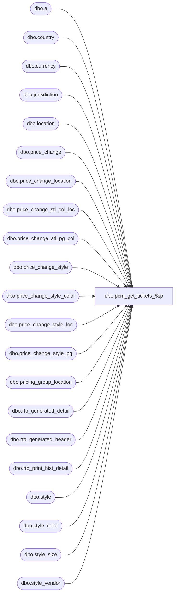

# dbo.pcm_get_tickets_$sp

**Database:** me_01  
**Server:** bedrockdb02  

## Architecture Diagram



## Table Dependencies

| Referenced Table |
|---|
| dbo.a |
| dbo.country |
| dbo.currency |
| dbo.jurisdiction |
| dbo.location |
| dbo.price_change |
| dbo.price_change_location |
| dbo.price_change_stl_col_loc |
| dbo.price_change_stl_pg_col |
| dbo.price_change_style |
| dbo.price_change_style_color |
| dbo.price_change_style_loc |
| dbo.price_change_style_pg |
| dbo.pricing_group_location |
| dbo.rtp_generated_detail |
| dbo.rtp_generated_header |
| dbo.rtp_print_hist_detail |
| dbo.style |
| dbo.style_color |
| dbo.style_size |
| dbo.style_vendor |

## Stored Procedure Code

```sql
CREATE PROCEDURE [dbo].[pcm_get_tickets_$sp]
	(@price_change_id decimal(12,0), @location_id smallint)
AS
BEGIN

/*
 * This proc does the ticket printing inserts for a PRICE CHANGE document.
 */
 
	SET NOCOUNT ON
	DECLARE @proc_name NVARCHAR(30)
		, @sql_err_num DECIMAL(38,0)
		, @printed_status INT
		, @count INT

	SELECT 
		 @proc_name	= N'pcm_get_tickets_$sp'
	
	--verify the pcm document exists
	SELECT @count = COUNT(*) FROM price_change WHERE price_change_id = @price_change_id;	
	IF (@count <> 0) 
	BEGIN

		
		SELECT @printed_status = generate_tickets FROM price_change WHERE price_change_id = @price_change_id
		
		-- temp table used for ticket printing header information
		IF NOT object_id(N'tempdb..#pcm_get_tickets') IS NULL
		   DROP TABLE #pcm_get_tickets;	

		CREATE TABLE #pcm_get_tickets (
			price_change_id decimal(12,0) NOT NULL,  
			location_id smallint NOT NULL,
			vendor_id decimal(12,0) NOT NULL,
			style_id decimal (12,0) NOT NULL,
			style_color_id decimal (12,0) NOT NULL,
			style_size_id decimal (12,0) NOT NULL,
			new_price decimal (14,2) NOT NULL
			);
			


		/************************************************************************************************************/
		/* Price Change Style Location Color */
		INSERT INTO [#pcm_get_tickets]
							  (price_change_id, location_id, vendor_id, style_id, style_color_id, style_size_id, new_price)
		SELECT     pcs.price_change_id, pcscl.location_id, sv.vendor_id, pcs.style_id, sc.style_color_id, ss.style_size_id, pcscl.new_price
		FROM         price_change_style AS pcs INNER JOIN
							  price_change_stl_col_loc AS pcscl ON pcs.price_change_style_id = pcscl.price_change_style_id INNER JOIN
							  style_color AS sc WITH (NOLOCK) ON pcs.style_id = sc.style_id AND pcscl.color_id = sc.color_id INNER JOIN
							  style_size AS ss WITH (NOLOCK) ON pcs.style_id = ss.style_id INNER JOIN
							  style_vendor AS sv WITH (NOLOCK) ON pcs.style_id = sv.style_id
		WHERE     (pcscl.price_change_id = @price_change_id) AND (pcscl.location_id = @location_id) AND (sv.primary_vendor_flag = 1)
		ORDER BY pcs.price_change_id, pcscl.location_id, sc.style_color_id, ss.style_size_id


		/************************************************************************************************************/
		/* Price Change Style Location */
		INSERT INTO [#pcm_get_tickets]
							  (price_change_id, location_id, vendor_id, style_id, style_color_id, style_size_id, new_price)
		SELECT     pcs.price_change_id, pcsl.location_id, sv.vendor_id, pcs.style_id, sc.style_color_id, ss.style_size_id, pcsl.new_price
		FROM         price_change_style AS pcs INNER JOIN
							  price_change_style_loc AS pcsl ON pcs.price_change_style_id = pcsl.price_change_style_id INNER JOIN
							  style_color AS sc WITH (NOLOCK) ON pcs.style_id = sc.style_id INNER JOIN
							  style_size AS ss WITH (NOLOCK) ON pcs.style_id = ss.style_id INNER JOIN
							  style_vendor AS sv WITH (NOLOCK) ON pcs.style_id = sv.style_id 
		                      
							  --this join removes rows added at a higher level exception
							  LEFT OUTER JOIN
							  [#pcm_get_tickets] AS b ON pcs.price_change_id = b.price_change_id AND pcsl.location_id = b.location_id AND sv.vendor_id = b.vendor_id AND 
							  pcs.style_id = b.style_id AND sc.style_color_id = b.style_color_id AND ss.style_size_id = b.style_size_id
		                      
		WHERE     (b.price_change_id IS NULL) 
		AND (pcsl.price_change_id = @price_change_id) AND (pcsl.location_id = @location_id) AND (sv.primary_vendor_flag = 1)
		ORDER BY pcs.price_change_id, pcsl.location_id, sc.style_color_id, ss.style_size_id;


		/************************************************************************************************************/
		/* Price Change Style Pricing Group Color */
		INSERT INTO [#pcm_get_tickets]
							  (price_change_id, location_id, vendor_id, style_id, style_color_id, style_size_id, new_price)
		SELECT     pcs.price_change_id, pgl.location_id, sv.vendor_id, pcs.style_id, sc.style_color_id, ss.style_size_id, pcspgc.new_price
		FROM         price_change_style AS pcs INNER JOIN
							  price_change_stl_pg_col AS pcspgc ON pcs.price_change_style_id = pcspgc.price_change_style_id INNER JOIN
							  pricing_group_location AS pgl ON pcspgc.pricing_group_id = pgl.pricing_group_id INNER JOIN
							  style_color AS sc WITH (NOLOCK) ON pcs.style_id = sc.style_id AND pcspgc.color_id = sc.color_id INNER JOIN
							  style_size AS ss WITH (NOLOCK) ON pcs.style_id = ss.style_id INNER JOIN
							  style_vendor AS sv WITH (NOLOCK) ON pcs.style_id = sv.style_id 
		                      
							  --the following join removes any rows already added by a higher level exception
							  LEFT OUTER JOIN
							  [#pcm_get_tickets] AS b ON pcs.price_change_id = b.price_change_id AND pgl.location_id = b.location_id AND sv.vendor_id = b.vendor_id AND 
							  pcs.style_id = b.style_id AND sc.style_color_id = b.style_color_id AND ss.style_size_id = b.style_size_id
		                      
		WHERE     (b.price_change_id IS NULL) 
		AND (pcspgc.price_change_id = @price_change_id) AND (pgl.location_id = @location_id) AND (sv.primary_vendor_flag = 1)
		ORDER BY pcs.price_change_id, pgl.location_id, sc.style_color_id, ss.style_size_id;


		/************************************************************************************************************/
		/* Price Change Style Pricing Group */
		INSERT INTO [#pcm_get_tickets]
							  (price_change_id, location_id, vendor_id, style_id, style_color_id, style_size_id, new_price)
		SELECT     pcs.price_change_id, pgl.location_id, sv.vendor_id, pcs.style_id, sc.style_color_id, ss.style_size_id, pcspg.new_price
		FROM         price_change_style AS pcs INNER JOIN
							  price_change_style_pg AS pcspg ON pcs.price_change_style_id = pcspg.price_change_style_id INNER JOIN
							  style_color AS sc WITH (NOLOCK) ON pcs.style_id = sc.style_id INNER JOIN
							  style_size AS ss WITH (NOLOCK) ON pcs.style_id = ss.style_id INNER JOIN
							  pricing_group_location AS pgl ON pcspg.pricing_group_id = pgl.pricing_group_id INNER JOIN
							  style_vendor AS sv WITH (NOLOCK) ON pcs.style_id = sv.style_id 

							  --the following join removes any rows already added by a higher level exception
							  LEFT OUTER JOIN
							  [#pcm_get_tickets] AS b ON pcs.price_change_id = b.price_change_id AND pgl.location_id = b.location_id AND sv.vendor_id = b.vendor_id AND 
							  pcs.style_id = b.style_id AND sc.style_color_id = b.style_color_id AND ss.style_size_id = b.style_size_id

		WHERE     (b.price_change_id IS NULL) 
		AND (pcspg.price_change_id = @price_change_id) AND (pgl.location_id = @location_id) AND (sv.primary_vendor_flag = 1)
		ORDER BY pcs.price_change_id, pgl.location_id, sc.style_color_id, ss.style_size_id;


		/************************************************************************************************************/
		/* Price Change Style Color */
		INSERT INTO [#pcm_get_tickets]
							  (price_change_id, location_id, vendor_id, style_id, style_color_id, style_size_id, new_price)
		SELECT     pcs.price_change_id, pcl.location_id, sv.vendor_id, pcs.style_id, sc.style_color_id, ss.style_size_id, pcsc.new_price
		FROM         price_change_location AS pcl INNER JOIN
							  price_change_style AS pcs ON pcl.price_change_id = pcs.price_change_id INNER JOIN
							  price_change_style_color AS pcsc ON pcs.price_change_style_id = pcsc.price_change_style_id INNER JOIN
							  style_color AS sc WITH (NOLOCK) ON pcs.style_id = sc.style_id AND pcsc.color_id = sc.color_id INNER JOIN
							  style_size AS ss WITH (NOLOCK) ON pcs.style_id = ss.style_id INNER JOIN
							  style_vendor AS sv WITH (NOLOCK) ON pcs.style_id = sv.style_id
		                      
                  			  --the following join removes any rows already added by a higher level exception
							  LEFT OUTER JOIN
							  [#pcm_get_tickets] AS b ON pcs.price_change_id = b.price_change_id AND pcl.location_id = b.location_id AND sv.vendor_id = b.vendor_id AND 
							  pcs.style_id = b.style_id AND sc.style_color_id = b.style_color_id AND ss.style_size_id = b.style_size_id
		    
		WHERE	(b.price_change_id IS NULL) 
		AND (pcsc.price_change_id = @price_change_id) AND (pcl.location_id = @location_id) AND (sv.primary_vendor_flag = 1)
		ORDER BY pcs.price_change_id, pcl.location_id, sc.style_color_id, ss.style_size_id;


		/************************************************************************************************************/
		/* Price Change Style */
		INSERT INTO [#pcm_get_tickets]
							  (price_change_id, location_id, vendor_id, style_id, style_color_id, style_size_id, new_price)
		SELECT     pcs.price_change_id, pcl.location_id, sv.vendor_id, pcs.style_id, sc.style_color_id, ss.style_size_id, pcs.new_price
		FROM         price_change_location AS pcl INNER JOIN
							  price_change_style AS pcs ON pcl.price_change_id = pcs.price_change_id INNER JOIN
							  style_color AS sc ON pcs.style_id = sc.style_id INNER JOIN
							  style_size AS ss ON pcs.style_id = ss.style_id INNER JOIN
							  style_vendor AS sv ON pcs.style_id = sv.style_id


							  --the following join removes any rows already added by a higher level exception
							  LEFT OUTER JOIN [#pcm_get_tickets] AS b ON pcs.price_change_id = b.price_change_id AND pcl.location_id = b.location_id AND sv.vendor_id = b.vendor_id AND 
							  pcs.style_id = b.style_id AND sc.style_color_id = b.style_color_id AND ss.style_size_id = b.style_size_id

		WHERE	(b.price_change_id IS NULL) 
		AND (sv.primary_vendor_flag = 1) AND (pcs.price_change_id = @price_change_id) AND (pcl.location_id = @location_id)
		ORDER BY pcs.price_change_id, pcl.location_id, sc.style_color_id, ss.style_size_id;
		
	--	SELECT * from [#pcm_get_tickets]
		
		
		/* printed_status = 4 means PENDING PRINT */
		IF (@printed_status = 4) 
			BEGIN
					
			/**********
			* Remove any rows from the temp table that have already been printed.
			*/
			DELETE a 
			FROM [#pcm_get_tickets] a
			LEFT OUTER JOIN  rtp_print_hist_detail b ON 
				a.price_change_id = b.document_id AND
				a.location_id = b.location_id AND 
				a.style_color_id = b.style_color_id AND
				5 = b.document_type AND
				a.vendor_id = b.vendor_id AND
				a.style_size_id = b.style_size_id
			WHERE
				b.document_id IS NOT NULL
			
										 
			/* RTP Generated Header	
			*/
			INSERT INTO rtp_generated_header 
					(document_id, document_type, location_id, vendor_id, print_status, deleted_flag, date_updated)
			SELECT DISTINCT a.price_change_id, 5, a.location_id, a.vendor_id, 2, 0, GETDATE() 
			FROM [#pcm_get_tickets] a 
			WHERE NOT EXISTS (SELECT * FROM rtp_generated_header b 
							  WHERE a.price_change_id = b.document_id 
								  AND 5 = b.document_type 
								  AND a.location_id = b.location_id 
								  AND a.vendor_id = b.vendor_id)


			UPDATE a 
					 SET a.tkt_unit = 0, 
						 a.unit_price = b.new_price, 
						 a.date_updated = GETDATE(),
						 a.print_flag = 0, 
						 a.deleted_flag = 0 
			 FROM rtp_generated_detail a, [#pcm_get_tickets] b 
			 WHERE a.document_id = @price_change_id
				 AND a.document_type = 5
				 AND a.location_id = b.location_id 
				 AND a.vendor_id = b.vendor_id 
				 AND a.style_id = b.style_id 
				 AND a.style_color_id = b.style_color_id 
				 AND a.style_size_id = b.style_size_id 
		
			INSERT INTO rtp_generated_detail 
								(document_id, document_type, location_id, vendor_id, style_id, style_color_id, style_size_id, tkt_unit, unit_price, rtp_format_id, print_flag, deleted_flag, date_updated, currency_code, currency_symbol) 
			SELECT a.price_change_id, 5, a.location_id, a.vendor_id, a.style_id, a.style_color_id, a.style_size_id, 0, a.new_price, s.ticket_format_id, 0, 0, GETDATE(), c.currency_code, c.currency_symbol 
			FROM [#pcm_get_tickets] a, style s, location l, jurisdiction j, country co, currency c 
			WHERE a.style_id = s.style_id 
			AND a.location_id = l.location_id 
			AND l.jurisdiction_id = j.jurisdiction_id 
			AND j.country_id = co.country_id 
			AND co.currency_id = c.currency_id 
			AND NOT EXISTS (SELECT * FROM rtp_generated_detail b 
						   WHERE a.price_change_id = b.document_id 
						   AND 5 = b.document_type 
						   AND a.location_id = b.location_id 
						   AND a.vendor_id = b.vendor_id 
						   AND a.style_id = b.style_id 
						   AND a.style_color_id = b.style_color_id 
						   AND a.style_size_id = b.style_size_id)

			END
		ELSE
			BEGIN
				-- the old xGenNonPrintedTkt routine
				INSERT INTO rtp_generated_header 
						(document_id, document_type, location_id, vendor_id, print_status, deleted_flag, date_updated)
				SELECT DISTINCT a.price_change_id, 5, a.location_id, a.vendor_id, 2, 0, GETDATE() 
				FROM [#pcm_get_tickets] a 
				WHERE NOT EXISTS (SELECT * FROM rtp_generated_header b 
								  WHERE a.price_change_id = b.document_id 
								  AND 5 = b.document_type 
								  AND a.location_id = b.location_id 
								  AND a.vendor_id = b.vendor_id)
				
				--for items that have the print_flag = OFF then we do a regular update (tickets have not been printed yet)
				UPDATE a 	 SET a.tkt_unit = 0, 
								 a.unit_price = b.new_price, 
								 a.date_updated = GETDATE()
				FROM rtp_generated_detail a, [#pcm_get_tickets] b
				WHERE a.document_id = b.price_change_id
							 AND a.document_type = 5
							 AND a.location_id = b.location_id 
							 AND a.vendor_id = b.vendor_id 
							 AND a.style_id = b.style_id 
							 AND a.style_color_id = b.style_color_id 
							 AND a.style_size_id = b.style_size_id 
							 AND a.print_flag = 0 
							 
				--for items that have the print_flag = ON then 
				-- Need to Update rtp_generated_header & detail tables with the new price and turn Off the flag
				UPDATE a SET a.tkt_unit = 0, 
							a.unit_price = b.new_price, 
							a.print_flag = 0, 
							deleted_flag = 0, 
							a.date_updated = GETDATE()
				FROM rtp_generated_detail a, [#pcm_get_tickets] b 
				WHERE a.document_id = b.price_change_id
							 AND a.document_type = 5
							 AND a.location_id =b.location_id 
							 AND a.vendor_id = b.vendor_id 
							 AND a.style_id = b.style_id 
							 AND a.style_color_id = b.style_color_id 
							 AND a.style_size_id = b.style_size_id 
							 AND a.unit_price <> b.new_price
							 AND a.print_flag <> 0 

							 
				INSERT INTO rtp_generated_detail 
									(document_id, document_type, location_id, vendor_id, style_id, style_color_id, style_size_id, tkt_unit, unit_price, rtp_format_id, print_flag, deleted_flag, date_updated, currency_code, currency_symbol) 
				SELECT a.price_change_id, 5, a.location_id, a.vendor_id, a.style_id, a.style_color_id, a.style_size_id, 0, a.new_price, s.ticket_format_id, 0, 0, GETDATE(), c.currency_code, c.currency_symbol 
				FROM  [#pcm_get_tickets] a, style s, location l, jurisdiction j, country co, currency c 
				WHERE  a.style_id = s.style_id 
				AND a.location_id = l.location_id 
				AND l.jurisdiction_id = j.jurisdiction_id 
				AND j.country_id = co.country_id 
				AND co.currency_id = c.currency_id 
				AND NOT EXISTS (SELECT * FROM rtp_generated_detail b 
							   WHERE a.price_change_id = b.document_id 
							   AND 5 = b.document_type 
							   AND a.location_id = b.location_id 
							   AND a.vendor_id = b.vendor_id 
							   AND a.style_id = b.style_id 
							   AND a.style_color_id = b.style_color_id 
							   AND a.style_size_id = b.style_size_id)
				
			
			END
	END

END
```

