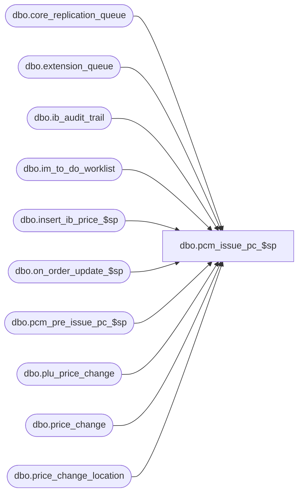

# dbo.pcm_issue_pc_$sp

**Database:** me_01  
**Server:** bedrockdb02  

## Architecture Diagram



## Table Dependencies

| Referenced Table |
|---|
| dbo.core_replication_queue |
| dbo.extension_queue |
| dbo.ib_audit_trail |
| dbo.im_to_do_worklist |
| dbo.insert_ib_price_$sp |
| dbo.on_order_update_$sp |
| dbo.pcm_pre_issue_pc_$sp |
| dbo.plu_price_change |
| dbo.price_change |
| dbo.price_change_location |

## Stored Procedure Code

```sql
CREATE PROCEDURE [dbo].[pcm_issue_pc_$sp]
( @price_change_id DECIMAL(12) 
 ,@employee_first_name NVARCHAR(30)=N'Admin'
 , @employee_last_name NVARCHAR(30)=N'Admin'
)
AS

BEGIN
	DECLARE @price_change_no NVARCHAR(20), @effective_from_date SMALLDATETIME, @effective_to_date SMALLDATETIME, @price_change_desc NVARCHAR(60)
	DECLARE @error_msg NVARCHAR(2000)

	--validate the price change is ok, and get some dates.
	SELECT
		@price_change_no = price_change_no
		, @effective_from_date = effective_from_date
		, @effective_to_date = effective_to_date
		, @price_change_desc = price_change_description
	FROM
		price_change
	WHERE (approval_status = 0 OR approval_status = 2)
		AND price_change_status = 2
		AND (price_change_duration = 0 OR price_change_duration = 1)
		AND issue_date <= GETDATE()
		AND price_change_id = @price_change_id

	
	--verify this returned a row...
	
	IF @@ROWCOUNT = 0 
	BEGIN
		SET @error_msg=N'Price change (id: ' + CAST(@price_change_id AS NVARCHAR(20)) + N') is not in a valid state to be issued.'
		RAISERROR (@error_msg	, -- Message text.
           16, -- Severity.
           1 -- State.
           );
        return;
	END

	--temp tables that will be used in the transaction.
	IF NOT object_id(N'tempdb..#ib_price') IS NULL
	DROP TABLE #ib_price

	CREATE TABLE #ib_price
		( id INT IDENTITY(1,1) NOT NULL
		, style_id DECIMAL(12) NOT NULL, color_id SMALLINT
		, location_id SMALLINT, jurisdiction_id SMALLINT NOT NULL, pricing_group_id SMALLINT
		, temp_price_flag BIT NOT NULL
		, start_date SMALLDATETIME NOT NULL, end_date SMALLDATETIME
		, valuation_retail_price DECIMAL(14,2) NOT NULL, selling_retail_price DECIMAL(14,2) NOT NULL, price_status_id SMALLINT NOT NULL
		, document_number NVARCHAR(20)
		, cancel_promo_flag BIT NOT NULL
		, effective_date SMALLDATETIME, price_change_type SMALLINT, sku_id DECIMAL(13), style_color_id DECIMAL(13)
		, PRIMARY KEY (id) )

	IF NOT object_id(N'tempdb..#ib_on_order') IS NULL
	DROP TABLE #ib_on_order

	CREATE TABLE #ib_on_order
		( id INT IDENTITY(1,1) NOT NULL
		, sku_id DECIMAL(13) NOT NULL, location_id SMALLINT NOT NULL, receipt_date SMALLDATETIME NOT NULL
		, transaction_type_code INT NOT NULL
		, price_status_id SMALLINT NOT NULL
		, on_order_units INT NOT NULL, on_order_cost DECIMAL(14,2) NOT NULL, on_order_cost_local DECIMAL(14,2)
		, on_order_valuation_retail DECIMAL(14,2) NOT NULL
		, on_order_selling_retail DECIMAL(14,2) NOT NULL
		, document_number NVARCHAR(20) NOT NULL, pack_id DECIMAL(13) )

	
	BEGIN TRY
		--populate these temp tables.  does not need to be in the transaction, as we don't care if we loose this
		EXEC pcm_pre_issue_pc_$sp @price_change_id
		
		BEGIN TRAN
		
			EXEC insert_ib_price_$sp
			
			--set the status to Issued
			UPDATE price_change 
			SET price_change_status = 3, 
				state_no = 6 
			WHERE price_change_id = @price_change_id
			
			--integrate with im_to_do_worklist
			INSERT INTO im_to_do_worklist 
				( document_type, document_id, location_id )
			SELECT 
				33, price_change_id document_id, pcl.location_id
			FROM
				price_change_location pcl
				LEFT OUTER JOIN im_to_do_worklist im ON document_type = 33 and im.location_id = pcl.location_id and im.document_id = pcl.price_change_id
			WHERE
				price_change_id = @price_change_id AND im.document_id IS NULL

			--integrate with PLU				
			INSERT INTO plu_price_change  
				( document_number, start_date, end_date )
			VALUES
				(@price_change_no, @effective_from_date, @effective_to_date);
				
			--and the Replication Queue
			INSERT INTO core_replication_queue 
				(entity_code, replication_action, entity_id)
			VALUES 
				(931, N'I', @price_change_id );
			
			
			DECLARE @on_order_count INT
			SELECT @on_order_count = COALESCE(MAX(id), 0) FROM #ib_on_order
			
			IF (@on_order_count > 0)
			BEGIN
				
				EXEC on_order_update_$sp N' SELECT 
											sku_id, location_id, receipt_date, transaction_type_code, price_status_id,
											on_order_units, on_order_cost, on_order_cost_local, on_order_valuation_retail,
											on_order_selling_retail, document_number, pack_id, NULL po_receipt_id, NULL actual_receipt_date, NULL received_quantity,
											NULL po_id, NULL po_shipment_id
										  FROM
											#ib_on_order
										  ORDER BY
											id '
				
				--insert permanent issued PC to extension queue
				INSERT INTO extension_queue
					(type, entity_id, method_id, entity_name)
				VALUES
					(2
					,@price_change_id
					,N'75E247F6-A0B9-4ed7-ADA3-141D128C2305'
					,COALESCE(@price_change_desc, N''))


			END
			
			--theres an audit trail entry for this too.
			INSERT INTO ib_audit_trail 
				(entry_date, application, activity, application_type, application_type_id, application_identifier, 
				application_level, application_key, action, field_affected, old_value, new_value, status, 
				employee_last_name, employee_first_name) 
			VALUES 
				(GETDATE(),N'PCM',N'Issued',N'PC',NULL,@price_change_no,NULL,NULL,NULL,NULL,NULL,NULL,NULL,
				@employee_first_name, @employee_last_name); 											
			
		COMMIT
		
		

		TRUNCATE TABLE #ib_price
		TRUNCATE TABLE #ib_on_order

	END TRY
	BEGIN CATCH
		SELECT @error_msg = N'Error ' + CAST(ERROR_NUMBER() AS NVARCHAR(20)) + N' : issuing price change id: ' + CAST(@price_change_id AS NVARCHAR(20)) + N'. Error message: ' + ERROR_MESSAGE();
		
		--roll back the transaction
		IF (XACT_STATE()) = -1
			ROLLBACK TRANSACTION;
		
		RAISERROR (@error_msg, 
					16, -- Severity.
					1 -- State.
					);

	END CATCH
	

END
```

