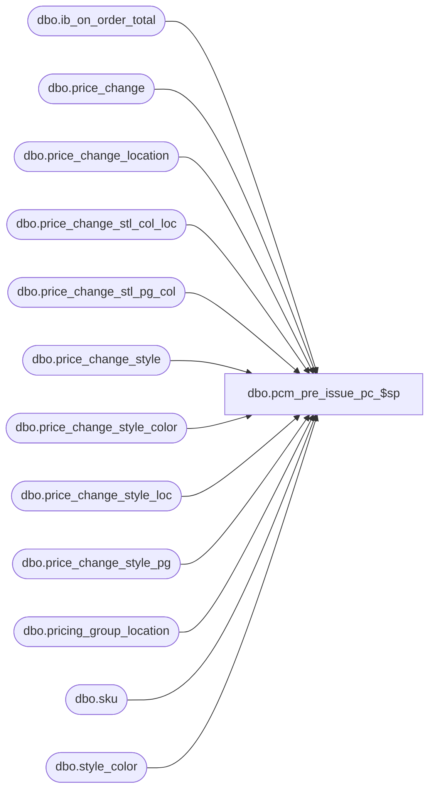

# dbo.pcm_pre_issue_pc_$sp

**Database:** me_01  
**Server:** bedrockdb02  

## Architecture Diagram



## Table Dependencies

| Referenced Table |
|---|
| dbo.ib_on_order_total |
| dbo.price_change |
| dbo.price_change_location |
| dbo.price_change_stl_col_loc |
| dbo.price_change_stl_pg_col |
| dbo.price_change_style |
| dbo.price_change_style_color |
| dbo.price_change_style_loc |
| dbo.price_change_style_pg |
| dbo.pricing_group_location |
| dbo.sku |
| dbo.style_color |

## Stored Procedure Code

```sql
CREATE PROCEDURE [dbo].[pcm_pre_issue_pc_$sp]
( @price_change_id DECIMAL(12) )
AS
/*
Proc Name : pcm_pre_issue_pc_$sp
     Desc :

HISTORY:
Date		Name		Def#		Desc
Jan18,12	Qing Yang	127244		Ported back R3 defect 127240 - fix possible null values
August 28,  2012 P.Lemay 136245		retail is not being updated from price changes in ib_on_order when there is no on hand
October 18, 2012 P.Lemay 139091		erd of po set to current date; seg34000 does not update ib_on_order with transtype 150
July 10, 2013 Qing Yang  145052	    mew:price change on foreign jurisdiction will trigger on order re-evaluation on domestic po's
Apr 04, 2014 C MacIsaac  151162		On-order retails for locations other than the ones on the PC get set to zero; added #price_change_location
*/

BEGIN


	IF NOT object_id(N'tempdb..#price_change_style') IS NULL
	DROP TABLE #price_change_style

	CREATE TABLE #price_change_style
		( price_change_style_id DECIMAL(12), price_change_id DECIMAL(12)
		, style_id DECIMAL(12)
		, valuation_retail_price DECIMAL(14,2), selling_retail_price DECIMAL(14,2), price_status_id SMALLINT
		, PRIMARY KEY ( price_change_style_id, price_change_id ) )

	IF NOT object_id(N'tempdb..#price_change_style_color') IS NULL
	DROP TABLE #price_change_style_color

	CREATE TABLE #price_change_style_color
		( price_change_style_id DECIMAL(12), price_change_id DECIMAL(12)
		, style_id DECIMAL(12), color_id SMALLINT
		, valuation_retail_price DECIMAL(14,2), selling_retail_price DECIMAL(14,2), price_status_id SMALLINT
		, jur_valuation_retail_price DECIMAL(14,2), jur_selling_retail_price DECIMAL(14,2), jur_price_status_id SMALLINT
		, PRIMARY KEY ( price_change_style_id, price_change_id
					  , color_id ) )

	IF NOT object_id(N'tempdb..#price_change_style_pg') IS NULL
	DROP TABLE #price_change_style_pg

	CREATE TABLE #price_change_style_pg
		( price_change_style_id DECIMAL(12), price_change_id DECIMAL(12)
		, style_id DECIMAL(12), pricing_group_id SMALLINT
		, valuation_retail_price DECIMAL(14,2), selling_retail_price DECIMAL(14,2), price_status_id SMALLINT
		, jur_valuation_retail_price DECIMAL(14,2), jur_selling_retail_price DECIMAL(14,2), jur_price_status_id SMALLINT
		, PRIMARY KEY ( price_change_style_id, price_change_id
					  , pricing_group_id ) )

	IF NOT object_id(N'tempdb..#price_change_stl_pg_col') IS NULL
	DROP TABLE #price_change_stl_pg_col

	CREATE TABLE #price_change_stl_pg_col
		( price_change_style_id DECIMAL(12), price_change_id DECIMAL(12)
		, style_id DECIMAL(12), color_id SMALLINT, pricing_group_id SMALLINT
		, valuation_retail_price DECIMAL(14,2), selling_retail_price DECIMAL(14,2), price_status_id SMALLINT
		, jur_valuation_retail_price DECIMAL(14,2), jur_selling_retail_price DECIMAL(14,2), jur_price_status_id SMALLINT
		, PRIMARY KEY ( price_change_style_id, price_change_id
					  , color_id, pricing_group_id ) )

	IF NOT object_id(N'tempdb..#price_change_style_loc') IS NULL
	DROP TABLE #price_change_style_loc

	CREATE TABLE #price_change_style_loc
		( price_change_style_id DECIMAL(12), price_change_id DECIMAL(12)
		, style_id DECIMAL(12), location_id SMALLINT
		, valuation_retail_price DECIMAL(14,2), selling_retail_price DECIMAL(14,2), price_status_id SMALLINT
		, jur_valuation_retail_price DECIMAL(14,2), jur_selling_retail_price DECIMAL(14,2), jur_price_status_id SMALLINT
		, PRIMARY KEY ( price_change_style_id, price_change_id
					  , location_id ) )

	IF NOT object_id(N'tempdb..#price_change_stl_col_loc') IS NULL
	DROP TABLE #price_change_stl_col_loc

	CREATE TABLE #price_change_stl_col_loc
		( price_change_style_id DECIMAL(12), price_change_id DECIMAL(12)
		, style_id DECIMAL(12), color_id SMALLINT, location_id SMALLINT
		, valuation_retail_price DECIMAL(14,2), selling_retail_price DECIMAL(14,2), price_status_id SMALLINT
		, jur_valuation_retail_price DECIMAL(14,2), jur_selling_retail_price DECIMAL(14,2), jur_price_status_id SMALLINT
		, PRIMARY KEY ( price_change_style_id, price_change_id
					  , color_id, location_id ) )

	IF NOT object_id(N'tempdb..#future_ib_price') IS NULL
	DROP TABLE #future_ib_price

	CREATE TABLE #future_ib_price
		( id INT IDENTITY(1,1) NOT NULL
		, style_id DECIMAL(12) NOT NULL, color_id SMALLINT
		, location_id SMALLINT, jurisdiction_id SMALLINT NOT NULL, pricing_group_id SMALLINT
		, PRIMARY KEY (id) )

	IF NOT object_id(N'tempdb..#price_change_location') IS NULL
	DROP TABLE #price_change_location

	CREATE TABLE #price_change_location
		(price_change_id DECIMAL(12) NOT NULL, location_id SMALLINT NOT NULL
		, PRIMARY KEY (price_change_id, location_id ))

	-- These values come from the header so I can get them now and use them later
	-- After this, we should not have to join to price_change any more

	DECLARE
		@jurisdiction_id SMALLINT
		, @temp_price_flag SMALLINT
		, @start_date SMALLDATETIME, @end_date SMALLDATETIME
		, @cancel_promo_flag BIT, @price_change_type SMALLINT
		, @document_number NVARCHAR(20)

	SELECT
		@jurisdiction_id = jurisdiction_id
		, @temp_price_flag = price_change_duration
		, @start_date = effective_from_date, @end_date = effective_to_date
		, @cancel_promo_flag = 0, @price_change_type = price_change_type
		, @document_number = price_change_no
	FROM
		price_change
	WHERE
		price_change_id = @price_change_id

	-- Assume that outside code has already created #price_change_style

	INSERT INTO #price_change_style
		( price_change_style_id, price_change_id
		, style_id
		, valuation_retail_price, selling_retail_price, price_status_id )
	SELECT
		price_change_style_id, price_change_id
		, style_id
		, new_valuation_price valuation_retail_price, new_price selling_retail_price, price_status_id
	FROM
		price_change_style
	WHERE
		price_change_id = @price_change_id-- AND new_price IS NOT NULL

	-- Assume that outside code has already created #price_change_style_color

	INSERT INTO #price_change_style_color
		( price_change_style_id, price_change_id
		, style_id, color_id
		, valuation_retail_price, selling_retail_price, price_status_id
		, jur_valuation_retail_price, jur_selling_retail_price, jur_price_status_id )
	SELECT
		c.price_change_style_id, c.price_change_id
		, s.style_id, c.color_id
		, c.new_valuation_price valuation_retail_price, c.new_price selling_retail_price, c.price_status_id
		, s.valuation_retail_price jur_valuation_retail_price, s.selling_retail_price jur_selling_retail_price, s.price_status_id
	FROM
		price_change_style_color c
	INNER JOIN #price_change_style s ON c.price_change_style_id = s.price_change_style_id AND c.price_change_id = s.price_change_id
	WHERE
		c.price_change_id = @price_change_id AND new_price IS NOT NULL

	-- Assume that outside code has already created #price_change_style_pg

	INSERT INTO #price_change_style_pg
		( price_change_style_id, price_change_id
		, style_id, pricing_group_id
		, valuation_retail_price, selling_retail_price, price_status_id
		, jur_valuation_retail_price, jur_selling_retail_price, jur_price_status_id )
	SELECT
		g.price_change_style_id, g.price_change_id
		, s.style_id, g.pricing_group_id
		, g.new_valuation_price valuation_retail_price, g.new_price selling_retail_price, g.price_status_id
		, s.valuation_retail_price jur_valuation_retail_price, s.selling_retail_price jur_selling_retail_price, s.price_status_id
	FROM
		price_change_style_pg g
	INNER JOIN #price_change_style s ON g.price_change_style_id = s.price_change_style_id AND g.price_change_id = s.price_change_id
	WHERE
		g.price_change_id = @price_change_id AND new_price IS NOT NULL

	-- Assume that outside code has already created #price_change_stl_pg_col

	INSERT INTO #price_change_stl_pg_col
		( price_change_style_id, price_change_id
		, style_id, color_id, pricing_group_id
		, valuation_retail_price, selling_retail_price, price_status_id
		, jur_valuation_retail_price, jur_selling_retail_price, jur_price_status_id )
	SELECT
		cg.price_change_style_id, cg.price_change_id
		, s.style_id, cg.color_id, cg.pricing_group_id
		, cg.new_valuation_price valuation_retail_price, cg.new_price selling_retail_price, cg.price_status_id
		, s.valuation_retail_price jur_valuation_retail_price, s.selling_retail_price jur_selling_retail_price, s.price_status_id
	FROM
		price_change_stl_pg_col cg
	INNER JOIN #price_change_style s ON cg.price_change_style_id = s.price_change_style_id AND cg.price_change_id = s.price_change_id
	WHERE
		cg.price_change_id = @price_change_id AND new_price IS NOT NULL

	-- Assume that outside code has already created #price_change_style_loc

	INSERT INTO #price_change_style_loc
		( price_change_style_id, price_change_id
		, style_id, location_id
		, valuation_retail_price, selling_retail_price, price_status_id
		, jur_valuation_retail_price, jur_selling_retail_price, jur_price_status_id )
	SELECT
		l.price_change_style_id, l.price_change_id
		, s.style_id, l.location_id
		, l.new_valuation_price valuation_retail_price, l.new_price selling_retail_price, l.price_status_id
		, s.valuation_retail_price jur_valuation_retail_price, s.selling_retail_price jur_selling_retail_price, s.price_status_id
	FROM
		price_change_style_loc l
	INNER JOIN #price_change_style s ON l.price_change_style_id = s.price_change_style_id AND l.price_change_id = s.price_change_id
	WHERE
		l.price_change_id = @price_change_id AND new_price IS NOT NULL

	-- Assume that outside code has already created #price_change_stl_col_loc

	INSERT INTO #price_change_stl_col_loc
		( price_change_style_id, price_change_id
		, style_id, color_id, location_id
		, valuation_retail_price, selling_retail_price, price_status_id
		, jur_valuation_retail_price, jur_selling_retail_price, jur_price_status_id )
	SELECT
		cl.price_change_style_id, cl.price_change_id
		, s.style_id, cl.color_id, cl.location_id
		, cl.new_valuation_price valuation_retail_price, cl.new_price selling_retail_price, cl.price_status_id
		, s.valuation_retail_price jur_valuation_retail_price, s.selling_retail_price jur_selling_retail_price, s.price_status_id
	FROM
		price_change_stl_col_loc cl
	INNER JOIN #price_change_style s ON cl.price_change_style_id = s.price_change_style_id AND cl.price_change_id = s.price_change_id
	WHERE
		cl.price_change_id = @price_change_id AND new_price IS NOT NULL

	INSERT INTO #price_change_location (price_change_id, location_id)
	SELECT l.price_change_id, l.location_id
	FROM price_change_location l
	WHERE l.price_change_id = @price_change_id

	-- Style/Jurisidiction
	INSERT INTO #ib_price
		( style_id, color_id
		, location_id , jurisdiction_id, pricing_group_id
		, temp_price_flag
		, start_date, end_date
		, valuation_retail_price, selling_retail_price, price_status_id
		, document_number
		, cancel_promo_flag
		, effective_date, price_change_type )
	SELECT
		style_id, null color_id
		, null location_id, @jurisdiction_id, null pricing_group_id
		, @temp_price_flag temp_price_flag
		, @start_date, @end_date
		, valuation_retail_price, selling_retail_price, price_status_id
		, @document_number
		, @cancel_promo_flag
		, null effective_date, @price_change_type
	FROM
		#price_change_style
	WHERE
		valuation_retail_price IS NOT NULL AND selling_retail_price IS NOT NULL

	-- Style/Color/Jurisidiction
	INSERT INTO #ib_price
		( style_id, color_id
		, location_id , jurisdiction_id, pricing_group_id
		, temp_price_flag
		, start_date, end_date
		, valuation_retail_price, selling_retail_price, price_status_id
		, document_number
		, cancel_promo_flag
		, effective_date, price_change_type )
	SELECT
		style_id, color_id
		, null location_id, @jurisdiction_id, null pricing_group_id
		, @temp_price_flag temp_price_flag
		, @start_date, @end_date
		, valuation_retail_price, selling_retail_price, price_status_id
		, @document_number
		, @cancel_promo_flag
		, null effective_date, @price_change_type
	FROM
		#price_change_style_color
	WHERE
		jur_valuation_retail_price IS NULL OR jur_valuation_retail_price <> valuation_retail_price

	-- Style/PG
	INSERT INTO #ib_price
		( style_id, color_id
		, location_id , jurisdiction_id, pricing_group_id
		, temp_price_flag
		, start_date, end_date
		, valuation_retail_price, selling_retail_price, price_status_id
		, document_number
		, cancel_promo_flag
		, effective_date, price_change_type )
	SELECT
		style_id, null color_id
		, null location_id, @jurisdiction_id, pricing_group_id
		, @temp_price_flag temp_price_flag
		, @start_date, @end_date
		, valuation_retail_price, selling_retail_price, price_status_id
		, @document_number
		, @cancel_promo_flag
		, null effective_date, @price_change_type
	FROM
		#price_change_style_pg
	WHERE
		jur_valuation_retail_price IS NULL OR jur_valuation_retail_price <> valuation_retail_price

	-- Style/PG -- Location Expansion
	INSERT INTO #ib_price
		( style_id, color_id
		, location_id , jurisdiction_id, pricing_group_id
		, temp_price_flag
		, start_date, end_date
		, valuation_retail_price, selling_retail_price, price_status_id
		, document_number
		, cancel_promo_flag
		, effective_date, price_change_type )
	SELECT
		style_id, null color_id
		, l.location_id, @jurisdiction_id, g.pricing_group_id
		, @temp_price_flag temp_price_flag
		, @start_date, @end_date
		, valuation_retail_price, selling_retail_price, price_status_id
		, @document_number
		, @cancel_promo_flag
		, null effective_date, @price_change_type
	FROM
		#price_change_style_pg g
	INNER JOIN pricing_group_location l ON g.pricing_group_id = l.pricing_group_id
	WHERE
		jur_valuation_retail_price IS NULL OR jur_valuation_retail_price <> valuation_retail_price

	-- Style/Color/PG/
	INSERT INTO #ib_price
		( style_id, color_id
		, location_id , jurisdiction_id, pricing_group_id
		, temp_price_flag
		, start_date, end_date
		, valuation_retail_price, selling_retail_price, price_status_id
		, document_number
		, cancel_promo_flag
		, effective_date, price_change_type )
	SELECT
		style_id, color_id
		, null location_id, @jurisdiction_id, pricing_group_id
		, @temp_price_flag temp_price_flag
		, @start_date, @end_date
		, valuation_retail_price, selling_retail_price, price_status_id
		, @document_number
		, @cancel_promo_flag
		, null effective_date, @price_change_type
	FROM
		#price_change_stl_pg_col
	WHERE
		jur_valuation_retail_price IS NULL OR jur_valuation_retail_price <> valuation_retail_price

	-- Style/Color/PG/ -- Location Expansion
	INSERT INTO #ib_price
		( style_id, color_id
		, location_id , jurisdiction_id, pricing_group_id
		, temp_price_flag
		, start_date, end_date
		, valuation_retail_price, selling_retail_price, price_status_id
		, document_number
		, cancel_promo_flag
		, effective_date, price_change_type )
	SELECT
		style_id, color_id
		, l.location_id, @jurisdiction_id, cg.pricing_group_id
		, @temp_price_flag temp_price_flag
		, @start_date, @end_date
		, valuation_retail_price, selling_retail_price, price_status_id
		, @document_number
		, @cancel_promo_flag
		, null effective_date, @price_change_type
	FROM
		#price_change_stl_pg_col cg
	INNER JOIN pricing_group_location l ON cg.pricing_group_id = l.pricing_group_id
	WHERE
		jur_valuation_retail_price IS NULL OR jur_valuation_retail_price <> valuation_retail_price

	-- Style/Location
	INSERT INTO #ib_price
		( style_id, color_id
		, location_id , jurisdiction_id, pricing_group_id
		, temp_price_flag
		, start_date, end_date
		, valuation_retail_price, selling_retail_price, price_status_id
		, document_number
		, cancel_promo_flag
		, effective_date, price_change_type )
	SELECT
		style_id, null color_id
		, location_id, @jurisdiction_id, null pricing_group_id
		, @temp_price_flag temp_price_flag
		, @start_date, @end_date
		, valuation_retail_price, selling_retail_price, price_status_id
		, @document_number
		, @cancel_promo_flag
		, null effective_date, @price_change_type
	FROM
		#price_change_style_loc
	WHERE
		jur_valuation_retail_price IS NULL OR jur_valuation_retail_price <> valuation_retail_price

	-- Style/Color/Location
	INSERT INTO #ib_price
		( style_id, color_id
		, location_id , jurisdiction_id, pricing_group_id
		, temp_price_flag
		, start_date, end_date
		, valuation_retail_price, selling_retail_price, price_status_id
		, document_number
		, cancel_promo_flag
		, effective_date, price_change_type )
	SELECT
		style_id, color_id
		, location_id, @jurisdiction_id, null pricing_group_id
		, @temp_price_flag temp_price_flag
		, @start_date, @end_date
		, valuation_retail_price, selling_retail_price, price_status_id
		, @document_number
		, @cancel_promo_flag
		, null effective_date, @price_change_type
	FROM
		#price_change_stl_col_loc
	WHERE
		jur_valuation_retail_price IS NULL OR jur_valuation_retail_price <> valuation_retail_price

	IF (@temp_price_flag = 0)
	BEGIN

		INSERT INTO #future_ib_price
			( style_id, color_id
			, location_id , jurisdiction_id, pricing_group_id )
		SELECT
			style_id, color_id
			, location_id , jurisdiction_id, pricing_group_id
		FROM
			#ib_price
		WHERE
			(location_id IS NULL OR pricing_group_id IS NULL)
			AND temp_price_flag = 0 AND start_date > @start_date
			AND jurisdiction_id = @jurisdiction_id

		/*
		Adjust values for new price status
		*/
		INSERT INTO #ib_on_order
			( sku_id, location_id, receipt_date
			, transaction_type_code
			, price_status_id
			, on_order_units, on_order_cost, on_order_cost_local
			, on_order_valuation_retail
			, on_order_selling_retail
			, document_number, pack_id )
		SELECT
			i.sku_id, i.location_id, i.receipt_date
			, 150 transaction_type_code
			, i.price_status_id
			, 0 on_order_units, 0 on_order_cost, 0 on_order_cost_local
			, COALESCE(cl.valuation_retail_price
				, COALESCE(l.valuation_retail_price
					, COALESCE(cg.valuation_retail_price
						, COALESCE(g.valuation_retail_price
							, COALESCE(c.valuation_retail_price, COALESCE(s.valuation_retail_price, 0)))))) * i.total_on_order_units - i.total_on_order_val_retail on_order_valuation_retail
			, COALESCE(cl.selling_retail_price
				, COALESCE(l.selling_retail_price
					, COALESCE(cg.selling_retail_price
						, COALESCE(g.selling_retail_price
							, COALESCE(c.selling_retail_price, COALESCE(s.selling_retail_price, 0)))))) * i.total_on_order_units - i.total_on_order_val_retail on_order_selling_retail
			, i.document_number, i.pack_id
		FROM
			ib_on_order_total i
		INNER JOIN #price_change_location pcl ON i.location_id = pcl.location_id AND pcl.price_change_id = @price_change_id
		INNER JOIN sku k ON i.sku_id = k.sku_id
		INNER JOIN style_color sc ON k.style_color_id = sc.style_color_id
		LEFT OUTER JOIN pricing_group_location pl ON i.location_id = pl.location_id
		INNER JOIN #price_change_style s ON sc.style_id = s.style_id AND s.price_change_id = @price_change_id
		LEFT OUTER JOIN #future_ib_price fs ON s.style_id = fs.style_id
													AND fs.color_id IS NULL
													AND fs.pricing_group_id IS NULL
													AND fs.location_id IS NULL
		LEFT OUTER JOIN #price_change_style_color c ON s.price_change_style_id = c.price_change_style_id AND s.price_change_id = c.price_change_id
														AND sc.color_id = c.color_id
		LEFT OUTER JOIN #future_ib_price fc ON s.style_id = fc.style_id
													AND (fc.color_id IS NULL OR c.color_id = fc.color_id)
													AND fc.pricing_group_id IS NULL
													AND fc.location_id IS NULL
		LEFT OUTER JOIN #price_change_style_pg g ON s.price_change_style_id = g.price_change_style_id AND s.price_change_id = g.price_change_id
														AND pl.pricing_group_id = g.pricing_group_id
		LEFT OUTER JOIN #future_ib_price fg ON s.style_id = fg.style_id
													AND fg.color_id IS NULL
													AND (fg.pricing_group_id IS NULL OR g.pricing_group_id = fg.pricing_group_id)
													AND fg.location_id IS NULL
		LEFT OUTER JOIN #price_change_stl_pg_col cg ON s.price_change_style_id = cg.price_change_style_id AND s.price_change_id = cg.price_change_id
														AND sc.color_id = cg.color_id AND pl.pricing_group_id = cg.pricing_group_id
		LEFT OUTER JOIN #future_ib_price fcg ON s.style_id = fcg.style_id
													AND (fcg.color_id IS NULL OR cg.color_id = fcg.color_id)
													AND (fcg.pricing_group_id IS NULL OR g.pricing_group_id = fcg.pricing_group_id)
													AND fcg.location_id IS NULL
		LEFT OUTER JOIN #price_change_style_loc l ON s.price_change_style_id = l.price_change_style_id AND s.price_change_id = l.price_change_id
														AND i.location_id = l.location_id
		LEFT OUTER JOIN #future_ib_price fl ON s.style_id = fl.style_id
													AND fl.color_id IS NULL
													AND fl.pricing_group_id IS NULL
													AND (fl.location_id IS NULL OR l.location_id = fl.location_id)
		LEFT OUTER JOIN #price_change_stl_col_loc cl ON s.price_change_style_id = cl.price_change_style_id AND s.price_change_id = cl.price_change_id
														AND sc.color_id = cl.color_id AND i.location_id = cl.location_id
		LEFT OUTER JOIN #future_ib_price fcl ON s.style_id = fcl.style_id
													AND (fcl.color_id IS NULL OR cl.color_id = fcl.color_id)
													AND fcl.pricing_group_id IS NULL
													AND (fcl.location_id IS NULL OR cl.location_id = fcl.location_id)
		WHERE
			( COALESCE(cl.valuation_retail_price
				, COALESCE(l.valuation_retail_price
					, COALESCE(cg.valuation_retail_price
						, COALESCE(g.valuation_retail_price
							, COALESCE(c.valuation_retail_price, COALESCE(s.valuation_retail_price, 0)))))) * i.total_on_order_units - i.total_on_order_val_retail <> 0
			  OR COALESCE(cl.selling_retail_price
					, COALESCE(l.selling_retail_price
						, COALESCE(cg.selling_retail_price
							, COALESCE(g.selling_retail_price
								, COALESCE(c.selling_retail_price, COALESCE(s.selling_retail_price, 0)))))) * i.total_on_order_units - i.total_on_order_val_retail <> 0 )
			AND fs.id IS NULL AND fc.id IS NULL
			AND fg.id IS NULL AND fcg.id IS NULL
			AND fl.id IS NULL AND fl.id IS NULL
			AND i.receipt_date >= @start_date


		/*
			removing the values for the current price status
		*/
		INSERT INTO #ib_on_order
			( sku_id, location_id, receipt_date
			, transaction_type_code
			, price_status_id
			, on_order_units, on_order_cost, on_order_cost_local
			, on_order_valuation_retail
			, on_order_selling_retail
			, document_number, pack_id )
		SELECT
			i.sku_id, i.location_id, i.receipt_date
			, 150 transaction_type_code
			, i.price_status_id
			, -1 * i.total_on_order_units, -1 * i.total_on_order_cost, -1 * i.total_on_order_cost_local
			, COALESCE(cl.valuation_retail_price
				, COALESCE(l.valuation_retail_price
					, COALESCE(cg.valuation_retail_price
						, COALESCE(g.valuation_retail_price
							, COALESCE(c.valuation_retail_price, COALESCE(s.valuation_retail_price, 0)))))) * i.total_on_order_units * -1 on_order_valuation_retail
			, COALESCE(cl.selling_retail_price
				, COALESCE(l.selling_retail_price
					, COALESCE(cg.selling_retail_price
						, COALESCE(g.selling_retail_price
							, COALESCE(c.selling_retail_price, COALESCE(s.selling_retail_price, 0)))))) * i.total_on_order_units * -1 on_order_selling_retail
			, i.document_number, i.pack_id
		FROM
			ib_on_order_total i
		INNER JOIN #price_change_location pcl ON i.location_id = pcl.location_id AND pcl.price_change_id = @price_change_id
		INNER JOIN sku k ON i.sku_id = k.sku_id
		INNER JOIN style_color sc ON k.style_color_id = sc.style_color_id
		LEFT OUTER JOIN pricing_group_location pl ON i.location_id = pl.location_id
		INNER JOIN #price_change_style s ON sc.style_id = s.style_id AND s.price_change_id = @price_change_id
		LEFT OUTER JOIN #future_ib_price fs ON s.style_id = fs.style_id
													AND fs.color_id IS NULL
													AND fs.pricing_group_id IS NULL
													AND fs.location_id IS NULL
		LEFT OUTER JOIN #price_change_style_color c ON s.price_change_style_id = c.price_change_style_id AND s.price_change_id = c.price_change_id
														AND sc.color_id = c.color_id
		LEFT OUTER JOIN #future_ib_price fc ON s.style_id = fc.style_id
													AND (fc.color_id IS NULL OR c.color_id = fc.color_id)
													AND fc.pricing_group_id IS NULL
													AND fc.location_id IS NULL
		LEFT OUTER JOIN #price_change_style_pg g ON s.price_change_style_id = g.price_change_style_id AND s.price_change_id = g.price_change_id
														AND pl.pricing_group_id = g.pricing_group_id
		LEFT OUTER JOIN #future_ib_price fg ON s.style_id = fg.style_id
													AND fg.color_id IS NULL
													AND (fg.pricing_group_id IS NULL OR g.pricing_group_id = fg.pricing_group_id)
													AND fg.location_id IS NULL
		LEFT OUTER JOIN #price_change_stl_pg_col cg ON s.price_change_style_id = cg.price_change_style_id AND s.price_change_id = cg.price_change_id
														AND sc.color_id = cg.color_id AND pl.pricing_group_id = cg.pricing_group_id
		LEFT OUTER JOIN #future_ib_price fcg ON s.style_id = fcg.style_id
													AND (fcg.color_id IS NULL OR cg.color_id = fcg.color_id)
													AND (fcg.pricing_group_id IS NULL OR g.pricing_group_id = fcg.pricing_group_id)
													AND fcg.location_id IS NULL
		LEFT OUTER JOIN #price_change_style_loc l ON s.price_change_style_id = l.price_change_style_id AND s.price_change_id = l.price_change_id
														AND i.location_id = l.location_id
		LEFT OUTER JOIN #future_ib_price fl ON s.style_id = fl.style_id
													AND fl.color_id IS NULL
													AND fl.pricing_group_id IS NULL
													AND (fl.location_id IS NULL OR l.location_id = fl.location_id)
		LEFT OUTER JOIN #price_change_stl_col_loc cl ON s.price_change_style_id = cl.price_change_style_id AND s.price_change_id = cl.price_change_id
														AND sc.color_id = cl.color_id AND i.location_id = cl.location_id
		LEFT OUTER JOIN #future_ib_price fcl ON s.style_id = fcl.style_id
													AND (fcl.color_id IS NULL OR cl.color_id = fcl.color_id)
													AND fcl.pricing_group_id IS NULL
													AND (fcl.location_id IS NULL OR cl.location_id = fcl.location_id)
		WHERE
			fs.id IS NULL AND fc.id IS NULL
			AND fg.id IS NULL AND fcg.id IS NULL
			AND fl.id IS NULL AND fl.id IS NULL
			AND i.price_status_id <> s.price_status_id
			AND i.receipt_date >= @start_date

		/*
			adds the values for the new current price status
		*/

		INSERT INTO #ib_on_order
			( sku_id, location_id, receipt_date
			, transaction_type_code
			, price_status_id
			, on_order_units, on_order_cost, on_order_cost_local
			, on_order_valuation_retail
			, on_order_selling_retail
			, document_number, pack_id )
		SELECT
			i.sku_id, i.location_id, i.receipt_date
			, 150 transaction_type_code
			, s.price_status_id
			, i.total_on_order_units, i.total_on_order_cost, i.total_on_order_cost_local
			, COALESCE(cl.valuation_retail_price
				, COALESCE(l.valuation_retail_price
					, COALESCE(cg.valuation_retail_price
						, COALESCE(g.valuation_retail_price
							, COALESCE(c.valuation_retail_price, COALESCE(s.valuation_retail_price, 0)))))) * i.total_on_order_units  on_order_valuation_retail
			, COALESCE(cl.selling_retail_price
				, COALESCE(l.selling_retail_price
					, COALESCE(cg.selling_retail_price
						, COALESCE(g.selling_retail_price
							, COALESCE(c.selling_retail_price, COALESCE(s.selling_retail_price, 0)))))) * i.total_on_order_units  on_order_selling_retail
			, i.document_number, i.pack_id
		FROM
			ib_on_order_total i
		INNER JOIN #price_change_location pcl ON i.location_id = pcl.location_id AND pcl.price_change_id = @price_change_id
		INNER JOIN sku k ON i.sku_id = k.sku_id
		INNER JOIN style_color sc ON k.style_color_id = sc.style_color_id
		LEFT OUTER JOIN pricing_group_location pl ON i.location_id = pl.location_id
		INNER JOIN #price_change_style s ON sc.style_id = s.style_id AND s.price_change_id = @price_change_id
		LEFT OUTER JOIN #future_ib_price fs ON s.style_id = fs.style_id
													AND fs.color_id IS NULL
													AND fs.pricing_group_id IS NULL
													AND fs.location_id IS NULL
		LEFT OUTER JOIN #price_change_style_color c ON s.price_change_style_id = c.price_change_style_id AND s.price_change_id = c.price_change_id
														AND sc.color_id = c.color_id
		LEFT OUTER JOIN #future_ib_price fc ON s.style_id = fc.style_id
													AND (fc.color_id IS NULL OR c.color_id = fc.color_id)
													AND fc.pricing_group_id IS NULL
													AND fc.location_id IS NULL
		LEFT OUTER JOIN #price_change_style_pg g ON s.price_change_style_id = g.price_change_style_id AND s.price_change_id = g.price_change_id
														AND pl.pricing_group_id = g.pricing_group_id
		LEFT OUTER JOIN #future_ib_price fg ON s.style_id = fg.style_id
													AND fg.color_id IS NULL
													AND (fg.pricing_group_id IS NULL OR g.pricing_group_id = fg.pricing_group_id)
													AND fg.location_id IS NULL
		LEFT OUTER JOIN #price_change_stl_pg_col cg ON s.price_change_style_id = cg.price_change_style_id AND s.price_change_id = cg.price_change_id
														AND sc.color_id = cg.color_id AND pl.pricing_group_id = cg.pricing_group_id
		LEFT OUTER JOIN #future_ib_price fcg ON s.style_id = fcg.style_id
													AND (fcg.color_id IS NULL OR cg.color_id = fcg.color_id)
													AND (fcg.pricing_group_id IS NULL OR g.pricing_group_id = fcg.pricing_group_id)
													AND fcg.location_id IS NULL
		LEFT OUTER JOIN #price_change_style_loc l ON s.price_change_style_id = l.price_change_style_id AND s.price_change_id = l.price_change_id
														AND i.location_id = l.location_id
		LEFT OUTER JOIN #future_ib_price fl ON s.style_id = fl.style_id
													AND fl.color_id IS NULL
													AND fl.pricing_group_id IS NULL
													AND (fl.location_id IS NULL OR l.location_id = fl.location_id)
		LEFT OUTER JOIN #price_change_stl_col_loc cl ON s.price_change_style_id = cl.price_change_style_id AND s.price_change_id = cl.price_change_id
														AND sc.color_id = cl.color_id AND i.location_id = cl.location_id
		LEFT OUTER JOIN #future_ib_price fcl ON s.style_id = fcl.style_id
													AND (fcl.color_id IS NULL OR cl.color_id = fcl.color_id)
													AND fcl.pricing_group_id IS NULL
													AND (fcl.location_id IS NULL OR cl.location_id = fcl.location_id)
		WHERE
			fs.id IS NULL AND fc.id IS NULL
			AND fg.id IS NULL AND fcg.id IS NULL
			AND fl.id IS NULL AND fl.id IS NULL
			AND i.price_status_id <> s.price_status_id
			AND i.receipt_date >= @start_date

	END

END
```

