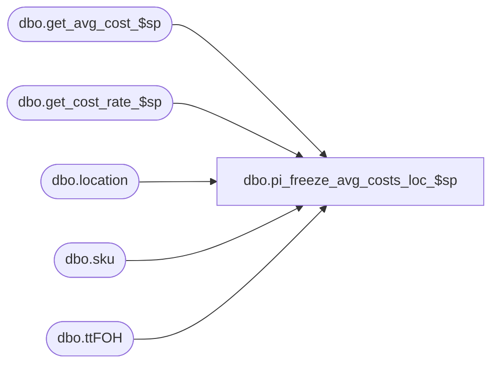

# dbo.pi_freeze_avg_costs_loc_$sp

**Database:** me_01  
**Server:** bedrockdb02  

## Architecture Diagram



## Table Dependencies

| Referenced Table |
|---|
| dbo.get_avg_cost_$sp |
| dbo.get_cost_rate_$sp |
| dbo.location |
| dbo.sku |
| dbo.ttFOH |

## Stored Procedure Code

```sql
CREATE PROCEDURE [dbo].[pi_freeze_avg_costs_loc_$sp]

	(
		 @LocId AS SMALLINT
		,@CountDate AS DATETIME
	)

AS

/*
Proc name: pi_freeze_avg_costs_loc_$sp

Description:

For the given location on the inventory control document, a snapshot of the ib_inventory_total table has been taken.
Any future on hand has also been removed from this snapshot.
For each entry in the #tt_frozen_on_hand table, we want to store the average cost of the style/location


HISTORY:
Date       		Name         		Def#			Desc
November 22,2006   	Jacqueline Lin		80360			Ported over 3.0 def. 63923 - merch:im:physical inventory performance changes.
August 17, 2007		Jacqueline Lin		87883			physical inv posts ib with wrong xaction cost when im default cost = average cost.
April 29,2008		Jacqueline Lin		100719			pi erroring out trying to use sum(on_hand_units) as denominator of division oper.
Jan 26, 2010		Feng				Multi-currency	include average_cost_local field
April 26, 2010		Feng				clean up non-used variable
May 15,2016			Ivan Dimitrov		DMER-915 - physical inventory average cost calculation is not accurate
*/

BEGIN

	DECLARE
		 @AvgCostType AS SMALLINT
		,@ExchangeRate AS FLOAT
		,@JurisdictionId AS SMALLINT


	SET @JurisdictionId = (SELECT L.jurisdiction_id FROM dbo.location L WHERE L.location_id = @LocId)


-----------------------------------------------------------------------------------------------------------------------------
--	Determine exchange rate
-----------------------------------------------------------------------------------------------------------------------------

	EXEC sp_executesql
		N'SELECT
			@ParamExchangeRate = exchange_rate
		  FROM
			currency_conversion
		  WHERE
			to_currency_id =
				( SELECT
					currency_id from_currency_id
				  FROM
					country
					, jurisdiction
					, location
				  WHERE
					location.jurisdiction_id = jurisdiction.jurisdiction_id
					AND country.country_id= jurisdiction.country_id
					AND location.location_id = @ParamLocId )
			AND from_currency_id =
				( SELECT
					currency_id to_currency_id
				  FROM
					country
					, jurisdiction
				  WHERE
					country.country_id= jurisdiction.country_id
					AND jurisdiction.home_jurisdiction_flag = 1 )
			AND effective_from_date <= @ParamCountDate
			AND (effective_to_date >= @ParamCountDate OR effective_to_date IS NULL)
			AND currency_conversion_type = 1'
		, N'@ParamExchangeRate AS FLOAT OUTPUT
		  , @ParamLocId AS SMALLINT
		  , @ParamCountDate AS DATETIME'
		, @ParamExchangeRate = @ExchangeRate OUTPUT
		, @ParamLocId = @LocId
		, @ParamCountDate = @CountDate


-----------------------------------------------------------------------------------------------------------------------------
--	Error Trapping: Check If Temp Table(s) Already Exist(s) And Drop If Applicable
-----------------------------------------------------------------------------------------------------------------------------

IF OBJECT_ID (N'tempdb.dbo.#temp_avg_costs', N'U') IS NOT NULL
BEGIN

	DROP TABLE dbo.#temp_avg_costs

END


IF OBJECT_ID (N'tempdb.dbo.#temp_wrk_avg_cost_lookup', N'U') IS NOT NULL
BEGIN

	DROP TABLE dbo.#temp_wrk_avg_cost_lookup

END


IF OBJECT_ID (N'tempdb.dbo.#temp_wrk_cost_rate_lookup',  N'U') IS NOT NULL
BEGIN

	DROP TABLE dbo.#temp_wrk_cost_rate_lookup

END


IF OBJECT_ID (N'tempdb.dbo.#temp_cost_rates',  N'U') IS NOT NULL
BEGIN

	DROP TABLE dbo.#temp_cost_rates

END


-----------------------------------------------------------------------------------------------------------------------------
--	Table Create: Create Table Shells
-----------------------------------------------------------------------------------------------------------------------------

CREATE TABLE dbo.#temp_avg_costs

	(
		 location_id SMALLINT NULL
		,sku_id DECIMAL (13, 0) NULL
		,avg_cost DECIMAL (18, 6) NULL
		,avg_cost_local DECIMAL (18, 6) NULL
		,sum_units int NULL
		,sum_cost DECIMAL (18, 6) NULL
		,sum_cost_local DECIMAL (18, 6) NULL
	)


CREATE TABLE dbo.#temp_wrk_avg_cost_lookup

	(
		 jurisdiction_id SMALLINT NULL
		,location_id SMALLINT NULL
		,style_id DECIMAL (12, 0) NULL
		,sku_id DECIMAL (13, 0) NULL
	)


CREATE TABLE dbo.#temp_wrk_cost_rate_lookup

	(
		jurisdiction_id SMALLINT NULL
		,transaction_date SMALLDATETIME NULL
	)


CREATE TABLE dbo.#temp_cost_rates

	(
			jurisdiction_id SMALLINT NULL
		,transaction_date SMALLDATETIME NULL
		,cost_rate FLOAT NULL
	)


-----------------------------------------------------------------------------------------------------------------------------
--	Table Update: Populate "#temp_wrk_cost_rate_lookup" Table
-----------------------------------------------------------------------------------------------------------------------------

INSERT INTO dbo.#temp_wrk_cost_rate_lookup

	(
		jurisdiction_id
		,transaction_date
	)

SELECT
	 @JurisdictionId AS jurisdiction_id
	,@CountDate AS transaction_date


-----------------------------------------------------------------------------------------------------------------------------
--	Call Procedure: Call "get_cost_rate_$sp" Procedure
-----------------------------------------------------------------------------------------------------------------------------

EXECUTE dbo.get_cost_rate_$sp


-----------------------------------------------------------------------------------------------------------------------------
--	Table Update: Populate "#temp_wrk_avg_cost_lookup" Table
-----------------------------------------------------------------------------------------------------------------------------

INSERT INTO dbo.#temp_wrk_avg_cost_lookup

	(
		 jurisdiction_id
		,location_id
		,style_id
		,sku_id
	)

SELECT
	 L.jurisdiction_id
	,sqDLS.location_id
	,SK.style_id
	,sqDLS.sku_id
FROM

	(
		SELECT DISTINCT
			 ttFOH.location_id
			,ttFOH.sku_id
		FROM
			#tt_frozen_on_hand ttFOH
	) sqDLS

	INNER JOIN dbo.location L ON L.location_id = sqDLS.location_id
	INNER JOIN dbo.sku SK ON SK.sku_id = sqDLS.sku_id


-----------------------------------------------------------------------------------------------------------------------------
--	Call Procedure: Call "get_avg_cost_$sp" Procedure
-----------------------------------------------------------------------------------------------------------------------------

EXECUTE dbo.get_avg_cost_$sp

	@Date = @CountDate


-----------------------------------------------------------------------------------------------------------------------------
--	Table Update: Update Average Cost Values
-----------------------------------------------------------------------------------------------------------------------------

UPDATE
	ttFOH
SET
	 ttFOH.average_cost = ttAC.avg_cost
	,ttFOH.average_cost_local = ttAC.avg_cost_local
FROM
	#tt_frozen_on_hand ttFOH
	INNER JOIN dbo.#temp_avg_costs ttAC ON ttAC.location_id = ttFOH.location_id
		AND ttAC.sku_id = ttFOH.sku_id


-----------------------------------------------------------------------------------------------------------------------------
--	Retrieve current costs of the primary vendor for style/location combinations that do not have a valid average cost or a last net final po cost
-----------------------------------------------------------------------------------------------------------------------------

	EXEC sp_executesql
		N'UPDATE
			#tt_frozen_on_hand
		  SET
			#tt_frozen_on_hand.average_cost = AVG_COST.average_cost
		  FROM
			( SELECT
				#tt_frozen_on_hand.sku_id
				, #tt_frozen_on_hand.location_id
				, #tt_frozen_on_hand.inventory_status_id
				, style_vendor.current_cost * @theExchangeRate average_cost
			  FROM
				#tt_frozen_on_hand
				, style_vendor
				, sku
			  WHERE
				#tt_frozen_on_hand.sku_id = sku.sku_id
				AND sku.style_id = style_vendor.style_id
				AND style_vendor.primary_vendor_flag = 1
				AND #tt_frozen_on_hand.average_cost IS NULL
				AND #tt_frozen_on_hand.location_id = @ParamLocId ) AVG_COST
		  WHERE
			#tt_frozen_on_hand.sku_id = AVG_COST.sku_id
			AND #tt_frozen_on_hand.location_id = AVG_COST.location_id
			AND #tt_frozen_on_hand.inventory_status_id = AVG_COST.inventory_status_id'
		, N'@ParamLocId AS SMALLINT, @theExchangeRate AS FLOAT'
		, @ParamLocId = @LocId
		, @theExchangeRate = @ExchangeRate

	EXEC sp_executesql
		N'UPDATE
			#tt_frozen_on_hand
		  SET
			#tt_frozen_on_hand.average_cost_local = AVG_COST.average_cost_local
		  FROM
			( SELECT
				#tt_frozen_on_hand.sku_id
				, #tt_frozen_on_hand.location_id
				, #tt_frozen_on_hand.inventory_status_id
				, style_vendor.current_cost average_cost_local
			  FROM
				#tt_frozen_on_hand
				, style_vendor
				, sku
			  WHERE
				#tt_frozen_on_hand.sku_id = sku.sku_id
				AND sku.style_id = style_vendor.style_id
				AND style_vendor.primary_vendor_flag = 1
				AND #tt_frozen_on_hand.average_cost_local IS NULL
				AND #tt_frozen_on_hand.location_id = @ParamLocId ) AVG_COST
		  WHERE
			#tt_frozen_on_hand.sku_id = AVG_COST.sku_id
			AND #tt_frozen_on_hand.location_id = AVG_COST.location_id
			AND #tt_frozen_on_hand.inventory_status_id = AVG_COST.inventory_status_id'
		, N'@ParamLocId AS SMALLINT'
		, @ParamLocId = @LocId

END
```

