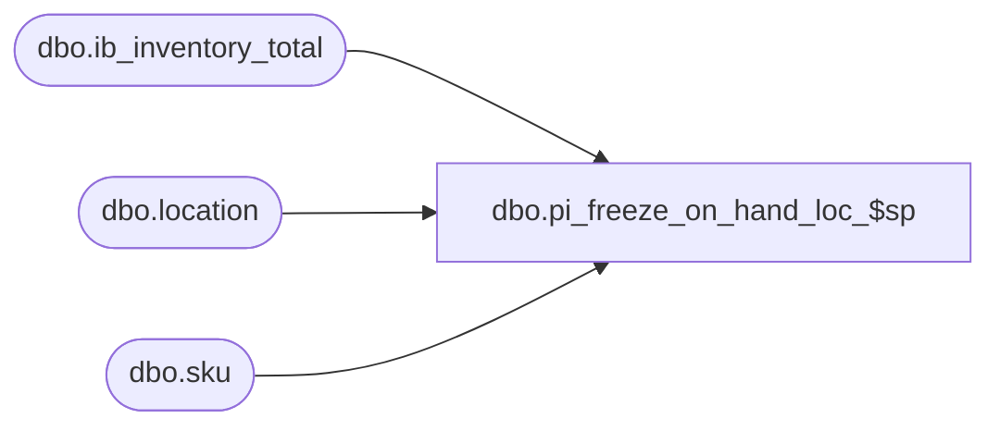

# dbo.pi_freeze_on_hand_loc_$sp

**Database:** me_01  
**Server:** bedrockdb02  

## Architecture Diagram



## Table Dependencies

| Referenced Table |
|---|
| dbo.ib_inventory_total |
| dbo.location |
| dbo.sku |

## Stored Procedure Code

```sql
CREATE PROC [dbo].[pi_freeze_on_hand_loc_$sp] 
	( @LocId SMALLINT
	, @MaxId DECIMAL(13,0) OUTPUT )
WITH RECOMPILE
AS

/*
Proc name: pi_freeze_on_hand_loc_$sp

Description: 

For the given location on the inventory control document, a snapshot of the ib_inventory_total table is taken.
The snapshot is valid only if the maximum ib_inventory_id remains the before and after the snapshot.
Once a valid snaphot has been taken, the procedure returns the maximum ib_inventory_id which is stored later in the inventory_control_loc table.

R3 version

HISTORY:
Date       		Name         		Def#			Desc
November 22,2006   	Jacqueline Lin		80360			Ported over 3.0 def. 63923 - merch:im:physical inventory performance changes.   	
August 17 2007		Jacqueline Lin		87883			physical inv posts ib with wrong xaction cost when im default cost = average cost.
December 5 2007		Yves Rivest		95808			Removed the extra insert of SKUs with 0 on-hand.
Jan. 29 2010		Feng			Multi-currency mod. 	add jurisdiction level insert
Dec 15, 2010		Ivan Dimitrov		1-123081		inventory count loading running for to a long time
Jan 18, 2011		Ivan Dimitrov		124182 - cannot import or recalculate count when average cost type = chain
*/

BEGIN

	DECLARE @PreMaxId AS DECIMAL(13,0)
	DECLARE @PostMaxId AS DECIMAL(13,0)
    DECLARE @AvgCostType AS SMALLINT
	DECLARE @JurisdictionId AS SMALLINT
	
	DECLARE @Flag AS BIT

	SET @PreMaxId = 0
	SET @PostMaxId = 0
	SET @Flag = 0

	EXEC dbo.sp_executesql
		N'TRUNCATE TABLE #tt_frozen_on_hand'

	EXEC dbo.sp_executesql
		N'TRUNCATE TABLE #tt_frozen_chain_on_hand'	

	EXEC dbo.sp_executesql
		N'TRUNCATE TABLE #tt_frozen_juris_on_hand'	
	
    -- DEFECT 87883
    -- Retrieve the method of average cost calculation being used
    -- 1: average cost by location
    -- 2: average cost by chain
	EXEC sp_executesql 
		N' SELECT @ParamAvgCostType = ib_average_cost_location_level FROM parameter_system' 
		, N'@ParamAvgCostType AS SMALLINT OUTPUT'
		, @ParamAvgCostType = @AvgCostType OUTPUT

	WHILE (@Flag <> 1)
		BEGIN

			-- Store the maximum ib_inventory_id prior to taking the snapshot
			EXEC dbo.sp_executesql
				N'SELECT @ParamPreMaxId = COALESCE(MAX(ib_inventory_id), 0) FROM ib_inventory'
				, N'@ParamPreMaxId AS DECIMAL(13,0) OUTPUT'
				, @ParamPreMaxId = @PreMaxId OUTPUT

			-- Take snapshot and store values in #tt_frozen_on_hand table.
			-- The ib_inventory_total table is joined to the #tt_sku table to ensure we are only freezing values for valid skus
--- added by gd
			EXEC dbo.sp_executesql
				N'update statistics #tt_sku'
--- added end
			INSERT INTO
					#tt_frozen_on_hand
						( sku_id
						, location_id
						, inventory_status_id
						, on_hand_units
						, on_hand_cost
						, on_hand_cost_local
						, on_hand_valuation_retail
						, on_hand_selling_retail )
					SELECT
						#tt_sku.sku_id
						, location_id
						, inventory_status_id
						, total_on_hand_units on_hand_units
						, total_on_hand_cost on_hand_cost
						, total_on_hand_cost_local on_hand_cost_local
						, total_on_hand_valuation_retail on_hand_valuation_retail
						, total_on_hand_selling_retail on_hand_selling_retail
					FROM
						ib_inventory_total
						, #tt_sku
					WHERE
						ib_inventory_total.sku_id = #tt_sku.sku_id
						AND location_id = @LocId
					ORDER BY
						#tt_sku.sku_id
						, location_id
						, inventory_status_id
					OPTION(RECOMPILE)
					


			IF (@AvgCostType = 2)
				BEGIN
					INSERT INTO
						#tt_frozen_chain_on_hand
							( style_id
							, chain_on_hand_units
							, chain_on_hand_cost
							, chain_on_hand_cost_local )
					  SELECT
						sku.style_id
						, SUM(total_on_hand_units) chain_on_hand_units
						, SUM(total_on_hand_cost) chain_on_hand_cost
						, SUM(total_on_hand_cost_local) chain_on_hand_cost_local
					  FROM
						sku
						, ib_inventory_total
						, #tt_sku
					  WHERE
						ib_inventory_total.sku_id = #tt_sku.sku_id
						AND #tt_sku.sku_id = sku.sku_id
					  GROUP BY
						sku.style_id
					 OPTION(RECOMPILE)
			    
			    END
			ELSE IF (@AvgCostType = 3)
				BEGIN
					EXEC sp_executesql 
						N' SELECT @ParamJurisdictionId = jurisdiction_id FROM location WHERE location_id = @ParamLocId' 
						, N'@ParamJurisdictionId AS SMALLINT OUTPUT, @ParamLocId SMALLINT'
						, @ParamJurisdictionId = @JurisdictionId OUTPUT
						, @ParamLocId = @LocId
						
					INSERT INTO
						#tt_frozen_juris_on_hand
							( style_id
							, jurisdiction_id
							, juris_on_hand_units
							, juris_on_hand_cost 
							, juris_on_hand_cost_local)
					  SELECT
						sku.style_id
						, location.jurisdiction_id
						, SUM(total_on_hand_units) juris_on_hand_units
						, SUM(total_on_hand_cost) juris_on_hand_cost
						, SUM(total_on_hand_cost_local) juris_on_hand_cost_local
					  FROM
						sku
						, ib_inventory_total
						, #tt_sku
						, location
					  WHERE
						ib_inventory_total.sku_id = #tt_sku.sku_id
						AND #tt_sku.sku_id = sku.sku_id
						AND location.jurisdiction_id = @JurisdictionId
						AND location.location_id = ib_inventory_total.location_id
					  GROUP BY
						sku.style_id,
						location.jurisdiction_id
					OPTION(RECOMPILE)
				END
				
			-- Store the maximum ib_inventory_id after taking the snapshot			
			EXEC dbo.sp_executesql
				N'SELECT @ParamPostMaxId = COALESCE(MAX(ib_inventory_id), 0) FROM ib_inventory'
				, N'@ParamPostMaxId AS DECIMAL(13,0) OUTPUT'
				, @ParamPostMaxId = @PostMaxId OUTPUT
			
			-- If the maximum ib_inventory_id is the same before and after the snapshot, then the snapshot is accurate		
			IF (@PreMaxId = @PostMaxId) 
				SET @Flag = 1
				-- If the maximum ib_inventory_id is not the same before and after the snapshot, then the snapshot is invalid
				-- and the #tt_frozen_on_hand table is truncated			
			ELSE
				EXEC dbo.sp_executesql
					N'TRUNCATE TABLE #tt_frozen_on_hand'
		END

						
	SET @MaxId = @PostMaxId

END
```

