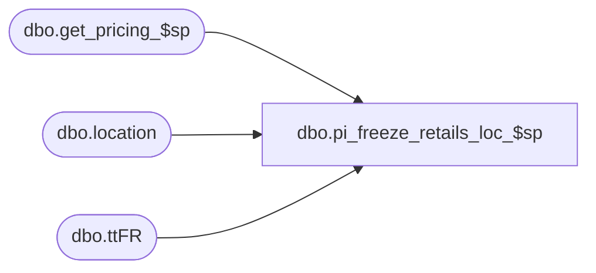

# dbo.pi_freeze_retails_loc_$sp

**Database:** me_01  
**Server:** bedrockdb02  

## Architecture Diagram



## Table Dependencies

| Referenced Table |
|---|
| dbo.get_pricing_$sp |
| dbo.location |
| dbo.ttFR |

## Stored Procedure Code

```sql
CREATE PROCEDURE dbo.pi_freeze_retails_loc_$sp

	(
		 @MaxRetailId AS DECIMAL (13, 0) = NULL -- FYI: No longer needed and should be removed at a later point
		,@CountDate AS DATETIME
		,@LocId AS SMALLINT
	)

AS

SET NOCOUNT ON

--Description: For the data combinations stored in the #tt_frozen_retails table, retrieve the current effective retail.

-----------------------------------------------------------------------------------------------------------------------------
--	Declarations / Sets: Declare And Set Variables
-----------------------------------------------------------------------------------------------------------------------------

DECLARE @JurisdictionId AS SMALLINT


SET @JurisdictionId = (SELECT L.jurisdiction_id FROM dbo.location L WHERE L.location_id = @LocId)


-----------------------------------------------------------------------------------------------------------------------------
--	Error Trapping: Check If Temp Table(s) Already Exist(s) And Drop If Applicable
-----------------------------------------------------------------------------------------------------------------------------

IF OBJECT_ID (N'tempdb.dbo.#temp_pi_prices', N'U') IS NOT NULL
BEGIN

	DROP TABLE dbo.#temp_pi_prices

END


IF OBJECT_ID (N'tempdb.dbo.#temp_wrk_price_lookup', N'U') IS NOT NULL
BEGIN

	DROP TABLE dbo.#temp_wrk_price_lookup

END


-----------------------------------------------------------------------------------------------------------------------------
--	Table Create: Create Table Shells
-----------------------------------------------------------------------------------------------------------------------------

CREATE TABLE dbo.#temp_pi_prices

	(
		 location_id SMALLINT NULL
		,sku_id DECIMAL (13, 0) NULL
		,price_status_id SMALLINT NULL
		,valuation_unit_retail DECIMAL (14, 2) NULL
		,selling_unit_retail DECIMAL (14, 2) NULL
	)


CREATE TABLE dbo.#temp_wrk_price_lookup

	(
		 jurisdiction_id SMALLINT NULL
		,location_id SMALLINT NULL
		,style_id DECIMAL (12, 0) NULL
		,color_id SMALLINT NULL
		,style_color_id DECIMAL (13, 0) NULL
		,sku_id DECIMAL (13, 0) NULL
	)


-----------------------------------------------------------------------------------------------------------------------------
--	Work Table For get_pricing
-----------------------------------------------------------------------------------------------------------------------------

INSERT INTO dbo.#temp_wrk_price_lookup

	(
		 jurisdiction_id
		,location_id
		,style_id
		,color_id
		,style_color_id
		,sku_id
	)

SELECT
	 ttFR.jurisdiction_id
	,ttFR.location_id
	,ttFR.style_id
	,ttFR.color_id
	,ttFR.style_color_id
	,ttFR.sku_id
FROM
	#tt_frozen_retails ttFR
WHERE
	ttFR.location_id = @LocId


-----------------------------------------------------------------------------------------------------------------------------
--	First, try to retrieve retails from ib_price for entries with a date less than or equal to the count date
-----------------------------------------------------------------------------------------------------------------------------

EXECUTE dbo.get_pricing_$sp

	 @Date = @CountDate
	,@Exclude_NULL_Results = 1
	,@Group_ID = NULL
	,@Include_Exception_Color = 1
	,@Include_Exception_Color_Location = 1
	,@Include_Exception_Color_SKU = 1
	,@Include_Exception_Color_SKU_Location = 1
	,@Include_Exception_Location = 1
	,@Include_Exception_None = 1
	,@Output_All_Exception_Values = 0 -- Not Longer Used, Needs To Be Removed From Procedure And Application Code
	,@Price_Change_ID = NULL
	,@Results_To_Table = 0
	,@Temp_Price_Flag = 0
	,@Use_PC_Instruction_Mode = 0
	,@Use_Start_Date = 0
	,@Sales_Posting_Mode = NULL
	,@Use_PI_Mode = 1


UPDATE
	ttFR
SET
	 ttFR.price_status_id = ttPIP.price_status_id
	,ttFR.valuation_unit_retail = ttPIP.valuation_unit_retail
	,ttFR.selling_unit_retail = ttPIP.selling_unit_retail
FROM
	#tt_frozen_retails ttFR
	INNER JOIN dbo.#temp_pi_prices ttPIP ON ttPIP.location_id = ttFR.location_id
		AND ttPIP.sku_id = ttFR.sku_id
```

